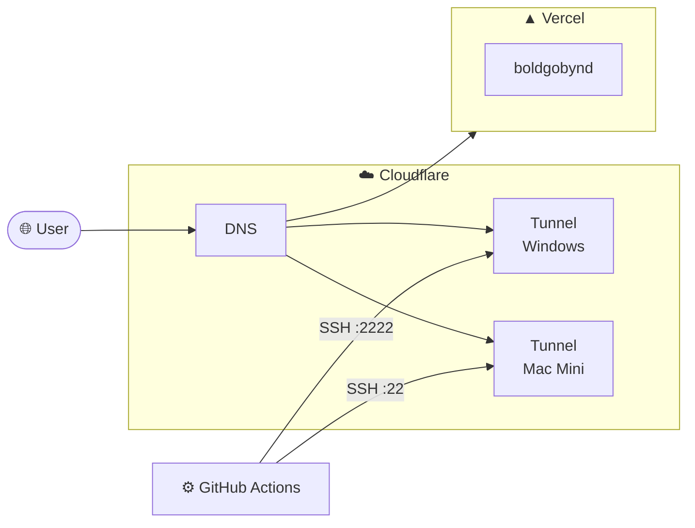
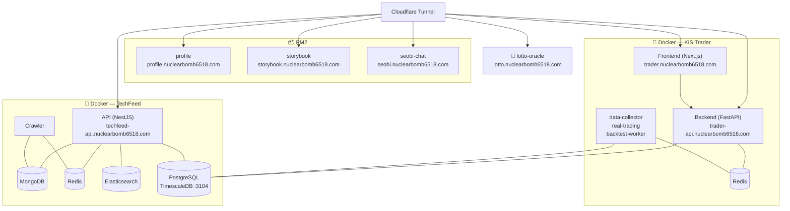
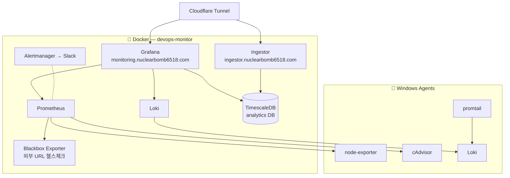

# Infrastructure

> 홈 서버 기반 자체 운영 인프라. 모든 외부 노출은 Cloudflare Tunnel 경유.

---

## 전체 네트워크 구조

---

## Windows Server — 서비스

---

## Mac Mini — DevOps Monitor

---

상세 정보 → [services.md](./services.md)
