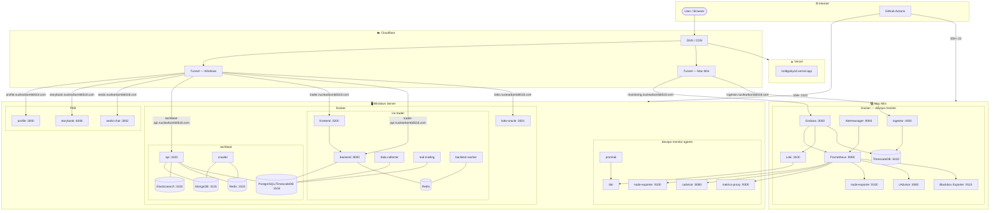

# Infrastructure Architecture

```mermaid
graph TB
    subgraph Internet["🌐 Internet"]
        User([User / Browser])
        GHA[GitHub Actions]
    end

    subgraph CF["☁️ Cloudflare"]
        DNS[DNS / CDN]
        TunnelWin[Tunnel — Windows]
        TunnelMac[Tunnel — Mac Mini]
    end

    subgraph Vercel["▲ Vercel"]
        boldgobynd[boldgobynd.vercel.app]
    end

    subgraph Windows["🖥 Windows Server"]
        subgraph PM2["PM2"]
            profile[profile :3000]
            storybook[storybook :6006]
            seobi[seobi-chat :3002]
        end

        subgraph DockerWin["Docker"]
            subgraph TechFeed["techfeed"]
                tf_api[api :3100]
                tf_crawler[crawler]
                tf_mongo[(MongoDB :3101)]
                tf_es[(Elasticsearch :3102)]
                tf_redis[(Redis :3103)]
                tf_pg[(PostgreSQL/TimescaleDB :3104)]
            end

            subgraph KisTrader["kis-trader"]
                kt_front[frontend :3200]
                kt_back[backend :8000]
                kt_collector[data-collector]
                kt_trading[real-trading]
                kt_backtest[backtest-worker]
                kt_redis[(Redis)]
            end

            lotto[lotto-oracle :3001]
        end

        subgraph AgentsWin["devops-monitor agents"]
            node_exp_win[node-exporter :9100]
            cadvisor_win[cadvisor :8080]
            loki_win[loki]
            promtail[promtail]
            metrics_proxy[metrics-proxy :9300]
        end
    end

    subgraph Mac["💻 Mac Mini"]
        subgraph DockerMac["Docker — devops-monitor"]
            grafana[Grafana :3000]
            prometheus[Prometheus :9090]
            loki_mac[Loki :3100]
            alertmanager[Alertmanager :9093]
            timescaledb[(TimescaleDB :5432)]
            ingestor[ingestor :4000]
            blackbox[Blackbox Exporter :9115]
            node_exp_mac[node-exporter :9100]
            cadvisor_mac[cAdvisor :8080]
        end
    end

    %% Internet → Cloudflare
    User --> DNS
    DNS --> TunnelWin
    DNS --> TunnelMac
    DNS --> Vercel

    %% Cloudflare → Windows services
    TunnelWin -->|profile.nuclearbomb6518.com| profile
    TunnelWin -->|storybook.nuclearbomb6518.com| storybook
    TunnelWin -->|seobi.nuclearbomb6518.com| seobi
    TunnelWin -->|techfeed-api.nuclearbomb6518.com| tf_api
    TunnelWin -->|trader.nuclearbomb6518.com| kt_front
    TunnelWin -->|trader-api.nuclearbomb6518.com| kt_back
    TunnelWin -->|lotto.nuclearbomb6518.com| lotto

    %% Cloudflare → Mac services
    TunnelMac -->|monitoring.nuclearbomb6518.com| grafana
    TunnelMac -->|ingestor.nuclearbomb6518.com| ingestor

    %% GitHub Actions → SSH deploy
    GHA -->|SSH :2222| Windows
    GHA -->|SSH :22| Mac

    %% TechFeed internal
    tf_api --- tf_mongo
    tf_api --- tf_es
    tf_api --- tf_redis
    tf_api --- tf_pg
    tf_crawler --- tf_mongo
    tf_crawler --- tf_redis

    %% KIS Trader internal
    kt_front --> kt_back
    kt_back --- tf_pg
    kt_back --- kt_redis
    kt_collector --- tf_pg
    kt_trading --- tf_pg
    kt_backtest --- kt_redis

    %% devops-monitor internal
    prometheus --> node_exp_win
    prometheus --> cadvisor_win
    prometheus --> metrics_proxy
    prometheus --> node_exp_mac
    prometheus --> cadvisor_mac
    prometheus --> blackbox
    loki_mac --> loki_win
    promtail --> loki_win
    grafana --> prometheus
    grafana --> loki_mac
    grafana --> timescaledb
    ingestor --> timescaledb
    alertmanager --> prometheus
```
