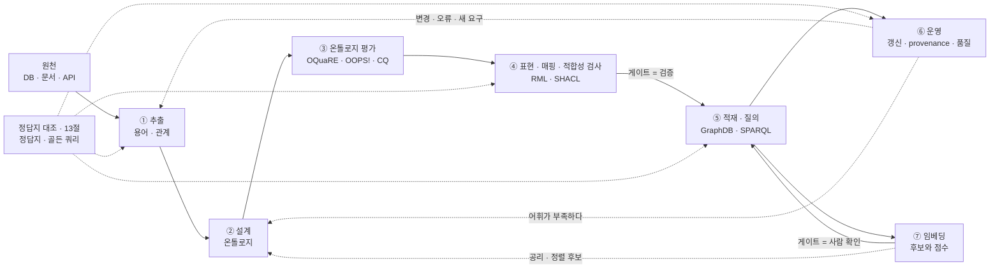
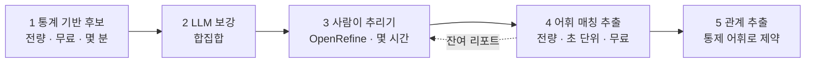
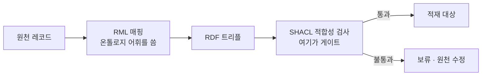
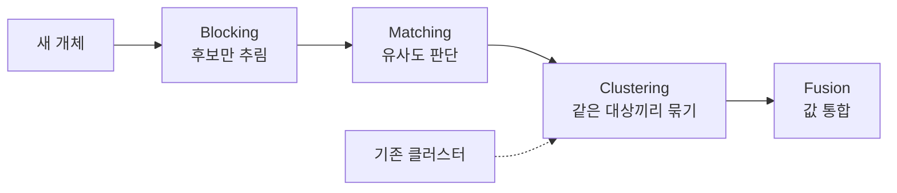
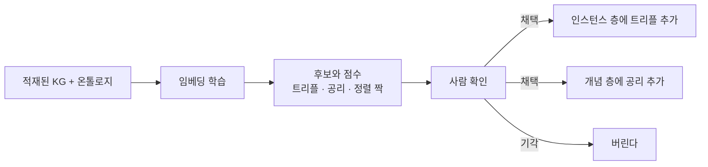

# 온톨로지 · 지식그래프 파이프라인

> 2026-08-19 | 온톨로지, 지식그래프, RDF, SHACL, 임베딩, 파이프라인

이 폴더의 회차 노트를 하나의 파이프라인으로 꿰어 놓은 문서다. 강의는 원론 위주라, 여기서는 각
단계에 실제로 쓰는 도구를 같이 적었다. 자세한 내용은 회차 노트로 링크한다.

도구 표의 **★**는 지금 주력으로 쓰이는 것이다. 표시가 없는 것은 여전히 동작하지만 오래됐거나
다른 것으로 대체되는 중이라, 신규로 고를 이유가 있는지 따져볼 자리다. 어느 자리에 무엇이 있는지
잡아두기 위한 목록이므로, 실제로 고를 때는 현재 버전과 유지보수 상태를 확인할 것.

---

## 1. 온톨로지

개념과 관계와 규칙을 명시적으로 정의한 설계도다. 데이터가 아니라 데이터의 의미를 적는다.

```
Customer  places      Order
Order     contains    Product
Product   belongsTo   Category
```

하는 일이 셋으로 갈린다.

| | 묻는 것 |
|---|---|
| 스키마 | 무엇을 어떻게 표현할 것인가. 클래스·속성·계층 |
| 제약 | 어떤 조건을 만족해야 하는가. 배타성·범위·개수 |
| 추론 | 명시되지 않은 무엇을 도출할 수 있는가 |

**주의.** 가운데 제약은 이름과 달리 강제하지 않는다. OWL은 열린 세계 가정이라 위반해도 에러가
아니라 추론이 일어난다. 막는 일은 SHACL이 한다.
[S09-1](S09-1-제약처럼-보이는-공리들.md) ·
[S11-1 1절](S11-1-온톨로지가-하지-않는-일.md#1-온톨로지는-입력-게이트가-아니다)

## 2. 지식그래프

온톨로지의 의미 구조 위에 실제 개체와 관계를 채운 그래프다. `G = {E, R, F}`로 쓴다. 개체 집합,
관계 집합, `(head, relation, tail)` 형태의 사실 집합.

```
김한결      places      주문 #A1024
주문 #A1024 contains    Galaxy S25
Galaxy S25  belongsTo   스마트폰
```

노드가 식별 가능한 개체를 가리키고 엣지가 의미가 정의된 관계라는 점이 그냥 그래프와 다르다.

[S11 1~6절](S11-지식그래프-기초-개념.md)

## 3. 둘의 관계

같은 모양의 문장인데 층이 다르다.

| | 층 | 예시 |
|---|---|---|
| 온톨로지 | 개념 | 고객은 주문을 생성하고, 주문은 상품을 포함한다 |
| 지식그래프 | 개체 | 김민수가 주문 #A1024를 생성했고 거기에 Galaxy S25가 포함되어 있다 |

지식그래프가 데이터와 관계와 의미 구조라면, 온톨로지는 거기에 의미와 추론 능력을 부여하는
레이어다.

되먹임은 한 방향이 아니다. 온톨로지가 KG에 어휘와 추론 규칙을 주고, KG에 쌓인 인스턴스와 사용
기록이 거꾸로 온톨로지의 빈 곳을 드러낸다. 다만 **개별 사실이 온톨로지를 바꾸지는 않는다.**
표현할 어휘가 없거나 분류할 클래스가 없을 때만 바뀌고, 그 판단은 사람이 한다.

[S11-1 3절](S11-1-온톨로지가-하지-않는-일.md#3-온톨로지가-바뀌는-때)

## 4. 이름이 섞이는 자리

### 층 — 표준과 제품과 내용물

셋이 다른 층에 있다.

| 층 | 무엇인가 | 예 |
|---|---|---|
| 데이터 모델·표준 | 명세서. 소프트웨어가 아니다 | RDF · OWL · SPARQL · SHACL / LPG · Cypher |
| 그래프 DB 제품 | 설치해서 돌리는 저장 엔진 | GraphDB · Virtuoso · Jena Fuseki · Stardog · Neptune / Neo4j · Memgraph |
| 지식그래프 | 실제로 채워진 내용물 | DBpedia · Wikidata · YAGO / 사내 도메인 KG |

관계형에 비유하면 RDF와 SPARQL이 관계형 모델과 SQL, GraphDB와 Neo4j가 PostgreSQL과 MySQL,
DBpedia와 Wikidata가 그 안에 적재된 데이터다.

RDF와 LPG 중 무엇을 고를지는 엣지에 속성이 필요한지, 그래프 알고리즘을 돌릴 것인지, 표준
상호운용이 필요한지로 갈린다. 흔히 거론되는 시각화는 기준이 아니다.

### 용어 — 같은 것을 다르게 부른다

같은 대상을 계보마다 다른 이름으로 부른다. 회차 노트를 옮겨 다니면 이 대응부터 걸린다.

| 가리키는 것 | 지식그래프 · 임베딩 | 온톨로지 · 기술논리 | RDF · OWL |
|---|---|---|---|
| 개별 대상 | entity · node · head/tail | individual · instance | `owl:NamedIndividual` |
| 개념 · 부류 | entity type | class · concept | `owl:Class` · `rdfs:Class` |
| 개체를 잇는 것 | relation · edge | object property · role | `owl:ObjectProperty` |
| 값을 붙이는 것 | attribute | data property | `owl:DatatypeProperty` |
| 문장 하나 | triple `(h, r, t)` · fact | assertion · axiom | `(subject, predicate, object)` |
| 개체 층 | instance 층 | A-Box | |
| 개념 층 | schema | T-Box | |

`(h, r, t)`는 head · relation · tail이고 `(s, p, o)`는 subject · predicate · object다. 같은
자리를 가리키는데, 임베딩 논문은 앞을, RDF 표준은 뒤를 쓴다.
[S13](S13-KG-임베딩-기초.md) · [S15A 2절](S15A-OWL2Vec-star-문장-기반-임베딩.md)

**대응이 어긋나는 자리가 셋 있다.** 표만 보고 바꿔 쓰면 틀린다.

**relation과 property는 같지 않다.** OWL property는 domain과 range를 선언할 수 있고 역관계나
전이성 같은 성질도 붙는다. 그 선언이 추론의 재료가 된다. 반면 KG 임베딩의 relation은 엣지의
종류를 가리키는 이름표에 가깝고, 성질은 선언하는 것이 아니라 **모델이 표현할 수 있느냐의 문제로
바뀐다.** TransE가 대칭 관계를 표현하지 못하는 것이 그 예다.
[S13](S13-KG-임베딩-기초.md) · [S14B](S14B-CompGCN-합성-기반-관계-표현.md)

**fact와 axiom이 갈린다.** fact는 개체에 대한 주장이고(A-Box), axiom은 개념에 대한 규칙이다
(T-Box). 한국어로 옮기면 둘 다 "사실"이나 "규칙"이 되어 버려서 섞이기 쉽다. **어느 층의
이야기인지를 먼저 보는 편이 낫다.**

**entity가 class를 가리키기도 한다.** Wikidata에서 `Q5`(human)는 item이면서 동시에 class다.
그래서 "entity alignment"와 "ontology alignment"가 다른 일이 된다. 앞은 개체를, 뒤는 개념을
짝짓는다. [S16A 1절](S16A-OntoEA-온톨로지를-넣은-엔티티-정렬.md)

**비슷한 일을 부르는 이름도 여럿이다.** 분야마다 따로 발전해서 그렇다.

| 하는 일 | 불리는 이름들 |
|---|---|
| 두 KG에서 같은 개체 찾기 | entity alignment · entity resolution · record linkage · 개체 통합 · deduplication |
| 두 온톨로지에서 같은 개념 찾기 | ontology alignment · ontology matching · schema matching |
| 빠진 사실 채우기 | link prediction · KG completion |
| 빠진 공리 채우기 | subsumption prediction · ontology completion |

첫 줄이 11절의 증분 개체 통합과 12절의 정렬이 같은 자리인 이유다. 부르는 이름이 달랐을 뿐이다.

## 5. 파이프라인 전체 그림

**KG를 드나드는 경로가 셋이다.** 무엇이 게이트인지가 셋 다 다르다.

| 경로 | 흐름 | 게이트 | 출력의 성격 |
|---|---|---|---|
| 확정 사실 | 추출 → 설계 → 매핑 → 적합성 검사 → 적재 | SHACL 검증 | 참으로 취급한다 |
| 추측 | 임베딩 학습 → 후보와 점수 → 사람 확인 → 적재 | 사람 확인 | 후보일 뿐이다 |
| 질의 | SPARQL · GraphRAG | 없음 | 꺼내 쓰는 쪽 |



**⑦은 나머지와 성격이 다르다.** ①~⑥이 한 줄로 이어지는 단계라면 ⑦은 적재된 KG를 먹고 후보를
내놓는 옆 갈래다. 그래도 같은 그림에 두는 이유는 **결과가 결국 같은 KG로 들어가기 때문이다.**
들어가는 문이 다를 뿐이다.

**비슷해 보이는 세 가지를 먼저 갈라둔다.** 이름이 다 "검사" 계열이라 섞이기 쉽다.

| | 무엇을 보는가 | 기준 | 안 맞으면 |
|---|---|---|---|
| 온톨로지 평가 (8절) | 온톨로지 자체. 어휘와 구조 | CQ · 구조 지표 · pitfall 목록 | 온톨로지를 고친다 |
| 적합성 검사 (9절) | 들어오려는 인스턴스 데이터 | SHACL shape | 적재를 막는다 |
| 정답지 대조 (13절) | 각 단계가 내놓은 산출물 | 사람이 만든 정답지 · 골든 쿼리 | 그 단계를 손본다 |

보는 대상이 온톨로지 · 데이터 · 산출물로 각각 다르고, 이 셋 중 게이트는 적합성 검사
하나뿐이다. 임베딩 후보를 거르는 사람 확인은 성격이 다른 게이트라 12절에서 따로 다룬다.

**순서에 대한 단서 하나.** ①과 ②의 앞뒤는 고정이 아니다. 접근 방향이 셋이다.

| 방향 | 흐름 | 언제 |
|---|---|---|
| Bottom-up | 원천에서 뽑아 온톨로지를 유도 | 도메인 지식이 문서에 몰려 있고 전문가 시간이 부족할 때 |
| Top-down | 전문가와 CQ로 온톨로지를 먼저 세우고 데이터를 맞춤 | 도메인이 좁고 정의가 안정적일 때 |
| Middle-out | 핵심 개념 몇 개를 먼저 잡고, 추출로 채우고, 다시 고침 | 대부분의 실무 |

Bottom-up만으로 밀면 천장이 있다. 자동 추출의 성능은 정답지가 있느냐에 크게 좌우된다.
[S03-1](S03-1-자동구축의-천장.md)

## 6. ① 추출 — 원천에서 용어와 관계 뽑기

문장과 표에서 개체 언급을 찾고, 임시 타입을 붙이고, 개체 쌍 사이의 관계를 뽑는다. 이 단계의
산출물은 후보이지 확정된 사실이 아니다.

**순서가 중요하다.** 관계부터 뽑으면 표기가 제각각인 채로 그래프가 만들어진다. 통제 어휘를 먼저
확정하고, 그 어휘로 제약을 걸어 관계를 뽑는다.



### 용어 후보 뽑기

**전량 돌린다.** 통계 기반은 수십만 행이라도 몇 분이고 무료다. 샘플링하면 두세 번만 나오는
저빈도 용어를 확실히 놓치는데, 특이 부품명이 대개 거기 있다.

| | 도구 | 하는 일 |
|---|---|---|
| ★ | Kiwi (kiwipiepy) | 한국어 형태소 분석. 빠르고 유지보수가 활발하다 |
| | KoNLPy (Mecab · Okt · Kkma) | 오래된 표준 진입점. 여전히 쓰이지만 래퍼가 낡았다 |
| | soynlp | 비지도 단어 추출. 참고할 어휘 목록이 아예 없을 때 |
| ★ | n-gram 연어 + PMI | "냉매 부족", "팬모터 소음" 같은 복합어는 단일 명사로 안 잡힌다. 실제 도메인 용어의 대부분이 여기 있다 |
| ★ | C-value · TF-IDF (일반 코퍼스 대비) | 이 데이터에서만 자주 나오는 말이 전문용어다. "확인", "조치" 같은 잡음이 자동으로 밀려난다 |

LLM으로 후보를 보강한다. 스키마 없이 카테고리만 주고 "이 문장에서 장비·부품·증상·조치 표현을
원문 표기 그대로 전부 뽑아라"로 배치 처리한다. 통계 기반과 LLM은 서로 놓치는 게 달라서 합집합으로
둔다.

### 추리기 — 여기가 ROI가 제일 높다

| | 도구 | 하는 일 |
|---|---|---|
| ★ | OpenRefine | key collision · n-gram fingerprint 클러스터링. "컴프레샤 / 콤프레샤 / 압축기 / COMP"가 한 덩어리로 묶여 보인다 |
| ★ | 임베딩 + HDBSCAN | 문자열이 전혀 달라도 의미가 같은 것("가스 빠짐" ↔ "냉매 누설")을 잡는다. 한국어 임베딩은 bge-m3, KURE 계열 |

화면에서 개념마다 표기를 하나 정해 나머지를 병합하는 작업이 몇 시간이면 끝나고, 결과물이 그대로
**통제 어휘**가 된다. SKOS 어휘로 옮기면 이런 모양이다.

| 작업 결과 | SKOS |
|---|---|
| 개념마다 정한 대표 표기 ("압축기") | `skos:prefLabel` |
| 병합한 나머지 표기 ("컴프레샤", "콤프레샤", "COMP") | `skos:altLabel` |
| 손으로 채운 카테고리 (부품 · 증상 · 조치 · 장비) | `skos:broader` · `skos:inScheme` |

**여기까지는 온톨로지가 아니다.** 층이 넷으로 이어진다.

```
용어 목록      뽑아낸 표기들. 중복과 이표기가 섞여 있다
  ↓
통제 어휘      개념마다 선호 표기 하나 + 이형 표기들          ← 3단계 산출물
  ↓
택소노미       개념 사이에 상하 계층이 붙은 것
  ↓
온톨로지       관계 · 제약 · 공리가 붙어 추론이 가능한 것      ← 7절
```

통제 어휘와 택소노미까지는 표기를 정돈하고 분류하는 일이고, 관계와 제약은 아직 없다. 그 위를
세우는 것이 7절이다. 네 층의 구분은 [S01-1](S01-1-연관-개념의-층위.md)에 정리해뒀다.

### 통제 어휘가 생긴 뒤의 추출

| | 도구 | 하는 일 |
|---|---|---|
| ★ | flashtext · spaCy PhraseMatcher · pyahocorasick | Aho-Corasick 매칭. 이형 표기 전부를 선호 표기로 정규화한다. 수십만 행에 수백 개 표기가 몇 초. LLM을 안 쓰니 비용 0 |

어휘를 고치고 전량을 다시 돌리는 루프가 즉각적이라, 이 구조로 가면 "어휘 수정 → 재추출 →
결과 확인"이 피드백 루프가 된다.

**잔여 리포트를 만들어 둔다.** 어느 개념에도 매핑되지 않은 명사를 따로 뽑아 목록으로 본다. 통계 기반이
빈도 컷에서 흘린 한 번짜리 용어가 여기 걸리고, 누락 걱정이 구조적으로 해결된다.

### 관계 추출

| | 도구 | 성격 |
|---|---|---|
| ★ | LLM + 스키마 강제 | 툴 정의나 구조화 출력으로 `{장비유형, 증상, 원인부품, 조치유형, 교체부품[]}`을 강제한다. 가장 통제하기 쉽고 결과가 좋다 |
| ★ | LangExtract (Google, 2025) | 스키마와 few-shot을 주면 긴 문서에서 구조화 추출 + 원문 위치(span) 역추적. 근거 확인이 중요한 데이터에 맞는다 |
| ★ | GLiNER | 타입을 런타임에 지정하는 zero-shot NER. 학습 데이터 없이 시작할 때 |
| ★ | GraphRAG (Microsoft) | 텍스트에서 엔티티·관계 그래프를 통째로. 빠르게 감 잡기 좋은데 스키마 통제가 약해 노드가 폭발한다. 탐색용 |
| | LangChain LLM Graph Transformer | 위와 같은 성격. 스키마 통제 약함 |
| | spaCy · Stanza | 파이프라인 뼈대로는 여전히 유효 |
| | REBEL | 관계 추출 end-to-end. 영어 중심이라 한국어 성능이 낮다 |
| | OpenIE 계열 | 도메인 적합도가 낮다. 한국어에는 권하지 않는다 |
| ★ | OntoGPT / SPIRES | 온톨로지 term에 직접 매어 뽑는다. 강의 S37에서 다룬다 |

**폐쇄형 어휘는 LLM보다 어휘 매칭이 정확하고 공짜다.** 부품명·증상어처럼 개념 목록이 닫혀 있는
것은 통제 어휘로, 관계와 문맥 판단은 LLM으로 나누는 하이브리드가 기본이다.

### 비용은 두 군데서만 든다

통계 기반과 어휘 매칭은 무료다. LLM을 쓰는 후보 보강과 관계 추출만 건수에 비례한다.

```
비용 = (건당 입력 토큰 × 건수 × 입력단가) + (건당 출력 토큰 × 건수 × 출력단가)
```

저가 모델(Haiku 4.5 기준 입력 $1 / 출력 $5 per 1M 토큰)로 1만 건, 건당 입력 500·출력 150 토큰이면
입력 $5 + 출력 $7.5로 십여 달러다. 전량을 돌려도 되는 규모다.

**대량 추출은 Batch API를 쓴다.** 지연에 민감하지 않은 워크로드라 정확히 여기 해당하고,
토큰 비용이 절반이 된다. 배치당 최대 10만 건. 결과는 순서가 보장되지 않으니 `custom_id`로
키를 잡는다. 단가는 실제로 고를 때 확인할 것.

**주의.** Evidence Capture를 빼먹으면 나중에 근거를 못 찾는다. 어느 문장 어느 위치에서 나왔는지를
후보와 함께 들고 가야 한다. LangExtract의 span 역추적이 이걸 자동으로 해준다.

[S03A](S03A-용어-추출-P-Mod.md) ·
[S03B](S03B-비분류-관계-학습.md) ·
[S12 20절](S12-KG-구축에서-온톨로지의-역할.md#20-knowledge-extraction)

## 7. ② 설계 — 온톨로지 만들기

**먼저 재사용할 것을 찾는다.** 처음부터 다 만들면 상호운용이 안 되고 시간도 오래 걸린다.

| | 온톨로지 | 쓰는 자리 |
|---|---|---|
| ★ | schema.org | 웹·상품·조직 일반 |
| ★ | SOSA / SSN | 센서와 관측 |
| ★ | PROV-O | 출처와 생성 이력 |
| ★ | QUDT | 단위와 물리량 |
| ★ | Brick · SAREF | 빌딩·IoT 설비 |
| | BFO / IOF | 상위 온톨로지와 제조 도메인. 엄밀하지만 진입 비용이 크다 |

### 어떻게 물려받는가

재사용에는 세 가지 방식이 있고, 대가가 다르다.

| | 방식 | 얻는 것 | 잃는 것 |
|---|---|---|---|
| | `owl:imports`로 통째 가져오기 | 남의 공리를 그대로 다 쓴다 | 원치 않는 공리까지 딸려오고 추론 비용이 커진다 |
| ★ | 필요한 term만 뽑아 오기 | 쓰는 것만 들어온다. 추론이 감당된다 | 뽑는 도구와 갱신 절차가 필요하다 |
| ★ | IRI만 참조하기 | 가장 가볍다. schema.org를 쓰는 흔한 방식 | 남의 계층과 제약이 안 따라오므로 추론이 안 된다 |

**실무의 기본은 가운데다.** BFO나 SNOMED 같은 큰 온톨로지를 `owl:imports`로 통째 끌어오면
추론기가 감당하지 못한다. 필요한 가지만 잘라 오는 도구가 있다.

| | 도구 | |
|---|---|---|
| ★ | ROBOT `extract` | 모듈 추출. `--method MIREOT`는 지정한 term과 그 상위 경로만, `BOT`·`TOP`·`STAR`는 논리적으로 닫힌 최소 모듈을 뽑는다 |
| ★ | ROBOT `merge` · `reason` | 뽑아온 모듈을 합치고 추론 결과를 확인하는 단계를 CI에 태운다 |

### 무엇으로 잇는가

내 개념과 남의 개념을 연결하는 술어가 여럿이고, 의미가 다르다.

| 술어 | 뜻 | 쓸 때 |
|---|---|---|
| `rdfs:subClassOf` | 내 개념이 남의 개념의 하위다 | 대부분의 경우. 가장 안전하다 |
| `rdfs:subPropertyOf` | 속성의 상속 | 내 관계가 남의 관계를 좁힌 것일 때 |
| `owl:equivalentClass` | 완전히 같다 | 정말 같을 때만. 남발하면 남의 제약이 내 데이터에 전부 걸린다 |
| `skos:exactMatch` · `closeMatch` · `broadMatch` | 느슨한 대응 | 논리적 함의 없이 "대응한다"만 적고 싶을 때. 통제 어휘끼리 잇는 데 맞다 |

**`equivalentClass`를 기본값으로 쓰지 않는다.** 같다고 선언하면 양방향으로 추론이 흐르고, 남의
domain·range·disjoint까지 내 인스턴스에 적용된다. 확신이 없으면 `subClassOf`로 두거나 SKOS 매핑에
머문다. 통합 방식을 셋으로 나눈 논의는
[S12 19절](S12-KG-구축에서-온톨로지의-역할.md#19-ontology-management)에 있다. 거기서 말하는
Simple이 이 표의 매핑, Full이 완전 통합, Asymmetric이 필요한 것만 골라 붙이는 방식이다.

### 상위 온톨로지를 깔 것인가

BFO 같은 상위 온톨로지를 밑에 깔면 다른 BFO 기반 온톨로지와 개념이 맞물린다. 대신 모든 도메인
개념을 그 체계 아래 어디에 놓을지 정해야 하고, 이 판단이 쉽지 않다. 제조 쪽에서 IOF가 하는 일이
BFO 위에서 그 배치를 미리 해둔 것이다.

| | |
|---|---|
| 깔 만할 때 | 외부와 온톨로지를 주고받아야 하거나, 여러 부서의 온톨로지를 나중에 합칠 계획이 있을 때 |
| 안 깔아도 될 때 | 사내 한 도메인에서만 쓰고 외부 교환 계획이 없을 때. 억지로 얹으면 진입 비용만 든다 |

### 흔한 실수 셋

**있는 것을 다시 만든다.** `schema.org:Organization`이 있는데 `my:Organization`을 새로 정의하면
상호운용을 스스로 버리는 것이다. 만들기 전에 [LOV](https://lov.linkeddata.es/)나
[BioPortal](https://bioportal.bioontology.org/) 같은 온톨로지 저장소에서 먼저 찾아본다.

**남의 IRI를 재정의한다.** 가져온 term에 내 공리를 덧붙이면 원본이 갱신될 때 충돌한다. 내 제약은
내 네임스페이스에 하위 클래스를 만들어 붙인다.

**통째로 import해놓고 추론이 안 끝난다고 한다.** 모듈 추출로 필요한 가지만 가져오거나 OWL 2
프로파일을 낮춘다.


| | 도구 | 하는 일 |
|---|---|---|
| ★ | Protégé | 표준 에디터. 데스크톱 |
| ★ | ROBOT | 커맨드라인. 대량 편집·병합·릴리스를 CI에 태울 때 |
| | WebProtégé | 웹 협업용. 활발도가 낮다 |
| ★ | LLMs4OL · OntoGPT | LLM으로 클래스·관계 후보를 뽑는 계열. 강의 Ch.7에서 다룬다 |

**절차.** OTKM은 킥오프 → 정제 → 평가 → 적용·진화로 돈다. 실무 진입점으로 잘 먹히는 것은
CQ(Competency Question)다. 규칙을 먼저 만들려 하지 말고, 도메인 전문가가 실제로 답할 수 있는
질문을 모아 그 질문에 답하는 데 필요한 어휘부터 세운다.

**주의.** 온톨로지에 무엇을 넣고 무엇을 규칙 층으로 뺄지를 처음에 정해둔다. 어휘는 수렴하지만
판정 규칙은 계속 늘어나므로, 한 파일에 섞으면 나중에 못 푼다.

[S02](S02-설계-원칙.md) ·
[S04](S04-온톨로지-엔지니어링-방법론.md) ·
[S12 19절](S12-KG-구축에서-온톨로지의-역할.md#19-ontology-management)

## 8. ③ 온톨로지 평가 — 만든 온톨로지가 쓸 만한가

**온톨로지 평가**는 T-Box를 본다. 어휘와 구조가 도메인 요구를 감당하는지의 문제다. 인스턴스
데이터가 제약을 지키는지는 9절의 적합성 검사, 파이프라인 산출물이 맞는지는 13절의 정답지 대조로
따로 다룬다.

| | 무엇을 보는가 | 도구 |
|---|---|---|
| | 온톨로지 구조가 건강한가 | OQuaRE의 구조 지표 |
| ★ | 온톨로지에 흔한 실수가 있는가 | OOPS! pitfall 스캐너 |
| ★ | 필요한 질문에 답하는가 | CQ를 SPARQL로 바꿔 통과 여부를 테스트로 고정 |
| ★ | 채워진 데이터가 쓸 만한가 | SHACL 정기 실행 + Consistency·값 충족도 metric |

**도메인 KG에서 그대로 쓸 수 있는 것과 아닌 것이 갈린다.** Consistency 계열과 값 충족도는
그대로 쓸 수 있고, 범용 gold standard를 전제하는 커버리지 metric은 대응물이 없어 못 쓴다.

**주의.** 여러 지표를 하나의 점수로 합치면 성격이 다른 축이 같은 무게로 들어간다. 축별로 따로
관리하는 편이 낫다.

[S07](S07-구조적-품질-평가-OQuaRE.md) ·
[S08](S08-기능적-의미적-평가-CQ.md) ·
[S12-1 5~6절](S12-1-선언과-준수-사이.md)

## 9. ④ 표현 · 매핑 · 적합성 검사

세 가지가 서로 다른 일을 한다. 이름이 섞이기 쉬운 자리다.



**표현**

| | 형식 | |
|---|---|---|
| ★ | Turtle | 사람이 읽고 쓰는 기본 |
| ★ | JSON-LD | 웹 API와 주고받을 때 |
| ★ | RDF-star | 트리플에 메타를 다는 표준. RDF 1.2에 편입됐다 |
| | N-Triples | 대용량 적재·스트리밍용 |
| | RDF/XML | 오래된 형식. 신규로 고를 이유가 없다 |
| ★ | OWL 2 프로파일 (EL · QL · RL) | 표현력과 추론 비용의 교환. 큰 KG에 full OWL을 걸면 추론이 안 끝난다 |

**매핑**

| | 도구 | |
|---|---|---|
| ★ | RML + YARRRML | 사실상 표준. YARRRML은 사람이 쓰기 좋은 YAML 문법 |
| ★ | Morph-KGC | RML 엔진 중 성능이 좋다. 대용량에 쓴다 |
| | SDM-RDFizer | RML 엔진. 중복 제거에 강하다 |
| | RMLMapper | 참조 구현. 느려서 대용량에는 안 맞는다 |
| | R2RML | 관계형 전용. RML의 부분집합이라 신규면 RML로 간다 |

**적합성 검사**

**적합성 검사**는 A-Box를 본다. 들어오려는 데이터가 정해둔 모양을 지키는지 보고 안 지키면
막는다. 이것만이 게이트다.

| | 도구 | |
|---|---|---|
| ★ | SHACL | 사실상 표준 게이트. pySHACL, Apache Jena SHACL, TopBraid |
| | SHACL Advanced Features (`sh:rule`) | 규칙으로 트리플 생성. 다만 적합성 리포트가 안 나온다 |
| | ShEx | 생물정보·Wikidata 쪽에서 여전히 쓰인다 |

**추론기**

| | 도구 | |
|---|---|---|
| ★ | ELK | OWL 2 EL 전용. 대규모 온톨로지에 매우 빠르다 |
| ★ | RDFox | 규칙 기반 고속 추론. 상용 |
| | HermiT | OWL 2 DL 완전. 정확하지만 느리다. 강의 S09 실습에서 쓴 것 |
| | Openllet / Pellet | 유지보수 활발도가 낮다 |

**주의 둘.**

OWL 공리는 게이트가 아니다. `rdfs:range`나 `owl:disjointWith`를 선언해도 어긴 데이터가 들어오고
추론이 일어날 뿐이다. 막고 싶으면 SHACL을 쓴다. 공개 KG들도 여기서 갈린다. 선언만 하고 게이트를
안 두어 위반이 쌓인 곳이 있고, 제약을 온톨로지 밖 UI와 프로세스로 옮긴 곳이 있다.

프로파일을 안 고르면 나중에 못 고른다. 처음부터 EL이나 RL로 시작하고 필요할 때 올린다.

[S09](S09-OWL-온톨로지-설계-실습.md) ·
[S12-1 1절](S12-1-선언과-준수-사이.md#1-제약은-선언과-준수가-따로-논다)

## 10. ⑤ 적재와 질의

적재만으로 끝나지 않는다. 꺼내 쓰는 경로가 있어야 파이프라인이 완성된다.

**RDF 저장소**

| | 제품 | |
|---|---|---|
| ★ | GraphDB (Ontotext) | 추론 내장, SHACL 지원. 국내 실무에서 많이 쓴다 |
| ★ | Apache Jena Fuseki | 오픈소스 기본값. 가볍고 붙이기 쉽다 |
| ★ | Oxigraph | Rust 구현. 임베디드로 넣거나 단일 바이너리로 굴릴 때 |
| ★ | Qlever | 수십억 트리플 규모 SPARQL을 빠르게. Wikidata 전체를 얹는 데 쓴다 |
| | Stardog · Amazon Neptune | 상용·매니지드 |
| | Virtuoso | DBpedia를 구동하는 물건. 운영 부담이 크다 |
| | Blazegraph | 유지보수가 멈췄다. 신규 도입은 권하지 않는다 |

**LPG 저장소**

| | 제품 | |
|---|---|---|
| ★ | Neo4j | LPG 쪽 사실상 표준. 벡터 인덱스도 들어갔다 |
| ★ | Kuzu | 임베디드 그래프 DB. 분석·실험에 가볍게 쓴다 |
| | Memgraph · FalkorDB | 인메모리 계열 |

**질의**

| | | |
|---|---|---|
| ★ | SPARQL 1.1 | property path, aggregate, CONSTRUCT |
| ★ | Cypher / GQL | LPG 쪽. GQL은 2024년 ISO 표준이 됐다 |

**주의.** 추론된 트리플이 저장소에 자동으로 남지는 않는다. 실체화해서 넣을지 질의 시점에 추론할지
정해야 하고, 안 그러면 export에 안 실린다.

그래프가 진짜 강한 지점은 여러 홉을 건너 비교 대상 집합을 정확히 뽑아내는 일이다. 관계형에서
조인이 겹겹이 쌓이는 질의가 SPARQL에서는 경로 하나로 나온다.

[S10](S10-RDF-데이터-파이프라인-실습.md) ·
[S10-1](S10-1-파이프라인이-말하지-않은-것들.md)

## 11. ⑥ 운영 — 갱신과 provenance

한 번 만들고 끝나는 물건이 아니다. 원천이 계속 바뀌므로 전체를 다시 만들지 않고 변경분만
반영하는 구조가 필요하다.

**증분 개체 통합.** 새 개체가 들어오면 기존 클러스터와 비교해 붙이거나 새로 만든다.



| | 도구 | |
|---|---|---|
| ★ | Splink | 확률적 record linkage. 대용량에 강하고 블로킹·평가가 같이 들어 있다 |
| | dedupe | 오래됐지만 소규모에는 여전히 쓸 만하다 |
| | JedAI | 블로킹 기법 비교·실험용 |
| ★ | SAGA · FlexiFusion | KG 전용 구축 툴셋. S12에서 비교한 것들 |

**이 자리가 Entity Alignment다.** 위 도구들은 문자열 유사도와 확률로 같은 대상을 찾는데,
12절의 임베딩 계열은 같은 문제를 벡터로 푼다. 대체재가 아니라 신호가 다른 것이라, 구조가
희소하고 온톨로지가 좋을수록 임베딩 쪽이 유리하다.

Fusion에서 값이 충돌하면 셋 중 하나를 고른다. 여러 값을 그대로 두고 선택을 응용에 맡기거나,
하나의 일관된 기준을 적용하거나, 메타데이터까지 보고 결정하거나.

**버전 관리**

| | 방식 | 얻는 것 / 잃는 것 |
|---|---|---|
| ★ | Git + Turtle | 소규모 온톨로지에는 이게 제일 낫다. 리뷰·diff가 그대로 |
| | 전체 스냅샷 | 명확하고 검사가 쉽다 / 저장 공간 |
| ★ | 변경분(diff) · RDF Delta | 효율적 / 특정 버전 복원이 복잡 |
| | 시간 주석 내장 | temporal 질의 가능 / 관리가 복잡 |

**provenance**

| | 방식 | |
|---|---|---|
| ★ | Named graph | 규칙·출처별로 결과를 다른 그래프에. 가장 흔하고 저장소 지원이 좋다 |
| ★ | PROV-O | 누가·언제·무엇으로 만들었는지의 표준 어휘 |
| ★ | RDF-star | 트리플에 직접 메타를 단다. RDF 1.2에 들어가면서 지원이 넓어졌다 |
| | Reification | 표준이지만 트리플이 네 배로 불어난다 |

각 사실이 어느 원천에서 언제 어떤 과정으로 생성됐는지를 함께 저장한다. 단계마다 남는 것이 다르고,
자동으로 남는 것은 SHACL 적합성 검사뿐이다. SPARQL CONSTRUCT로 만든 트리플은 어느 규칙이 만들었는지를
직접 적어줘야 한다.

**오케스트레이션.** 파이프라인을 주기적으로 돌리고 실패를 추적하는 층은 KG 전용 도구가 아니라
★ Dagster나 ★ Airflow 같은 범용 도구를 쓴다.

[S11 11~13절](S11-지식그래프-기초-개념.md) ·
[S11-1 5.6절](S11-1-온톨로지가-하지-않는-일.md#56-근거를-어디에-남기는가) ·
[S12 16~22절](S12-KG-구축에서-온톨로지의-역할.md)

## 12. ⑦ 임베딩 경로 — 사실 대신 후보를 만든다

①~⑥은 확정된 사실만 다룬다. 게이트는 SHACL이고 통과하면 참으로 취급한다. **임베딩 경로는
출력이 후보와 점수다.** 게이트가 사람 확인이라는 점이 다르고, 그래서 파이프라인의 한 단계가
아니라 옆에 붙는 갈래다.

**무엇을 후보로 내놓느냐로 셋으로 갈린다.**

| 갈래 | 후보의 정체 | 어디로 들어가나 | 회차 |
|---|---|---|---|
| A-Box 예측 | 빠진 트리플 (link prediction) | 인스턴스 층 | [S13](S13-KG-임베딩-기초.md) TransE·DistMult · [S14](S14A-R-GCN-관계별-메시지-전달.md) R-GCN·CompGCN |
| T-Box 예측 | 빠진 공리 (subsumption · membership) | 개념 층 | [S15A](S15A-OWL2Vec-star-문장-기반-임베딩.md) OWL2Vec* · [S15B](S15B-EL-Embeddings-기하-기반-임베딩.md) EL Embeddings |
| 정렬 | 두 KG·온톨로지에서 같은 대상인 짝 | 통합 결과 | [S16A](S16A-OntoEA-온톨로지를-넣은-엔티티-정렬.md) OntoEA (instance) · [S16B](S16B-BERTMap-문맥-임베딩-기반-정렬.md) BERTMap (class) |



**S15부터 되먹임의 방향이 하나 늘었다.** S13·S14의 출력은 트리플 후보라 채택돼도 인스턴스 층만
늘어났다. S15의 subsumption prediction은 `A ⊑ B` 같은 공리를 후보로 내놓고, S16의 정렬은 두
온톨로지의 class 짝을 내놓는다. **둘 다 사람이 확인하면 온톨로지 자체가 바뀐다.**
[S15-2 7절](S15-2-공리를-어디에-두는가.md)에 이 변화를 적었다.

**추론기를 먼저 돌린다.** 공리에서 따라 나오는 것은 추론기가 확실하게, 공짜로 준다. 임베딩이
필요한 자리는 **공리로부터 따라 나오지 않는 것**이다. 순서가 반대면 이미 확실히 알 수 있는
것을 확률로 맞히느라 시간을 쓰고, 사람이 볼 후보 목록에 추론기가 이미 아는 항목이 섞인다.

**학습된 공간에서 성립하는 것과 공리에서 따라 나오는 것은 다르다.** 공리를 loss로 넣은
EL Embeddings조차 출력은 여전히 후보다. 게이트를 빼도 되는 경우는 없다.

### 갈래별 기술 목록

강의가 다룬 것에 그 뒤로 나온 것을 같이 적었다. **★의 근거가 앞 절들과 다르다.** 여기서는
직접 써본 것이 아니라 서베이와 OAEI 결과를 보고 표시한 것이다(2026-08 조사). 고를 때는
현재 상태를 다시 확인할 것. 바로 아래 라이브러리 표의 ★는 반대로 **직접 돌려보고 붙인 것**이라
근거의 성질이 다르다.

**A-Box 예측 — 트리플 후보**

| | 모델 | |
|---|---|---|
| | TransE · DistMult | 덧셈과 곱셈 스코어의 원형. 지금은 baseline으로 쓴다. [S13](S13-KG-임베딩-기초.md) |
| | RESCAL · TransR · HolE | 표현력을 키운 초기 변형 |
| ★ | ComplEx · RotatE | 복소수 공간. 대칭·역·합성 패턴을 함께 담는다 |
| ★ | R-GCN · CompGCN | 이웃을 집계하는 encoder에 decoder를 붙인다. [S14](S14A-R-GCN-관계별-메시지-전달.md) |
| ★ | NBFNet · A*Net · RED-GNN | 조건부 메시지 전달. 학습 때 못 본 entity에도 붙는다 |
| | KG foundation model | 여러 KG에 걸쳐 재사용하는 방향. 아직 논의 단계 |

> **위 절반은 transductive다.** TransE·RotatE·ComplEx 계열은 학습에 등장한 entity만 다룬다.
> 새 설비가 계속 들어오는 KG라면 이 제약이 성능보다 먼저 걸린다. NBFNet 계열이 이 자리를
> 겨냥한다. [S14-2 11절](S14-2-이웃에서-오는-표현.md)

**T-Box 예측 — 공리 후보**

| | 모델 | |
|---|---|---|
| | OWL2Vec* | 구조·텍스트·논리를 문장으로 바꿔 Word2Vec. [S15A](S15A-OWL2Vec-star-문장-기반-임베딩.md) |
| | EL Embeddings (ELEm) | 공리를 공의 배치 조건으로. [S15B](S15B-EL-Embeddings-기하-기반-임베딩.md) |
| ★ | BoxEL · Box²EL · TransBox | 공을 상자로 바꿨다. 두 상자의 교집합이 다시 상자라 형식 안에서 닫힌다 |
| ★ | BERTSubs · HiT | 언어모델로 계층 자체를 담는다 |

**정렬 — 같은 대상인 짝**

| | 시스템 | |
|---|---|---|
| ★ | LogMap · AML · Matcha | 규칙 기반 온톨로지 정렬. OAEI 2025에서도 상위다. Matcha가 32개 과제 중 10개에서 1위 |
| ★ | BERTMap | 문맥 임베딩 기반. OAEI 2025 Bio-ML에서 여전히 일부 과제 1위 [S16B](S16B-BERTMap-문맥-임베딩-기반-정렬.md) |
| ★ | LogMap-LLM · Agent-OM · LLMs4OM | LLM을 정렬에 붙이는 계열. 2025에 새 시스템이 여럿 들어왔다 |
| | OntoEA | 온톨로지를 넣은 entity alignment [S16A](S16A-OntoEA-온톨로지를-넣은-엔티티-정렬.md) |
| | Splink · dedupe | 문자열·확률 기반 개체 통합. 11절과 같은 자리다 |

**강의가 다룬 것이 아직 현역이라는 점은 적어둘 만하다.** BERTMap(2022)은 OAEI 2025에서도
상위 성적을 낸다. 규칙 기반인 LogMap과 AML도 마찬가지다. 이 자리는 새 방법이 옛 방법을 밀어낸
모양이 아니라 **여러 계열이 과제별로 갈려 있는 모양이다.**

### 라이브러리

| | 도구 | |
|---|---|---|
| ★ | PyKEEN | **A-Box 링크 예측 실험용.** 모델 40개가 한 인터페이스에 들어 있고 문자열 하나로 갈아끼운다. Optuna 내장. [S17 실습](S17-KG-임베딩-실습-PyKEEN.md) |
| ★ | DeepOnto | **T-Box 처리와 정렬용.** OWLAPI·HermiT을 파이썬에서 쓰는 브리지(`deeponto.onto`)와 BERTMap·BERTSubs. **임베딩은 안 만든다** — 산출물이 매핑 표다. [S18 실습](S18A-DeepOnto-온톨로지-처리-API.md) |
| | mOWL | **온톨로지 임베딩 비교 프레임워크.** 모델 14개(ELEmbeddings · ELBE · BoxEL · BoxSquaredEL · RandomWalkPlusW2V · GraphPlusPyKEEN 등), 투영기 7개(OWL2VecStar · DL2Vec · Taxonomy 등), 평가 6개. PyKEEN에도 DeepOnto에도 없는 자리가 여기다. 설치해 목록만 확인했고 **안 돌려봤다** |

**셋의 성격이 같지 않다.** 나중에 이 표를 다시 볼 때 헷갈릴 자리라 적어둔다.

| | 무엇을 만들어내나 | 성격 |
|---|---|---|
| PyKEEN | 엔티티 · 관계 벡터 | **비교 프레임워크.** 여러 모델을 같은 조건에 올려 잰다 |
| mOWL | 클래스 벡터 · 상자 | **비교 프레임워크.** 투영기 · 걷기 · 모델을 갈아끼운다 |
| DeepOnto | **매핑 표** (+ OWL 처리) | **툴킷 + 만든 그룹의 시스템 배포처.** 특정 시스템을 돌린다 |

**앞의 둘이 같은 결이고 DeepOnto만 다르다.** "T-Box 모델들을 DeepOnto로 비교하면 되겠다"로
읽으면 틀린다. 온톨로지 임베딩 모델을 여럿 비교하려는 자리는 mOWL이다.
근거는 [S18-1 2.1절](S18-1-읽는-데-필요한-것들.md)에 있다.

| | PyKEEN | mOWL | DeepOnto |
|---|---|---|---|
| 모델 교체 | `model_resolver` 로 40개 | `models` 14개 + 투영기 7개 조합 | 파이프라인 클래스 둘 |
| 평가 모듈 | 지표 25종 자동 보고 | `SubsumptionEvaluator` · `RankingEvaluator` 등 6개 | `AlignmentEvaluator` |
| HPO | Optuna 내장 | 확인 안 함 | 없다 |
| 편향 | — | **생의학 쪽** (`PPIEvaluator` · `GDAEvaluator`, 논문 제목이 "biomedical") | — |

> mOWL은 설치해서 모듈 목록만 확인했고 돌려보지는 않았다. JVM을 무는 구조라
> DeepOnto와 같은 환경 문제가 있을 수 있다.

> **★를 달면서 조건을 함께 적는다 — 기본값 결과를 믿지 않고 기준선을 같이 돌린다.**
> 두 실습에서 같은 일이 벌어졌다. PyKEEN은 학습 모델 여덟 개가 등장 횟수만 세는 통계
> 기준선(`pykeen.models.baseline`)을 아무도 못 이겼고([S17-2 7절](S17-2-돌려보고-확인한-것들.md)),
> DeepOnto는 다국어 BERT를 파인튜닝한 결과가 문자열 유사도만 쓰는 BERTMapLt와
> 점수까지 동일했다([S18-2 6절](S18-2-돌려보고-확인한-것들.md)). 어느 쪽도 모델을 하나만
> 돌렸다면 못 봤을 결과다.

**설치가 만만하지 않다.** DeepOnto는 JVM 브리징 때문에 로컬에서 세 번 막힌다(JDK 탐색,
대화식 프롬프트, transformers 버전). 소형 데이터셋에서 학습이 시작되지 않는 버그도 있다.
[S18-2 2절·9절](S18-2-돌려보고-확인한-것들.md)에 우회 방법을 적었다.

**무엇을 넣을지는 무엇이 비어 있는지로 정해진다.** 모델의 우열이 아니다. entity 구조가 희소하면
온톨로지 계층을, class label이 빈약하면 보조 온톨로지와 문맥 임베딩을, class 이름이 번호면
구조를 넣는다. [S16-2 4절](S16-2-정렬이-서는-자리.md)에 세 사례를 나란히 놓았다.

[S13-1](S13-1-기호와-좌표-사이.md) ·
[S15-2](S15-2-공리를-어디에-두는가.md) ·
[S16-2](S16-2-정렬이-서는-자리.md) ·
[S11-1 2절](S11-1-온톨로지가-하지-않는-일.md#2-추론과-링크-예측은-다른-물건이다)

## 13. 정답지 대조 — 각 단계 산출물이 맞는가

파이프라인이 도는 것과 결과가 맞는 것은 다르다. 단계마다 비교 대상을 정해두지 않으면 어디서
틀어졌는지 알 수 없다.

**정답지의 유무가 성능을 가른다.** 자동 추출의 품질이 정답지가 있느냐에 크게 좌우된다는 것은
[S03-1](S03-1-자동구축의-천장.md)에서 확인한 내용이다. 정답지 없이 돌리면 좋아 보이는 결과와
실제로 맞는 결과를 구분할 수 없다.

### 정답지 만들기

전량 라벨링은 불가능하고 필요하지도 않다.

| | |
|---|---|
| 규모 | 층화 표본으로 200~500건. 장비·증상 유형별로 고르게 뽑는다 |
| 방식 | 두 사람이 독립으로 라벨링 → 일치도 확인 → 불일치만 모아 조정. 이 과정에서 애매한 정의가 드러난다 |
| 홀드아웃 | 통제 어휘를 만들 때 쓰지 않은 문서에서 뽑는다. 어휘 구축에 쓴 문서로 재면 당연히 잘 나온다 |
| LLM 심판 | 사람 라벨을 대체하지 못한다. 1차 스크리닝이나 대량 재검토의 보조로만 |

### 단계별 비교 대상

| 단계 | 무엇과 비교 | 지표 |
|---|---|---|
| ① 용어 후보 | 상위 N개를 눈으로 훑어 도메인 용어 비율 | precision@500 |
| ① 어휘 매칭 | 정답지의 개체 언급 | recall, 오탐(다의어 오매칭) 건수 |
| ① 어휘 커버리지 | 잔여 리포트 | 어느 개념에도 매핑되지 않은 명사 비율. 회차마다 줄어야 한다 |
| ① 관계 추출 | 홀드아웃 정답지 | precision · recall · F1 |
| ② 설계 | CQ 목록 | 답할 수 있는 CQ 비율 |
| ④ 매핑 | 기대 트리플 수와 샘플 | 재현 여부. 수가 어긋나면 매핑 규칙이 샌 것 |
| ④ 적합성 검사 | 이전 실행 | SHACL 위반 건수와 유형의 추이 |
| ⑤ 질의 | 골든 쿼리의 기대 결과 | 결과 집합 고정. 회귀 테스트로 CI에 태운다 |
| ⑥ 개체 통합 | 정답 쌍 | pair precision · recall, 클러스터 순도 |
| ⑥ 운영 | 직전 버전 | 갱신 전후 diff. 예상 밖 대량 변경은 파이프라인 사고 신호 |
| ⑦ 임베딩 후보 | 사람 확인 결과 | 상위 K개 중 채택된 비율. 확인에 드는 사람 시간도 같이 잰다 |

**CQ는 그냥 문서가 아니라 테스트로 만든다.** CQ를 SPARQL로 바꿔 기대 결과와 함께 저장해두면
온톨로지를 고칠 때마다 자동으로 돌릴 수 있다. 골든 쿼리와 같은 방식이고, 이게 회귀를 막는
가장 값싼 장치다.

### 함정 셋

**정답지가 편향된다.** 라벨링하기 쉬운 것만 뽑으면 실제로 어려운 케이스가 빠진다. 층화 표본으로
뽑고, 잔여 리포트에서 걸린 것을 일부 섞는다.

**범용 gold standard 기반 metric은 도메인 KG에 안 맞는다.** 스키마 커버리지나 entity 커버리지처럼
공개 gold standard를 전제하는 지표는 제조 도메인에 대응물이 없다. Consistency 계열과 값 충족도는
그대로 쓸 수 있다. [S12-1 5절](S12-1-선언과-준수-사이.md)에 정리했다.

**정확도 하나로 판정하면 안 된다.** 불량처럼 한쪽이 드문 경우 다수 클래스만 잘 맞혀도 정확도가
높게 나온다. 정밀도와 재현율을 따로 보고, 어느 쪽 오류가 더 비싼지로 임계를 정한다.
[S11-1 5.5절](S11-1-온톨로지가-하지-않는-일.md#55-채택-게이트)에 적었다.

## 14. 아직 안 다룬 것

강의가 남긴 구간이다. 위 파이프라인의 어디에 붙는지로 정리했다.

| 붙는 자리 | 주제 | 회차 |
|---|---|---|
| ① 추출 | LLM 기반 온톨로지·KG 구축 (LLMs4OL, REBEL, Schema-grounded 구축) | S23~S28 |
| ① 추출 | LLM 기반 개체 정렬 (LLMEA) | S30 |
| ② 설계 | CQ 기반 Human-in-the-loop, 멀티에이전트 온톨로지 생성 | S24~S25 |
| 응용 | 언어모델에 지식 주입 (ERNIE, K-BERT, KEPLER, K-Adapter) | S19~S22 |
| 응용 | 온톨로지 기반 LLM 파인튜닝 (OntoTune) | S32 |
| 확장 | 시계열과 IoT (SSN/SOSA, W3C Time, Brick) | S33~S34 |
| 확장 | 이미지와 멀티모달 (씬 그래프) | S35~S36 |

**여기 있던 판단 하나를 고쳤다.** 이전 판에는 임베딩 계열이 "옆에 붙는 별도 트랙"이고
"통과해도 들어가는 곳은 인스턴스 층이지 온톨로지가 아니다"라고 적어 두었다. 앞 문장은 그대로
맞지만 **뒷 문장은 S15·S16에서 깨졌다.** subsumption prediction은 공리를, 온톨로지 정렬은
class 짝을 후보로 내놓고, 사람이 확인하면 온톨로지가 바뀐다. 별도 트랙이더라도 같은 구조의
구성요소이므로 12절로 들여왔다.

[S11-1 2절](S11-1-온톨로지가-하지-않는-일.md#2-추론과-링크-예측은-다른-물건이다) ·
[S11-1 5절](S11-1-온톨로지가-하지-않는-일.md#5-ai-판정과의-역할-분담) ·
[S15-2 7절](S15-2-공리를-어디에-두는가.md)

---

## 참고

- [회차별 정리 현황](README.md) — 각 회차 문서 목록
- [`Projects/ontology-pipeline/docs/`](../../../Projects/ontology-pipeline/) — 실무 과제의 구현 문서
- [Work_History — 파이프라인은 완주했는데, 공장에서 명장을 만나고 다시 막막해졌다](../../../Work_History/2026-06-온톨로지-파이프라인-학습.md)

12절 기술 목록의 근거 (강의 밖, 2026-08 조사)

- [Ontology Embedding: A Survey of Methods, Applications and Resources](https://arxiv.org/abs/2406.10964) — 기하·문장·그래프 세 계열 분류
- [Results of the Ontology Alignment Evaluation Initiative 2025](https://ceur-ws.org/Vol-4144/om2025-oaei-paper0.pdf) — OAEI 2025 종합 결과
- [Matcha results in OAEI 2025](https://ceur-ws.org/Vol-4144/om2025-oaei-paper10.pdf)
- [How Expressive are Knowledge Graph Foundation Models?](https://arxiv.org/pdf/2502.13339) — KG foundation model 논의
