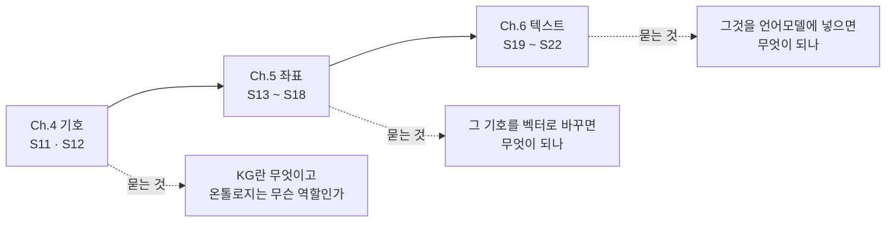
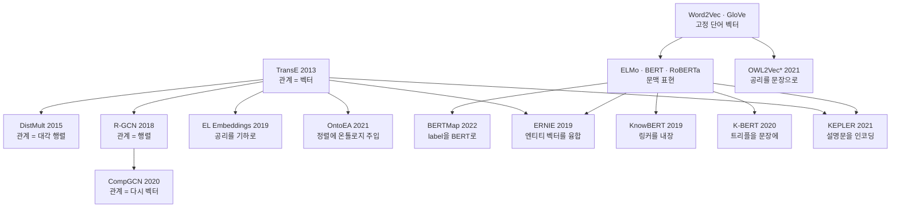

# 01 — Ch.4~6 종합: 기호에서 텍스트까지

> **성격** — 종합 정리. 회차 노트를 가로질러 세 챕터를 하나의 줄기로 꿴다. 강의 내용과 우리가
> 도출한 해석이 섞이므로, 강의 밖 해석에는 출처 노트를 링크해 두었다.
> [00 전체 파이프라인](00-전체-파이프라인.md)이 **실무 순서** 축이라면 이 문서는
> **강의 진행 순서와 계보** 축이다.
>
> 📖 [강의 목차](README.md)

> **Ch.6이 아직 진행 중이다.** S19·S20까지 반영했고 S21(K-Adapter·CoLAKE)·S22(COMET·Pretrained
> Encyclopedia)는 비어 있다. S22를 정리한 뒤 4·5·6·10절을 갱신한다.

---

## 1. 세 챕터를 하나의 줄기로

Ch.4부터 Ch.6까지가 한 줄기다. 같은 대상(KG와 온톨로지)을 놓고 **무엇으로 바꿔서 쓰는가**가
챕터마다 바뀐다.

| | 다루는 대상 | 산출물 | 게이트 |
|---|---|---|---|
| Ch.4 | 트리플과 공리 | 검증된 KG | SHACL 검증 |
| Ch.5 | 트리플과 공리 | 후보와 점수 | 사람 확인 |
| Ch.6 | 트리플과 설명문 | 문장 표현 | 없다 |

**게이트 열이 챕터마다 헐거워진다.** Ch.4는 통과한 것만 참으로 취급하고, Ch.5는 후보를 내놓아
사람이 고르게 하며, Ch.6은 학습이 끝나면 무엇이 들어갔는지 확인할 방법이 없다. 이 문서 6절에서
다시 나온다.

## 2. Ch.4 — 기호 세계의 역할 분담

**S11**이 KG가 무엇인지를 세우고, **S12**가 그 안에서 온톨로지가 하는 일을 셋으로 나눈다.

| 온톨로지의 역할 | 묻는 것 |
|---|---|
| 스키마 | 무엇을 어떻게 표현할 것인가. 클래스·속성·계층 정의 |
| 제약 | 어떤 의미적 조건을 만족해야 하는가. 배타성, 값의 범위·개수 |
| 추론 | 명시되지 않은 무엇을 도출할 수 있는가 |

이 셋이 뒤 챕터에서 어떻게 되는지가 이 문서의 줄거리다. **결론부터 적으면 스키마만 살아남는다.**
제약은 Ch.4 안에서 이미 흔들리고, 추론은 Ch.5·Ch.6에서 거의 사라진다.

Ch.4 안에서 흔들리는 지점이 [S12-1 1절](S12-1-선언과-준수-사이.md)이다. **OWL 공리는 위반을
막지 않는다.** `disjointWith`를 선언해 두어도 데이터가 그것을 어기면 추론기는 "일관성 없음"을
알릴 뿐 입력을 거부하지 않는다. 막는 일은 SHACL이 한다. 선언하는 언어와 준수를 강제하는 언어가
따로 논다.

S11이 인용한 Ji et al.의 KG 연구 네 축(표현학습 · 획득 · 시간 · 응용) 중에서, 이 강의가 Ch.5로
가져가는 것은 **표현학습**이고 Ch.7~8로 가져가는 것은 **획득**이다.

## 3. Ch.5 — 좌표로 바꾸면 무엇이 되나

여섯 회차가 세 갈래로 나뉜다. 갈라지는 기준은 **무엇을 후보로 내놓는가**다.

| 갈래 | 후보의 정체 | 회차 |
|---|---|---|
| A-Box 예측 | 빠진 트리플 | S13 TransE·DistMult · S14 R-GCN·CompGCN |
| T-Box 예측 | 빠진 공리 (subsumption·membership) | S15 OWL2Vec*·EL Embeddings |
| 정렬 | 두 KG·온톨로지에서 같은 대상인 짝 | S16 OntoEA·BERTMap |

**A-Box 갈래의 내부 계보**는 관계를 무엇으로 보느냐로 갈린다.

| | 관계를 무엇으로 보나 | 파라미터 |
|---|---|---|
| TransE | 벡터. `h + r ≈ t` | 관계당 `d` |
| DistMult | 대각 행렬. 곱셈 스코어 | 관계당 `d` |
| R-GCN | 행렬. 관계마다 다른 변환 | 관계당 `d²` — 폭증해서 basis decomposition이 필요하다 |
| CompGCN | 다시 벡터. 합성 연산자로 엔티티와 결합 | 관계당 `d` |

R-GCN이 관계를 행렬로 올렸다가 파라미터가 터졌고, CompGCN이 벡터로 되돌리면서 합성 연산자로
표현력을 지켰다. **올렸다 내린 것이 이 갈래의 요점이다.**

**T-Box 갈래**는 공리를 어디에 두느냐로 갈린다. OWL2Vec*는 공리를 **문장**으로 바꿔 Word2Vec에
먹이고, EL Embeddings는 공리를 **기하 배치**(구와 포함 관계)로 옮긴다. 5절에서 결과를 본다.

**정렬 갈래**는 대상 층이 다르다. OntoEA는 instance를 짝짓고 온톨로지를 신호로 주입하며,
BERTMap은 class를 짝짓고 label을 BERT에 먹인다. 방향이 서로 반대라 [S16-2](S16-2-정렬이-서는-자리.md)에
"서로를 전제하는 두 논문"으로 적었다.

**실습 두 회차가 이 갈래들을 실제로 돌려봤고, 둘 다 자료보다 어두운 결과를 냈다.**

- S17 — PyKEEN 내장 기준선(등장 횟수만 세는 모델)을 비교군에 넣었더니 학습 모델 여덟 개가
  전부 그 아래였다 ([S17-2](S17-2-돌려보고-확인한-것들.md))
- S18 — BERTMap을 5에폭 파인튜닝한 결과가 문자열 유사도만 쓰는 경량 버전과 **완전히 같았다**.
  학습 목표가 "BERT 파인튜닝의 효과 확인"이었고 확인된 효과는 0이다
  ([S18-2](S18-2-돌려보고-확인한-것들.md))

## 4. Ch.6 — 언어모델에 넣으면 무엇이 되나

산출물이 바뀐다. Ch.5까지는 KG나 온톨로지에 되먹일 후보를 만들었는데, Ch.6은 **문장 속 토큰의
벡터**를 만든다. KG는 재료로 들어가고 밖으로 나오지 않는다
([S19-2 1절](S19-2-지식을-어디에-고정하는가.md)).

네 모델이 갈리는 기준은 **KG를 언제 넣는가**다.

| | 주입 시점 | 추론할 때 KG가 필요한가 | 무엇을 바꾸나 |
|---|---|---|---|
| ERNIE | 사전학습 입력 | 필요하다 | Aggregator를 넣는다 |
| KnowBERT | 사전학습 중간층 (10~11층) | 필요하다 | KAR를 끼운다 |
| K-BERT | 파인튜닝·추론 입력 | 필요하다 | 입력을 트리로 바꾸고 attention을 가린다 |
| KEPLER | 사전학습 손실함수 | **필요 없다** | 아무것도 바꾸지 않는다 |

> S21(K-Adapter·CoLAKE)과 S22(COMET·Pretrained Encyclopedia)는 아직 비어 있다. K-Adapter는
> 어댑터라는 칸이 하나 더 생기는 것으로, CoLAKE는 K-BERT와 비슷하되 사전학습 시점이라는 점으로
> 예상된다. COMET은 산출물이 새 트리플이라 방향이 뒤집히므로 이 표에 들어가지 않을 가능성이 크다.

**양 끝이 KEPLER와 K-BERT다.** KEPLER는 손실 하나만 더하고 구조·입력·추론 절차를 전부 그대로
두며, 학습이 끝나면 KG가 필요 없다. K-BERT는 사전학습을 아예 하지 않고 입력만 바꾸며, 추론할
때마다 KG를 조회한다. 같은 문제를 정반대 끝에서 풀었다.

이 차이가 실무에서는 배포 형태를 가른다. KEPLER를 배포하면 그냥 RoBERTa 하나이고, K-BERT를
배포하면 추론 경로에 KG 조회가 들어간다. 대신 K-BERT는 **KG 파일을 고치면 다음 요청부터
반영된다** ([S20-2 2절](S20-2-지식을-언제-넣는가.md)).

## 5. 관통 ① — 구조를 텍스트로 녹이는 쪽이 이긴다

세 챕터를 가로질러 가장 일관되게 반복되는 결과다.

**가장 직접적인 증거가 S15A의 실험표다.** class subsumption prediction에서 열두 모델을 줄
세운 것인데, 계열로 줄이 서지 않는다.

| 모델 | 무엇으로 푸나 | FoodOn MRR | GO MRR |
|---|---|---|---|
| OWL2Vec* | 구조·텍스트·논리를 **문장**으로 | **0.213** | **0.170** |
| Pre-trained Word2Vec | 클래스 **이름**만. 온톨로지를 안 본다 | 0.136 | 0.123 |
| DistMult | KG 임베딩 | 0.076 | 0.046 |
| EL Embedding | 공리를 **기하**로 | 0.040 | 0.018 |

1등이 온톨로지 임베딩인데 최하위권도 온톨로지 임베딩이다. 그리고 **온톨로지를 전혀 안 보는
Word2Vec이 2등**이다. 공리를 정성껏 기하로 옮긴 EL Embeddings를 세 배에서 일곱 배로 이긴다.
논문 자신도 "label과 클래스 이름 같은 lexical information의 중요성을 확인했다"고 적는다.

같은 방향이 뒤 회차에서 계속 나온다.

| 회차 | 무엇을 텍스트로 바꿨나 |
|---|---|
| S15A | 온톨로지의 구조·논리를 문장 corpus로 |
| S16B | 클래스 label을 BERT 입력 문장으로 |
| S20A | entity 이름을 BERT vocabulary의 토큰으로 (임베딩 테이블을 없앤다) |
| S20B | entity를 텍스트 설명문으로 (인코더가 벡터를 만든다) |

**다만 텍스트라고 다 이기는 것은 아니다.** S18-2에서 BERTMap을 직접 돌렸을 때, MultiFarm
en-pt 정답 59쌍 중 라벨 철자가 같은 쌍이 2개뿐이고 held-out 44쌍 중 41쌍은 토큰이 하나도 안
겹쳤다. 문자열로는 원리적으로 못 푸는 과제였고, BERT를 파인튜닝해도 효과가 0이었다. **텍스트가
이기는 것은 텍스트에 신호가 있을 때다.**

## 6. 관통 ② — 공리는 어디서든 평평해진다

2절에서 온톨로지의 세 역할을 스키마·제약·추론으로 나눴다. 뒤 챕터에서 무엇이 남는지를 모으면
이렇다.

| 어디서 | 공리에 무슨 일이 일어나나 |
|---|---|
| Ch.4 (S12-1) | OWL 공리는 **위반을 막지 않는다**. 막는 일은 SHACL이 한다 |
| Ch.5 T-Box (S15) | 공리를 기하로 옮긴 모델이 최하위권이다. 문장으로 옮긴 쪽이 이긴다 |
| Ch.5 정렬 (S16B) | BERTMap이 실제로 쓰는 것은 클래스 **label 문자열**이다 |
| Ch.6 (S20B) | KEPLER는 822개 관계를 전부 똑같이 다룬다. `subclass_of`도 임베딩 테이블의 한 줄 |
| Ch.6 결론 슬라이드 | "taxonomic relation이 다른 관계와 **구분 없이** 취급됨. 클래스 계층·제약·공리 같은 온톨로지 고유의 표현은 핵심 학습 대상으로 다루지 않음" |

마지막 줄은 강의 발표자가 직접 적은 것이다. **표현으로서의 온톨로지는 밀렸다.** 다만 밀린
상대를 정확히 적어야 한다. KG 임베딩에게 밀린 것이 아니라 **텍스트에게 밀렸다.** 5절의 표에서
EL Embeddings가 DistMult에게도 지지만, 그 둘을 다 이긴 것은 클래스 이름만 보는 Word2Vec이다.

**살아남은 것은 통제 쪽이다.**

| | 온톨로지의 자리 | 현재 |
|---|---|---|
| 표현 | 계층·공리를 벡터로 | 밀렸다. 학습 과정에서 평평해진다 |
| 통제 | 추출 범위 제한, 검증, 일관성 검사 | 남았다. 대체재가 없다 |

이 강의 뒤쪽이 그것을 보여준다. S26이 Schema-grounded KG 구축이다. LLM이 아무거나 뽑지 못하게
스키마로 묶는 것이고, 온톨로지가 표현이 아니라 **생성의 가드레일**로 돌아온다.

> 이 절은 강의 밖 해석이다. 강의는 각 회차에서 사실만 적고 세 챕터를 가로질러 묶지 않는다.

## 7. 관통 ③ — 데이터가 적을수록 구조가 값을 한다

서로 다른 세 회차에서 같은 모양의 결과가 나왔다.

**S16A OntoEA** — 엔티티 정렬에 class 계층과 disjointness를 넣었을 때의 개선폭이 데이터 사정에
따라 뒤집힌다.

| 벤치마크 | 엔티티 정보 | H@1 개선 |
|---|---|---|
| EN-FR-V1 | 부족하다 | +11.6% |
| EN-FR-V2 | 풍부하다 | **−0.9%** |
| MED-BBK (산업·의료) | 부족하다 | +68.9% (w/ SI) |

**S20A MedicalKG** — Medicine NER에서 작은 도메인 KG가 웹 규모 KG를 이겼다.

| KG | 크기 | F1 |
|---|---|---|
| CN-DBpedia | 517만 triple | 93.8 |
| MedicalKG | 13,864 triple | **94.2** |

373배 작은 쪽이 이겼다. 그리고 MedicalKG의 내용이 "네 가지 유형의 상위어(증상·질병·신체 부위
·치료법)"다. **이번 회차에서 이긴 KG가 하필 가장 온톨로지에 가까운 것이었다.**

**S20A HowNet** — 의미 유사성 과제(XNLI·LCQMC)에서 52,576 triple짜리 언어 지식베이스가 517만
triple짜리 백과사전 KG를 이겼다.

셋을 겹치면 이렇게 읽힌다.

> 구조의 값은 **데이터가 채우지 못한 만큼**이다. 엔티티 정보가 풍부하면 한계 효용이 0에
> 가깝고, 빈약하면 크게 오른다. 웹 규모에서 온톨로지가 잘 안 보이는 이유가 여기 있다.

## 8. 관통 ④ — 비교군을 하나 더 세우면 결론이 바뀐다

방법론 쪽 관통선이다. 실습 회차와 논문 양쪽에서 반복됐다.

| 어디서 | 세운 비교군 | 무엇이 바뀌었나 |
|---|---|---|
| S17 (직접 실행) | PyKEEN 내장 기준선 — 등장 횟수만 센다 | 학습 모델 여덟 개가 전부 그 아래였다. 세 모델만 줄 세우면 "DistMult가 낫다"로 끝난다 |
| S18 (직접 실행) | BERTMapLt — 문자열 유사도만 | 자료가 출력해놓고 읽지 않았다. 파인튜닝 결과가 점수까지 같았다 |
| S20B (논문이 직접) | TransE† — negative sampling을 1로 맞춤 | TransE와 붙으면 지고(15.4 vs 25.3), 조건을 맞추면 크게 이긴다(15.4 vs 6.0) |
| S20B (논문이 직접) | Our RoBERTa — 같은 코퍼스로 재학습 | 공개 RoBERTa는 코퍼스가 10배라 비교 대상이 아니다 |

앞 둘은 우리가 세워서 자료의 결론이 뒤집힌 경우이고, 뒤 둘은 논문이 스스로 세운 경우다.
**S20B는 이 강의에서 통제를 가장 잘한 논문이다.** 다음 실습에서도 먼저 시도할 것.

## 9. 모델 계보 한 장

**TransE에서 뻗은 가지가 여섯이다.** 2013년 논문 하나가 A-Box 예측, T-Box 기하, 정렬, 그리고
Ch.6의 두 모델까지 재료로 들어간다. ERNIE의 엔티티 벡터도 TransE로 만들었고, KEPLER의 점수
함수도 TransE다. 그러면서 KEPLER 논문은 "단순성 때문에 택했고 더 발전된 KE 기법은 future
work"라고 적는다. **13년째 baseline 자리를 지키는 중이다.**

## 10. 아직 안 풀린 것

**subsumption prediction은 거의 안 풀렸다.** 5절 표에서 최고가 FoodOn MRR 0.213, Hits@1
0.143이다. 1등 답이 맞는 경우가 일곱 번에 한 번이고 GO는 열세 번에 한 번이다. 같은 표의
HeLis(class membership)가 0.953으로 거의 풀린 것과 대비된다. **인스턴스가 어느 클래스에
속하는지는 풀렸고, 클래스와 클래스 사이의 포섭 관계는 안 풀렸다.**

이것이 온톨로지 임베딩 생태계가 자라지 않은 이유이기도 하다. PyKEEN은 성숙했는데 mOWL은 이
강의에 회차조차 없다.

**inductive는 겨우 문이 열렸다.** KEPLER-Cond가 Wikidata5M inductive에서 MRR 40.2로 DKRL 23.1을
크게 앞서는데, 논문 스스로 "실제 KG 구축에 활용하기에는 여전히 충분하지 않다"고 두 번 적는다.
새 설비가 계속 들어오는 KG에는 이 제약이 성능보다 먼저 걸린다.

**주입된 지식은 고칠 수 없다.** Ch.6의 네 모델 중 셋은 사전학습에 지식을 굽고, 구운 뒤에는 KG
파일을 고쳐도 반영되지 않는다. S19A 3절이 "KG는 트리플 하나만 바꾸면 된다"로 동기를 세웠는데
주입하는 순간 그 장점이 사라진다([S19-2 4절](S19-2-지식을-어디에-고정하는가.md)). 유일한 예외가
K-BERT이고, K-BERT는 이미 절반쯤 retrieval이다. Ch.7 이후 GraphRAG로 흐름이 넘어가는 이유가
여기 있다.

**어떤 과제가 지식을 필요로 하는지 미리 알 방법이 없다.** 강의가 세 번 "안 올랐다"를 해명하는데
(S19A GLUE, S20A 감성 분석, S20B ConceptNet) 전부 사후 설명이다. 실무에서는 붙일지 말지를 먼저
정해야 한다. 경험칙 하나는 있다 — **정답이 문장 안에 다 들어 있으면 KG가 안 오른다.**

---

## 관련 문서

- [00 — 전체 파이프라인](00-전체-파이프라인.md) — 같은 내용을 실무 순서 축으로 꿴 문서
- [README — 회차별 정리 현황](README.md)
- 관통선의 출처 — [S12-1](S12-1-선언과-준수-사이.md) · [S15-2](S15-2-공리를-어디에-두는가.md) ·
  [S16-2](S16-2-정렬이-서는-자리.md) · [S17-2](S17-2-돌려보고-확인한-것들.md) ·
  [S18-2](S18-2-돌려보고-확인한-것들.md) · [S19-2](S19-2-지식을-어디에-고정하는가.md) ·
  [S20-2](S20-2-지식을-언제-넣는가.md)
