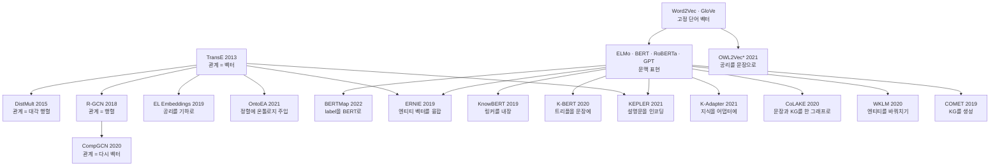

# 01 — Ch.4~6 종합: 무엇이 남고 무엇이 밀렸나

> **성격** — 주장 문서. **한 회차만 봐서는 안 보이고 여러 회차를 겹쳐야 나오는 것만 적는다.**
> 회차별 요약과 문서 목록은 [README](README.md)에, 실무 순서로 꿴 것은
> [00 전체 파이프라인](00-전체-파이프라인.md)에 있다. 여기 적힌 주장은 대부분 강의 밖 해석이라
> 근거가 된 회차 노트를 절마다 링크했다.
>
> 📖 [강의 목차](README.md)

> **Ch.4~6이 끝났다.** S11부터 S22까지 열두 회차를 반영했다. Ch.7 이후를 정리하면서 관통선에
> 증거가 붙거나 뒤집히면 해당 절에 이어 쓴다.

---

## 1. 배경 한 장 — 같은 대상을 무엇으로 바꿔 쓰는가

세 챕터가 다루는 대상은 같다. KG와 온톨로지다. 챕터마다 바뀌는 것은 그것을 무엇으로 바꿔서
쓰느냐다.

| | 무엇으로 바꾸나 | 산출물 | 게이트 | 회차 |
|---|---|---|---|---|
| Ch.4 | 그대로 기호로 | 검증된 KG | SHACL 검증 | S11 · S12 |
| Ch.5 | 좌표로 | 후보와 점수 | 사람 확인 | S13 ~ S18 |
| Ch.6 | 문장으로 | 문장 표현 (그리고 S22에서 트리플) | 없다 | S19 ~ S22 |

**게이트 열이 챕터마다 헐거워진다.** Ch.4는 통과한 것만 참으로 취급하고, Ch.5는 후보를 내놓아
사람이 고르게 하며, Ch.6은 학습이 끝나면 무엇이 들어갔는지 확인할 방법이 없다. 이 열이 6절의
주제가 된다.

Ch.4가 온톨로지의 역할을 스키마·제약·추론 셋으로 나눴고([S12](S12-1-선언과-준수-사이.md)),
뒤 챕터에서 무엇이 남는지가 이 문서의 줄거리다. 미리 적으면 스키마만 살아남는다.

**모델 계보** — 굵은 줄기가 둘이다. TransE에서 뻗은 KG 임베딩 계열과 Word2Vec에서 BERT로
이어지는 언어모델 계열이고, Ch.6은 둘이 만나는 자리다.

**TransE에서 뻗은 가지가 여섯이다.** 2013년 논문 하나가 A-Box 예측, T-Box 기하, 정렬, 그리고
ERNIE의 엔티티 벡터와 KEPLER의 점수 함수로 들어간다. KEPLER 논문은 "단순성 때문에 택했고 더
발전된 KE 기법은 future work"라고 적는다. 13년째 baseline 자리를 지키는 중이다.

**Ch.6에 오면 TransE 가지가 끊긴다.** S21·S22의 네 모델은 KG 임베딩을 아예 쓰지 않는다.
K-Adapter는 관계 분류로, CoLAKE는 통합 그래프로, WKLM은 치환 판별로, COMET은 생성으로 지식을
다룬다. 2절의 관통선이 여기서 가장 선명해진다.

## 2. 관통 ① — 구조를 텍스트로 녹이는 쪽이 이긴다

세 챕터를 가로질러 가장 일관되게 반복되는 결과다.

**가장 직접적인 증거가 S15A의 실험표다.** class subsumption prediction에서 열두 모델을 줄
세운 것인데, 계열로 줄이 서지 않는다.

| 모델 | 무엇으로 푸나 | FoodOn MRR | GO MRR |
|---|---|---|---|
| OWL2Vec* | 구조·텍스트·논리를 문장으로 | **0.213** | **0.170** |
| Pre-trained Word2Vec | 클래스 이름만. 온톨로지를 안 본다 | 0.136 | 0.123 |
| DistMult | KG 임베딩 | 0.076 | 0.046 |
| EL Embedding | 공리를 기하로 | 0.040 | 0.018 |

1등이 온톨로지 임베딩인데 최하위권도 온톨로지 임베딩이다. 그리고 온톨로지를 전혀 안 보는
Word2Vec이 2등이다. 공리를 정성껏 기하로 옮긴 EL Embeddings를 세 배에서 일곱 배로 이긴다.

같은 방향이 뒤 회차에서 계속 쌓인다. 뒤로 갈수록 구조를 덜 쓴다.

| 회차 | 무엇을 텍스트로 바꿨나 |
|---|---|
| S15A | 온톨로지의 구조·논리를 문장 corpus로 |
| S16B | 클래스 label을 BERT 입력 문장으로 |
| S20A | entity 이름을 BERT vocabulary의 토큰으로 (임베딩 테이블을 없앤다) |
| S20B | entity를 텍스트 설명문으로 (인코더가 벡터를 만든다) |
| S22B | **KG를 아예 안 넣는다.** 위키피디아 본문에서 직접 배운다 |

**WKLM이 이 줄의 끝이다.** KB 임베딩을 주입하는 ERNIE가 FIGER에서 57.19인데, KG를 넣지 않고
텍스트에서 배운 WKLM이 60.21로 그 위에 선다. 저자도 "텍스트에서 직접 배우는 쪽이 KB 임베딩
주입보다 효과적"이라고 적는다. 다만 두 값은 서로 다른 BERT 베이스라인 위에서 측정됐다
(ERNIE는 52.04에서 +5.15, WKLM은 54.53에서 +5.68). 개선폭으로 봐도 WKLM이 앞서지만 격차는
3.02가 아니라 0.53이다([S22B 13절](S22B-WKLM-텍스트에서-직접-배우기.md)).

**다만 텍스트라고 다 이기는 것은 아니다.** S18-2에서 BERTMap을 직접 돌렸을 때, MultiFarm en-pt
정답 59쌍 중 라벨 철자가 같은 쌍이 2개뿐이고 held-out 44쌍 중 41쌍은 토큰이 하나도 안 겹쳤다.
문자열로는 원리적으로 못 푸는 과제였고 BERT를 파인튜닝해도 효과가 0이었다.
**텍스트가 이기는 것은 텍스트에 신호가 있을 때다.**

## 3. 관통 ② — 공리는 평평해지고, 온톨로지는 통제로 남는다

1절에서 온톨로지의 세 역할을 스키마·제약·추론으로 나눴다. 뒤 챕터에서 무엇이 남는지를 모으면
이렇다.

| 어디서 | 공리에 무슨 일이 일어나나 |
|---|---|
| Ch.4 (S12-1) | OWL 공리는 위반을 막지 않는다. 막는 일은 SHACL이 한다 |
| Ch.5 T-Box (S15) | 공리를 기하로 옮긴 모델이 최하위권이다. 문장으로 옮긴 쪽이 이긴다 |
| Ch.5 정렬 (S16B) | BERTMap이 실제로 쓰는 것은 클래스 label 문자열이다 |
| Ch.6 (S20B) | KEPLER는 822개 관계를 전부 똑같이 다룬다. `subclass_of`도 임베딩 테이블의 한 줄 |
| Ch.6 (S21B) | CoLAKE는 관계를 노드로 승격해 학습 대상으로 삼지만, 여전히 관계 종류를 구분하지 않는다 |
| Ch.6 결론 슬라이드 | "taxonomic relation이 다른 관계와 구분 없이 취급됨. 클래스 계층·제약·공리 같은 온톨로지 고유의 표현은 핵심 학습 대상으로 다루지 않음" |

마지막 줄은 강의 발표자가 직접 적은 것이다. 표현으로서의 온톨로지는 밀렸다. 다만 밀린 상대를
정확히 적어야 한다. KG 임베딩에게 밀린 것이 아니라 텍스트에게 밀렸다. 2절 표에서 EL Embeddings가
DistMult에게도 지지만, 그 둘을 다 이긴 것은 클래스 이름만 보는 Word2Vec이다.

**살아남은 것은 통제 쪽이고, S22가 그 자리를 처음으로 눈에 보이게 만든다.**

COMET은 언어모델로 상식 트리플을 생성한다. 그 결과 나온 한계 다섯 중 둘이 정확히 통제의
부재다([S22A 24절](S22A-COMET-언어모델로-KG를-만든다.md)).

| COMET의 한계 | 무엇이 없어서 생기나 |
|---|---|
| 스키마 제약 없음 | 도메인·레인지, 논리 일관성 |
| 중복·정규화 문제 | 생성된 목적어가 기존 노드와 같은 개념인지 판정할 기준 |

생성은 언어모델이 하고 도메인·레인지와 정규화는 온톨로지가 맡는 분업이 자연스럽게 따라온다.
S26이 Schema-grounded KG 구축이니 이 분업이 실제로 나오는지 거기서 확인한다.

| | 온톨로지의 자리 | 현재 |
|---|---|---|
| 표현 | 계층·공리를 벡터로 | 밀렸다. 학습 과정에서 평평해진다 |
| 통제 | 추출 범위 제한, 검증, 일관성 검사 | 남았다. 대체재가 없고 S22에서 수요가 다시 생겼다 |

## 4. 관통 ③ — 데이터가 적을수록 구조가 값을 한다, 그런데 경쟁 가설이 생겼다

서로 다른 세 회차에서 같은 모양의 결과가 나왔다.

**S16A OntoEA** — 엔티티 정렬에 class 계층과 disjointness를 넣었을 때의 개선폭이 데이터 사정에
따라 뒤집힌다.

| 벤치마크 | 엔티티 정보 | H@1 개선 |
|---|---|---|
| EN-FR-V1 | 부족하다 | +11.6% |
| EN-FR-V2 | 풍부하다 | **−0.9%** |
| MED-BBK (산업·의료) | 부족하다 | +68.9% (w/ SI) |

**S20A MedicalKG** — Medicine NER에서 13,864 triple짜리 도메인 KG가 517만 triple짜리 CN-DBpedia를
94.2 대 93.8로 이겼다. 373배 작은 쪽이 이겼고, 그 KG의 내용이 "네 가지 유형의 상위어(증상·질병
·신체 부위·치료법)"라 하필 가장 온톨로지에 가까운 것이었다.

**S20A HowNet** — 의미 유사성 과제에서 52,576 triple짜리 언어 지식베이스가 백과사전 KG를 이겼다.

셋을 겹치면 구조의 값은 데이터가 채우지 못한 만큼이라는 읽기가 나온다. 엔티티 정보가 풍부하면
한계 효용이 0에 가깝고 빈약하면 크게 오른다.

**S22가 여기에 다른 설명을 하나 세운다.** COMET의 seed 효율성 실험은 학습 데이터를 1%·10%·50%로
줄여가며 성능을 잰 것인데, 10%(약 7만 개)에서 BLEU-2 12.72가 나오고 FULL의 14.34에 크게 뒤지지
않는다. 그리고 사전학습 없는 FULL이 13.22로 10% + 사전학습(12.72)과 비슷하다
([S22A 19절](S22A-COMET-언어모델로-KG를-만든다.md)).

**사전학습이 학습 데이터 10배의 값을 한다는 뜻이다.** 데이터가 부족할 때 그 자리를 메우는 것이
구조만은 아니다. 사전학습된 언어 표현도 메운다. 둘을 구분하려면 같은 과제에서 구조를 넣은 조건과
사전학습을 키운 조건을 나란히 재야 하는데, 그런 실험은 아직 못 봤다. Ch.7 이후에 나오면 이 절에
이어 쓴다.

## 5. 관통 ④ — 비교군을 하나 더 세우면 결론이 바뀐다

방법론 쪽 관통선이다. 실습 회차와 논문 양쪽에서 반복됐고, Ch.6에서 특히 좋은 사례가 쌓였다.

| 어디서 | 세운 비교군 | 무엇이 바뀌었나 |
|---|---|---|
| S17 (직접 실행) | PyKEEN 내장 기준선. 등장 횟수만 센다 | 학습 모델 여덟 개가 전부 그 아래였다 |
| S18 (직접 실행) | BERTMapLt. 문자열 유사도만 | 자료가 출력해놓고 읽지 않았다. 파인튜닝 결과가 점수까지 같았다 |
| S20B (논문) | TransE†. negative sampling을 1로 맞춤 | 조건을 맞추면 결론이 뒤집힌다 (15.4 대 6.0) |
| S20B (논문) | Our RoBERTa. 같은 코퍼스로 재학습 | 공개 RoBERTa는 코퍼스가 10배라 비교 대상이 아니다 |
| S21A (논문) | K-Adapter `w/o knowledge`. 빈 어댑터 | 파라미터만 늘리면 오히려 0.06 낮다. 차이 1.36이 지식에서 온 것이 된다 |
| S22B (논문) | `Our BERT + 1M MLM`. 목적함수는 그대로 두고 학습량만 맞춤 | 아래 참조 |

**WKLM의 것이 가장 깔끔하다.** 의심은 단순하다. WKLM의 자체 BERT는 2M updates로 원 BERT보다 오래
학습했으니, 이득이 목적함수가 아니라 학습량 때문일 수 있다.

| | SQuAD F1 | FIGER Acc |
|---|---|---|
| Our BERT | 90.5 | 54.53 |
| Our BERT + 1M MLM | 91.1 | 54.17 |
| WKLM | 91.3 | 60.21 |

**두 열을 같이 봐야 결론이 선다.** SQuAD만 보면 학습량 가설이 맞는 것처럼 보이고(91.1 대 91.3),
FIGER를 보면 추가 학습이 엔티티 지식을 전혀 늘리지 못한다(54.53 → 54.17). 반대 방향 통제
(`without MLM`, SQuAD F1 87.6으로 급락)까지 넣으면 분업이 드러난다. 언어 능력은 MLM이 맡고
엔티티 지식은 치환 판별이 맡는다([S22-2 4절](S22-2-방향이-뒤집힌-회차.md)).

가져갈 절차는 이것이다. 어떤 장치의 효과를 주장할 때 **그 장치 없이 같은 자원을 쓴 조건**을
만들고, 장치가 겨냥한 과제와 겨냥하지 않은 과제를 **둘 다** 잰다.

## 6. 관통 ⑤ — 산출물을 열어볼 수 있는가 (S22에서 새로 생긴 축)

1절 표의 게이트 열이 Ch.6에서 비어 있었다. S22가 그 빈칸을 다르게 메운다. 검증을 학습 안에
넣는 대신 **산출물의 형태**를 바꾼 것이다.

| | 산출물 | 무엇을 아는지 열어볼 수 있나 | 사실이 바뀌면 |
|---|---|---|---|
| COMET (S22A) | 트리플 | 튜플 단위로 열람·검수 | 해당 트리플만 고친다 |
| K-BERT (S20A) | 원본 KG를 밖에 유지 | KG를 그대로 본다 | KG 파일만 고치면 된다 |
| ERNIE · KnowBERT | 파라미터 + KB 임베딩 | 임베딩은 불투명 | 재학습 |
| KEPLER · K-Adapter · CoLAKE · WKLM | 파라미터 | 불가 | 재학습 (K-Adapter는 어댑터만) |

**성능 순위와 이 순위가 거의 반대다.** K-BERT는 Ch.6에서 가장 단순한 축이고 추론 때마다 KG를
조회해야 하는 것이 단점으로 꼽혔는데, 이 열에서는 그 단점이 장점이 된다. KG가 밖에 남아 있다는
뜻이기 때문이다.

이 축이 실무에서 먼저 걸리는 곳이 있다. 규제 산업에서는 "무엇을 근거로 그렇게 판단했나"에 답할
수 있어야 하는데, 파라미터에 구워 넣은 지식은 그 답을 못 만든다. S22B 15절이 이것을 WKLM의 첫
번째 한계로 적고 규제 산업에서 도입 불가 사유가 될 수 있다고 덧붙인다.

## 7. 아직 안 풀린 것

**subsumption prediction은 거의 안 풀렸다.** 2절 표에서 최고가 FoodOn MRR 0.213, Hits@1 0.143이다.
1등 답이 맞는 경우가 일곱 번에 한 번이고 GO는 열세 번에 한 번이다. 같은 표의 HeLis(class
membership)가 0.953으로 거의 풀린 것과 대비된다. 인스턴스가 어느 클래스에 속하는지는 풀렸고,
클래스와 클래스 사이의 포섭 관계는 안 풀렸다. 온톨로지 임베딩 생태계가 자라지 않은 이유이기도
하다. PyKEEN은 성숙했는데 mOWL은 이 강의에 회차조차 없다.

**inductive는 겨우 문이 열렸다.** KEPLER-Cond가 Wikidata5M inductive에서 MRR 40.2로 DKRL 23.1을
크게 앞서는데, 논문 스스로 "실제 KG 구축에 활용하기에는 여전히 충분하지 않다"고 두 번 적는다.
새 설비가 계속 들어오는 KG에는 이 제약이 성능보다 먼저 걸린다.

**주입된 지식은 여전히 고치기 어렵다. 단위만 작아졌다.** S19A가 "KG는 트리플 하나만 바꾸면
된다"로 동기를 세웠는데 주입하는 순간 그 장점이 사라진다. Ch.6이 끝나면서 갱신 단위가 이렇게
갈렸다.

| 갱신 단위 | 모델 |
|---|---|
| 트리플 하나 | K-BERT (KG가 밖에 있다) · COMET (산출물이 트리플이다) |
| 어댑터 하나 (42M) | K-Adapter |
| 전체 재학습 | ERNIE · KnowBERT · KEPLER · CoLAKE · WKLM |

K-Adapter가 중간 칸을 만들었지만 어댑터 하나를 다시 학습하는 비용도 작지 않다. 트리플 하나를
고치는 것과는 다른 단위다.

**어떤 과제가 지식을 필요로 하는지 미리 알 방법이 없다.** 강의가 네 번 "안 올랐다"를 해명하는데
(S19A GLUE, S20A 감성 분석, S20B ConceptNet, S22B SQuAD) 전부 사후 설명이다. 실무에서는 붙일지
말지를 먼저 정해야 한다. 경험칙 하나는 있다. **정답이 문장 안에 다 들어 있으면 KG가 안 오른다.**
WKLM이 그 경계를 숫자로 보여준다. 비-엔티티 스팬 정답이 많은 SQuAD에서는 +0.8 F1인데, 정답의
92.85%가 위키피디아 엔티티인 TriviaQA에서는 +3.5 F1이다.

## 8. 그래서 우리 조건에서 무엇을 쓸 수 있나

Ch.6 여덟 모델은 전부 Wikidata 규모 KG와 웹 규모 텍스트를 전제한다. 제조 암묵지 KG라는 조건에
그대로 옮겨지는 것은 없다. 남는 것을 정리하면 셋이다.

| 경로 | 조건 | 막히는 곳 |
|---|---|---|
| K-BERT식. KG를 밖에 두고 입력에 붙인다 | 도메인 KG가 작아도 된다 (MedicalKG 13,864 triple) | 추론마다 KG 조회. 트리플 주입 파이프라인을 만들어야 한다 |
| COMET식. seed로 나머지를 생성한다 | seed 수천~수만 개 (10%에서 성능이 서고 1%에서 급락) | 검증이 모델 밖에 있고 그 검증을 할 사람이 숙련자 본인이다 |
| WKLM식. 텍스트에서 직접 배운다 | 앵커 링크가 달린 대규모 코퍼스 | 사내 문서에는 엔티티 링크가 없다. 링크를 만들려면 KG가 먼저 있어야 해서 순서가 거꾸로다 |

**앞의 둘은 조건부로 열려 있고 셋째는 닫혀 있다.** 그리고 앞의 둘 다 온톨로지를 지우지 않는
쪽이다. K-BERT는 KG를 밖에 두기 때문에, COMET은 생성물에 스키마 제약이 필요하기 때문에 그렇다.

**Ch.6은 이 강의에서 실무에 가장 안 붙는 챕터였다.** 폴더 README의 원래 기대는 Ch.3·Ch.7~8·
Ch.11이었는데, 지금은 **Ch.10(SSN/SOSA · W3C Time · Brick)**을 추가하는 게 맞다. 센서와 시간을
어떻게 표현할지가 제조 현장 데이터와 그대로 겹치고, 그 둘은 학습 모델이 아니라 표준 스키마라서
3절의 "통제로 남았다"는 자리와 정확히 붙는다.

---

## 관련 문서

- [00 — 전체 파이프라인](00-전체-파이프라인.md) — 같은 재료를 실무 순서 축으로 꿴 문서
- [README — 회차별 정리 현황](README.md) — 회차별 요약과 문서 목록
- 관통선의 출처 — [S12-1](S12-1-선언과-준수-사이.md) · [S15-2](S15-2-공리를-어디에-두는가.md) ·
  [S16-2](S16-2-정렬이-서는-자리.md) · [S17-2](S17-2-돌려보고-확인한-것들.md) ·
  [S18-2](S18-2-돌려보고-확인한-것들.md) · [S19-2](S19-2-지식을-어디에-고정하는가.md) ·
  [S20-2](S20-2-지식을-언제-넣는가.md) · [S21-2](S21-2-여덟-모델을-한-축에.md) ·
  [S22-2](S22-2-방향이-뒤집힌-회차.md)
