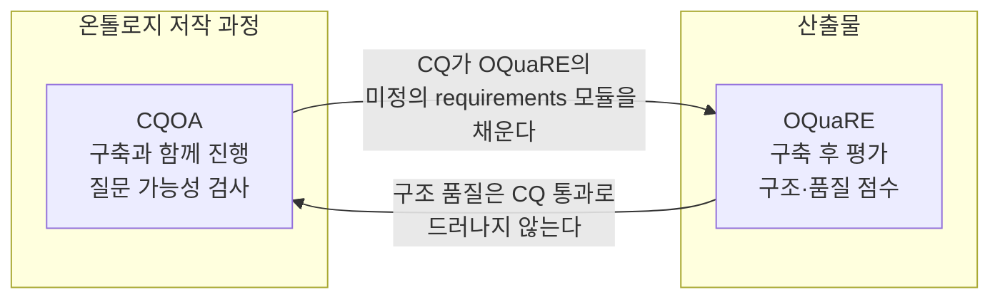

# 부록 — 두 평가 틀의 빈칸

> **성격** — [S07 OQuaRE](S07-구조적-품질-평가-OQuaRE.md)·[S08 CQ 기반 평가](S08-기능적-의미적-평가-CQ.md)
> 정리 중 강의 슬라이드와 원논문을 대조하면서 갈라져 나온 내용. 강의 자료에 없다.
>
> 대조한 원문은 셋이고 전부 전문을 구했다.
> - Duque-Ramos, Fernández-Breis, Stevens, Aussenac-Gilles, *OQuaRE: A SQuaRE-based Approach for
>   Evaluating the Quality of Ontologies*, JRPIT 43(2), 2011. 강의가 다룬 논문이다. JRPIT가 폐간돼
>   현행 링크는 죽었고, Internet Archive에 남은 사본으로 받았다
> - Duque-Ramos et al., *Evaluation of the OQuaRE framework for ontology quality*,
>   Expert Systems with Applications 40(9), 2013. 같은 팀의 후속 논문으로, OQuaRE 자체를 평가한다
> - Ren, Parvizi, Mellish, Pan, van Deemter, Stevens, *Towards Competency Question-driven Ontology
>   Authoring*, ESWC 2014. 강의가 다룬 논문이다
>
> 결론부터. 슬라이드의 메트릭 정의 14개, 1~5점 변환표, 기여표는 2011년 원문과 글자 단위로 같다.
> 옮기다 생긴 오류는 없었다. 아래에서 다루는 차이는 두 군데서 나온다. 하나는 2011년 논문과
> 2013년 논문 사이, 다른 하나는 슬라이드 안의 계산 예시 한 장이다.

---

## 1. 2011년에서 2013년으로 바뀐 것

강의가 다룬 건 2011년 판 OQuaRE다. 같은 저자들이 2년 뒤 OQuaRE 자체를 평가한 논문을 냈는데,
거기서는 프레임워크가 이미 달라져 있다. 후속 논문을 최신 판으로 놓고 무엇이 바뀌었는지 정리한다.
[S07 §7](S07-구조적-품질-평가-OQuaRE.md#7-metric)의 메트릭 정의가 2011년 논문 §2.2 그대로임은
대조로 확인했으니, 아래 차이는 전부 논문과 논문 사이에서 생긴 것이다.

### 1.1 확장 — 품질 특성 5개 → 9개

| | 개수 | 목록 |
|---|---|---|
| **2011년 원문** §2.1 | **5개** | Structural · Functional adequacy · Reliability · Operability · Maintainability |
| **강의 슬라이드** | **7개** | 위 5개 + Compatibility · Transferability |
| **ESWA 2013** §2.1.1 | **9개** | 위 7개 + Performance efficiency(응답시간 · 자원 사용) · Quality in use(usability · flexibility in use) |

2011년 원문의 Characteristics 절은 다섯 개만 적어놨다. Compatibility는 관련 연구 비교표(Table 4)에
OQuaRE의 항목처럼 나오는데 정작 §2.1 목록에는 빠져 있다. Transferability는 2011년 논문에 아예
안 나온다. 슬라이드의 7개는 두 논문 사이 중간쯤 되는 상태다. 표에 붙은 한글 뜻풀이도 논문 어느 쪽
문장과도 다르니, OQuaRE 웹사이트(`miuras.inf.um.es/evaluation/oquare`) 같은 다른 출처를 거쳤을
것이다.

늘어난 넷은 전부 SQuaRE에 원래 있던 특성이다. 온톨로지만의 무언가를 새로 발견해서 추가한 게
아니라, 소프트웨어 표준을 더 많이 끌어다 쓴 쪽에 가깝다. 그 반대편에 `Structural`이 있다. 표준에
없는데 온톨로지에 필요해서 넣은 유일한 항목이고, 이건 두 논문 다 분명히 밝힌다.

> …structural features of ontologies are important to evaluate their quality, but they are not
> considered in the standard. Consequently, we added such characteristic to our framework. (2011)

이 차이가 [S08 §10](S08-기능적-의미적-평가-CQ.md#10-두-프레임워크의-한계)의 threshold 문제로 바로
이어진다. 나머지 여덟 특성은 소프트웨어 공학에서 수십 년 쓰면서 "이 정도면 괜찮다"는 감이 쌓인
지표다. Structural에는 그런 축적이 없다.

### 1.2 개정 — 메트릭 정의

2013년 Table 2는 같은 메트릭들을 다시 정의하는데 여러 항목이 달라졌다. 전부 일부러 고친 것으로
보이지는 않아서, 어떤 성격인지 나눠 적는다.

| Metric | 2011 (= 강의 슬라이드) | 2013 | 성격 |
|---|---|---|---|
| **RROnto → PROnto** | `RROnto` (Properties Richness) | `PROnto` — 이름이 바뀜. 정의는 같은 취지 | 고친 것으로 보인다. 2013년 표와 본문이 계속 새 이름을 쓴다 |
| **WMCOnto** | 클래스당 프로퍼티와 관계의 평균 수 | 클래스당 Datatype Property · Object Property **그리고 subclass**의 평균 수 | 고친 것으로 보인다. 세는 대상이 늘었고, OWL 요소로 풀어 쓴 방식이 2013년의 다른 정의들과 맞는다 |
| **INROnto** | 클래스당 평균 **관계** 수 | 클래스당 평균 **subclass** 수 | 모르겠다. 이름(Relationships per class)은 2011년 쪽에 맞는다 |
| **AROnto** | 클래스당 평균 **속성(attribute)** 수 | 온톨로지의 **restriction** 수 ÷ 클래스 수 | 고친 것으로 보인다. 2011년의 `Att_Ci`는 표기법 목록에 설명이 없는 기호였는데, 2013년이 restriction으로 못 박았다 |
| **NOCOnto** | 평균 직접 **하위** 클래스 수 | 클래스당 직접 **상위** 클래스의 평균 수 − Thing의 subclass | 옮기다 틀린 것으로 보인다. 이름이 Number of *Children*인데 부모를 세고, 이건 2011년 `CBOOnto`의 정의와 같다 |
| **CROnto** | **Class Richness** — 클래스당 평균 인스턴스 수 | **Inheritance relationships richness** — 클래스당 평균 individual 수 | 옮기다 틀린 것으로 보인다. 2013년 안에서 이름과 정의가 서로 안 맞는다 |
| **CBOOnto · TMOnto** | 정의·수식 있음 | Table 2에 **없음** (14개 중 12개만) | 빠뜨린 것으로 보인다. 뺀 건 아니다. 같은 논문 Table 9~11이 `CBOnto`를 계속 쓴다 |

`NOCOnto` 하나만 봐도 사소한 문제가 아니다. 자식을 세느냐 부모를 세느냐에 따라
[S07 §8.2 기여표](S07-구조적-품질-평가-OQuaRE.md#82-subcharacteristic--metric-기여표)에서
`Reusability`에 유일하게 `−`가 붙은 이유가 달라지고, 점수도 달라진다. 그렇다고 2011년 판이 깔끔한
것도 아니다. 수식은 관계 수(`Σ|R_Ci|`)를 세는데 이름은 Number of Children이다. 어느 판을 골라도
이 메트릭은 이름과 정의가 안 맞는 채로 남는다.

### 1.3 방향 — 저자들이 스스로 내린 진단

2013년 논문은 정의를 손보는 데 그치지 않고 무엇을 고쳐야 하는지를 결론에 적었다. 사실상 다음 판
설계도다.

- 메트릭 집합을 다시 설계해야 한다. 전문가 평가에서 메트릭 세 개가 연결된 *모든* 부특성에 대해
  "쓸모없다"는 답을 받았다
- OWL 전용 메트릭이 없다. OQuaRE는 여러 형식과 여러 형식화 수준에 두루 쓰이도록 형식과 무관하게
  설계됐는데, 정작 평가 대상은 OWL이라 전문가들이 정의를 어려워했다. Manchester의 OWL 메트릭
  세트나 Ontology Pitfall Scanner(OOPS!) 같은 OWL 전용 도구를 가져오는 방향을 검토한다
- 부특성당 메트릭 수를 줄이라는 권고, 그리고 `ANOnto → Learnability` 같은 새 연결 제안
- quality requirements 모듈 추가. §5에서 다룬다. 여기서 CQ가 등장한다
- 평가 프로파일. 특성·부특성·메트릭·가중치 조합을 쓰임새별로 골라 쓰는 방식이다

> 이 계보에는 뒷이야기가 더 있다. OQuaRE를 비판적으로 검토한 후속 연구(*A Critical View on the
> OQuaRE Ontology Quality Framework*, 2023)와 정리 작업(*Harmonizing the OQuaRE Quality
> Framework*)이 따로 있는데 이번엔 전문을 못 구했다. 안 읽었으니 여기 요약하지 않는다. 나중에 볼 것.

## 2. 계산 예시가 앞 슬라이드와 어긋나는 세 지점

[S07 §9](S07-구조적-품질-평가-OQuaRE.md#9-계산-예시--pizza-ontology의-maintainability)의
"Pizza ontology의 maintainability 가상 계산" 슬라이드는 같은 세미나의 앞 슬라이드 세 개와 각각
어긋난다. 강의자가 "가상 계산"이라고 분명히 밝혔으니 예시용 임의값일 것이다. 다만 이 회차에서
실제 계산 절차를 보여주는 유일한 장면이라, 절차를 이 예시로 익히면 변환표를 거꾸로 기억하게 된다.

**① 메트릭 설명이 한 칸씩 밀려 있다**

| 계산 예시에 붙은 설명 | 그 설명이 실제로 정의하는 메트릭 |
|---|---|
| `DITOnto` — "Class당 property와 relationship 평균 수" | **WMCOnto**의 정의 |
| `CBOOnto` — "계층의 최대 깊이" (Thing → Pizza → NamedPizza → …) | **DITOnto**의 정의 |
| `WMCOnto` — "Class당 직접 subclass 수" | **NOCOnto**의 정의 |

`DITOnto → WMCOnto → NOCOnto` 순으로 설명이 한 칸씩 당겨 붙었다.

**② Modularity를 3개 metric으로 계산했는데, 기여표에는 2개만 있다**

계산 예시는 `Modularity = (5+5+4)/3 = 4.66`으로 `DITOnto` · `CBOOnto` · `WMCOnto` 세 개의 평균을
냈다. 그런데 [기여표](S07-구조적-품질-평가-OQuaRE.md#82-subcharacteristic--metric-기여표)의
`Modularity` 행은 `WMCOnto`와 `CBOOnto` 둘에만 `+`가 있다.

기여표 쪽이 원문이다. 2011년 논문 Table 2(*Association between metrics and quality
subcharacteristics for maintainability*)와 슬라이드 기여표는 6행 7열이 전부 같다. ESWA 2013의
Table 9~11에 흩어진 (subcharacteristic, metric) 쌍을 모아봐도 같은 집합이 나온다. 틀린 건 계산 예시
쪽이다.

**③ 점수 변환이 변환표와 맞지 않는다**

| Metric | 계산 예시의 실제값 → 점수 | [변환표](S07-구조적-품질-평가-OQuaRE.md#81-15점-변환표)대로라면 |
|---|---|---|
| `DITOnto` | 4 → **5점** | 4는 `(2,4]` 구간이라 **4점** |
| `CBOOnto` | 2 → **5점** | 2는 `[1,2]` 구간이라 5점. 여기만 맞는다 |
| `WMCOnto` | 4 → **4점** | 4는 `<= 5` 구간이라 **5점** |

세 개 중 둘이 안 맞는다. 변환표 역시 2011년 논문 Table 3(*Evaluation criteria for the measurement
primitives*)과 완전히 같으니 기준 쪽이 아니라 예시 쪽이 임의값이다. ①의 라벨 밀림을 감안해 정의를
바꿔 읽어봐도 맞아떨어지지 않는다.

## 3. "자동 평가와 수동 평가가 유사하다"는 말의 범위

[S07 §10](S07-구조적-품질-평가-OQuaRE.md#10-평가-사례)의 결론, "자동 평가가 수동 평가와 대체로
유사한 경향"은 그래프를 눈으로 보고 한 말이 아니다. 후속 논문이 통계 검정으로 제대로 다룬 주제고,
결과는 슬라이드 한 줄보다 좀 더 복잡하다.

**설계.** 생의학 도메인 전문가 세 명에게 SCIUNITS 온톨로지(클래스 326개) 하나를 세 방법으로
채점시켰다.

| | 방법 | 평균 | 표준편차 |
|---|---|---|---|
| **M1** | 순수 수동 — 전문가 본인 판단만 | 2.76 | 1.19 |
| **M2** | 메트릭 보조 수동 — 미리 계산된 metric 점수를 보면서 채점 | 3.08 | 0.68 |
| **M3** | 완전 자동 — 도구가 메트릭만으로 산출 | 3.33 | 1.16 |

**평균은 다르지 않다.** 일원배치 ANOVA에서 `P = 0.055`, 비모수 검정(Friedman)에서 `P = 0.119`.
세 방법의 평균도 중앙값도 방법에 따라 달라진다고 볼 근거가 없다. 슬라이드의 "유사한 경향"은
여기까지를 말한다.

**그런데 상관이 없다.** 같은 논문 Table 4의 상관행렬을 보면 이야기가 갈린다.

| | M1 | M2 |
|---|---|---|
| M2 | 0.649 (`P = 0.000`) | |
| M3 | **0.095** (`P = 0.624`) | **0.001** (`P = 0.994`) |

수동끼리(M1↔M2)는 0.649로 상관이 있다. 자동(M3)은 수동 어느 쪽과도 상관이 없다. 전체 평균은
비슷하게 나오지만, 항목 하나하나로 보면 전문가가 높게 준 항목을 도구가 높게 주지 않는다는 뜻이다.

실무에서는 이 구분이 중요하다. 여러 온톨로지 중 하나를 고르는 용도라면 전체 평균을 비교하는
것이니 자동 점수를 써도 된다. 반면 "우리 온톨로지의 어느 특성이 약한가"를 보는 용도는 항목별
비교라서 근거가 약해진다. 그런데
[S07 §11 Conclusion](S07-구조적-품질-평가-OQuaRE.md#11-conclusion)의 3번이 내세우는 OQuaRE의
실용성이 바로 후자다.

논문도 이 부분을 인정한다. 메트릭 세 개는 연결된 *모든* 부특성에 대해 전문가들에게 "쓸모없다"는
평가를 받았고, 저자들은 메트릭 집합을 다시 설계해야 한다고 적었다. 전문가가 세 명뿐이었다는 것도
같이 봐야 한다.

## 4. 12개 패턴이 나온 실증 연구

[S08 §5](S08-기능적-의미적-평가-CQ.md#5-competency-question-type--12가지-패턴)의 "12가지 패턴,
그중 6가지가 많이 등장"은 논문의 절반(연구 질문 1)을 한 줄로 줄인 것이다. 원문의 수치를 붙이면
이 숫자들이 무엇을 뜻하는지가 달라진다.

**수집.** 두 도메인에서, 서로 다른 두 종류의 작성자에게 CQ를 받았다.

| 출처 | 수집 | 유효 | 작성자 |
|---|---|---|---|
| Software Ontology Project | 92 | **75** | 해당 온톨로지의 실제 사용자 — 전문가 관점의 요구사항 |
| Manchester OWL Tutorials (2013) | 76 | **70** | 튜토리얼 참가자 — 대부분 초보 작성자 |

무효 처리한 CQ의 종류가 오히려 볼 만하다. 중복 질문, 이해할 수 없는 불완전 문장, CQ가 아닌
문장("피자 정의에 오븐 종류를 넣어야 할까?"), 그리고 DL 기반 온톨로지 언어로 표현할 수 없는
질문이다. 마지막 예가 "문제를 어떻게 고칠 수 있나?"인데, 답이 조건과 행동이 얽힌 절차라서 정적인
도메인 지식을 다루는 온톨로지의 대상이 아니라는 이유다.

**분포.** 유효 CQ 145개의 archetype별 개수는 이렇다.

| Archetype | 1 | 2 | 3 | 4 | 5 | 6 | 7 | 8 | 9 | 10 | 11 | 12 |
|---|---|---|---|---|---|---|---|---|---|---|---|---|
| Software (75) | 38 | 11 | 1 | 1 | 0 | 4 | 5 | 5 | 3 | 7 | 0 | 0 |
| Pizza (70) | 23 | 7 | 4 | 0 | 5 | 1 | 0 | 22 | 0 | 2 | 5 | 1 |

12개 중 소프트웨어 컬렉션에서 9개, 피자 컬렉션에서 9개가 나왔고, 양쪽 모두에 나타난 건 6개
(archetype 1 · 2 · 3 · 6 · 8 · 10)다. 슬라이드가 말한 "많이 등장하는 6가지"가 이것이고, 이 6개가
전체 CQ의 86.2%를 차지한다. 논문은 여기서 가장 중요한 CQ 유형에 관해서는 어느 정도 다 모은 것일
수 있고 도메인을 더 넣어도 중요한 유형이 많이 늘지는 않을 것이라고, 조심스럽게 주장한다.
슬라이드의 "12가지"라는 숫자에는 이 주장이 달려 있다.

**패턴 12개가 전부는 아니다.** 논문은 CQ를 7개 feature로 기술한다. 그중 넷(Predicate Arity ·
Relation Type · Modifier · Domain-independent Element)이 primary고, 셋(Question Type ·
Element Visibility · Question Polarity)이 secondary다. primary가 다르면 archetype이 갈리고,
secondary만 다르면 sub-type이 된다. archetype 1 하나에만 sub-type이 여덟 개(1a~1h) 붙어 있다.
`Which [CE1] [OPE] [CE2]?` / `Find [CE1] with [CE2].` / `How many [CE1] [OPE] [CE2]?` /
`Does [CE1] [OPE] [CE2]?` 같은 변형들이다. secondary를 따로 묶은 기준은 온톨로지에 필요한 모델링
요소를 바꾸지 않는다는 것이고, 이 구분이 "12개"라는 숫자의 근거다. 슬라이드 Table 1에
`PA · RT · M · DE` 네 열만 있는 이유도 여기 있다. 그게 primary feature다.

**Authoring Test도 9종으로 표가 있다.**
[S08 §4](S08-기능적-의미적-평가-CQ.md#4-authoring-test-생성)가 보여준 건 그중 `Occurrence`와
`Relation Satisfiability` 둘이다. 나머지는 `Class Satisfiability`, `Meta-Instance`(프로퍼티가
ObjectProperty인지 DatatypeProperty인지 RDF 추론으로 확인), `Cardinality Satisfiability`,
`Multiple Cardinality`(최상급 수량 modifier), `Comparative Cardinality`, `Multiple Value`(최상급
수치 modifier), `Range`(비교 가능한 수치형인지)다.
[S08 §6](S08-기능적-의미적-평가-CQ.md#6-modifier)에서 "관계의 개수도 제약이 가능한지",
"숫자형이어야 함"이라고 말한 것이 각각 `Multiple Cardinality`와 `Range`에 해당한다.

**논문 자체가 안 맞는 곳이 둘 있다.** 어느 쪽이 맞다고 정하지 않고 둘 다 적어둔다.

- §5.2는 예시 CQ *"What is the best software to read this data?"*가 archetype 7
  `What [CE1] is [NM] to [OPE] [CE2]?`에 속한다고 쓴다. 그런데 Table 1에서 7번은
  `Where do I [OPE] [CE]?`이고, 저 패턴은 6번 `What is the [NM] [CE1] to [OPE] [CE2]?`다.
  같은 논문 §4.3 끝에서는 같은 형태를 "archetype 6의 sub-type"이라고 부른다
- 분포표 Total 행의 archetype 3이 7로 적혀 있는데 열 합은 `1 + 4 = 5`다. 본문의 86.2%를 거꾸로
  계산하면 6개 archetype 합이 `61+18+5+5+27+9 = 125`이고 `125/145 = 86.2%`로 딱 맞는다. 7로
  계산하면 87.6%가 된다. 위 표에는 열 합인 5를 기준으로 옮겼다

**한 가지는 슬라이드가 맞다.** [S08 §4](S08-기능적-의미적-평가-CQ.md#4-authoring-test-생성)의
마지막 AT를 슬라이드는 `Pizza ⊓ ∀hasTopping.¬PorkTopping`로 적었는데, 논문 §2.3과 Table 4는
`CE1 ⊓ ¬∃OPE.CE2`로 적는다. 형태는 달라 보여도 DL에서 `¬∃P.C ≡ ∀P.¬C`로 같은 뜻이고, 논문도
§5.1에서는 `Pizza ⊓ ∀contains.¬Pork` 쪽 표기를 쓴다.

**n-ary 예시는 강의가 새로 만든 것이다.** 논문의 n-ary 예시는
*"What is the best software to read this data?"*를 `Read` 클래스로 reification하고
`hasSoftware` · `hasData` · `hasPerformance` 세 프로퍼티를 붙인 것이다. 강의의 피자판
([S08 §7](S08-기능적-의미적-평가-CQ.md#7-n-ary))은 `Recommendation` 클래스에 `hasPizza` ·
`hasCustomer` · `hasDietaryPreference` 셋만 걸었는데, 앞서 네 요소로 꼽은 `SuitabilityScore`가
그림에서 빠졌다. 논문 쪽에서 그 역할을 하는 게 `hasPerformance`다. "얼마나 적합한지"를 넣을 데가
없다는 게 애초에 n-ary가 필요한 이유였으니, 이 프로퍼티가 빠지면 예시가 자기 논거를 잃는다.

## 5. 두 빈칸이 서로를 가리킨다

먼저 짚을 게 하나 있다. [S08 §10](S08-기능적-의미적-평가-CQ.md#10-두-프레임워크의-한계)이
OQuaRE의 "한계"로 든 세 항목은 2011년 논문이 스스로 적은 future work 목록이다. 외부 비판이 아니라
저자들이 미리 남긴 숙제다.

| 강의가 든 한계 | 2011년 논문 §5 future work |
|---|---|
| Threshold 문제 — 도메인마다 좋은 값의 기준이 다르다 | "이런 임계값과 값 매핑을 엔지니어링 환경에서 쓰려면 …" · "메트릭 점수와 SQuaRE 평가 척도 사이 매핑의 최적화 작업이 필요하다" |
| 평균 집계의 한계 — 모든 subcharacteristic이 같은 중요도는 아니다 | "모든 subcharacteristic과 metric이 동등하게 가중돼야 하는지 평가해야 한다. 이는 온톨로지 평가 커뮤니티의 논의 결과여야 하며 이 연구의 범위 밖이다" |
| Requirements · evaluation process 확장은 future work | "평가 프레임워크를 완성하려면 OQuaRE를 requirements와 evaluation process로 확장해야 한다" |

원문이 여기 덧붙이는 게 하나 있다. 가중치 부여 자체는 이미 프레임워크가 지원한다. 논문은 OQuaRE를
"평가 방법들의 families를 정의하는 일반 프레임워크"라 부르면서, 도메인마다 특성·부특성·메트릭·
매핑을 골라 쓸 수 있고 각 부특성과 특성의 중요도에 가중치를 줘 우선순위를 매길 수 있다고 쓴다.
그러니 "평균이라 중요도가 반영 안 된다"는 건 프레임워크의 한계가 아니라 기본값의 한계다. 정해야 할
가중치를 아무도 안 정한 상태에 가깝다.

CQOA 쪽 한계도 대부분 논문에 근거가 있는데, 하나는 강의자가 덧붙인 것이다.

| 강의가 든 한계 | 논문 근거 |
|---|---|
| 프레임워크 제안에 가깝고 검증은 후속 과제 | 있다. Conclusion에서 Protégé 플러그인·독립 시스템 구현과 "사람이 참여하는 실험으로 AT 보조 유무의 효율성·생산성을 비교"하는 것이 전부 future work다 |
| 12개 종류 question 형태로 질문해야 함 | 있다. §5.2에서 구현 시스템은 앞서 찾아낸 패턴을 바탕으로 제한된 자연어(controlled natural language)로 CQ를 입력받는다 |
| 복잡한 n-ary 모델링은 사람이 개입해야 함 | 절반만. 논문은 reification으로 생기는 암묵 프로퍼티 이름이 "맥락에서 생성되거나 사용자가 지정할 수 있다"고 쓴다. 완전 수동이라고는 안 했다 |
| 복잡한 도메인(법률)에서 적용 제한적 | 없다. 논문에 없는 얘기고, 강의자가 덧붙인 판단이다 |

반대로 논문이 든 한계인데 강의가 뺀 것도 둘 있다. 첫째, 공간 요소(spatial element) 전제는 현재
틀에서 형식화하기 어렵다. 위치가 꼭 지리적이지 않아서 파일 경로나 URL이 답일 수도 있는데, 그러면
대응하는 요소의 타입을 정할 수 없다. 논문은 온톨로지 디자인 패턴이나 파운데이셔널 온톨로지로
해결하겠다고 미뤘다. 둘째, cardinality 계열 AT는 테스트 수가 너무 많아진다. `Multiple Cardinality`는
`∀n ≥ 0`에 대해 검사해야 해서 최적화가 필요하다고 적었다. 실무에서 먼저 부딪힐 건 오히려 이 둘이다.

이제 두 논문의 관계다. 강의자는 둘을 붙여놓고 "서로 무관해 보이지만 온톨로지를 공학적으로 만들고
평가하려는 같은 흐름"이라고만 했다. 원문을 보면 무관해 보이는 정도가 아니다. 한쪽이 자기 빈칸으로
다른 쪽을 대놓고 지목한다.

ESWA 2013 §4.2에서, 전문가들이 OQuaRE 채점을 어려워한 이유를 저자들이 이렇게 분석한다.

> The lack of knowing the **intended contexts of use** of the ontology was key in the difficulty
> found by the experts in scoring some subcharacteristics. … SQuaRE includes a quality
> requirements module which has not been defined so far in OQuaRE and which would fulfill such
> requirement. Ontology developers would then determine which properties of the ontology should
> be evaluated, the functional requirements **and the competency questions**.

[S08 §10](S08-기능적-의미적-평가-CQ.md#10-두-프레임워크의-한계)이 OQuaRE의 한계로 든
"Requirements · evaluation process 확장은 future work"가 바로 이 문단이다. 그 미완성 모듈을 채울
것으로 논문이 직접 지목한 게 competency question이다. 강의가 두 논문을 한 회차에 붙인 건 편의가
아니라 논문이 그렇게 요구한 배치였다.

반대 방향도 성립한다. CQOA는 이 온톨로지가 이 질문을 받을 준비가 됐는지만 검사한다. 구조가
엉망이어도 CQ만 통과하면 아무 말도 하지 않는다. 다중 상속이 뒤엉켜 있든(Tangledness) 계층이
20단계든(DITOnto) Authoring Test는 통과한다. 그걸 보는 건 OQuaRE 쪽이다.

### 5.1 언제 무엇을 쓰는가

"CQ는 만들기 전, OQuaRE는 만든 후"로 나누면 순서는 맞는데 중요한 차이가 하나 빠진다. 입력이 다르다.
OQuaRE는 OWL 파일만 던져주면 돌아간다. CQ 평가는 누군가 질문을 써주기 전까지 시작조차 못 한다.
인터뷰가 앞에 오는 건 그래서다.

| 단계 | 쓰는 것 | 근거 |
|---|---|---|
| **요구사항 수집 — 현장 인터뷰** | CQ 목록 작성 | 사람의 질문이 입력이다. 12개 archetype을 질문 유도 체크리스트로 쓴다(§7) |
| **설계·구축 내내** | Authoring Test 자동 검사 | test-before이면서 회귀 테스트다. 논문은 AT 상태가 true에서 false로, 또는 그 반대로 바뀌면 시스템이 사용자에게 보고한다고 쓴다. 슬라이드가 "구축 전"이 아니라 "구축과 함께"라고 적은 이유 |
| **구축 완료 시점 — 결과 평가 ①** | Authoring Test 전수 통과 여부 | 기능 쪽 합격선이다. 요구된 질문 전부를 의미 있게 받을 수 있는 상태인가 |
| **구축 완료 시점 — 결과 평가 ②** | OQuaRE 특성별 점수 | 구조 쪽 성적표다. Structural · Maintainability · Operability … 어디가 강하고 약한지 |
| **재사용할 기성 온톨로지 선택** | OQuaRE 점수 비교 | 논문의 원래 Motivation이 이것이다. 비슷한 온톨로지가 여럿일 때 무엇을 쓸지 판단 |

회귀 테스트와 결과 평가는 서로 다른 도구가 아니라 **같은 도구를 다른 시점에 쓰는 것**이다. 구축
중에 AT를 돌리면 회귀 테스트고, 완료 시점에 전수 통과 여부를 보면 기능 평가다. OQuaRE도 마찬가지로
완성본에 한 번 돌리면 성적표가 되고, 후보 여럿에 돌리면 선택 근거가 된다.

§3의 M1↔M3 무상관은 이 배치를 뒤집지 않는다. "OQuaRE를 결과 평가에 쓰지 말라"가 아니라 훨씬 좁은
제한이다. Analysability 점수가 2.3점이니 거기를 고치자는 식의 **항목별 처방 근거로는 쓰지 말라**는
것이고, 전체 수준 판정과 온톨로지 간 비교는 통계가 뒷받침한다.

### 5.2 그래도 남는 구멍

두 틀 다 "온톨로지가 도메인을 사실대로 옮겼는가"는 재지 않는다. OQuaRE는 형태를 보고, CQOA는 질문이
성립하는지를 본다. 피자 전부가 pork를 갖도록 잘못 모델링돼 있으면 CQOA가 잡아내지만(전제 5 위반),
`hasTopping`을 `hasBase`로 잘못 연결한 건 양쪽 다 통과한다.

그래서 결과 온톨로지의 최종 검증에는 세 번째 방법이 필요한데, Ch.3에는 그게 없다. 남는 수단은
도메인 전문가 리뷰와 실제 응용에서의 동작 확인이다. 후자가
[S05-06-1](S05-06-1-세-논문을-잇는-파이프라인.md) §7.3에서 사례 논문들이 멈춘 지점, end-to-end
feasibility다. 전자는 [S03-1 자동구축의 천장](S03-1-자동구축의-천장.md)에서 다룬 정답지(gold
standard) 유무 문제로 되돌아간다.

## 6. 앞선 회차에서 확인하겠다고 한 것들

이 회차를 겨냥해 앞에서 여러 번 예고를 걸어뒀다. 각각 어떻게 됐는지 본다.

[S02 §7](S02-설계-원칙.md)은 "S08이 이 강의에서 가장 중요한 회차일 수 있다"며 확인할 질문 셋을
적어뒀다. 하나씩 본다.

| S02가 던진 질문 | 결과 |
|---|---|
| **CQ는 누가 쓰는가** — LLM이 쓰면 자기 채점이 된다 | CQOA에서 CQ는 사람이 쓴다. 논문이 모은 145개는 온톨로지 사용자와 튜토리얼 참가자에게서 나왔고, 시스템은 제한된 자연어로 입력받아 패턴을 찾고 AT를 만드는 데까지만 한다. 2014년 논문이라 자기 채점 문제 자체가 없다. 그 입구가 [S08 §10](S08-기능적-의미적-평가-CQ.md#10-두-프레임워크의-한계)의 "LLM을 이용한 구축에서 해결해야 할 과제"이고, Ch.7 S24(CQ 기반 Human-in-the-loop)에서 다시 만난다 |
| **Clarity와 Minimal commitment는 CQ로 검사되는가, 아니면 여전히 사람 판단인가** | CQ로는 검사되지 않는다. AT가 보는 건 어휘 존재와 satisfiability뿐이라, 이름이 모호해도 필요 이상으로 개입이 많아도 통과한다. 그건 OQuaRE의 Structural(formalisation · cohesion · tangledness) 쪽으로 갈라져 갔는데, OQuaRE도 Gruber의 원칙을 직접 재지는 않는다. tangledness가 다중 상속을 세는 식의 간접 지표다. 원칙 자체는 여전히 사람이 판단할 몫으로 남았다 |
| **계측값 없는 지식은 상속할 축이 부분적으로만 있다** | Ch.3에서 다뤄지지 않는다. 두 틀 다 이미 있는 온톨로지 또는 이미 쓴 질문에서 출발하고, 기댈 데가 없는 도메인은 다루지 않는다. §7에서 다시 본다 |

나머지 예고들.

| 어디서 | 무엇을 확인하려 했나 | 결과 |
|---|---|---|
| [S03-1 자동구축의 천장](S03-1-자동구축의-천장.md) §2 | "대리 채점의 함정을 CQ가 실제로 피하는가" — 기성 온톨로지를 정답지 삼아 채점하는 대신 목적 적합성으로 직접 재는가 | 절반만. CQ는 정답지를 요구하지 않으니 대리 채점은 피한다. 다만 CQOA가 보는 건 "답이 나오는가"가 아니라 "질문이 의미 있게 성립하는가"다. 목적 적합성 자체를 재는 방법은 여전히 없다 |
| [S03-1](S03-1-자동구축의-천장.md) §CQ | "CQ의 값은 질문 목록이 구축보다 먼저 고정될 때만 나온다 — S08에서 확인할 첫 번째 항목" | 맞았고, 그게 논문의 1번 결론이다. test-before development로 질문을 먼저 쓰고 테스트를 뽑고 그 테스트를 만족하도록 온톨로지를 만든다. 기존 방식(작성 후 확인)과의 대비를 논문이 직접 세운다 |
| [S04-1 OTKM이 정하지 않은 것들](S04-1-OTKM이-정하지-않은-것들.md) §4 | "ORSD ↔ CQ ↔ 평가가 한 축인데 강의가 흩어놨다. S08에서 축이 닫힌다" | 닫혔다. CQ = 기능적 요구사항 = Authoring Test = 평가 기준이 한 줄로 이어진다. §5에서 봤듯 OQuaRE 쪽에서도 같은 연결을 자기 빈칸으로 지목한다. 다만 ORSD라는 산출물 이름은 이 회차에 한 번도 안 나온다. OTKM 계보와 CQOA 계보가 같은 것을 다른 이름으로 부르고 있다 |
| [S05-06-1](S05-06-1-세-논문을-잇는-파이프라인.md) §7.3 | Ch.2-2 사례 두 편이 "Accuracy/F1이 아니라 end-to-end feasibility"에서 멈췄다 — 그 기준을 Ch.3이 다루는가 | 다른 기준이 나왔다. Ch.3이 준 건 정확도가 아니라 품질 특성별 점수(OQuaRE)와 질문 성립 여부(CQOA)다. 사례 논문들이 멈춘 지점은 여전히 비어 있고, §5.2에서 정리했듯 그건 두 틀 밖에 있다 |

## 7. 실무 과제에 붙는 지점

[제조 암묵지 온톨로지 과제](../../../Work_History/2026-06-온톨로지-파이프라인-학습.md)에서 막힌
지점, 그러니까 현장 숙련자의 암묵지를 그래프로 옮기는 일과 이 회차가 어떻게 연결되는지 적어둔다.

CQOA는 도구이기 전에 인터뷰 방법으로 먼저 쓸 수 있다. 명장에게 "이 공정을 온톨로지로 어떻게
표현하시겠습니까"를 물을 수는 없지만, "이 설비에 대해 무엇을 알고 싶으십니까"는 물을 수 있다.
그 답이 CQ고, 12개 archetype은 질문을 끌어내는 체크리스트가 된다. 논문의 피자 컬렉션 70개가
애초에 초보자에게서 나온 것이라는 점이 이 용법을 뒷받침한다.

다만 세 가지가 그대로 걸린다.

1. **n-ary가 암묵지의 기본형이다.** "어떤 상황에서 · 어떤 설비를 · 어떻게 조작하면 · 얼마나 잘
   된다"는 4항 관계다. [S08 §7](S08-기능적-의미적-평가-CQ.md#7-n-ary)의 `Recommendation` 패턴처럼
   매번 reification 클래스를 만들어야 하고, 논문도 이건 사람이 개입해야 한다고 인정한다. 자동화가
   멈추는 데가 하필 우리 과제의 중심이다
2. **DL로 표현할 수 없는 질문은 무효 처리된다.** 논문이 버린 "How can I get problems fixed?"가 바로
   절차적 지식인데, 제조 암묵지의 상당 부분이 그 형태다. 정적인 도메인 지식만 남기면 무엇이 남는지를
   먼저 확인해야 한다
3. **OQuaRE는 지금 단계에서 쓸 게 못 된다.** §1의 정의 충돌이나 §3의 무상관 때문이 아니라
   threshold 문제가 결정적이다. `DITOnto ≤ 2`가 5점이라는 구간값은 생의학 온톨로지에서 뽑은
   것이고, 제조 공정 온톨로지에서 같은 값이 좋다는 근거는 없다

파이프라인 문서([`3.ontology-design.html`](../../../Projects/ontology-pipeline/docs/3.ontology-design.html) ·
[`4-1.cleaning-mapping-validation.html`](../../../Projects/ontology-pipeline/docs/4-1.cleaning-mapping-validation.html))
와 겹쳐 보면, SHACL 검증과 Authoring Test는 하는 일이 다르다. SHACL은 적재된 데이터가 스키마를
지키는지 보고, AT는 스키마가 질문을 받을 수 있는지 본다. AT가 SHACL보다 앞 단계에 온다. 그리고 둘 다
통과해도 §5.2에서 말한 "사실대로 옮겼는가"는 여전히 안 잡힌다.

---

## 관련 문서

- [S07 — 구조적·품질 평가 (OQuaRE)](S07-구조적-품질-평가-OQuaRE.md)
- [S08 — 기능적·의미적 평가 (CQ 기반)](S08-기능적-의미적-평가-CQ.md)
- [S03-1 자동구축의 천장](S03-1-자동구축의-천장.md) — 정답지 유무와 대리 채점 문제
- [S04-1 OTKM이 정하지 않은 것들](S04-1-OTKM이-정하지-않은-것들.md) §4 — ORSD ↔ CQ ↔ 평가 축
- [S05-06-1 세 논문을 잇는 파이프라인](S05-06-1-세-논문을-잇는-파이프라인.md) §7.3
