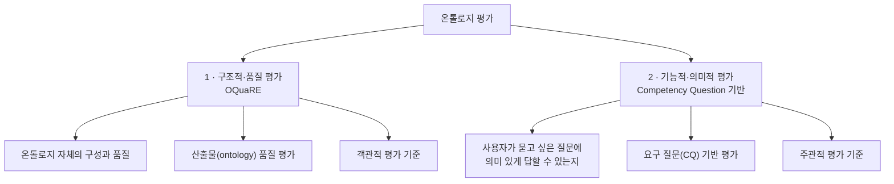
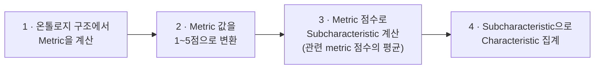
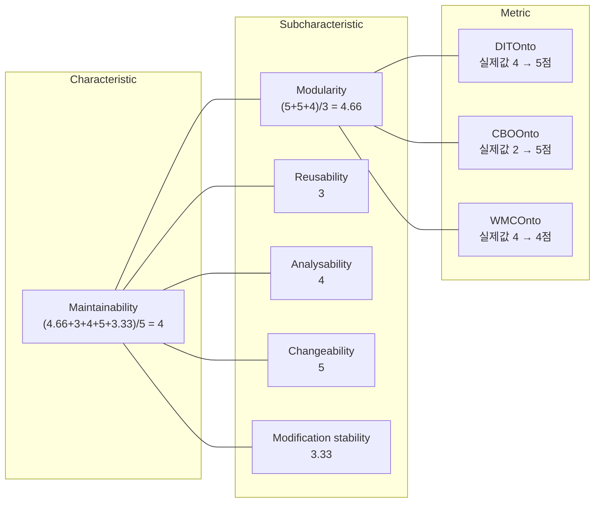

# S07 — 구조적·품질 평가 (OQuaRE)

> **Ch.3 평가 방법론** · Day 4
> 강의는 **S07·S08이 한 회차로 진행**된다. 이 문서는 `01 Introduction`(두 회차 공통 도입)과
> `02 OQuaRE`를 다루고, `03 CQOA` · `04 통합 및 결론`은 [S08](S08-기능적-의미적-평가-CQ.md)에 있다.
>
> 다루는 논문 — Duque-Ramos, Fernández-Breis, Stevens, Aussenac-Gilles,
> *OQuaRE: A SQuaRE-based Approach for Evaluating the Quality of Ontologies* (JRPIT 43(2), 2011)
>
> 자료 밖 대조·인사이트는 부록 [S07-08-1 두 평가 틀의 빈칸](S07-08-1-두-평가-틀의-빈칸.md)으로 뺐다.

---

## 1. 온톨로지 평가란

온톨로지를 "좋다/나쁘다"로 재려면 기준이 여러 개 필요하다. 강의가 든 기준은 다섯 가지다.

- 구조가 안정적인가
- 개념과 관계가 충분한가
- 수정과 확장이 가능한가
- 다른 시스템과 연결 가능한가
- 사용자의 질문에 답변 가능한가

다섯 개가 서로 다른 것을 본다는 데서 이야기가 시작된다.

> **온톨로지 품질은 하나의 점수로 충분히 설명되지 않는다.**

강의는 FOAF 온톨로지 전체 다이어그램을 띄워놓고 이 말을 했다. 클래스와 프로퍼티, 리터럴이
수백 개 얽힌 그림을 놓고 "이 온톨로지는 3.7점"이라고 말해봐야 쓸모가 없다는 얘기다.

## 2. 평가의 두 갈래

Ch.3는 평가를 두 방식으로 나눠 각각 논문 한 편씩 본다.

| | 논문 |
|---|---|
| OQuaRE | *OQuaRE: A SQuaRE-based Approach for Evaluating the Quality of Ontologies* — Duque-Ramos · Fernández-Breis (Univ. de Murcia) · Stevens (Univ. of Manchester) · Aussenac-Gilles (IRIT) |
| CQOA | *Towards Competency Question-Driven Ontology Authoring* — Ren · Parvizi · Mellish · Pan · van Deemter (Univ. of Aberdeen) · Stevens (Univ. of Manchester) |

강의자가 슬라이드에 달아둔 한 줄:

> 서로 무관해 보이지만 온톨로지를 공학적으로 만들고 평가하려는 같은 흐름

두 논문의 관계는 [S08 §9 두 평가의 비교](S08-기능적-의미적-평가-CQ.md#9-두-평가의-비교)에서 다시 다룬다.

## 3. 공통 예시 — Pizza Ontology

두 논문의 예시가 각각 다른 도메인(생의학, 소프트웨어 공학)이라 강의는 논문 예시를 Pizza
Ontology로 바꿔서 설명한다. 세미나 내내 이 예시가 공통 기준이 된다.

| 구성 요소 | Pizza Ontology에서 |
|---|---|
| **Class** (종류 · 개념 · 범주) | `Pizza`(Margherita · Pepperoni · Vegetarian …) · `Topping`(Cheese · Meat · Vegetable …) · `Customer` |
| **Object Property** (개념 ↔ 개념) | `hasTopping` · `hasBase` |
| **Datatype Property** (개념 ↔ 데이터값) | `hasPrice` · `isVegetarian` · `isSpicy` |
| **Individual** (실제 객체) | `Customer_001` |

## 4. OQuaRE — Motivation

**문제 상황**

- 비슷한 목적의 온톨로지가 여러 개 존재한다
- **사용자는 그중 어떤 온톨로지를 쓸지 판단해야 한다**
- 그런데 기존 평가는 ranking · correctness · quality 등 판단 기준이 통일되지 못했다

→ 표준화된 온톨로지 품질 평가 방법이 필요하다.

**OQuaRE의 답**

> OQuaRE는 사용자가 강점·약점을 평가하고 논리적으로 informed decision을 하도록 돕는 프레임워크

"몇 점짜리 온톨로지냐"가 아니라 "이 온톨로지는 어디가 강하고 어디가 약하냐"를 내놓겠다는 것이다.
§1의 "한 점수로 설명되지 않는다"와 이어진다.

## 5. 소프트웨어 품질 표준의 이식

**SQuaRE**

- SW 개발 공정 각 단계에서 산출되는 제품이 **사용자 요구를 만족하는지** 검증하기 위해,
  품질 측정과 평가를 위한 **모델 · 측정기법 · 평가방안**을 정한 국제 표준
- SW 제품 품질 요구사항·평가 국제표준 **ISO/IEC 25000**

| 분류 | 내용 |
|---|---|
| ISO/IEC 2500n | Quality Management Division (품질 관리 부분) |
| ISO/IEC 2501n | Quality Model Division (품질 모델 부분) |
| ISO/IEC 2502n | Quality Measurement Division (품질 측정 부분) |
| ISO/IEC 2503n | Quality Requirements Division (품질 요구사항 부분) |
| ISO/IEC 2504n | Quality Evaluation Division (품질 평가 부분) |
| ISO/IEC 25050~25099 | SQuaRE Extension Division |

**OQuaRE**

- 온톨로지도 **소프트웨어 산출물로 볼 수 있다**
- → SQuaRE를 온톨로지 평가에 맞게 적용한 프레임워크

## 6. 품질 모델의 3층 구조

OQuaRE는 SQuaRE를 따라 품질을 3층으로 쪼갠다.

- **Characteristic** — 평가하고자 하는 요소
- **Subcharacteristic** — 세분화된 평가요소. 관련 metric으로 평가한다
- **Metric** — 실제 계산 가능한 값

### 6.1 Characteristic

| Characteristic | 의미 | Subcharacteristic |
|---|---|---|
| **Structural** | 온톨로지의 구조적 품질 | formalisation · formal relations support · cohesion · tangledness · redundancy · consistency … |
| **Functional adequacy** | 온톨로지가 의도한 목적에 얼마나 적합한지 | controlled vocabulary · schema and value reconciliation · consistent search and query · knowledge acquisition · clustering and similarity · indexing and linking · results representation · classifying instances · text analysis · guidance and decision trees · knowledge reuse … |
| **Maintainability** | 온톨로지를 수정·확장·분석·테스트하기 쉬운지 | modularity · reusability · analysability · changeability · modification stability · testability |
| **Reliability** | 일정 조건에서 성능과 품질을 유지할 수 있는지 | recoverability · availability … |
| **Operability** | 사용자가 온톨로지를 이해하고 사용하는 데 드는 노력 | learnability … |
| **Compatibility** | 다른 온톨로지나 시스템과 함께 쓸 수 있는지 | … |
| **Transferability** | 다른 환경으로 옮겨 사용하기 쉬운지 | … |

### 6.2 Subcharacteristic 정의

강의가 원문 그대로 띄운 정의들.

**Structural**

| | |
|---|---|
| Formalisation | 효율적인 온톨로지는 추론을 지원하기 위해 형식 모델 위에 세워져야 한다 |
| Formal relations support | 대부분의 온톨로지는 분류(taxonomy)에 대해서만 형식적 지원을 갖는다. 추가적인 형식 이론의 사용은 긍정적 지표다 |
| Cohesion | 클래스들이 강하게 연관돼 있으면 응집도가 높다 |
| Tangledness | 다중 부모 범주의 분포를 측정한다. 다중 상속의 존재와 관련되며, 보통 최적이 아닌 설계의 신호다 |

**Functional adequacy**

| | |
|---|---|
| Schema and value reconciliation | 온톨로지는 서로 다른 뷰의 조정·통합에 적용할 수 있는 공통 데이터 모델을 제공한다. 데이터와 정보에 의미적 맥락을 줄 수 있다면 의미적 상호운용성 달성을 돕는다 |
| Consistent search and query | 온톨로지의 형식 모델은 더 나은 질의·검색 방법을 가능하게 한다. 이 의미적 맥락은 개념뿐 아니라 기계가 계산 가능한 모든 프로퍼티와 공리로부터 나온다 |
| Knowledge reuse | 한 온톨로지의 지식이 다른 온톨로지를 만드는 데 쓰일 수 있는 정도 |
| Knowledge acquisition | 온톨로지는 인스턴스를 획득하는 양식을 생성하기 위한 템플릿이다 |

**Maintainability**

| | |
|---|---|
| Modularity | 온톨로지가 개별 컴포넌트로 구성돼, 한 컴포넌트의 변경이 다른 컴포넌트에 최소한의 영향만 주는 정도 |
| Reusability | 온톨로지의 일부가 둘 이상의 온톨로지에서, 또는 다른 온톨로지를 만드는 데 재사용될 수 있는 정도 |
| Analysability | 온톨로지의 결함이나 비일관성의 원인을 진단할 수 있는 정도 |

## 7. Metric

OQuaRE가 쓰는 메트릭은 14개다. 대부분 객체지향 소프트웨어 메트릭(LCOM · WMC · DIT · NOC ·
CBO · RFC)을 온톨로지에 옮긴 것이라 이름 끝에 `Onto`가 붙어 있다.

**표기** — `C_i`: 온톨로지의 클래스 / `R_Ci`: 클래스 `C_i`의 관계 / `P_Ci`: 클래스 `C_i`의 프로퍼티 /
`I_Ci`: 클래스 `C_i`의 개체 / `Sup_Ci`: 클래스 `C`의 직접 상위 클래스 / `Thing`: 온톨로지의 루트 클래스

| Metric | 재는 것 | 계산 |
|---|---|---|
| **LCOMOnto** (Lack of Cohesion in Methods) | 클래스의 의미적·개념적 연관성으로 책임 분리와 컴포넌트 독립성을 잰다 | `Σ path(C(leaf)_i) / m` — leaf class `i`에서 `Thing`까지의 경로 길이를, 온톨로지의 전체 경로 수 `m`으로 나눈다 |
| **WMCOnto** (Weighted Method Count) | 클래스당 프로퍼티·관계의 평균 수 | `(Σ|P_Ci| + Σ|R_Ci|) / Σ|C_i|` |
| **DITOnto** (Depth of subsumption hierarchy) | `Thing`에서 leaf class까지 가장 긴 경로의 길이 | `Max(Σ D(C_i))` |
| **NACOnto** (Number of Ancestor Classes) | leaf class당 평균 조상 클래스 수 = leaf class당 직접 상위 클래스 수 | `Σ|Sup_C(leaf)i| / Σ|C(leaf)_i|` |
| **NOCOnto** (Number of Children) | 평균 직접 하위 클래스 수 | `Σ|R_Ci| / (Σ|C_i| − |R_Thing|)` |
| **CBOOnto** (Coupling between Objects) | 연관된 클래스 수 — 클래스당 직접 부모의 평균 | `Σ|Sup_Ci| / (Σ|C_i| − |R_Thing|)` |
| **RFCOnto** (Response for a class) | 클래스에서 직접 접근 가능한 프로퍼티 수 | `(Σ|P_Ci| + Σ|Sup_Ci|) / (Σ|C_i| − |R_Thing|)` |
| **NOMOnto** (Number of properties) | 클래스당 프로퍼티 수 | `Σ|P_Ci| / Σ|C_i|` |
| **RROnto** (Properties Richness) | 온톨로지에 정의된 프로퍼티 수를, 관계 수와 프로퍼티 수로 나눈 값 | `Σ|P_Ci| / Σ(|R_Ci| + |C_i|)` |
| **AROnto** (Attribute Richness) | 클래스당 평균 속성 수 | `Σ|Att_Ci| / Σ|C_i|` |
| **INROnto** (Relationships per class) | 클래스당 평균 관계 수 | `Σ|R_Ci| / Σ|C_i|` |
| **CROnto** (Class Richness) | 클래스당 평균 인스턴스 수 | `Σ|I_Ci| / Σ|C_i|` |
| **ANOnto** (Annotation Richness) | 클래스당 평균 어노테이션 수 | `Σ|A_Ci| / Σ|C_i|` |
| **TMOnto** (Tangledness) | 클래스당 평균 부모 수 | `Σ|R_Ci| / (Σ|C_i| − Σ|C(DP)_i|)` — `C(DP)_i`는 직접 부모가 둘 이상인 클래스 |

> 원문(2011 §2.2)과 대조했고 수식·정의가 그대로다. 다만 **강의가 다룬 건 2011년 판**이고,
> 같은 팀의 2013년 후속 논문에서 특성 개수와 여러 메트릭 정의가 이미 달라져 있다
> → [부록 §1](S07-08-1-두-평가-틀의-빈칸.md#1-2011년에서-2013년으로-바뀐-것)

## 8. 평가 절차 — 4단계

### 8.1 1~5점 변환표

점수는 `1 = 수용불가` ↔ `5 = 요구사항 초과(만족)` 방향이다. **대부분의 구조 메트릭은 값이 작을수록
높은 점수**를 받고(깊이·결합도·부모 수가 클수록 나쁘다), **비율 메트릭(`RROnto` 이하)은 클수록**
높은 점수를 받는다.

> 원문에 두 가지가 더 있다. 1~5 척도의 뜻은 SQuaRE에서 그대로 가져온 것으로,
> `1 = 수용 불가` · `3 = 최소 수용 가능` · `5 = 요구사항 초과`다. 가운데 3에 "이 정도면 쓸 수는
> 있다"는 의미가 붙어 있다. 그리고 비율 메트릭 구간이 20%씩 잘린 건 척도 1단위를 20%로 잡았기
> 때문이다. 절대값 메트릭 구간은 각 메트릭의 의미를 보고 따로 정했다고만 적혀 있다

| Metric \ Score | 1 | 2 | 3 | 4 | 5 |
|---|---|---|---|---|---|
| LCOMOnto | > 8 | (6-8] | (4,6] | (2,4] | <= 2 |
| WMCOnto | > 15 | (11,15] | (8,11] | (5,8] | <= 5 |
| DITOnto | > 8 | (6-8] | (4,6] | (2,4] | [1,2] |
| NACOnto | > 8 | (6-8] | (4,6] | (2,4] | [1,2] |
| NOCOnto | > 12 | (8-12] | (6,8] | (3,6] | [1,3] |
| CBOOnto | > 8 | (6-8] | (4,6] | (2,4] | [1,2] |
| RFCOnto | > 12 | (8-12] | (6-8] | (3-6] | [1-3] |
| NOMOnto | > 8 | (6-8] | (4,6] | (2,4] | <= 2 |
| RROnto | [0,20]% | (20-40]% | (40-60]% | (60-80]% | > 80% |
| AROnto | [0,20]% | (20-40]% | (40-60]% | (60-80]% | > 80% |
| INROnto | [0,20]% | (20-40]% | (40-60]% | (60-80]% | > 80% |
| CROnto | [0,20]% | (20-40]% | (40-60]% | (60-80]% | > 80% |
| ANOnto | [0,20]% | (20-40]% | (40-60]% | (60-80]% | > 80% |
| TMOnto | > 8 | (6-8] | (4,6] | (2,4] | (1,2] |

### 8.2 Subcharacteristic × Metric 기여표

3단계에서 subcharacteristic은 **관련 metric 점수의 평균**으로 계산한다. 어느 metric이 어느
subcharacteristic에 걸리는지는 정해져 있다. 강의가 띄운 것은 Maintainability의 6개
subcharacteristic이다. `+`는 기여, `−`는 역방향 기여.

| Subcharacteristic \ Metric | WMCOnto | DITOnto | NOCOnto | RFCOnto | NOMOnto | LCOMOnto | CBOOnto |
|---|---|---|---|---|---|---|---|
| Modularity | + | | | | | | + |
| Reusability | + | + | − | + | + | | + |
| Analysability | + | + | | + | + | + | + |
| Changeability | + | + | + | + | + | + | + |
| Modification stability | + | | + | + | | + | + |
| Testability | + | + | | + | + | + | + |

> 원문은 부호의 뜻을 정해뒀다. `+`는 메트릭 값이 클수록 그 subcharacteristic 점수가 높아진다는
> 뜻이고, `−`는 값이 작을수록 높아진다는 뜻이다. 이 표에서 `−`는 `Reusability × NOCOnto` 한
> 칸뿐이다. 하위 클래스가 많을수록 재사용하기 어렵다고 본 것이다. 이 부호는 §8.1 변환표와는
> 별개다. 변환표에서는 이미 대부분의 메트릭이 "작을수록 고득점"으로 뒤집혀 있다

## 9. 계산 예시 — Pizza Ontology의 Maintainability

Pizza Ontology에 **`VeganPizza`를 추가**하는 상황을 놓고 Maintainability를 잰다.

- Topping 계층 일부만 수정하면 된다
- 기존 `MargheritaPizza` · `PepperoniPizza` 구조는 크게 영향받지 않는다
- → Maintainability가 좋다

강의는 이걸 실제 수치로 옮긴 **가상 계산**을 보여준다.

각 subcharacteristic이 무엇을 뜻하는지 강의가 붙인 해석:

| Subcharacteristic | Pizza Ontology에서 |
|---|---|
| Modularity | 피자 · 토핑 · 메뉴 · 추천 정보가 잘 분리돼 있다 |
| Reusability | Topping 구조를 다른 음식 온톨로지에서도 재사용할 수 있다 |
| Analysability | 오류가 생겼을 때 원인을 찾기 쉽다 |
| Changeability | 새 토핑이나 새 피자를 추가하기 쉽다 |
| Modification stability | 수정해도 다른 부분이 쉽게 깨지지 않는다 |

> 이 슬라이드의 메트릭 설명·구성·점수 변환은 §7·§8.1·§8.2와 어긋난다.
> 가상 계산이라 그렇다 해도 짚어둘 만해서 → [부록 §2](S07-08-1-두-평가-틀의-빈칸.md#2-계산-예시가-앞-슬라이드와-어긋나는-세-지점)

## 10. 평가 사례

논문이 OQuaRE를 실제로 적용한 두 케이스.

| 대상 | 온톨로지 |
|---|---|
| **측정 단위 온톨로지** | UNITPATO · OPENMATH · SCIUNITS · WURCVOC · GIST · UNITSWEET · SYSML_QUDV · MUOVOCAB · GISTUM · QUDV_SI · UCUM |
| **세포 종류 온톨로지** | oCTO · nCTO (Cell Type Ontology의 두 버전) |

> 세포 온톨로지 쪽이 왜 두 버전인지는 원문에 있다. **`oCTO`는 원본**으로 subsumption과
> `develops from`만 있는 **공리가 빈약한(axiomatically lean)** 버전이고 OBO에서 OWL로 변환한 것이다.
> **`nCTO`는 정규화(normalisation)로 만든 공리가 풍부한 버전**으로, 클래스마다 상위 클래스를
> 최대 하나만 두는 원시 클래스 축을 세우고 나머지를 정의된 모듈로 표현해 다중 상속 계층을
> 추론기가 유지하게 한다. 즉 이 비교는 **같은 도메인·같은 내용을 공리화 수준만 달리했을 때
> OQuaRE 점수가 어떻게 갈리는지** 보는 실험이다

각 케이스마다 **수동 평가(manual)와 자동 평가(automatic) 결과를 나란히** 놓고 비교한다.
자동 평가는 Structural · Maintainability · Functional Adequacy · Operability · Reliability에
더해 Transferability · Compatibility까지 낸다(수동 평가에는 뒤 둘이 없다).

강의의 결론 한 줄:

> 자동 평가가 수동 평가와 대체로 유사한 경향

> 이 "유사한 경향"이 통계적으로 무엇을 뜻하는지는 후속 논문이 직접 검정했다. 평균은 같지만
> 상관은 없다 → [부록 §3](S07-08-1-두-평가-틀의-빈칸.md#3-자동-평가와-수동-평가가-유사하다는-말의-범위)

## 11. Conclusion

SQuaRE 기반 온톨로지 평가 프레임워크로서 OQuaRE의 결론.

1. **소프트웨어 품질 평가 표준을 온톨로지 평가에 적용**한 평가 방법론 OQuaRE를 제안했다
2. OQuaRE는 온톨로지 품질을 **자동으로 정량 평가**할 수 있다
3. OQuaRE는 온톨로지를 단순히 ranking하지 않고, **강점과 약점을 품질 특성별로 보여준다는 점에서 실용적**이다
   - 어떤 온톨로지는 구조가 좋지만 operability가 낮을 수 있고,
     어떤 온톨로지는 재사용성은 좋지만 recoverability가 낮을 수 있다

3번이 §4 Motivation의 "informed decision"과 §1의 "한 점수로 설명되지 않는다"에 대한 답이다.

> 원문은 여기서 한 발 더 나간다. "어느 온톨로지가 제일 낫다"는 결론을 일부러 내지 않았다고
> 밝히면서, 대신 각 온톨로지의 특징을 서술했다고 적는다. "평가한 온톨로지 전부가 대부분의
> 기준에서 수용 가능한 품질이며, 결정은 사용자나 개발자가 자기 필요에 따라 내려야 한다"는 것이다.
> 다만 전체 점수가 필요하면 특성 점수들의 가중 평균으로 낼 수 있다는 여지도 남겨뒀다. 그리고
> 논문이 스스로 꼽은 기여는 범주와 메트릭을 새로 만든 게 아니라, ISO 표준의 지침에 맞춰 그것들을
> 정리해 온톨로지 평가를 공학 활동으로 바꾸려 한 방식에 있다고 쓴다

---

## 이어지는 곳

- [S08 — 기능적·의미적 평가 (CQ 기반)](S08-기능적-의미적-평가-CQ.md) — 같은 회차의 나머지 절반.
  `03 CQOA`와 `04 통합 및 결론`(두 평가의 비교 · 두 프레임워크의 한계)
- [부록 S07-08-1 — 두 평가 틀의 빈칸](S07-08-1-두-평가-틀의-빈칸.md) — 원논문 대조 결과와 두 평가의 관계
- [S02 설계 원칙](S02-설계-원칙.md) — "Ch.3가 이 강의의 목 지점"이라 적어둔 곳
- [S04 OTKM](S04-온톨로지-엔지니어링-방법론.md) §평가 — 평가 3분류가 Ch.3에서 다뤄진다고 예고한 곳
