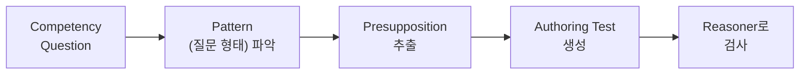
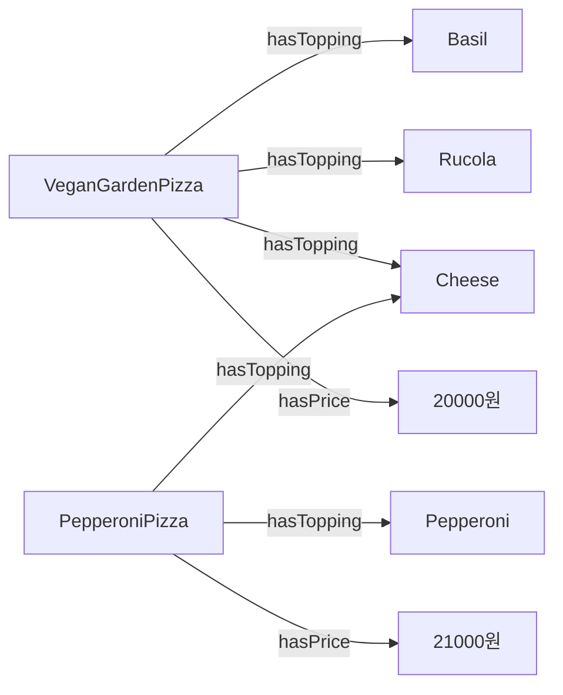
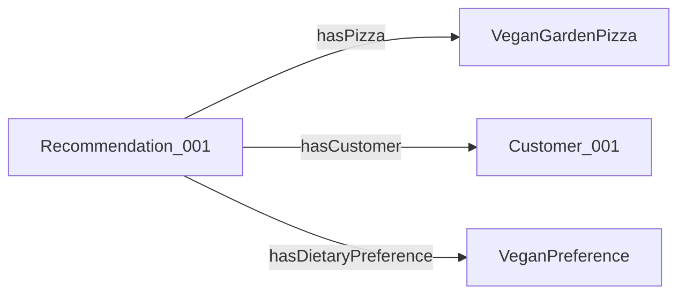
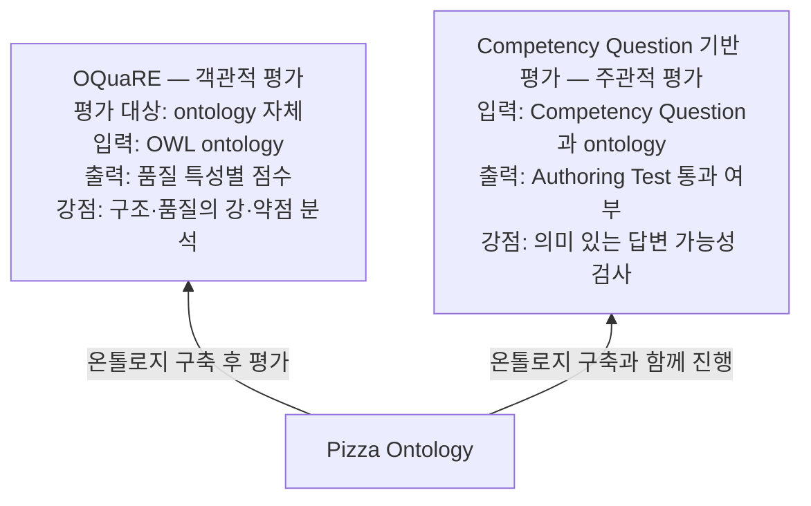

# S08 — 기능적·의미적 평가 (CQ 기반)

> **Ch.3 평가 방법론** · Day 4
> 강의는 **S07·S08이 한 회차로 진행**된다. 이 문서는 `03 CQOA`와 `04 통합 및 결론`을 다룬다.
> `01 Introduction`(두 회차 공통 도입 · 평가의 두 갈래 · Pizza Ontology)과 `02 OQuaRE`는
> [S07](S07-구조적-품질-평가-OQuaRE.md)에 있다.
>
> 다루는 논문 — Ren, Parvizi, Mellish, Pan, van Deemter, Stevens,
> *Towards Competency Question-Driven Ontology Authoring* (ESWC 2014, LNCS 8465, pp. 752–767)
>
> 자료 밖 대조·인사이트는 부록 [S07-08-1 두 평가 틀의 빈칸](S07-08-1-두-평가-틀의-빈칸.md)으로 뺐다.

---

## 1. Motivation

**온톨로지 작성의 어려움**

- 도메인 전문가 ≠ 온톨로지 전문가
- 요구사항을 온톨로지 표현(**OWL axiom**)으로 작성하기 어렵다
- 작성 결과가 원래 요구사항을 만족하는지 확인하기 어렵다

앞의 두 개는 쓰기가 어렵다는 얘기고, 세 번째는 다 쓰고 나서 맞는지 확인하기가 어렵다는 얘기다.
CQOA가 노리는 건 세 번째다.

**CQOA 접근**

- Competency Question + **test-before development** 결합
- 즉 — 질문을 먼저 쓰고, 질문에서 테스트를 생성하여, ontology를 생성하며 자동 검사한다면?

소프트웨어의 테스트 주도 개발을 온톨로지 저작에 옮긴 것이다. 테스트를 먼저 쓰고 그 테스트를
통과하도록 코드를 짜듯, CQ에서 테스트를 뽑고 그 테스트를 통과하도록 온톨로지를 짠다.

**파이프라인**

이 다섯 칸이 §2~§4의 순서다. 강의는 절마다 이 그림을 한 칸씩 채워가며 설명한다.

## 2. Competency Question

**온톨로지가 답할 수 있어야 하는 질문.**

Pizza Ontology를 예로 든 CQ들:

- *Which pizzas contain pork?*
- *Which pizzas contain no mushroom?*
- *What pizza has the lowest price?*
- *Which pizza has the most toppings?*
- *Do pizzas have different values of size?*

> **Competency Question은 온톨로지의 기능적 요구사항이 될 수 있다.**

이 한 줄이 CQOA 전체가 딛고 선 전제다. CQ를 나중에 확인할 체크리스트가 아니라 요구사항 명세로
보기 시작하면, 소프트웨어의 테스트 주도 개발 방식을 그대로 가져올 수 있다.

## 3. Presupposition 추출

**Presupposition(전제)** — 질문이 의미 있으려면 미리 참이어야 하는 조건.

CQ *"Which pizzas contain pork?"*의 전제는 다섯 개다.

1. `Pizza` class가 있어야 함
2. `PorkTopping` class가 있어야 함
3. `hasTopping` property가 있어야 함
4. 피자가 돼지고기 토핑을 **가질 수 있음**
5. 피자가 돼지고기 토핑을 **안 가질 수도 있음**

앞의 셋은 어휘가 있느냐를 보고, 뒤의 둘은 그 질문이 무의미해지지 않느냐를 본다. 모든 피자가
반드시 pork를 가진다면 "contain pork"라는 조건이 쓸모없어진다. 반대로 어떤 피자도 pork를 가질
수 없다면 답은 늘 공집합이다. 둘 다 온톨로지 설계가 잘못됐다는 신호다.

> **답을 반환하는지보다 질문이 의미 있는지 먼저 확인** → 질문의 전제들이 온톨로지의 설계 조건을 생성한다

## 4. Authoring Test 생성

**Authoring Test(AT)** — Presupposition을 실제로 검사 가능한 테스트로 바꾼 것.

| Presupposition | Authoring Test |
|---|---|
| `Pizza` class가 있어야 함 | `Pizza`가 존재함 |
| `PorkTopping` class가 있어야 함 | `PorkTopping`이 존재함 |
| `hasTopping` property가 있어야 함 | `hasTopping`이 존재함 |
| 피자가 돼지고기 토핑을 가질 수 있음 | `Pizza ⊓ ∃hasTopping.PorkTopping` 이 satisfiable |
| 피자가 돼지고기 토핑을 안 가질 수도 있음 | `Pizza ⊓ ∀hasTopping.¬PorkTopping` 이 satisfiable (모든 topping이 pork가 아님) |

앞 셋은 어휘를 찾아보면 되고, 뒤 둘은 reasoner의 satisfiability 검사로 자동 확인된다.

> 이 온톨로지는 이 질문을 의미 있게 받을 준비가 되어 있는가?
> → **답을 찾는 시스템이라기보다 질문 가능성을 검사하는 작성 지원 방법**

## 5. Competency Question type — 12가지 패턴

CQ를 아무 형태로나 쓸 수 있으면 자동화가 안 된다. 논문은 실제 CQ들을 모아 12가지 패턴(archetype)
으로 정리했고, 그중 6가지가 많이 등장한다.

질문 type이 정해지면 그 질문이 만들 Authoring Test도 따라서 정해진다. 파이프라인의 `Pattern 파악`
칸이 하는 일이 이거다.

**Table 1 — CQ Archetypes**

`PA` = Predicate Arity · `RT` = Relation Type · `M` = Modifier · `DE` = Domain-independent Element
`obj.` = object property relation · `data.` = datatype property relation · `num.` = numeric modifier ·
`quan.` = quantitative modifier · `tem.` = temporal element · `spa.` = spatial element
`CE` = class expression · `OPE` = object property expression · `DP` = datatype property ·
`I` = individual · `NM` = numeric modifier · `PE` = property expression · `QM` = quantity modifier

| ID | Pattern | Example | PA | RT | M | DE |
|---|---|---|---|---|---|---|
| 1 | Which [CE1] [OPE] [CE2]? | Which pizzas contain pork? | 2 | obj. | | |
| 2 | How much does [CE] [DP]? | How much does Margherita Pizza weigh? | 2 | data. | | |
| 3 | What type of [CE] is [I]? | What type of software (API, Desktop application etc.) is it? | 1 | | | |
| 4 | Is the [CE1] [CE2]? | Is the software open source development? | 2 | | | |
| 5 | What [CE] has the [NM] [DP]? | What pizza has the lowest price? | 2 | data. | num. | |
| 6 | What is the [NM] [CE1] to [OPE] [CE2]? | What is the best/fastest/most robust software to read/edit this data? | 3 | both | num. | |
| 7 | Where do I [OPE] [CE]? | Where do I get updates? | 2 | obj. | | spa. |
| 8 | Which are [CE]? | Which are gluten free bases? | 1 | | | |
| 9 | When did/was [CE] [PE]? | When was the 1.0 version released? | 2 | data. | | tem. |
| 10 | What [CE1] do I need to [OPE] [CE2]? | What hardware do I need to run this software? | 3 | obj. | | |
| 11 | Which [CE1] [OPE] [QM] [CE2]? | Which pizza has the most toppings? | 2 | obj. | quan. | |
| 12 | Do [CE1] have [QM] values of [DP]? | Do pizzas have different values of size? | 2 | data. | quan. | |

§2의 CQ 다섯 개가 각각 archetype 1 · 1(부정형) · 5 · 11 · 12에 해당한다.

> 이 12개가 어디서 나온 숫자인지, "6가지가 많이 등장"이 얼마나 많이인지는 논문의 실증 연구에
> 수치로 나와 있는데 강의는 생략했다 → [부록 §4](S07-08-1-두-평가-틀의-빈칸.md#4-12개-패턴이-나온-실증-연구)

## 6. Modifier

**Modifier** — 질문 안에서 **답을 제한하거나 비교하게 만드는 표현.**
예) 가장 싼(lowest) pizza → `lowest`가 modifier.

modifier가 붙으면 어휘가 있는 것만으로는 부족하다. 비교가 가능한 구조인지까지 전제가 된다.

**1. Quantity modifier — 관계의 개수를 본다**

- 관계의 개수도 제약이 가능한지 확인해야 한다
- 예) *Which pizza has the most toppings?*
  - `Pizza -hasTopping-> Topping` 이 관계가 몇 개 존재하는지 확인해야 한다

**2. Numeric modifier — 데이터 값을 본다**

- 해당 데이터가 비교 가능한 정수/실수 형태여야 한다
- 예) *What pizza has the lowest price?*
  - 가격 property가 숫자형이어야 한다

강의가 든 그림에서, `VeganGardenPizza`와 `PepperoniPizza`가 각각 토핑 여러 개와
`hasPrice` 20000원 / 21000원을 갖는다. Quantity modifier는 왼쪽의 `hasTopping` 화살표 **개수**를,
Numeric modifier는 오른쪽 `hasPrice` **값**을 본다.

## 7. n-ary

**하나의 관계가 세 개 이상의 대상을 동시에 연결하는 경우.**

예시 질문 — *What is the best pizza for a vegan customer?*

이 질문 하나에 네 가지가 얽혀 있다.

- `Pizza` — 어떤 피자가
- `Customer` — 어떤 고객에게
- `DietaryPreference` — 어떤 조건에서
- `SuitabilityScore` — 얼마나 적합한지

**단순히 `Pizza -recommendedFor-> Customer` 모델링으로는 해결 불가하다.** 이 화살표 하나에는
"어떤 조건에서"와 "얼마나"를 실을 자리가 없다.

**해결 — 새로운 class를 추가한다** (예: `Recommendation` class). 관계 자체를 개체로 만든다.

이 reification은 CQ 하나 때문에 온톨로지 구조 자체가 바뀌는 경우다. 어휘를 몇 개 추가하는 게
아니라 모델링 방식이 달라진다. §10 한계에서 다시 나온다.

## 8. Conclusion — CQOA

> CQOA: 온톨로지 요구사항 작성과 테스트를 쉽게 만들기 위한 방법론

1. Competency question 작성 → 질문에서 Authoring test 생성 → Test를 만족하도록 온톨로지 생성
   - 기존 방식) 온톨로지 작성 → 나중에 질문 가능 여부 확인
2. Competency question은 **패턴화 가능**(12가지 유형) + **presupposition으로 변환 가능**
3. CQOA는 competency question의 답 찾기보다 **의미 있는 답변 가능성 검사**에 집중

1번의 순서 뒤집기가 핵심이다. 2번은 그 뒤집기를 자동화할 수 있다는 근거고, 3번은 그래서 이게
질의응답 시스템이 아니라 작성 지원 도구라고 못을 박는 부분이다.

---

## 9. 두 평가의 비교

`04 통합 및 결론` — S07의 OQuaRE와 S08의 CQ 기반 평가를 나란히 놓는다.

| | OQuaRE | CQ 기반 평가 |
|---|---|---|
| 성격 | 객관적 | 주관적 |
| 평가 대상 | ontology 자체 | — |
| 입력 | OWL ontology | Competency Question과 ontology |
| 출력 | 품질 특성별 점수 | Authoring Test 통과 여부 |
| 강점 | 구조·품질의 강·약점 분석 | 의미 있는 답변 가능성 검사 |
| 시점 | 온톨로지 구축 **후** 평가 | 온톨로지 구축과 **함께** 진행 |

마지막 행이 두 방식의 실질적인 차이다. OQuaRE는 완성품을 채점하고, CQ 기반 평가는 만드는 동안
계속 돌아간다. 다만 CQ 쪽도 완성 시점에 전부 통과했는지를 보면 결과 평가가 된다. 둘을 언제 어떻게
쓰는지는 [부록 §5.1](S07-08-1-두-평가-틀의-빈칸.md#51-언제-무엇을-쓰는가)에 정리했다.

## 10. 두 프레임워크의 한계

**OQuaRE**

- **Threshold 문제** — 도메인마다 좋은 값의 기준이 달라질 수 있다
  ([S07 §8.1 변환표](S07-구조적-품질-평가-OQuaRE.md#81-15점-변환표)의 구간값이 어디서나 통하지 않는다)
- **계산 방식의 한계** — 평균으로 metric → subcharacteristic → characteristic을 계산한다
  - 모든 subcharacteristic이 항상 같은 중요도를 갖지는 않는다
- Requirements · evaluation process 확장은 future work

**CQOA**

- 온톨로지 구축 및 평가 **프레임워크 제안 논문**에 가깝다
  - 실제 실험 수행 및 Authoring test가 효율성과 생산성을 높이는지 **검증은 후속 과제로 미룸**
- **복잡한 도메인**(예: 법률 도메인)에서 복잡한 추론과 조건이 있을 때 적용이 제한적이다
- 논문의 구현 시스템 상으로는 **12개 종류의 question 형태로 질문해야 한다**
  - LLM을 이용한 구축에서 해결해야 할 과제
- 결국 **복잡한 n-ary 관계 모델링은 사람이 개입하여 수행해야 한다** (§7)

> 여기 적힌 OQuaRE의 한계 셋은 **2011년 논문이 스스로 남긴 future work 목록**이고, CQOA의 한계도
> 하나(법률 도메인)를 빼면 논문 근거가 있다. 그리고 OQuaRE의 "requirements 확장은 future work"와
> CQOA의 존재가 정확히 맞물린다. 마지막 두 항목은 Ch.7(LLM 기반 온톨로지 구축)의 예고이기도 하다
> → [부록 §5](S07-08-1-두-평가-틀의-빈칸.md#5-두-빈칸이-서로를-가리킨다)

---

## 이어지는 곳

- [S07 — 구조적·품질 평가 (OQuaRE)](S07-구조적-품질-평가-OQuaRE.md) — 같은 회차의 앞 절반
- [부록 S07-08-1 — 두 평가 틀의 빈칸](S07-08-1-두-평가-틀의-빈칸.md)
- [S04-1 OTKM이 정하지 않은 것들](S04-1-OTKM이-정하지-않은-것들.md) §4 — ORSD ↔ CQ ↔ 평가 축이
  여기서 닫힌다고 예고한 곳
- [S03-1 자동구축의 천장](S03-1-자동구축의-천장.md) — "대리 채점의 함정을 CQ가 실제로 피하는가"를
  S08에서 확인하겠다고 적어둔 곳
- **S24 (Ch.7)** — CQ 기반 Human-in-the-loop 파이프라인. CQOA의 후속 과제가 여기서 다시 나온다
