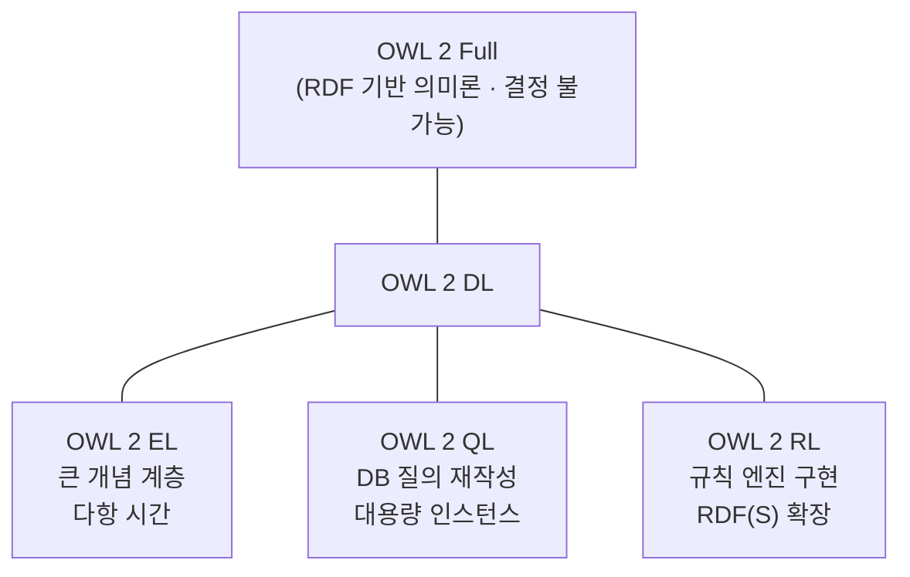
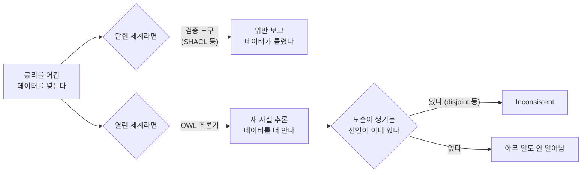

# 부록 — 제약처럼 보이는 공리들

> **성격** — [S09 OWL 온톨로지 설계 실습](S09-OWL-온톨로지-설계-실습.md) 정리 중 갈라져 나온 내용.
> 강의 자료에 없다.
>
> 실습 회차라 대조할 원논문이 없다. 대신 슬라이드와 노트북의 코드를 **그대로 실행해서** 설명과
> 맞는지 확인했다. 아래 결과는 전부 실제 실행 출력이다.
>
> 실행 환경 — owlready2 0.51 · HermiT (owlready2 동봉 `HermiT.jar`) · OpenJDK 21.0.10 ·
> Python 3.14 · macOS(arm64). `sync_reasoner(world, infer_property_values=True)` 호출.
> 각 항목은 `World()`를 새로 만들어 서로 영향을 주지 않게 했다.
> 문서 규격은 W3C OWL 2 Profiles (2nd Ed., 2012-12-11) 원문을 받아 대조했다.
>
> §2·§3은 자료 자체의 오류라 따로 짧게 끝내고, §4가 이 문서의 본론이다.

---

## 1. 한눈에

| 자료의 설명 | 실행 결과 |
|---|---|
| 슬라이드: domain/range는 주어·목적어 자리에 **허용하는** 클래스 | 위반해도 에러가 아니다. 어긴 개체가 그 클래스로 **추론**된다 |
| 노트북 Step 4: domain/range는 **추론 힌트** | 실행 결과와 일치한다 |
| 슬라이드: `some` = 최소 1개는 있어야 함 | 하나도 없어도 일관(consistent)이다. 검사되지 않는다 |
| 슬라이드: `only` = 연결되는 모든 대상은 TargetClass여야 한다 | 다른 타입을 연결해도 에러가 아니다. 그 대상이 TargetClass로 **추론**된다 |
| 슬라이드: FunctionalProperty 위반 시 "모순 **혹은** 같은 값으로 추론" | 리터럴이면 항상 모순, 개체면 항상 sameAs. 둘 중 어느 쪽인지는 정해져 있다 |
| 노트북 Step 5: "두 값이 있으면 두 값이 같다고 추론(Same-as)" | 노트북의 예시(`title`, `pub_year`는 DataProperty)에서는 모순이 난다 |
| 슬라이드 14p 코드 `p1.title = ["제목A", "제목B"]` | 모순도 sameAs도 아니고, **추론기가 실행 자체를 못 한다** |
| 노트북: OWL 2 프로파일 `EL → QL → RL → DL → Full` | W3C는 세 프로파일이 서로 독립이라고 명시한다 |
| 슬라이드: AllDisjoint 위반 → Inconsistent ontology | 일치한다 |
| 슬라이드: EquivalentClass 자동 분류 | 일치한다 |

## 2. 슬라이드 코드를 그대로 돌리면

슬라이드 14p의 FunctionalProperty 위반 예시는 이렇게 적혀 있다.

```python
p1.title = ["제목A", "제목B"]
# → 추론기가 "모순" 혹은 두 값을 "같은 값"으로 추론
```

이 줄을 그대로 실행하면 셋 중 어느 쪽도 일어나지 않는다.

```
스칼라 할당 후 p.title = 'Knowledge Graph Survey'
리스트 할당 후 p.title = ['제목A', '제목B']
실제 저장된 트리플     = [(313, 311, '"["제목A", "제목B"]"^^<http://www.w3.org/1999/02/22-rdf-syntax-ns#json>')]
추론: 추론기 실행 실패 → org.semanticweb.HermiT.datatypes.UnsupportedDatatypeException
```

owlready2는 FunctionalProperty를 스칼라로 다루기 때문에, 리스트를 넣으면 "값 두 개"가 아니라
**리스트 하나를 통째로 직렬화한 `rdf:json` 리터럴 한 개**로 저장한다. 트리플은 여전히 하나라
functional 위반이 성립하지 않고, 대신 OWL 2 데이터타입 맵에 없는 `rdf:json`이 들어가서 HermiT가
파싱 단계에서 죽는다.

슬라이드가 말하려던 상황을 실제로 보려면 트리플이 두 개 들어가야 한다.

```python
# 저수준 API로 트리플 2개를 직접 넣는다
o._add_data_triple_spod(p1.storid, title.storid, *to_literal("제목A"))
o._add_data_triple_spod(p1.storid, title.storid, *to_literal("제목B"))
# → INCONSISTENT
```

라이브러리가 OWL을 Python처럼 보이게 감싸주는 대가다. `p1.title = [...]`은 OWL 문법이 아니라
owlready2의 Python 문법이고, 둘 사이가 항상 1:1로 대응하지는 않는다. 이 대가는
[§4.3](#43-functionalproperty--리터럴이면-모순-개체면-sameas)에서 한 번 더 나온다.

## 3. OWL 2 프로파일은 일렬로 늘어서지 않는다

노트북 이론 요약은 프로파일을 이렇게 적었다.

> OWL 2 프로파일 — EL (경량) → QL → RL → DL (표현력 높음) → Full

화살표로 이어놓으면 EL ⊂ QL ⊂ RL ⊂ DL처럼, 오른쪽으로 갈수록 표현력이 커지는 사슬로 읽힌다.
W3C OWL 2 Profiles 원문은 다르게 말한다.

> An OWL 2 profile … is a trimmed down version of OWL 2 that trades some expressive power for the
> efficiency of reasoning. This document describes three profiles of OWL 2, **each of which achieves
> efficiency in a different way and is useful in different application scenarios. The profiles are
> independent of each other**, so (prospective) users can skip over the descriptions of profiles
> that are not of interest to them.

EL · QL · RL은 각각 OWL 2 DL을 서로 다른 방식으로 잘라낸 세 조각이고, 셋 사이에 표현력 우열이
없다. 셋 다 DL의 부분집합이라는 점만 공통이다.



고르는 기준은 표현력의 크기가 아니라 무엇을 할 것인가다. 원문은 "the choice of which profile to
use in practice will depend on the structure of the ontologies and the reasoning tasks at hand"이라고
적는다. 큰 분류 체계를 다루면 EL, 대용량 데이터에 질의를 얹으면 QL, 규칙 엔진으로 돌리려면 RL이다.

## 4. 공리는 무엇을 막고 무엇을 막지 않는가

여기부터가 본론이다. 슬라이드가 "제약"으로 소개한 세 가지(domain/range · some/only ·
FunctionalProperty)를 차례로 어겨보면 전부 같은 패턴이 나온다. 그 패턴이 무엇이고 왜 그런지,
그렇다면 OWL은 대체 무엇을 검사하는지까지 이어서 정리한다.

### 4.1 domain/range — 제한이 아니라 추론

슬라이드와 노트북이 같은 것을 다르게 설명한다.

| | 표현 |
|---|---|
| 슬라이드 (02 RDFS) | "domain = 이 관계가 주어 자리에 **허용하는** 클래스" · "written_by는 **항상** Paper에서 Researcher 방향으로만 쓰인다" |
| 노트북 Step 4 | "domain/range 선언은 **추론 힌트**입니다. 'domain이 Paper인 속성을 가진 개인은 Paper다'라고 추론기가 유추할 수 있습니다" |

슬라이드도 바로 옆 예시에서는 추론으로 쓴다(naPINN → `rdf:type Paper`). 표현만 "허용/제한"이고
예시는 추론인 셈이다. Paper가 아닌 개체에 written_by를 걸어보면 어느 쪽인지 확실해진다.

```python
k     = Keyword("kw_ontology")   # Paper 가 아니다
alice = Researcher("alice")
k.written_by = [alice]           # written_by 의 domain 은 Paper
```

```
추론 전 kw.is_a = [Keyword]
추론:           CONSISTENT
추론 후 kw.is_a = [Keyword, Paper]
```

에러가 나기는커녕 키워드가 논문이 됐다. domain은 "이걸 어기면 안 된다"가 아니라 "이 속성의
주어로 등장했다면 그건 Paper라는 뜻"이라는 선언이다. 관계형 DB의 외래키 제약이나 타입 검사와
반대 방향이라 처음에는 잘 안 읽힌다.

실무에서 이게 위험한 건 조용하기 때문이다. 매핑을 잘못 짜서 엉뚱한 개체에 속성을 붙여도
파이프라인은 통과하고, 대신 그 개체가 슬그머니 Paper로 분류된다. 나중에 "논문 목록"을 뽑으면
키워드가 섞여 나오는 식으로 드러난다.

### 4.2 some/only — 위반해도 모순이 아니다

슬라이드 첫 장이 `PhDStudent.is_a.append(advised_by.some(Professor))`를 "지도학생은 지도교수가
있어야 한다"는 규칙으로 소개한다. 지도교수를 아무에게도 붙이지 않은 PhDStudent를 만들어봤다.

```python
PhDStudent.is_a.append(supervised_by.some(Researcher))
bob = PhDStudent("bob")          # 지도교수를 붙이지 않았다
```

```
지도교수 없는 PhDStudent → CONSISTENT
```

열린 세계 가정(OWA)에서는 "bob에게 지도교수가 없다"가 아니라 "bob의 지도교수를 우리가 모른다"로
읽는다. 추론기는 이름 없는 지도교수가 어딘가 있다고 가정하고 넘어간다. 그러니 `some`은 데이터가
갖춰졌는지 검사하는 도구가 아니다.

`only`도 마찬가지다. Researcher가 아닌 대상을 연결해봤다.

```python
PhDStudent.is_a.append(supervised_by.only(Researcher))
bob.supervised_by = [r2d2]       # r2d2 는 Robot
```

```
추론 전 r2d2.is_a = [Robot]
추론:            CONSISTENT
추론 후 r2d2.is_a = [Robot, Researcher]
```

로봇이 연구자가 됐다. §4.1의 domain과 같은 패턴이다. 여기에 배타성을 하나 더 선언하면 그제서야
모순이 잡힌다.

```python
AllDisjoint([Robot, Researcher])   # 로봇과 연구자는 겹칠 수 없다
```

```
추론: INCONSISTENT (온톨로지 비일관)
```

즉 OWL에서 뭔가를 "틀렸다"고 판정하게 하려면, 제약을 거는 것만으로는 부족하고 **모순이 생길
자리를 미리 만들어둬야** 한다. disjointWith가 실습의 네 요소 중 유일하게 슬라이드 설명대로
에러를 내는 이유도 이것이다. 배타성은 그 자체가 모순의 씨앗이다.

### 4.3 FunctionalProperty — 리터럴이면 모순, 개체면 sameAs

슬라이드는 "추론기가 모순 **혹은** 두 값을 같은 값으로 추론"이라고 두 가능성을 나란히 적었고,
노트북 Step 5는 "두 값이 같다고 추론합니다(Same-as inference)" 한쪽만 적었다. 실제로는 둘 중
어느 쪽이 나올지가 속성의 종류로 정해진다.

**DataProperty에 서로 다른 리터럴 두 개** — `title`을 가진 Paper에 "제목A"와 "제목B"를 각각
트리플로 넣었다.

```
저장된 트리플 수 = 2
추론:            INCONSISTENT (온톨로지 비일관)
```

**ObjectProperty에 서로 다른 개체 두 개** — functional한 `has_advisor`에 adv1과 adv2를 넣었다.

```
추론:                    CONSISTENT
추론 후 adv1 의 동치 개체 = []
bob.has_advisor          = adv1
```

일관하다고 나오는데, owlready2가 sameAs 트리플을 되써주지 않아 화면상으로는 아무 일도 없어
보인다(§2와 같은 종류의 함정이다). 추론이 실제로 일어났는지는 반대로 확인했다. 두 개체가 서로
다르다고 명시하면 모순이 나야 한다.

```python
AllDifferent([adv1, adv2])       # adv1 != adv2 를 명시
```

```
추론: INCONSISTENT
```

adv1 = adv2가 논리적으로 도출된다는 뜻이다. sameAs 추론은 일어나지만 owlready2 API로는 보이지
않는다. 실습에서 "same-as 추론을 확인해보자"고 하면 빈손으로 끝나는 이유다.

**둘을 가르는 것은 유일 이름 가정(UNA)의 유무다.** OWL은 서로 다른 IRI가 같은 대상을 가리킬 수
있다고 본다(No Unique Name Assumption). 그래서 개체 두 개는 "사실 같은 사람"으로 합칠 여지가
있다. 반면 리터럴 `"제목A"`와 `"제목B"`는 정의상 서로 다른 값이라 합칠 방법이 없고, 남는 결론은
모순뿐이다.

| | UNA | functional 위반 시 |
|---|---|---|
| ObjectProperty (개체) | 없음 — 다른 IRI가 같은 것일 수 있다 | sameAs 추론 |
| DataProperty (리터럴) | 리터럴은 값이 곧 정체 | 모순 |

UNA는 슬라이드에도 노트북 이론 요약에도 없다. OWA만 한 줄 있는데, 이 회차 함정의 절반은 UNA
쪽에서 나온다.

### 4.4 세 경우의 공통점 — 제약의 대상은 데이터가 아니라 해석

§4.1~4.3을 모아보면 하나의 패턴이다. 추론기는 공리를 어긴 데이터를 만났을 때 **거부하지 않고
말이 되게 맞춰본다.** Keyword에 written_by가 붙으면 튕기는 대신 "그럼 얘가 Paper였구나"로
해석을 조정하고, functional 속성에 개체가 둘 붙으면 "사실 같은 사람이구나"로 조정한다.
맞출 방법이 하나도 남지 않았을 때만 `INCONSISTENT`가 나온다.

여기서 흔한 오해가 갈린다. "OWL 공리는 제약이 아니다"가 아니라 **제약하는 대상이 다르다.**

| | 제약 대상 | 어겼을 때 |
|---|---|---|
| RDB 제약 · SHACL | 데이터 한 건 | 이 행을 넣지 마라 |
| OWL 공리 | 가능한 해석(모델) 전체 | 이 데이터가 성립하는 해석은 이러이러해야 한다 |



§4.1~4.3에서 계속 `아무 일도 안 일어남`으로 끝난 건 추론기에게 **모순을 만들 재료를 주지
않았기 때문**이다. 재료를 주면 OWL도 데이터를 거부한다. 논문 저자를 정확히 한 명으로 못 박고
두 명을 붙여봤다.

```python
Paper.is_a.append(written_by.exactly(1, Researcher))   # 저자는 정확히 1명
AllDifferent([alice, bob])                              # 둘은 서로 다른 사람이다
p1.written_by = [alice, bob]
```

```
B1. exactly(1) 없이 저자 2명      : CONSISTENT
B2. exactly(1) + AllDifferent 명시: INCONSISTENT
```

`AllDifferent`가 없으면 왜 안 걸리는지가 §4.3과 이어진다. UNA가 없으니 추론기가 "alice와 bob이
동일인일 수도 있지"라며 빠져나간다. 그 구멍을 막아야 비로소 모순이다. 이렇게 빠져나갈 길을
하나씩 닫아주는 공리들을 **closure axiom**이라 부른다. 가능은 하지만, 필드 하나 검사하자고
`exactly` · `AllDifferent` · `AllDisjoint`를 줄줄이 다는 건 품이 많이 든다.

왜 이렇게 설계됐냐면 OWL의 무대가 웹이라서다. 내 저장소에 없는 사실이 남의 저장소엔 있을 수
있는데 "없으면 거짓"으로 굴면 데이터를 합칠 수가 없다. [S05A Wikidata](S05A-Wikidata-운영-사례.md)처럼
누구나 문서를 얹는 환경을 염두에 둔 선택이다.

### 4.5 그럼 OWL은 무엇을 잡는가 — 개체 없이도 잡히는 설계 오류

데이터를 안 막는다면 OWL 추론기가 하는 일이 관계를 자세히 적어두는 것뿐인가 하면, 그렇지 않다.
개체를 **하나도 만들지 않고** 클래스 정의만 써봤다.

```python
class Researcher(Thing): pass
class Robot(Thing): pass
AllDisjoint([Researcher, Robot])
class RobotResearcher(Researcher, Robot): pass   # 개체는 하나도 안 만든다
```

```
개체 0개 상태에서 불만족 클래스: [RobotResearcher, owl.Nothing]
```

`RobotResearcher`는 **인스턴스를 가질 수 없는 클래스**라고 판정됐다. 데이터가 잘못된 게 아니라
정의 자체가 자기모순이라는 뜻이다. 이건 SHACL도 RDB 제약도 못 하는 일이다. 검사할 데이터가
아예 없으니까.

이 능력이 실제로 쓰이는 곳이 [S07 OQuaRE](S07-구조적-품질-평가-OQuaRE.md)가 재던 규모의
온톨로지다. 클래스 수백 개에 제약이 얽히면 사람 눈으로 모순을 찾을 수 없다. 추론기의 값어치는
[S09 §5.1](S09-OWL-온톨로지-설계-실습.md#51-equivalentclass--조건으로-클래스를-정의한다)의 자동
분류와 여기 불만족 클래스 검출, 이 둘이다.

### 4.6 검증의 자리 — SHACL과의 분업

정리하면 검사 대상이 다르다.

| | 세계 가정 | 검사 대상 | 잡는 것 |
|---|---|---|---|
| OWL 추론기 (HermiT) | 열린 세계 | TBox — 스키마의 논리 | 자기모순인 클래스 정의, 정의로부터 나오는 새 분류 |
| SHACL 검증 | 닫힌 세계 | ABox — 실제 데이터 | 값이 비었다, 타입이 다르다, 개수가 안 맞는다 |

"지도교수 없는 학생을 걸러내고 싶다", "Keyword에 written_by가 붙으면 잡고 싶다" 같은 요구는
SHACL 쪽이다. OWL로도 §4.4처럼 못 할 건 없지만 closure axiom을 줄줄이 달아야 한다.

실무 파이프라인([`ontology-pipeline`](../../../Projects/ontology-pipeline/))에서 RML 매핑 뒤에
SHACL 검증이 따로 서 있는 이유가 여기 있다. 그때는 "표준 구성이니까" 정도로 넣었는데, 이번
실행 대조로 역할 분담이 분명해졌다. OWL 쪽에 제약을 아무리 촘촘히 적어도 적재 데이터의 결함은
잡히지 않는다.

[S08 CQ 기반 평가](S08-기능적-의미적-평가-CQ.md)의 Authoring Test와도 겹쳐 읽을 만하다. 거기서
`Pizza ⊓ ∃hasTopping.PorkTopping`이 satisfiable한지 묻는 건 **온톨로지가 그 질문을 받을 수
있는지**를 보는 것이지 데이터가 갖춰졌는지 보는 게 아니다. §4.5의 불만족 클래스 검출과 같은
검사를 질문 단위로 돌리는 셈이다.

---

## 관련 문서

- 본편 [S09 OWL 온톨로지 설계 실습](S09-OWL-온톨로지-설계-실습.md)
- [S08 기능적·의미적 평가 (CQ 기반)](S08-기능적-의미적-평가-CQ.md) — satisfiability 검사와 데이터 검증의 구분
- [`Projects/ontology-pipeline/docs/1.core-concepts.html`](../../../Projects/ontology-pipeline/docs/1.core-concepts.html) — OWA/CWA
- [`Projects/ontology-pipeline/docs/4-1.cleaning-mapping-validation.html`](../../../Projects/ontology-pipeline/docs/4-1.cleaning-mapping-validation.html) — RML 매핑 · SHACL 검증
- [W3C OWL 2 Web Ontology Language Profiles (2nd Ed.)](https://www.w3.org/TR/owl2-profiles/)
- [owlready2 documentation](https://owlready2.readthedocs.io/)
