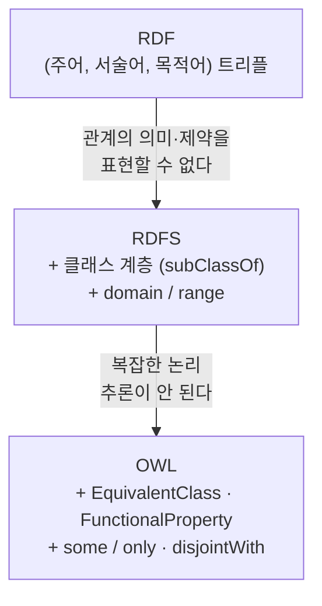

# S09 — OWL 온톨로지 설계 실습

> **실습①** · Week 3 · Day 5
> 강의 자료는 슬라이드(`01 온톨로지란?` → `02 RDF/RDFS/OWL 개념` → `03 RDF/RDFS/OWL 실습`
> → `04 Conclusion`)와 실습 노트북 `S09_OWL_Ontology_Design.ipynb` 두 벌이다.
>
> 도구 — **owlready2** (Python OWL 2 라이브러리) + **HermiT** 추론기
> 예제 도메인 — 연구실: 논문(Paper) · 연구자(Researcher) · 키워드(Keyword)
>
> 이번 회차는 대조할 원논문이 없는 실습이라, 슬라이드·노트북의 코드를 실제로 실행해
> 설명과 맞는지 확인했다. 그 결과는 부록 [S09-1 제약처럼 보이는 공리들](S09-1-제약처럼-보이는-공리들.md)에 있다.
> 본편은 자료에 있는 내용만 담는다.

---

## 1. 온톨로지란? — 사람은 읽고 기계는 못 읽는 것

슬라이드는 온톨로지를 **데이터의 의미(Semantics)를 표현하는 설계도**로 정의한다. 단순히 데이터를
저장하는 게 아니라 "무엇이 무엇이고, 서로 어떤 관계인지"를 정의하는 것이고, 구체적으로는
**개념(Concept) · 관계(Relation) · 규칙(Rule)** 세 가지를 명시적으로 적는 일이다.

같은 문장을 사람과 기계가 어떻게 다르게 받아들이는지가 출발점이다.

> "허재혁은 강필성 교수님의 지도학생이고, 그가 쓴 논문은 온톨로지 자동구축 프로젝트에서 나왔다."

| | 이 문장에서 읽어내는 것 |
|---|---|
| 사람 | 허재혁 = 연구자 · 강필성 = 교수 · 지도학생이라는 관계가 존재 · 논문의 저자가 존재 · 논문과 프로젝트의 관계가 존재 |
| 기계 | 허재혁? 강필성? 허재혁 — 강필성? 논문 — 프로젝트? (개념, 관계, 규칙을 알 수 없음) |

사람은 문장을 읽으면서 배경지식으로 빈칸을 채운다. 기계에는 그 배경지식이 없으니 문자열만 남는다.
온톨로지는 그 배경지식을 명시적으로 적어주는 작업이다. 같은 문장을 코드로 옮기면 이렇게 된다.

```python
with onto:
    # 개념
    허재혁   = PhDStudent("허재혁")
    강필성   = Professor("강필성")
    논문     = Paper("온톨로지_자동구축_논문")
    프로젝트 = Project("온톨로지_자동구축_프로젝트")

    # 관계 (속성)
    허재혁.advised_by  = [강필성]
    허재혁.writes      = [논문]
    논문.produced_from = [프로젝트]

    # 규칙 (공리) — "지도학생은 지도교수가 있어야 한다"
    PhDStudent.is_a.append(advised_by.some(Professor))
```

이렇게 적어두면 기계도 허재혁이 PhDStudent이고 강필성이 Professor이며 둘이 advised_by로 이어져
있다는 걸 안다. 슬라이드는 여기서 한 걸음 더 나가, **이 논문의 저자가 누구인지, 이게 어떤
프로젝트와 연결되는지 추론이 가능해진다**는 점을 강조한다. 적어놓은 것만 아는 게 아니라 적어놓은
것으로부터 새로운 사실을 끌어내는 것 — 이게 뒤에서 나올 OWL의 핵심이다.

> 마지막 줄의 `some`이 "있어야 한다"라는 뜻인지는 부록 [§4.2](S09-1-제약처럼-보이는-공리들.md#42-someonly--위반해도-모순이-아니다)에서 따로 다룬다.

## 2. AI Agent 시대의 온톨로지

강의는 지금 왜 이걸 배우는지를 Agent 이야기로 연결한다. 세 가지 논거를 든다.

**① LLM의 Hallucination을 바로잡아주는 안전장치**

Agent에게 "강필성 교수님이 지도하는 학생이 쓴 논문 목록 보내줘"라고 물으면, LLM 혼자서는
그럴듯하지만 틀린 답을 만들어낼 수 있다. 배경에 잘 구축된 온톨로지가 있다면 Agent는 추측 대신
명확히 정의된 관계를 따라 정확한 사실을 조회할 수 있다.

**② Agent가 "행동"하려면 세상의 구조를 알아야 함**

Agent는 도구를 호출하고, 여러 단계를 계획하고, 시스템 간 데이터를 넘나들며 작업을 수행한다.
이때 "Paper라는 게 뭔지, Researcher와 어떤 관계인지" 같은 명확한 스키마가 없으면 매번
헷갈리거나 일관성 없는 행동을 하게 된다.

**③ 여러 Agent, 여러 시스템이 협업하려면 "같은 언어"가 필요함**

Agent 하나가 논문 DB를 다루고 다른 Agent가 연구비 시스템을 다룬다고 하면, 서로 "Researcher"라는
개념을 다른 이름(`researcher_id`, `prof_name` …)으로 부르고 있을 때 협업이 어렵다. 온톨로지가
Agent 간 공통 어휘(vocabulary) 역할을 한다.

세 번째는 [S05B MANUMATE](S05B-MANUMATE-제조-상호운용성.md)에서 본 상호운용성 문제와 같은
모양이다. 거기서는 공장의 서로 다른 시스템이었고 여기서는 Agent다.

## 3. RDF / RDFS / OWL — 세 층

세 언어는 대체 관계가 아니라 층이다. 아래층의 한계가 위층을 부르는 식으로 강의가 전개된다.



### 3.1 RDF (Resource Description Framework)

모든 지식을 **(주어, 서술어, 목적어)** 3개짜리 문장으로 쪼개서 표현하는 가장 기본적인 데이터
모델이다.

```
(이우준, advised_by, 강필성)
(이한결, advised_by, 강필성)
(김선민, advised_by, 강필성)

(paper_001, written_by, 김선민)
(김선민, rdf:type, PhDStudent)
(paper_001, title, "Knowledge Graph Survey")
(paper_001, pub_year, 2030)

(김선민, collaborates_with, 고재용)
(김선민, member_of, project_AI_agent)
(고재용, member_of, project_AI_agent)
```

한계 — **advised_by가 어떤 의미와 제약을 갖는 관계인지는 RDF만으로 표현할 수 없다.** 트리플을
아무리 많이 쌓아도 advised_by가 사람과 사람 사이에만 쓰이는지, 한 명만 가질 수 있는지 같은 건
어디에도 적히지 않는다.

### 3.2 RDFS (RDF Schema)

RDF 위에 **클래스 계층**과 속성의 **domain/range** 두 가지를 추가함으로써 기본적인 추론이
가능해진다.

| 추가된 것 | 예시 | 읽는 법 |
|---|---|---|
| 클래스 계층 | `PhDStudent rdfs:subClassOf Researcher` | PhDStudent는 Researcher의 한 종류다 |
| domain / range | `written_by rdfs:domain Paper` · `written_by rdfs:range Researcher` | written_by는 항상 Paper에서 Researcher 방향으로만 쓰인다 |

슬라이드는 domain을 "이 관계가 주어 자리에 허용하는 클래스", range를 "목적어 자리에 허용하는
클래스"로 설명한다. 그리고 바로 옆에 추론 예시를 붙인다.

```
(naPINN, written_by, 김한결)

  · written_by의 domain = Paper
  · naPINN이 written_by의 주어이므로
  → naPINN rdf:type Paper
```

naPINN이 논문이라고 아무도 말하지 않았는데 기계가 그렇게 결론 내렸다. 이게 RDFS가 주는 추론이다.

> 이 "허용한다"는 설명과 위 추론 예시는 서로 다른 이야기다. 노트북 Step 4의 설명과도 갈린다.
> 부록 [§4.1](S09-1-제약처럼-보이는-공리들.md#41-domainrange--제한이-아니라-추론)에서 실행 결과와 함께 정리했다.

한계 — **복잡한 논리(AND, OR, NOT, 존재 제약 등)를 이용한 추론은 불가능**하다.

### 3.3 OWL (Web Ontology Language)

RDFS에 네 가지 요소를 추가하여 더욱 복잡한 논리적 추론이 가능해진다.

| 종류 | 역할 | 예시 |
|---|---|---|
| EquivalentClass | 조건으로 클래스를 "정의" | pub_year 있는 Paper = RecentPaper |
| FunctionalProperty | 값의 유일성 강제 | 논문 제목은 하나만 |
| some / only | 존재·전칭 제약 | 최소 1명 참여, 참여자는 전부 Researcher |
| disjointWith | 클래스 간 배타성 선언 | JournalPaper ≠ ConferencePaper |

> "네 가지"는 실습에서 다룰 것만 고른 강의용 축약이다. OWL 2에는 cardinality(`exactly`·`min`·`max`),
> inverse, transitive, `sameAs`/`differentFrom`, `hasValue`, union/intersection/complement 등이 더 있다.
> `OWL = RDFS + 4개`로 외워두면 남의 온톨로지를 읽을 때 막힌다. 실제로 부록 §4.4에서 데이터를
> 거부시키는 데 쓴 `exactly`와 `AllDifferent`가 이 목록 밖에 있다.

## 4. OWL 기본 문법 ① — 단어 만들기

강의는 OWL을 **단어를 만들고 그 단어로 문장을 만드는 언어**로 구조화한다. 클래스·속성·개체가
단어고, 그것들을 조합한 논리 규칙이 문장이다. 먼저 단어부터.

### 4.1 온톨로지 컨테이너 생성

`with onto:` 안에서 정의한 것들은 자동으로 해당 온톨로지에 귀속된다.

```python
from owlready2 import *

# 일반형
onto = get_ontology("<IRI>")
with onto:
    ...

# 실제 예시
onto = get_ontology("http://study.ontology.org/research.owl")
with onto:
    ...
```

IRI는 온톨로지의 고유 식별자로, URL 형식이지만 실제 접속하지 않아도 된다(노트북 Step 2).

### 4.2 Class 선언

`Thing`을 상속하면 OWL 클래스가 되고, 서브클래스는 부모 클래스를 상속하여 정의한다. Python
상속이 그대로 OWL의 `SubClassOf` 공리로 직렬화된다(노트북 Step 3).

클래스 선언은 개념의 틀을 만드는 일이고, 도메인에 존재하는 실제 객체는 그 틀로 찍어낸다.
아래 코드의 앞쪽이 틀을 만드는 부분, 뒤쪽이 객체를 만드는 부분이다.

```python
# 일반형 — 클래스 선언
class ClassName(Thing): pass
class SubClassName(ClassName): pass

# 실제 예시 — 클래스 선언
class Paper(Thing): pass
class JournalPaper(Paper): pass
class ConferencePaper(Paper): pass

class Researcher(Thing): pass
class PhDStudent(Researcher): pass

# 실제 예시 — 인스턴스화
p1 = JournalPaper("paper_001")
p2 = ConferencePaper("paper_002")

alice = Researcher("alice")
bob   = PhDStudent("bob")      # PhDStudent 클래스에 속하는 객체를 만들고 이름을 bob으로 설정
```

### 4.3 Property 선언 (인스턴스화 불가)

속성은 클래스처럼 선언하지만 인스턴스화하지 않는다. 개체에 붙여 쓰는 것이지 개체가 되는 게 아니다.

| | 연결하는 것 |
|---|---|
| ObjectProperty | 개체 ↔ 개체 |
| DataProperty | 개체 ↔ 값(문자, 숫자 등) |
| FunctionalProperty | 한 개체가 해당 속성에 대해 최대 하나의 값만 갖도록 강제하는 옵션 (Object·Data 모두에 적용 가능) |

```python
# 일반형
class relationName(ObjectProperty):                       # 개체 ↔ 개체
    domain = [...]; range = [...]

class valueName(DataProperty, FunctionalProperty):        # 개체 ↔ 값, 유일값
    domain = [...]; range = [str/int/...]

# 실제 예시 — 관계 클래스 선언
class written_by(ObjectProperty):
    domain = [Paper];      range = [Researcher]

class has_keyword(ObjectProperty):
    domain = [Paper];      range = [Keyword]

class supervised_by(ObjectProperty):
    domain = [PhDStudent]; range = [Researcher]

class title(DataProperty, FunctionalProperty):
    domain = [Paper];      range = [str]

class pub_year(DataProperty, FunctionalProperty):
    domain = [Paper];      range = [int]
```

```python
# 실제 예시 — 관계 사용
p1.written_by  = [alice]                  # p1 ↔ alice (개체-개체)
p1.title       = "Knowledge Graph Survey" # p1 ↔ 문자열 (개체-값)
p1.pub_year    = 2023                     # p1 ↔ 숫자   (개체-값)

p2.written_by  = [bob]
p2.title       = "OWL Ontology Design"
p2.pub_year    = 2022

bob.supervised_by = [alice]               # bob ↔ alice (지도관계)
```

`title`이 FunctionalProperty이므로 **Paper의 instance 하나당 title 값은 최대 1개**다. 슬라이드는
어길 경우를 이렇게 보여준다.

```python
p1.title = ["제목A", "제목B"]
# → 추론기가 "모순" 혹은 두 값을 "같은 값"으로 추론
```

> 이 코드를 그대로 돌리면 셋 중 어느 쪽도 일어나지 않는다.
> 부록 [§2](S09-1-제약처럼-보이는-공리들.md#2-슬라이드-코드를-그대로-돌리면)·[§4.3](S09-1-제약처럼-보이는-공리들.md#43-functionalproperty--리터럴이면-모순-개체면-sameas)에서 실행 결과를 정리했다.

## 5. OWL 기본 문법 ② — 문장(논리 규칙) 만들기

지금까지 만든 클래스·속성·개체는 전부 단어다. 이 단어들을 조합해서 문장(논리 규칙)을 만들어야
체계적인 온톨로지가 된다. §3.3의 네 요소 중 FunctionalProperty는 단어를 만들 때 이미 붙였으니,
여기서는 나머지 셋을 다룬다.

### 5.1 EquivalentClass — 조건으로 클래스를 정의한다

데이터가 나중에 추가·변경되어도 분류가 자동으로 최신 상태로 유지된다.

```python
# 일반형
class NewClass(ExistingClass):
    equivalent_to = [ExistingClass & someProperty.some(Type)]

# 실제 예시 — 앞에서 만든 Paper, pub_year를 그대로 사용
class RecentPaper(Paper):
    equivalent_to = [Paper & pub_year.some(int)]
    # Paper이면서 pub_year가 존재한다면 RecentPaper로 자동 분류
```

추론기를 돌리기 전과 후가 다르다.

```python
p1.written_by = [alice];  p1.title = "Knowledge Graph Survey"; p1.pub_year = 2023
p2.written_by = [bob];    p2.title = "OWL Ontology Design";    p2.pub_year = 2022

# 추론기 실행 전
print(p1.is_a)   # [JournalPaper]
print(p2.is_a)   # [ConferencePaper]

sync_reasoner()

# 추론기 실행 후
print(p1.is_a)   # [JournalPaper, RecentPaper]     ← 자동 추가
print(p2.is_a)   # [ConferencePaper, RecentPaper]  ← 자동 추가
```

p1, p2 모두 RecentPaper라고 태그한 적이 없지만 pub_year가 있으므로 둘 다 자동 분류됐다. 노트북
Step 6은 이 지점을 **OWL이 RDFS와 다른 핵심**으로 짚는다. RDFS는 명시적 선언만 처리하지만
OWL DL은 정의로부터 새로운 사실을 추론한다.

### 5.2 some / only — 관계로 연결될 수 있는 대상에 조건을 건다

```python
# 일반형
Class.is_a = [
    relation.some(TargetClass),   # 최소 1개는 있어야 함
    relation.only(TargetClass),   # 있다면 전부 이 타입이어야 함
]
```

- `relation.some(TargetClass)` — relation을 통해 연결된 TargetClass가 적어도 하나 존재한다
- `relation.only(TargetClass)` — relation으로 연결되는 모든 대상은 TargetClass이어야 한다

```python
class has_child(ObjectProperty):
    pass

class Parent(Person):
    is_a = [
        has_child.some(Person),
        has_child.only(Person)
    ]
```

### 5.3 disjointWith — 클래스 간 배타성을 선언한다

```python
# 일반형
AllDisjoint([ClassA, ClassB])

# 실제 예시 — 앞의 JournalPaper, ConferencePaper 그대로 사용
AllDisjoint([JournalPaper, ConferencePaper])

p1.is_a   # [JournalPaper]     → 문제 없음
p2.is_a   # [ConferencePaper]  → 문제 없음

# 만약 실수로 이렇게 했다면?
p1.is_a.append(ConferencePaper)   # p1을 JournalPaper이면서 ConferencePaper로도 선언

sync_reasoner()
# → Inconsistent ontology 에러 발생
#   "한 논문이 저널 논문이면서 동시에 학회 논문일 수는 없다"
```

## 6. 실습 노트북 — Step 1~9

`S09_OWL_Ontology_Design.ipynb`. 스터디 Week 3 · Day 5, 도구는 owlready2, 예제 도메인은 연구실이다.

**학습 목표**

1. owlready2로 OWL 온톨로지를 Python 코드로 정의하는 방법을 익힌다
2. 클래스 계층 · ObjectProperty · DataProperty · EquivalentClass 공리를 작성한다
3. 개인(Individual)을 생성하고 속성값을 할당한다
4. HermiT 추론기의 역할을 이해하고, 추론 결과를 해석한다
5. 온톨로지를 RDF/XML 파일로 저장한다

**이론 요약 (15분)**

| 개념 | 설명 |
|---|---|
| RDF Triple | `(subject, predicate, object)` — 지식의 최소 단위 |
| RDFS | 클래스·속성 계층 정의 (`rdfs:subClassOf`, `rdfs:domain`, `rdfs:range`) |
| OWL 2 | RDFS 위에 추론 가능한 공리(axiom) 추가 — `EquivalentClass`, `FunctionalProperty` 등 |
| OWL 2 프로파일 | EL (경량) → QL → RL → DL (표현력 높음) → Full |
| owlready2 매핑 | OWL 클래스 → Python 클래스 / OWL 개인 → Python 인스턴스 |
| 열린 세계 가정 (OWA) | 명시하지 않은 사실은 "거짓"이 아닌 "알 수 없음" |

> 프로파일 줄의 화살표 순서는 W3C 스펙과 어긋난다. 부록 [§3](S09-1-제약처럼-보이는-공리들.md#3-owl-2-프로파일은-일렬로-늘어서지-않는다) 참고.
> 마지막 줄의 OWA가 이 회차의 거의 모든 함정과 이어진다.

### 6.1 Step별 흐름

| Step | 내용 | 진행자 포인트 |
|---|---|---|
| 1 | 설치 및 임포트 | `try: from owlready2 import *` / `except ModuleNotFoundError:` → 커널에 pip install |
| 2 | 온톨로지 생성 및 네임스페이스 설정 | `with onto:` 안에서 정의된 클래스·속성은 자동으로 이 온톨로지에 귀속된다 |
| 3 | 클래스·서브클래스 계층 정의 | Python 상속(`class JournalPaper(Paper)`)이 OWL의 `SubClassOf` 공리로 직렬화된다 |
| 4 | ObjectProperty 정의 | domain/range 선언은 **추론 힌트**다. "domain이 Paper인 속성을 가진 개인은 Paper다"라고 추론기가 유추할 수 있다 |
| 5 | DataProperty 정의 | FunctionalProperty는 OWL 공리다. 추론기는 동일 개인에 두 값이 있으면 두 값이 같다고 추론한다(Same-as inference) |
| 6 | EquivalentClass 정의 (추론 트리거) | RDFS는 명시적 선언만 처리하지만, OWL DL은 정의로부터 새로운 사실을 추론한다 |
| 7 | 개인(Individual) 생성 및 속성값 할당 | 속성값 할당은 Python 어트리뷰트 접근과 동일하게 작성한다 |
| 8 | 온톨로지 탐색 | `onto.search()` 또는 클래스 메서드로 개인을 필터링한다 |
| 9 | 온톨로지 그래프 시각화 | NetworkX + Matplotlib |

Step 3의 클래스 계층은 §4.2와 같고, 여기에 `class Keyword(Thing): pass`가 붙는다. 실행하면
각 클래스의 부모가 출력된다.

```
=== 정의된 클래스 ===
  Paper           → 부모: ['Thing']
  JournalPaper    → 부모: ['Paper']
  ConferencePaper → 부모: ['Paper']
  ...
```

Step 7에서 개체를 만든다. 연구자 → 키워드 → 논문 순이다.

```python
with onto:
    # 연구자
    alice = Researcher("alice")
    bob   = PhDStudent("bob")
    bob.supervised_by = [alice]

    # 키워드
    kw_ontology = Keyword("ontology")
    kw_kg       = Keyword("knowledge_graph")

    # 논문
    p1 = JournalPaper("paper_001")
    p1.title       = "Knowledge Graph Survey"
    p1.pub_year    = 2023
    p1.written_by  = [alice]
    p1.has_keyword = [kw_ontology, kw_kg]

    p2 = ConferencePaper("paper_002")
    p2.title       = "OWL Ontology Design"
    p2.pub_year    = 2022
    p2.written_by  = [bob]
    p2.has_keyword = [kw_ontology]
```

Step 8은 탐색 방법 두 가지를 비교한다. `instances()`를 직접 순회하는 방법과 `onto.search()`다.

```python
# 방법 1: instances() 순회
alice_papers = [p for p in Paper.instances() if alice in p.written_by]
onto_papers  = [p for p in Paper.instances() if kw_ontology in p.has_keyword]

# 방법 2: onto.search()
results = onto.search(written_by=alice)

# 클래스 계층 확인
ConferencePaper.ancestors()   # 조상
Paper.descendants()           # 하위 클래스 전체
```

### 6.2 Step 9 — 시각화로 보는 TBox / ABox

NetworkX + Matplotlib로 그린 그래프는 위아래를 나눠 스키마와 인스턴스를 구분한다.

| 노드 모양 | 의미 |
|---|---|
| 사각형 | OWL 클래스 (TBox) |
| 원형 | 개인 · 인스턴스 (ABox) |

| 엣지 색상 | 의미 |
|---|---|
| 회색 실선 | `subClassOf` (클래스 계층) |
| 회색 점선 | `instanceOf` (소속 클래스) |
| 빨간 실선 | ObjectProperty (written_by / has_keyword / supervised_by) |

그림 위쪽 TBox에는 Thing 아래로 Paper(JournalPaper · ConferencePaper · RecentPaper) ·
Researcher(PhDStudent) · Keyword가 놓이고, 아래쪽 ABox에 개체들이 점선으로 매달린다.
RecentPaper가 Paper의 자식으로 그려져 있는데, 이건 §5.1에서 추론기가 채운 자리다.

## 7. Conclusion

슬라이드가 정리한 마무리는 두 줄이다.

- OWL은 데이터를 단순히 저장하는 것이 아니라, **개념 · 관계 · 제약을 정의하여 지식을 구조화하는 언어**다
- 본 실습에서는 owlready2를 이용하여 OWL의 기본 개념과 활용 방법을 학습했다
  - Ontology 생성
  - Class 및 Instance 정의
  - ObjectProperty, DataProperty, FunctionalProperty
  - Restriction(some, only)
  - `equivalent_to`를 이용한 클래스 정의 및 추론

§1에서 사람과 기계의 차이로 시작해 §5에서 추론기가 태그하지 않은 분류를 채우는 데까지 왔다.
"명시적으로 적는다"와 "적은 것에서 새로 끌어낸다"가 이 회차의 두 축이다.

---

## 관련 문서

- 부록 [S09-1 제약처럼 보이는 공리들](S09-1-제약처럼-보이는-공리들.md) — 슬라이드·노트북 코드를 실행해 대조한 결과
- [S02 설계 원칙](S02-설계-원칙.md) — Gruber의 5원칙. 여기서 실제로 코드를 쓰는 층으로 내려왔다
- [S08 기능적·의미적 평가 (CQ 기반)](S08-기능적-의미적-평가-CQ.md) — CQ에서 뽑은 Authoring Test가 검사하는 대상이 이번 회차에서 만든 공리들이다
- [`Projects/ontology-pipeline/docs/1.core-concepts.html`](../../../Projects/ontology-pipeline/docs/1.core-concepts.html) — RDF vs LPG, OWA/CWA
- [`Projects/ontology-pipeline/docs/3.ontology-design.html`](../../../Projects/ontology-pipeline/docs/3.ontology-design.html) — 실제 도메인 온톨로지 설계
