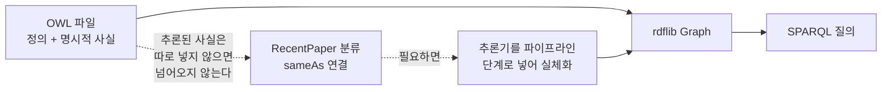

# 부록 — 파이프라인이 말하지 않은 것들

> **성격** — [S10 RDF 데이터 파이프라인 실습](S10-RDF-데이터-파이프라인-실습.md) 정리 중 갈라져
> 나온 내용. 강의 자료에 없다.
>
> [S09](S09-1-제약처럼-보이는-공리들.md)와 같은 방식으로, 슬라이드의 코드를 직접 실행해 대조했다.
> 이번에는 **파이프라인 전체를 재현**할 수 있었다. S09 노트북대로 온톨로지를 다시 만들어
> `research_ontology.owl`을 저장하고, 그 파일에서 S10 Step 2~8을 그대로 돌렸다. 슬라이드의
> 트리플 수(64 → 88)와 CONSTRUCT 결과(6 트리플)가 그대로 재현됐으니, 아래 출력은 같은 코드가
> 내는 값으로 봐도 된다.
>
> 실행 환경 — rdflib 7.6.0 · owlrl · pandas · owlready2 0.51 + HermiT · OpenJDK 21.0.10 ·
> Python 3.14 · macOS(arm64).
>
> §2·§3은 자료 자체의 문제라 짧게 끝내고, §4가 본론이다.

---

## 1. 한눈에

| 자료의 설명 | 실행 결과 |
|---|---|
| Step 2 — S09 온톨로지 로드: 64 트리플 | 재현됨. 단 이 64는 **추론기를 돌리기 전** 상태다 |
| Step 4 — 트리플 변환: +24개 → 88개 | 재현됨. `g.add()`는 27번 호출되고 3개가 중복으로 흡수된다 |
| Step 7 — CONSTRUCT 6 트리플 | 재현됨 |
| 슬라이드 예시 쿼리의 `ex:Anomaly Detection` | 파서를 통과하지 못한다. 접두어 이름에 공백을 못 쓴다 |
| 같은 쿼리의 `ex:강형원` | 유효하다. 한글 로컬명은 문제없이 동작한다 |
| FILTER — "변수 선언 이후 필터링" | 질의문에서 FILTER를 앞에 둬도 결과가 같다 |
| OPTIONAL 결과의 빈칸 = `NULL` | 값이 아니라 미바인딩이다. SQL의 NULL과 다르게 동작한다 |
| Step 8 — `owl:sameAs`로 외부 식별자 연결 | 적히기만 한다. rdflib은 그것으로 아무 추론도 하지 않는다 |

## 2. 슬라이드의 예시 쿼리는 파서를 통과하지 못한다

`01`·`02` 장에서 반복해서 나오는 예시 쿼리다.

```sparql
PREFIX ex: <http://example.org/research#>
SELECT ?title
WHERE {
    ?paper ex:writtenBy  ex:강형원 .
    ?paper ex:hasKeyword ex:Anomaly Detection .
    ?paper ex:hasTitle   ?title .
}
```

```
ex:Anomaly Detection (공백 포함): 파싱 실패
  → ParseException: Expected SelectQuery, found 'Detection' (at char 130), (line:5, col:35)
ex:Anomaly_Detection (밑줄)     : 파싱 OK
```

`ex:Anomaly Detection`은 `ex:Anomaly`에서 이름이 끝나고 그다음 `Detection`이 무엇인지 알 수 없어
파서가 멈춘다. 접두어 이름(`prefix:localName`)에는 공백을 쓸 수 없다. 슬라이드 그림에서는 사람이
읽기 좋게 띄어 쓴 것이지만, 그대로 옮겨 치면 실행되지 않는다. 실제로 `03`장 실습 코드는 키워드를
`onto:ontology` · `onto:knowledge_graph`처럼 공백 없는 하나의 이름으로 쓴다.

같은 쿼리의 `ex:강형원`은 의심스러워 보이지만 문제가 없다.

```
결과: ['Transformer-based ...']
```

SPARQL의 이름 문법은 유니코드 문자 범위를 넓게 허용해서 한글 로컬명이 유효하다. 공백만 안 된다.

## 3. FILTER의 위치는 결과를 바꾸지 않는다

슬라이드는 FILTER를 이렇게 설명한다.

> 실행 순서 — 1. Triple Pattern Matching 2. FILTER
> \* FILTER에서 사용할 변수 바인딩이 선언되어야 함.
> \* 변수 선언 이후 필터링

앞의 "실행 순서"는 맞다. 패턴을 먼저 맞춰 바인딩 표를 만들고 거기서 거른다. 다만 "변수 선언
이후"라는 말이 **질의문에서 FILTER를 트리플 패턴 뒤에 써야 한다**는 뜻으로 읽힐 수 있어 확인했다.

```sparql
# FILTER 를 뒤에
{ ?paper ex:publicationYear ?year . ?paper ex:hasTitle ?title .
  FILTER(?year >= 2025) }

# FILTER 를 앞에
{ FILTER(?year >= 2025)
  ?paper ex:publicationYear ?year . ?paper ex:hasTitle ?title . }
```

```
FILTER 뒤: ['AlienLM ...']
FILTER 앞: ['AlienLM ...']
```

결과가 같다. FILTER는 자기가 속한 중괄호 그룹 전체에 걸리는 제약이라, 그룹 안 어디에 적든
그룹의 바인딩 전부에 적용된다. 위에서 아래로 읽어 내려가는 절차가 아니다.

읽는 순서가 실제로 중요한 자리는 따로 있다. [S10 §2.2](S10-RDF-데이터-파이프라인-실습.md#22-triple-pattern-matching)에서
패턴 세 줄이 후보를 차례로 좁혀가는 것처럼 설명하는데, 그것도 엄밀히는 순서가 아니라 세 패턴을
동시에 만족하는 바인딩을 찾는 것이다. 결과는 같고, 사람이 따라가기에 좁혀가는 그림이 편할 뿐이다.

## 4. SQL처럼 보이지만 다른 것들

여기부터가 본론이다. 이번 회차는 SQL과의 대비로 시작했고 실제로 SPARQL은 SQL과 닮았는데,
닮은 만큼 SQL의 직관을 그대로 가져오면 어긋나는 자리가 있다. 세 군데다.

### 4.1 27번 넣고 24개가 남는다

Step 4는 CSV 3행을 트리플로 바꾸며 `+24개 추가 → 전체 88개`를 출력한다. 그런데 코드가 `g.add()`를
몇 번 부르는지 세어보면 27번이다. 행마다 논문 타입 · 제목 · 연도 · 저자 타입 · 저자 연결 5개에
키워드 2개씩 (타입 + 연결) 4개를 더해 9개, 세 행이니 27개다.

```
[Step 4] 트리플 변환: +24개 추가 → 전체 88개   (슬라이드: +24 → 88)
         g.add() 호출 횟수 = 27 → 실제 증가 24 (차이 3개는 중복)
```

사라진 셋의 정체는 이렇다.

| 트리플 | 왜 중복인가 |
|---|---|
| `onto:ontology a onto:Keyword` | S09에서 `Keyword("ontology")`로 이미 만들었다 |
| `onto:knowledge_graph a onto:Keyword` | S09에서 `Keyword("knowledge_graph")`로 이미 만들었다 |
| `onto:carol a onto:Researcher` | CSV 안에서 carol이 paper_003과 paper_005 두 번 나온다 |

**RDF 그래프는 트리플의 집합(set)이다.** 같은 (주어, 서술어, 목적어)를 두 번 넣어도 하나로 남는다.
CSV 두 행이 같은 저자를 가리켜도, 이번 데이터가 S09에서 쓰던 키워드를 다시 써도, 알아서 합쳐진다.

[S10 §1.3](S10-RDF-데이터-파이프라인-실습.md#13-현실에는-다대다-관계가-있다)의 SQL 이야기와
정확히 반대편이다. 관계형 DB는 중복을 막으려고 테이블을 다섯 개로 쪼갰다. RDF는 그냥 넣고
같은 것끼리 붙게 둔다. 서로 다른 출처의 데이터를 합칠 때 이 성질이 값어치를 한다. `carol`이라는
같은 IRI를 쓰기만 하면 어느 파일에서 왔든 한 사람이 된다.

**온톨로지가 걸러낸 것이 아니다.** 온톨로지를 아예 읽지 않고 빈 그래프에 같은 코드를 돌려도
결과는 같은 성질을 보인다.

```
[A] 온톨로지 없이 빈 그래프에 적재
    add 호출 27회 → 그래프 크기 26  (중복 1개: carol)

[B] S09 온톨로지(64 트리플) 위에 적재
    add 호출 27회 → 증가 24        (중복 3개: carol, ontology, knowledge_graph)
```

온톨로지가 없어도 27이 26으로 준다. CSV 안에서 carol이 두 번 나오기 때문이다. 온톨로지를
얹으면 셋이 되는 건, S09가 `ontology`·`knowledge_graph`라는 똑같은 트리플을 이미 갖고 있어서
겹친 것이다. 검사해서 버린 게 아니라 합집합을 취했을 뿐이고, 애초에 OWL 공리는 데이터를 거르지
않는다([S09 부록 §4](S09-1-제약처럼-보이는-공리들.md#4-공리는-무엇을-막고-무엇을-막지-않는가)).
rdflib은 domain/range 검사조차 하지 않는다. CSV의 `type`이 `Journal`도 `Conference`도 아닌
값이어도 그대로 트리플이 된다.

**인스턴스 수와 트리플 수도 다른 단위다.**

| 단위 | 개수 |
|---|---|
| CSV 행 | 3 |
| 새로 생긴 논문 인스턴스 | 3 |
| 그 인스턴스들이 만든 트리플 | 24 |

#### 그럼 무엇을 세는가

트리플 수는 **그래프가 얼마나 큰가**를 말하는 상태량이지 **몇 건 처리했나**를 말하는 처리량이
아니다. 27건을 넣었는데 24가 늘었다고 해서 3건이 실패한 게 아니고, 반대로 매핑을 잘못 짜서
서로 다른 개체가 같은 IRI를 갖게 되면 그것도 조용히 합쳐진다. 트리플 증가량 하나로는 이 둘을
구분할 수 없으니 층을 나눠 남긴다.

**① 처리량은 적재 코드가 직접 로그로 남긴다.** rdflib은 무엇이 흡수됐는지 알려주지 않으므로
넣기 전에 확인해야 한다.

```python
for t in triples:
    if t in g:
        log.debug("중복 흡수: %s", t)
        dup += 1
    g.add(t)
```

**② 검증은 도메인 단위 `COUNT`로 한다.** 다만 여기에도 함정이 있다.

```
Paper      인스턴스 수 : 5   (S09 2편 + CSV 3편)
Researcher 인스턴스 수 : 3   ← 실제로는 alice·bob·carol·dave 네 명이다
Keyword    인스턴스 수 : 6
```

bob은 `PhDStudent`로 선언돼 있어 `?x a onto:Researcher`에 걸리지 않는다. `PhDStudent ⊑ Researcher`가
온톨로지에 적혀 있어도 추론을 하지 않으면 소용없다(§4.3). Paper가 5로 제대로 나온 건 하위
클래스를 따라가도록 경로를 썼기 때문이다.

```sparql
SELECT (COUNT(DISTINCT ?p) AS ?papers)
WHERE { ?p a/rdfs:subClassOf* onto:Paper . }
```

**③ 배치는 named graph로 분리한다.** 적재 단위를 따로 두면 그 배치만 세거나 통째로 되돌릴 수
있다. 하나의 큰 그래프에 전부 부으면 어제 넣은 것이 무엇이었는지 되짚을 방법이 없다.

```
urn:batch:2026-08-04 크기: 26 트리플
```

#### 집합이라는 성질이 깨지는 자리

같은 트리플이 합쳐진다는 규칙에 예외가 하나 있다. **Blank Node는 합쳐지지 않는다.** 완전히 같은
파일을 두 번 읽어보면 드러난다.

```
같은 파일 1번 파싱: 64 트리플
같은 파일 2번 파싱: 74 트리플   ← 똑같은 파일인데 10개 늘었다
```

늘어난 열 개는 [S10 §3.5](S10-RDF-데이터-파이프라인-실습.md#35-step-5--turtle-직렬화)의
`RecentPaper` 정의에 들어 있던 `[ ]` 블록들이다. Blank Node는 이름이 없어 파싱할 때마다 새 노드로
만들어지고, 그래서 같은 트리플로 인식되지 않는다. 같은 파일을 다시 적재해도 안전할 거라고
생각하기 쉬운데, 클래스 정의에 제약이 들어 있으면 그때마다 그래프가 부푼다.

### 4.2 빈칸은 NULL이 아니다

Step의 OPTIONAL 예시는 DOI가 없는 논문의 자리를 `NULL`로 표시한다. rdflib이 실제로 돌려주는 건
값이 아니라 **아무것도 묶이지 않은 상태**다.

```
title=Transformer-ba   doi=None  (type=NoneType)
title=AlienLM ...      doi=rdflib.term.Literal('10.48550/arXiv.2601.22710')  (type=Literal)
```

용어 문제로 보이지만 질의 결과가 달라진다. 미바인딩 변수를 조건에 쓰면 그 행은 조건을 만족하는
쪽도 아니고 안 하는 쪽도 아니라, 그냥 떨어진다.

```
조건 없음             : ['있음', '없음']
FILTER(?doi != '10.9/z'): ['있음']          ← '없음' 행이 사라진다
FILTER(!BOUND(?doi))    : ['없음']          ← 이렇게 잡아야 한다
```

DOI가 없는 논문을 찾겠다고 `FILTER(?doi != ...)`를 쓰면 정작 없는 것들이 전부 빠진다.
`BOUND()`로 바인딩 여부를 직접 물어야 한다.

[S09 부록 §4.2](S09-1-제약처럼-보이는-공리들.md#42-someonly--위반해도-모순이-아니다)의 열린 세계
가정과 같은 결이다. 값이 없는 게 아니라 이 그래프가 그 값을 모르는 것이고, 모르는 것에 대고
비교 연산을 하면 참도 거짓도 아니다.

### 4.3 rdflib은 추론기가 아니다

Step 8은 `owl:sameAs`로 alice를 ORCID에 잇는다. 슬라이드는 "두 URI는 동일한 실제 객체를 가리킴"
이라고 적는다. 맞는 설명인데, 그 선언으로 rdflib이 무엇을 해주는지는 따로 봐야 한다.

```
내부 URI로 질의  (written_by onto:alice): 1 건
ORCID URI로 질의 (sameAs 로 연결됨)     : 0 건
```

alice가 쓴 논문은 찾아지는데, 같은 사람이라고 선언한 ORCID URI로는 못 찾는다. rdflib은 트리플을
저장하고 패턴을 매칭하는 도구지 OWL 의미론을 계산하지 않는다. `owl:sameAs`는 여기서 그냥
서술어 하나일 뿐이다.

같은 일이 파이프라인 입구에서도 벌어진다. Step 2의 `64 트리플`은 **추론기를 돌리기 전** 상태다.

```
추론 없이 저장한 파일: 64 트리플  (슬라이드 Step 2: 64)
  RecentPaper 인스턴스 질의 결과: 0 건

추론기를 돌린 뒤 저장한 파일: 66 트리플
  RecentPaper 인스턴스 질의 결과: 2 건 ['paper_001', 'paper_002']
```

[S09 §5.1](S09-OWL-온톨로지-설계-실습.md#51-equivalentclass--조건으로-클래스를-정의한다)에서
"태그한 적 없는데 추론기가 붙였다"며 강조했던 그 `RecentPaper` 분류가, 이번 파이프라인에는
넘어오지 않았다. `equivalentClass` 정의 자체는 Turtle에 그대로 있다
([S10 §3.5](S10-RDF-데이터-파이프라인-실습.md#35-step-5--turtle-직렬화)의
`owl:intersectionOf` 블록이 그것이다). 정의는 왔는데 그 정의로부터 나온 결론은 안 온 것이고,
rdflib이 대신 계산해주지도 않는다.

#### 그럼 rdflib은 무엇을 하는가

추론을 안 한다고 해서 형식 변환기인 것은 아니다. 세 가지를 한다.

| | 하는 일 |
|---|---|
| 파서 · 직렬화기 | RDF/XML · Turtle · N3 · N-Triples · JSON-LD · TriG · N-Quads 상호 변환. Step 2에서 `.owl`을 읽고 Step 5에서 `.ttl`로 쓴 것이 이 기능이다 |
| 트리플 저장소 | 크기 · 포함 여부 · 그래프 간 합집합/차집합/교집합 · 동형 비교 |
| SPARQL 1.1 엔진 | `SELECT`·`CONSTRUCT`·`ASK`·`DESCRIBE`, `FILTER`·`OPTIONAL`·`BIND`, 집계와 `GROUP BY`·`HAVING`, property path, `UPDATE` |

세 번째가 사실상 본체다. 집계까지 다 된다.

```sparql
SELECT ?title (COUNT(?k) AS ?n) WHERE { ?p onto:title ?title ; onto:has_keyword ?k . }
GROUP BY ?title HAVING(COUNT(?k) > 1) ORDER BY DESC(?n)
```

없는 것은 추론 하나뿐이고, 그건 별도 라이브러리를 얹으면 된다. `owlrl`로 OWL-RL closure를
돌려봤다.

| | 추론 전 | 추론 후 |
|---|---|---|
| 트리플 수 | 91 | **387** |
| `?x a onto:Researcher` | 3 | **6** |
| ORCID URI로 논문 찾기 | 0건 | **2건** |
| `RecentPaper` 인스턴스 | 0건 | paper_001 · 002 · 003 · 004 · 005 |

이 절에서 "안 된다"고 적은 것이 전부 살아난다. bob이 `PhDStudent`라 안 잡히던 것도, §4.1의
카운트 함정도 여기서 풀린다. 대가는 셋이다.

- **그래프가 네 배로 부푼다.** closure를 물리적으로 저장하는 방식이라 그렇다
- **데이터가 바뀌면 다시 계산해야 한다.** 증분 갱신이 까다롭다
- **의도하지 않은 것까지 딸려온다.** Researcher가 6이 된 건 네 사람에 ORCID URI 둘이 더해진
  결과고, `RecentPaper` 목록에는 DOI URI까지 들어간다. `paper_001 sameAs <doi>`라고 적었으니
  논리적으로는 맞는 결론인데, "최근 논문 목록"을 뽑으면 URL이 섞여 나온다

### 4.4 파이프라인에 남는 함의

셋을 묶으면 하나의 주의사항이 된다. **파일에 든 것은 적힌 트리플뿐이다.**



추론 결과를 질의에서 쓰려면 어딘가에서 추론기를 돌려 결과를 그래프에 실체화(materialize)해
넣어야 한다. 방법은 셋이다. 적재 전에 OWL 추론기를 돌려 저장하거나(위 실행에서 66 트리플이 된
쪽), 적재 후 `owlrl` 같은 라이브러리로 closure를 펼치거나(387 트리플이 된 쪽), 추론 룰셋을
지원하는 저장소에 올려 맡기거나.

실무 파이프라인([`ontology-pipeline`](../../../Projects/ontology-pipeline/))에서 GraphDB를 쓰면서
룰셋을 고르는 설정이 있었는데, 그게 이 선택이었다. 그때는 기본값으로 두고 넘어갔지만,
`owl:sameAs`로 개체를 통합하거나 `equivalentClass`로 자동 분류를 쓰려면 그 설정이 켜져 있어야
질의에 반영된다. 저장소들이 룰셋을 하나로 고정하지 않고 여러 단계로 열어두는 이유도 §4.3에서
본 트레이드오프다. 표현력을 올릴수록 저장소가 커지고 적재가 느려진다.

[S09 부록 §4.6](S09-1-제약처럼-보이는-공리들.md#46-검증의-자리--shacl과의-분업)에서 OWL과 SHACL의
분업을 정리했는데, 여기에 한 축이 더 붙는다.

| | 하는 일 | 이번 회차의 자리 |
|---|---|---|
| rdflib | 파싱·직렬화 · 트리플 저장 · SPARQL 질의 | Step 2~8 전부 |
| OWL 추론기 | 정의로부터 새 사실 도출 | 파이프라인 안에 없다. S09에서 한 번 돌렸을 뿐 |
| SHACL | 데이터가 형태를 지키는지 검증 | 이번 회차에 없다 |

세 자리 중 실습이 채운 건 하나다. CSV에 `year`가 비어 있거나 `type`이 `Journal`도
`Conference`도 아닌 값이면 Step 4는 그대로 트리플을 만들어 넣는다. 거기서 걸러줄 것은
이 파이프라인에 없다.

---

## 관련 문서

- 본편 [S10 RDF 데이터 파이프라인 실습](S10-RDF-데이터-파이프라인-실습.md)
- [S09-1 제약처럼 보이는 공리들](S09-1-제약처럼-보이는-공리들.md) — OWA · 추론과 검증의 분업
- [`Projects/ontology-pipeline/docs/4-1.cleaning-mapping-validation.html`](../../../Projects/ontology-pipeline/docs/4-1.cleaning-mapping-validation.html) — RML 매핑 · SHACL 검증
- [W3C SPARQL 1.1 Query Language](https://www.w3.org/TR/sparql11-query/)
- [rdflib documentation](https://rdflib.readthedocs.io/)
