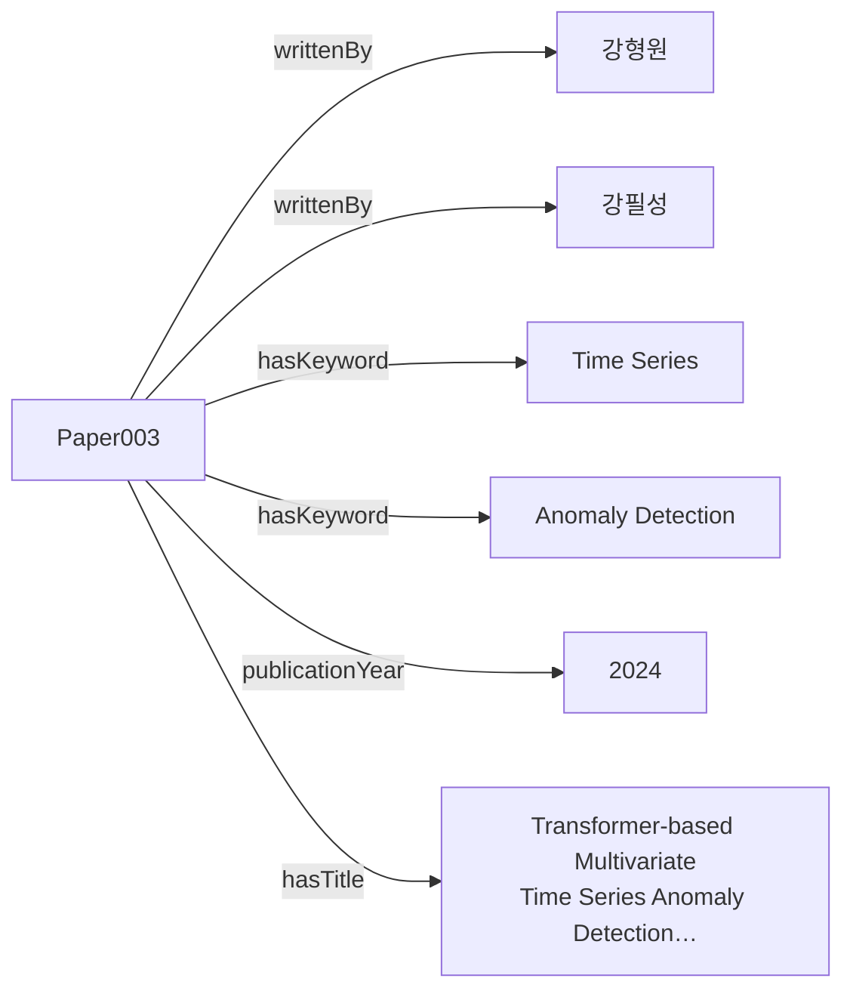
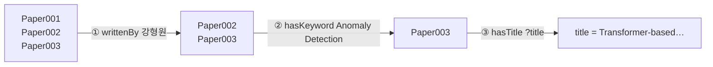
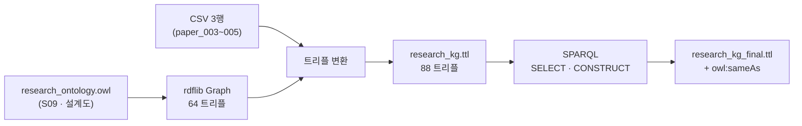

# S10 — RDF 데이터 파이프라인 실습

> **실습②** · Week 3 · Day 5
> 슬라이드 4부 구성 — `01 From SQL to Knowledge Graph` → `02 Querying RDF with SPARQL`
> → `03 Building an RDF Pipeline` → `04 Summary`
>
> 도구 — **rdflib** · pandas · StringIO
> 입력 — [S09](S09-OWL-온톨로지-설계-실습.md)에서 만든 `research_ontology.owl`
> 출력 — `research_kg.ttl` → `research_kg_final.ttl`
>
> 이번에도 코드를 직접 실행해 슬라이드와 대조했다. 결과는 부록
> [S10-1 파이프라인이 말하지 않은 것들](S10-1-파이프라인이-말하지-않은-것들.md)에 있다.

---

## 1. From SQL to Knowledge Graph

### 1.1 물음 하나

강의는 질문 하나를 들고 SQL과 SPARQL을 나란히 놓는다.

> "강형원이 작성한 Anomaly Detection 논문을 찾고 싶다면 어떻게 해야 할까요?"

같은 질문을 두 경로로 푼다. 데이터베이스 → SQL로 가는 길과, Knowledge Graph → SPARQL로 가는
길이다. Researcher · Paper · Project · Keyword는 [S09](S09-OWL-온톨로지-설계-실습.md)에서 OWL로
정의해뒀으니, 이번 회차는 그 위에 데이터를 얹고 질의하는 쪽을 다룬다.

### 1.2 테이블이 하나일 때

SQL은 테이블의 행을 조건에 맞게 검색한다.

```sql
SELECT Title
FROM Paper
WHERE Condition
```

**Research Paper**

| PaperID | Title | First Author | Keyword | Year |
|---|---|---|---|---|
| P001 | AlienLM: Alienization of Language for API-Boundary Privacy in Black-Box LLMs | 김재희 | LLMs | 2026 |
| P002 | Memory Bank-Guided Diffusion Model for Lightweight Anomaly Detection | 이우준 | Anomaly Detection | 2025 |
| P003 | Transformer-based Multivariate Time Series Anomaly Detection using Inter-Variable Attention Mechanism | 강형원 | Anomaly Detection | 2024 |

```sql
SELECT Title
FROM ResearchPaper
WHERE FirstAuthor = "강형원"
  AND Keyword     = "Anomaly Detection";
```

깔끔하다. 문제는 이 표가 현실이 아니라는 데 있다.

### 1.3 현실에는 다대다 관계가 있다

논문 하나에 저자가 여럿이고 키워드도 여럿이다.

| PaperID | Title | Author | Keyword | Year |
|---|---|---|---|---|
| P001 | AlienLM… | 김재희, **강필성** | LLMs, **Privacy** | 2026 |
| P002 | Memory Bank-Guided Diffusion Model… | 이우준, **강필성** | **Diffusion Model**, Anomaly Detection | 2025 |
| P003 | Transformer-based Multivariate Time Series… | 강형원, **강필성** | **Time Series**, Anomaly Detection | 2024 |

한 칸에 값이 여러 개인 표는 관계형 DB에 그대로 들어가지 않는다. 한 칸 한 값으로 펴면 행이
곱해진다. P001 하나가 저자 2명 × 키워드 2개 = 네 줄이 된다.

| PaperID | Title | Author | Keyword | Year |
|---|---|---|---|---|
| P001 | AlienLM… | 김재희 | LLMs | 2026 |
| P001 | AlienLM… | 강필성 | LLMs | 2026 |
| P001 | AlienLM… | 김재희 | Privacy | 2026 |
| P001 | AlienLM… | 강필성 | Privacy | 2026 |

그래서 테이블을 쪼갠다. 논문 3편 · 저자 4명 · 키워드 5개를 담으려면 다섯 개의 테이블이 필요하다.

| 테이블 | 내용 |
|---|---|
| Paper | PaperID · Title · Year |
| Author | A001 강필성 · A002 김재희 · A003 이우준 · A004 강형원 |
| Keyword | K001 LLMs · K002 Privacy · K003 Diffusion Model · K004 Anomaly Detection · K005 Time Series |
| PaperAuthor | (P001, A002) · (P001, A001) · (P002, A003) · (P002, A001) · (P003, A004) · (P003, A001) |
| PaperKeyword | (P001, K001) · (P001, K002) · (P002, K003) · (P002, K004) · (P003, K005) · (P003, K004) |

이제 §1.1의 질문을 던지려면 JOIN 네 번을 거쳐야 한다.

```sql
SELECT DISTINCT p.Title
FROM Paper p
JOIN PaperAuthor pa  ON p.PaperID   = pa.PaperID
JOIN Author a        ON pa.AuthorID = a.AuthorID
JOIN PaperKeyword pk ON p.PaperID   = pk.PaperID
JOIN Keyword k       ON pk.KeywordID = k.KeywordID
WHERE a.Name    = "강형원"
  AND k.Keyword = "Anomaly Detection";
```

관계 자체는 데이터에 있는데, 그걸 꺼내려면 매번 조립해야 한다. JOIN은 저장할 때 흩어놓은 관계를
질의할 때 다시 붙이는 작업이다.

### 1.4 Knowledge Graph는 관계를 직접 표현한다

같은 데이터를 그래프로 보면 Paper003은 이렇게 생겼다.



저자가 둘이면 엣지를 둘 그으면 되고, 키워드가 둘이면 또 둘 그으면 된다. 다대다를 표현하려고
중간 테이블을 만들 이유가 없다. 질의는 이 엣지를 그대로 따라간다.

```sparql
PREFIX ex: <http://example.org/research#>
SELECT ?title
WHERE {
    ?paper ex:writtenBy  ex:강형원 .
    ?paper ex:hasKeyword ex:Anomaly_Detection .
    ?paper ex:hasTitle   ?title .
}
```

> 슬라이드는 키워드를 `ex:Anomaly Detection`으로 적는다. 접두어 이름에 공백이 들어가면 SPARQL
> 파서가 받지 못하므로 여기서는 `ex:Anomaly_Detection`으로 적었다. 실행 결과는 부록
> [§3](S10-1-파이프라인이-말하지-않은-것들.md#3-슬라이드의-예시-쿼리는-파서를-통과하지-못한다) 참고.

### 1.5 SQL과 SPARQL

| | SQL | SPARQL |
|---|---|---|
| 질의 대상 | 테이블 기반 질의 | 그래프 기반 질의 |
| 찾는 방식 | Row를 조건으로 검색 | Triple Pattern을 매칭 |
| 관계 | 관계를 JOIN으로 재구성 | 저장된 관계를 직접 탐색 |
| 적합한 곳 | 정형 데이터 관리 | 관계 중심 데이터 탐색 |

JOIN 네 번짜리 SQL과 트리플 패턴 세 줄짜리 SPARQL이 같은 답을 낸다. 차이는 관계를 저장 시점에
흩어놓느냐, 저장된 모양 그대로 두느냐다.

## 2. Querying RDF with SPARQL

> 이 장의 예시 그래프는 §1과 논문 구성이 조금 다르다. Paper002가
> *Granularity Fusion Transformer*(박진우 · 강형원 · 강필성, Time Series · Forecasting, 2025)로
> 바뀌어 있다. 강형원이 쓴 논문이 둘이 되면서 조건을 하나씩 좁혀가는 과정이 드러난다.

### 2.1 기본 구조

```sparql
PREFIX ex: <http://example.org/research#>
SELECT ?title
WHERE {
    ?paper ex:writtenBy  ex:강형원 .
    ?paper ex:hasKeyword ex:Anomaly_Detection .
    ?paper ex:hasTitle   ?title .
}
```

| 절 | 역할 |
|---|---|
| `PREFIX` | 네임스페이스 정의 |
| `SELECT` | 출력할 변수 |
| `WHERE` | 검색할 Triple Pattern |

RDF에 실제로 저장된 형태는 `http://example.org/research#writtenBy`처럼 긴 URI다. PREFIX를
선언해두면 `ex:writtenBy`로 짧게 쓸 수 있다.

### 2.2 Triple Pattern Matching

`?[변수명]`으로 변수를 쓴다. 패턴 한 줄이 `Subject Predicate Object` 자리를 갖고, 그중 변수 자리에
값이 채워지는 것을 **바인딩**이라 한다. 세 줄이 차례로 후보를 좁힌다.

**① `?paper ex:writtenBy ex:강형원`**

Predicate가 `ex:writtenBy`이고 Object가 `ex:강형원`인 패턴을 찾아 그 Subject를 변수 `paper`에
바인딩한다. Paper002와 Paper003이 걸린다.

**② `?paper ex:hasKeyword ex:Anomaly_Detection`**

전체 RDF에서 다시 찾는 게 아니라 **이전에 paper에 바인딩된 것 안에서만** 검색한다. Paper002는
키워드가 Time Series · Forecasting이라 탈락하고 Paper003만 남는다.

**③ `?paper ex:hasTitle ?title`**

Predicate가 `ex:hasTitle`인 패턴을 찾아 Subject와 Object를 각각 `paper`, `title`에 바인딩한다.
남은 Paper003의 제목이 `title`에 들어간다.



### 2.3 SELECT

출력할 변수를 정한다. 위 질의의 최종 출력은 한 줄이다.

```
Transformer-based Multivariate Time Series Anomaly Detection using Inter-Variable Attention Mechanism
```

### 2.4 CONSTRUCT

WHERE에서 찾은 결과를 이용해 **새로운 RDF Graph를 생성**한다. CONSTRUCT 블록 안에 어떤 형태로
저장할지 선언한다.

```sparql
PREFIX ex: <http://example.org/research#>
CONSTRUCT {
    ?paper ex:writtenBy ex:강형원 .
    ?paper ex:hasTitle  ?title .
}
WHERE {
    ?paper ex:writtenBy ex:강형원 .
    ?paper ex:hasTitle  ?title .
}
```

실행 순서는 `PREFIX` → `WHERE`(조건을 만족하는 Triple 찾기) → 변수 바인딩 → `CONSTRUCT`(새로운
Triple 생성)다. SELECT가 표를 돌려주는 데 반해 CONSTRUCT는 그래프를 돌려준다. 결과를 다시 질의할
수 있다는 뜻이다.

### 2.5 FILTER

조건에 맞는 바인딩을 찾는다.

```sparql
PREFIX ex: <http://example.org/research#>
SELECT ?title
WHERE {
    ?paper ex:writtenBy      ex:강형원 .
    ?paper ex:publicationYear ?year .
    ?paper ex:hasTitle        ?title .
    FILTER(?year >= 2025)
}
```

실행 순서는 Triple Pattern Matching이 먼저고 FILTER가 나중이다. 먼저 패턴을 맞춰 바인딩 표를
만들고,

| paper | year |
|---|---|
| Paper001 | 2026 |
| Paper002 | 2025 |
| Paper003 | 2024 |

그다음 그 표에서 조건에 맞는 행을 걸러 Paper002가 남는다.

> 슬라이드는 이를 "FILTER에서 사용할 변수 바인딩이 선언되어야 함 · 변수 선언 이후 필터링"으로
> 적었다. 질의문에서 FILTER를 어디에 쓰느냐와는 별개의 이야기다. 부록
> [§3](S10-1-파이프라인이-말하지-않은-것들.md#3-filter의-위치는-결과를-바꾸지-않는다) 참고.

### 2.6 OPTIONAL

DOI가 모든 논문에 기재되어 있지 않은 상황을 생각해보자. 목표는 **모든 논문의 제목을 출력하되,
DOI가 있으면 같이 출력**하는 것이다. Paper003에는 DOI가 없다고 하자.

```sparql
SELECT ?title ?doi
WHERE {
    ?paper ex:hasTitle ?title .
    ?paper ex:hasDOI   ?doi .
}
```

| title | doi |
|---|---|
| Paper001 | https://doi.org/10.48550/arXiv.2601.22710 |
| Paper002 | 10.1016/j.knosys.2025.113644 |

DOI가 없는 Paper003이 통째로 사라진다. 두 패턴을 모두 만족해야 결과에 남기 때문이다. OPTIONAL로
감싸면 달라진다.

```sparql
SELECT ?title ?doi
WHERE {
    ?paper ex:hasTitle ?title .
    OPTIONAL {
        ?paper ex:hasDOI ?doi .
    }
}
```

| title | doi |
|---|---|
| Paper001 | https://doi.org/10.48550/arXiv.2601.22710 |
| Paper002 | 10.1016/j.knosys.2025.113644 |
| Paper003 | *(값 없음)* |

Paper003이 살아남고 doi 자리만 빈다. SQL의 LEFT JOIN에 해당하는 자리다.

> 슬라이드는 빈 자리를 `NULL`로 적었다. SPARQL에서 그 자리는 값이 아니라 **바인딩되지 않은
> 상태**다. 차이는 부록 [§4.2](S10-1-파이프라인이-말하지-않은-것들.md#42-빈칸은-null이-아니다)에 있다.

## 3. RDF 파이프라인 만들기

### 3.0 출발점 — 실습①의 결과물

[S09](S09-OWL-온톨로지-설계-실습.md)에서 만든 `research_ontology.owl`(3,828 bytes)에서 시작한다.
Knowledge Graph의 설계도에 해당하는 파일이고, 안에는 Class · Object Property · Restriction ·
Inference Rule이 들어 있다.



### 3.1 Step 1 — 패키지 로드

| 패키지 | 역할 |
|---|---|
| rdflib | RDF 라이브러리 |
| pandas | CSV 읽기 |
| StringIO | 문자열로 작성된 CSV 데이터를 파일처럼 읽게 해주는 객체 |

```python
from rdflib import Graph, Namespace, URIRef, Literal
from rdflib.namespace import RDF, OWL, XSD
import pandas as pd
from io import StringIO
```

### 3.2 Step 2 — 온톨로지 로드

실습①의 OWL 파일을 읽는다.

```python
g = Graph()
g.parse("research_ontology.owl")

ONTO = Namespace("http://study.ontology.org/research.owl#")
g.bind("onto", ONTO)
g.bind("owl", OWL)

print(f"\n[Step 2] S09 온톨로지 로드: {len(g)} 트리플")
```

```
[Step 2] S09 온톨로지 로드: 64 트리플
```

| | 뜻 |
|---|---|
| `Graph` | 트리플을 저장하는 공간 |
| `Namespace` | URI를 쉽게 만들기 위한 도구 (prefix) |
| `len(g)` | 저장된 triple의 수 |

### 3.3 Step 3 — CSV 데이터 로드

문자열로 쓴 CSV를 StringIO로 감싸 pandas에 넘긴다.

```python
csv_data = """paper_id,title,year,type,author,keywords
paper_003,Ontology Alignment Survey,2021,Journal,carol,"ontology,alignment"
paper_004,Graph Neural Networks,2023,Conference,dave,"gnn,knowledge_graph"
paper_005,SPARQL Query Optimization,2022,Journal,carol,"sparql,rdf"
"""
df = pd.read_csv(StringIO(csv_data))
```

```
[Step 3] CSV 로드: 3행
 paper_id                    title  year       type author            keywords
paper_003 Ontology Alignment Survey  2021    Journal  carol  ontology,alignment
paper_004     Graph Neural Networks  2023 Conference   dave gnn,knowledge_graph
paper_005 SPARQL Query Optimization  2022    Journal  carol         sparql,rdf
```

### 3.4 Step 4 — RDF 트리플 변환

| | 역할 |
|---|---|
| `RDF.type` | 클래스 객체 지정. `(paper001, RDF.type, JournalPaper)` → paper001은 JournalPaper 클래스의 객체 |
| `URIRef` | 객체 지정 |
| `Literal` | 데이터 값. 단순 값을 써도 자동으로 string/integer 등으로 매칭된다 |

> **URIRef는 객체(Instance, Individual, Entity)를 나타내고, Literal은 객체가 가지는
> 속성값(Value)을 나타낸다.**

```python
before = len(g)
for _, row in df.iterrows():
    paper_uri  = ONTO[row['paper_id']]
    paper_type = ONTO["JournalPaper"] if row['type'] == "Journal" else ONTO["ConferencePaper"]

    g.add((paper_uri, RDF.type, paper_type))
    g.add((paper_uri, ONTO.title,    Literal(row['title'], datatype=XSD.string)))
    g.add((paper_uri, ONTO.pub_year, Literal(int(row['year']), datatype=XSD.integer)))

    author_uri = ONTO[row['author']]
    g.add((author_uri, RDF.type, ONTO.Researcher))
    g.add((paper_uri,  ONTO.written_by, author_uri))

    for kw in row['keywords'].split(','):
        kw_uri = ONTO[kw.strip()]
        g.add((kw_uri,    RDF.type, ONTO.Keyword))
        g.add((paper_uri, ONTO.has_keyword, kw_uri))

print(f"\n[Step 4] 트리플 변환: +{len(g)-before}개 추가 → 전체 {len(g)}개")
```

```
[Step 4] 트리플 변환: +24개 추가 → 전체 88개
```

> `g.add()`는 27번 호출되는데 24개만 늘어난다. 왜 그런지는 부록
> [§4.1](S10-1-파이프라인이-말하지-않은-것들.md#41-27번-넣고-24개가-남는다)에서 다룬다.

### 3.5 Step 5 — Turtle 직렬화

`g.serialize([file name], format=[format])`으로 저장한다.

```python
g.serialize("research_kg.ttl", format="turtle")
```

Turtle로 뽑으면 S09에서 owlready2로 쓴 공리들이 RDF 문법으로 어떻게 표현되는지 보인다.

```turtle
@prefix onto: <http://study.ontology.org/research.owl#> .
@prefix owl:  <http://www.w3.org/2002/07/owl#> .
@prefix rdf:  <http://www.w3.org/1999/02/22-rdf-syntax-ns#> .
@prefix rdfs: <http://www.w3.org/2000/01/rdf-schema#> .
@prefix xsd:  <http://www.w3.org/2001/XMLSchema#> .

<http://study.ontology.org/research.owl> a owl:Ontology .

onto:RecentPaper a owl:Class ;
    rdfs:subClassOf onto:Paper ;
    owl:equivalentClass [ a owl:Class ;
            owl:intersectionOf ( onto:Paper [ a owl:Restriction ;
                            owl:onProperty onto:pub_year ;
                            owl:someValuesFrom xsd:integer ] ) ] .

onto:has_keyword a owl:ObjectProperty ;
    rdfs:domain onto:Paper ;
    rdfs:range  onto:Keyword .

onto:paper_001 a onto:JournalPaper,
        owl:NamedIndividual ;
    onto:has_keyword onto:knowledge_graph,
        onto:ontology ;
    onto:pub_year 2023 ;
    onto:title "Knowledge Graph Survey"^^xsd:string ;
```

| 표기 | 뜻 |
|---|---|
| `@prefix` | 약어. 긴 URI를 대체한다 |
| `a` | `rdf:type`의 축약. `onto:RecentPaper a owl:Class` = `onto:RecentPaper rdf:type owl:Class` |
| `owl:equivalentClass` | 의미상 동등한 클래스 정의 |
| `[ ]` | Blank Node. 이름이 없는 임시 노드 |
| `owl:intersectionOf` | 교집합 |
| `owl:someValuesFrom` | 해당 속성을 통해 특정 클래스 또는 데이터 타입의 값이 적어도 하나 존재 |

S09에서 한 줄로 썼던 `equivalent_to = [Paper & pub_year.some(int)]`가 여기서는 Blank Node와
`intersectionOf` · `someValuesFrom`으로 풀려 있다. Python 문법이 감싸고 있던 실제 RDF 구조다.

### 3.6 Step 6 — SPARQL SELECT

```python
q1 = """
PREFIX onto: <http://study.ontology.org/research.owl#>
SELECT ?title ?year WHERE {
    ?paper onto:written_by onto:carol ;
           onto:title      ?title ;
           onto:pub_year   ?year .
}
ORDER BY DESC(?year)
"""
for row in g.query(q1):
    print(f"    '{row.title}' ({row.year})")
```

```
[Step 6] SPARQL SELECT

 carol의 논문 (최신순):
     'SPARQL Query Optimization' (2022)
     'Ontology Alignment Survey' (2021)
```

| 기호 | 뜻 |
|---|---|
| `;` (세미콜론) | 문장이 끝나지 않음. 앞의 `?paper`를 subject로 계속 사용 |
| `.` (마침표) | 문장 완료. 이후 문장에서는 subject를 다시 쓴다 |

두 번째 질의는 저자 이름을 다듬고 연도로 거른다.

```python
q2 = """
PREFIX onto: <http://study.ontology.org/research.owl#>
PREFIX xsd:  <http://www.w3.org/2001/XMLSchema#>
SELECT ?title ?year ?author WHERE {
    ?paper onto:title      ?title ;
           onto:pub_year   ?year ;
           onto:written_by ?authorURI .
    BIND(STRAFTER(STR(?authorURI), "#") AS ?author)
    FILTER(?year >= 2022)
}
ORDER BY ?year
"""
```

```
2022년 이후 논문:
    'OWL Ontology Design' (2022) — 저자: bob
    'SPARQL Query Optimization' (2022) — 저자: carol
    'Knowledge Graph Survey' (2023) — 저자: alice
    'Graph Neural Networks' (2023) — 저자: dave
```

`BIND(STRAFTER(STR(?authorURI), "#") AS ?author)` — 저자는 저장할 때 URIRef로 넣었기 때문에
prefix가 붙은 상태다. `#` 뒤의 문자열만 잘라 `author`에 바인딩한다. `FILTER(?year >= 2022)`는
조건 수식이다.

### 3.7 Step 7 — SPARQL CONSTRUCT

`ontology` 키워드가 달린 논문의 제목과 저자만으로 새 그래프를 만든다.

```python
q3 = """
PREFIX onto: <http://study.ontology.org/research.owl#>
CONSTRUCT {
    ?paper onto:title      ?title ;
           onto:written_by ?author .
}
WHERE {
    ?paper onto:has_keyword onto:ontology ;
           onto:title       ?title ;
           onto:written_by  ?author .
}
"""
sub_graph = g.query(q3).graph
```

```
[Step 7] SPARQL CONSTRUCT — 'ontology' 키워드 서브그래프 (6 트리플):
  paper_001    --title       --> Knowledge Graph Survey
  paper_002    --written_by  --> bob
  paper_003    --written_by  --> carol
  paper_001    --written_by  --> alice
  paper_003    --title       --> Ontology Alignment Survey
  paper_002    --title       --> OWL Ontology Design
```

`ontology` 키워드를 가진 논문은 셋이다. paper_001과 paper_002는 S09에서 붙였고, paper_003은
이번 CSV에서 들어왔다. 논문마다 제목과 저자 두 트리플이니 6개다.

### 3.8 Step 8 — owl:sameAs로 외부 URI 연결

`owl:sameAs`는 두 URI가 동일한 실제 객체를 가리킨다는 선언이다. 내부 식별자를 ORCID · DOI 같은
바깥 세계의 식별자에 붙인다.

```python
g.add((ONTO["alice"],     OWL.sameAs, URIRef("https://orcid.org/0000-0000-0001")))
g.add((ONTO["paper_001"], OWL.sameAs, URIRef("https://doi.org/10.1000/example001")))
g.add((ONTO["carol"],     OWL.sameAs, URIRef("https://orcid.org/0000-0000-0003")))

q4 = """
PREFIX owl: <http://www.w3.org/2002/07/owl#>
SELECT ?entity ?external WHERE { ?entity owl:sameAs ?external . }
"""

g.serialize("research_kg_final.ttl", format="turtle")
```

```
[Step 8] owl:sameAs 연결:
  alice        → https://orcid.org/0000-0000-0001
  paper_001    → https://doi.org/10.1000/example001
  carol        → https://orcid.org/0000-0000-0003
```

이걸로 우리 그래프가 웹의 다른 데이터와 이어진다. Linked Data의 출발점이다.

> `owl:sameAs`는 [S09 부록 §4.3](S09-1-제약처럼-보이는-공리들.md#43-functionalproperty--리터럴이면-모순-개체면-sameas)에서
> 추론기가 스스로 도출하던 그 관계다. 여기서는 사람이 트리플로 적어 넣는다. 같은 술어를
> 두 방향에서 만난 셈인데, 차이는 부록 [§4.3](S10-1-파이프라인이-말하지-않은-것들.md#43-rdflib은-추론기가-아니다)에 정리했다.

## 4. Summary

- SPARQL은 구조화된 그래프 데이터(RDF)를 검색하고 조작하기 위한 semantic web 표준 질의 언어다
- SPARQL의 기본 구조 및 문법: `SELECT` · `WHERE` · triple
- OWL 온톨로지를 rdflib로 로드하고 CSV 데이터를 RDF Triple로 변환했다
- URIRef와 Literal을 이용하여 개체와 속성값을 구분하며 Knowledge Graph를 구축했다
- RDF Graph를 Turtle 형식으로 직렬화하여 저장하고 재사용 가능한 RDF 문서를 생성했다
- SPARQL(`SELECT` · `FILTER` · `BIND`)을 이용하여 Knowledge Graph를 질의하고 필요한 정보를 검색했다
- `owl:sameAs`를 활용하여 ORCID · DOI 등 외부 식별자와 연결함으로써 Linked Data의 개념을 이해했다

실습은 여기서 끊기고, 다음 실습은 S17에서 PyKEEN으로 KG 임베딩을 학습하는 순서다.

---

## 관련 문서

- 부록 [S10-1 파이프라인이 말하지 않은 것들](S10-1-파이프라인이-말하지-않은-것들.md) — 실행 대조 결과
- [S09 OWL 온톨로지 설계 실습](S09-OWL-온톨로지-설계-실습.md) — 이 파이프라인의 입력이 되는 설계도
- [S09-1 제약처럼 보이는 공리들](S09-1-제약처럼-보이는-공리들.md) — OWA · sameAs · 검증의 자리
- [`Projects/ontology-pipeline/docs/4-1.cleaning-mapping-validation.html`](../../../Projects/ontology-pipeline/docs/4-1.cleaning-mapping-validation.html) — RML 매핑 · SHACL 검증
- [`Projects/ontology-pipeline/docs/1.core-concepts.html`](../../../Projects/ontology-pipeline/docs/1.core-concepts.html) — RDF vs LPG
