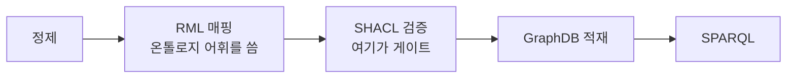
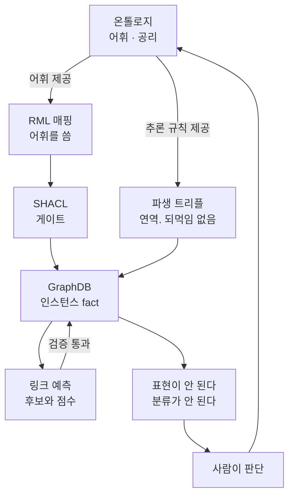
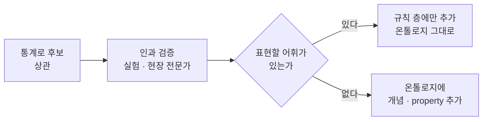
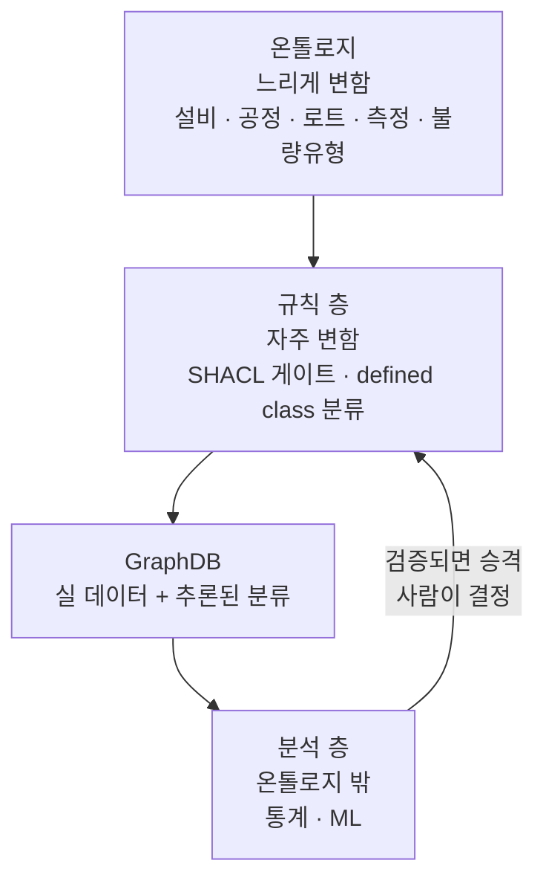
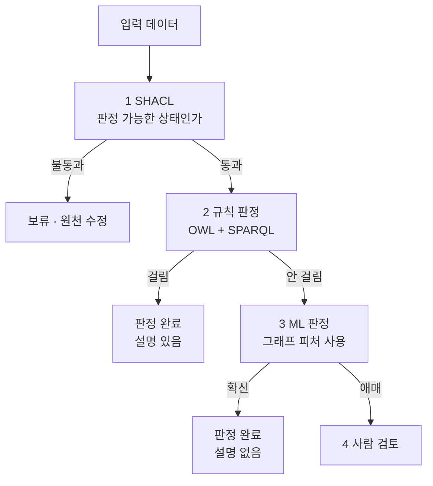

# 부록 S11-1 — 온톨로지가 하지 않는 일

> **성격** — [본편](S11-지식그래프-기초-개념.md)을 읽고 대화로 파고든 것들이다. 강의가
> 다루지 않았거나 한 덱 안에 담아놓고 구분해주지 않은 지점을 정리했다.
> 6절만 원논문(Ji et al. 2022 · Noy et al. 2019) 대조다.

강의는 온톨로지와 지식그래프가 어떻게 맞물리는지를 마지막 슬라이드 세 문장으로만 말하고 끝난다.
그 사이에 빠진 것이 꽤 많다. 특히 온톨로지가 무엇을 **하지 않는지**가 안 나온다.

---

## 1. 온톨로지는 입력 게이트가 아니다

가장 먼저 뒤집어야 할 전제다. 온톨로지를 어겨도 그래프 저장소에 들어간다.

[S09 실습](S09-1-제약처럼-보이는-공리들.md)에서 코드를 직접 돌려 확인한 내용이다.
`written_by`의 domain을 `Paper`로 걸어놓고 Keyword 개체에 그 속성을 붙이면 이렇게 된다.

```
추론 전  kw.is_a = [Keyword]
추론:            CONSISTENT
추론 후  kw.is_a = [Keyword, Paper]
```

에러가 나지 않고 키워드가 논문이 됐다. OWL과 RDFS는 열린 세계 가정이라 domain, range, some,
only가 전부 "어기면 안 된다"가 아니라 "이런 게 붙어 있으면 저 타입이겠다"는 추론 규칙이다.
막는 물건이 아니다.

그래서 세 가지를 나눠서 봐야 한다.

| | 하는 일 | 어겼을 때 |
|---|---|---|
| 온톨로지 (OWL) | 어휘를 제공하고, 있는 사실에서 새 사실을 연역 | 위반이라는 개념이 없다. 추론이 일어날 뿐이다 |
| SHACL | 이 모양이어야 한다를 강제 | 리포트에 걸리고 적재가 막힌다 |
| 그래프 저장소 | 저장하고 질의 | 기본적으로 아무 트리플이나 받는다 |

실무 파이프라인에서 진짜 게이트 역할을 하는 것은 SHACL이다.



"온톨로지 규칙에 따라 트리플을 만들어야 넣을 수 있다"는 이해에서, 어휘를 온톨로지에서 가져다
쓴다는 부분은 맞다. RML 매핑이 `:memberOf`, `:GraduateStudent` 같은 이름을 온톨로지에서 끌어오기
때문이다. 다만 그게 안 지키면 못 넣는다는 뜻은 아니다.

본편 11절의 Validation gates(Type consistency · Required properties · Cardinality/uniqueness)도
성격상 OWL 추론이 아니라 SHACL이 하는 일이다. 슬라이드는 "constraint를 적용해 구조적 오류를
검사"라고만 적어 두 층이 구분되지 않는다.

## 2. 추론과 링크 예측은 다른 물건이다

본편은 둘을 한 덱에 담아놓고 구분해주지 않는다. 4절의 Inference와 6.1절의 표현학습은 이름만
비슷하지 성격이 완전히 다르다.

**추론은 연역이다.**

```
T1 (대학원생 A, memberOf, 연구실)
T2 (연구실, partOf, 산업공학과)
→ affiliatedWith(대학원생 A, 산업공학과)
```

이건 추측이 아니다. 온톨로지가 `memberOf`와 `partOf`를 어떻게 정의했는지에서 논리적으로 따라
나온 것이고, 원래 함축돼 있던 것을 꺼냈을 뿐이다. 그래서 **타당한지 물을 필요가 없고, 온톨로지에
되먹일 것도 없다.** 온톨로지가 원인이지 결과가 아니다.

(파생 트리플이 저장소에 남느냐는 별개 문제다. [S10-1](S10-1-파이프라인이-말하지-않은-것들.md)에서
확인했듯 추론된 사실은 따로 넣지 않으면 export에 넘어오지 않는다.)

**링크 예측은 통계적 추측이다.**

TransE 같은 임베딩이 하는 일이고, 본편 6.1절에 강의가 붙인 단서가 정확히 이것이다.

> 표현학습의 출력은 검증된 사실이 아니라 fact 후보의 score와 ranking

논리적 귀결이 아니라 그럴듯함이다. 그래서 검증을 거쳐야 그래프에 들어간다. 그런데 통과해도
들어가는 곳은 인스턴스 층이다. `(A, coAuthorOf, B)` 트리플 하나가 추가될 뿐이고,
`coAuthorOf`라는 property는 이미 온톨로지에 있던 것이다.

| | 추론 | 링크 예측 |
|---|---|---|
| 근거 | 온톨로지 공리 | 학습된 패턴 |
| 결과의 성격 | 필연 | 후보와 점수 |
| 검증 | 필요 없음 (온톨로지가 맞으면 맞다) | 필요함 |
| 온톨로지로 되먹임 | 없음 | 없음. 인스턴스만 늘어난다 |

## 3. 온톨로지가 바뀌는 때

본편 19절 세 번째 문장이 이 이야기다. "KG의 instance와 사용 데이터는 ontology의 coverage를
검증하고 refinement를 유도한다." 다만 어떻게 유도하는지는 안 나온다.

**개별 fact는 온톨로지를 바꾸지 않는다.** 층이 다르다. 새 사실이 아무리 쌓여도 그것을 표현할
어휘가 이미 있으면 온톨로지는 그대로다.

온톨로지가 바뀌어야 하는 것은 어휘나 구조가 부족하다는 게 드러날 때다.

| 드러나는 방식 | 예시 |
|---|---|
| 표현할 property가 없다 | 공동지도 관계를 적고 싶은데 `advisedBy`밖에 없다 |
| 분류할 class가 없다 | 구글이 `sports`를 정의할 때 e-sports는 존재하지 않았다 |
| 제약이 현실과 안 맞다 | `advisedBy`를 functional로 잡았는데 공동지도가 실재한다 |

가운데 줄은 Noy et al.이 Type membership and resolution이라는 미해결 문제로 든 예시다.
클래스 소속 기준이 초기에는 명확해도 인스턴스가 늘면 의미적 안정성을 지키며 그 기준을 강제하기가
어려워진다는 것이다.

그리고 이 되먹임은 자동이 아니다. 사람이 판단해서 고친다. 되먹여지는 재료도 개별 트리플이 아니라
"이건 온톨로지로 표현이 안 되더라"는 패턴이다.



## 4. 제조 판정에 대면

실무 과제에 대보면 앞의 구분이 어디에서 갈리는지가 분명해진다. 파이프라인 자체는
[`Projects/ontology-pipeline/docs/`](../../../Projects/ontology-pipeline/docs/)에 있으니
여기서는 층이 나뉘는 지점만 적는다.

**온톨로지는 판정이 아니라 분류를 한다.** 온톨로지 추론으로 불량을 가려내려면 불량의 정의가
논리적으로 닫혀 있어야 한다. OWL로는 이런 모양이 된다.

```
DefectiveLot ≡ Lot ⊓ ∃hasMeasurement.(∃value.OutOfSpec)
```

이렇게 써두면 추론기가 알아서 분류한다. 그런데 이건 몰랐던 것을 알아낸 게 아니라 이미 아는 규칙을
적용한 것이다. 규격을 벗어나면 불량이라는 걸 이미 알고 있었기 때문이다. 온톨로지가 잘하는 것은
여기까지다. 아는 것을 빠짐없이, 일관되게, 설명 가능한 경로를 남기며 적용하는 일.

| 층 | 하는 일 | 판정에서 맡는 몫 |
|---|---|---|
| 온톨로지 | 어휘와 공리 | 아는 불량 유형을 자동 분류. 왜 그렇게 판정했는지 경로가 남는다 |
| 그래프 인스턴스 + SPARQL | 사실 조회 | 비교 대상 집합을 정확히 뽑아낸다 |
| 통계·ML (온톨로지 밖) | 패턴 발견 | 몰랐던 원인 후보를 찾는다 |

**몰랐던 원인이 반영되는 경로는 이렇다.**



대부분은 온톨로지가 안 바뀐다. 설비, 챔버온도, 측정, 불량유형 같은 개념이 이미 있으면 새로 넣을
어휘가 없기 때문이다. 바뀌는 것은 규칙 층이다.

**어휘는 수렴하고 규칙은 수렴하지 않는다.** 설비·공정·로트·측정·불량유형 같은 개념은 도메인이
정해져 있어 몇 번 돌면 안정된다. 판정 규칙은 신제품, 신설비, 신불량이 나올 때마다 늘어난다.
그래서 둘을 한 파일에 섞지 않는 편이 나중에 크게 갈린다.



**연결 여부로 판정하면 안 된다.** 불량 로트와 이어진 설비니까 그 설비를 거치면 불량이라고 읽으면
틀린다. 같은 설비를 거친 정상품이 수만 개 있기 때문이다. 연결만으로는 아무것도 말할 수 없고
필요한 것은 조건부 비율이다.

그래프가 강한 지점은 판정 자체가 아니라 비교 대상을 정확히 집어내는 일이다. "같은 설비, 같은 공정
조건, 같은 자재 로트를 쓰고 시점만 다른 로트 집합" 같은 모집단을 뽑는 것은 관계형 DB에서 조인으로
짜면 복잡한데 SPARQL로는 곧 나온다. 온톨로지가 모집단을 정의하고, 판정은 그 위에서 통계가 한다.

**암묵지는 둘 중 어디에도 잘 안 들어간다.** "소리가 좀 다르다", "이 색이면 곧 문제 생긴다" 같은
판단은 어휘로는 옮길 수 있어도 임계값이 없어서 defined class로 쓸 수 없다. 자동 분류에 못 태운다.
[S08의 CQ 방식](S08-기능적-의미적-평가-CQ.md)으로 접근할 자리로 보인다. 규칙을 먼저 만들려 하지
말고 숙련자가 실제로 답할 수 있는 질문을 모아, 그 질문에 답하는 데 필요한 어휘부터 세우는 순서다.
이건 따로 파고들 주제라 여기서는 열어두기만 한다.

## 5. AI 판정과의 역할 분담

4절은 온톨로지가 판정하는 경우까지만 다뤘다. 실제로는 규칙으로 안 잡히는 불량이 남고 그쪽은
ML이 맡는다. 그때 지식그래프를 어디에 붙이느냐가 갈린다.

### 5.1 라벨을 만들어주지는 않는다

먼저 기대를 낮춰둘 것이 있다. 정상·불량의 ground truth는 검사 결과에서 나오지 그래프에서
나오지 않는다. 지식그래프가 실제로 기여하는 자리는 다른 곳이다.

| 기여 | 내용 | 위험 |
|---|---|---|
| 라벨 품질 검증 | 같은 로트인데 라벨이 갈린다, 검사 시점이 공정 시점보다 앞선다 같은 모순을 잡는다 | 낮다 |
| 피처 생성 | 다중 홉 집계를 뽑아 모델 입력에 넣는다 | 낮다. 여기가 제일 크다 |
| 라벨 전파 | 로트 단위 판정을 개별 유닛에 내린다 | 높다. "같은 로트면 같은 상태"라는 가정이 들어간다 |

라벨 수가 부족한 것도, 신호가 데이터에 안 담긴 것도 그래프가 메워주지 않는다. 좋은 피처를 더
줄 뿐이다.

### 5.2 판정 뒤에 붙이면 이야기가 된다

모델이 판정한 근거와 지식그래프가 내놓는 설명은 서로 다른 계산이라 겹칠 이유가 없다. 모델이
불량이라고 한 유닛을 그래프로 뒤져 "설비 A를 거쳤고 A는 정비가 밀렸다"를 찾아내도, 모델이 그
이유로 판정했다는 근거가 되지 않는다. 모델은 자기 피처 공간에서 다른 것을 보고 있었을 수 있다.

무의미한 데서 그치지 않고 해롭다. 그럴듯해서 사람이 믿고 조치하게 되고, 모델의 실제 실패 모드를
가리며, 감사 상황에서는 나중에 지어낸 답이 근거로 제출된다.

다만 겉보기에 비슷한 것 중 정당한 사용이 있다. 갈리는 지점은 무엇을 주장하느냐다.

| | 주장하는 것 | |
|---|---|---|
| 모델 설명 | 모델이 이 근거로 판정했다 | 성립하지 않는다 |
| 현상 조사 | 모델이 불량으로 표시한 집합에 이런 공통점이 있다 | 성립한다 |
| 모델 감사 | 모델이 특정 설비·시간대·제품군에서 체계적으로 틀린다 | 성립한다 |

아래 둘은 모델을 설명 대상이 아니라 집합을 나누는 도구로 쓴다. 모델 내부에 대해 아무 주장도
하지 않고 세계에 대한 통계적 사실만 말하며, 그 결론은 별도로 검증한다.

```
X  모델이 이 로트를 불량으로 본 이유는 설비 A의 정비 지연이다
O  모델이 불량으로 표시한 로트 중 68%가 설비 A를 거쳤다. 정상 표시 로트에서는 31%다.
   이 차이가 실제 원인인지는 따로 확인해야 한다
```

### 5.3 판정 앞에 붙이는 세 방식

**A. 온톨로지가 직접 판정한다.** defined class로 조건을 써두면 추론기가 분류한다.

```
Class: OverheatedRun
  EquivalentTo: Run and (chamberTemp some xsd:decimal[>= 250])

Class: SuspectLot
  EquivalentTo: Lot and (processedBy some OverheatedRun)
```

```turtle
:L1024  :processedBy  :Run88 .
:Run88  a :Run ; :onEquipment :EQ-A ; :chamberTemp 258 .
```

추론기가 `:L1024 a :SuspectLot`을 만들고, 판정 경로가 그대로 설명이 된다.
`L1024 → Run88 → chamberTemp 258 ≥ 250`. 지어낸 이야기가 아니라 판정이 실제로 그 경로로
계산됐다.

그런데 OWL로 쓸 수 있는 조건이 좁다. 값을 계산하는 언어가 아니라 개념 사이 관계를 쓰는
언어이기 때문이다.

| 못 쓰는 것 | 예시 |
|---|---|
| 두 값의 비교 | 이 설비 온도가 같은 라인 평균보다 높으면 |
| 집계 | 같은 자재 로트의 불량률이 5%를 넘으면 |
| 산술 | 온도와 시간의 곱이 임계를 넘으면 |
| 시간 구간 계산 | 직전 정비 이후 400시간이 지났으면 |

그래서 실무의 규칙 판정은 대부분 SPARQL로 내려간다.

```sparql
CONSTRUCT {
  ?lot a :SuspectLot ;
       :flaggedBy :Rule-MaterialLotDefectRate .
}
WHERE {
  ?lot :usesMaterial ?mat .
  {
    SELECT ?mat (AVG(?d) AS ?rate) WHERE {
      ?other :usesMaterial ?mat ; :defectFlag ?d .
    } GROUP BY ?mat
  }
  FILTER (?rate > 0.05)
}
```

`:flaggedBy`로 어느 규칙이 걸었는지 함께 적어두는 것이 중요하다. 규칙이 수십 개로 늘어나면
이것 없이는 판정 근거를 되짚을 수 없다.

| 도구 | 쓰는 자리 |
|---|---|
| OWL defined class | 단순 소속·존재 조건. 온톨로지 자체에 남길 정의 |
| SPARQL CONSTRUCT | 집계·산술·비교가 필요한 대부분의 실제 규칙 |
| SHACL | 판정이 아니라 데이터가 규칙을 적용할 상태인지 검사 |

**B. 그래프가 피처를 만들고 ML이 판정한다.** 다중 홉으로 훑어 값을 뽑고 그 값이 모델 입력이
된다. 그래프가 아니면 만들기 번거로운 것들이다.

- 이 유닛이 거친 설비의 직전 정비 이후 경과시간
- 같은 자재 로트를 쓴 다른 유닛들의 불량률
- 상류 공정 경로의 길이와 분기 수
- 같은 시간대에 같은 설비를 공유한 다른 라인의 상태

관계형 DB에서는 조인이 겹겹이 쌓이는데 그래프에서는 경로 하나다. 지식그래프의 실질적 값어치가
여기 있다. 그리고 이 경우에만 사후 기여도 분석이 자격을 얻는다. 모델이 그 값을 실제로 입력으로
받았기 때문이다.

**C. 그래프 구조를 모델이 직접 먹는다.** R-GCN 같은 GNN이 그래프 자체를 입력으로 받는 방식이고
강의 S14에서 다룬다. 설명 가능성은 B보다 오히려 떨어진다. 서브그래프 설명 기법이 있지만 결국
사후 해석 문제로 되돌아간다.

### 5.4 계단식으로 겹쳐 쓴다

셋 중 하나를 고르는 것이 아니라 순서대로 태운다.



이 구조가 주는 것이 둘이다.

설명 가능한 판정의 비율이 측정된다. 전체 중 몇 퍼센트가 2단계에서 끝났는지가 그대로 지표가 되고,
3단계에서 나온 패턴이 검증을 통과해 2단계로 올라갈 때마다 그 비율이 오른다. 3절에서 그린 승격
경로가 여기서 숫자로 보인다.

규칙과 ML이 충돌하는 케이스가 드러난다. 규칙은 정상이라 했는데 ML이 불량이라 하면 검토 큐로
보낸다. 규칙의 빈틈일 수도 ML의 오탐일 수도 있는데 어느 쪽이든 봐야 할 케이스이고, 규칙을
늘려가는 가장 좋은 재료가 된다.

### 5.5 설명이라는 말이 가리키는 세 가지

여기까지 오면 설명이라는 단어가 세 가지를 가리키게 된다. 섞이면 5.2의 문제로 되돌아간다.

| | 말할 수 있는 것 | 근거 |
|---|---|---|
| 규칙 판정 경로 | 이 조건을 만족해서 걸렸다 | 정의상 참 |
| SHAP 등 기여도 | 모델이 이 피처에 반응했다 | 모델에 대한 사실 |
| 인과 | 이것이 원인이다 | 실험으로만 확인된다 |

SHAP으로 알 수 있는 것은 모델이 무엇을 봤는지이지 무엇이 원인인지가 아니다. 정비 경과시간의
기여도가 크게 나왔다고 정비 지연이 원인인 것은 아니다. 정비 주기가 생산 계획과 얽혀 있어 다른
변수의 대리 역할을 하고 있을 수도 있다.

## 6. 원논문 대조

강의가 인용한 두 논문을 받아 슬라이드와 맞춰봤다. Ji et al.은
[arXiv:2002.00388v4](https://arxiv.org/abs/2002.00388), Noy et al.은 CACM 62(8)이다
(ACM이 직접 접근을 막고 있어 Internet Archive로 받았다).

| 슬라이드 | 원논문 |
|---|---|
| 지식그래프의 "기본 정의" `G = {E, R, F}` | "there is no such wide-accepted formal definition"이라고 먼저 적고 정의 셋을 소개한다. 이건 논문이 채택한 작업 정의다 |
| Reasoning은 선택적이고 application에 따라 다름 | Ehrlinger & Wöß 정의는 ontology와 reasoner를 요건으로 본다 |
| tail이 데이터 값이면 literal | `literal`은 전문에 0회. 슬라이드 각주가 가리킨 `Sec. II and Table I`에 근거가 없다 |
| (h, r, t)만 소개 | Sec. I에 property graph를 "널리 쓰인다"고 적고, (h,r,t)는 "under RDF"라고 명시한다 |
| 1980s = Knowledge Bases, IF A THEN B | Fig. 10의 1980년대는 frame 계열(KEE·KL-ONE·Cyc)이다. 규칙 기반은 그 앞이다 |
| 네 축이 Acquisition → Representation 순환 | 논문 목차는 Representation → Acquisition. Fig. 2는 방사형 분류지 파이프라인이 아니다 |
| CORRECTNESS는 현실과 일치하는가 | Facebook 절은 다르게 정의한다 (아래) |
| Coverage·Correctness·Freshness가 보편 삼각 | Facebook 목록은 Coverage·Correctness·Structure·Constant change다 |
| "산업 KG는 여러 source의 충돌을 전제로 설계" | 그 슬라이드 다섯 줄이 전부 Facebook 소절 한 곳에서 나온다 |
| 5사 비교표 (주요 목적 · 대표 설계 결정) | 논문 표 컬럼은 Data model · Size · Development stage다. eBay만 2019년 시점에 미배포였다 |
| 필요하면 query 시점까지 판단 유보 | 논문에는 두 갈래다. IBM의 entity 식별과 Challenges의 type 부여 |
| — | 논문 마지막 세 페이지 Challenges Ahead가 슬라이드에 거의 없다 |

이 중 앞 절들과 이어지는 것 셋만 풀어둔다.

**correctness의 뜻이 논문 안에서 갈린다.** Microsoft 절은 "정보가 맞는가"로 쓰는데 Facebook 절은
이렇게 적는다.

> Correctness does not mean the knowledge graph always knows the "right" value for an attribute,
> but rather that it is always able to explain why a certain assertion was made.

옳은 값을 아는 것이 아니라고 못 박고 시작한다. 이 정의를 따르면 필요한 것은 정답 대조 장치가
아니라 근거를 따라갈 수 있는 기록 구조다. 4절에서 온톨로지 분류가 "왜 그렇게 판정했는지 경로를
남긴다"고 적은 것이 이 쪽 정의에 해당한다. 어느 쪽이 맞다고 정할 문제는 아니고, 두 정의가 서로
다른 시스템을 만든다.

**Challenges Ahead의 Managing changing knowledge가 3절과 직결된다.** 논문은 시점 하나짜리
스냅샷을 저장하고 즉각적 변경을 반영하는 데까지는 프레임워크들이 능숙해졌지만, 변화가 심한 지식을
관리하는 데는 공백이 있다고 적는다. 회사가 합병하면 identity가 따라가는지, 분사한 사업부는 어떻게
되는지 같은 질문이다. 본편 6.3절의 Temporal Knowledge Graph가 같은 지점을 가리키는데, 강의는 두
자리에서 같은 문제를 다루면서 서로 연결하지 않았다.

**논문이 이미 property graph를 언급한다.** 이건 어긋난 지점이라기보다 슬라이드가 지나간 자리다.
relation이 property를 가진다고 적어놓고 정의는 (h, r, t)로 잡아 edge에 속성을 달 자리를 두지
않았다. 이 갈래가 [RDF와 LPG 선택 기준](../../../Projects/ontology-pipeline/docs/1.core-concepts.html)과
바로 이어진다. 갈림길로 잡았던 것이 엣지 속성, 그래프 알고리즘, 표준 상호운용이었고 흔히 거론되는
"시각화"는 기준이 아니라고 봤다. 논문이 property graph를 부르는 방식이 그중 첫 번째를 그대로
가리킨다. 강의 덱 전체에서 RDF와 LPG 중 무엇을 고를 것인가는 다뤄지지 않는다.

---

## 관련 문서

- [S11 본편 — 지식그래프 기초 개념](S11-지식그래프-기초-개념.md)
- [S09-1 — 제약처럼 보이는 공리들](S09-1-제약처럼-보이는-공리들.md) — domain/range가 검증이 아니라 추론이라는 실행 확인
- [S10-1 — 파이프라인이 말하지 않은 것들](S10-1-파이프라인이-말하지-않은-것들.md) — 추론된 사실이 저장소에 남지 않는 문제
- [S08 — 기능적·의미적 평가 (CQ 기반)](S08-기능적-의미적-평가-CQ.md) — 질문에서 어휘를 끌어내는 방식
