# S11 — 지식그래프 기초 개념

> Ch.4 온톨로지↔KG · Day 6
> 원자료: DSBA Lab Study 강의 슬라이드 24장 (`01 Introduction` ~ `06 Conclusion`)
> 인용 논문
> · Ji, Pan, Cambria, Marttinen, Yu (2022), *A Survey on Knowledge Graphs: Representation,
>   Acquisition, and Applications*, IEEE TNNLS ([arXiv:2002.00388](https://arxiv.org/abs/2002.00388))
> · Noy, Gao, Jain, Narayanan, Patterson, Taylor (2019),
>   *Industry-Scale Knowledge Graphs: Lessons and Challenges*, CACM 62(8)

덱이 크게 두 덩이다. 1~6절은 Ji et al. 서베이에 기대어 지식그래프가 무엇인지와 연구 지형을
다루고, 7~19절은 Noy et al. 사례에 기대어 어떻게 만들고 운영하는지로 넘어간다.

강의가 구분해주지 않은 것과 원논문 대조는 [부록 S11-1](S11-1-온톨로지가-하지-않는-일.md)에 따로 적었다.

---

## 1. 왜 지식그래프가 필요한가

강의는 값만으로는 의미를 판단할 수 없는 상황에서 출발한다. 같은 `KG_final.pdf`라는 파일명이
공유폴더에 있으면 최종본인지 아닌지 알 수 없고, DBLP에 있으면 게재 논문이다. 파일명이라는 값은
같은데 놓인 자리가 달라서 해석이 갈린다.

| 파일명 | 분류 | 해석 |
|---|---|---|
| KG_final.pdf | 공유폴더 | 최종본? |
| KG_final.pdf | DBLP | 게재 논문 |

같은 값을 구분하려면 그 값이 무엇과 어떻게 이어져 있는지를 적어야 한다. 논문을 대학원생 A,
지도교수 B, 연구실, 데이터셋, 2026년 학회 같은 개체에 연결하면 관계 자체가 맥락이 된다.

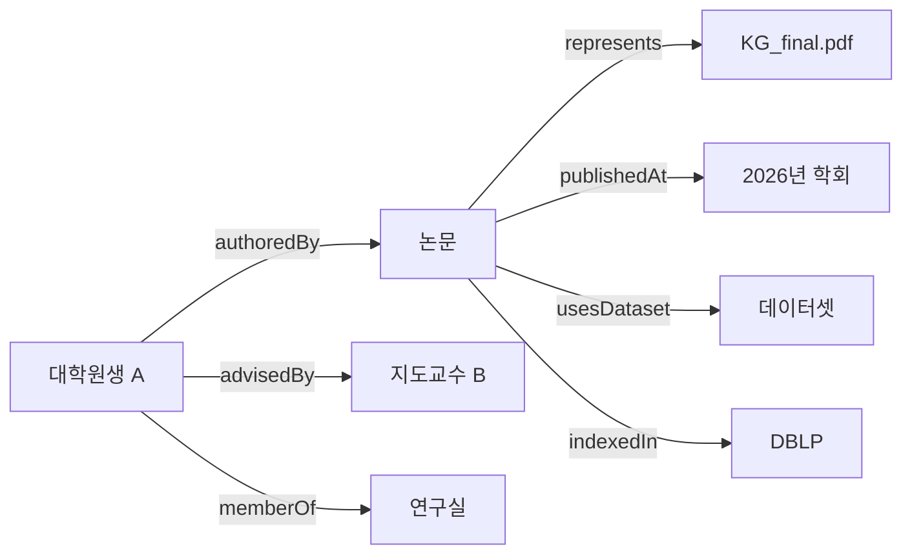

이렇게 연결해두면 여러 단계를 건너뛰며 질문할 수 있다. 강의는 이것을 multi-hop traversal과
rule로 소속, 지도, 논문, 데이터셋 맥락을 탐색하는 일이라고 설명했다.

## 2. 지식그래프는 어디에서 왔는가

Knowledge Graph라는 말이 널리 쓰이게 된 것은 구글이 2012년에 서비스를 공개한 뒤부터다. 그
이전에 Semantic Network, Knowledge Base, Semantic Web이 핵심 아이디어를 먼저 내놓았고,
Knowledge Graph는 온톨로지의 의미론을 이어받으면서 중앙 운영과 품질, 응용 가치를 더 강조하는
쪽으로 갔다.

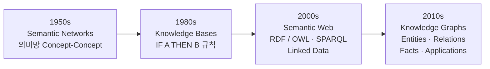

강의는 이 흐름을 무게중심의 이동으로 한 번 더 요약했다.

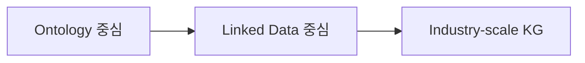

기계가 읽고 연결할 수 있는 지식으로 발전해온 과정이라는 것이 강의의 정리다.

> 원논문의 연표는 이 네 칸과 시기가 어긋나는 지점이 있다. 특히 규칙 기반이 어느 시대인지가
> 다르다. [부록 5절](S11-1-온톨로지가-하지-않는-일.md#6-원논문-대조)에 적었다.

## 3. 지식그래프의 기본 정의

강의는 지식그래프를 entity, relation, fact 세 집합으로 정의한다.

```
G = { E : Entities,  R : Relations,  F : Facts }
```

| 집합 | 내용 | 예시 |
|---|---|---|
| E : Entities | 식별 대상 | 대학원생 A · 지도교수 B · 연구실 · 논문 |
| R : Relations | 의미가 지정된 edge | memberOf · advisedBy · wrote · usesDataset |
| F : Facts | (h, r, t) triple | (대학원생 A, memberOf, 연구실) · (논문, usesDataset, 데이터셋) |

fact 하나는 head, relation, tail 세 자리로 이루어진다.

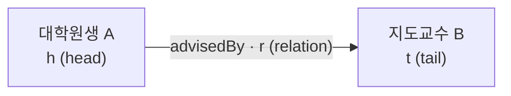

node에는 실체와 추상 대상이 모두 들어간다. 그리고 강의는 tail이 개체가 아니라 숫자, 문자열,
날짜 같은 데이터 값인 경우를 literal이라고 부르며 구분했다.

- Entity relation: `(대학원생 A, advisedBy, 지도교수 B)`
- Literal: `(대학원생 A, studentId, "2024-001")`

> 인용된 논문은 이 정의를 여러 정의 중 하나로 제시하고, literal이라는 구분은 쓰지 않는다.
> [부록 5절](S11-1-온톨로지가-하지-않는-일.md#6-원논문-대조)에 적었다.

## 4. 개별 사실은 어떻게 지식이 되는가

triple 하나하나는 고립된 사실이다. 대학원생 A나 연구실처럼 여러 triple에 함께 등장하는 개체가
매개가 되면서 이것들이 하나의 그래프로 이어진다.

강의가 든 예시는 다섯 개의 triple이다.

```
T1 (대학원생 A, memberOf, 연구실)
T2 (연구실, partOf, 산업공학과)
T3 (대학원생 A, advisedBy, 지도교수 B)
T4 (대학원생 A, wrote, 논문)
T5 (지도교수 B, supervises, 논문)
```

여기에 "대학원생 A는 어느 학과 소속인가"라고 물으면 답을 얻는 길이 두 가지다.

| | 하는 일 | 예시에서 |
|---|---|---|
| Traversal | 저장된 edge를 따라간다 | 대학원생 A → 연구실 → 산업공학과 |
| Inference | rule로 저장되지 않은 fact를 만든다 | affiliatedWith(대학원생 A, 산업공학과) |

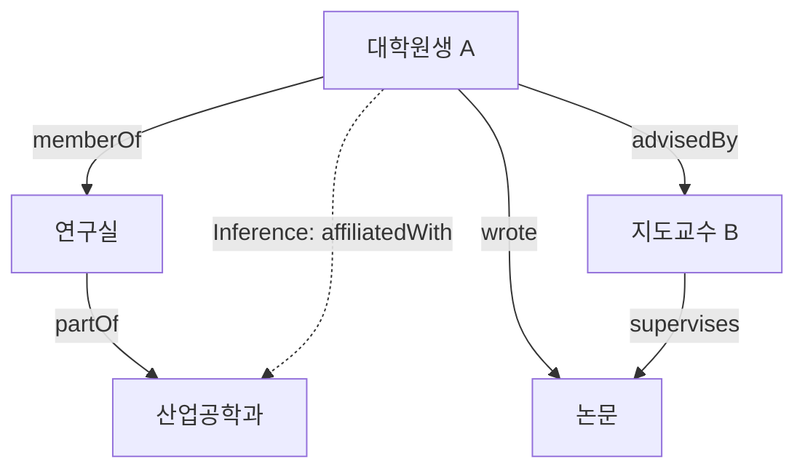

둘의 차이는 결과가 그래프에 남는지에 있다. traversal은 이미 있는 edge를 훑고 지나가지만,
inference는 rule을 적용해 원래 없던 edge를 만들어낸다.

## 5. 모든 그래프가 지식그래프인가

노드와 엣지가 있다고 해서 다 지식그래프는 아니다. 강의는 지식그래프를 graph 구조에 현실 세계의
의미를 부여한 것으로 설명하면서, 세 단계를 비교했다.

| 구분 | Graph | Data Graph | Knowledge Graph |
|---|---|---|---|
| Nodes & edges | 있다 | 있다 | 있다 |
| 현실 세계 identity | 없다 | 선택적 | 중요 |
| Semantic relations | 없다 | 선택적 | 중요 |
| Schema / ontology | 없다 | 선택적 | 선택적에서 강함까지 |
| Reasoning | 없다 | 선택적 | 선택적이고 application에 따라 다름 |

가르는 기준은 두 가지다. node가 식별 가능한 개체를 가리키는지, 그리고 edge가 의미가 정의된
relation인지. 나머지 두 줄인 schema와 reasoning은 강의 설명상 필수가 아니라 application에 따라
사용 수준이 달라지는 항목이다.

> 인용 논문이 소개하는 정의 중 하나는 ontology와 reasoner를 지식그래프의 요건으로 본다.
> 이 표의 마지막 두 줄과 어긋난다.
> [부록 1절](S11-1-온톨로지가-하지-않는-일.md#1-온톨로지는-입력-게이트가-아니다)에 적었다.

## 6. KG 연구를 네 축으로 정리

강의는 Ji et al. 서베이의 Fig. 2를 그대로 가져와 KG 연구 지형을 네 축으로 나눈다.

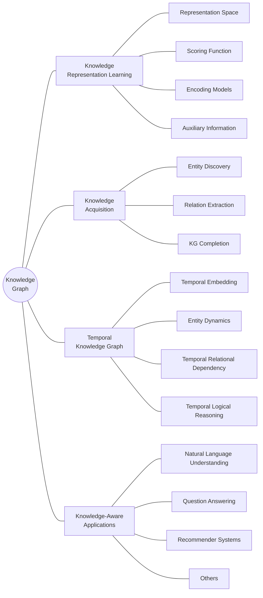

### 6.1 Representation Learning

entity와 relation을 계산 가능한 표현으로 바꾸고, 사실의 그럴듯함을 비교해 누락 관계와 후보를
순위 매기는 축이다. 모델 설계는 네 질문으로 갈린다.

| | 정하는 것 | 선택지 |
|---|---|---|
| 1 Representation Space | entity와 relation을 어디에 표현할 것인가 | vector · complex · Gaussian · manifold 공간 |
| 2 Scoring Function | (h,r,t)가 얼마나 자연스러운지 계산 | distance 기반 · semantic matching 기반 |
| 3 Encoding Model | entity와 relation의 상호작용을 어떻게 학습할 것인가 | linear · factorization · neural network |
| 4 Auxiliary Information | graph 밖의 text·type·image를 어떻게 결합할 것인가 | sparse relation을 보완하는 semantic signal |

강의가 이 절에 붙인 단서가 하나 있다. 표현학습의 출력은 검증된 사실이 아니라 fact 후보의
score와 ranking이라는 것이다.

> 이 출력과 4절의 Inference는 이름만 비슷하고 성격이 다르다.
> [부록 2절](S11-1-온톨로지가-하지-않는-일.md#2-추론과-링크-예측은-다른-물건이다)에 적었다.

### 6.2 Knowledge Acquisition

지식을 늘리는 축이고 세 가지 작업으로 나뉜다.

| | 입력 | 과정 | 출력 |
|---|---|---|---|
| KG Completion | head·relation·tail 중 일부가 빈 triple | 기존 graph의 embedding·path·rule pattern으로 후보 scoring | 누락된 entity 또는 relation의 순위화된 후보 |
| Entity Discovery | 문서·database·다른 KG에 등장한 entity 표현 | entity를 발견하고 type을 부여한 뒤 어떤 실제 대상인지 식별 | canonical entity와 기존 KG에 연결하는 identity link |
| Relation Extraction | 두 개 이상의 entity가 등장하는 문장 | 문맥과 문장 구조를 분석해 entity 사이의 의미 관계를 식별 | 새로운 relation triple과 이를 뒷받침하는 원문 evidence |

셋이 같은 일을 하는 것은 아니다. Completion은 이미 있는 그래프의 빈칸을 채우고, Discovery와
Extraction은 그래프 바깥에서 새 지식을 들여온다.

### 6.3 Temporal Knowledge Graph

현실의 사실 중 상당수는 항상 참이 아니라 특정 시점이나 기간에만 유효하다. 그래서 triple에 시간
정보를 함께 기록하고, 시간에 따라 entity 상태가 어떻게 변하는지와 relation들이 어떤 순서로
발생하는지를 학습한다.

| | 입력 | 과정 | 목적 |
|---|---|---|---|
| 1 Temporal Embedding | entity, relation, timestamp 또는 유효기간 | 같은 triple도 시간에 따라 다른 의미와 점수를 갖도록 vector로 표현 | 특정 시점에 해당 fact가 성립할 가능성을 계산 |
| 2 Entity Dynamics | 시간에 따라 관찰된 entity의 type·상태·relation | entity의 representation이 시간에 따라 변하도록 학습 | 동일한 entity의 과거와 현재 상태를 구분 |
| 3 Temporal Dependency | 시간 순서대로 발생한 여러 relation과 event | relation 사이의 선후 관계와 시간적 의존성을 학습 | 어떤 사건이 다른 사건보다 먼저 또는 나중에 발생하는 패턴 파악 |
| 4 Temporal Reasoning | 시간 정보가 포함된 fact와 temporal rule 또는 학습된 pattern | 특정 시점에 유효했던 관계를 찾거나 누락된 시간·relation 후보 도출 | 과거 상태 조회, 누락 fact 보완, 미래 event 후보 예측 |

강의는 여기에 단서를 붙였다. 시간을 저장하는 것과 최신 정보를 수집하는 것은 별개이고, 표현과
update 파이프라인이 둘 다 필요하다는 것이다. 후자는 [아래 13절](#13-update--serving)에서 다룬다.

### 6.4 Knowledge-aware Applications

만들어둔 지식을 실제 작업에 붙이는 축이다.

| | 입력 | 과정 | 출력 |
|---|---|---|---|
| 1 NLU | entity mention이 포함된 문장이나 문서 | mention을 KG entity와 연결하고 관련 type·attribute·fact를 문맥 정보로 활용 | 동음이의어를 구분하고 factual knowledge가 보강된 언어 표현 |
| 2 Question Answering | 사용자의 자연어 질문 | 질문의 entity와 relation을 식별해 graph query로 변환한 뒤 단일 또는 multi-hop 경로를 탐색 | KG fact에 근거한 답과 필요하면 추론 경로 |
| 3 Recommendation | 사용자 행동, item 정보, user-item interaction | 사용자와 item 사이의 entity·relation path를 분석하고 관련 후보를 ranking | 추천 item과 추천 이유를 설명할 수 있는 graph path |
| 4 Search & Domain Tasks | 키워드 또는 domain-specific 질문 | 문자열을 entity로 식별하고 type·relation·ontology로 검색 범위를 확장하거나 제한 | entity 중심 검색 결과 또는 domain knowledge가 반영된 판단 |

강의가 이 절을 닫으며 붙인 말은, knowledge-aware가 KG를 그대로 보여주는 것이 아니라 task
model의 판단에 지식을 연결하는 것이라는 구분이다.

### 6.5 네 축의 연결

강의는 네 축을 독립된 목록이 아니라 순환 구조로 제시했다.

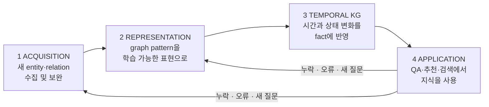

Application에서 발견된 누락과 오류, 새 질문이 다시 Acquisition과 Representation의 입력이 된다는
것이 강의의 마무리다.

> 이 순서와 순환 구조는 인용 논문의 구성과 다르다.
> [부록 5절](S11-1-온톨로지가-하지-않는-일.md#6-원논문-대조)에 적었다.

---

여기부터 인용 논문이 바뀐다. 지식그래프를 무엇으로 정의하느냐에서 어떻게 만들고 운영하느냐로
넘어가는 구간이고, 온톨로지가 구체적으로 어느 단계에서 일하는지가 여기서 드러난다.

---

## 7. Knowledge Graph Lifecycle

강의는 구축을 한 번 만들고 끝나는 작업이 아니라 되돌아오는 순환으로 그린다.

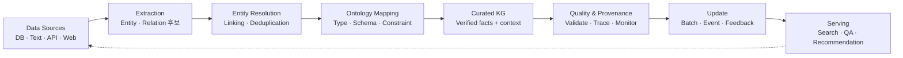

DB와 문서, API에서 원천 데이터를 모아 entity와 relation 후보를 만들고, 같은 대상을 연결한 뒤
온톨로지에 맞게 정합성을 검사해서 출처와 함께 저장한다. 서비스에서 발견된 오류와 현실의 변화는
다시 앞으로 돌아가 품질과 최신성을 관리하는 재료가 된다.

여덟 단계 중 온톨로지가 직접 등장하는 자리는 Ontology Mapping 하나지만, 그 앞뒤로 무엇이
들어오고 나가는지가 이 회차의 내용이다.

## 8. Data Sources & Ingestion

원천은 성격이 서로 다르다. DB는 구조가 명확한 대신 schema가 제각각이고, 문서는 의미가 풍부하지만
비정형이다. API와 Web 데이터는 최신 정보를 주는 대신 호출 시점과 응답 형식, 사용 조건을 같이
관리해야 한다.

| 원천 | 성격 |
|---|---|
| Database | 정형 · schema 기반 |
| Documents | 문장 · 표 · PDF |
| API / Web | 변경 · 호출 이력 |
| Metadata | 출처 · 시각 · 버전 |

강의가 여기서 강조한 것은 원문을 곧바로 KG에 넣지 않는다는 점이다. source ID와 수집 시각, 원본
위치를 보존한 staging layer에 먼저 적재한다.

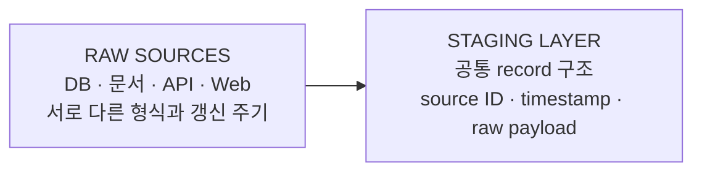

## 9. Entity & Relation Extraction

문장과 표에서 사람, 논문, 기관 같은 entity mention을 찾아 임시 type을 붙이고, entity 쌍 사이의
관계 표현을 뽑는다. 이때 근거가 된 문장과 표 셀, 문서 위치를 함께 기록한다.

강의가 든 예시 문장은 "대학원생 A는 지도교수 B의 지도를 받아 논문을 작성했다"이고, 다섯 단계로
처리된다.

| 단계 | 결과 |
|---|---|
| 1 Mention Detection | [대학원생 A] · [지도교수 B] · [논문] |
| 2 Entity Typing | 대학원생 A:STUDENT · 지도교수 B:PROFESSOR · 논문:PAPER |
| 3 Relation Extraction | 대학원생 A –advisedBy→ 지도교수 B |
| 4 Evidence Capture | 원문 문장 · 문서 ID · 페이지/문단 위치 저장 |
| 5 Candidate Output | entity/relation 후보를 다음 Linking·Validation 단계로 전달 |

이 단계의 산출물은 어디까지나 candidate fact다. entity mention 후보와 임시 entity type, relation
후보, 근거 문장과 문서 위치가 나올 뿐이고, 아직 canonical entity도 검증된 KG fact도 아니다.
동일 대상 연결과 온톨로지 검증을 통과한 뒤에야 KG에 반영된다.

## 10. Entity Linking & Resolution

이름과 별칭, 소속, 식별자, 주변 관계를 써서 mention이 기존 KG entity와 같은 것인지 판단한다.
동명이인은 분리하고, 표기만 다른 동일 대상은 하나의 canonical ID로 병합한다.

강의 예시는 'DSBA', 'Data Science & Business Analytics Lab', 소속 고려대학교라는 mention을
canonical entity에 붙이는 상황이다.

| 후보 | 점수 |
|---|---|
| KG:DSBA_Lab | 0.94 |
| KG:DSBA_Company | 0.08 |
| 새 entity 생성 | 0.03 |

판단에 쓰는 단서는 이름·별칭·약어, 소속·주소·외부 ID, 연결된 사람·논문 관계이고, 결과는
Link, Create, Review 셋 중 하나다. 자동 점수가 불확실하면 새 entity를 만들거나 강제로 병합하지
않고 검토 대상으로 남긴다. 강의 표현으로는 높은 유사도만으로 병합하지 않고 식별 근거와
threshold를 함께 관리한다.

## 11. Ontology Mapping & Validation

온톨로지가 직접 일하는 단계다. 원천마다 다른 type과 relation 명칭을 온톨로지의 class와
property로 정규화한다.

```
student     → :GraduateStudent
lab         → :ResearchGroup
affiliation → :memberOf
```

```
:StudentA  :memberOf  :DSBA_Lab
:StudentA  rdf:type   :GraduateStudent
```

그 다음 domain·range·cardinality·필수 속성 같은 constraint를 적용해 구조적 오류를 검사한다.
강의가 제시한 검사 항목은 네 가지다.

| Validation gate | 묻는 것 |
|---|---|
| Type consistency | subject/object가 domain·range와 일치하는가 |
| Required properties | 식별자·이름·출처가 존재하는가 |
| Cardinality / uniqueness | 중복 ID나 허용 범위를 위반하지 않는가 |
| Inference boundary | 관측 fact와 추론 fact를 구분했는가 |

결과는 Accept, Repair, Review, Reject 넷으로 갈리고, 실패 항목은 수정하거나 검토 큐로 보낸다.

> 이 네 gate는 성격상 OWL 추론이 아니라 SHACL이 하는 일이다. 슬라이드는 두 층을 구분하지 않는다.
> [부록 1절](S11-1-온톨로지가-하지-않는-일.md#1-온톨로지는-입력-게이트가-아니다)에 적었다.

네 번째 gate가 앞 회차와 이어진다. 추론으로 얻은 type과 원문에서 직접 관측한 fact를 구분해두라는
것인데, [S09에서 다룬 OWL 공리의 성격](S09-1-제약처럼-보이는-공리들.md)과 같은 문제다. 제약처럼
보이는 공리가 실제로는 추론을 일으키기 때문에, 무엇이 관측이고 무엇이 파생인지 표시가 없으면
나중에 구분할 수 없다.

## 12. Quality & Provenance

각 fact가 어느 원문에서 언제 어떤 과정으로 생성됐는지를 함께 저장한다. 강의가 세운 네 축은
이렇다.

| | 묻는 것 |
|---|---|
| COMPLETENESS | 필수 entity·relation·속성이 얼마나 채워져 있는가 |
| CONSISTENCY | ontology constraint와 서로 충돌하는 fact는 없는가 |
| FRESHNESS | 현실의 변경이 KG에 얼마나 빠르게 반영되는가 |
| PROVENANCE | 누가·언제·어떤 원천에서 fact를 생성했는가 |

배포 전에 통과해야 하는 release gate는 schema validation, duplicate check, source trace,
freshness SLA다. 오류가 발견되면 source record와 transformation log로 되돌아가 수정한다.

강의는 여기에 하나를 덧붙였다. 모델이 추출한 값, 규칙이 추론한 값, 사람이 확인한 fact를 구분해
신뢰도와 수정 책임을 명확히 관리하라는 것이다.

## 13. Update & Serving

갱신 경로가 둘이고 실행 시점이 다르다.

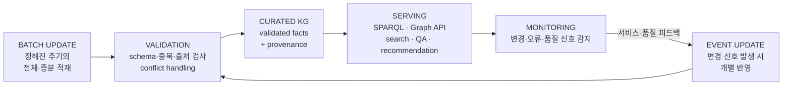

두 경로가 따로 굴러가지만 검증과 충돌 처리는 공통으로 거친다. Monitoring이 서비스와 품질 변화를
감지해 필요한 Event Update를 다시 촉발하는 것이 이 그림의 닫는 고리다.

## 14. 기업들은 KG를 왜 사용하는가

여기서부터 산업 사례로 넘어간다. 강의가 든 이유는 세 가지다. 서로 다른 서비스가 같은 entity와
fact를 공유하게 해서 검색·질의응답·추천의 공통 지식 기반으로 쓰고, entity identity와 provenance를
일관되게 관리해 정확성과 최신성을 유지하며, 서로 다른 workload에 맞춰 저장소와 처리 구조를
유연하게 구성한다.

| Company | 주요 목적 | 대표 설계 결정 (2019 시점) |
|---|---|---|
| Microsoft | 검색과 질의응답 | Coverage · Correctness · Freshness |
| Google | 안정적 entity identity | Metatype · layered schema validation |
| Facebook | 사회적 관심 대상 연결 | Provenance · idempotent rebuild |
| eBay | 상품 이해 | Replicated log · multiple backends |
| IBM | 지식 발견 | Evidence primitive · runtime resolution |

> 원논문의 비교표는 컬럼 구성이 다르고 규모 수치를 담고 있다. eBay는 2019년 시점에 아직 배포
> 단계가 아니었다.
> [부록 5절](S11-1-온톨로지가-하지-않는-일.md#6-원논문-대조)에 적었다.

## 15. 여러 source의 충돌을 전제로 하는 설계

산업 KG는 database, 사용자 입력, 텍스트 추출 등 여러 원천을 통합하기 때문에, 같은 entity에 대해
서로 다른 fact가 들어오는 상황을 기본으로 놓고 만든다.

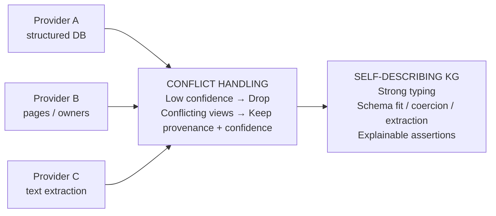

처리 방식은 두 갈래다. 신뢰도가 너무 낮은 fact는 제외하고, 판단 가능한 충돌은 하나로 강제
통합하지 않고 출처와 confidence를 함께 보존한다. 그리고 모든 데이터가 type과 schema에 맞도록
변환·추출·검증하며, source에서 graph를 반복적으로 재구축해 변화와 일관성을 관리한다.

> 이 절의 내용은 원논문에서 특정 회사 한 곳의 설계로 서술된 것이다.
> [부록 5절](S11-1-온톨로지가-하지-않는-일.md#6-원논문-대조)에 적었다.

## 16. 큰 그래프보다 믿을 수 있는 그래프

신뢰할 수 있는 KG는 필요한 정보가 충분히 있고, 현실과 일치하며, 현재도 유효해야 한다.

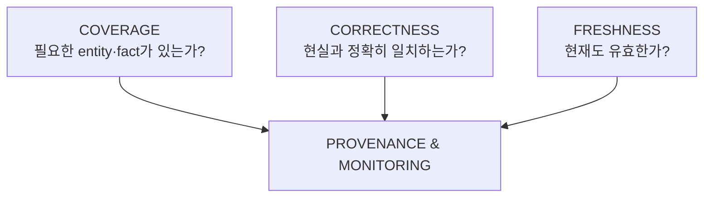

강의가 붙인 단서는 이 셋이 서로 다른 품질 기준이므로 하나의 점수로 단순 합산하기보다 각각
관리해야 한다는 것이다. 그리고 각 fact의 출처와 생성 시점, 수정 이력을 기록하고 지속적으로
모니터링해야 오류와 변화를 추적할 수 있다.

## 17. Relation을 연결하기 전에 entity를 식별해야 한다

같은 entity가 여러 이름으로 표현되거나 같은 이름이 서로 다른 entity를 가리킬 수 있다. 그래서
relation을 연결하기 전에 identity를 구분해야 한다.

| | 상황 | 예시 |
|---|---|---|
| A | Different names, same entity | [대학원생 A] → [Student A]. ORCID·소속·공저자로 canonical identity 검증 |
| B | Same name, different entities | "대학원생 A"가 연구실 / 데이터마이닝 연구실 / 외부 대학에 각각. 같은 이름이지만 서로 다른 Researcher entity |

판단에 쓰는 재료는 하나가 아니다.

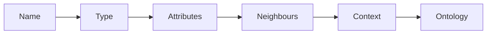

이름만으로 결정하지 않고 type·속성·주변 관계·문맥·온톨로지를 함께 쓰며, 필요하면 query 시점까지
판단을 유보한다. 텍스트의 표현을 KG entity에 연결하고, 중복 record를 하나로 통합하며, 서로 다른
KG의 동일 entity를 대응시키는 세 가지 작업이 여기에 걸려 있다.

## 18. workload에 따라 갈리는 저장·해석 경로

하나의 KG 안에서도 실시간 검색과 장시간 graph 분석, 지식 발견은 요구 성능이 달라서 저장소 하나로
다 처리하기 어렵다. 강의는 두 회사의 대응을 나란히 놓았다.

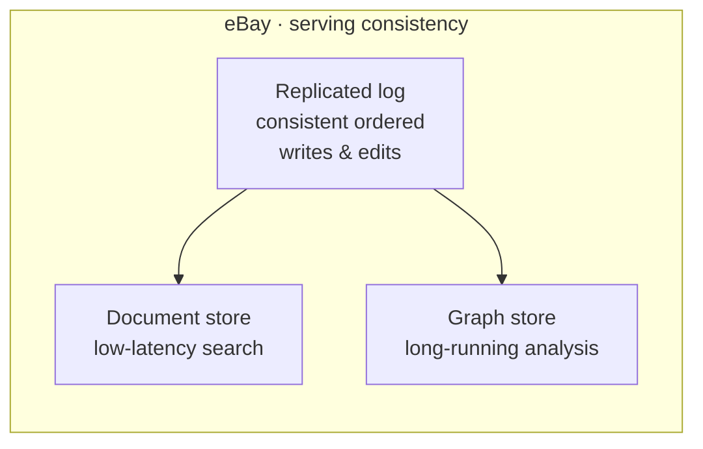

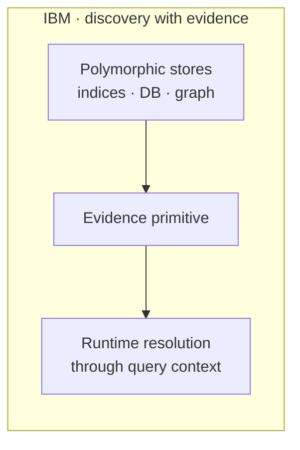

eBay는 모든 변경을 순서가 보장된 공통 log에 기록하고, 검색용 document store와 분석용 graph
store에 동일하게 반영한다. IBM은 목적별 저장소를 조합하면서 각 fact를 원문 evidence와 연결하고,
필요한 경우 query 문맥에서 entity를 식별한다.

## 19. 정리

강의가 마지막 슬라이드에서 묶은 다섯 문장이다.

1. KG는 entity와 semantic relation으로 현실을 표현한다.
2. Ontology는 vocabulary, schema, constraint를 제공한다.
3. KG의 instance와 사용 데이터는 ontology의 coverage를 검증하고 refinement를 유도한다.
4. 현대 KG는 logical reasoning과 statistical learning을 함께 사용한다.
5. 산업 KG의 핵심은 identity, coverage, correctness, freshness이다.

세 번째 문장이 이 회차에서 온톨로지의 역할을 가장 짧게 말한 부분이다. 온톨로지가 KG에 일방적으로
schema를 내려주는 것이 아니라, KG에 쌓인 instance와 실제 사용 기록이 거꾸로 온톨로지의 빈 곳을
드러내고 수정을 끌어낸다. [S07·S08의 평가 방법론](S08-기능적-의미적-평가-CQ.md)에서 CQ가 하던
역할과 방향이 같다.

---

## 관련 문서

- [부록 S11-1 — 온톨로지가 하지 않는 일](S11-1-온톨로지가-하지-않는-일.md) — 게이트·추론·되먹임의 구분, 제조 판정 적용, 원논문 대조
- [S09-1 — 제약처럼 보이는 공리들](S09-1-제약처럼-보이는-공리들.md) — 관측 fact와 추론 fact의 구분
- [S08 — 기능적·의미적 평가 (CQ 기반)](S08-기능적-의미적-평가-CQ.md) — 사용 데이터가 온톨로지를 되짚는 구조
