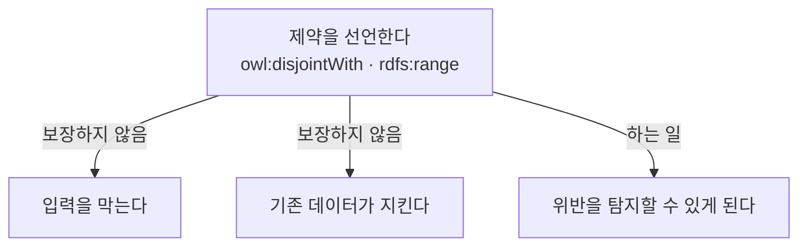

# 부록 S12-1 — 선언과 준수 사이

> **성격** — [본편](S12-KG-구축에서-온톨로지의-역할.md)을 읽으며 갈라져 나온 것들이다. 앞
> 회차에서 확인한 것과 이 회차 슬라이드가 어긋나는 지점, 그리고 같은 내용을 두 번 배우게 된
> 자리를 정리했다. 5절만 원논문 대조다.

이 회차 슬라이드는 온톨로지의 역할을 스키마·제약·추론 셋으로 나누며 시작한다. 그런데 가운데
항목인 제약이 앞 회차에서 코드로 확인한 것과 맞지 않는다. 재미있는 것은 이 회차가 인용한 논문
자체가 그 어긋남을 수치로 보여준다는 점이다.

---

## 1. 제약은 선언과 준수가 따로 논다

본편 3절은 온톨로지의 역할 중 하나를 제약으로 든다. "어떤 의미적 조건을 만족해야 하는가",
"클래스 간 배타성, 속성값의 범위·개수 규칙"이라고 적혀 있다.

[S09 실습](S09-1-제약처럼-보이는-공리들.md)에서 코드를 돌려 확인한 것은 반대였다. domain을
어겨도 에러가 나지 않고 그 개체가 해당 클래스로 추론될 뿐이다. OWL은 열린 세계 가정이라 위반이라는
개념 자체가 없다. 이 갈라짐은 [S11-1 1절](S11-1-온톨로지가-하지-않는-일.md#1-온톨로지는-입력-게이트가-아니다)에
정리해뒀다.

**그런데 본편 10절의 Consistency 세 metric이 정확히 이 갈라짐을 재고 있다.**

| metric | 재는 것 | 어느 층 |
|---|---|---|
| m_checkRestr | 입력 시점에 제약 위반을 사전 검증하는가 | 게이트가 있는가 |
| m_conClass | 이미 들어간 데이터가 `owl:disjointWith`와 모순되지 않는가 | 선언이 지켜지는가 |
| m_conRelat | 이미 들어간 값이 `rdfs:range`·`owl:FunctionalProperty`를 지키는가 | 선언이 지켜지는가 |

세 개가 서로 다른 것을 묻는다. 첫 줄은 게이트의 존재를, 나머지 둘은 이미 들어간 데이터의 준수
여부를 본다. **논문이 이 둘을 별도 metric으로 쪼갠 것 자체가 OWL 공리가 게이트가 아니라는
사실의 방증이다.** 게이트였다면 m_conClass와 m_conRelat는 항상 1이어야 하고 잴 이유가 없다.

실제 수치가 그것을 보여준다. DBpedia는 m_checkRestr가 0이면서 m_conClass가 0.88이다. 입력
게이트가 없으니 선언한 배타성을 어긴 데이터가 12% 들어가 있다는 뜻이다.

### 세 KG가 서로 다른 답을 골랐다

| | 고른 방식 |
|---|---|
| DBpedia · YAGO | 온톨로지에 제약을 선언하고 게이트는 두지 않는다. 그래서 위반이 쌓인다 |
| Freebase | 편집 UI에서 입력 시점에 검사한다. m_checkRestr = 1 |
| Wikidata | 제약을 RDF/OWL 모델에 아예 넣지 않는다. m_conRelat = 0 |

Wikidata 줄이 특히 걸린다. m_conRelat가 0인 이유는 품질이 나빠서가 아니라 `rdfs:range`와
`owl:FunctionalProperty`를 **온톨로지에 선언하지 않았기** 때문이다. 대신 편집 UI와 커뮤니티
규칙으로 관리한다. 즉 **제약을 온톨로지 밖에 둔 선택**이다.

이게 S11-1 1절에서 정리한 구조와 같은 이야기다. 거기서는 SHACL이 그 자리를 맡았고, Wikidata는
UI와 프로세스가 맡는다. 어느 쪽이든 **강제하는 층은 OWL 밖에 있다.**

그리고 본편 13절의 종합 표를 보면 Wikidata가 Consistency 0.67로 DBpedia(0.62)보다 높다. 제약을
선언하지 않은 쪽이 선언한 쪽보다 점수가 높게 나온다. 강의가 이 절을 닫으며 "높은 consistency
점수가 반드시 더 좋은 KG를 뜻하지 않는다"고 한 것이 이 대목이다.

**노트에 남길 구분.** 온톨로지에 제약을 쓰는 행위는 세 가지 중 어느 것도 자동으로 보장하지
않는다.



선언은 탐지의 전제일 뿐이다. 막는 것과 지켜지는 것은 각각 따로 만들어야 한다.

## 2. 같은 lifecycle을 두 번 배웠다

[S11 본편 7~19절](S11-지식그래프-기초-개념.md#7-knowledge-graph-lifecycle)이 이미 KG 구축
lifecycle을 다뤘고, 이 회차 두 번째 논문이 같은 것을 다시 다룬다. 겹치는 것처럼 보이지만 출처가
달라 보는 각도가 다르다.

| | S11 (Noy et al. 2019) | S12 (Hofer et al. 2024) |
|---|---|---|
| 자료 성격 | 다섯 기업 실무자의 패널 토론 | 연구 서베이 |
| 단계 수 | 8 (Data Sources → Serving) | 7 task (Metadata Management ~ Quality Assurance) |
| 순서 | 선형 파이프라인 + 되먹임 | 고정 순서가 아니라고 명시. 생략·반복·비동기 가능 |
| 증분 갱신 | Batch/Event 두 경로로만 언급 | 논문 전체의 주제 |
| 온톨로지의 자리 | Ontology Mapping 한 단계 | 여러 task가 공유하는 의미 기준 |
| 빠진 것 | 구체적 기법 | 실제 운영 규모와 조직 문제 |

**두 논문이 실제로 갈리는 지점이 하나 있다.** S11의 8단계 그림은 Data Sources에서 Serving까지
한 줄로 흐른다. Hofer et al.은 명시적으로 "모든 task가 고정된 순서로 한 번씩 실행되는 것은
아니다"라고 적는다. 어느 쪽이 맞다기보다 산업 사례를 요약하면 선형으로 보이고, 구현을 뜯어보면
선형이 아니라는 차이로 읽힌다.

**Metadata Management의 위치도 다르다.** S11에서는 provenance가 Quality 단계의 한 항목이었다.
Hofer et al.에서는 Metadata Management가 독립 task이고 다른 task들에 설정·매핑·provenance를
공급하는 위치에 있다. [S11-1 5.6절](S11-1-온톨로지가-하지-않는-일.md#56-근거를-어디에-남기는가)에서
"단계마다 남기는 물건이 다르다"고 정리한 것이 여기서는 아예 별도 task로 세워져 있다.

## 3. 34개를 한 점수로 합치면

본편 12절이 34개 metric의 비가중 평균과 가중 평균을 낸다. 그런데 [S11 본편 16절](S11-지식그래프-기초-개념.md#16-큰-그래프보다-믿을-수-있는-그래프)에서
강의가 한 말은 반대였다.

> Coverage·Correctness·Freshness는 서로 다른 품질 기준이므로, 하나의 점수로 단순 합산하기보다
> 각각 관리해야 함

같은 Ch.4 안에서 한쪽은 합산하지 말라고 하고 다른 쪽은 합산해서 순위를 매긴다. 두 논문의 목적이
달라서 생기는 차이로 보인다. Noy et al.은 KG를 운영하는 쪽이고 Färber et al.은 KG를 고르는
쪽이다. 운영에서는 어느 축이 무너졌는지 알아야 하고, 선택에서는 하나의 순위가 필요하다.

**합산이 만드는 문제가 표에서 보인다.** 본편 13절 Relevancy 줄을 보면 Wikidata만 1.00이고
나머지 넷은 전부 0.00이다.

```
Relevancy    DB 0.00   FB 0.00   OC 0.00   WD 1.00   YA 0.00
```

Relevancy는 metric이 하나뿐인 dimension이라 0 아니면 1만 나온다. metric 7개를 가진
Accessibility는 0.49에서 0.93 사이의 연속값이 나오는데, 1개짜리는 극단값만 나온다.
**이런 항목을 dimension 평균에 그대로 넣으면 한 metric의 유무가 다른 dimension의 7개 metric과
같은 무게를 갖는다.** Wikidata가 종합 1위인 데 이 줄이 얼마나 기여했는지는 슬라이드로는
알 수 없다.

논문 자신도 Step 4에 단서를 달아뒀다. 정량평가 1위가 아닌 다른 KG나 여러 KG의 결합을 고를 수
있다는 것이다. 순위를 내놓고 그 순위를 믿지 말라고 덧붙인 셈인데, 이건 앞뒤가 안 맞는 게 아니라
정량 평가의 한계를 저자들이 알고 있다는 표시로 읽힌다. [S07의 OQuaRE](S07-구조적-품질-평가-OQuaRE.md)에서
본 것과 같은 구조다.

**gold standard 의존성도 같이 봐야 한다.** m_cSchema와 m_cPop은 논문이 정한 gold standard 대비
비율이다. 강의도 "온톨로지 전체의 절대적 우수성이 아니라 논문이 설정한 범용 gold standard를
얼마나 포함하는지"라고 단서를 달았다. 도메인 KG를 이 틀로 재면 범용 gold standard와 무관하므로
m_cSchema는 의미가 없어진다.

## 4. 제조 KG에 대면 남는 metric

34개 중 도메인 KG에 그대로 쓸 수 있는 것과 아닌 것이 갈린다.

| | 도메인 KG에서 |
|---|---|
| Consistency (3) | 그대로 쓸 수 있다. 온톨로지 제약과 실제 데이터의 어긋남을 재는 것이라 도메인 무관 |
| m_cColumn | 그대로 쓸 수 있다. class-relation 조합에서 값이 채워진 instance 비율이라 gold standard가 필요 없다 |
| m_cSchema · m_cPop | 못 쓴다. 범용 gold standard 기준이라 제조 도메인에는 대응물이 없다 |
| Interlinking · License · Accessibility | 공개 KG 전제라 사내 KG에는 해당 없음 |
| Timeliness | 오히려 더 중요해진다. 설비 상태나 자재 로트는 최신성이 판정과 직결된다 |

**m_cColumn이 특히 쓸 만해 보인다.** 본편 11절에서 다섯 KG가 전부 0.43 이하로 낮게 나온 그
metric이다. 스키마에 relation이 있어도 instance에 값이 고르게 채워져 있지 않다는 뜻인데,
제조 KG에서는 이게 바로 "설비 A는 온도 기록이 있는데 설비 B는 없다" 같은 상태를 가리킨다.
[S11-1 5.5절의 채택 게이트](S11-1-온톨로지가-하지-않는-일.md#55-채택-게이트)가 층별로 신뢰도를
재려면 그 층에 값이 있어야 하니, m_cColumn을 층별로 쪼개 보면 어느 층이 판정 가능한 상태인지가
나온다.

Hofer et al. 쪽에서 가져올 것은 Metadata Management다. 세 가지 버전 관리 방식 중 timestamp-based가
S11-1 5.6절에서 말한 피처 스냅샷 문제와 직접 이어진다. 판정 시점의 그래프 상태를 재현하려면
요소별 시간 주석이 있어야 한다.

## 5. 원논문 대조

두 논문을 받아 슬라이드와 맞춰봤다. Färber et al.은 SWJ 게재 전 판
([swj1366](http://www.semantic-web-journal.net/system/files/swj1366.pdf), 45쪽), Hofer et al.은
arXiv 판([arXiv:2302.11509](https://arxiv.org/abs/2302.11509), 51쪽)을 썼다.

**수치는 대체로 정확하다.** 확인한 것들이다.

| 슬라이드 | 원논문 |
|---|---|
| 34개 DQ 기준 | 34 criteria in 11 dimensions. dimension별 metric 수 합계도 34로 맞는다 |
| 클래스 수 736 / 53K / 116K / 302K / 570K | 736 / 53,092 / 116,822 / 302,280 / 569,751 |
| Predicate 60.2K / 785K / 165 / 4K / 88.7K | 60,231 / 784,977 / 165 / 4,839 / 88,736 |
| YAGO class coverage 82.6%, OpenCyc 6.5%, Wikidata 5.4% | 그대로 |
| 종합 비가중 0.708 / 0.605 / 0.498 / 0.738 / 0.625 | 그대로 |
| 종합 가중 0.718 / 0.575 / 0.516 / 0.742 / 0.646 | 그대로 |
| Consistency m_checkRestr 0 / 1 / 0 / 1 / 0 | 그대로 |

**어긋나는 것이 둘이다.**

`DBpedia의 Relation 수`. 슬라이드 Key Statistics는 2.8K로 적었는데 논문 Table 1은 **58,776**이다.
같은 표의 나머지 넷(Freebase 70,902 · OpenCyc 18,028 · Wikidata 1,874 · YAGO 106)은 슬라이드와
일치한다. 논문 본문도 "the 59K relations instantiated via `rdf:Property`"라고 다시 적고, 60K
predicate와의 차이를 `owl:sameAs` 같은 외부 어휘 사용으로 설명한다. 2.8K는 DBpedia 온톨로지
네임스페이스(`dbo:`)의 property 수에 가까운 값으로 보이는데, 슬라이드가 인용한 그 표의 값은
아니다.

`비교 대상 개수`. 슬라이드는 "16개 knowledge graph 전용 파이프라인과 **11개** 범용 툴셋을 비교"라고
적었다. 논문은 4장 도입부에서 이렇게 적는다.

> Overall we consider 16 KG-specific approaches (with a focus on ten semi-automatic and open
> implementations) and **seven** toolsets.

16은 맞고 툴셋은 7이다. 논문 서론의 "we select 23 KG-specific construction approaches as well as
generic toolsets"도 16 + 7 = 23으로 맞아떨어진다. 11이 어디서 온 숫자인지는 논문에서 찾지 못했다.
슬라이드가 실은 비교표도 dataset-specific 10행과 toolset 7행으로 되어 있는데, 10은 논문이 말한
"focus on ten semi-automatic and open implementations"에 해당한다.

**자료를 찾을 때 주의할 것.** Färber et al.은 같은 그룹이 낸 비슷한 제목의 논문이 하나 더 있다.
2015년 SWJ 투고본 *A Comparative Survey of DBpedia, Freebase, OpenCyc, Wikidata, and YAGO*
(Färber, Ell, Menne, Rettinger, 26쪽)인데 검색하면 이쪽이 먼저 나온다. 슬라이드가 인용한 2018년
판은 제목이 *Linked Data Quality of...* 이고 Bartscherer가 추가된 5인 저자다. 수치가 실린 것은
뒤쪽이다.

---

## 관련 문서

- [S12 본편 — KG 구축에서 온톨로지의 역할](S12-KG-구축에서-온톨로지의-역할.md)
- [S11-1 — 온톨로지가 하지 않는 일](S11-1-온톨로지가-하지-않는-일.md) — 게이트·추론·되먹임의 구분
- [S09-1 — 제약처럼 보이는 공리들](S09-1-제약처럼-보이는-공리들.md) — OWL 제약이 강제하지 않는다는 실행 확인
- [S07-08-1 — 두 평가 틀의 빈칸](S07-08-1-두-평가-틀의-빈칸.md) — 정량 평가 틀의 한계를 다룬 앞선 사례
