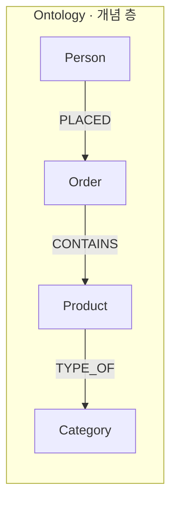
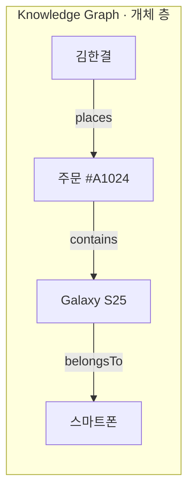
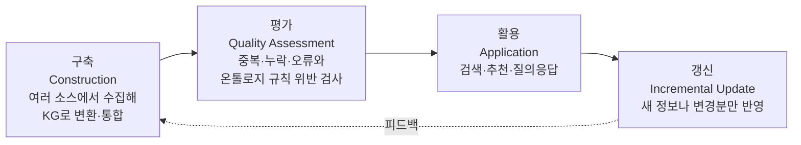
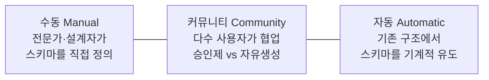
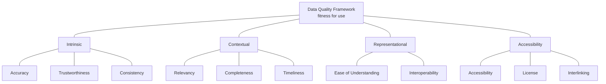
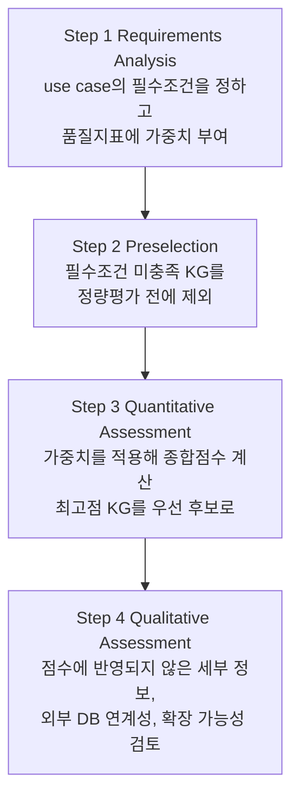
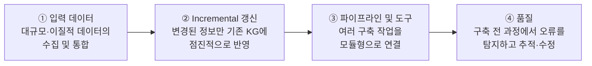
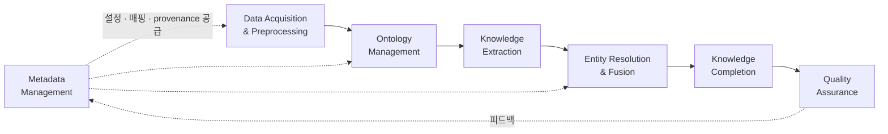
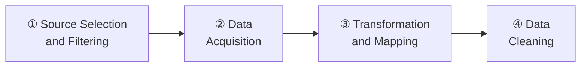
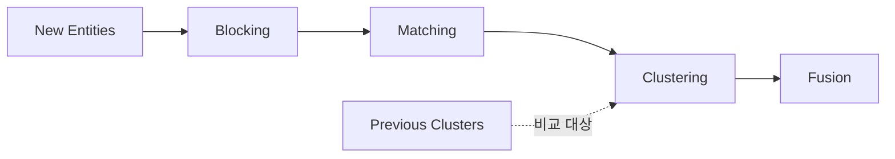

# S12 — KG 구축에서 온톨로지의 역할

> Ch.4 온톨로지↔KG · Day 6
> 원자료: DSBA Lab Study 강의 슬라이드 28장 (`1 Background` ~ `4 Conclusion`)
> 인용 논문
> · Färber, Ell, Menne, Rettinger, Bartscherer (2018), *Linked Data Quality of DBpedia, Freebase,
>   OpenCyc, Wikidata, and YAGO*, Semantic Web 9(1), 77–129
> · Hofer, Obraczka, Saeedi, Köpcke, Rahm (2024), *Construction of Knowledge Graphs: Current State
>   and Challenges*, Information 15(8), 509 ([arXiv:2302.11509](https://arxiv.org/abs/2302.11509))

[S11](S11-지식그래프-기초-개념.md)이 지식그래프가 무엇인지를 다뤘다면 이 회차는 온톨로지가
그 안에서 어떤 일을 하는지를 논문 두 편으로 파고든다. 앞 논문은 완성된 KG의 품질을 재고, 뒤
논문은 만드는 과정을 뜯어본다.

강의가 구분해주지 않은 것과 원논문 대조는 [부록 S12-1](S12-1-선언과-준수-사이.md)에 적었다.

---

## 1. Ontology와 Knowledge Graph

강의는 둘의 관계를 같은 문장 구조를 놓고 비교하며 시작한다.

| | 담는 것 | 예시 |
|---|---|---|
| Ontology | 데이터의 의미를 표현하는 설계도. 개념·관계·규칙을 명시적으로 정의 | Customer places Order · Order contains Product · Product belongsTo Category |
| Knowledge Graph | 온톨로지의 의미 구조를 바탕으로 구체적인 개체와 관계를 연결한 그래프 | 김한결 places 주문 #A1024 · 주문 #A1024 contains Galaxy S25 · Galaxy S25 belongsTo 스마트폰 |

말로 옮기면 온톨로지 쪽은 "고객은 주문을 생성하고, 주문은 상품을 포함하며, 상품은 카테고리에
속한다"가 되고, KG 쪽은 "김민수가 주문 #A1024를 생성했고 해당 주문에는 Galaxy S25가 포함되어
있다"가 된다. 같은 모양의 문장인데 하나는 개념 층위이고 하나는 개체 층위다.





## 2. Ontology의 필요성은 추론이다

강의가 온톨로지를 왜 두느냐에 대해 내놓는 답은 추론이다. 클래스와 관계에 정의된 규칙을 이용해
명시되지 않은 새로운 사실을 도출한다.

```
(Ontology)        Smartphone  is-a   Product
(Knowledge Graph) Galaxy S25  종류    Smartphone
─────────────────────────────────────────────
                  Galaxy S25  is-a   Product     ← 명시되지 않았지만 도출됨
```

강의는 이 관계를 한 문장으로 요약했다. Knowledge Graph가 데이터와 관계와 의미 구조라면,
Ontology는 거기에 의미와 추론 능력을 부여하는 레이어다.

## 3. Ontology의 세 가지 역할

강의는 온톨로지가 하는 일을 셋으로 나눈다.

| | 묻는 것 | 예시 |
|---|---|---|
| 스키마 (Schema) | 무엇을 어떻게 표현할 것인가. 클래스·속성·계층 구조 정의 | Smartphone is-a Product · Product hasBrand Brand |
| 제약 (Constraint) | 어떤 의미적 조건을 만족해야 하는가. 클래스 간 배타성, 속성값의 범위·개수 규칙 | Product와 Person은 서로 다른 클래스 · hasBrand의 대상은 Brand · serialNumber는 하나만 허용 |
| 추론 (Inference) | 명시되지 않은 무엇을 새로 도출할 수 있는가. 암묵적 타입·관계 유도 및 논리적 일관성 확인 | Galaxy S25 type Smartphone + Smartphone is-a Product ⇒ Galaxy S25 type Product |

이 세 축이 이 회차의 뼈대다. 앞으로 나올 두 논문이 각각 다른 각도에서 이것을 본다.

| 논문 | 보는 각도 |
|---|---|
| Färber et al. (2018) | 평가 관점. KG마다 세 측면이 어떻게 다르며 그 차이가 품질 특성에 어떻게 나타나는지 비교 |
| Hofer et al. (2024) | 구축 관점. 스키마를 학습·통합·진화시키고 제약과 추론으로 KG를 관리·확장하는 과정을 분석 |

> 두 번째 줄인 제약이 앞 회차에서 확인한 것과 어긋난다. OWL 공리는 위반을 막지 않는다.
> [부록 1절](S12-1-선언과-준수-사이.md#1-제약은-선언과-준수가-따로-논다)에 적었다.

## 4. KG Lifecycle과 Quality

강의는 KG를 한 번 만들고 끝나는 것이 아니라 되풀이되는 시스템으로 그린다.



평가에서 발견된 오류는 데이터와 온톨로지, 구축 파이프라인의 수정으로 이어지고, 활용 중 생긴 새
요구와 데이터 변화는 증분 갱신 후 다시 평가로 돌아간다.

두 논문이 이 그림의 서로 다른 구간을 맡는다.

| 구간 | 논문 |
|---|---|
| 구축 → 평가 | Färber et al. 완성된 KG의 품질 측정 |
| 활용 → 갱신 | Hofer et al. Construction·Incremental update 파이프라인 분석 |

---

# 첫 번째 논문 — 온톨로지 설계가 KG 품질에 어떻게 나타나는가

## 5. 문제 배경과 기여

DBpedia, Freebase, OpenCyc, Wikidata, YAGO가 연구와 산업에서 널리 쓰이는데도 심층 비교 연구가
없었다는 것이 출발점이다. KG마다 데이터 출처와 생성 방식, 온톨로지, 운영 방식이 다르므로 특정
연구나 서비스에 적합한지 판단하려면 품질을 여러 차원에서 비교해야 한다.

논문이 내놓은 것은 넷이다.

1. 기존 데이터 품질 문헌을 바탕으로 KG 분석용 데이터 품질 기준 34개 정의
2. 다섯 KG의 key statistics 산출
3. 34개 기준에 따른 정량 평가 수행
4. use case에 맞는 KG를 고르는 recommendation framework 제안

## 6. 분석 대상 다섯 KG

온톨로지를 누가 어떻게 만드느냐로 다섯이 갈린다.



| KG | 시작 | 온톨로지·스키마 구축 방식 | 지식 소스와 특징 |
|---|---|---|---|
| DBpedia | 2007 | 수동 설계. Wikipedia infobox에서 자주 쓰이는 항목을 뽑아 공통 클래스와 관계로 정리 | 영어 Wikipedia에서 자동 추출. 다른 Linked Data를 연결하는 중심 역할 |
| Freebase | 2007 | 커뮤니티 자유 생성. 사용자가 필요한 type과 property를 직접 추가하며 스키마를 만들어 감 | 커뮤니티 편집과 MusicBrainz 같은 외부 데이터의 대규모 import |
| OpenCyc | 1984 | 전문가 수동 구축. 논리학자와 전문가가 개념·관계·상식 규칙을 하나씩 직접 설계 | 현실 세계의 상식과 논리적 추론을 정교하게 표현하는 데 초점 |
| Wikidata | 2012 | 커뮤니티에 승인제 결합. 누구나 편집할 수 있지만 새 property는 제안과 논의를 거쳐 추가 | Wikimedia 사용자들이 편집하며 값뿐 아니라 출처와 세부 조건도 기록 |
| YAGO | 2007 | 자동 결합. Wikipedia 분류를 WordNet 개념 체계와 자동으로 연결해 계층 구조를 만듦 | Wikipedia, WordNet, GeoNames 결합 |

만드는 사람과 방식이 다르고, 그 차이가 품질에 어떻게 반영되는지가 이 논문의 질문이다.

## 7. Quality Framework

논문은 Category → Dimension → Criterion/Metric 계층으로 품질을 잰다.



각 기준에서 0과 1 사이의 metric 34개를 뽑고, 사용자 가중치를 실어 계산한다. 이런 틀이 필요한
이유로 강의가 든 것은 셋이다. KG를 비교할 공통 기준이 필요하고, KG 품질은 다차원적이며, 좋은
KG는 사용 목적에 따라 달라질 수 있다.

## 8. 품질 기준과 metric

11개 dimension에 metric이 이렇게 분배된다.

| Category | Dimension (metric 수) |
|---|---|
| Intrinsic | Accuracy (3) · Trustworthiness (3) · Consistency (3) |
| Contextual | Relevancy (1) · Completeness (3) · Timeliness (3) |
| Representational | Ease of Understanding (4) · Interoperability (4) |
| Accessibility | Accessibility (7) · License (1) · Interlinking (2) |

강의가 이 중 넷을 골라 설명했다.

| | 묻는 것 | 예시 |
|---|---|---|
| Consistency (일관성) | 온톨로지에 정의한 규칙과 실제 데이터가 서로 모순되지 않는가 | Product와 Person은 겹칠 수 없는 클래스, serialNumber는 제품마다 최대 하나 |
| Completeness (완전성) | 필요한 구조, 속성값, 엔티티가 충분히 들어 있는가 | 상품은 있는데 가격값이 누락된 상태, 브랜드 정보를 저장해야 하는데 이를 표현할 관계가 없는 경우 |
| Relevancy (관련성) | 여러 사실 중 어떤 것이 현재 목적에 더 중요한지 구분할 수 있는가 | 가격 정보를 검색할 때 과거 가격보다 현재 가격이 검색되어야 함 |
| Interoperability (상호운용성) | 다른 지식 그래프나 시스템에서도 같은 의미로 이해하고 재사용할 수 있는가 | |

## 9. Key Statistics — 스키마 규모와 사용률

| 구분 | DBpedia | Freebase | OpenCyc | Wikidata | YAGO |
|---|---|---|---|---|---|
| 클래스 수 | 736 | 53K | 116K | 302K | 570K |
| Relation 수 (스키마 정의) | 2.8K | 70.9K | 18K | 1,874 | 106 |
| Predicate 수 (실제 사용) | 60.2K | 785K | 165 | 4K | 88.7K |
| Entity 수 | 4.3M | 49.9M | 41K | 18.7M | 5.1M |

강의가 여기서 뽑은 것이 둘이다.

**클래스 수가 많다고 모두 쓰이는 것은 아니다.** YAGO는 약 57만 개 클래스 중 82.6%가 하나 이상의
instance를 가져 규모와 활용도가 모두 높다. 반면 Wikidata와 OpenCyc의 class coverage는 각각
5.4%와 6.5%에 그친다.

**대부분의 instance는 소수 클래스에 몰린다.** 모든 KG에서 클래스별 instance 수가 long-tail
분포를 보인다. 일부 핵심 클래스만 대규모로 쓰이고 나머지는 적은 수의 instance만 가진다.

> DBpedia의 Relation 수가 원논문 표와 다르다.
> [부록 5절](S12-1-선언과-준수-사이.md#5-원논문-대조)에 적었다.

## 10. Consistency

| | DB | FB | OC | WD | YA |
|---|---|---|---|---|---|
| m_checkRestr | 0 | 1 | 0 | 1 | 0 |
| m_conClass | 0.88 | 1 | <1 | 1 | 0.33 |
| m_conRelat | 0.99 | 0.45 | 1 | 0 | 0.99 |

세 metric이 재는 것이 다르다.

| | 묻는 것 |
|---|---|
| m_checkRestr | 입력 단계에서 데이터 타입 등 스키마 제약 위반을 사전에 검증하는가 |
| m_conClass | 이미 들어간 데이터의 클래스 조합이 `owl:disjointWith` 제약과 모순되지 않는가 |
| m_conRelat | 이미 들어간 관계값이 `rdfs:range`와 `owl:FunctionalProperty` 제약을 지키는가 |

강의가 각 줄에 붙인 해석이 이렇다.

Freebase와 Wikidata만 편집 UI에서 datatype과 허용값을 입력 시점에 검사한다. 다만 이는 입력 검증
기능이 존재한다는 뜻이지 전체 데이터의 논리적 일관성을 보장하지는 않는다.

Freebase와 Wikidata는 `owl:disjointWith` 제약을 거의 선언하지 않아 위반도 탐지되지 않는다.

Wikidata는 `rdfs:range`와 `owl:FunctionalProperty` 같은 관계 제약을 RDF/OWL 모델에 명시적으로
포함하지 않아 0이 나오지만, 편집 UI와 커뮤니티 규칙으로 데이터 품질을 관리한다.

강의가 이 절을 닫으며 한 말이 핵심이다. 높은 consistency 점수가 반드시 더 좋은 KG를 뜻하지
않으며, KG마다 품질을 관리하는 철학이 다르다.

> 이 세 줄이 앞 회차에서 확인한 문제를 수치로 보여준다.
> [부록 1절](S12-1-선언과-준수-사이.md#1-제약은-선언과-준수가-따로-논다)에 적었다.

## 11. Schema Completeness

| | DB | FB | OC | WD | YA |
|---|---|---|---|---|---|
| m_cSchema | 0.91 | 0.76 | 0.92 | 1 | 0.95 |
| m_cColumn | 0.40 | 0.43 | 0 | 0.29 | 0.33 |
| m_cPop | 0.93 | 0.94 | 0.48 | 0.99 | 0.89 |
| m_cPop (short) | 1 | 1 | 0.82 | 1 | 0.90 |
| m_cPop (long) | 0.86 | 0.88 | 0.14 | 0.98 | 0.88 |

| | 재는 것 |
|---|---|
| m_cSchema | Gold standard의 class·relation 중 해당 KG에 존재하는 비율 |
| m_cColumn | 각 class-relation 조합에서 해당 relation 값을 가진 instance 비율의 평균 |
| m_cPop | Gold standard entity 중 해당 KG에 존재하는 비율. short는 유명 entity, long은 덜 알려진 entity |

강의가 짚은 것이 셋이다.

**m_cSchema는 전반적으로 좋지만** 이는 온톨로지 전체의 절대적 우수성이 아니라 논문이 설정한
범용 gold standard를 얼마나 포함하는지를 뜻한다.

**m_cColumn은 모든 KG가 0.43 이하로 낮다.** relation이 스키마에 있더라도 동일 class의 모든
instance에 그 값이 고르게 존재하지는 않는다는 뜻이다. 낮은 점수는 스키마 부재보다 instance 층위
사실의 희소성과 불균형을 가리킬 수 있다.

**Entity 커버리지는 long-tail에서 갈린다.** 유명 entity는 대부분의 KG에서 높은 coverage를 보이지만
덜 알려진 entity에서는 KG 간 차이가 커진다. OpenCyc의 long이 0.14로 떨어지는 것이 그 예다.

그리고 entity completeness는 KG의 규모뿐 아니라 어떤 source를 선택하고 통합했는지에 따라
결정된다. 논문의 domain coverage 그림에서 Freebase는 media에, OpenCyc는 organizations와
geography에 치우쳐 있다.

강의의 정리는 이렇다. 스키마가 크다는 것이 아니라 실제로 필요한 개념이 빠짐없이 정의되어 있는지를
평가해야 하고, KG의 실질적 완전성은 스키마 규모보다 relation 값과 long-tail entity가 얼마나
채워져 있는지에 달렸다.

## 12. KG Recommendation Framework

논문이 제안한 선택 절차는 네 단계다.



| 종합 점수 (34개 metric) | DBpedia | Freebase | OpenCyc | Wikidata | YAGO |
|---|---|---|---|---|---|
| 비가중 평균 | 0.708 | 0.605 | 0.498 | 0.738 | 0.625 |
| 가중 평균 (use case 예시) | 0.718 | 0.575 | 0.516 | 0.742 | 0.646 |

4단계에 단서가 붙어 있다. 필요하면 정량평가 1위가 아닌 다른 KG 또는 여러 KG의 결합을 선택한다.
KG 선택은 전체 평균 순위가 아니라 use case별 필수조건과 품질 가중치, 외부 데이터 연계 가능성에
따라 달라진다.

## 13. KG별 품질 프로필

| | DB | FB | OC | WD | YAGO |
|---|---|---|---|---|---|
| Accuracy | 1.00 | 1.00 | 1.00 | 1.00 | 0.87 |
| Trustworthiness | 0.33 | 0.83 | 0.33 | 0.92 | 0.42 |
| Consistency | 0.62 | 0.82 | 0.67 | 0.67 | 0.44 |
| Relevancy | 0.00 | 0.00 | 0.00 | 1.00 | 0.00 |
| Completeness | 0.75 | 0.71 | 0.47 | 0.76 | 0.72 |
| Timeliness | 0.17 | 0.67 | 0.08 | 0.67 | 0.42 |
| Understanding | 0.93 | 0.87 | 0.50 | 0.75 | 1.00 |
| Interoperability | 0.69 | 0.15 | 0.48 | 0.42 | 0.41 |
| Accessibility | 0.93 | 0.49 | 0.57 | 0.77 | 0.82 |
| License | 1.00 | 0.00 | 0.00 | 1.00 | 0.00 |
| Interlinking | 0.76 | 0.49 | 0.67 | 0.48 | 0.63 |

강의가 KG별로 요약한 것이다.

| KG | 강점과 약점 |
|---|---|
| Wikidata | 대부분의 품질 차원에서 균형. 높은 trustworthiness·completeness·timeliness, statement ranking 지원 |
| DBpedia | accessibility·interlinking·interoperability에 강점. 공개 endpoint와 외부 KG 연계에 유리하나 최신성은 낮음 |
| YAGO | label·URI의 이해 가능성과 statement-level provenance에 강점. 관계 수가 적고 일반적이지만 세부 표현력은 제한 |
| OpenCyc | 전문가 중심 ontology와 높은 relation consistency. 실제 entity coverage와 업데이트·접근성은 제한적 |
| Freebase | 대규모 entity·relation coverage와 입력 단계 검증에 강점. 스키마가 분산돼 있고 서비스 종료로 timeliness·accessibility가 낮음 |

평가지표 사이에 trade-off가 있으므로 KG 선택은 use case에 따라야 한다는 것이 이 절의 결론이다.

> Relevancy 줄이 Wikidata만 1.00이고 나머지는 전부 0.00이다. metric이 하나뿐인 dimension이라
> 생기는 현상이고, 이런 항목을 평균에 그대로 넣는 것이 무엇을 뜻하는지는
> [부록 3절](S12-1-선언과-준수-사이.md#3-34개를-한-점수로-합치면)에 적었다.

---

# 두 번째 논문 — 구축 과정에서 온톨로지는 어떻게 움직이는가

## 14. 문제 배경과 기여

개별 KG 구축 기술은 발전했지만 증분 갱신과 구축 단계 간 연계는 여전히 부족하다는 것이 출발점이다.
KG는 다양한 서비스의 기반이고 원천 데이터는 계속 변하므로 지속적 갱신이 필요한데, 많은 기존
방식은 일회성 batch 구축을 가정한다. 데이터나 스키마가 바뀌면 여러 단계를 다시 실행해야 하고
도구 간 연결과 수작업이 병목이 된다.

논문이 내놓은 것은 셋이다.

1. KG 구축과 유지관리에 필요한 요구사항을 정리하고 기존 접근법을 평가하는 공통 기준으로 활용
2. 7개 핵심 구축 작업과 작업별 해결 방법을 체계화
3. KG 전용 파이프라인과 범용 툴셋을 비교해 기능적 한계와 향후 연구 과제 도출

## 15. 구축 요구사항 네 가지



| | 내용 |
|---|---|
| ① 입력 데이터 | 서로 다른 source schema를 KG ontology에 맞게 변환·매핑 |
| ② Incremental 갱신 | 전체 KG를 다시 구축하지 않고 영향받은 부분만 재처리 |
| ③ 파이프라인 및 도구 | 서로 다른 도구 사이의 입출력 형식과 identifier를 연결. 오류 처리, 성능 모니터링, 확장성 지원 |
| ④ 품질 | 정확성·일관성·완전성·최신성 측면. provenance를 이용해 오류 발생 지점을 역추적 |

개별 도구가 분리되어 있으면 ontology, mapping, entity 식별 결과와 metadata를 일관되게 재사용하기
어렵다. 이질적 데이터를 점진적으로 통합하면서 파이프라인 전반의 의미적 일관성과 품질을 함께
유지해야 한다는 것이 문제 설정이다.

## 16. Incremental Construction Pipeline

논문이 정리한 핵심 작업이 일곱이다.



모든 task가 고정된 순서로 한 번씩 실행되는 것은 아니다. 입력 데이터와 목적에 따라 생략되거나
반복되거나 비동기로 실행될 수 있다. 기존 KG와 설정·매핑·provenance를 재사용해 변경된 부분만
새로운 KG 버전에 반영한다.

이 회차의 제목에 해당하는 대목이 여기 있다. Ontology Management를 통해 관리된 온톨로지는
Preprocessing, Knowledge Extraction, Entity Resolution & Fusion, Completion, Quality Assurance가
공유하는 의미적 기준을 제공한다. 온톨로지가 한 단계에 들어가 있는 것이 아니라 여러 단계에
걸쳐 있다는 것이다.

## 17. Metadata Management

버전 관리 방식이 셋이고 각각 대가가 다르다.

| | 방식 | 얻는 것 | 잃는 것 |
|---|---|---|---|
| ① Independent Copies | 전체 스냅샷을 주기적으로 저장 | 명확하고 검사가 쉽다 | 저장 공간 부담 |
| ② Change-based (diff) | 버전 간 변경분만 저장 | 효율적 | 특정 버전 복원이 복잡 |
| ③ Timestamp-based | 요소별 시간 주석을 KG에 내장 | Temporal 쿼리 가능 | 관리가 복잡 |

Versioning은 KG의 특정 상태와 버전 간 변화를 식별하고, provenance와 temporal information은 fact의
원천과 시간적 변화를 추적한다. 증분 갱신 구축의 인프라를 마련하기 위한 것이다.

## 18. Data Acquisition & Preprocessing



| | 하는 일 |
|---|---|
| ① Source Selection and Filtering | KG 목적에 필요한 relevant source와 subset을 식별. premium source부터 시작해 long tail source로 확장 |
| ② Data Acquisition | 다양한 데이터 포맷 형태에 따른 접근 후 획득 |
| ③ Transformation and Mapping | 입력을 RDF 또는 property graph format으로 변환 |
| ④ Data Cleaning | 오류와 불일치를 KG에 추가하기 전에 탐지하고 제거 |

## 19. Ontology Management

온톨로지를 만들고 키우는 세 단계다.

| | 하는 일 | 방법 |
|---|---|---|
| ① Ontology Learning | 비정형·정형 데이터로부터 새로운 클래스, 관계, 분류체계를 발견하고 생성 | 언어학적 접근법, 머신러닝, LLM 기반 |
| ② Ontology/Schema Matching | 새로 들어온 source ontology와 기존 target ontology 사이에서 의미가 대응하는 클래스와 관계를 찾음 | 어휘 기반, 구조 기반, 인스턴스 기반, 임베딩·LLM 기반 |
| ③ Ontology Integration | Matching에서 얻은 alignment를 이용해 source ontology의 내용을 target ontology에 통합 | 아래 세 방식 |

통합 방식이 셋으로 갈린다.

| | 하는 일 |
|---|---|
| Simple | 두 ontology를 그대로 유지하면서 대응하는 클래스와 관계를 `equivalentClass`, `equivalentProperty` 등으로 연결 |
| Full | 서로 대응하는 요소들을 하나의 새로운 클래스나 관계로 완전히 통합 |
| Asymmetric | 기존 target ontology 구조는 유지하고 source ontology에만 있는 새 요소를 선택적으로 추가 |

## 20. Knowledge Extraction

비정형 텍스트에서 구조화된 지식을 뽑는다. 텍스트에서 entity mention을 탐지한 뒤 기존 KG의
entity에 연결하고 entity 사이의 relation을 추출한다.

| | 하는 일 |
|---|---|
| ① Named Entity Recognition | 사람·장소·조직·작품명 같은 entity 언급이 어디서 시작하고 끝나는지, 어떤 유형인지 식별 |
| ② Entity Linking | 탐지한 개체 언급을 KG에 이미 존재하는 entity와 연결. 같은 이름의 여러 entity 중 문맥에 맞는 대상을 골라야 하므로 중의성 해소가 필요 |
| ③ Relation Extraction | 텍스트에 나타난 entity 사이의 의미적 관계를 식별하고 KG에 저장할 수 있는 구조화된 statement로 변환 |

## 21. Entity Resolution & Fusion

하나 또는 여러 source의 entity 중 동일한 real-world object를 나타내는 것을 식별하는 과정이다.



| | 하는 일 | 예시 |
|---|---|---|
| ① Blocking | 전체 entity를 모두 비교하지 않고 동일 entity일 가능성이 있는 후보들만 먼저 묶음. 출생연도나 제조사 같은 attribute 기반 blocking key 사용 | Samsung 제품끼리 / Apple 제품끼리 |
| ② Linking/Matching | Blocking에서 생성된 candidate pair가 실제로 동일한지 유사도를 계산해 판단 | Galaxy S25 ↔ Samsung Galaxy S25 5G를 이름·제조사·모델번호로 비교 |
| ③ Clustering | Matching에서 연결된 여러 entity를 하나의 group으로 묶음 | Galaxy S25, Samsung Galaxy S25 5G, SM-S931 |
| ④ Incremental ER | 기존 KG에 새 entity가 들어올 때 Previous Clusters와 비교해 기존 cluster에 추가하거나 새 cluster 생성 | |

일반적인 batch ER이 고정된 dataset 전체를 대상으로 matching하는 것과 대비된다.

**Fusion**은 cluster 안의 entity를 하나의 ID로 만드는 것만이 아니라 여러 source에서 가져온 값을
어떤 방식으로 통합할지 결정하는 과정이다. 충돌이 두 종류로 나온다.

| | 예시 |
|---|---|
| Attribute name이 다른 경우 | Source A: `companyName = "Samsung Electronics"` / Source B: `company = "Samsung"` |
| Attribute value가 다른 경우 | Source A: `price = 1,200,000원` / Source B: `price = 1,150,000원` |

처리 방식도 셋이다.

| | 하는 일 |
|---|---|
| Conflict Ignorance | 충돌을 해결하지 않고 여러 값을 유지하여 최종 선택을 application에 맡김 |
| Conflict Avoidance | 모든 충돌에 하나의 일관된 기준을 적용 |
| Conflict Resolution | 모든 data와 metadata를 검토하여 적절한 값을 선택 |

## 22. Knowledge Completion

기존 KG의 relation을 활용해 새로운 node, relation, property를 추가하고 누락된 지식을 보완한다.

| | 하는 일 |
|---|---|
| Type completion | Type 정보가 없는 node에 적절한 class/type을 할당 |
| Link prediction | 두 entity 사이에 실제로 존재할 가능성이 높지만 KG에는 기록되지 않은 relation을 찾음 |
| Data Enrichment | 이미 KG에 있는 연구자의 ORCID나 논문의 DOI를 이용해 외부 데이터베이스에서 소속·출판물·연구 분야 등 추가 정보를 가져옴 |

## 23. 구축 시스템의 현황과 공백

**현재 상태.** Knowledge Extraction과 basic Ontology Management는 비교적 널리 지원된다. Entity
Resolution·Fusion과 Incremental Integration은 제한적이다. provenance·temporal metadata 지원도
일관되지 않고, 고기능 toolset은 closed-source인 경우가 많다.

**공백.** 현재 KG 구축 기술은 개별 task 수준에서는 발전했지만, ontology·metadata·entity
resolution·fusion·quality assurance를 통합하여 지속적으로 갱신할 수 있는 open end-to-end
pipeline은 여전히 부족하다.

논문의 비교표는 시스템별로 어떤 입력 데이터와 metadata를 쓰는지, 어떤 구축 작업을 수행하는지를
표시한다. 표기가 네 단계다.

| 기호 | 뜻 |
|---|---|
| ● | 다른 접근법과 비교해 automation, quality, flexibility 측면에서 상대적으로 강한 접근 |
| ○ | 단순하거나 수동적인 기본 지원 |
| ✓ | 해당 입력 데이터나 metadata를 지원·사용 |
| ? | 논문에서 언급은 되었지만 구현 방식이 불명확 |
| 빈칸 | 지원한다고 확인되지 않음 |

`?` 표기가 따로 있다는 점이 눈에 걸린다. 논문이 서술만 있고 구현을 확인할 수 없는 경우를 별도로
표시했다는 뜻이다.

> 비교 대상 개수가 원논문과 다르다.
> [부록 5절](S12-1-선언과-준수-사이.md#5-원논문-대조)에 적었다.

## 24. 정리

강의가 두 논문을 각각 두 줄로 닫았다.

**첫 번째 논문.** KG마다 class·relation의 설계와 활용 방식이 달라 서로 다른 quality profile을
보인다. 따라서 절대적 순위보다 use case에 필요한 metric을 기준으로 KG를 선택해야 한다.

**두 번째 논문.** Ontology Management는 Ontology Learning → Ontology/Schema Matching → Ontology
Integration을 통해 온톨로지를 지속적으로 확장·유지한다. 관리된 온톨로지는 Preprocessing, Knowledge
Extraction, Entity Resolution & Fusion, Knowledge Completion, Quality Assurance의 공통 의미 기준으로
활용된다. KG는 provenance와 versioning을 바탕으로 지속적으로 증분 갱신되어야 한다.

강의 전체의 마무리는 이 문장이다. Ontology는 무엇을 표현할지 정의하는 static schema를 넘어,
KG의 구축·통합·검증·갱신을 연결하며 지속적으로 갱신되어야 한다.

---

## 관련 문서

- [S11 — 지식그래프 기초 개념](S11-지식그래프-기초-개념.md) — 같은 Ch.4의 앞 회차
- [부록 S12-1 — 선언과 준수 사이](S12-1-선언과-준수-사이.md) — 원논문 대조와 앞 회차와의 연결
- [S11-1 — 온톨로지가 하지 않는 일](S11-1-온톨로지가-하지-않는-일.md) — 제약이 게이트가 아니라는 확인
- [S07-08-1 — 두 평가 틀의 빈칸](S07-08-1-두-평가-틀의-빈칸.md) — OQuaRE·CQ 평가와의 비교
