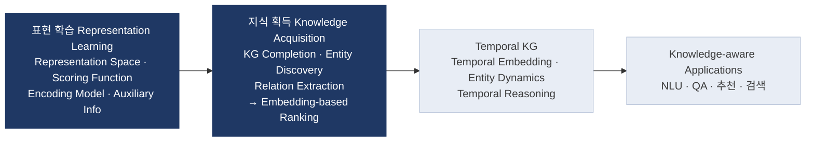
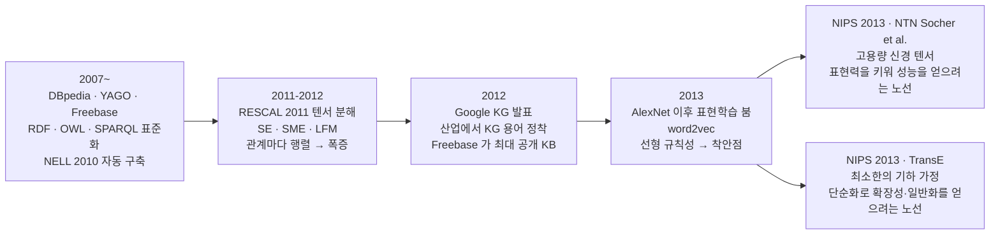
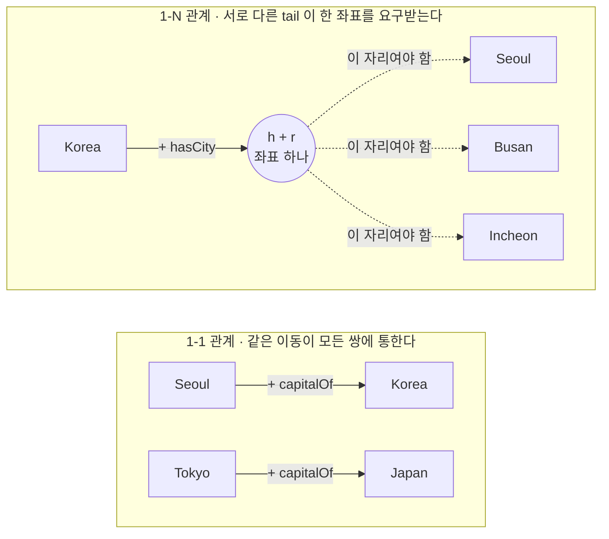
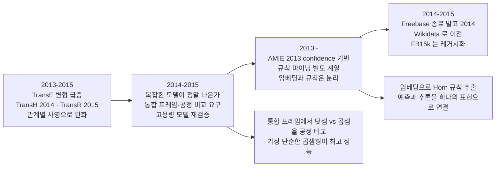
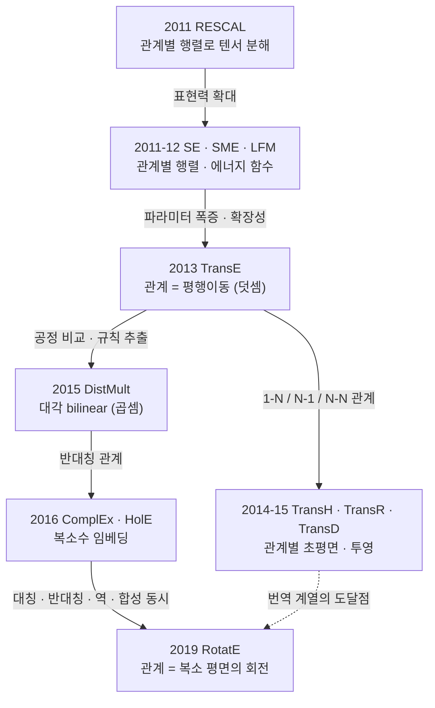

# S13 — KG 임베딩 기초 (TransE · DistMult)

> Ch.5 ML/DL · Day 7
> 원자료: DSBA Lab Study 강의 슬라이드 30장 (`1 Background` ~ `4 Conclusion`)
> 인용 논문
> · Bordes, Usunier, Garcia-Durán, Weston, Yakhnenko (2013), *Translating Embeddings for
>   Modeling Multi-relational Data*, NeurIPS 26
> · Yang, Yih, He, Gao, Deng (2015), *Embedding Entities and Relations for Learning and
>   Inference in Knowledge Bases*, ICLR ([arXiv:1412.6575](https://arxiv.org/abs/1412.6575))

S12까지는 사람이 클래스와 공리를 쓰고 추론기가 연역하는 심볼릭 계열이었다. 이 회차부터
방향이 바뀐다. 데이터에서 벡터를 학습해 명시되지 않은 사실에 점수를 매긴다.

두 논문은 2년 차이인데 서로 반대 계열이다. TransE는 관계를 덧셈으로 보고 DistMult는 곱셈으로
본다. 강의는 이 둘을 성능 경쟁이 아니라 설계 가정의 대비로 읽으라고 반복해서 말한다.

강의가 전제하고 넘어간 것, 두 논문의 수치가 서로 안 맞는 지점, 벤치마크 자체의 문제는
[부록 S13-1](S13-1-기호와-좌표-사이.md)에 적었다.

---

## 1. 온톨로지와 KG 다시 확인

슬라이드는 [S11](S11-지식그래프-기초-개념.md)·[S12](S12-KG-구축에서-온톨로지의-역할.md)에서
쓴 것과 같은 예시로 시작한다. 온톨로지는 `Customer places Order`처럼 개념 층위를 정의하고,
KG는 `김한결 places 주문 #A1024`처럼 개체 층위를 연결한다. 내용은 S12 1절과 같아 다시 적지
않는다.

이 회차에서 이 recap이 하는 일은 하나다. 지금부터 다룰 대상이 개체 층위의 triple이라는
사실을 확인하는 것. 임베딩이 학습하는 것은 클래스나 공리가 아니라 개별 엔티티와 관계다.

## 2. 기호적 접근과 임베딩 접근

강의는 두 접근을 나란히 놓고 이 회차의 문제 설정을 잡는다.

**기호적 접근 (Symbolic).** 온톨로지 규칙과 논리로 명시되지 않은 사실을 연역한다. 정확하고
해석 가능하다. 그러나 정해진 규칙이 없는 사실은 도출할 수 없고, KG는 본질적으로 불완전하다.
참이지만 기록되지 않은 triple이 다수 존재한다.

**임베딩 접근 (Semantic).** entity와 relation을 ℝᵏ 벡터로 표현하고 점수함수 `f(h,r,t)`로
타당성을 계산한다. 미관측 triple도 점수로 순위화할 수 있어 누락 사실을 예측하고, 대규모 KG로
확장하기 쉽다. 유사한 엔티티와 관계는 벡터 공간에서 자연히 군집한다.

착안의 출처는 단어 임베딩이다. 슬라이드가 인용한 Mikolov et al.(NAACL 2013)의 그림에서
`MAN → WOMAN`과 `UNCLE → AUNT`, `KING → QUEEN`이 같은 방향의 이동으로 나타난다. 단수에서
복수로 가는 `KING → KINGS`, `QUEEN → QUEENS`도 마찬가지다. 관계가 벡터의 이동으로 드러나는
이 현상이 뒤에 나올 TransE의 출발점이 된다.

## 3. KG 연구 지도에서 임베딩의 자리

S11에서 정리한 Ji et al.(2022)의 네 축 위에 이 회차의 위치를 표시한다. 앞의 둘을 담당한다.



표현 학습 쪽에서는 거리 기반의 TransE와 semantic matching(bilinear) 기반의 DistMult를 다루고,
지식 획득 쪽에서는 KG Completion을 임베딩 기반 순위화로 푼다. 두 논문 모두 이 두 축에 걸쳐
있다.

## 4. 공통 실험 프레임 — Link Prediction

두 논문이 같은 태스크로 평가되기 때문에 먼저 태스크를 정의한다.

**태스크.** 각 triple에 점수 `f(h,r,t)`를 부여하고, `(h,r,?)` 또는 `(?,r,t)`로 한쪽을 가려
후보의 순위를 계산한다.

**학습 — Negative Sampling.** KG에는 참인 triple만 있어 오답이 없다. 정답 triple의 h 또는 t를
임의 엔티티로 손상해 오답을 만들고, 정답을 더 높게 점수화하도록 학습한다.

**평가 지표.** Mean Rank는 낮을수록 좋고 Hits@10은 높을수록 좋다. Filtered 설정은 학습·검증·평가
집합에 이미 존재하는 참 triple을 순위에서 제외한다. 가린 자리에 들어갈 다른 정답이 정답보다
위에 있으면 부당하게 순위가 밀리기 때문이다.

**표준 벤치마크.**

| | 엔티티 | 관계 | 성격 |
|---|---|---|---|
| WN18 | 40,943 | 18 | 계층·어휘 관계가 다수 |
| FB15k | 14,951 | 1,345 | 일반 상식 사실 |

관계 수가 두 자리와 네 자리로 크게 갈린다. 뒤에서 파라미터 수를 볼 때 이 차이가 그대로 드러난다.

태스크와 학습 방식, 지표가 공통이므로 모델 사이의 차이는 한 곳으로 모인다. 점수함수 `f(h,r,t)`의
설계다.

## 5. 임베딩 모델의 세 가지 축

강의는 모델을 읽는 틀로 셋을 제시한다.

| | 묻는 것 | TransE / DistMult |
|---|---|---|
| ① 표현 (Representation) | 어떤 공간으로 전이하는가 | 둘 다 실수 벡터 공간 ℝᵏ |
| ② 점수 함수 (Scoring) | 타당성을 어떤 연산으로 계산하는가 | 덧셈(거리) vs 곱셈(bilinear) |
| ③ 귀납 편향 (Inductive Bias) | 어떤 관계 성질을 표현하는가 | 대칭 · 반대칭 · N항 관계 |

TransE는 덧셈(Translational), DistMult는 곱셈(Semantic Matching)이고 이후 모델들의 두 원형이
된다. 강의가 강조하는 문장은 이것이다. 표현 공간이 같아도 점수함수의 연산이 다르면 표현할 수
있는 관계가 달라진다. 따라서 두 논문의 비교는 성능 수치가 아니라 설계 가정의 비교로 읽어야 한다.

## 6. 2013년의 연구 지형

강의는 TransE를 논문 자체로 들어가기 전에 그 해의 상황부터 그린다.



2013년의 질문은 지식을 어떻게 표현할 것인가였고, 무게중심이 논리·규칙에서 학습된 벡터로
옮겨간다. 흥미로운 것은 같은 학회에서 정반대 노선인 NTN과 TransE가 동시에 제시됐다는 점이다.
승패는 이후의 평가로 갈렸다. TransE는 당시 유행한 복잡한 모델 흐름과 반대 방향으로 간 연구다.

## 7. TransE — Motivation

슬라이드의 물음은 "왜 관계를 벡터의 덧셈으로 보아야 하는가"다.

**문제.** 지식베이스는 근본적으로 불완전하다. Freebase와 WordNet은 규모가 커도 참인 사실의
상당 부분이 누락되어 있어 자동 보완이 필요하다.

**기존 접근의 한계.** RESCAL·SE·SME·LFM은 관계당 k×k 행렬을 학습한다. 파라미터가 관계 수에
비례해 폭증한다. FB15k는 관계가 1,345개라 과적합과 대규모 학습의 어려움이 동시에 발생한다.
표현력이 더 큰 모델이 오히려 성능이 낮은 현상도 나타났다. RESCAL의 FB15k Hits@10이 44.1%다.

**착안점.** 단어 임베딩에서 관계가 일정한 이동으로 나타나는 현상을 가져온다. 계층 관계인
트리도 "자식 + 공통 이동 = 부모" 형태로 표현할 수 있다.

관계를 벡터 하나로 표현할 수 있다면 파라미터 수가 O(n²)에서 O(n)으로 내려간다.

## 8. TransE — 모델 정의

```
f(h, r, t) = − ‖ h + r − t ‖        (h, r, t ∈ ℝᵏ)
```

**표현.** 엔티티와 관계를 같은 ℝᵏ 공간의 벡터로 둔다. 관계를 행렬이 아니라 이동으로 본다.

**가정.** 참인 triple이면 `h + r ≈ t`가 되도록, 거짓이면 멀어지도록 학습한다.

```
Seoul  + capitalOf  ≈  Korea          같은 관계는 같은 이동
Sydney + capitalOf  ≠  Australia      다른 관계는 멀게
cat    + hypernym   ≈  mammal         계층 관계도 동일한 이동으로
```

**거리와 제약.** d는 L1 또는 L2 거리이며, 매 스텝 엔티티 벡터를 `‖e‖ = 1`로 정규화한다.
정규화가 없으면 벡터를 무한히 키워 손실을 낮추는 자명해로 붕괴한다. 관계 벡터는 정규화하지
않는다.

**파라미터 수.** `|E|·k + |R|·k`. 관계당 k개이며 RESCAL은 관계당 k²개다.

## 9. TransE — 학습

```
L = Σ           Σ            [ γ + d(h + r, t) − d(h' + r, t') ]₊
   (h,r,t)∈S  (h',r,t')∈S'
```

**Negative Sampling.** 정답의 head 또는 tail 중 하나만 임의 엔티티로 교체한다. 둘을 동시에
바꾸지 않는다.

```
(Canberra, capitalOf, Australia)
   → (Sydney,   capitalOf, Australia)     head 교체
   → (Canberra, capitalOf, Austria)       tail 교체
```

**Margin Ranking Loss.** 정답의 거리가 오답보다 최소 γ만큼 작아지도록 hinge loss를 최적화한다.
절대 점수가 아니라 상대 순위만 학습한다. 이미 margin을 만족한 쌍은 기울기가 0이 되어 아직
틀리는 예제에 학습이 집중된다.

**최적화 절차.**


하이퍼파라미터는 검증셋으로 고른다. k ∈ {20, 50}, margin γ, d ∈ {L1, L2}, 최대 1,000 epoch.

## 10. TransE — 실험 설정

원논문 Table 1과 Table 2다.

**Table 1. 파라미터 수와 FB15k에서의 값 (단위 백만)**

| Method | Nb. of parameters | on FB15k |
|---|---|---|
| Unstructured | O(nₑk) | 0.75 |
| RESCAL | O(nₑk + n_r k²) | 87.80 |
| SE | O(nₑk + 2n_r k²) | 7.47 |
| SME (linear) | O(nₑk + n_r k + 4k²) | 0.82 |
| SME (bilinear) | O(nₑk + n_r k + 2k³) | 1.06 |
| LFM | O(nₑk + n_r k + 10k²) | 0.84 |
| TransE | O(nₑk + n_r k) | 0.81 |

**Table 2. 데이터셋 통계**

| Data set | WN | FB15k | FB1M |
|---|---|---|---|
| Entities | 40,943 | 14,951 | 1×10⁶ |
| Relationships | 18 | 1,345 | 23,382 |
| Train. ex. | 141,442 | 483,142 | 17.5×10⁶ |
| Valid ex. | 5,000 | 50,000 | 50,000 |
| Test ex. | 5,000 | 59,071 | 177,404 |

**평가 프로토콜.** 테스트 triple의 한쪽 엔티티를 가리고 전체 엔티티로 치환해 정답의 순위를
계산한다. Mean Rank와 Hits@10을 쓰고, Raw는 다른 참 triple도 순위에 포함하고 Filtered는 알려진
참 triple을 제외한다. 비교 대상은 Unstructured, RESCAL, SE, SME(linear/bilinear), LFM이다.

RESCAL의 87.80M과 TransE의 0.81M 사이가 100배 넘게 벌어진다. 관계당 k²를 두는 것과 k를 두는
것의 차이가 FB15k처럼 관계가 1,345개인 데이터셋에서 이렇게 나타난다.

## 11. TransE — 링크 예측 결과

원논문 Table 3이다. Raw와 Filtered를 나눠 적었다.

| Method | WN MR raw | WN MR filt | WN H@10 raw | WN H@10 filt | FB15k MR raw | FB15k MR filt | FB15k H@10 raw | FB15k H@10 filt | FB1M MR raw | FB1M H@10 raw |
|---|---|---|---|---|---|---|---|---|---|---|
| Unstructured | 315 | 304 | 35.3 | 38.2 | 1,074 | 979 | 4.5 | 6.3 | 15,139 | 2.9 |
| RESCAL | 1,180 | 1,163 | 37.2 | 52.8 | 828 | 683 | 28.4 | 44.1 | - | - |
| SE | 1,011 | 985 | 68.5 | 80.5 | 273 | 162 | 28.8 | 39.8 | 22,044 | 17.5 |
| SME (linear) | 545 | 533 | 65.1 | 74.1 | 274 | 154 | 30.7 | 40.8 | - | - |
| SME (bilinear) | 526 | 509 | 54.7 | 61.3 | 284 | 158 | 31.3 | 41.3 | - | - |
| LFM | 469 | 456 | 71.4 | 81.6 | 283 | 164 | 26.0 | 33.1 | - | - |
| TransE | 263 | 251 | 75.4 | 89.2 | 243 | 125 | 34.9 | 47.1 | 14,615 | 34.0 |

세 데이터셋 모두에서 가장 좋았다. filtered 기준 WN18 Hits@10 89.2%, FB15k 47.1%다. 관계당
파라미터가 가장 적은 모델이 가장 좋았다는 결과라, 강의는 여기서 복잡도보다 맞는 귀납 편향이
중요하다는 문장을 뽑는다.

## 12. TransE — 관계 유형별 분석

원논문 Table 4다. 관계를 1-1, 1-N, N-1, N-N으로 나눠 Hits@10을 다시 쟀다.

| Method | head 1-to-1 | head 1-to-M | head M-to-1 | head M-to-M | tail 1-to-1 | tail 1-to-M | tail M-to-1 | tail M-to-M |
|---|---|---|---|---|---|---|---|---|
| Unstructured | 34.5 | 2.5 | 6.1 | 6.6 | 34.3 | 4.2 | 1.9 | 6.6 |
| SE | 35.6 | 62.6 | 17.2 | 37.5 | 34.9 | 14.6 | 68.3 | 41.3 |
| SME (linear) | 35.1 | 53.7 | 19.0 | 40.3 | 32.7 | 14.9 | 61.6 | 43.3 |
| SME (bilinear) | 30.9 | 69.6 | 19.9 | 38.6 | 28.2 | 13.1 | 76.0 | 41.8 |
| TransE | 43.7 | 65.7 | 18.2 | 47.2 | 43.7 | 19.7 | 66.7 | 50.0 |

가려진 쪽이 여럿(N)인 경우 성능이 급락한다. N-1 관계의 head 예측이 18.2%, 1-N 관계의 tail
예측이 19.7%인데, 반대 방향은 각각 66.7%와 65.7%다. `(?, directedBy, 봉준호)`처럼 감독 한 명에
영화 여러 편이 대응하는 방향이 어렵다.

이유는 번역 가정의 구조적 결과다. 1-N에서 모든 tᵢ가 `h + r`을 만족해야 하므로 서로 다른 tail이
한 점으로 수렴한다. 성능 저하가 학습 부족이 아니라 모델 가정에서 비롯된다.



왼쪽은 쌍마다 tail이 하나씩이라 같은 이동이 모두에 통한다. 오른쪽은 `h + r`이 값 하나인데
tail이 셋이라 세 도시가 같은 자리로 당겨진다.

번역 가정은 1-1 관계에 최적화되어 있고, 복잡 관계는 구조적 약점이 된다.

## 13. TransE — 결론과 한계

강의는 셋으로 나눠 닫는다.

| | 내용 |
|---|---|
| Conclusion | 관계는 벡터 공간의 평행이동. 최소 파라미터로 SOTA. 엔티티·관계당 벡터 1개. WN18 89.2 · FB15k 47.1. FB1M 규모까지 학습 가능 |
| Limitation | 가정이 못 담는 관계가 있고 성능 저하가 구조적. 대칭은 r ≈ 0으로 붕괴 · 1-N과 N-1은 한 점 수렴 · N쪽 예측 약 18~20% |
| 이후 전개 | 관계별 사영으로 가정을 완화하는 번역 계열의 확장. TransH · TransR · TransD가 관계별 초평면과 투영을 도입해 복잡 관계를 분리 |

대칭 관계에서 `r ≈ 0`으로 붕괴하는 이유는 식을 그대로 따라가면 나온다. r이 대칭이면
`h + r ≈ t`와 `t + r ≈ h`가 동시에 성립해야 하고, 두 식을 더하면 `2r ≈ 0`이 된다. r이 0에
가까워지면 그 관계로 이어진 두 엔티티가 같은 자리에 놓인다.

기여의 본질은 수치가 아니라 단순한 기하 가정과 대규모 학습이라는 설계 원칙이다. 한계가
명확하게 규정되었기 때문에 후속 연구의 문제 정의가 바로 도출되었다.

온톨로지 관점의 함의도 붙는다. 표현하려는 관계에 대칭·역·N항 성질이 많다면 번역 계열만으로는
부족하다.

## 14. 2015년의 연구 지형

DistMult도 같은 방식으로 그 해의 상황부터 놓는다.



2015년의 질문은 무엇이 실제로 성능을 만드는가였다. 새 모델 제안보다 비교와 검증이 쟁점이 된다.
벤치마크 자체에 대한 문제 제기도 이때 시작된다. Toutanova & Chen(2015)의 FB15k-237은 역관계
누출로 FB15k와 WN18의 점수가 과대평가될 수 있다고 지적한다.

## 15. DistMult — Motivation

슬라이드의 물음이 둘이다. 어떤 scoring function이 실제로 좋은가, 그리고 임베딩 모델로 추론을
할 수 있는가.

**문제 1 — 공정한 비교의 부재.** NTN·TransE·RESCAL이 서로 다른 표기로 제안되어 무엇이 성능을
만드는지 불분명하다. 복잡한 모델인 NTN이 실제로 더 좋은지 검증되지 않았다.

**문제 2 — 임베딩은 예측만 하고 추론은 못한다.** 링크 예측 점수는 얻지만 사람이 읽을 수 있는
논리 규칙은 얻지 못한다. 그래서 Rule Extraction 평가를 새로 제안한다.

**접근.** 엔티티는 벡터, 관계는 bilinear 또는 linear 사상으로 보는 통합 프레임을 제시해 기존
모델을 특수 사례로 정리한다. 그리고 학습된 관계 임베딩으로 Horn 규칙을 추출한다.

## 16. DistMult — 통합 프레임

다섯 모델을 복잡도 순으로 한 프레임에 정리한다.

| 모델 (복잡도 순) | 점수 함수 f | 관계당 파라미터 |
|---|---|---|
| NTN | u_rᵗ f(hᵀ M_r t + M_r1 h + M_r2 t + b_r) | 가장 많음 (텐서 slice) |
| Bi-linear + Linear | hᵀ M_r t + 선형항 | O(k²) |
| TransE ( = DistAdd ) | − ‖ h + r − t ‖ (덧셈 합성) | O(k) |
| Bilinear | hᵀ M_r t | O(k²) |
| Bi-linear-diag ( = DistMult ) | hᵀ diag(r) t = Σᵢ hᵢ rᵢ tᵢ (곱셈 합성) | O(k) |

NTN이 가장 복잡하고 Bi-linear-diag가 가장 단순하다. 핵심 설계는 덧셈 합성(TransE = DistAdd)과
곱셈 합성(DistMult)을 동일 조건에서 비교하는 것이다. DistMult는 Bilinear의 관계 행렬을 대각
성분만 남기도록 제약한 특수 사례라 파라미터가 k²에서 k로 내려간다.

대각 제약으로 TransE 수준의 파라미터에서 곱셈 상호작용을 얻는다.

> 이 프레임에서 TransE가 DistAdd라는 다른 이름으로 불린다. 같은 모델인데 논문마다 표기가
> 달라지는 지점이라 [부록 5절](S13-1-기호와-좌표-사이.md#5-충돌하는-지점)에 따로 적었다.

## 17. DistMult — 학습과 엔티티 표현

슬라이드의 제목은 "점수함수만이 아니라 최적화와 초기화가 결과를 바꾼다"다.

**목적함수.** 정답이 손상 triple보다 높은 점수를 갖도록 하는 margin 기반 ranking loss다.
negative sampling을 쓴다. 여기까지는 TransE와 같다.

**최적화 설정.** AdaGrad, 초기 학습률 0.1, weight decay 0.0001. epoch은 FB15k와 FB15k-401이
100, WN이 300이다.

여기서 논문이 짚는 것이 있다. 같은 TransE도 AdaGrad로 학습하면 FB15k Hits@10이 47.1%에서
53.9%로, WN이 89.2%에서 90.9%로 오른다. 모델을 바꾸지 않고 옵티마이저만 바꾼 결과다.

**엔티티 표현의 설계.** 선형 사영과 비선형(tanh) 사영을 비교했고 비선형이 유리했다. 사전학습된
엔티티 벡터로 초기화(EV-init)하면 성능이 크게 향상된다. 반대로 단어 벡터 초기화(WV-init)는
성능이 떨어지는데, Freebase 엔티티는 고유명사가 많아 단어 합성으로 표현되지 않기 때문이다.

비교 실험의 교훈이 여기서 나온다. 최적화와 초기화를 통제하지 않으면 모델 비교가 왜곡된다.

## 18. DistMult — 임베딩에서 규칙 추출

이 논문의 두 번째 기여다. 슬라이드의 제목은 "관계의 합성 = 관계 임베딩의 곱"이다.

**아이디어.** 규칙 body의 관계들을 합성한 임베딩이 head 관계의 임베딩과 가까우면 그 규칙이
성립할 개연성이 높다. Bilinear에서는 행렬 곱으로, DistMult(대각)에서는 원소별 곱으로 합성이
계산된다.

**절차.** 길이 2~3의 관계 경로를 후보로 만들고, 합성 임베딩과 목표 관계의 유사도로 점수화해
정렬한다.

```
BornInCity ∘ CityInCountry  ≈  Nationality
  ⇒  BornInCity(a,b) ∧ CityInCountry(b,c) ⇒ Nationality(a,c)
```

**결과.** confidence 기반의 기존 규칙 마이닝보다 우수한 Horn 규칙을 발굴했다. 관계 임베딩이
의미적으로 군집하는 것도 관찰됐다. `/film/release_region`이 `/film/country`와 가깝게 배치된다.
이 군집 구조는 곱셈형인 DistMult에서 뚜렷했고 덧셈형인 DistAdd에서는 흐릿했다.

학습된 임베딩에서 심볼릭 규칙을 되돌려 받는 구조이고, 강의는 이 지점이 온톨로지 학습과 직접
연결된다고 본다.

## 19. DistMult — 실험 결과

| 모델 | FB15k MRR | FB15k Hits@10 | FB15k-401 Hits@10 |
|---|---|---|---|
| NTN | 0.25 | 41.4 % | 40.5 % |
| Bilinear + Linear | 0.30 | 49.0 % | 49.4 % |
| TransE ( DistAdd ) | 0.32 | 53.9 % | 54.7 % |
| Bilinear | 0.31 | 51.9 % | 52.2 % |
| DistMult ( Bilinear-diag ) | 0.35 | 57.7 % | 58.5 % |

Freebase 계열에서 모델이 단순해질수록 성능이 좋아지는 경향이 나타난다. 가장 복잡한 NTN이 가장
낮아 과적합을 시사하고, 가장 단순한 DistMult가 가장 높다. 여기에 사전학습 엔티티 벡터와 tanh를
결합하면 FB15k-401에서 Hits@10이 73.2%까지 오른다. 같은 조건의 TransE는 54.7%다.

복잡도가 아니라 합성 연산의 종류와 학습 설정이 성능을 만든다.

## 20. DistMult — 결론과 한계

| | 내용 |
|---|---|
| Conclusion | 곱셈형에 대각 제약을 건 것이 최선. 예측과 추론을 함께 한다. hᵀ diag(r) t · FB15k 57.7 · WN 94.2 · 규칙 추출까지 확장 |
| Limitation | 점수함수가 구조적으로 대칭이다. Σhᵢrᵢtᵢ = Σtᵢrᵢhᵢ 이므로 반대칭 관계를 표현할 수 없고, 규칙도 합성형 Horn에 한정된다 |
| 이후 전개 | 대칭과 반대칭을 함께 담기 위한 복소수·회전 임베딩. ComplEx · RotatE |

점수함수의 대수적 대칭성이 곧 표현의 한계가 된다. TransE와 정확히 반대쪽의 사각지대다. TransE는
대칭 관계에서 무너지고 DistMult는 반대칭 관계를 아예 표현하지 못한다.

규칙 추출도 관계 합성형 Horn 규칙에 한정되며 부정이나 수치 조건은 다루지 못한다.

그럼에도 임베딩과 심볼릭 사이의 왕복 가능성을 보인 초기 사례다. 학습 결과가 스키마·규칙 발견으로
되돌아가는 구조는 온톨로지 학습과 직접 맞닿는다.

## 21. 모델 계보와 벤치마크 재평가

강의는 두 논문을 계보 위에 올려 마무리한다. 각 모델이 겨냥한 것은 직전 모델의 한계다.



RESCAL이 다관계 학습의 출발점이고, SE·SME·LFM이 표현력을 키우는 방향으로 갔다가 파라미터
과다에 부딪힌다. TransE가 그 지점을 겨냥했고, TransE의 복잡 관계 약점을 TransH 계열이, TransE의
비교 신뢰성과 추론 부재를 DistMult가 겨냥했다. DistMult의 대칭 강제는 ComplEx가, 남은 성질들은
RotatE가 가져간다.

**벤치마크 재평가.** 두 논문이 사용한 FB15k와 WN18에는 역관계 누출이 있었다. 학습 집합에
`(a, r, b)`가 있고 평가 집합에 `(b, r⁻¹, a)`가 있으면 모델이 역관계만 외워도 맞힐 수 있다.
FB15k-237(2015)과 WN18RR(2018)이 이를 제거한 표준으로 대체했고, 당시 수치는 절대값이 아니라
상대 비교로 읽어야 한다.

각주에 인용된 문헌은 Toutanova & Chen(2015) FB15k-237, Dettmers et al.(2018) WN18RR,
Kadlec et al.(2017) Baselines Strike Back이다.

모델 계보와 벤치마크 신뢰도를 함께 보아야 두 논문의 기여가 정확히 읽힌다.

## 22. TransE와 DistMult 비교

| 항목 | TransE (2013) | DistMult (2015) |
|---|---|---|
| 계열 | Translational · 덧셈 · 거리 | Semantic Matching · 곱셈 · bilinear |
| 점수 함수 | − ‖ h + r − t ‖ | Σᵢ hᵢ rᵢ tᵢ = hᵀ diag(r) t |
| 관계당 파라미터 | 벡터 1개 (k) | 벡터 1개 (k) |
| 학습 · 최적화 | margin ranking + SGD | margin ranking + AdaGrad |
| 대칭 / 반대칭 | 대칭 불가 (r → 0) / 반대칭 가능 | 대칭 강제 / 반대칭 불가 |
| 복잡 관계 (1-N 등) | 약함 (한 점으로 수렴) | 상대적으로 우수 |
| 추가 기여 | 대규모 확장성 입증 | 임베딩에서 규칙 추출 (추론) |
| Hits@10 | WN18 89.2 · FB15k 47.1 | WN 94.2 · FB15k 57.7 |

관계당 파라미터가 똑같이 벡터 1개인데 표현할 수 있는 관계가 갈린다. 차이를 만드는 것은 용량이
아니라 연산의 대수적 성질이다.

두 모델은 서로의 사각지대를 드러내며 후속 모델인 ComplEx와 RotatE를 낳았다.

## 23. 온톨로지 학습 관점의 위상

강의의 마지막 슬라이드다. 제목은 "표현(Representation)과 완성(Completion)을 잇는 두 원형"이다.

**위상.** Ji(2022) 지도에서 Representation Learning(점수함수·인코딩)과 KG Completion을 동시에
담당한다. 심볼릭 온톨로지 추론에서 학습된 sub-symbolic 표현으로 넘어가는 전환점이다.

**배울 점.**

- 귀납 편향이 표현 가능한 관계 성질(대칭·반대칭·N항)을 결정한다. 모델 선택의 실질적 기준이 된다
- 단순한 모델이 강한 baseline이며, 최적화와 초기화를 통제해야 비교가 성립한다
- 임베딩과 심볼릭 규칙의 상호 복원(DistMult)은 온톨로지 학습과 상보적이다

**다음 단계.** ComplEx는 복소수로 반대칭을, RotatE는 회전으로 대칭·반대칭·역·합성을 함께
담는다.

강의 전체의 마무리 문장은 이것이다. 무엇을 표현할 수 없는가가 다음 모델의 설계도가 된다.

---

## 관련 문서

- [부록 S13-1 — 기호와 좌표 사이](S13-1-기호와-좌표-사이.md) — 강의가 전제한 것, 두 논문이 갈리는 지점, 제조 KG 적용
- [S11 — 지식그래프 기초 개념](S11-지식그래프-기초-개념.md) — Ji et al.의 연구 네 축 원문
- [S11-1 — 온톨로지가 하지 않는 일](S11-1-온톨로지가-하지-않는-일.md) — 추론과 링크 예측의 구분
- [S12 — KG 구축에서 온톨로지의 역할](S12-KG-구축에서-온톨로지의-역할.md) — 직전 회차. 심볼릭 계열의 마지막
- [00 — 전체 파이프라인](00-전체-파이프라인.md) — 임베딩 계열이 파이프라인 옆에 붙는 별도 트랙인 이유
