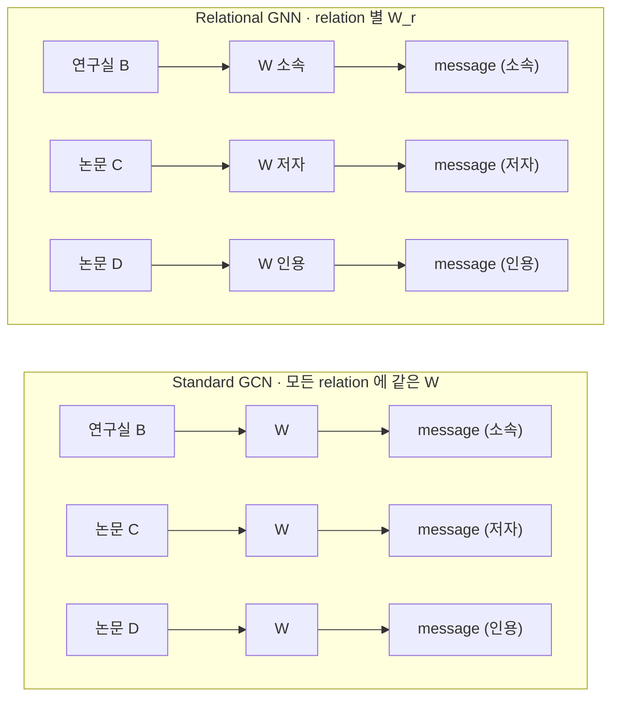
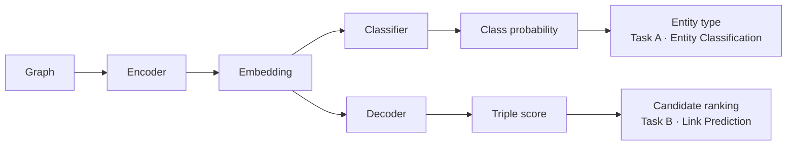
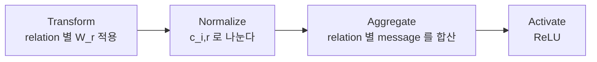
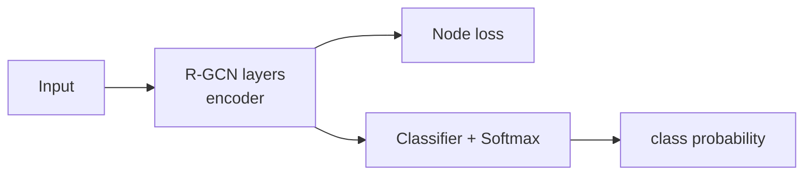
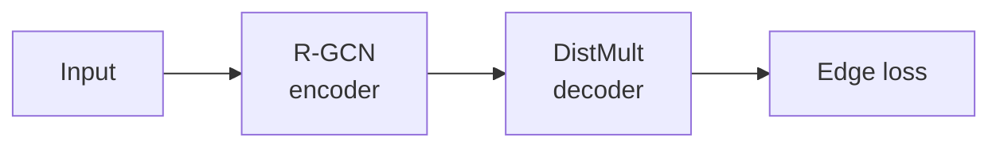
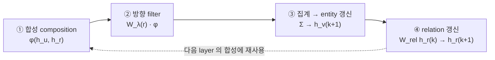

# S14 — GNN 기반 KG 표현 (R-GCN · CompGCN)

> Ch.5 ML/DL · Day 7
> 원자료: DSBA Lab Study 강의 슬라이드 45장 (`01 Introduction` ~ `04 Discussion`)
> 인용 논문
> · Schlichtkrull, Kipf, Bloem, van den Berg, Titov, Welling (2018), *Modeling Relational Data
>   with Graph Convolutional Networks*, ESWC 2018 ([arXiv:1703.06103](https://arxiv.org/abs/1703.06103))
> · Vashishth, Sanyal, Nitin, Talukdar (2020), *Composition-based Multi-Relational Graph
>   Convolutional Networks*, ICLR 2020 ([arXiv:1911.03082](https://arxiv.org/abs/1911.03082))

[S13](S13-KG-임베딩-기초.md)이 triple 하나에 점수를 매기는 모델이었다면 이 회차는 이웃 구조를
모아 표현을 만드는 쪽으로 넘어간다. 두 논문은 2년 차이이고 뒤 논문이 앞 논문의 한계를 직접
겨냥한다. R-GCN이 relation을 행렬로 두었다면 CompGCN은 relation도 학습되는 벡터로 만든다.

처음 나오는 용어가 많아 [부록 S14-1](S14-1-이웃에서-오는-표현.md) 1절에 정리해뒀다. 두 논문이
갈리는 지점과 제조 KG 적용도 부록에 있다.

---

## 1. KG는 방향과 타입이 있는 그래프

강의는 이 회차가 다룰 대상을 먼저 정의한다.

- Knowledge Graph는 entity를 node, relation을 **방향과 타입이 있는 edge**로 표현한다
- 동일한 entity 쌍 사이에도 여러 종류의 relation이 동시에 존재할 수 있다
- **Entity classification**은 누락된 node type 또는 attribute를 예측하는 과제다
- **Link prediction**은 관측되지 않은 (subject, relation, object) triple을 복원하는 과제다

예시로 든 그래프에서 Mikhail Baryshnikov는 `:ballet_dancer` 타입이고 `educated_at`으로 Vaganova
Academy에, `awarded`로 Vilcek prize에 이어져 있다. `citizen_of`로 U.S.A.에 가는 엣지는 점선으로
그려져 있는데, 이것이 복원 대상인 누락 링크다.

S13이 다룬 것은 뒤쪽 과제 하나뿐이었다. 이 회차는 둘을 함께 다룬다.

## 2. 일반 GCN이 놓치는 것

- Standard GCN은 **모든 이웃 node에 동일한 transformation W**를 적용한다
- KG에서는 소속, 저자, 인용 관계가 서로 다른 의미와 방향을 가진다
- Relation type을 무시하면 의미가 다른 이웃 정보가 동일한 방식으로 집계된다



강의가 뽑는 문장은 이것이다. Relational GNN의 핵심 질문은 "relation을 message에 어떻게 반영할
것인가"다. 이 질문에 R-GCN과 CompGCN이 서로 다른 답을 내놓는 것이 이 회차의 구조다.

## 3. 그래프 딥러닝의 두 단계

- Graph **encoder**는 node와 edge를 반복적으로 집계해 node/relation embedding을 생성한다
- **Task head**는 embedding을 node class probability 또는 triple score로 변환한다
- Training은 loss를 줄이도록 encoder와 task head를 **함께** 업데이트한다
- Inference는 학습된 parameter를 고정하고 class를 선택하거나 candidate triple을 순위화한다



이 그림이 회차 전체의 뼈대다. encoder는 하나이고 그 뒤에 붙는 head가 과제를 정한다. S13의
모델들은 이 그림에서 encoder가 없는 형태였다. embedding이 표에서 바로 나왔다.

## 4. R-GCN이 겨냥한 것

> Modeling Relational Data with Graph Convolutional Networks
> Schlichtkrull, Kipf, Bloem, van den Berg, Titov, Welling · ESWC 2018

- Entity type과 누락된 triple은 **주변 relation pattern으로 추론할 수 있다**
- R-GCN은 relation type과 direction에 따라 다른 message transformation을 사용한다
- Basis와 block-diagonal decomposition으로 relation별 parameter를 regularize한다
- R-GCN encoder와 **DistMult decoder를 결합**해 local structure의 효과를 검증한다

슬라이드의 그림이 문제 설정을 보여준다. 왼쪽은 관측된 KG로 연구자 A의 `type = ?`이고 논문 C로
가는 `저자` 엣지가 점선이다. 오른쪽은 R-GCN이 이웃 relation pattern으로 복원한 결과로
`type = Researcher`가 채워지고 `저자` 엣지에 0.87이라는 점수가 붙는다.

마지막 항목이 중요하다. decoder로 DistMult를 쓴다는 것은 S13에서 배운 것을 그대로 가져다
쓴다는 뜻이고, 뒤에 나올 실험 설계의 근거가 된다.

## 5. Relational message passing

핵심 식이다.

```
                 ⎛                1                              ⎞
h_i^(l+1) = σ ⎜  Σ     Σ      ───── W_r^(l) h_j^(l)  +  W_0^(l) h_i^(l) ⎟
                 ⎝ r∈R  j∈N_i^r   c_i,r                            ⎠

           이웃 선택  →  관계별 변환  →  크기 보정  →  합산
```

| 기호 | 뜻 |
|---|---|
| N_i^r | relation r로 연결된 이웃 집합 |
| W_r^(l) | relation별 변환 행렬 |
| c_i,r | normalization constant |
| W_0^(l) | self-loop 변환 |

슬라이드가 각 항을 이렇게 풀어준다.

- 중심 node i는 relation r로 연결된 이웃 집합에서 message를 받는다
- 이웃 vector h_j는 relation별 matrix W_r을 통과해 관계의 의미가 반영된다
- 이웃이 많은 relation이 결과를 지배하지 않도록 c_i,r로 normalize한다
- 이웃 message와 self-loop를 합친 값이 다음 layer의 node representation이 된다

> **c는 학습되지 않는 고정 상수다.** 이웃이 매우 많은 hub node의 영향을 조절할 수 없다.
> 슬라이드가 이 자리에 따로 주석을 달아뒀는데, 20절에서 R-GCN이 특정 데이터셋에서 지는 원인으로
> 다시 등장한다.

동작 순서를 네 단계로 정리한 슬라이드가 따로 있다.



- Incoming edge와 outgoing edge는 **서로 다른 relation type**으로 처리된다
- 같은 relation의 이웃 message는 동일한 W_r을 공유한다
- 여러 layer를 쌓으면 여러 relational step에 걸친 정보를 축적할 수 있다

**self-loop가 왜 필요한가.** 이웃 message만 더하면 자기 자신의 이전 표현이 사라진다. `W_0 h_i`로
이전 layer의 자기 정보를 함께 전달하면 layer를 깊게 쌓아도 중심 node의 정체성이 희석되지 않는다.

## 6. 같은 이웃 벡터가 관계마다 다른 메시지가 된다

숫자 예시가 W_r의 역할을 명확하게 만든다. 연구자 A가 연구실 B와 논문 C에 서로 다른 relation으로
이어져 있고, 두 이웃의 벡터가 우연히 같다고 하자.

```
h(연구실 B) = [1, 2]        h(논문 C) = [1, 2]

소속 relation   W = I           → I · [1,2]  = [1, 2]
저자 relation   W = [[0,1],     → [2, 1]
                     [1,0]]
```

같은 입력인데 나오는 메시지가 다르다. relation matrix가 "이 관계로 들어오는 정보를 어떻게
읽을 것인가"를 정한다. 저자 relation의 행렬은 두 성분을 뒤바꾸는 변환이라 결과가 [2, 1]이 된다.

## 7. 방향과 self-loop

- Canonical relation과 inverse relation을 **별도 relation type**으로 정의한다
- `(A, authored, Paper)`와 `(Paper, authored_inv, A)`는 반대 방향의 message를 전달한다
- Self-loop는 새 representation에 이전 layer의 자기 정보를 포함시킨다
- 방향과 self-loop를 분리해야 subject와 object의 역할 차이를 보존할 수 있다

여기서 relation 수가 한 번 더 늘어난다. 원래 관계가 R개면 역관계까지 2R개가 되고 self-loop가
하나 붙는다. 다음 절의 파라미터 문제가 그만큼 커진다.

## 8. 파라미터 폭증

- 기본 R-GCN은 **layer마다** 모든 relation에 대해 W_r^l을 학습한다
- Relation 수가 많으면 parameter 수가 relation 수에 비례해 증가한다
- Training triple이 적은 **rare relation은 독립 matrix를 안정적으로 학습하기 어렵다**
- 저자들은 parameter sharing과 sparsity constraint를 각각 별도로 제안한다

슬라이드의 그림이 대비를 보여준다. relation이 3개면 W_r 3개에 self-loop 1개지만, relation이
100개면 W_r이 100개이고 그것이 layer마다 반복된다.

S13 7절에서 본 RESCAL의 문제와 같은 구조다. FB15k는 relation이 1,345개이고 역관계까지 세면
2,690개다. 강의가 24페이지 주석에 적어둔 대로 파라미터가 그대로 1,345배로 늘어난다.

## 9. Basis decomposition

첫 번째 해법이다. 관계마다 행렬을 따로 두지 않고 공용 기저의 조합으로 만든다.

```
W_r^(l) = Σ_b  a_rb^(l) · V_b^(l)
               ────────   ────────
               관계별      모든 relation 이 공유
               조합 계수    basis transformation
```

- V_b^(l)는 여러 relation이 공유하는 basis transformation이다
- Relation마다 직접 학습되는 부분은 **basis의 조합 계수 a_rb^(l)뿐**이다
- Frequent relation과 rare relation이 basis를 공유해 overfitting을 완화할 수 있다

슬라이드의 예시는 basis 3개로 세 관계를 만든다.

```
W 소속 = 0.7·V₁ + 0.2·V₂ + 0.1·V₃
W 재직 = 0.5·V₁ + 0.4·V₂ + 0.1·V₃
W 고용 = 0.6·V₁ + 0.1·V₂ + 0.3·V₃
```

계수가 서로 비슷한 것이 눈에 띈다. 의미가 가까운 관계들이라 비슷한 조합으로 표현된다. 그리고
사례가 적은 관계도 다른 관계들이 만들어놓은 basis를 그대로 쓰므로 백지에서 시작하지 않는다.
파라미터 감소보다 이 공유 효과가 rare relation 문제에 직접 답한다.

## 10. Block decomposition

두 번째 해법이다. 관계마다 행렬은 그대로 두되 대부분을 0으로 고정한다.

- Relation matrix를 여러 low-dimensional block의 **direct sum**으로 제한한다
- 각 latent feature group 내부의 상호작용은 유지하고 group 사이 연결은 제거한다
- **Basis decomposition이 weight sharing이라면 block decomposition은 sparsity constraint다**
- Parameter는 줄지만 block 사이 feature interaction을 표현하기 어렵다는 제약이 있다

```
Dense full matrix              Block-diagonal
모든 feature 간 상호작용        block 내부만 상호작용

■ ■ ■ ■ ■ ■                   ■ ■ □ □ □ □
■ ■ ■ ■ ■ ■                   ■ ■ □ □ □ □
■ ■ ■ ■ ■ ■        →          □ □ ■ ■ □ □       □ = 0 으로 고정되는 영역
■ ■ ■ ■ ■ ■                   □ □ ■ ■ □ □
■ ■ ■ ■ ■ ■                   □ □ □ □ ■ ■
■ ■ ■ ■ ■ ■                   □ □ □ □ ■ ■
```

9절과 나란히 놓으면 두 해법이 갈리는 지점이 보인다.

| | 줄이는 방식 | 관계 사이 공유 | 잃는 것 |
|---|---|---|---|
| Basis | 공용 기저를 두고 계수만 관계별로 | 있다 | 관계별 자유도 |
| Block | 행렬 대부분을 0으로 고정 | 없다 | block 간 feature 상호작용 |

rare relation 문제에 답하는 것은 basis 쪽이다. block은 파라미터만 줄이고 관계끼리 정보를
주고받지 않으므로, 사례가 적은 관계는 여전히 자기 데이터만으로 배워야 한다.

## 11. Entity classification — 구조

R-GCN Figure 3(a)의 구성이다.



- 입력 graph에서 각 node는 **feature 또는 학습 가능한 초기 vector**로 시작한다
- 여러 R-GCN layer가 주변 node와 relation 정보를 하나의 embedding으로 압축한다
- Classifier는 embedding을 연구자 / 논문 / 기관과 같은 class score로 변환한다
- Softmax는 class score를 합이 1인 probability로 바꿔 비교 가능하게 만든다

첫 항목의 "또는"이 중요하다. node에 쓸 feature가 있으면 그것을 쓰고, 없으면 node마다 학습되는
초기 vector를 둔다. 후자를 고르면 새 node는 자리가 없어 재학습해야 한다.

## 12. Entity classification — 학습

- Training label이 있는 node에 대해 예측 probability와 실제 class를 비교한다
- **Cross-entropy loss**는 실제 class의 probability가 낮을수록 큰 값을 가진다
- Loss의 원인을 classifier에서 R-GCN layer까지 거꾸로 전달해 parameter를 수정한다
- **Label이 없는 node도 message passing에는 참여하지만 loss에는 직접 포함되지 않는다**

```
Loss = − Σ log p(정답 class)
```

마지막 항목이 18절에서 볼 라벨 비율 0.04%짜리 데이터셋에서 학습이 되는 이유다. 라벨 없는
node는 채점 대상이 아니지만 이웃으로서 정보를 나른다. 라벨은 176개인데 그래프 전체가 학습에
쓰인다.

## 13. Entity classification — 추론

- Inference에서는 학습된 R-GCN과 classifier parameter를 더 이상 변경하지 않는다
- Unlabeled 연구자 B의 이웃 관계를 집계해 node embedding h = [2.0, 0.3]을 얻었다고 가정한다
- Softmax 결과가 Researcher 0.705 / Paper 0.153 / Organization 0.142로 계산된다
- 가장 높은 probability를 가진 Researcher를 최종 entity type으로 선택한다

예시에서 연구자 B는 논문 C와 `authored`로, 연구실 D와 `affiliated_with`로 이어져 있다. 두 이웃
관계만으로 타입이 정해진다.

## 14. Link prediction — encoder와 decoder

R-GCN Figure 3(b)의 구성이다.



- R-GCN encoder가 graph context를 반영한 entity embedding `e_i = h_i^(L)`를 생성한다
- **DistMult decoder**가 subject–relation–object의 compatibility score를 계산한다
- (연구자 A, 소속, 연구실 B)의 score가 높을수록 참일 가능성이 크다고 해석한다
- Encoder는 neighborhood를 표현하고 decoder는 하나의 triple이 얼마나 그럴듯한지 판단한다

슬라이드가 DistMult에 대해 세 줄을 따로 달아뒀다.

> DistMult (Yang et al. 2014)는 R-GCN이 제안한 것이 아니라 link prediction의 기존 factorization
> 모델이다. 같은 모델을 baseline(구조 미사용)과 decoder에 함께 사용하므로 성능 차이가 곧
> encoder의 기여다.
>
> ```
> f(s, r, o) = e_sᵀ R_r e_o ,  R_r = diag(r)
> ```
>
> 대각행렬이므로 **대칭 관계만 표현 가능하다.**

마지막 줄이 [S13 20절](S13-KG-임베딩-기초.md)에서 확인한 DistMult의 구조적 한계 그대로다.
encoder는 방향을 나눠 다루는데(7절) decoder는 방향을 구분하지 못한다. 이 어긋남은
[부록 4절](S14-1-이웃에서-오는-표현.md#4-방향을-살린-encoder와-대칭만-아는-decoder)에 적었다.

## 15. Link prediction — 학습

- Graph에 관측된 (연구자 A, 소속, 연구실 B)를 **positive triple**로 사용한다
- Subject 또는 object를 바꾼 (연구자 A, 소속, 논문 C)를 **negative triple**로 생성한다
- Loss는 positive score를 높이고 negative score를 낮추도록 encoder와 decoder를 업데이트한다
- 예측 대상 edge를 encoder가 그대로 보지 않도록 **target edge masking 또는 edge dropout**이
  필요할 수 있다

앞의 셋은 S13의 negative sampling과 같다. 마지막 항목이 encoder를 붙이면서 새로 생긴 문제다.
맞혀야 할 엣지가 encoder가 보는 그래프 안에 들어 있으면 답을 그대로 읽게 된다.
[부록 3절](S14-1-이웃에서-오는-표현.md#3-encoder가-만든-새로운-누출)에 적었다.

## 16. Link prediction — 추론

- Query (연구자 A, 소속, ?)의 빈자리에 **모든 candidate entity를 하나씩 대입**한다
- 학습된 decoder가 각 candidate triple의 score를 계산하고 높은 순서로 정렬한다
- 가장 높은 score의 연구실 B를 top-1 prediction으로 반환한다
- 실무에서는 **relation의 domain/range로 부적합한 type을 후보에서 제외할 수 있다**

```
1. 연구실 B   0.874
2. 논문 C     0.272
3. 학회 D     0.186
```

절차는 S13과 같다. 후보 전체를 채점해 줄 세운다. 마지막 항목이 온톨로지가 임베딩 쪽에 개입하는
자리를 짚는데, [S13 부록 7절](S13-1-기호와-좌표-사이.md#7-온톨로지가-임베딩에-줄-수-있는-것)에서
가설로 적어둔 것과 이어진다. [부록 6절](S14-1-이웃에서-오는-표현.md#6-온톨로지가-후보를-줄인다)에
정리했다.

## 17. 평가 지표

- 정답 rank가 1이면 **reciprocal rank**는 1, rank가 2이면 1/2, rank가 10이면 1/10이다
- **MRR**은 모든 query의 reciprocal rank 평균으로 높을수록 좋다
- **Hits@K**는 정답이 상위 K개 candidate 안에 포함된 query 비율이다
- **Filtered** evaluation은 평가 target을 제외한 다른 known true answer를 후보에서 제거한다

| Query | 정답 rank | Reciprocal rank |
|---|---|---|
| Q1 | 1 | 1.000 |
| Q2 | 2 | 0.500 |
| Q3 | 10 | 0.100 |

```
MRR      = (1 + 1/2 + 1/10) / 3 = 0.533
Hits@1   = 1 / 3 = 0.333
Hits@3   = 2 / 3 = 0.667
Hits@10  = 3 / 3 = 1.000
```

S13 4절에서 이미 나온 지표인데 여기서 계산까지 보여준다. MRR은 rank 1과 rank 2의 차이(1 → 0.5)를
rank 9와 rank 10의 차이(0.111 → 0.1)보다 훨씬 크게 본다. 상위 순위를 중시하는 지표다.

## 18. Entity classification 데이터셋

R-GCN Table 1이다. RDF 형식의 4개 데이터셋을 쓴다.

| | AIFB | MUTAG | BGS | AM |
|---|---|---|---|---|
| Entities | 8,285 | 23,644 | 333,845 | 1,666,764 |
| Relations | 45 | 23 | 103 | 133 |
| Edges | 29,043 | 74,227 | 916,199 | 5,988,321 |
| Labeled | 176 | 340 | 146 | 1,000 |
| Classes | 4 | 2 | 2 | 11 |

- Relation이 방향 관계가 아니라 특정 feature의 유무를 표현하는 데도 쓰인다
- 전체 entity 중 label이 있는 node는 극소수이므로 이웃 구조로부터 정보를 끌어와야 한다
- Label 생성에 쓰인 relation은 leakage 방지를 위해 제거한다 (AIFB는 `employs`·`affiliation`,
  MUTAG는 `isMutagenic`, BGS는 `hasLithogenesis`)

라벨 비율이 극단적으로 낮다. BGS는 333,845개 중 146개만 label이 있어 전체의 0.04% 수준이다.
이 조건이 GNN을 쓰는 이유를 직접 만든다. 라벨 있는 node만으로는 학습이 되지 않으니 이웃
구조에서 정보를 가져와야 한다.

Label 생성 relation을 제거하는 처리도 눈여겨볼 만하다. 남겨두면 모델이 그 엣지 하나만 보고
맞히게 되어 구조 학습을 평가하지 못한다.

## 19. Link prediction 데이터셋과 FB15k-237

R-GCN Table 3이다.

| | WN18 | FB15k | FB15k-237 |
|---|---|---|---|
| Entities | 40,943 | 14,951 | 14,541 |
| Relations | 18 | 1,345 | 237 |
| Train edges | 141,442 | 483,142 | 272,115 |
| Val. edges | 5,000 | 50,000 | 17,535 |
| Test edges | 5,000 | 59,071 | 20,466 |

- Link prediction은 WN18 · FB15k · FB15k-237 세 데이터셋에서 평가한다
- FB15k의 relation은 1,345개로, relation 수에 비례하는 파라미터 문제가 실전에서 드러나는 규모다
- FB15k와 WN18에는 **inverse relation pair가 남아 있어** 단순 baseline인 LinkFeat이 기존 시스템을
  크게 앞선다
- 그 쌍을 제거한 **FB15k-237을 주 평가 데이터셋으로 선택**한다

`(A, hasPart, B)`와 `(B, partOf, A)`가 동시에 존재하면 한쪽을 보고 다른 쪽이 자명해진다. 구조
학습 없이도 맞힐 수 있다는 뜻이다. inverse pair 제거는 Toutanova and Chen의 제안이다.

[S13 부록 5절](S13-1-기호와-좌표-사이.md#5-충돌하는-지점)에서 두 논문의 수치가 누출된 벤치마크
위의 값이라고 적어뒀는데, 이 회차에서 그 문제가 해결된 형태로 등장한다. R-GCN은 처음부터
FB15k-237을 주 데이터셋으로 잡았고 CompGCN도 FB15k-237과 WN18RR만 쓴다.

## 20. Entity classification 결과

R-GCN Table 2다.

| Model | AIFB | MUTAG | BGS | AM |
|---|---|---|---|---|
| Feat | 55.55 | 77.94 | 72.41 | 66.66 |
| WL | 80.55 | 80.88 | 86.20 | 87.37 |
| RDF2Vec | 88.88 | 67.20 | 87.24 | 88.33 |
| R-GCN | 95.83 | 73.23 | 83.10 | 89.29 |

- R-GCN accuracy는 AIFB 95.83, AM 89.29로 비교 모델 중 가장 높다
- MUTAG 73.23과 BGS 83.10에서는 WL 또는 RDF2Vec보다 낮다
- 저자들은 **high-degree hub와 고정 normalization**이 graph structure에 따라 한계가 될 수 있다고
  해석한다

세 번째 항목이 5절의 주석과 이어진다. `c_i,r`이 학습되지 않는 상수라 hub node의 영향을 조절할
수 없고, hub가 많은 그래프에서 그것이 그대로 성능 손실이 된다. 슬라이드가 앞뒤로 같은 원인을
두 번 짚는다.

## 21. baseline은 encoder 없는 같은 decoder다

이 슬라이드가 이번 회차 실험 설계의 핵심이다.

| | entity 벡터를 얻는 방법 | decoder |
|---|---|---|
| A. Decoder-only baseline | 자유 파라미터로 직접 학습 (= DistMult 단독) | DistMult |
| B. R-GCN encoder + decoder | encoder가 이웃으로부터 계산해 생성 | DistMult |

- 두 조건 모두 decoder는 **같은 DistMult**이며, relation 대각벡터도 양쪽 모두 학습한다
- 차이는 하나뿐이다. entity 벡터를 어디서 얻는가
- Decoder를 고정했으므로 **성능 차이를 encoder의 기여로 해석할 수 있다**

변인이 하나만 다른 비교다. [S13 부록 5절](S13-1-기호와-좌표-사이.md#5-충돌하는-지점)에서 지적한
"옵티마이저가 다른데 모델을 비교한다"와 정반대 방향의 설계이고, 부록에서 이 대비를 따로 적었다.

`R-GCN+`는 두 모델을 따로 학습한 뒤 추론 점수만 가중 평균한 앙상블이다 (α = 0.4).

## 22. Link prediction 결과

R-GCN Table 5, FB15k-237 기준이다.

| Model | MRR raw | MRR filtered | Hits@1 | Hits@3 | Hits@10 |
|---|---|---|---|---|---|
| LinkFeat | | 0.063 | | | 0.079 |
| DistMult | 0.100 | 0.191 | 0.106 | 0.207 | 0.376 |
| R-GCN | 0.158 | 0.248 | 0.153 | 0.258 | 0.414 |
| R-GCN+ | 0.156 | 0.249 | 0.151 | 0.264 | 0.417 |
| CP | 0.080 | 0.182 | 0.101 | 0.197 | 0.357 |
| TransE | 0.144 | 0.233 | 0.147 | 0.263 | 0.398 |
| HolE | 0.124 | 0.222 | 0.133 | 0.253 | 0.391 |
| ComplEx | 0.109 | 0.201 | 0.112 | 0.213 | 0.388 |

- DistMult의 FB15k-237 filtered MRR은 0.191이다
- R-GCN의 filtered MRR은 0.248로 **decoder-only baseline보다 29.8% 높다**
- Node degree가 높아 context가 풍부한 구간에서는 R-GCN이 DistMult보다 유리하다

강의가 뽑는 해석은 이것이다. DistMult는 entity마다 독립 embedding을 학습하지만 R-GCN encoder는
이웃 구조로부터 embedding을 구성하므로 등장이 드문 entity에서 이득이 크다.

Figure 4는 average degree별 MRR을 그린다. degree가 낮은 왼쪽 끝에서는 두 모델이 붙어 있고
DistMult가 살짝 위인 구간도 있다. 1,000~1,500 구간에서 R-GCN이 크게 앞서고, 2,000을 넘으면
둘 다 0에 가까워진다. **이득이 특정 degree 구간에 몰려 있다.**

`R-GCN+`의 filtered MRR은 0.249로 R-GCN의 0.248과 사실상 같다. 앙상블의 이득이 0.001이다.

## 23. R-GCN Takeaway

| | 내용 |
|---|---|
| Contribution | relation type과 direction을 message passing에 도입 · basis와 block decomposition으로 parameter 완화 · encoder–decoder 결합으로 link prediction 개선 |
| Limitation | relation마다 matrix가 필요해 확장성이 낮음 · 업데이트되는 representation이 entity에 한정 · rare relation의 학습이 여전히 불안정 |

- R-GCN은 relation type과 direction을 GCN message passing에 체계적으로 도입했다
- Basis와 block decomposition은 많은 relation을 다루기 위한 초기 해법을 제시했다
- 그러나 **encoder가 직접 업데이트하는 representation은 entity에 한정된다**
- Relation별 matrix 부담과 node-only embedding이 CompGCN의 출발점이 된다

강의가 이 절을 닫는 문장이 다음 논문의 제목 역할을 한다. "Can relations become learnable
representations?"

세 번째 항목이 핵심이다. R-GCN에서 relation은 표현을 갖지 않는다. 어느 행렬을 쓸지 고르는
번호일 뿐이고, 학습되는 것은 그 행렬이지 relation 자체가 아니다.

## 24. CompGCN 소개

> Composition-based Multi-Relational Graph Convolutional Networks
> Vashishth, Sanyal, Nitin, Talukdar · ICLR 2020

- entity와 relation을 **함께 업데이트**하는 CompGCN을 제안한다
- KG embedding의 entity–relation **composition operator**를 GCN message에 활용한다
- Relation 수가 증가해도 확장 가능한 parameter-efficient 구조를 목표로 한다
- Link prediction, node classification, graph classification에서 모델을 평가한다

세 축으로 정리된다. entity와 relation을 같은 layer에서 함께 업데이트하는 것, KG embedding의
φ(e_s, e_r)를 GCN message에 직접 쓰는 것, relation basis vector로 relation 수 증가에 대응하는 것.

## 25. CompGCN Motivation

- R-GCN은 relation 정보를 **relation-specific matrix**에 담는다
- Relation 수가 많으면 matrix parameter와 rare relation의 학습 부담이 커진다
- 기존 relational GCN은 주로 **node embedding만** 생성한다
- CompGCN은 relation을 vector로 표현해 node와 함께 학습하고 message에 직접 사용한다

CompGCN Table 1이 계열을 정리한다.

| Methods | Node Embeddings | Directions | Relations | Relation Embeddings | Number of Parameters |
|---|---|---|---|---|---|
| GCN (Kipf & Welling, 2016) | ○ | | | | O(Kd²) |
| Directed-GCN (Marcheggiani & Titov, 2017) | ○ | ○ | | | O(Kd²) |
| Weighted-GCN (Shang et al., 2019) | ○ | | ○ | | O(Kd² + K\|R\|) |
| Relational-GCN (Schlichtkrull et al., 2017) | ○ | ○ | ○ | | O(BKd² + BK\|R\|) |
| CompGCN (Proposed) | ○ | ○ | ○ | ○ | O(Kd² + Bd + B\|R\|) |

Relation Embeddings 열이 CompGCN에만 있다. 강의가 한 줄로 요약한다.
Relation matrix (R-GCN) → Relation embedding + composition (CompGCN).

## 26. Model Overview

- 각 edge에서 neighboring entity와 relation embedding에 **φ(·)를 적용**한다
- 합성된 message에 original, inverse, self-loop **방향별 filter**를 적용한다
- 모든 neighbor message를 합쳐 central entity embedding을 업데이트한다
- Relation embedding도 별도 transformation을 거쳐 다음 layer로 전달된다

한 layer가 네 단계다.



- 각 edge (u, r)마다 이웃 entity와 relation을 φ로 먼저 합성한다
- 합성된 message에 방향별 filter W_λ(r)를 적용한다
- 모든 이웃 message를 합쳐 중심 entity를 h_v^(k+1)로 갱신한다
- Relation도 W_rel을 거쳐 h_r^(k+1)로 갱신되어 **다음 layer의 합성에 재사용된다**

논문 Figure 1의 예시는 Christopher Nolan을 중심에 두고 London(`Born-in`), United
Kingdom(`Citizen-of`), The Dark Knight(`Directed-by`)와 각각의 역관계가 붙은 그래프다. 오른쪽
그림에서 각 엣지마다 φ 노드가 끼어 있고 그 출력에 W_O / W_I / W_S가 붙는다.

## 27. Composition operator

| 구분 | Subtraction (Sub) | Multiplication (Mult) | Circular correlation (Corr) |
|---|---|---|---|
| 수식 | φ(e_s, e_r) = e_s − e_r | φ(e_s, e_r) = e_s * e_r | φ(e_s, e_r) = e_s ★ e_r |
| 대응 KGE | TransE | DistMult | HolE |
| 직관 | relation을 이동으로 해석 | 차원별 매칭 강도로 해석 | 차원 간 상호작용을 압축 |
| 특징 | 단순하고 안정적 | KG embedding과 궁합이 좋음 | 표현력이 높고 파라미터가 적음 |

- Subtraction은 translational interaction을 표현한다
- Multiplication은 dimension-wise matching을 표현한다
- Circular correlation은 차원 간 상호작용을 고정 크기 vector로 압축한다
- **Composition operator는 message가 relation을 해석하는 inductive bias가 된다**

S13 5절의 세 번째 축이 여기로 옮겨왔다. 그때는 점수함수의 대수적 성질이 표현 가능한 관계를
정했고, 여기서는 같은 연산이 message를 만드는 방식을 정한다. 대응 KGE 열이 S13에서 다룬
모델들과 그대로 겹친다.

## 28. Update equation — R-GCN과의 대비

```
R-GCN      h_i^(l+1) = σ ( Σ_r,j  (1/c_i,r) · W_r · h_j )
                                              ───
                                              relation 마다 다른 matrix 를 선택

CompGCN    h_v^(k+1) = f ( Σ_(u,r)∈N(v)  W_λ(r) · φ(h_u, h_r) )
                                          ──────   ───────────
                                          방향 3개   entity 와 relation 을 먼저 합성

           h_r^(k+1) = W_rel^(k) · h_r^(k)
```

- R-GCN message는 `W_r · h_u`처럼 relation별 matrix를 **선택**한다
- CompGCN message는 `W_λ(r) · φ(h_u, h_r)`로 entity와 relation을 먼저 **합성**한다
- W_O, W_I, W_S는 original, inverse, self-loop **방향만** 구분한다
- **Relation 의미는 h_r이, 방향 차이는 W_λ(r)가 담당한다**

강의가 아래에 붙인 문장이 핵심이다. 방향 filter는 relation 수와 무관하게 3개로 고정된다.
R-GCN에서는 relation이 1,345개면 행렬도 그만큼 필요했는데, CompGCN에서는 relation이 몇 개든
행렬이 3개다. 늘어나는 것은 벡터 h_r뿐이다.

## 29. Worked example

같은 triple에서 operator에 따라 다른 message가 나온다.

```
h_u = [2, 1]   이웃 entity embedding
h_r = [1, 3]   relation embedding

Subtraction (TransE 계열)    [2,1] − [1,3] = [ 1, −2]
Multiplication (DistMult 계열) [2,1] * [1,3] = [ 2,  3]
```

Operator 선택이 message의 inductive bias를 바꾼다. 같은 triple에서도 서로 다른 message가
생성된다.

## 30. entity와 relation이 함께 진화한다

```mermaid
graph LR
  E0["h_v(0)"] --> E1["h_v(1)"] --> E2["h_v(2)"]
  R0["h_r(0)"] --> R1["h_r(1)"] --> R2["h_r(2)"]
  R0 -.->|φ(h_u, h_r)| E1
  R1 -.->|φ(h_u, h_r)| E2
```

- Node는 neighbor–relation composition을 집계해 h_v^(k+1)로 업데이트된다
- Relation은 공통 transformation W_rel^k를 통해 h_r^(k+1)로 업데이트된다
- 갱신된 relation embedding은 **다음 layer의 composition에 다시 사용된다**
- 초기 relation feature가 존재하면 Z를 입력 representation으로 활용할 수 있다

두 stream이 나란히 흐르면서 서로를 먹인다. R-GCN에서는 아래쪽 stream이 없었다.

## 31. Parameter efficiency

- CompGCN은 node, direction, relation, relation embedding을 모두 명시적으로 처리한다
- R-GCN의 parameter complexity는 O(BKd² + BK|R|)로 제시된다
- CompGCN은 relation basis vector를 사용해 O(Kd² + Bd + B|R|)로 제시된다
- φ와 W_λ(r) 선택에 따라 GCN, R-GCN, D-GCN, W-GCN으로 **환원 가능하다**

CompGCN Table 2가 환원 관계를 보여준다.

| Methods | W_λ(r)^k | φ(h_u^k, h_r^k) |
|---|---|---|
| Kipf-GCN (Kipf & Welling, 2016) | W^k | h_u^k |
| Relational-GCN (Schlichtkrull et al., 2017) | W_r^k | h_u^k |
| Directed-GCN (Marcheggiani & Titov, 2017) | W_dir(r)^k | h_u^k |
| Weighted-GCN (Shang et al., 2019) | W^k | α_r^k h_u^k |

φ(h_u, h_r) = h_u로 두고 W_λ(r) = W로 두면 GCN이 되고, φ = h_u이고 W를 relation별로 두면
R-GCN이 된다. 기존 모델들이 φ 자리에 h_u만 넣은 특수 사례라는 정리다.

두 complexity를 나란히 보면 |R|이 곱해지는 자리가 다르다. R-GCN은 `BK|R|`로 layer 수 K와
곱해지고, CompGCN은 `B|R|`로 basis 수와만 곱해진다.

## 32. 실험 설계

| Task | Dataset | Metric | Main Question |
|---|---|---|---|
| Link prediction | FB15k-237 · WN18RR | MRR · MR · Hits@N | 기존 KGE·GCN 대비 성능이 향상되는가 |
| Node classification | MUTAG · AM | Accuracy | node-level task에서도 유효한가 |
| Graph classification | MUTAG · PTC | Accuracy | graph-level 표현으로 확장되는가 |

추가 실험으로 composition operator, basis 수, relation 수의 영향을 분석한다.

R-GCN이 두 태스크였던 데 비해 하나가 더 붙었다. graph classification은 그래프 전체를 하나로
분류하는 과제라 node 표현을 모아 그래프 표현을 만드는 단계가 추가된다.

## 33. Link prediction 결과

CompGCN Table 3에서 CompGCN 행과 주요 비교 대상만 옮겼다.

| Method | FB15k-237 MRR | MR | H@10 | H@3 | H@1 | WN18RR MRR | MR | H@10 | H@3 | H@1 |
|---|---|---|---|---|---|---|---|---|---|---|
| TransE (2013) | .294 | 357 | .465 | - | - | .226 | 3384 | .501 | - | - |
| DistMult (2014) | .241 | 254 | .419 | .263 | .155 | .43 | 5110 | .49 | .44 | .39 |
| ComplEx (2016) | .247 | 339 | .428 | .275 | .158 | .44 | 5261 | .51 | .46 | .41 |
| R-GCN (2017) | .248 | - | .417 | - | .151 | - | - | - | - | - |
| ConvE (2018) | .325 | 244 | .501 | .356 | .237 | .43 | 4187 | .52 | .44 | .40 |
| SACN (2019) | .35 | - | .54 | .39 | .26 | .47 | - | .54 | .48 | .43 |
| RotatE (2019) | .338 | 177 | .533 | .375 | .241 | .476 | 3340 | .571 | .492 | .428 |
| ConvR (2019) | .350 | - | .528 | .385 | .261 | .475 | - | .537 | .489 | .443 |
| CompGCN | .355 | 197 | .535 | .390 | .264 | .479 | 3533 | .546 | .494 | .443 |

- CompGCN은 FB15k-237에서 MRR 0.355, H@3 0.390, H@1 0.264를 기록한다
- 논문은 **5개 지표 중 4개에서 우수하다고 서술한다**
- 표 수치상 MR은 RotatE가 더 낮고 H@10은 SACN이 더 높으며 H@3는 SACN과 동률이다
- 핵심 결과는 당시 baseline 대비 강한 MRR이지만 모든 지표의 단독 최고 성능은 아니다

세 번째 항목은 강의가 논문의 서술을 표와 대조해 짚은 것이다. 논문이 쓴 문장을 그대로 옮기지
않고 근거를 확인한 대목이라 부록 3절에 따로 적었다.

## 34. Composition operator × decoder

CompGCN Table 4다. encoder를 CompGCN으로 고정하고 operator와 decoder를 바꿔가며 잰다.

| Methods ↓ / Scoring Function → | TransE MRR | DistMult MRR | ConvE MRR |
|---|---|---|---|
| X (encoder 없음) | 0.294 | 0.241 | 0.325 |
| X + D-GCN | 0.299 | 0.321 | 0.344 |
| X + R-GCN | 0.281 | 0.324 | 0.342 |
| X + W-GCN | 0.267 | 0.324 | 0.344 |
| X + CompGCN (Sub) | 0.335 | 0.336 | 0.352 |
| X + CompGCN (Mult) | **0.337** | **0.338** | 0.353 |
| X + CompGCN (Corr) | 0.336 | 0.335 | **0.355** |

- TransE decoder에서는 Mult가 MRR 0.337로 가장 높다
- DistMult decoder에서도 Mult가 0.338로 가장 높다
- ConvE decoder에서는 Corr가 0.355로 가장 높다
- **Composition은 독립적인 만능 선택이 아니라 encoder–decoder 조합의 일부다**

최적 operator가 decoder에 따라 달라진다. 21절에서 R-GCN이 decoder를 고정해 encoder 기여를
분리해낸 것과 대비되는 지점이라 부록 3절에 적었다.

## 35. Relation basis vector

- CompGCN은 relation마다 독립 embedding을 두지 않고 basis vector의 **선형결합**으로 표현한다
- 학습되는 것은 공유 basis vector와 relation별 결합 계수뿐이다
- **R-GCN의 basis는 변환 matrix를 공유하고 CompGCN의 basis는 relation vector를 공유한다**
- Basis 수 B가 작아도 relation 수가 늘어날 때 parameter 증가를 억제할 수 있다

```
h 소속 = 0.7·z₁ + 0.2·z₂ + 0.1·z₃
h 저자 = 0.4·z₁ + 0.5·z₂ + 0.1·z₃
h 인용 = 0.2·z₁ + 0.3·z₂ + 0.5·z₃
```

9절의 R-GCN basis와 형태가 같은데 공유하는 대상이 다르다. 같은 이름의 다른 장치라 부록 1절
용어 정리에서 갈라놨다.

## 36. Scalability

- Basis 수가 증가할수록 full relation embedding model의 MRR에 가까워진다
- B = 5인 CompGCN도 relation 수가 달라질 때 full model 대비 유사한 성능을 유지한다
- 동일한 relation 수 조건에서 CompGCN B = 5가 R-GCN보다 높은 MRR을 기록한다
- 결과는 relation matrix보다 **relation basis vector가 더 효율적일 수 있음**을 보여준다

Figure 3에서 basis 수를 5까지 줄여도 상대 MRR이 97.2%로 유지된다 (100개일 때 99.4%, 50개일 때
98.6%, 25개일 때 98.0%). Figure 4는 같은 relation 수에서 CompGCN(B=5)과 R-GCN을 비교하는데
전 구간에서 CompGCN이 위에 있다 (전체 0.345 대 0.342, 100개 0.331 대 0.325, 50개 0.316 대
0.308, 25개 0.321 대 0.316, 10개 0.269 대 0.265).

차이가 크지는 않다. 전체 조건에서 0.003이고 가장 벌어지는 50개 조건에서 0.008이다.

## 37. Node · graph classification

CompGCN Table 5다.

**Node classification**

| Model | MUTAG (Node) | AM |
|---|---|---|
| Feat | 77.9 | 66.7 |
| WL | 80.9 | 87.4 |
| RDF2Vec | 67.2 | 88.3 |
| R-GCN | 73.2 | 89.3 |
| SynGCN | 74.8 ± 5.5 | 86.2 ± 1.9 |
| WGCN | 77.9 ± 3.2 | 90.2 ± 0.9 |
| CompGCN | 85.3 ± 1.2 | 90.6 ± 0.2 |

**Graph classification**

| Model | MUTAG (Graph) | PTC |
|---|---|---|
| PATCHY-SAN | 92.6 ± 4.2 | 60.0 ± 4.8 |
| DGCNN | 85.8 | 58.6 |
| GIN | 89.4 ± 4.7 | 64.6 ± 7.0 |
| R-GCN | 82.3 ± 9.2 | 67.8 ± 13.2 |
| SynGCN | 79.3 ± 10.3 | 69.4 ± 11.5 |
| WGCN | 78.9 ± 12.0 | 67.3 ± 12.0 |
| CompGCN | 89.0 ± 11.1 | 71.6 ± 12.0 |

- MUTAG node classification에서 CompGCN은 85.3으로 비교 모델 중 가장 높다
- AM node classification에서도 90.6으로 가장 높은 accuracy를 기록한다
- PTC graph classification에서는 71.6으로 비교 모델 중 가장 높다
- MUTAG graph classification 89.0은 PATCHY-SAN 92.6보다 낮고 GIN 89.4와 유사하다

node classification은 확실하게 앞서고 graph classification은 갈린다. 표준편차도 눈에 띈다.
graph classification 쪽은 ±11~12로 커서 차이를 단정하기 어렵다.

## 38. R-GCN과 CompGCN

| 구분 | R-GCN (2017) | CompGCN (2020) |
|---|---|---|
| Message | Σ_r,j (1/c_i,r) W_r h_j | Σ_u,r W_λ(r) φ(h_u, h_r) |
| Relation 표현 | relation별 transformation matrix | 학습되는 relation embedding |
| Direction | canonical / inverse를 별도 relation으로 | 방향별 filter (original / inverse / self) |
| Parameter sharing | basis · block decomposition | relation basis vector 공유 |
| Supported output | entity embedding | entity + relation embedding |
| Training target | node label / positive–negative triple | 동일 + relation embedding 동시 학습 |
| Inference output | entity type · candidate ranking | entity type · candidate ranking · graph label |
| Main limitation | relation 수 증가에 취약 | composition 효과가 decoder에 의존 |

- R-GCN은 relation-specific matrix로 relational message passing의 기본 구조를 확립했다
- CompGCN은 relation embedding과 composition을 도입해 entity와 relation을 함께 업데이트한다
- R-GCN의 basis는 matrix를 공유하고 CompGCN의 basis는 relation vector를 공유한다
- 두 모델의 핵심 차이는 relation 의미를 **어디에 저장하고 어떻게 공유하는가**에 있다

강의가 제목으로 뽑은 문장이 전환을 요약한다. relation as a matrix selector에서 relation as a
learnable representation으로.

---

## 관련 문서

- [부록 S14-1 — 이웃에서 오는 표현](S14-1-이웃에서-오는-표현.md) — 용어 정리, 두 논문의 실험 설계 대비, 수치 충돌
- [S13 — KG 임베딩 기초](S13-KG-임베딩-기초.md) — 직전 회차. TransE·DistMult
- [S13-1 — 기호와 좌표 사이](S13-1-기호와-좌표-사이.md) — 벤치마크 누출과 논문 간 수치 비교 문제
- [S11-1 — 온톨로지가 하지 않는 일](S11-1-온톨로지가-하지-않는-일.md) — 추론과 링크 예측의 구분
- [00 — 전체 파이프라인](00-전체-파이프라인.md) — 임베딩 계열이 붙는 자리
