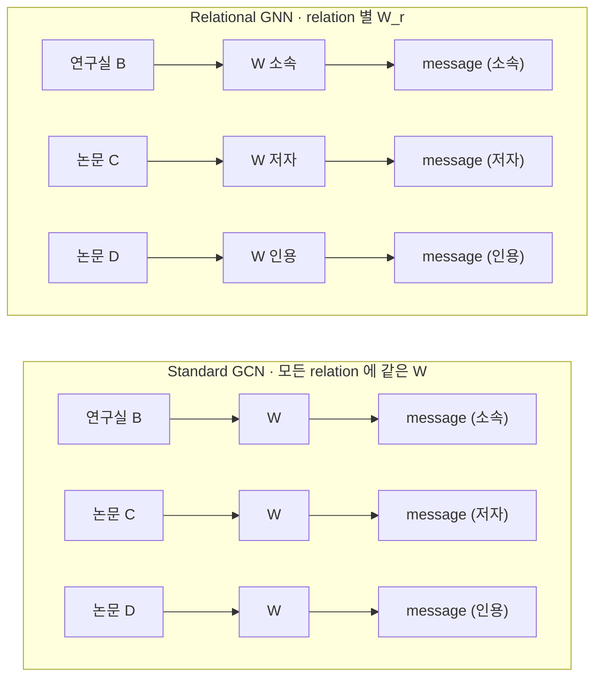
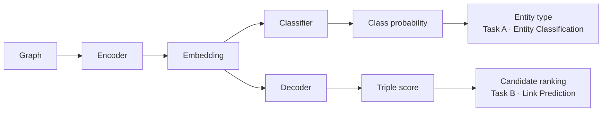
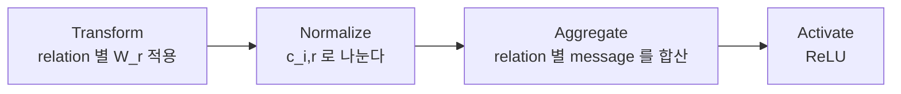
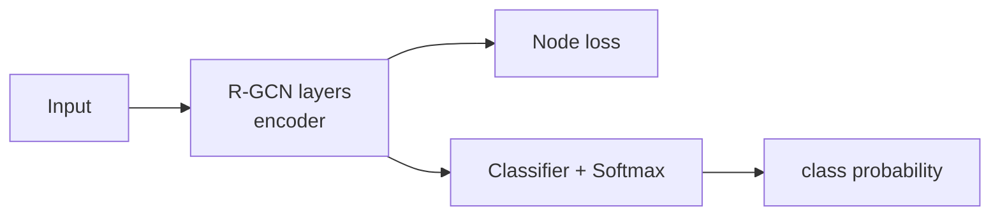
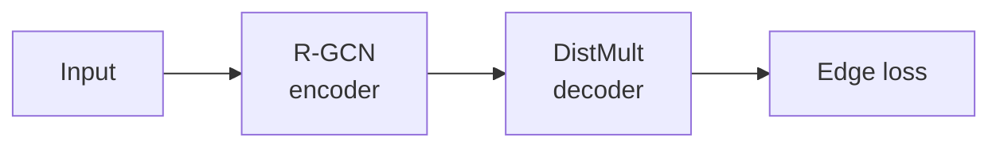

# S14A — R-GCN: 관계별 메시지 전달

> Ch.5 ML/DL · Day 7
> 원자료: DSBA Lab Study 강의 슬라이드 45장 중 `01 Introduction` · `02 R-GCN` (p5~28)
> 인용 논문
> · Schlichtkrull, Kipf, Bloem, van den Berg, Titov, Welling (2018), *Modeling Relational Data
>   with Graph Convolutional Networks*, ESWC 2018 ([arXiv:1703.06103](https://arxiv.org/abs/1703.06103))
>
> 📖 [강의 목차](README.md) · 이전 [S13 KG 임베딩 기초](S13-KG-임베딩-기초.md) · 다음 [S14B CompGCN](S14B-CompGCN-합성-기반-관계-표현.md)
> 📎 부록 [S14-1 읽는 데 필요한 것들](S14-1-읽는-데-필요한-것들.md) · [S14-2 이웃에서 오는 표현](S14-2-이웃에서-오는-표현.md)

**한 회차를 두 문서로 나눴다.** 강의는 45장 한 덱으로 진행됐고 분량 때문에 쪼갠 것이다. 이 문서가
GNN의 밑바탕과 R-GCN을, [S14B](S14B-CompGCN-합성-기반-관계-표현.md)가 CompGCN과 두 모델 비교를
다룬다. 절 번호는 문서마다 1부터 다시 시작한다.

**이 문서는 슬라이드 내용만 담는다.** 슬라이드가 설명 없이 쓰는 용어(W, σ, softmax, cross-entropy,
역전파, basis, canonical relation)와 식 읽는 법은 [S14-1](S14-1-읽는-데-필요한-것들.md)에, 강의
밖에서 나온 해석은 [S14-2](S14-2-이웃에서-오는-표현.md)에 있다.

---

## 1. KG는 방향과 타입이 있는 그래프

- Knowledge Graph는 entity를 node, relation을 **방향과 타입이 있는 edge**로 표현한다
- 동일한 entity 쌍 사이에도 여러 종류의 relation이 동시에 존재할 수 있다
- **Entity classification**은 누락된 node type 또는 attribute를 예측하는 과제다
- **Link prediction**은 관측되지 않은 (subject, relation, object) triple을 복원하는 과제다

예시 그래프에서 Mikhail Baryshnikov는 `:ballet_dancer` 타입이고 `educated_at`으로 Vaganova
Academy에, `awarded`로 Vilcek prize에 이어져 있다. `citizen_of`로 U.S.A.에 가는 엣지는 점선으로
그려져 있고 이것이 복원 대상인 누락 링크다.

## 2. 일반 GCN이 놓치는 것

- Standard GCN은 **모든 이웃 node에 동일한 transformation W**를 적용한다
- KG에서는 소속, 저자, 인용 관계가 서로 다른 의미와 방향을 가진다
- Relation type을 무시하면 의미가 다른 이웃 정보가 동일한 방식으로 집계된다
- Relational GNN의 핵심 질문은 "relation을 message에 어떻게 반영할 것인가"다



## 3. 그래프 딥러닝의 두 단계

- Graph **encoder**는 node와 edge를 반복적으로 집계해 node/relation embedding을 생성한다
- **Task head**는 embedding을 node class probability 또는 triple score로 변환한다
- Training은 loss를 줄이도록 encoder와 task head를 **함께** 업데이트한다
- Inference는 학습된 parameter를 고정하고 class를 선택하거나 candidate triple을 순위화한다



## 4. R-GCN이 겨냥한 것

> Modeling Relational Data with Graph Convolutional Networks
> Schlichtkrull, Kipf, Bloem, van den Berg, Titov, Welling · ESWC 2018

- Entity type과 누락된 triple은 **주변 relation pattern으로 추론할 수 있다**
- R-GCN은 relation type과 direction에 따라 다른 message transformation을 사용한다
- Basis와 block-diagonal decomposition으로 relation별 parameter를 regularize한다
- R-GCN encoder와 **DistMult decoder를 결합**해 local structure의 효과를 검증한다

슬라이드의 그림에서 왼쪽은 관측된 KG로 연구자 A의 `type = ?`이고 논문 C로 가는 `저자` 엣지가
점선이다. 오른쪽은 R-GCN이 이웃 relation pattern으로 복원한 결과로 `type = Researcher`가 채워지고
`저자` 엣지에 0.87이라는 점수가 붙는다.

## 5. Relational message passing

```
h_i^(l+1) = σ ( Σ_{r∈R} Σ_{j∈N_i^r} (1 / c_i,r) · W_r^(l) · h_j^(l)  +  W_0^(l) · h_i^(l) )
```

| 기호 | 뜻 |
|---|---|
| N_i^r | relation r로 연결된 이웃 집합 |
| W_r^(l) | relation별 변환 행렬 |
| c_i,r | normalization constant |
| W_0^(l) | self-loop 변환 |

- 중심 node i는 relation r로 연결된 이웃 집합에서 message를 받는다
- 이웃 vector h_j는 relation별 matrix W_r을 통과해 관계의 의미가 반영된다
- 이웃이 많은 relation이 결과를 지배하지 않도록 c_i,r로 normalize한다
- 이웃 message와 self-loop를 합친 값이 다음 layer의 node representation이 된다

이웃 선택 → 관계별 변환 → 크기 보정 → 합산의 순서다.

> **c는 학습되지 않는 고정 상수다.** 이웃이 매우 많은 hub node의 영향을 조절할 수 없다.
> 슬라이드가 이 자리에 주석을 달아뒀고, 20절에서 R-GCN이 특정 데이터셋에서 지는 원인으로 다시
> 등장한다.

동작 순서를 네 단계로 정리한 슬라이드가 따로 있다.



- Incoming edge와 outgoing edge는 **서로 다른 relation type**으로 처리된다
- 같은 relation의 이웃 message는 동일한 W_r을 공유한다
- 여러 layer를 쌓으면 여러 relational step에 걸친 정보를 축적할 수 있다

**self-loop가 왜 필요한가.** 이웃 message만 더하면 자기 자신의 이전 표현이 사라진다. `W_0 h_i`로
이전 layer의 자기 정보를 함께 전달하면 layer를 깊게 쌓아도 중심 node의 정체성이 희석되지 않는다.

> 식을 기호별로 푼 것은 [S14-1 6절](S14-1-읽는-데-필요한-것들.md#6-식-읽기)에 있다.

## 6. 같은 이웃 벡터가 관계마다 다른 메시지가 된다

- 가상 학술 KG에서 연구자 A가 연구실 B, 논문 C와 서로 다른 relation으로 연결된다
- 동일한 이웃 vector h = [1, 2]라도 relation matrix에 따라 message가 달라진다

```
h(연구실 B) = [1, 2]        h(논문 C) = [1, 2]

소속 relation   W = I           → I · [1,2]  = [1, 2]
저자 relation   W = [[0,1],     → [2, 1]
                     [1,0]]
```

## 7. 방향과 self-loop

- Canonical relation과 inverse relation을 **별도 relation type**으로 정의한다
- `(A, authored, Paper)`와 `(Paper, authored_inv, A)`는 반대 방향의 message를 전달한다
- Self-loop는 새 representation에 이전 layer의 자기 정보를 포함시킨다
- 방향과 self-loop를 분리해야 subject와 object의 역할 차이를 보존할 수 있다

여기서 relation 수가 한 번 더 늘어난다. 원래 관계가 R개면 역관계까지 2R개가 되고 self-loop가
하나 붙는다.

> canonical과 inverse가 무엇이고 왜 별도 relation type으로 두는지는
> [S14-1 8절](S14-1-읽는-데-필요한-것들.md#8-세-가지-방향)에 있다.

## 8. 파라미터 폭증

- 기본 R-GCN은 **layer마다** 모든 relation에 대해 W_r^l을 학습한다
- Relation 수가 많으면 parameter 수가 relation 수에 비례해 증가한다
- Training triple이 적은 **rare relation은 독립 matrix를 안정적으로 학습하기 어렵다**
- 저자들은 parameter sharing과 sparsity constraint를 각각 별도로 제안한다

슬라이드의 그림이 대비를 보여준다. relation이 3개면 W_r 3개에 self-loop 1개지만, relation이
100개면 W_r이 100개이고 그것이 layer마다 반복된다. FB15k는 relation이 1,345개이고 역관계까지
세면 2,690개다.

> "독립 matrix"의 뜻과 두 해법(parameter sharing / sparsity constraint)의 차이는
> [S14-1 7절](S14-1-읽는-데-필요한-것들.md#7-basis와-block을-숫자로)에 있다.

## 9. Basis decomposition

```
W_r^(l) = Σ_b  a_rb^(l) · V_b^(l)
               ────────   ────────
               관계별      모든 relation 이 공유
               조합 계수    basis transformation
```

- V_b^(l)는 여러 relation이 공유하는 basis transformation이다
- Relation마다 직접 학습되는 부분은 **basis의 조합 계수 a_rb^(l)뿐**이다
- Frequent relation과 rare relation이 basis를 공유해 overfitting을 완화할 수 있다

슬라이드의 예시는 basis 3개로 세 관계를 만든다.

```
W 소속 = 0.7·V₁ + 0.2·V₂ + 0.1·V₃
W 재직 = 0.5·V₁ + 0.4·V₂ + 0.1·V₃
W 고용 = 0.6·V₁ + 0.1·V₂ + 0.3·V₃
```

## 10. Block decomposition

- Relation matrix를 여러 low-dimensional block의 **direct sum**으로 제한한다
- 각 latent feature group 내부의 상호작용은 유지하고 group 사이 연결은 제거한다
- **Basis decomposition이 weight sharing이라면 block decomposition은 sparsity constraint다**
- Parameter는 줄지만 block 사이 feature interaction을 표현하기 어렵다는 제약이 있다

```
Dense full matrix              Block-diagonal
모든 feature 간 상호작용        block 내부만 상호작용

■ ■ ■ ■ ■ ■                   ■ ■ □ □ □ □
■ ■ ■ ■ ■ ■                   ■ ■ □ □ □ □
■ ■ ■ ■ ■ ■        →          □ □ ■ ■ □ □       □ = 0 으로 고정되는 영역
■ ■ ■ ■ ■ ■                   □ □ ■ ■ □ □
■ ■ ■ ■ ■ ■                   □ □ □ □ ■ ■
■ ■ ■ ■ ■ ■                   □ □ □ □ ■ ■
```

> 두 해법을 숫자로 비교한 것은 [S14-1 7절](S14-1-읽는-데-필요한-것들.md#7-basis와-block을-숫자로)에
> 있다.

## 11. Entity classification — 구조

R-GCN Figure 3(a)의 구성이다.



- 입력 graph에서 각 node는 **feature 또는 학습 가능한 초기 vector**로 시작한다
- 여러 R-GCN layer가 주변 node와 relation 정보를 하나의 embedding으로 압축한다
- Classifier는 embedding을 연구자 / 논문 / 기관과 같은 class score로 변환한다
- Softmax는 class score를 합이 1인 probability로 바꿔 비교 가능하게 만든다

## 12. Entity classification — 학습

- Training label이 있는 node에 대해 예측 probability와 실제 class를 비교한다
- **Cross-entropy loss**는 실제 class의 probability가 낮을수록 큰 값을 가진다
- Loss의 원인을 classifier에서 R-GCN layer까지 거꾸로 전달해 parameter를 수정한다
- **Label이 없는 node도 message passing에는 참여하지만 loss에는 직접 포함되지 않는다**

```
Loss = − Σ log p(정답 class)
```

> softmax · cross-entropy · 역전파가 각각 무슨 연산인지는
> [S14-1 5절](S14-1-읽는-데-필요한-것들.md#5-학습이란-무엇인가)에 있다.

## 13. Entity classification — 추론

- Inference에서는 학습된 R-GCN과 classifier parameter를 더 이상 변경하지 않는다
- Unlabeled 연구자 B의 이웃 관계를 집계해 node embedding h = [2.0, 0.3]을 얻었다고 가정한다
- Softmax 결과가 Researcher 0.705 / Paper 0.153 / Organization 0.142로 계산된다
- 가장 높은 probability를 가진 Researcher를 최종 entity type으로 선택한다

예시에서 연구자 B는 논문 C와 `authored`로, 연구실 D와 `affiliated_with`로 이어져 있다.

## 14. Link prediction — encoder와 decoder

R-GCN Figure 3(b)의 구성이다.



- R-GCN encoder가 graph context를 반영한 entity embedding `e_i = h_i^(L)`를 생성한다
- **DistMult decoder**가 subject–relation–object의 compatibility score를 계산한다
- (연구자 A, 소속, 연구실 B)의 score가 높을수록 참일 가능성이 크다고 해석한다
- Encoder는 neighborhood를 표현하고 decoder는 하나의 triple이 얼마나 그럴듯한지 판단한다

슬라이드가 DistMult에 대해 세 줄을 따로 달아뒀다.

> DistMult (Yang et al. 2014)는 R-GCN이 제안한 것이 아니라 link prediction의 기존 factorization
> 모델이다. 같은 모델을 baseline(구조 미사용)과 decoder에 함께 사용하므로 성능 차이가 곧
> encoder의 기여다.
>
> ```
> f(s, r, o) = e_sᵀ R_r e_o ,  R_r = diag(r)
> ```
>
> 대각행렬이므로 **대칭 관계만 표현 가능하다.**

> 마지막 줄이 7절의 방향 처리와 어긋난다.
> [S14-2 4절](S14-2-이웃에서-오는-표현.md#4-방향을-살린-encoder와-대칭만-아는-decoder)에 적었다.

## 15. Link prediction — 학습

- Graph에 관측된 (연구자 A, 소속, 연구실 B)를 **positive triple**로 사용한다
- Subject 또는 object를 바꾼 (연구자 A, 소속, 논문 C)를 **negative triple**로 생성한다
- Loss는 positive score를 높이고 negative score를 낮추도록 encoder와 decoder를 업데이트한다
- 예측 대상 edge를 encoder가 그대로 보지 않도록 **target edge masking 또는 edge dropout**이
  필요할 수 있다

> 마지막 항목이 encoder를 붙이면서 새로 생긴 문제다.
> [S14-2 3절](S14-2-이웃에서-오는-표현.md#3-encoder가-만든-새로운-누출)에 적었다.

## 16. Link prediction — 추론

- Query (연구자 A, 소속, ?)의 빈자리에 **모든 candidate entity를 하나씩 대입**한다
- 학습된 decoder가 각 candidate triple의 score를 계산하고 높은 순서로 정렬한다
- 가장 높은 score의 연구실 B를 top-1 prediction으로 반환한다
- 실무에서는 **relation의 domain/range로 부적합한 type을 후보에서 제외할 수 있다**

```
1. 연구실 B   0.874
2. 논문 C     0.272
3. 학회 D     0.186
```

> 마지막 항목은 온톨로지가 임베딩 쪽에 개입하는 자리다.
> [S14-2 7절](S14-2-이웃에서-오는-표현.md#7-온톨로지가-후보를-줄인다)에 적었다.

## 17. 평가 지표

- 정답 rank가 1이면 **reciprocal rank**는 1, rank가 2이면 1/2, rank가 10이면 1/10이다
- **MRR**은 모든 query의 reciprocal rank 평균으로 높을수록 좋다
- **Hits@K**는 정답이 상위 K개 candidate 안에 포함된 query 비율이다
- **Filtered** evaluation은 평가 target을 제외한 다른 known true answer를 후보에서 제거한다

| Query | 정답 rank | Reciprocal rank |
|---|---|---|
| Q1 | 1 | 1.000 |
| Q2 | 2 | 0.500 |
| Q3 | 10 | 0.100 |

```
MRR      = (1 + 1/2 + 1/10) / 3 = 0.533
Hits@1   = 1 / 3 = 0.333
Hits@3   = 2 / 3 = 0.667
Hits@10  = 3 / 3 = 1.000
```

## 18. Entity classification 데이터셋

R-GCN Table 1이다.

| | AIFB | MUTAG | BGS | AM |
|---|---|---|---|---|
| Entities | 8,285 | 23,644 | 333,845 | 1,666,764 |
| Relations | 45 | 23 | 103 | 133 |
| Edges | 29,043 | 74,227 | 916,199 | 5,988,321 |
| Labeled | 176 | 340 | 146 | 1,000 |
| Classes | 4 | 2 | 2 | 11 |

- Relation이 방향 관계가 아니라 특정 feature의 유무를 표현하는 데도 쓰인다
- 전체 entity 중 label이 있는 node는 극소수이므로 이웃 구조로부터 정보를 끌어와야 한다
- Label 생성에 쓰인 relation은 leakage 방지를 위해 제거한다 (AIFB는 `employs`·`affiliation`,
  MUTAG는 `isMutagenic`, BGS는 `hasLithogenesis`)

## 19. Link prediction 데이터셋과 FB15k-237

R-GCN Table 3이다.

| | WN18 | FB15k | FB15k-237 |
|---|---|---|---|
| Entities | 40,943 | 14,951 | 14,541 |
| Relations | 18 | 1,345 | 237 |
| Train edges | 141,442 | 483,142 | 272,115 |
| Val. edges | 5,000 | 50,000 | 17,535 |
| Test edges | 5,000 | 59,071 | 20,466 |

- Link prediction은 WN18 · FB15k · FB15k-237 세 데이터셋에서 평가한다
- FB15k의 relation은 1,345개로, relation 수에 비례하는 파라미터 문제가 실전에서 드러나는 규모다
- FB15k와 WN18에는 **inverse relation pair가 남아 있어** 단순 baseline인 LinkFeat이 기존 시스템을
  크게 앞선다
- 그 쌍을 제거한 **FB15k-237을 주 평가 데이터셋으로 선택**한다

## 20. Entity classification 결과

R-GCN Table 2다.

| Model | AIFB | MUTAG | BGS | AM |
|---|---|---|---|---|
| Feat | 55.55 | 77.94 | 72.41 | 66.66 |
| WL | 80.55 | 80.88 | 86.20 | 87.37 |
| RDF2Vec | 88.88 | 67.20 | 87.24 | 88.33 |
| R-GCN | 95.83 | 73.23 | 83.10 | 89.29 |

- R-GCN accuracy는 AIFB 95.83, AM 89.29로 비교 모델 중 가장 높다
- MUTAG 73.23과 BGS 83.10에서는 WL 또는 RDF2Vec보다 낮다
- 저자들은 **high-degree hub와 고정 normalization**이 graph structure에 따라 한계가 될 수 있다고
  해석한다

세 번째 항목이 5절의 주석과 이어진다.

## 21. baseline은 encoder 없는 같은 decoder다

| | entity 벡터를 얻는 방법 | decoder |
|---|---|---|
| A. Decoder-only baseline | 자유 파라미터로 직접 학습 (= DistMult 단독) | DistMult |
| B. R-GCN encoder + decoder | encoder가 이웃으로부터 계산해 생성 | DistMult |

- 두 조건 모두 decoder는 **같은 DistMult**이며, relation 대각벡터도 양쪽 모두 학습한다
- 차이는 하나뿐이다. entity 벡터를 어디서 얻는가
- Decoder를 고정했으므로 **성능 차이를 encoder의 기여로 해석할 수 있다**

`R-GCN+`는 두 모델을 따로 학습한 뒤 추론 점수만 가중 평균한 앙상블이다 (α = 0.4).

> 이 설계가 CompGCN 쪽과 대비된다.
> [S14-2 5절](S14-2-이웃에서-오는-표현.md#5-실험-설계가-대비된다)에 적었다.

## 22. Link prediction 결과

R-GCN Table 5, FB15k-237 기준이다.

| Model | MRR raw | MRR filtered | Hits@1 | Hits@3 | Hits@10 |
|---|---|---|---|---|---|
| LinkFeat | | 0.063 | | | 0.079 |
| DistMult | 0.100 | 0.191 | 0.106 | 0.207 | 0.376 |
| R-GCN | 0.158 | 0.248 | 0.153 | 0.258 | 0.414 |
| R-GCN+ | 0.156 | 0.249 | 0.151 | 0.264 | 0.417 |
| CP | 0.080 | 0.182 | 0.101 | 0.197 | 0.357 |
| TransE | 0.144 | 0.233 | 0.147 | 0.263 | 0.398 |
| HolE | 0.124 | 0.222 | 0.133 | 0.253 | 0.391 |
| ComplEx | 0.109 | 0.201 | 0.112 | 0.213 | 0.388 |

- DistMult의 FB15k-237 filtered MRR은 0.191이다
- R-GCN의 filtered MRR은 0.248로 **decoder-only baseline보다 29.8% 높다**
- Node degree가 높아 context가 풍부한 구간에서는 R-GCN이 DistMult보다 유리하다
- DistMult는 entity마다 독립 embedding을 학습하지만 R-GCN encoder는 이웃 구조로부터 embedding을
  구성하므로 등장이 드문 entity에서 이득이 크다

Figure 4는 average degree별 MRR을 그린다. degree가 낮은 왼쪽 끝에서는 두 모델이 붙어 있고,
1,000~1,500 구간에서 R-GCN이 앞서며, 2,000을 넘으면 둘 다 0에 가까워진다.

## 23. R-GCN Takeaway

| | 내용 |
|---|---|
| Contribution | relation type과 direction을 message passing에 도입 · basis와 block decomposition으로 parameter 완화 · encoder–decoder 결합으로 link prediction 개선 |
| Limitation | relation마다 matrix가 필요해 확장성이 낮음 · 업데이트되는 representation이 entity에 한정 · rare relation의 학습이 여전히 불안정 |

- R-GCN은 relation type과 direction을 GCN message passing에 체계적으로 도입했다
- Basis와 block decomposition은 많은 relation을 다루기 위한 초기 해법을 제시했다
- 그러나 **encoder가 직접 업데이트하는 representation은 entity에 한정된다**
- Relation별 matrix 부담과 node-only embedding이 CompGCN의 출발점이 된다

강의가 이 절을 닫는 문장이 다음 논문의 제목 역할을 한다. "Can relations become learnable
representations?"

---

## 관련 문서

- [S14B — CompGCN: 합성 기반 관계 표현](S14B-CompGCN-합성-기반-관계-표현.md) — 같은 회차의 뒷부분
- [S14-1 — 읽는 데 필요한 것들](S14-1-읽는-데-필요한-것들.md) — 용어, 식 읽기, 학습 절차
- [S14-2 — 이웃에서 오는 표현](S14-2-이웃에서-오는-표현.md) — 강의 밖 해석과 인사이트
- [S13 — KG 임베딩 기초](S13-KG-임베딩-기초.md) — 직전 회차. decoder 자리에 들어가는 DistMult
- [00 — 전체 파이프라인](00-전체-파이프라인.md) — 임베딩 계열이 붙는 자리
