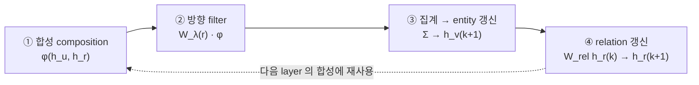

# S14B — CompGCN: 합성 기반 관계 표현

> Ch.5 ML/DL · Day 7
> 원자료: DSBA Lab Study 강의 슬라이드 45장 중 `03 CompGCN` · `04 Discussion` (p29~44)
> 인용 논문
> · Vashishth, Sanyal, Nitin, Talukdar (2020), *Composition-based Multi-Relational Graph
>   Convolutional Networks*, ICLR 2020 ([arXiv:1911.03082](https://arxiv.org/abs/1911.03082))
>
> 📖 [강의 목차](README.md) · 이전 [S14A R-GCN](S14A-R-GCN-관계별-메시지-전달.md)
> 📎 부록 [S14-1 읽는 데 필요한 것들](S14-1-읽는-데-필요한-것들.md) · [S14-2 이웃에서 오는 표현](S14-2-이웃에서-오는-표현.md)

[S14A](S14A-R-GCN-관계별-메시지-전달.md)의 R-GCN은 relation을 행렬로 두었다. 관계마다 행렬이
따로라 관계 수가 늘면 파라미터가 그만큼 늘고, relation 자체는 표현을 갖지 못한다. CompGCN이 그
두 지점을 겨냥한다.

절 번호는 이 문서에서 1부터 다시 시작한다. 앞 문서의 절을 가리킬 때는 `S14A N절`로 적는다.

**이 문서도 슬라이드 내용만 담는다.** 식과 표기를 읽는 법은
[S14-1](S14-1-읽는-데-필요한-것들.md)에, 강의 밖 해석은 [S14-2](S14-2-이웃에서-오는-표현.md)에 있다.

---

## 1. CompGCN 소개

> Composition-based Multi-Relational Graph Convolutional Networks
> Vashishth, Sanyal, Nitin, Talukdar · ICLR 2020

- entity와 relation을 **함께 업데이트**하는 CompGCN을 제안한다
- KG embedding의 entity–relation **composition operator**를 GCN message에 활용한다
- Relation 수가 증가해도 확장 가능한 parameter-efficient 구조를 목표로 한다
- Link prediction, node classification, graph classification에서 모델을 평가한다

## 2. CompGCN Motivation

- R-GCN은 relation 정보를 **relation-specific matrix**에 담는다
- Relation 수가 많으면 matrix parameter와 rare relation의 학습 부담이 커진다
- 기존 relational GCN은 주로 **node embedding만** 생성한다
- CompGCN은 relation을 vector로 표현해 node와 함께 학습하고 message에 직접 사용한다

CompGCN Table 1이 계열을 정리한다.

| Methods | Node Embeddings | Directions | Relations | Relation Embeddings | Number of Parameters |
|---|---|---|---|---|---|
| GCN (Kipf & Welling, 2016) | ○ | | | | O(Kd²) |
| Directed-GCN (Marcheggiani & Titov, 2017) | ○ | ○ | | | O(Kd²) |
| Weighted-GCN (Shang et al., 2019) | ○ | | ○ | | O(Kd² + K\|R\|) |
| Relational-GCN (Schlichtkrull et al., 2017) | ○ | ○ | ○ | | O(BKd² + BK\|R\|) |
| CompGCN (Proposed) | ○ | ○ | ○ | ○ | O(Kd² + Bd + B\|R\|) |

Relation Embeddings 열이 CompGCN에만 있다. 강의가 한 줄로 요약한다.
Relation matrix (R-GCN) → Relation embedding + composition (CompGCN).

## 3. Model Overview

- 각 edge에서 neighboring entity와 relation embedding에 **φ(·)를 적용**한다
- 합성된 message에 original, inverse, self-loop **방향별 filter**를 적용한다
- 모든 neighbor message를 합쳐 central entity embedding을 업데이트한다
- Relation embedding도 별도 transformation을 거쳐 다음 layer로 전달된다

한 layer가 네 단계다.



- 각 edge (u, r)마다 이웃 entity와 relation을 φ로 먼저 합성한다
- 합성된 message에 방향별 filter W_λ(r)를 적용한다
- 모든 이웃 message를 합쳐 중심 entity를 h_v^(k+1)로 갱신한다
- Relation도 W_rel을 거쳐 h_r^(k+1)로 갱신되어 **다음 layer의 합성에 재사용된다**

논문 Figure 1의 예시는 Christopher Nolan을 중심에 두고 London(`Born-in`), United
Kingdom(`Citizen-of`), The Dark Knight(`Directed-by`)와 각각의 역관계가 붙은 그래프다. 오른쪽
그림에서 각 엣지마다 φ 노드가 끼어 있고 그 출력에 W_O / W_I / W_S가 붙는다.

## 4. Composition operator

| 구분 | Subtraction (Sub) | Multiplication (Mult) | Circular correlation (Corr) |
|---|---|---|---|
| 수식 | φ(e_s, e_r) = e_s − e_r | φ(e_s, e_r) = e_s * e_r | φ(e_s, e_r) = e_s ★ e_r |
| 대응 KGE | TransE | DistMult | HolE |
| 직관 | relation을 이동으로 해석 | 차원별 매칭 강도로 해석 | 차원 간 상호작용을 압축 |
| 특징 | 단순하고 안정적 | KG embedding과 궁합이 좋음 | 표현력이 높고 파라미터가 적음 |

- Subtraction은 translational interaction을 표현한다
- Multiplication은 dimension-wise matching을 표현한다
- Circular correlation은 차원 간 상호작용을 고정 크기 vector로 압축한다
- **Composition operator는 message가 relation을 해석하는 inductive bias가 된다**

> 대응 KGE 열이 [S13](S13-KG-임베딩-기초.md)에서 다룬 모델들과 그대로 겹친다. 점수함수의
> 귀납 편향 논의가 여기로 옮겨온 것이다.

## 5. Update equation — R-GCN과의 대비

```
R-GCN      h_i^(l+1) = σ ( Σ_r,j  (1/c_i,r) · W_r · h_j )
                                              ───
                                              relation 마다 다른 matrix 를 선택

CompGCN    h_v^(k+1) = f ( Σ_(u,r)∈N(v)  W_λ(r) · φ(h_u, h_r) )
                                          ──────   ───────────
                                          방향 3개   entity 와 relation 을 먼저 합성

           h_r^(k+1) = W_rel^(k) · h_r^(k)
```

- R-GCN message는 `W_r · h_u`처럼 relation별 matrix를 **선택**한다
- CompGCN message는 `W_λ(r) · φ(h_u, h_r)`로 entity와 relation을 먼저 **합성**한다
- W_O, W_I, W_S는 original, inverse, self-loop **방향만** 구분한다
- **Relation 의미는 h_r이, 방향 차이는 W_λ(r)가 담당한다**

강의가 아래에 붙인 문장은 이것이다. 방향 filter는 relation 수와 무관하게 3개로 고정된다.

> 두 식을 기호별로 푼 것은 [S14-1 6절](S14-1-읽는-데-필요한-것들.md#6-식-읽기)에 있다.

## 6. Worked example

같은 triple에서 operator에 따라 다른 message가 나온다.

```
h_u = [2, 1]   이웃 entity embedding
h_r = [1, 3]   relation embedding

Subtraction (TransE 계열)    [2,1] − [1,3] = [ 1, −2]
Multiplication (DistMult 계열) [2,1] * [1,3] = [ 2,  3]
```

Operator 선택이 message의 inductive bias를 바꾼다. 같은 triple에서도 서로 다른 message가
생성된다.

## 7. entity와 relation이 함께 진화한다

```mermaid
graph LR
  E0["h_v(0)"] --> E1["h_v(1)"] --> E2["h_v(2)"]
  R0["h_r(0)"] --> R1["h_r(1)"] --> R2["h_r(2)"]
  R0 -.->|φ(h_u, h_r)| E1
  R1 -.->|φ(h_u, h_r)| E2
```

- Node는 neighbor–relation composition을 집계해 h_v^(k+1)로 업데이트된다
- Relation은 공통 transformation W_rel^k를 통해 h_r^(k+1)로 업데이트된다
- 갱신된 relation embedding은 **다음 layer의 composition에 다시 사용된다**
- 초기 relation feature가 존재하면 Z를 입력 representation으로 활용할 수 있다

## 8. Parameter efficiency

- CompGCN은 node, direction, relation, relation embedding을 모두 명시적으로 처리한다
- R-GCN의 parameter complexity는 O(BKd² + BK|R|)로 제시된다
- CompGCN은 relation basis vector를 사용해 O(Kd² + Bd + B|R|)로 제시된다
- φ와 W_λ(r) 선택에 따라 GCN, R-GCN, D-GCN, W-GCN으로 **환원 가능하다**

CompGCN Table 2가 환원 관계를 보여준다.

| Methods | W_λ(r)^k | φ(h_u^k, h_r^k) |
|---|---|---|
| Kipf-GCN (Kipf & Welling, 2016) | W^k | h_u^k |
| Relational-GCN (Schlichtkrull et al., 2017) | W_r^k | h_u^k |
| Directed-GCN (Marcheggiani & Titov, 2017) | W_dir(r)^k | h_u^k |
| Weighted-GCN (Shang et al., 2019) | W^k | α_r^k h_u^k |

φ(h_u, h_r) = h_u로 두고 W_λ(r) = W로 두면 GCN이 되고, φ = h_u이고 W를 relation별로 두면
R-GCN이 된다. 기존 모델들이 φ 자리에 h_u만 넣은 특수 사례라는 정리다.

> `O(...)` 표기를 읽는 법은 [S14-1 6절](S14-1-읽는-데-필요한-것들.md#6-식-읽기)에 있다.

## 9. 실험 설계

| Task | Dataset | Metric | Main Question |
|---|---|---|---|
| Link prediction | FB15k-237 · WN18RR | MRR · MR · Hits@N | 기존 KGE·GCN 대비 성능이 향상되는가 |
| Node classification | MUTAG · AM | Accuracy | node-level task에서도 유효한가 |
| Graph classification | MUTAG · PTC | Accuracy | graph-level 표현으로 확장되는가 |

추가 실험으로 composition operator, basis 수, relation 수의 영향을 분석한다.

## 10. Link prediction 결과

CompGCN Table 3에서 CompGCN 행과 주요 비교 대상만 옮겼다.

| Method | FB15k-237 MRR | MR | H@10 | H@3 | H@1 | WN18RR MRR | MR | H@10 | H@3 | H@1 |
|---|---|---|---|---|---|---|---|---|---|---|
| TransE (2013) | .294 | 357 | .465 | - | - | .226 | 3384 | .501 | - | - |
| DistMult (2014) | .241 | 254 | .419 | .263 | .155 | .43 | 5110 | .49 | .44 | .39 |
| ComplEx (2016) | .247 | 339 | .428 | .275 | .158 | .44 | 5261 | .51 | .46 | .41 |
| R-GCN (2017) | .248 | - | .417 | - | .151 | - | - | - | - | - |
| ConvE (2018) | .325 | 244 | .501 | .356 | .237 | .43 | 4187 | .52 | .44 | .40 |
| SACN (2019) | .35 | - | .54 | .39 | .26 | .47 | - | .54 | .48 | .43 |
| RotatE (2019) | .338 | 177 | .533 | .375 | .241 | .476 | 3340 | .571 | .492 | .428 |
| ConvR (2019) | .350 | - | .528 | .385 | .261 | .475 | - | .537 | .489 | .443 |
| CompGCN | .355 | 197 | .535 | .390 | .264 | .479 | 3533 | .546 | .494 | .443 |

- CompGCN은 FB15k-237에서 MRR 0.355, H@3 0.390, H@1 0.264를 기록한다
- 논문은 **5개 지표 중 4개에서 우수하다고 서술한다**
- 표 수치상 MR은 RotatE가 더 낮고 H@10은 SACN이 더 높으며 H@3는 SACN과 동률이다
- 핵심 결과는 당시 baseline 대비 강한 MRR이지만 모든 지표의 단독 최고 성능은 아니다

> 세 번째 항목은 강의가 논문의 서술을 표와 대조해 짚은 것이다.
> [S14-2 10절](S14-2-이웃에서-오는-표현.md#10-자료-대조)에 정리했다.

## 11. Composition operator × decoder

CompGCN Table 4다. encoder를 CompGCN으로 고정하고 operator와 decoder를 바꿔가며 잰다.

| Methods ↓ / Scoring Function → | TransE MRR | DistMult MRR | ConvE MRR |
|---|---|---|---|
| X (encoder 없음) | 0.294 | 0.241 | 0.325 |
| X + D-GCN | 0.299 | 0.321 | 0.344 |
| X + R-GCN | 0.281 | 0.324 | 0.342 |
| X + W-GCN | 0.267 | 0.324 | 0.344 |
| X + CompGCN (Sub) | 0.335 | 0.336 | 0.352 |
| X + CompGCN (Mult) | **0.337** | **0.338** | 0.353 |
| X + CompGCN (Corr) | 0.336 | 0.335 | **0.355** |

- TransE decoder에서는 Mult가 MRR 0.337로 가장 높다
- DistMult decoder에서도 Mult가 0.338로 가장 높다
- ConvE decoder에서는 Corr가 0.355로 가장 높다
- **Composition은 독립적인 만능 선택이 아니라 encoder–decoder 조합의 일부다**

> 최적 operator가 decoder마다 달라진다는 것은 [S14A 21절](S14A-R-GCN-관계별-메시지-전달.md)의
> 실험 설계와 대비된다. [S14-2 6절](S14-2-이웃에서-오는-표현.md#6-실험-설계가-대비된다)에 적었다.

## 12. Relation basis vector

- CompGCN은 relation마다 독립 embedding을 두지 않고 basis vector의 **선형결합**으로 표현한다
- 학습되는 것은 공유 basis vector와 relation별 결합 계수뿐이다
- **R-GCN의 basis는 변환 matrix를 공유하고 CompGCN의 basis는 relation vector를 공유한다**
- Basis 수 B가 작아도 relation 수가 늘어날 때 parameter 증가를 억제할 수 있다

```
h 소속 = 0.7·z₁ + 0.2·z₂ + 0.1·z₃
h 저자 = 0.4·z₁ + 0.5·z₂ + 0.1·z₃
h 인용 = 0.2·z₁ + 0.3·z₂ + 0.5·z₃
```

> [S14A 9절](S14A-R-GCN-관계별-메시지-전달.md)의 R-GCN basis와 형태가 같지만 공유하는 대상이
> 다르다. [S14-1 7절](S14-1-읽는-데-필요한-것들.md#7-basis와-block을-숫자로)에서 갈라놨다.

## 13. Scalability

- Basis 수가 증가할수록 full relation embedding model의 MRR에 가까워진다
- B = 5인 CompGCN도 relation 수가 달라질 때 full model 대비 유사한 성능을 유지한다
- 동일한 relation 수 조건에서 CompGCN B = 5가 R-GCN보다 높은 MRR을 기록한다
- 결과는 relation matrix보다 **relation basis vector가 더 효율적일 수 있음**을 보여준다

Figure 3에서 basis 수를 5까지 줄여도 상대 MRR이 97.2%로 유지된다 (100개일 때 99.4%, 50개일 때
98.6%, 25개일 때 98.0%). Figure 4는 같은 relation 수에서 CompGCN(B=5)과 R-GCN을 비교하는데
전 구간에서 CompGCN이 위에 있다 (전체 0.345 대 0.342, 100개 0.331 대 0.325, 50개 0.316 대
0.308, 25개 0.321 대 0.316, 10개 0.269 대 0.265).

## 14. Node · graph classification

CompGCN Table 5다.

**Node classification**

| Model | MUTAG (Node) | AM |
|---|---|---|
| Feat | 77.9 | 66.7 |
| WL | 80.9 | 87.4 |
| RDF2Vec | 67.2 | 88.3 |
| R-GCN | 73.2 | 89.3 |
| SynGCN | 74.8 ± 5.5 | 86.2 ± 1.9 |
| WGCN | 77.9 ± 3.2 | 90.2 ± 0.9 |
| CompGCN | 85.3 ± 1.2 | 90.6 ± 0.2 |

**Graph classification**

| Model | MUTAG (Graph) | PTC |
|---|---|---|
| PATCHY-SAN | 92.6 ± 4.2 | 60.0 ± 4.8 |
| DGCNN | 85.8 | 58.6 |
| GIN | 89.4 ± 4.7 | 64.6 ± 7.0 |
| R-GCN | 82.3 ± 9.2 | 67.8 ± 13.2 |
| SynGCN | 79.3 ± 10.3 | 69.4 ± 11.5 |
| WGCN | 78.9 ± 12.0 | 67.3 ± 12.0 |
| CompGCN | 89.0 ± 11.1 | 71.6 ± 12.0 |

- MUTAG node classification에서 CompGCN은 85.3으로 비교 모델 중 가장 높다
- AM node classification에서도 90.6으로 가장 높은 accuracy를 기록한다
- PTC graph classification에서는 71.6으로 비교 모델 중 가장 높다
- MUTAG graph classification 89.0은 PATCHY-SAN 92.6보다 낮고 GIN 89.4와 유사하다

> `±` 뒤 숫자가 결론을 바꾼다.
> [S14-1 10절](S14-1-읽는-데-필요한-것들.md#10-실험-파트-읽는-법)에 적었다.

node classification은 확실하게 앞서고 graph classification은 갈린다. 표준편차도 눈에 띈다.
graph classification 쪽은 ±11~12로 커서 차이를 단정하기 어렵다.

## 15. R-GCN과 CompGCN

| 구분 | R-GCN (2017) | CompGCN (2020) |
|---|---|---|
| Message | Σ_r,j (1/c_i,r) W_r h_j | Σ_u,r W_λ(r) φ(h_u, h_r) |
| Relation 표현 | relation별 transformation matrix | 학습되는 relation embedding |
| Direction | canonical / inverse를 별도 relation으로 | 방향별 filter (original / inverse / self) |
| Parameter sharing | basis · block decomposition | relation basis vector 공유 |
| Supported output | entity embedding | entity + relation embedding |
| Training target | node label / positive–negative triple | 동일 + relation embedding 동시 학습 |
| Inference output | entity type · candidate ranking | entity type · candidate ranking · graph label |
| Main limitation | relation 수 증가에 취약 | composition 효과가 decoder에 의존 |

- R-GCN은 relation-specific matrix로 relational message passing의 기본 구조를 확립했다
- CompGCN은 relation embedding과 composition을 도입해 entity와 relation을 함께 업데이트한다
- R-GCN의 basis는 matrix를 공유하고 CompGCN의 basis는 relation vector를 공유한다
- 두 모델의 핵심 차이는 relation 의미를 **어디에 저장하고 어떻게 공유하는가**에 있다

강의가 제목으로 뽑은 문장이 전환을 요약한다. relation as a matrix selector에서 relation as a
learnable representation으로.

---

## 관련 문서

- [S14A — R-GCN: 관계별 메시지 전달](S14A-R-GCN-관계별-메시지-전달.md) — 같은 회차의 앞부분
- [S14-1 — 읽는 데 필요한 것들](S14-1-읽는-데-필요한-것들.md) — 용어, 식 읽기, 학습 절차
- [S14-2 — 이웃에서 오는 표현](S14-2-이웃에서-오는-표현.md) — 강의 밖 해석과 인사이트
- [S13 — KG 임베딩 기초](S13-KG-임베딩-기초.md) — composition operator에 대응하는 TransE·DistMult·HolE
- [S13-1 — 기호와 좌표 사이](S13-1-기호와-좌표-사이.md) — 논문 간 수치 비교 문제
- [00 — 전체 파이프라인](00-전체-파이프라인.md) — 임베딩 계열이 붙는 자리
