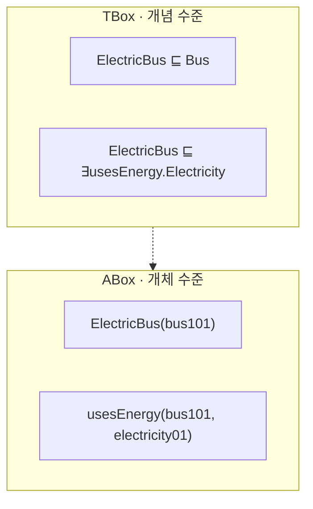
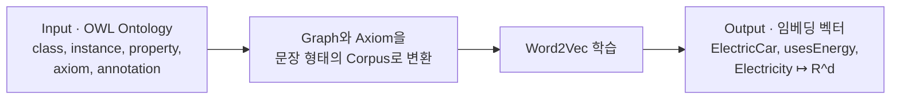
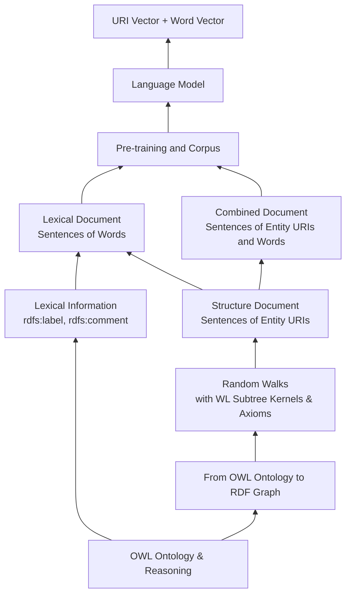
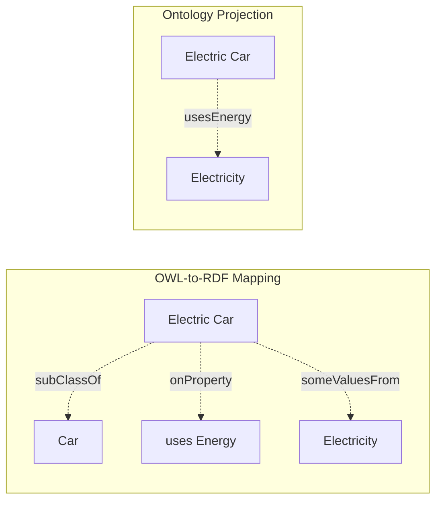

# S15A — OWL2Vec*: 온톨로지를 문장으로 바꾸는 임베딩

> Ch.5 ML/DL · Day 8
> 원자료: DSBA Lab Study 강의 슬라이드 `1 Ontology` · `2 OWL2Vec*` (p5~)
> 참고 논문
> · Chen, Hu, Jiménez-Ruiz, Holter, Antonyrajah, Horrocks (2021), _OWL2Vec*: Embedding of
>   OWL Ontologies_, Machine Learning 110(7) ([arXiv:2009.14654](https://arxiv.org/abs/2009.14654)
>   · [코드](https://github.com/KRR-Oxford/OWL2Vec-Star))
> · 슬라이드 표기: Machine Learning, 2021, Citation 296
>
> 📖 [강의 목차](README.md) · [YouTube 재생목록](https://www.youtube.com/watch?v=f0WV7b3lGqM&list=PLFHGWfB_kmrs)
> 이전 [S14B CompGCN](S14B-CompGCN-합성-기반-관계-표현.md) · 다음 [S15B EL Embeddings](S15B-EL-Embeddings-기하-기반-임베딩.md)
> 📎 부록 [S15-1 읽는 데 필요한 것들](S15-1-읽는-데-필요한-것들.md) · [S15-2 공리를 어디에 두는가](S15-2-공리를-어디에-두는가.md)

**한 회차를 두 문서로 나눴다.** 이 문서가 온톨로지 임베딩의 도입부와 OWL2Vec*을,
[S15B](S15B-EL-Embeddings-기하-기반-임베딩.md)가 EL Embeddings와 두 접근의 비교를 다룬다.
절 번호는 문서마다 1부터 다시 시작한다.

**이 문서는 슬라이드 내용만 담는다.** 슬라이드가 설명 없이 쓰는 용어(Word2Vec, skip-gram,
random walk, WL kernel, IRI, Manchester Syntax, MRR·Hits@k)는
[S15-1](S15-1-읽는-데-필요한-것들.md)에, 강의 밖에서 나온 해석은
[S15-2](S15-2-공리를-어디에-두는가.md)에 있다.

---

## 1. 온톨로지의 네 구성 요소

- 온톨로지는 특정 도메인의 **개념(Class)**, 개체(Instance), 관계(Property), 논리적 제약(Axiom)을
  명시적으로 정의한 지식 표현 체계다
- 단순한 데이터 나열이 아니라 "개념 간 관계 + 논리적 제약"까지 포함한다

| 요소 | 예시 |
|---|---|
| Class | `Car` · `Bus` · `ElectricBus` · `Electricity` |
| Property | `usesEnergy` · `hasPart` |
| Axiom | `ElectricBus ⊑ Bus` · `ElectricBus ⊑ ∃usesEnergy.Electricity` |

## 2. TBox와 ABox

- **TBox**는 클래스와 관계에 대한 일반적인 정의와 규칙이다. "무엇이 어떤 개념인가"에 답한다
- **ABox**는 구체적인 개체에 대한 사실이다. "실제 대상"을 가리킨다



## 3. 온톨로지와 지식그래프의 차이

| | Knowledge Graph | Ontology |
|---|---|---|
| 구성 | Entity-Relation-Entity triple의 집합 | Class · Property · Axiom을 포함 |
| 표현하는 것 | 누가 누구와 연결되는가 | 연결이 어떤 논리적 의미를 가지는가 |
| 제약 | 논리적 제약 없이 관계 나열에 집중 | 논리 공리를 이용한 추론이 가능 |
| 중심 | ABox 중심 | TBox도 표현 |
| 예시 | `usesEnergy(bus101, electricity01)` | `ElectricCar ⊑ ∃usesEnergy.Electricity` |

## 4. RDF와 OWL

**RDF (Resource Description Framework)**

- 웹상의 자원이나 개체를 주어-관계-목적어 triple로 표현하는 데이터 모델
- 엔티티 사이의 명시적인 연결을 그래프 형태로 표현한다
- 각 triple이 하나의 edge가 되며 그래프 탐색에 적합하다

**OWL (Web Ontology Language)**

- 클래스, 관계, 제약, 공리 등 온톨로지의 논리적 의미를 표현하는 언어

## 5. 온톨로지를 왜 임베딩하는가

- 기호 기반인 온톨로지는 ML/DL 모델에 직접 사용하기 어렵다
- 벡터 공간에 표현하면 유사도 계산이나 클러스터링 등 다양한 task를 수행할 수 있다
- 빠진 관계나 공리를 예측하는 task가 가능해지고, 대규모 온톨로지를 효율적으로 활용할 수 있다

강의가 뽑은 한 줄은 이렇다. "논리적 정보를 유지하면서 계산 가능한 형태로 바꾸려는 시도."

## 6. 온톨로지 임베딩의 세 질문과 두 갈래

| | 질문 |
|---|---|
| RQ1 | 온톨로지의 어떤 정보를 임베딩에 반영할 것인가 |
| RQ2 | 논리적 의미를 어떻게 보존할 것인가 |
| RQ3 | 학습된 임베딩을 어디에 활용할 것인가 |

이 질문에 두 모델이 다르게 답한다.

| | OWL2Vec* | EL Embeddings |
|---|---|---|
| 반영 대상 | 그래프 구조 · 자연어 정보 · 논리 공리를 함께 활용 | EL++ 논리 공리의 의미를 공간에 직접 보존 |
| 방법 | 정보를 문장 corpus로 변환한 뒤 Word2Vec으로 학습 | 클래스를 영역, 관계를 이동 벡터로 표현해 공간적인 개념으로 나타냄 |

EL Embeddings는 [S15B](S15B-EL-Embeddings-기하-기반-임베딩.md)에서 다룬다.

---

## 7. 기존 임베딩 연구의 한계

- 기존 Knowledge Graph 임베딩은 주로 graph structure와 RDF triple을 학습한다
- OWL ontology에는 logical constructors와 lexical information도 함께 존재한다
- 기존 방법들은 이 정보를 통합적으로 활용하지 못한다

| | 기존 KG 임베딩 | OWL ontology |
|---|---|---|
| 대상 | `(BlondeBeer, hasNutrient, VitaminC)` | `ElectricCar ⊑ ∃usesEnergy.Electricity` |
| 성격 | Entity-Relation-Entity 형태의 명시적 triple | 모든 ElectricCar 인스턴스가 Electricity를 사용한다는 논리적 제약 |
| 학습하는 것 | 그래프 연결 구조와 주변 이웃 | |

슬라이드가 이 자리에서 요구를 적어둔다. "OWL ontology 구조·텍스트·논리를 함께 표현하는 임베딩이 필요."

## 8. OWL2Vec*이 하는 일

- OWL Ontology를 **Word2Vec이 학습 가능한 벡터로 만드는 프레임워크**다



## 9. OWL2Vec*이 활용하는 세 가지 정보

| | Graph Structure | Lexical Information | Logical Constructors |
|---|---|---|---|
| 무엇을 주는가 | 어떤 엔티티와 연결되는가 | 해당 개념이 자연어로 무엇을 의미하는지 | 클래스가 어떤 논리적 조건을 만족해야 하는지 |
| 담기는 정보 | 클래스 계층, 인스턴스 및 속성 관계 | `rdfs:label`로 사람이 읽을 수 있는 이름 | 공리를 Manchester Syntax 형태의 토큰 문장으로 변환 |
| 부가 | 주변 엔티티와의 연결 정보를 넣기 위함 | comment · definition · synonym 같은 annotation에서 자연어 설명 추출 | |
| 예시 | `ElectricCar --subClassOf--> Car` | Label "Electric Car" · Definition "A vehicle powered by electrical energy." | `ElectricCar ⊑ ∃usesEnergy.Electricity` → `ElectricCar subClassOf usesEnergy some Electricity` |

세 가지를 각각 문장 형태로 만든 뒤 Word2Vec을 통해 임베딩으로 바꾼다.

## 10. OWL2Vec에서 OWL2Vec*로

| OWL2Vec (2019) | OWL2Vec* (2020) |
|---|---|
| 온톨로지의 연결 관계를 중심으로 학습 | 구조에 텍스트와 논리를 함께 추가 |
| 온톨로지 그래프에서 주변 엔티티를 탐색 | 그래프를 더 다양한 방식으로 탐색 |
| 연결 경로를 문장처럼 만들어 Word2Vec으로 학습 | label · comment · definition 등 자연어 정보 활용 |
| 클래스와 관계의 구조적 문맥을 벡터에 반영 | 논리 공리를 별도의 학습 문장으로 추가 |
| 텍스트 정보와 복잡한 논리 표현의 활용은 제한적 | IRI 벡터와 단어 벡터를 함께 사용 |

OWL2Vec이 다루던 것은 `ElectricCar --subClassOf--> Car --subClassOf--> Vehicle`,
`ElectricCar --usesEnergy--> Electricity` 같은 경로였다. OWL2Vec*은 여기에
`ElectricCar ⊑ ∃usesEnergy.Electricity` 자체를 학습 문장으로 넣는다.

---

## 11. 프레임워크 네 단계

| 단계 | 하는 일 |
|---|---|
| ① Input (OWL Ontology) | 클래스, 인스턴스, 속성, 논리 공리 등이 포함된 입력 |
| ② Ontology Exploration | OWL 공리를 노드와 edge로 구성된 RDF 그래프로 변환하고, Random Walk로 각 엔티티의 연결관계를 학습 |
| ③ Corpus Generation | Structure · Lexical · Combined Document의 corpus를 생성해 Word2Vec에 입력 |
| ④ Training and Output | 생성된 corpus를 Word2Vec skip-gram으로 학습하고 임베딩 벡터를 출력 |



## 12. Step 1 — OWL Ontology를 RDF 그래프로

- OWL ontology를 탐색이 가능한 RDF 그래프로 변환하는 단계다
- 온톨로지를 문장으로 만들려면 먼저 그래프로 만들고 이후에 random walk를 수행해야 한다

변환 방식이 두 가지다.

| | OWL-to-RDF Mapping | Ontology Projection |
|---|---|---|
| 방식 | 하나의 복잡한 공리를 여러 RDF triple로 변환 | 핵심 엔티티를 직접 연결 |
| 논리 구조 | Restriction · someValuesFrom 등 논리 구조를 유지 | 복잡한 공리를 하나의 직접적인 triple로 단순화 |
| 그래프 모양 | 중간 노드가 생겨 경로가 길고 복잡해짐 | 중간 노드가 없어 Random Walk가 쉬움 |
| 평가 | 의미를 잘 보존하지만 복잡함 | 간결하지만 논리 의미를 근사함 |



## 13. Step 2 — Structure Document: Random Walk

- RDF 그래프 위에서 random walk를 수행하고, 그 결과를 Word2Vec에 넣을 문장으로 정리한다
- 특정 엔티티를 시작점으로 잡고 연결된 경로를 무작위로 선택한다
- 미리 정한 길이만큼 이동하며 지나온 순서를 하나의 문장으로 만든다

`AIStudent`가 `subClassOf`로 `Student`에, `Student`가 `subClassOf`로 `Person`에,
`AIStudent`가 `studies`로 `Artificial Intelligence`에 연결된 그래프에서 경로 하나를 뽑으면
이렇게 된다.

```
AIStudent → subClassOf → Student → subClassOf → Person
```

생성 문장은 `AI Student subClassOf Student subClassOf Person`이다.

## 14. Step 2 — Structure Document: WL Kernel과 논리 공리

- random walk만으로 부족한 정보를 보완하는 step이다
- random walk만으로는 주변에 다른 어떤 노드들이 연결되어 있는지 충분히 반영되지 않을 수 있다
- **WL kernel은 노드 주변의 연결 모양을 하나의 구조 태그로 요약하는 역할**을 한다
- 경로뿐 아니라 중요 노드 주변의 모양도 간접적으로 반영할 수 있다

```
f_WL(node, depth) → neighborhood ID
```

`AIStudent`의 `studies` 방향은 `Structure_ID_37`, `subClassOf` 방향은 `Structure_ID_12`처럼
하나의 태그로 바뀐다. 최종 모양은 이렇다.

```
Structure Document = Random Walk 문장 + 주변 구조 정보 + OWL 공리 문장
```

## 15. Step 3 — Lexical Semantics 담기

- IRI로 구성된 Structure 문장을 사람이 이해할 수 있는 단어 문장으로 바꾸는 과정이다
- IRI(Internationalized Resource Identifier)는 온톨로지 안의 클래스, 인스턴스, 속성을 고유하게
  식별하는 이름이다
- 온톨로지 안에 있는 개념이나 관계에 붙이는 전 세계적으로 겹치지 않는 고유 주소다
  (`http://example.org/transport/ElectricBus`, 짧게 `ex:ElectricBus`)

**① IRI 문장을 자연어 문장으로 변환**

```
CityBus → rdf:type → ElectricBus → subClassOf → PublicTransport
city bus → type → electric bus → subclass of → public transport
```

**② Definition·Comment 등의 설명 문장 추가**

- 부가적인 설명을 정보로 더 추가하는 부분이다
- `rdfs:comment` "A bus powered by electrical energy"

**③ 최종 생성된 학습 문장**

```
city bus type electric bus subclass of public transport
electric bus a bus powered by electrical energy
```

## 16. Step 4 — Combined Document

- IRI 문장과 자연어 문장을 섞은 문장을 추가해서, 두 문장이 서로 대응된다는 것을 Word2Vec이
  학습하게 하는 과정이다
- Structure 문장에서 일부 IRI는 그대로 남기고, 나머지는 자연어 단어로 바꿔 같이 주입한다

```
ex:ElectricBus uses energy electricity
electric bus ex:usesEnergy electricity
```

이렇게 자연어와 IRI가 섞인 문장들을 생성해서 Word2Vec에 넣는 후보로 만든다.

---

## 17. Downstream Task — Ontology Completion

**Class Membership Prediction**

- 특정 인스턴스가 어떤 클래스에 속하는가를 예측한다
- `bus_101` 인스턴스가 어느 클래스에 속하는지를 예측하는 task를 예로 든다
  - 모델 입력: `bus_101`의 벡터 + `ElectricBus`의 벡터
  - 예측 결과: `ElectricBus` 0.92, `GasolineBus` 0.04
- 특정 인스턴스가 어떤 클래스에 들어갈지의 예측 모델로 활용한다

**Class Subsumption Prediction**

- 특정 클래스가 어떤 상위 클래스에 포함되는가를 예측한다
- `ElectricSchoolBus`라는 클래스가 새로 정의된 상황을 예로 든다
  - 모델 입력: `ElectricSchoolBus`의 벡터 + `ElectricBus`의 벡터
  - 예측 결과: `ElectricBus`의 하위 클래스 0.88, `GasolineBus`의 하위 클래스 0.07
- 주로 Random Forest를 사용해 각 후보 관계의 점수를 계산하고, 점수가 높은 후보부터 순위를 매겨
  분류한다

## 18. 실험 설정

| Ontology | 특징 | 예측 과제 |
|---|---|---|
| HeLis | 음식·건강 생활 지식, 다수의 인스턴스 포함 | Class Membership Prediction |
| FoodOn | 대규모 음식 클래스 계층 | Class Subsumption Prediction |
| Gene Ontology | 생명과학 개념의 대규모 클래스 계층 | Class Subsumption Prediction |

- 기본 Classifier는 Random Forest를 사용하고 Candidate Ranking을 수행한다
- 평가 지표는 Hits@1, Hits@5, Hits@10, MRR이다 (📎 [S15-1](S15-1-읽는-데-필요한-것들.md))

## 19. 결과

- OWL2Vec*는 HeLis, FoodOn, GO의 모든 실험에서 가장 높은 성능을 기록했다
- Pre-trained Word2Vec도 강한 성능을 보여, label과 클래스 이름 같은 lexical information의
  중요성을 확인했다
- 그래프 또는 logic 정보만 사용하는 기존 임베딩보다 구조·텍스트·논리를 함께 활용하는 방식이
  효과적이다

**HeLis (Class Membership Prediction)**

| Method | MRR | Hits@1 | Hits@5 | Hits@10 |
|---|---|---|---|---|
| Transformer (label) | 0.657 | 0.515 | 0.824 | 0.897 |
| Transformer (all text) | 0.599 | 0.390 | 0.870 | 0.912 |
| RDF2Vec | 0.345 | 0.219 | 0.460 | 0.655 |
| TransE | 0.181 | 0.09 | 0.232 | 0.355 |
| TransR | 0.298 | 0.184 | 0.391 | 0.559 |
| DistMult | 0.253 | 0.166 | 0.304 | 0.437 |
| Quantum Embedding | 0.159 | 0.132 | 0.163 | 0.190 |
| Onto2Vec | 0.211 | 0.108 | 0.268 | 0.397 |
| OPA2Vec | 0.237 | 0.146 | 0.286 | 0.408 |
| OWL2Vec | 0.335 | 0.215 | 0.397 | 0.601 |
| Pre-trained Word2Vec | 0.899 | 0.877 | 0.923 | 0.933 |
| OWL2Vec* | **0.953** | **0.932** | **0.978** | **0.987** |

**FoodOn · GO (Class Subsumption Prediction)**

| Method | FoodOn MRR | Hits@1 | Hits@5 | Hits@10 | GO MRR | Hits@1 | Hits@5 | Hits@10 |
|---|---|---|---|---|---|---|---|---|
| Transformer (label) | 0.016 | 0.005 | 0.027 | 0.046 | 0.009 | 0.001 | 0.009 | 0.018 |
| Transformer (all text) | 0.022 | 0.011 | 0.032 | 0.050 | 0.014 | 0.008 | 0.017 | 0.019 |
| RDF2Vec | 0.078 | 0.053 | 0.097 | 0.119 | 0.043 | 0.017 | 0.057 | 0.087 |
| TransE | 0.029 | 0.011 | 0.044 | 0.065 | 0.015 | 0.005 | 0.018 | 0.030 |
| TransR | 0.072 | 0.044 | 0.093 | 0.130 | 0.048 | 0.016 | 0.076 | 0.113 |
| DistMult | 0.076 | 0.045 | 0.099 | 0.134 | 0.046 | 0.018 | 0.68 | 0.097 |
| EL Embedding | 0.040 | 0.014 | 0.067 | 0.099 | 0.018 | 0.005 | 0.021 | 0.036 |
| Onto2Vec | 0.034 | 0.014 | 0.047 | 0.064 | 0.024 | 0.008 | 0.031 | 0.053 |
| OPA2Vec | 0.093 | 0.058 | 0.117 | 0.156 | 0.075 | 0.032 | 0.106 | 0.157 |
| OWL2Vec | 0.091 | 0.052 | 0.121 | 0.152 | 0.031 | 0.012 | 0.040 | 0.067 |
| Pre-trained Word2Vec | 0.136 | 0.089 | 0.175 | 0.227 | 0.123 | 0.055 | 0.177 | 0.260 |
| OWL2Vec* | **0.213** | **0.143** | **0.287** | **0.357** | **0.170** | **0.076** | **0.258** | **0.376** |

> 표는 슬라이드 값을 그대로 옮겼다. GO의 DistMult Hits@5가 0.68로 적혀 있는데 같은 행의
> Hits@1 0.018, Hits@10 0.097과 맞지 않는다. 0.068의 오기로 보이지만 확인하지 않았으므로
> 원표기를 남긴다.

같은 표에 EL Embedding 행이 이미 들어 있다. [S15B](S15B-EL-Embeddings-기하-기반-임베딩.md)에서
다룰 모델이 여기서는 비교 대상 중 하나로 등장한다.

## 20. Ablation Study

- Lexical Document를 추가하면 세 데이터셋 모두에서 성능이 향상된다
- Word vector가 IRI vector보다 전반적으로 높은 성능을 보인다
- Combined Document의 효과는 제한적이며, 일부 설정에서는 오히려 성능이 감소한다

**HeLis**

| Setting | MRR | Hits@1 | Hits@5 | Hits@10 |
|---|---|---|---|---|
| D_s + V_iri | 0.353 | 0.226 | 0.470 | 0.668 |
| D_s,l + V_iri | 0.448 | 0.295 | 0.623 | 0.814 |
| D_s,l + V_word | 0.938 | 0.920 | 0.961 | 0.974 |
| D_s,l + V_iri,word | 0.952 | **0.934** | 0.974 | 0.984 |
| D_s,l,rc + V_iri | 0.446 | 0.299 | 0.618 | 0.799 |
| D_s,l,rc + V_word | 0.945 | 0.926 | 0.970 | 0.979 |
| D_s,l,rc + V_iri,word | 0.951 | 0.932 | **0.975** | **0.987** |
| D_s,l,tc + V_iri | 0.505 | 0.355 | 0.695 | 0.854 |
| D_s,l,tc + V_word | 0.943 | 0.923 | 0.969 | 0.976 |
| D_s,l,tc + V_iri,word | **0.953** | 0.932 | **0.975** | **0.987** |

**FoodOn · GO**

| Setting | FoodOn MRR | Hits@1 | Hits@5 | Hits@10 | GO MRR | Hits@1 | Hits@5 | Hits@10 |
|---|---|---|---|---|---|---|---|---|
| D_s + V_iri | 0.154 | 0.102 | 0.210 | 0.150 | 0.095 | 0.044 | 0.144 | 0.195 |
| D_s,l + V_iri | 0.183 | 0.120 | 0.249 | 0.305 | 0.116 | 0.048 | 0.185 | 0.252 |
| D_s,l + V_word | **0.213** | **0.143** | **0.287** | **0.357** | **0.170** | **0.076** | **0.258** | **0.376** |
| D_s,l + V_iri,word | 0.203 | 0.133 | 0.273 | 0.338 | 0.137 | 0.068 | 0.204 | 0.319 |
| D_s,l,rc + V_iri | 0.188 | 0.125 | 0.249 | 0.310 | 0.115 | 0.050 | 0.164 | 0.249 |
| D_s,l,rc + V_word | 0.196 | 0.127 | 0.246 | 0.329 | 0.155 | 0.066 | 0.237 | 0.348 |
| D_s,l,rc + V_iri,word | 0.201 | 0.134 | 0.270 | 0.330 | 0.139 | 0.060 | 0.206 | 0.297 |
| D_s,l,tc + V_iri | 0.172 | 0.107 | 0.234 | 0.297 | 0.101 | 0.046 | 0.154 | 0.209 |
| D_s,l,tc + V_word | 0.194 | 0.130 | 0.254 | 0.314 | 0.150 | 0.061 | 0.230 | 0.343 |
| D_s,l,tc + V_iri,word | 0.202 | 0.127 | 0.278 | 0.349 | 0.139 | 0.061 | 0.204 | 0.300 |

> 표기는 슬라이드 그대로다. `D_s`는 Structure Document, `D_s,l`은 Lexical Document를 더한 것,
> `rc`·`tc`는 Combined Document의 두 생성 방식을 가리키는데 슬라이드는 두 방식의 차이를 정의하지
> 않는다. FoodOn `D_s + V_iri` 행의 Hits@10 0.150은 같은 행 Hits@5 0.210보다 작아 순서가
> 어긋난다. 역시 확인하지 않았으므로 원표기를 남긴다.

## 21. Takeaways와 한계

**Takeaways**

- 온톨로지의 그래프 구조, 자연어 정보, 논리 공리를 하나의 임베딩 프레임워크에서 함께 활용한다
- 온톨로지를 여러 종류의 학습 문장으로 변환해 기존 Word2Vec으로 class·instance·property
  embedding을 생성한다
- Membership 및 subsumption prediction에서 기존 KG·ontology embedding 방법보다 높은 성능을 보인다

**Limitations**

- 논리 공리를 기하학적 관계로 직접 표현하지 않고, 문장 속 토큰과 문맥으로 간접 학습한다
- 공리가 벡터 공간에서도 실제 포함 관계로 성립한다는 보장이 없다

슬라이드가 마지막 줄에 다음 발표의 질문을 걸어둔다. 논리 공리를 단순한 학습 문장이 아니라,
벡터 공간의 기하학적 제약으로 직접 표현할 수 있을까. 이 질문에 답하는 것이
[S15B](S15B-EL-Embeddings-기하-기반-임베딩.md)의 EL Embeddings다.

---

## 관련 문서

- [S15B — EL Embeddings](S15B-EL-Embeddings-기하-기반-임베딩.md) — 같은 회차의 뒷부분
- [S15-1 — 읽는 데 필요한 것들](S15-1-읽는-데-필요한-것들.md) — Word2Vec, random walk, WL kernel, 평가 지표
- [S15-2 — 공리를 어디에 두는가](S15-2-공리를-어디에-두는가.md) — 강의 밖 해석과 인사이트
- [S13 — KG 임베딩 기초](S13-KG-임베딩-기초.md) — 실험 표에 비교군으로 등장하는 TransE·DistMult
- [S14A — R-GCN](S14A-R-GCN-관계별-메시지-전달.md) · [S14B — CompGCN](S14B-CompGCN-합성-기반-관계-표현.md) — 같은 Ch.5의 A-Box 계열
- [S11 — 지식그래프 기초 개념](S11-지식그래프-기초-개념.md) — 3절 온톨로지와 KG의 차이가 갈라져 나온 자리
- [00 — 전체 파이프라인](00-전체-파이프라인.md) — 임베딩 계열이 붙는 자리
