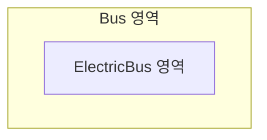
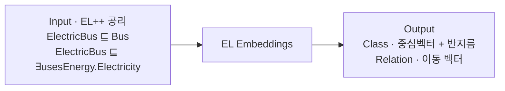
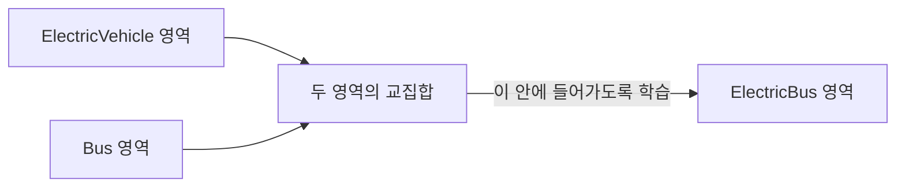
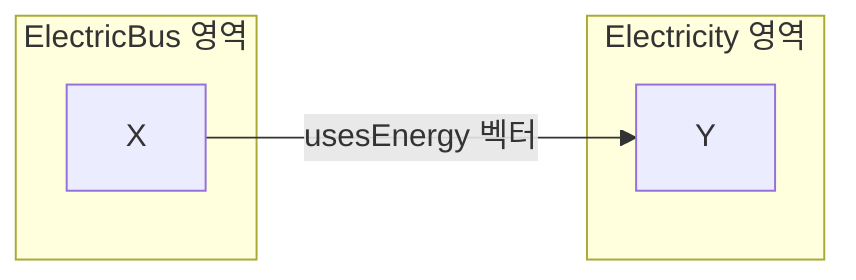

# S15B — EL Embeddings: 공리를 공간의 배치로 옮기기

> Ch.5 ML/DL · Day 8
> 원자료: DSBA Lab Study 강의 슬라이드 `3 EL Embeddings` · `4 Conclusion`
> 참고 논문
> · Kulmanov, Liu-Wei, Yan, Hoehndorf (2019), *EL Embeddings: Geometric Construction of Models
>   for the Description Logic EL++*, IJCAI 2019 ([arXiv:1902.10499](https://arxiv.org/abs/1902.10499)
>   · [코드](https://github.com/bio-ontology-research-group/el-embeddings))
> · 슬라이드 표기: IJCAI 2019, Citation 186
>
> 📖 [강의 목차](README.md) · [YouTube 재생목록](https://www.youtube.com/watch?v=f0WV7b3lGqM&list=PLFHGWfB_kmrs)
> 이전 [S15A OWL2Vec*](S15A-OWL2Vec-star-문장-기반-임베딩.md) · 다음 S16 딥러닝 기반 온톨로지 정렬
> 📎 부록 [S15-1 읽는 데 필요한 것들](S15-1-읽는-데-필요한-것들.md) · [S15-2 공리를 어디에 두는가](S15-2-공리를-어디에-두는가.md)

**한 회차를 두 문서로 나눴다.** [S15A](S15A-OWL2Vec-star-문장-기반-임베딩.md)가 온톨로지 임베딩의
도입부와 OWL2Vec*을 다뤘고, 이 문서가 EL Embeddings와 회차 전체의 결론을 다룬다. 절 번호는
문서마다 1부터 다시 시작한다.

**이 문서는 슬라이드 내용만 담는다.** 슬라이드가 설명 없이 쓰는 기호(⊑, ⊓, ∃, ⊥)와 loss 식의
`d`, 평가 지표(Mean Rank, AUC, raw와 filtered)는 [S15-1](S15-1-읽는-데-필요한-것들.md)에,
강의 밖에서 나온 해석은 [S15-2](S15-2-공리를-어디에-두는가.md)에 있다.

---

## 1. 기존 임베딩이 하지 못한 것

- 기존 임베딩 연구에서는 각 엔티티들이 서로 관련있다는 것을 학습할 수 있었다
- 포함 관계나 겹침 등이 임베딩 공간에서 **기하학적으로 표현되지는 못했다**
- EL Embeddings는 온톨로지의 논리 공리를 공간의 포함·겹침·분리 관계로 직접 표현하려 한다

슬라이드는 `Bus`라는 큰 원 안에 `ElectricBus`라는 작은 원이 들어 있는 그림 한 장으로 이 방향을
보여준다. 포함 관계가 그림 그대로 공간에 있어야 한다는 것이다.



## 2. EL Embeddings 개요

온톨로지 공리를 공간에서 지켜야 하는 규칙으로 바꾸고, 그 규칙을 만족하는 임베딩을 학습한다.

| 단계 | 내용 |
|---|---|
| 1. Ontology 공리 | `ElectricBus subClassOf Bus` · `ElectricBus usesEnergy Electricity` |
| 2. 기하학적 규칙으로 변환 | Class → 중심과 반지름을 가진 공간의 영역 · Relation → 영역을 이동시키는 벡터 · Axiom → 영역들이 만족해야 하는 배치 조건 |
| 3. 조건을 만족하도록 학습 | ElectricBus 영역은 Bus 영역 안에 위치하도록 · ElectricBus 영역을 usesEnergy 방향으로 이동하면 Electricity에 도달하도록 |
| 4. 학습 결과 | 각 class의 중심 벡터와 반지름 · 각 relation의 이동 벡터 · 새로운 공리나 관계의 가능성을 평가 |

논리 공리가 성립하는 임베딩 공간을 만드는 것이 목표다.

## 3. EL++란

- 온톨로지에서 클래스와 관계를 논리적으로 표현하기 위한 Description Logic 문법이다
- `ElectricBus ⊑ Bus`를 예로 들면
  - `ElectricBus`, `Bus`는 직접 정한 클래스 이름이다
  - `⊑`는 EL++가 제공하는 논리 기호로, 왼쪽 클래스가 오른쪽 클래스의 하위클래스라는 뜻이다
- EL Embeddings는 EL++에서 사용되는 핵심 논리 의미를 기하 공간으로 옮기려는 방법이다

## 4. EL++의 핵심 논리 표현 네 가지

| | 공리 | 나타내는 것 | 읽는 법 |
|---|---|---|---|
| ① Subclass | `ElectricBus ⊑ Bus` | 포함 관계 | 모든 ElectricBus는 Bus이다 |
| ② Conjunction | `ElectricVehicle ⊓ Bus ⊑ ElectricBus` | 교집합 관계 | ElectricVehicle이면서 Bus인 것은 ElectricBus이다 |
| ③ Existential restriction | `ElectricBus ⊑ ∃usesEnergy.Electricity` | 관계의 존재 | 모든 ElectricBus는 어떤 Electricity를 에너지원으로 사용한다 |
| ④ Bottom concept | `ElectricVehicle ⊓ GasolineVehicle ⊑ ⊥` | 불가능한 교집합 | 두 클래스에 동시에 속하는 대상은 존재할 수 없다 |

> 네 형태 중 Bottom concept만 학습 절이 따로 없다. 7~9절이 앞의 셋을 다루고, Bottom concept은
> 10절 전체 loss 식의 `L_bottom` 항으로만 다시 나온다. 이 자리를 채운 것은
> 📎 [S15-1 13절](S15-1-읽는-데-필요한-것들.md)이다.

## 5. 입력과 출력



EL Embeddings가 학습하는 것은 각 클래스 영역의 위치, 각 클래스 영역의 크기, 각 관계의 이동
방향이다.

## 6. 공리를 학습 가능한 형태로 정리

- EL++ 공리를 [4절](#4-el의-핵심-논리-표현-네-가지)의 네 가지 형태로 바꾸고, 각 형태마다 다른
  기하학적 규칙을 적용한다
- 온톨로지 공리는 여러 형태로 작성될 수 있기 때문에 모델이 학습하기 쉬운 표준 형태로 변환하는
  과정이 필요하다

## 7. Subclass 공리의 학습

`ElectricBus ⊑ Bus`, 모든 ElectricBus는 Bus다. 이 공리에 대해 클래스는 원의 형태로 표현된다.

```
ElectricBus = (c_EB, r_EB)
Bus         = (c_Bus, r_Bus)
```

ElectricBus가 Bus 안에 완전히 들어가는 방향으로 loss가 줄도록 학습한다.

```
Loss = max(0, d + r_EB − r_Bus)
```

Loss를 줄이는 방법은 세 가지다.

- ElectricBus와 Bus의 중심을 더 가깝게 이동
- ElectricBus의 반지름을 축소
- Bus의 반지름을 확대

> 슬라이드는 `d`가 무엇인지 따로 정의하지 않는다. 📎 [S15-1](S15-1-읽는-데-필요한-것들.md)

## 8. Conjunction 공리의 학습

`ElectricVehicle ⊓ Bus ⊑ ElectricBus`, ElectricVehicle이면서 Bus인 것은 ElectricBus다.

```
ElectricVehicle = (c_EV, r_EV)
Bus             = (c_Bus, r_Bus)
```

슬라이드 그림은 ElectricVehicle 원과 Bus 원이 일부 겹치고, 그 겹치는 부분에 ElectricBus가
들어가도록 화살표가 그려져 있다. Loss를 줄이는 방법은 이렇다.

- 세 클래스의 중심 위치 조정
- 세 클래스의 반지름 조정
- 교집합이 ElectricBus 영역에 들어가도록 배치



## 9. Existential Restriction 공리의 학습

**하나. 출발 클래스가 주어진 경우**

`ElectricBus ⊑ ∃usesEnergy.Electricity`, 모든 ElectricBus는 Electricity를 에너지원으로 사용한다.

ElectricBus 영역 안의 점 X에서 `usesEnergy` 벡터만큼 이동하면 Electricity 영역 안의 점 Y에
도달해야 한다.



Loss를 줄이는 방법은 ElectricBus 영역의 위치와 크기 조정, Electricity 영역의 위치와 크기 조정,
`usesEnergy` 관계 벡터 조정이다.

**둘. 도착 클래스가 주어진 경우**

`∃hasChild.Person ⊑ Parent`, Person인 자녀를 가진 대상은 Parent다.

이번에는 Parent 영역 안의 X에서 `hasChild` 벡터로 이동하면 Person 영역의 Y에 도달하는 배치가
된다. Loss를 줄이는 방법은 Person 영역의 위치와 크기 조정, Parent 영역의 위치와 크기 조정,
`hasChild` 관계 벡터 조정이다.

두 경우가 제약하는 대상이 다르다.

| | 주어진 것 | 제약하는 것 |
|---|---|---|
| Existential Restriction 1 | 출발 클래스 | 관계의 도착 영역 |
| Existential Restriction 2 | 도착 클래스 | 관계의 출발 영역 |

## 10. 전체 학습 과정

| 단계 | 내용 |
|---|---|
| 1. 공리 정규화 | 다양한 OWL 공리를 네 가지 기본 공리 형태로 정리한다. 형태를 통일해야 각 공리에 맞는 Loss를 적용할 수 있다 |
| 2. 초기 공간 생성 | 초기 클래스 영역과 관계 벡터를 임의로 배치한다. Class는 중심 벡터 + 반지름, Relation은 이동 벡터다 |
| 3. 공리별 Loss 계산 | 각 공리가 공간에서 잘 지켜지고 있는지를 Loss로 계산한다 |
| 4. 전체 Loss 최소화 | optimizer가 클래스 중심 위치, 반지름, 관계 이동 벡터를 업데이트한다 |

```
L_total = L_subclass + L_conjunction + L_existential + L_bottom
```

최종 목표는 전체 온톨로지 공리가 동시에 성립하는 임베딩 공간을 찾는 것이다.

## 11. 가족 온톨로지 예시

가족 온톨로지의 공리가 임베딩 공간에서 어떻게 나타나는지를 2차원 그림으로 보여준다.

- `Male`, `Female`, `Parent`가 모두 `Person` 영역 안에 위치한다 → Subclass 공리 만족
- `Father`가 `Male`과 `Parent`가 겹치는 위치에 배치된다 → Male이면서 Parent인 대상이라는 의미
- `Male`과 `Female` 영역은 서로 겹치지 않는다 → Disjointness 만족
- 하나의 클래스가 여러 공리를 동시에 만족하도록 위치와 크기가 결정된다 → 공리를 하나씩 따로
  표현한 것이 아니라 전체 공리의 loss를 최적화한 결과다

그림의 배치를 [4절](#4-el의-핵심-논리-표현-네-가지)의 네 형태에 대응시키면 이렇게 된다.

| 그림에서 보이는 배치 | 대응하는 공리 형태 |
|---|---|
| `Male` · `Female` · `Parent` 원이 모두 `Person` 원 안에 있다 | Subclass |
| `Father` 원이 `Male`과 `Parent`가 겹치는 자리에 있다 | Conjunction |
| `Mother` 원이 `Female`과 `Parent`가 겹치는 자리에 있다 | Conjunction |
| `Male` 원과 `Female` 원이 겹치지 않는다 | Bottom concept (슬라이드 표기는 Disjointness) |

> 원자료는 x축 −5~4, y축 −2~3 범위의 산점도 위에 원 여섯 개를 그린 그림이다. 겹침과 분리가
> 그림의 내용인데 mermaid로는 그 둘을 그릴 수 없어 배치를 표로 옮겼다.

## 12. 실험 설정

**Task**

- 특정 단백질 P1이 주어졌을 때, 상호작용할 가능성이 높은 P2 후보를 ranking한다
- Human, Yeast 단백질 쌍을 대상으로 평가한다

**Dataset**

| 데이터 | 내용 |
|---|---|
| Gene Ontology | 단백질 기능 클래스와 논리 공리 제공 |
| Protein-Function Annotation | 단백질 P가 기능 F를 가진다는 정보 |
| String PPI dataset | Human, Yeast의 단백질 상호 작용 데이터 |

**Metrics** — Hits@10 / Hits@100, Mean Rank, AUC

## 13. 결과

- EL Embeddings가 Hits@10, Hits@100에서 가장 높은 성능을 보인다
- Mean Rank가 가장 낮아 정답 단백질을 더 높은 순위에 배치한다
- Semantic similarity보다 좋은 결과다. 단순 유사도보다 논리 공리 기반 표현이 유용하다
- TransE보다 좋은 결과다. 단순 graph relation보다 EL++ 논리 구조 반영이 효과적이다

| Method | Raw Hits@10 | Filtered Hits@10 | Raw Hits@100 | Filtered Hits@100 | Raw Mean Rank | Filtered Mean Rank | Raw AUC | Filtered AUC |
|---|---|---|---|---|---|---|---|---|
| TransE (RDF) | 0.03 | 0.05 | 0.22 | 0.27 | 855 | 809 | 0.84 | 0.85 |
| TransE (plain) | 0.06 | 0.13 | 0.41 | 0.54 | 378 | 330 | 0.93 | 0.94 |
| SimResnik | 0.08 | 0.18 | 0.38 | 0.49 | 713 | 663 | 0.87 | 0.88 |
| SimLin | 0.08 | 0.17 | 0.34 | 0.45 | 807 | 756 | 0.85 | 0.86 |
| **EL Embeddings** | **0.10** | **0.23** | **0.50** | **0.75** | **247** | **187** | **0.96** | **0.97** |

Mean Rank는 낮을수록 좋고 나머지는 높을수록 좋다. raw와 filtered의 차이는
📎 [S15-1](S15-1-읽는-데-필요한-것들.md)에 적었다.

## 14. Takeaways와 한계

**Takeaways**

- EL++ 공리를 기하학적 제약으로 직접 표현한다
- Class를 점이 아닌 영역으로, relation을 이동 벡터로 표현한다
- 논리 의미를 반영한 임베딩이 실제 PPI 예측에도 효과적이다

**Limitations**

- EL++로 표현 가능한 논리에 제한된다
- label, comment, definition 같은 lexical information은 활용하지 않는다
- relation을 이동 벡터로 표현하기 때문에 복잡한 관계 패턴에는 한계가 있다

세 번째 한계는 [S13](S13-KG-임베딩-기초.md)에서 TransE의 1-N 관계 문제로 다룬 것과 같은 성질이다.

---

## 15. 회차 결론

**Conclusion**

- 온톨로지의 어떤 의미를 벡터 공간에 보존할 것인지 결정하는 것이 Ontology Embedding의 핵심이다
- 그래프 구조·자연어 정보·논리 공리의 활용 방식에 따라 정보의 풍부함과 논리적 정합성 사이의
  trade-off가 발생한다
- 적용할 온톨로지와 downstream task에 맞춰 입력 정보·임베딩 표현·학습 목표를 함께 설계하는 것이
  중요하다

**Future Work**

- 자연어 정보와 논리 공리를 함께 반영하는 Hybrid Ontology Embedding 연구
- GNN·Transformer·BERT를 활용한 고도화된 온톨로지 표현 학습
- 서로 다른 온톨로지 간 개념을 연결하는 Ontology Alignment로의 확장

마지막 항목이 다음 회차 S16의 주제다.

두 모델을 나란히 놓고 본 대조는 [S15-2 1절](S15-2-공리를-어디에-두는가.md)에 있다.

---

## 관련 문서

- [S15A — OWL2Vec*](S15A-OWL2Vec-star-문장-기반-임베딩.md) — 같은 회차의 앞부분
- [S15-1 — 읽는 데 필요한 것들](S15-1-읽는-데-필요한-것들.md) — 논리 기호, loss 식, 평가 지표
- [S15-2 — 공리를 어디에 두는가](S15-2-공리를-어디에-두는가.md) — 강의 밖 해석과 인사이트
- [S13 — KG 임베딩 기초](S13-KG-임베딩-기초.md) — 이동 벡터로 관계를 표현하는 TransE
- [S09-1 — 제약처럼 보이는 공리들](S09-1-제약처럼-보이는-공리들.md) — `⊑`와 `∃`가 OWL에서 실제로 하는 일
- [00 — 전체 파이프라인](00-전체-파이프라인.md) — 임베딩 계열이 붙는 자리
