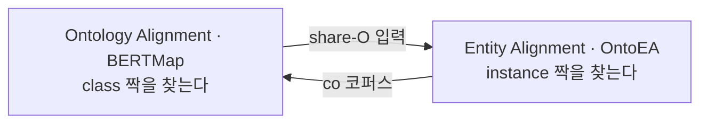

# S16-2 — 정렬이 서는 자리

> 성격: 부록. [S16A](S16A-OntoEA-온톨로지를-넣은-엔티티-정렬.md)·[S16B](S16B-BERTMap-문맥-임베딩-기반-정렬.md)
> 본편에서 갈라져 나온 해석이다. 용어와 식 풀이는 [S16-1](S16-1-읽는-데-필요한-것들.md)에 있다.
>
> 📖 [강의 목차](README.md)

---

## 1. 서로를 전제하는 두 논문

이 회차의 두 논문은 나란히 놓인 정도가 아니라 **서로를 필요로 한다.** 강의가 마지막 슬라이드
표의 "서로에 대한 의존" 행에서 이것을 짚는다.

- OntoEA는 share-O 시나리오를 위해 **OA 시스템을 전처리로 요구한다**
- BERTMap은 **EA 결과를 `co` 코퍼스로 활용할 수 있다**

**닭과 달걀이다.** 강의는 "BERTMap의 class mapping을 OntoEA의 share-O 입력으로 넘기면 두 한계가
서로 보완된다"고 한 방향만 적는데, 반대 방향도 성립하므로 어느 쪽을 먼저 돌릴지가 남는다.

BERTMap 쪽에서 시작하는 것이 자연스럽다. **BERTMap은 비지도로 돌아가기 때문이다.** `io`
코퍼스는 한 온톨로지 안에서 공짜로 나온다([S16-1 7절](S16-1-읽는-데-필요한-것들.md)). 반면
OntoEA는 seed mapping 20%를 요구한다. 아무것도 없는 상태에서 먼저 굴릴 수 있는 쪽이 BERTMap이다.

그러면 S16A 18절이 남긴 질문(온톨로지 정렬 품질이 Entity Alignment 성능의 상한이라면 두 정렬을
반복적으로 함께 개선할 수 있는가)에 답이 생긴다. **한 바퀴가 아니라 두 정렬을 번갈아 돌리는
구조다.** 다만 두 논문 중 어느 쪽도 이 순환을 실제로 돌려보지는 않았다.

## 2. 논리를 언제 쓰는가

두 논문 다 논리 제약을 쓰는데 **쓰는 시점이 다르다.**

| | OntoEA | BERTMap |
|---|---|---|
| 논리가 들어가는 자리 | 학습 중 (confliction loss) | 추론 후 (mapping repair) |
| 하는 일 | 충돌하는 쌍의 점수를 학습 단계에서 낮춘다 | 이미 나온 mapping 중 충돌하는 것을 지운다 |
| 성격 | 예방 | 사후 정리 |

**이 축은 [S15](S15A-OWL2Vec-star-문장-기반-임베딩.md)에서 본 것과 같다.** OWL2Vec\*은 공리를
학습 문장에 섞어 넣었고 EL Embeddings는 공리를 loss로 만들었다. 여기서는 OntoEA가 loss 쪽,
BERTMap이 후처리 쪽이다.

**후처리 쪽에는 [S15-2 7절](S15-2-공리를-어디에-두는가.md)에서 지적한 문제가 없다.** mapping
repair는 학습된 공간에서 뭔가를 읽어내는 것이 아니라, 나온 결과에 추론기를 대는 일이다. 논리
충돌은 확인되고 제거된다. 대신 **모델이 애초에 충돌하는 후보를 내놓는 것 자체는 막지 못한다.**

OntoEA 쪽은 반대다. 학습 중에 충돌을 벌점으로 넣으니 모델이 충돌을 덜 내놓게 되지만, 벌점의
합을 줄일 뿐이라 **충돌이 완전히 사라진다는 보장은 없다.** S16A 17절의 class conflict ratio가
3.0%로 줄었을 뿐 0이 아닌 것이 이 뜻이다.

**둘을 같이 쓰면 서로의 빈틈을 메운다.** 학습 중에 줄이고, 남은 것을 사후에 지우는 순서다.
어느 논문도 이 조합을 하지는 않았다.

## 3. 같은 문제에 정반대 처방

두 논문이 **똑같은 문제**를 만난다. 온톨로지에 disjointness가 거의 선언돼 있지 않다는 것이다.
그런데 처방이 정반대다.

| | OntoEA의 CCM | BERTMap의 sibling 가정 |
|---|---|---|
| 미선언 상황을 어떻게 보나 | 모른다고 보고 계층 거리로 보간한다 | 형제면 disjoint라고 단정한다 |
| 결과값 | `[0, 1]` 연속값 | 사실상 1 (negative로 씀) |
| 성향 | 보수적 | 공격적 |
| 얻는 것 | 틀린 벌점을 크게 주지 않는다 | 어려운 negative를 대량으로 얻는다 |

**OntoEA는 선언된 것만 확신한다.** S16A 9절의 네 조건을 보면 `owl:disjointWith`가 선언된
경우에만 `m = 1`을 준다. 나머지는 공통 상위 class의 겹침 비율로 0과 1 사이 값을 만든다. 멀리
떨어진 class일수록 충돌 정도가 크다고 보되, 단정하지는 않는다.

**BERTMap은 선언이 없어도 형제면 배타로 친다.** 슬라이드도 "거친 가정"이라고 부른다.

**이 가정이 틀리는 경우가 실제로 있다.** 형제인데 배타가 아닌 예가 온톨로지에 흔하다. 어떤
분류에서 `전기버스`와 `학교버스`는 `버스`의 형제일 수 있는데, 전기로 가는 학교버스는 얼마든지
있다. 다중 상속을 허용하는 온톨로지에서는 형제가 겹치는 것이 정상이다. **틀린 negative가
학습에 섞여 들어간다.**

그런데도 BERTMap이 작동하는 이유는 negative의 성격 때문으로 보인다. 틀린 negative가 일부
섞여도 대다수가 맞으면 분류 경계는 대체로 옳은 자리에 선다. **정확한 소량보다 거친 대량이
나은 국면**이고, 이건 학습 데이터를 만드는 쪽의 전형적인 맞바꿈이다.

**주의할 점은 그 대가가 어디로 가느냐다.** 형제가 겹치는 온톨로지일수록 틀린 negative 비율이
올라간다. 다중 상속이 많은 온톨로지에 BERTMap을 그대로 쓰면 이 가정부터 확인해야 한다.
슬라이드는 가정이 거칠다고만 하고 어떤 온톨로지에서 위험한지는 말하지 않는다.

## 4. 또 label 품질이 결정한다

[S15-2 3절](S15-2-공리를-어디에-두는가.md)에서 Pre-trained Word2Vec이 HeLis에서 구조 기반
방법을 전부 앞선 것을 봤다. 이름이 말이 되는 온톨로지에서는 구조 학습의 몫이 작다는 이야기였다.
**이 회차에서 같은 구도가 두 번 더 나온다.**

**BERTMap이 FMA-NCI에서 진다.** 비지도 최고 F1이 AML보다 2.5%p, LogMap보다 2.6%p 낮다.
슬라이드가 이유를 적는다. FMA-NCI는 label이 풍부해 lexical matching이 강한 과제다. **이름만
비교해도 충분한 곳에서는 문맥 임베딩을 얹을 이유가 없다.**

**OntoEA는 반대 방향에서 같은 이야기를 한다.** entity 정보가 부족한 EN-FR-V1에서 온톨로지
주입이 전 지표 10% 이상을 벌어주는데, 정보가 풍부한 V2에서는 H@1이 오히려 소폭 떨어진다.
슬라이드 표현으로 "온톨로지의 한계 효용 감소"다.

정리하면 이렇다.

| 신호가 부족한 쪽 | 채워주는 것 | 회차 |
|---|---|---|
| entity 구조가 희소하다 | 온톨로지 class 계층 | S16A OntoEA |
| class label이 빈약하다 | 보조 온톨로지(cp) · 문맥 임베딩 | S16B BERTMap |
| class 이름이 번호다 | 구조 (OWL2Vec\*의 Structure Document) | S15A |

**세 줄이 같은 말을 한다. 부족한 쪽을 다른 신호로 메운다.** 그래서 어떤 방법을 쓸지는 모델의
우열이 아니라 **내 데이터에서 무엇이 비어 있는가**로 정해진다. BERTMap의 마지막 질문(label이
빈약하면 OWL2Vec과 결합해야 하는가)도 이 표의 빈칸을 가리킨다.

**이름이 방해가 되는 경우도 있다.** D-W는 surface information을 넣으면 전반 성능이 떨어진다.
그런데 같은 조건에서 **온톨로지의 상대적 이득은 오히려 커진다**(S16A 15절). 슬라이드는 두 사실만
적고 이유는 말하지 않는데, 읽히는 대로 옮기면 이렇다. **이름이 쓸모없거나 어긋난 자리에서는
온톨로지가 대신 설 자리가 넓어진다.** DBpedia와 Wikidata는 이름을 붙이는 관례가 서로 달라
사전학습 단어 벡터로 메워지지 않는 것으로 짐작되지만, 이건 확인한 것이 아니다.

**두 논문이 이름을 정반대로 대한다는 점도 눈에 띈다.** OntoEA는 이름을 빼고도 되는지를 보이려
하고(w/o SI가 기본 비교), BERTMap은 이름을 주 신호로 삼는다. 모순은 아니고 **대상이 다르기
때문이다.**

| | 다루는 것 | 이름의 성격 |
|---|---|---|
| OntoEA | instance | 사람 이름이나 지명. 우연히 같거나 우연히 다를 수 있다 |
| BERTMap | class | 개념의 이름. 그 개념이 무엇인지에 대한 정의에 가깝다 |

`Victoria`라는 문자열이 같다고 같은 사람은 아니다. 반면 `muscle layer`와 `muscularis propria`가
같은 개념을 가리키는 것은 우연이 아니라 **용어가 원래 그런 것**이다. instance의 이름은
증거지만 class의 label은 정의에 가깝고, 그래서 **class 쪽에서 이름에 기대는 것이 더 정당하다.**

## 5. 상한이라는 말

S16A 18절의 질문은 "온톨로지 정렬 품질이 Entity Alignment 성능의 상한"이라는 전제를 깔고 있다.
이 말이 성립하는 이유를 따져보면 이렇다.

OntoEA에서 class 정보가 entity 정렬에 닿는 경로는 membership loss 하나뿐이다(S16A 10절).
`entity → class → 다른 온톨로지의 class → 다른 entity`로 이어지는 사슬인데, **가운데 고리인
class 짝이 틀리면 그 뒤가 전부 틀린다.** 잘못된 class mapping은 잘못된 confliction 벌점을 낳고,
맞는 entity 쌍을 충돌로 판정해 걸러낼 수 있다.

**S16A 16절의 ablation이 이 사슬을 숫자로 보여준다.** `L_M`을 빼면 H@1이 .566에서 .481로
떨어지고, 온톨로지를 통째로 빼면 .430까지 간다. `L_C`를 뺄 때(.520)보다 `L_M`을 뺄 때 더 크게
떨어진다. 슬라이드 표현으로 "membership이 없으면 class 정보 전달 경로 자체가 소멸"이다.

**통로가 하나라는 것은 그 통로의 품질이 상한이 된다는 뜻이다.** 이것이 질문의 근거이고,
1절의 순환 구조가 답이 되는 이유이기도 하다.

## 6. 제조 KG에 대면

실무 과제([`Projects/ontology-pipeline`](../../../Projects/ontology-pipeline/))에 대면 이
회차는 앞의 두 회차보다 직접적이다. **S13~S15가 하나의 KG 안을 채우는 이야기였다면 S16은 서로
다른 출처를 합치는 이야기이고, 그게 실무에서 막힌 지점에 가깝다.**

**share-O가 성립할 가능성이 높다.** 사내 공통 온톨로지를 쓰는 환경이라면 두 데이터 출처가 같은
온톨로지를 참조한다. 슬라이드 하단 메모도 "DBpedia 다국어 버전이나 사내 공통 온톨로지 환경에서는
오히려 일반적인 설정"이라고 적는다. OntoEA가 요구하는 사전 ontology alignment 부담이 사라진다.

**대신 label이 빈약할 것이다.** [S15-2 7절](S15-2-공리를-어디에-두는가.md)에서 이미 짚은 문제다.
현장 용어는 약어와 사내 표기가 섞여 있어 BERTMap이 기대는 신호가 약하다. 게다가 Bio-Clinical
BERT 같은 **도메인 사전학습 모델이 제조 쪽에는 마땅치 않다.** 일반 BERT로는 S16B 5절의 이점을
못 얻는다.

그래서 **cp(complementary) 코퍼스 확보가 관건이 된다.** S16B 11절에서 cp를 넣자 F1이 0.490에서
0.827로 올랐다. label이 빈약할수록 보조 온톨로지가 결정적이라는 것이 이 회차에서 가장 실무에
가까운 발견이다. 제조 쪽 표준 온톨로지를 보조로 쓸 수 있는지가 실제로 확인해볼 항목이다.

**sibling disjoint 가정은 우리 온톨로지에서 먼저 확인해야 한다.** 3절에서 본 대로 다중 상속이
많으면 틀린 negative가 늘어난다. 설비 분류에서 형제 class가 실제로 배타적인지, 한 설비가 두
형제에 동시에 속하는 경우가 있는지를 세어보면 된다.

**MED-BBK-9K의 교훈도 그대로 온다.** class가 11개뿐이라 class conflict ratio가 34%까지밖에
안 내려갔다(S16A 17절). **class가 적으면 충돌 판정의 해상도가 낮다.** 온톨로지를 얕게 만들어
두면 이 회차의 방법들이 줄 수 있는 것도 줄어든다는 뜻이고, 설계 단계에서 알아야 하는 것이다.

## 7. 정리

- 두 논문은 **서로를 전제한다.** 비지도로 돌아가는 BERTMap을 먼저 돌리고 그 결과를 OntoEA의
  share-O 입력으로 넘기는 순서가 자연스럽다. 두 논문 다 이 순환을 돌려보지는 않았다
- 논리를 **학습 중에 쓰느냐 추론 후에 쓰느냐**로 갈린다. 예방과 사후 정리라 서로의 빈틈을 메운다
- 미선언 disjointness라는 같은 문제에 **정반대 처방**을 낸다. CCM은 보간하고 sibling 가정은
  단정한다. 후자는 다중 상속이 많은 온톨로지에서 틀린 negative를 늘린다
- 어떤 방법을 쓸지는 모델의 우열이 아니라 **내 데이터에서 무엇이 비어 있는가**로 정해진다.
  구조가 비면 온톨로지를, label이 비면 보조 온톨로지와 문맥 임베딩을 넣는다
- class 정보가 entity 정렬에 닿는 통로가 membership 하나뿐이라 **그 품질이 상한이 된다**
- 실무에서는 share-O가 성립할 가능성이 높은 대신 label이 빈약하다. **cp 코퍼스 확보와 sibling
  가정 확인**이 먼저 볼 항목이고, 온톨로지를 얕게 두면 충돌 판정 해상도도 같이 낮아진다

## 관련 문서

- [S16A — OntoEA](S16A-OntoEA-온톨로지를-넣은-엔티티-정렬.md) · [S16B — BERTMap](S16B-BERTMap-문맥-임베딩-기반-정렬.md)
- [S16-1 — 읽는 데 필요한 것들](S16-1-읽는-데-필요한-것들.md)
- [S15-2 — 공리를 어디에 두는가](S15-2-공리를-어디에-두는가.md) — 이름이 다 하는 온톨로지, 추론과 예측
- [S12-1 — 선언과 준수 사이](S12-1-선언과-준수-사이.md) — 선언된 제약과 실제 데이터의 어긋남
- [S11-1 — 온톨로지가 하지 않는 일](S11-1-온톨로지가-하지-않는-일.md) — 게이트와 사람 확인
- [00 — 전체 파이프라인](00-전체-파이프라인.md) — 의미 통합이 붙는 자리
