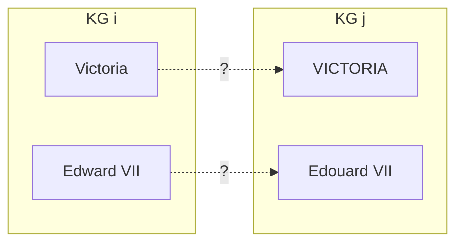
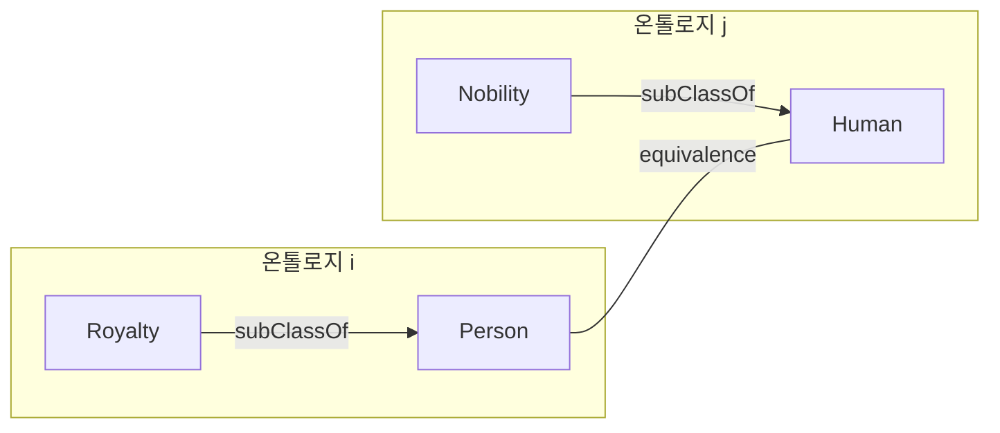
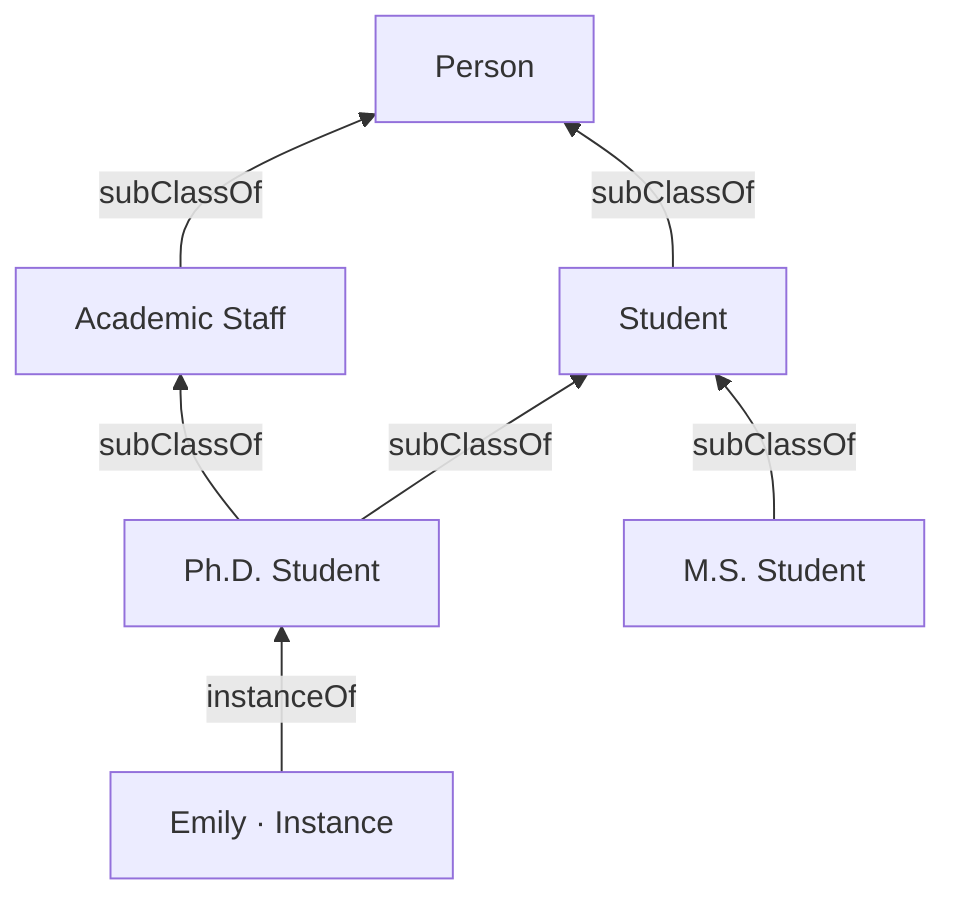
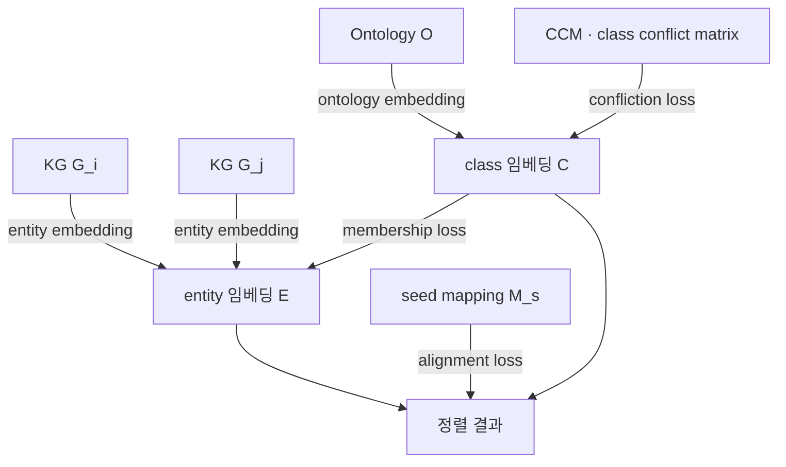

# S16A — OntoEA: 엔티티 정렬에 온톨로지를 넣기

> Ch.5 ML/DL · Day 8
> 원자료: DSBA Lab Study 강의 슬라이드 40장 중 `01 Introduction` · `02 OntoEA`
> 참고 논문
> · Xiang, Zhang, Chen, Chen, Zhuang, Bao, Chen (2021), _OntoEA: Ontology-guided Entity
>   Alignment via Joint Knowledge Graph Embedding_, ACL Findings 2021
>   ([arXiv:2105.07688](https://arxiv.org/abs/2105.07688))
> · 슬라이드가 밝힌 계보: 공통 저자 Jiaoyan Chen, Oxford 계열 연구 흐름 (OWL2Vec · LogMap-ML)
>
> 📖 [강의 목차](README.md) · [YouTube 재생목록](https://www.youtube.com/watch?v=f0WV7b3lGqM&list=PLFHGWfB_kmrs)
> 이전 [S15B EL Embeddings](S15B-EL-Embeddings-기하-기반-임베딩.md) · 다음 S16B BERTMap
> 📎 부록 [S16-1 읽는 데 필요한 것들](S16-1-읽는-데-필요한-것들.md) · [S16-2 정렬이 서는 자리](S16-2-정렬이-서는-자리.md)

**한 회차를 두 문서로 나눴다.** 이 문서가 도입부와 OntoEA를, S16B가 BERTMap과 회차 결론을
다룬다. 절 번호는 문서마다 1부터 다시 시작한다.

**이 문서는 슬라이드 내용만 담는다.** 이 덱은 슬라이드 하단에 발표자가 덧붙인 메모 상자가
자주 붙는데, 그것도 슬라이드에 있는 것이므로 본편에 옮기고 "하단 메모"라고 적어 구분한다.

---

## 1. Entity Alignment와 Ontology Alignment

| | Entity Alignment | Ontology Alignment |
|---|---|---|
| 판단 대상 | 두 KG의 instance 수준 entity 동일성 | 두 온톨로지의 class 수준 개념 동등성 |
| 무엇을 변환하나 | Entity의 의미를 representation으로 | ontology 구조를 representation으로 |
| 어디서 encoding | KG에서 | ontology description에서 |

공통점은 두 대상의 의미적 동일 여부를 판단한다는 것이다.

**Entity Alignment** — 서로 다른 두 KG의 instance를 짝짓는다.



**Ontology Alignment** — 서로 다른 두 온톨로지의 class를 짝짓는다.



짝짓는 선이 **두 상자를 가로지른다는 점이 핵심이다.** 상자 안의 `subClassOf`는 각 온톨로지가
원래 가지고 있던 구조이고, 상자를 건너는 선이 정렬로 새로 알아내야 하는 것이다.

## 2. 두 논문의 자리

두 논문의 공통 전략을 슬라이드는 **미사용 signal 주입**이라고 부른다.

- **OntoEA**는 embedding 기반 Entity Alignment가 버린 class 계층과 disjointness를 결합한다
- **BERTMap**은 규칙 기반 Ontology Alignment의 lexical matching을 BERT 문맥 임베딩으로 대체한다
- 두 논문 모두 최종 단계에 논리 제약을 배치한다
- 공통 저자 Jiaoyan Chen, Oxford 계열 연구 흐름이다 (OWL2Vec · LogMap-ML)

| | OntoEA | BERTMap |
|---|---|---|
| Task | Entity Alignment (instance) | Ontology Alignment (class) |
| 핵심 신호 | KG 구조 + class 계층 | class label의 문맥 임베딩 |
| 백본 | TransE 기반 joint embedding | Bio-Clinical BERT fine-tuning |
| 지도 방식 | seed mapping 20% | unsupervised / semi-supervised |
| 논리 활용 | class conflict matrix | mapping repair |
| 평가 지표 | Hits@1, Hits@5, MRR | Precision, Recall, Macro-F1 |

BERTMap은 [S16B](S16B-BERTMap-문맥-임베딩-기반-정렬.md)에서 다룬다.

## 3. 온톨로지란 (복습)

- 정의는 "a specification of a conceptualization"(Gruber, 1995)이다. 머릿속 개념도를
  용어 + 규칙(axiom) + 자연어 설명으로 분명히 적어 둔 것이다
- 예로 schema.org(웹 검색 결과 카드), Wikidata, Google Knowledge Graph, 의료 SNOMED CT와
  Gene Ontology를 든다

온톨로지와 KG의 관계는 스터디 3주차 내용을 다시 부른다.

| | 무엇인가 |
|---|---|
| 온톨로지 | 스키마이자 뼈대. 어떤 클래스와 관계가 있는지 정의한다 |
| KG | 그 뼈대에 채운 실제 데이터, 곧 인스턴스다 |
| 비유 | 온톨로지 = DB 스키마, KG = 그 안의 레코드 |



## 4. 문제 제기 — disjointness 위반

- 기존 Entity Alignment는 구조, entity name, attribute만 사용하고 **ontology를 쓰지 않는다.**
  구조적 정보가 반영되지 않는다
- `Victoria`(Person)와 `VICTORIA`(Organization)처럼 **disjoint class 사이의 오정렬**이 발생한다
  - Disjoint Class는 개념적으로 하나의 객체가 동시에 속할 수 없는 class 사이의 관계다.
    사람 Victoria는 조직일 수 없다
- 영어와 프랑스어 위키피디아 alignment 태스크의 실패 사례 중 **BootEA 42.2%, RSN4EA 55.7%**가
  여기 해당한다
  - 온톨로지를 고려하면 사전에 배제할 수 있는 false positive다

OntoEA Figure 1이 이 상황을 그린다. `KG1`의 `Victoria`가 `KG2`의 `Queen Victoria`로 가야
하는데(right entity mapping) `VICTORIA`로 가는(wrong entity mapping) 그림이다. 위쪽 온톨로지에서
`Victoria`는 `Royalty`, `VICTORIA`는 `Educational Organization`에 membership으로 이어져 있고,
`Person`과 `Organization`은 서로 다른 가지에 있다.

## 5. 문제 정의

입력 데이터는 KG `G = (E, R, T)`이고 여기에 셋이 붙는다.

| 기호 | 무엇인가 |
|---|---|
| `O = (C, H)` | Ontology. class 집합과 subClassOf triple 집합. 그래프로 단순화한다 |
| `m = (e_i, e_j)` | Mapping. 초기 데이터로, 일부 동일한 entity에 대한 annotation이다 |
| `B` | Membership. entity와 class의 관계 표시. 어떤 entity가 어떤 class로 생성되는지 |

```
G = (E, R, T)     m = (e_i, e_j)     O = (C, H)     b_i = (e_i, c)
```

시나리오가 둘이다.

- **Share-O** — 두 entity가 동일 ontology를 공유한다 (영어·프랑스어 wiki)
- **Not-share-O** — 두 entity가 서로 다른 Ontology를 기반으로 한다

슬라이드 하단 메모. share-O 가정은 DBpedia 다국어 버전이나 사내 공통 온톨로지 환경에서는 오히려
일반적인 설정이다.

## 6. Joint Embedding Framework

공유 Ontology 공간을 가운데 두고 다섯 module을 결합한다.

| module | 하는 일 |
|---|---|
| entity embedding | 두 KG를 representation으로 변환 |
| ontology embedding | 각 entity의 ontology를 representation으로 변환 |
| confliction loss | CCM(class conflict matrix)으로 잠재적 class 충돌 반영 |
| membership loss | entity와 ontology 사이의 representation alignment |
| alignment loss | 다른 ontology 사이의 representation alignment |



슬라이드 하단 메모. 다섯 모듈을 동시 최적화하지 않고 iterative co-training으로 순차 최적화한다.

## 7. Entity Embedding

- **TransE를 채택**하고 triple을 relation에 의한 translation으로 해석한다
- margin 기반 loss에 **limit-based scoring loss**를 추가해 positive 점수 자체를 낮춘다
- negative는 random sampling으로 생성한다
- Entity Alignment와 joint embedding에 초점이 있어 **꼭 TransE일 필요는 없다**

```
f_e(h, t) = ‖h + r − t‖₂

L_E = Σ_(h,t)∈T Σ_(h',t')∈T' { [γ¹_e + f_e(h,t) − f_e(h',t')]₊ + α_e[f_e(h,t) − γ²_e]₊ }
```

## 8. Ontology Embedding

- subClassOf triple을 class pair `(c_h, c_t)`로 축약한다
- **tanh 비선형 변환**을 사용해 class를 sphere로, subclass를 벡터로 배치한다
- subClassOf의 **transitivity** 때문에 one-to-many, many-to-one mapping이 다수 발생한다
  - TransE는 transitive relation 표현에 부적합해 ontology에는 쓰지 않는다

```
f_o(c_h, c_t) = ‖tanh(W_o c_h + b_o) − c_t‖₂

L_O = Σ_(c_h,c_t)∈H Σ_(c'_h,c'_t)∈H' { [γ¹_o + f_o(c_h,c_t) − f_o(c'_h,c'_t)]₊ + α_o[f_o(c_h,c_t) − γ²_o]₊ }
```

entity 공간과 동일한 margin에 limit-based 형태를 유지해 두 loss의 스케일을 맞춘다.

슬라이드 하단 메모. 계층 임베딩에서는 relation의 대수적 성질(transitivity)이 모델 선택을 좌우한다.

## 9. Class Conflict Matrix와 Confliction Loss

- class disjointness는 **온톨로지만으로 확인이 어렵고 KG마다 다르다** (Human과 Animal)
- CCM의 원소 `m(i, j)`는 class 충돌 정도를 `[0, 1]`로 표현한다
- 네 조건을 순차 적용하고 하나라도 만족하면 계산을 끝낸다 (`S`는 해당 subclass의 모든 상위 Class)

| 순서 | 조건 | `m_ij` |
|---|---|---|
| 1 | Same class `c_i ≡ c_j` | 0 |
| 2 | Declared disjoint `owl:disjointWith` | 1 |
| 3 | Shares a member or a seed mapping | 0 |
| 4 | Otherwise hierarchy distance | `1 − |S ∩ S| / |S ∪ S|` |

슬라이드 하단 메모. 이진 제약을 계층 거리와 공통 멤버 여부로 보간해 연속적인 벌점으로 전환한다.

## 10. Membership Loss

두 공간을 연결하는 유일한 bridge다.

- membership `(e, c)`는 entity가 속한 class를 표시하고, **KG 공간을 온톨로지 공간으로 mapping**한다
- Entity와 class 사이의 유사도 점수를 사용한다
- negative는 class를 임의 class로 교체해 생성한다
- **ablation에서 가장 큰 성능 기여**를 보인다

```
f_m(e, c) = ‖tanh(W_m e + b_m) − c‖₂,   W_m ∈ R^(d_e × d_o),  b_m ∈ R^(d_o)

L_M = Σ_(e,c)∈B Σ_(e',c')∈B' { [γ¹_m + f_m(e,c) − f_m(e',c')]₊ + α_m[f_m(e,c) − γ²_m]₊ }
```

`W_m`이 `d_e`에서 `d_o`로 사상하므로 두 공간의 차원이 달라도 결합 학습이 가능하다.

## 11. Alignment Loss와 Iterative Co-Training

- alignment loss는 초기 ontology 사이의 정보를 활용해 학습을 진행한다
- 전체는 다섯 loss의 가중합이지만 **직접 최소화 대신 iterative co-training**을 쓴다
- 순서는 `L_E`와 `L_O` 독립 → `L_C`와 `L_M` 순차 → `L_A`다
  - 검증 정지 조건까지 반복한다. 모델 복잡도가 줄고 수렴이 빨라진다

```
f_a(e_i, e_j) = ‖W_a e_i − e_j‖₂,   L_A = Σ_(e_i,e_j)∈M_s f_a(e_i, e_j)

L = L_E + L_O + λ₁L_C + λ₂L_M + λ₃L_A
```

`λ₁ = 1, λ₂ = 1, λ₃ = 5`로 seed mapping 정렬에 최대 가중치를 부여한다.

슬라이드 하단 메모. loss가 많은 결합 모델에서는 동시 최적화보다 단계적 최적화가 학습 안정성에
유리하다.

## 12. Prediction

- entity 유사도와 class 유사도를 **가중 합산**한다
- 다중 class에 속하는 entity는 class embedding의 **평균**을 사용한다
- Nearest Neighbor search로 가장 유사한 Entity를 찾는다

```
sim(e_i, e_j) = β·cos(e_i, e_j) + (1 − β)·cos(c_i, c_j)
```

슬라이드 하단 메모. 학습과 추론 과정 모두에서 entity의 추가 정보로 ontology를 활용한다.

## 13. 벤치마크

- OpenEA 6종(영어·프랑스어, 영어·독일어 위키 등)과 산업 벤치마크 MED-BBK-9K를 쓴다
- 온톨로지가 없는 벤치마크는 **subClassOf 구조와 `rdf:type` 링크를 SPARQL로 추출**했다
  - MED-BBK-9K는 의료 전문가가 참여해 소규모 고품질 온톨로지를 구축했다

| | Dataset | KG | #Cls. | #Trs. | #Links | #Roots |
|---|---|---|---|---|---|---|
| share-O | EN-FR-V1 | EN/FR | 189 | 755 | 15,000 | 639 |
| | EN-FR-V2 | EN/FR | 104 | 755 | 15,000 | 533 |
| | EN-DE-V1 | EN/DE | 175 | 755 | 15,000 | 155 |
| | EN-DE-V2 | EN/DE | 86 | 755 | 15,000 | 165 |
| | MED-BBK | MED | 11 | 10 | 9,162 | 86 |
| | | BBK | 11 | 10 | 9,162 | 3,362 |
| not-share-O | D-W-V1 | DB | 172 | 755 | 15,000 | 306 |
| | | WK | 140 | 695 | 15,000 | 342 |
| | D-W-V2 | DB | 71 | 755 | 15,000 | 463 |
| | | WK | 68 | 695 | 15,000 | 418 |

슬라이드 하단 메모. 데이터셋을 온톨로지와 함께 재배포한 것이 이 논문의 실질적 기여 중 하나다.

## 14. Surface Information을 쓰지 않은 결과

- surface information 미사용 설정에서 대부분의 벤치마크와 지표에서 최고 성능이다
  - Surface info는 각 entity의 이름, 설명 등의 텍스트 정보다
    (📎 [S16-1 8절](S16-1-읽는-데-필요한-것들.md) — 왜 이걸 빼고 재는지)
- Entity 정보가 부족한 **EN-FR-V1에서 BootEA 대비 전 지표 10% 이상 개선**했다 (H@1 .507 → .566)
  - 부족한 entity 정보를 ontology 정보로 보충한다
- Entity 정보가 풍부한 V2에서는 H@1이 소폭 하락한다. **온톨로지의 한계 효용이 줄어든다**

| Models | EN-FR-V1 H@1 | H@5 | MRR | EN-FR-V2 H@1 | H@5 | MRR | D-W-V1 H@1 | H@5 | MRR | D-W-V2 H@1 | H@5 | MRR | MED-BBK H@1 | H@5 | MRR |
|---|---|---|---|---|---|---|---|---|---|---|---|---|---|---|---|
| MTransE | .247 | .467 | .351 | .240 | .436 | .336 | .259 | .461 | .354 | .271 | .490 | .376 | .004 | .014 | .012 |
| JAPE | .262 | .497 | .372 | .292 | .524 | .402 | .250 | .457 | .348 | .262 | .484 | .368 | .003 | .009 | .009 |
| SEA | .280 | .530 | .397 | .360 | .651 | .494 | .360 | .572 | .458 | .567 | .770 | .660 | .199 | .375 | .287 |
| GCNAlign | .338 | .589 | .451 | .414 | .698 | .542 | .364 | .580 | .461 | .506 | .743 | .612 | .065 | .153 | .117 |
| BootEA | .507 | .718 | .603 | **.660** | .850 | .745 | .572 | .744 | .649 | **.821** | .926 | .867 | .307 | .495 | .399 |
| RSN4EA | .393 | .595 | .487 | .579 | .759 | .662 | .441 | .615 | .521 | .723 | .854 | .782 | .195 | .311 | .253 |
| AliNet | .258 | .437 | .339 | .359 | .569 | .453 | .270 | .403 | .331 | .522 | .698 | .601 | .017 | .042 | .033 |
| OntoEA | **.566** | **.818** | **.678** | .654 | **.891** | **.757** | **.591** | **.808** | **.688** | .814 | **.950** | **.873** | **.343** | **.546** | **.440** |
| Improv. best % | 11.6 | 13.9 | 12.4 | -0.9 | 4.8 | 1.6 | 3.3 | 8.6 | 6.0 | -0.9 | 2.6 | 0.7 | 11.7 | 10.3 | 10.3 |

## 15. Surface Information을 쓴 결과

- name의 사전 학습 word embedding으로 `h, r, t, c`를 초기화하는 **단순한 전략**이다
- 전 벤치마크에서 baseline을 상회하고 개선 폭은 2%에서 68.9%다
- **MED-BBK-9K는 전 지표 60% 이상 개선**했다 (H@1 .306 → .517)
- D-W는 SI를 넣으면 전반 성능이 하락하는데 **온톨로지의 상대적 이득은 오히려 증가**한다

| w/ SI | EN-FR-V1 H@1 | EN-FR-V2 H@1 | D-W-V2 H@1 | MED-BBK H@1 | MED-BBK MRR |
|---|---|---|---|---|---|
| AttrE | .481 | .535 | .489 | .194 | .279 |
| MultiKE | .749 | .864 | .495 | .213 | .289 |
| RDGCN | .755 | .847 | .623 | .306 | .365 |
| OntoEA | **.797** | **.901** | **.795** | **.517** | **.604** |
| 개선 폭 | +5.6% | +4.3% | +27.6% | +68.9% | +65.5% |

슬라이드 하단 메모. 고품질 도메인 온톨로지가 있는 산업 환경일수록 온톨로지 주입 효과가
극대화된다.

## 16. Ablation Study

- 변형 3종을 비교한다. `w/o L_C`, `w/o L_M`, `w/o Onto.`
- **`L_M` 제거의 하락이 `L_C` 제거보다 크다** (H@1 .566에서 .520 대 .481). Entity와 Ontology의
  관계가 중요하다
- **온톨로지 전체 제거 시 하락이 가장 크다** (.566에서 .430)
  - membership이 없으면 class 정보 전달 경로 자체가 사라진다

| Models | EN-FR-V1 H@1 | H@5 | MRR | EN-FR-V2 H@1 | H@5 | MRR |
|---|---|---|---|---|---|---|
| OntoEA | **.566** | **.818** | **.678** | **.654** | **.891** | **.757** |
| w/o L_C | .520 | .781 | .636 | .589 | .845 | .701 |
| w/o L_M | .481 | .750 | .601 | .549 | .810 | .665 |
| w/o Onto. | .430 | .698 | .551 | .545 | .814 | .664 |

슬라이드 하단 메모. class conflict는 오정렬을 걸러내는 정밀도 장치이고, membership은 정보 전달
통로다.

## 17. Class Conflict와 Conflict Degree 분석

- class conflict ratio는 **false positive 중 class 충돌의 비율**이다
- EN-FR-V1은 55.7%에서 3.0%로, V2는 32.4%에서 0.3%로 줄었다
- MED-BBK-9K는 34.0%까지만 줄었다. **class가 11개뿐이라 판정 해상도가 낮다**
- degree 합 구간별로는 `[0, 10)`에서 격차가 가장 크다
  - Entity 자체 정보가 부족한 경우에 가장 효과적이다

| 벤치마크 | 기존 최고 conflict ratio | OntoEA |
|---|---|---|
| EN-FR-15K-V1 (w/o SI) | RSN4EA 55.7 (BootEA 42.2 · GCNAlign 48.7) | 3.0 |
| EN-FR-15K-V2 (w/o SI) | RSN4EA 32.4 (BootEA 18.4 · GCNAlign 31.3) | 0.3 |
| MED-BBK-9K (w/ SI) | AttrE 61.9 · RDGCN 60.1 · MultiKE 51.5 | 34.0 |

슬라이드 하단 메모. 이웃 구조가 빈약한 long-tail entity에서 온톨로지가 대체 신호로 작동한다.

## 18. Takeaway

**Contribution**

- 온톨로지와 embedding을 결합한 최초 시도
- class 계층과 disjointness를 CCM으로 통합
- 7개 벤치마크에서 SOTA 달성
- 온톨로지와 membership을 부착한 벤치마크 공개
- class conflict를 정량 지표로 정의해 오정렬 감소를 직접 측정

**Limitation**

- share-O를 위한 사전 ontology alignment가 필요하다
- 수동 주석이 PARIS 자동 정렬보다 여전히 우수하다
- class 계층과 disjointness만 활용한다
- property의 domain과 range 제약은 쓰지 않는다
- entity embedding이 TransE로 고정돼 있고 GNN 백본은 향후 과제다

슬라이드가 질문을 하나 걸어둔다. 온톨로지 정렬 품질이 Entity Alignment 성능의 상한이라면,
두 정렬을 반복적으로 함께 개선할 수 있는가.

슬라이드 하단 메모. 온톨로지 주입의 이득은 구조 희소성과 온톨로지 품질에 비례하며 산업 KG에
특히 적합하다.

---

## 관련 문서

- [S16B — BERTMap](S16B-BERTMap-문맥-임베딩-기반-정렬.md) — 같은 회차의 뒷부분
- [S16-1 — 읽는 데 필요한 것들](S16-1-읽는-데-필요한-것들.md) · [S16-2 — 정렬이 서는 자리](S16-2-정렬이-서는-자리.md)
- [S13 — KG 임베딩 기초](S13-KG-임베딩-기초.md) — entity embedding의 백본인 TransE
- [S15A — OWL2Vec*](S15A-OWL2Vec-star-문장-기반-임베딩.md) — 슬라이드가 계보로 지목한 연구
- [S12-1 — 선언과 준수 사이](S12-1-선언과-준수-사이.md) — 선언된 제약과 실제 데이터의 어긋남
- [00 — 전체 파이프라인](00-전체-파이프라인.md) — 의미 통합이 붙는 자리
