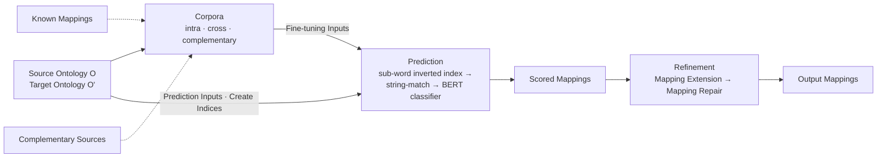
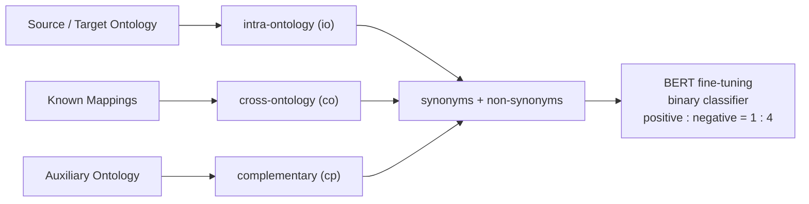
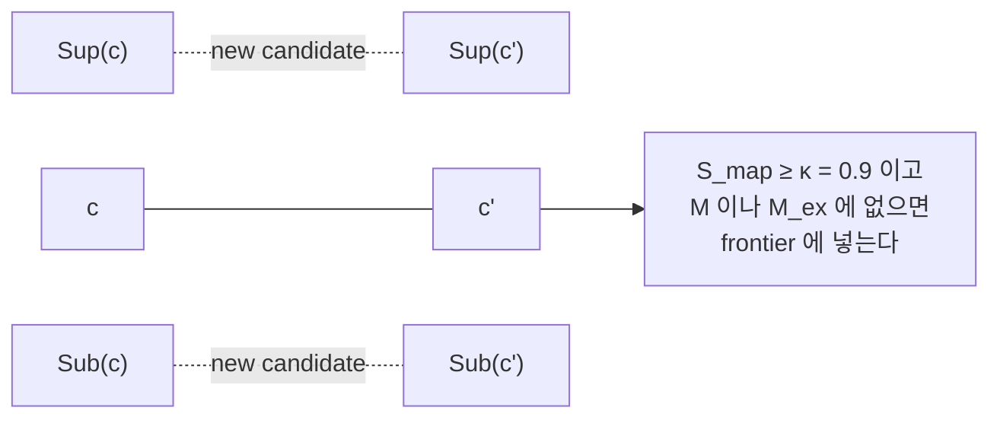

# S16B — BERTMap: 온톨로지가 스스로 만든 동의어 사전

> Ch.5 ML/DL · Day 8
> 원자료: DSBA Lab Study 강의 슬라이드 40장 중 `03 BERTMap` · `04 Discussion`
> 참고 논문
> · He, Chen, Antonyrajah, Horrocks (2022), _BERTMap: A BERT-based Ontology Alignment System_,
>   AAAI 2022 ([arXiv:2112.02682](https://arxiv.org/abs/2112.02682)
>   · [코드](https://github.com/KRR-Oxford/BERTMap))
>
> 📖 [강의 목차](README.md) · [YouTube 재생목록](https://www.youtube.com/watch?v=f0WV7b3lGqM&list=PLFHGWfB_kmrs)
> 이전 [S16A OntoEA](S16A-OntoEA-온톨로지를-넣은-엔티티-정렬.md) · 다음 S17 KG 임베딩 실습 (PyKEEN)
> 📎 부록 [S16-1 읽는 데 필요한 것들](S16-1-읽는-데-필요한-것들.md) · [S16-2 정렬이 서는 자리](S16-2-정렬이-서는-자리.md)

**한 회차를 두 문서로 나눴다.** [S16A](S16A-OntoEA-온톨로지를-넣은-엔티티-정렬.md)가 도입부와
OntoEA를 다뤘고, 이 문서가 BERTMap과 두 논문의 비교를 다룬다. 절 번호는 슬라이드의 소절 번호를
그대로 따랐다.

**절 번호에 빈자리가 있다.** 덱 자체가 `(9)`와 `(12)`를 건너뛴다. 빠뜨려 받은 것이 아니라
원자료의 번호가 그렇다. 나중에 다시 볼 때 찾아 헤매지 않도록 적어둔다.

---

## 1. Motivation — lexical matching의 한계

- LogMap과 AML은 lexical + structural + logic repair 조합으로 **여전히 SOTA**다
- lexical matching은 **surface form만 참조**한다. 어휘가 다르면 연결에 실패한다
  (`muscle layer`와 `muscularis propria`)
- 기존 ML 기반 OM은 word embedding 또는 ad-hoc feature에 의존하고, 비지도에서 규칙 기반에 미달한다
- **착안점은 온톨로지 자체가 동의어 사전이라는 것이다.** 같은 class에 붙은 여러 label은 서로
  동의어다
  - 사람의 주석 없이 대규모 학습 데이터를 확보할 수 있다

문제 정의는 이렇다. 주석이 거의 없는 상황에서 문맥 임베딩으로 규칙 기반 시스템을 넘어설 수 있는가.

| 접근 | 텍스트 표현 | 비지도 | 규칙 기반 대비 |
|---|---|---|---|
| LogMap, AML | 표면형 문자열 | 가능 | 기준선 |
| DeepAlignment, OntoEmma | 비문맥 word embedding | 제한적 | 미달 |
| BERTMap | 문맥 임베딩 (BERT) | 가능 | 상회 |

슬라이드 하단 메모. 지도 데이터가 없는 것이 아니라 온톨로지 구조 안에 이미 라벨이 숨어 있다는
재정의다.

## 2. System Overview

- 출력은 점수가 붙은 mapping이고, 이후 확장과 수리를 거쳐 확정 mapping을 생성한다
- 대상 관계는 **class 사이의 equivalence로 한정**한다
- 4단계는 corpus construction → fine-tuning → mapping prediction → mapping refinement다



슬라이드 하단 메모. BERT는 lexical matching 자리만 대체하고, 구조와 논리를 쓰는 refinement는
고전 구조를 계승한다.

## 3. Corpus Construction

- 전처리(소문자화, 밑줄 제거)를 거친 label을 `w`, class `c`의 label 집합을 `Ω(c)`로 표기한다
- 비지도와 반지도 상황을 함께 고려한다

| | corpus | 무엇으로 만드나 |
|---|---|---|
| ① | intra-ontology (io) | 입력 온톨로지 내부, 같은 class의 label 쌍 |
| ② | cross-ontology (co) | 주어진 mapping의 label 곱집합. semi-supervised의 근거 |
| ③ | complementary (cp) | 동일 도메인 보조 온톨로지. label을 공유하는 class만 사용 |



슬라이드 하단 메모. io는 항상 가능하고, co는 주석이 있을 때, cp는 label이 빈약한 온톨로지에서
결정적이다.

## 4. Synonyms와 Non-synonyms

- BERTMap은 **입력된 두 label이 synonym인지 분류**하고, 학습 데이터를 ontology로부터 만든다
- Positive pair는 동일 class 또는 mapping된 class의 label 쌍이다
- Negative pair는 임의 class에서 뽑으면 soft, disjoint class에서 뽑으면 hard다
- **disjointness가 미정의인 경우가 많아 sibling class를 disjoint로 가정한다.** 동일 계층의
  class는 중복될 수 없을 것이라는 가정이다

| 구분 | 추출 방식 | 역할 |
|---|---|---|
| synonym | 같은 class 또는 mapping된 class의 label 쌍 | positive sample |
| identity synonym (ids) | `ω1 = ω2`인 자기 자신 쌍 | 완전 일치 신호 강화 |
| soft non-synonym | 임의의 두 class에서 추출 | 쉬운 negative |
| hard non-synonym | sibling class에서 추출 | 유사하나 다른 개념 구분 |

슬라이드 하단 메모. sibling을 disjoint로 보는 거친 가정이 어려운 negative를 대량 확보하는
효과를 낸다.

## 5. BERT Fine-Tuning

- 동의어를 positive, 비동의어를 negative로 두고 **cross-entropy로 미세 조정**한다
- **Bio-Clinical BERT** 기반으로 학습한다
- 출력은 `(1 − s, s)`이고 `s`가 동의어 정도를 나타내는 점수다

| 설정 항목 | 값 |
|---|---|
| 사전 학습 모델 | Bio-Clinical BERT (Hugging Face) |
| positive : negative | 1 : 4 (co는 soft 4개, 그 외는 soft 2개 + hard 2개) |
| epoch / batch size | 3 epoch / 32 |
| 체크포인트 선택 | 0.1 epoch마다 검증, cross-entropy 최소 지점 |
| 최대 토큰 길이 / GPU | 128 / GTX 1080Ti 1대 |

슬라이드 하단 메모. 도메인 사전 학습 모델을 그대로 활용해 GPU 한 장으로 대규모 생의학 온톨로지를
처리한다.

## 6. Candidate Selection

- 전수 비교는 `O(n²)`라 대규모 온톨로지에 비현실적이다. 의료 온톨로지는 100k × 150k 규모다
- **WordPiece 기반으로 class 명의 sub-word inverted index**를 만든다. key가 sub-word, 값이
  class 집합이다
- word 단위에 비해 어휘 변화 대응과 OOV 처리가 가능하다
- sub-word를 공유하는 후보를 **idf 점수**로 정렬해 상위 `k`개만 남긴다

```
S_sel(c, c') = Σ_{t ∈ T(c) ∩ T(c')} idf(t) = Σ_{t ∈ T(c) ∩ T(c')} log₁₀ ( |C'| / |I'[t]| )
```

후보 절단 값은 `k = 200`이고, index 구축 비용은 sub-word 수에 선형이다.

슬라이드 하단 메모. tokenizer를 재학습하지 않은 이유는 과제 적합성보다 일반성을 우선한 판단이다.

## 7. Mapping Score 계산

- 두 온톨로지에 **완전히 일치하는 label이 하나라도 있으면 점수를 1.0으로 확정**하고 BERT를
  호출하지 않는다
- 그 외에는 전체 label 쌍의 BERT 동의어 점수 **평균**을 쓴다
- 문자열 일치를 선처리로 두어 쉬운 mapping의 연산을 아낀다

```
S_map(c, c') = 1.0                        if Ω(c) ∩ Ω(c') ≠ ∅
S_map(c, c') = S_bert(Ω(c), Ω(c'))        otherwise
```

| 하이퍼파라미터 | 의미 | 탐색 결과 |
|---|---|---|
| `τ` | mapping 집합 방향 | 대부분 src2tgt |
| `λ` | mapping 점수 임계값 | 대부분 0.999 |
| `κ` | mapping 확장 임계값 | 0.9로 고정 |

슬라이드 하단 메모. `λ`가 0.999인데도 recall이 거의 유지되는 점은 BERT 점수 분포가 극단적임을
보여준다.

## 8. Mapping Extension과 Repair

- **mapping extension**은 locality principle에 기반한다. 두 class가 정렬됐다면 부모와 자식도
  정렬될 가능성이 높다
- 고점수 mapping을 frontier로 두고 `Sup`과 `Sub`의 곱집합을 반복 탐색한다
  - `κ`에 둔감해 0.9로 고정하고, 신규 mapping이 소진되면 종료한다
- **mapping repair**는 통합 후 논리 충돌 mapping을 제거한다. 명제 논리 기반의 근사적 repair다



`c`와 `c'`가 anchor mapping이고, 그 위아래에서 새 후보가 나온다.

슬라이드 하단 메모. 확장은 recall을, 수리는 precision을 올리는 비대칭 역할 분담이다.

## 10. Results

- **FMA-SNOMED**: 비지도가 AML +1.4%p, LogMap +4.2%p. 준지도가 +3.0%p, +5.4%p
- **FMA-SNOMED+**: 비지도가 +2.5%p, +1.8%p. 준지도가 +3.3%p, +2.7%p
- **FMA-NCI**: 비지도 최고 F1이 AML보다 2.5%p, LogMap보다 2.6%p 낮다
- 확장과 수리를 제외해도 LogMapLt를 상회하고, LogMap-ML은 큰 폭으로 상회한다

**Table 2 — FMA-SNOMED** (왼쪽 세 열과 오른쪽 세 열이 두 설정이다)

| System | {τ, λ} | Precision | Recall | Macro-F1 | Precision | Recall | Macro-F1 |
|---|---|---|---|---|---|---|---|
| io | (tgt2src, 0.999) | 0.705 | 0.240 | 0.359 | 0.649 | 0.239 | 0.350 |
| io+ids | (tgt2src, 0.999) | 0.835 | 0.347 | 0.490 | 0.797 | 0.346 | 0.483 |
| io+cp | (src2tgt, 0.999) | 0.917 | 0.750 | 0.825 | 0.895 | 0.748 | 0.815 |
| io+ids+cp | (src2tgt, 0.999) | 0.910 | 0.758 | 0.827 | 0.887 | 0.755 | 0.816 |
| io+ids+cp (ex) | (src2tgt, 0.999) | 0.896 | 0.771 | 0.829 | 0.869 | 0.771 | 0.817 |
| io+ids+cp (ex+rp) | (src2tgt, 0.999) | 0.905 | 0.771 | **0.833** | 0.881 | 0.771 | 0.822 |
| io+co | (src2tgt, 0.997) | NA | NA | NA | 0.937 | 0.564 | 0.704 |
| io+co+ids | (src2tgt, 0.999) | NA | NA | NA | 0.850 | 0.714 | 0.776 |
| io+co+cp | (src2tgt, 0.999) | NA | NA | NA | 0.880 | 0.779 | 0.826 |
| io+co+ids+cp | (src2tgt, 0.999) | NA | NA | NA | 0.899 | 0.774 | 0.832 |
| io+co+ids+cp (ex) | (src2tgt, 0.999) | NA | NA | NA | 0.882 | 0.787 | 0.832 |
| io+co+ids+cp (ex+rp) | (src2tgt, 0.999) | NA | NA | NA | 0.892 | 0.786 | **0.836** |
| string-match | (combined, 1.000) | 0.987 | 0.194 | 0.324 | 0.983 | 0.192 | 0.321 |
| edit-similarity | (combined, 0.920) | 0.971 | 0.209 | 0.343 | 0.963 | 0.208 | 0.343 |
| LogMapLt | NA | 0.965 | 0.206 | 0.339 | 0.956 | 0.204 | 0.336 |
| LogMap | NA | 0.935 | 0.685 | 0.791 | 0.918 | 0.681 | 0.782 |
| AML | NA | 0.892 | 0.757 | 0.819 | 0.865 | 0.754 | 0.806 |
| LogMap-ML | NA | 0.944 | 0.205 | 0.337 | 0.928 | 0.208 | 0.340 |

**Table 4 — FMA-NCI**

| System | {τ, λ} | 90% P | 90% R | 90% F1 | 70% P | 70% R | 70% F1 |
|---|---|---|---|---|---|---|---|
| io | (src2tgt, 0.999) | 0.930 | 0.847 | 0.887 | 0.912 | 0.851 | 0.880 |
| io+ids | (src2tgt, 0.999) | 0.936 | 0.842 | 0.887 | 0.920 | 0.845 | 0.881 |
| io+ids (ex) | (src2tgt, 0.999) | 0.926 | 0.852 | 0.888 | 0.907 | 0.854 | 0.880 |
| io+ids (ex+rp) | (src2tgt, 0.999) | 0.938 | 0.852 | 0.893 | 0.922 | 0.854 | 0.887 |
| io+co | (src2tgt, 0.999) | NA | NA | NA | 0.939 | 0.838 | 0.886 |
| io+co+ids | (src2tgt, 0.999) | NA | NA | NA | 0.961 | 0.805 | 0.876 |
| io+co+ids (ex) | (src2tgt, 0.999) | NA | NA | NA | 0.955 | 0.813 | 0.879 |
| io+co+ids (ex+rp) | (src2tgt, 0.999) | NA | NA | NA | 0.959 | 0.813 | 0.880 |
| string-match | (tgt2src, 1.000) | 0.978 | 0.742 | 0.843 | 0.972 | 0.747 | 0.845 |
| edit-similarity | (src2tgt, 0.900) | 0.976 | 0.768 | 0.860 | 0.970 | 0.774 | 0.861 |
| LogMapLt | NA | 0.963 | 0.815 | 0.883 | 0.953 | 0.812 | 0.877 |
| LogMap | NA | 0.938 | 0.900 | **0.919** | 0.922 | 0.897 | **0.909** |
| AML | NA | 0.936 | 0.900 | 0.918 | 0.919 | 0.898 | **0.909** |
| LogMap-ML | NA | 0.968 | 0.715 | 0.822 | 0.959 | 0.714 | 0.818 |

슬라이드 하단 메모. FMA-NCI는 label이 풍부해 lexical matching이 강한 과제이고, 문맥 임베딩의
이득이 줄어든다.

## 11. Ablation Study와 Threshold Robustness

- FMA-SNOMED에서 **cp를 추가하자 F1이 0.490에서 0.827로 올랐다**
  - cp는 동일 class가 존재하는 보조 ontology를 활용한다
  - label에만 의존하는 baseline 대비 약 50% 상회한다. 추가 class 정보의 활용이 주된 요인이다
- co를 추가한 준지도가 비지도보다 대체로 우수하다
- 확장과 수리는 일부 성능 개선이 있으나 효과가 작다

## 13. Takeaway

**Contribution**

- 온톨로지 label 구조에서 동의어와 비동의어를 자동 추출한다
- 주석 없이 BERT를 미세 조정하는 경로를 제시한다
- sub-word inverted index로 후보 공간을 `O(kn)`으로 축소한다
- 비지도와 준지도를 모두 지원한다
- 논리 기반 mapping repair를 ML 파이프라인에 결합한다

**Limitation**

- sibling을 disjoint로 보는 가정이 거칠다
- class label 품질에 의존하고, 빈약하면 보조 온톨로지가 필요하다
- equivalence로 한정되고 subsumption 등은 포함하지 않는다
- FMA-NCI처럼 lexical 신호가 충분하면 LogMap과 AML에 미달한다
- refinement 전략에 개선 여지가 남아 있다

슬라이드가 질문을 하나 걸어둔다. label이 빈약한 온톨로지에서는 구조로 class를 표현하는
방식(OWL2Vec)과 결합해야 하는가.

슬라이드 하단 메모. 문맥 임베딩의 이득은 label 품질과 도메인 사전 학습에 좌우되고, 과제에 따라
고전 방식이 유리하다.

---

## 14. Discussion — OntoEA와 BERTMap

- **OntoEA는 embedding 파이프라인에 스키마를 추가하고, BERTMap은 규칙 파이프라인에 의미를
  추가한다**
- 공통점은 기존 태스크에 embedding을 이용해 추가 정보를 주입한다는 것이다

| 비교 축 | OntoEA | BERTMap |
|---|---|---|
| 정렬 대상 | instance (entity) | class |
| 추가한 신호 | 온톨로지 class 계층, disjointness | 문맥 기반 label 의미 |
| 논리 활용 시점 | 학습 중 (confliction loss) | 추론 후 (mapping repair) |
| 이득이 큰 조건 | 구조 희소, 온톨로지 품질 우수 | label 빈약, 표기 체계 상이 |
| 남은 한계 | 사전 ontology alignment 필요 | sibling disjoint 가정, equivalence 한정 |
| 서로에 대한 의존 | OA 시스템을 전처리로 요구 | EA 결과를 co 코퍼스로 활용 가능 |

슬라이드 하단 메모. BERTMap의 class mapping을 OntoEA의 share-O 입력으로 넘기면 두 한계가 서로
보완된다.

이 메모가 [S16A 18절](S16A-OntoEA-온톨로지를-넣은-엔티티-정렬.md)이 남긴 질문(온톨로지 정렬
품질이 Entity Alignment 성능의 상한이라면 두 정렬을 함께 개선할 수 있는가)에 대한 답이다.

---

## 관련 문서

- [S16A — OntoEA](S16A-OntoEA-온톨로지를-넣은-엔티티-정렬.md) — 같은 회차의 앞부분
- [S16-1 — 읽는 데 필요한 것들](S16-1-읽는-데-필요한-것들.md) · [S16-2 — 정렬이 서는 자리](S16-2-정렬이-서는-자리.md)
- [S15A — OWL2Vec*](S15A-OWL2Vec-star-문장-기반-임베딩.md) — Takeaway의 질문이 지목한 방식
- [S15-2 — 공리를 어디에 두는가](S15-2-공리를-어디에-두는가.md) — 8절의 문장 계열 계보에 BERTMap이 놓인다
- [S12-1 — 선언과 준수 사이](S12-1-선언과-준수-사이.md) — 선언되지 않은 disjointness 문제
- [00 — 전체 파이프라인](00-전체-파이프라인.md) — 의미 통합이 붙는 자리
