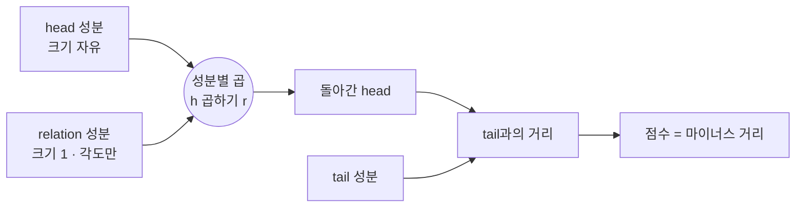
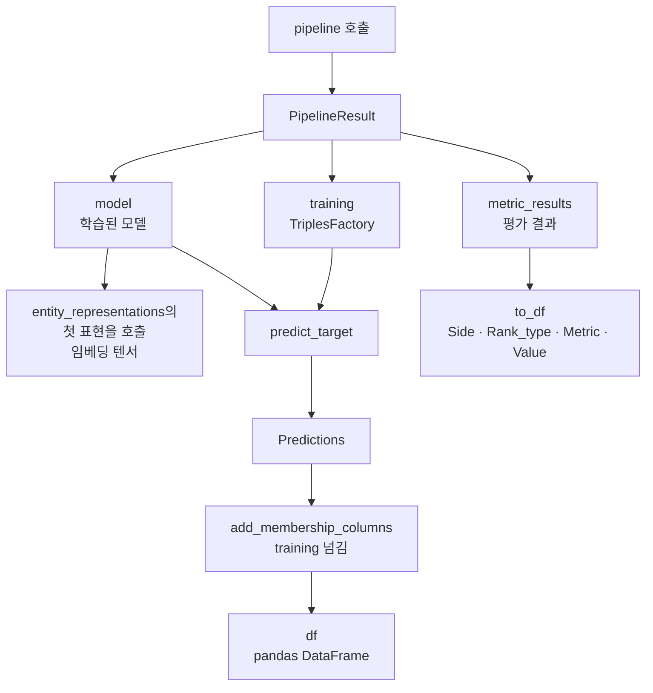
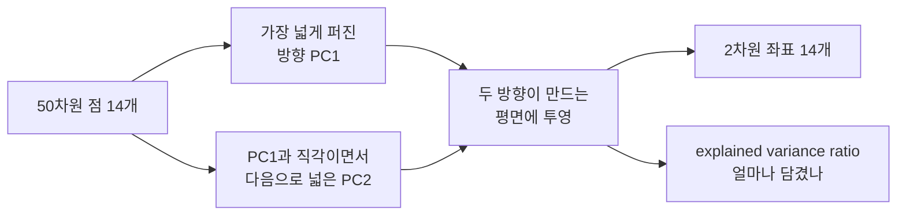
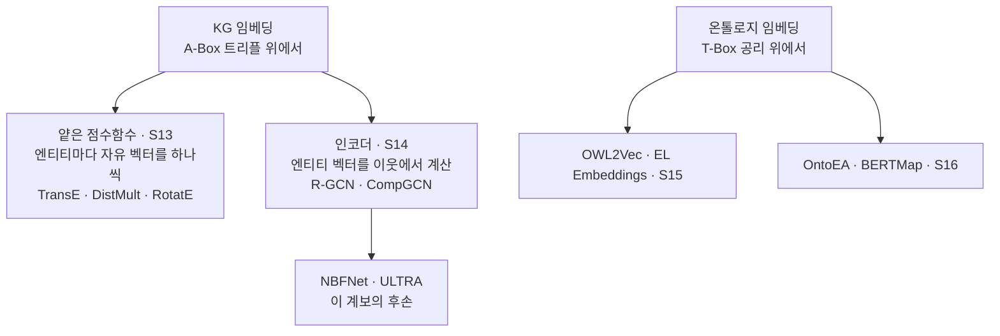

# 부록 — 읽는 데 필요한 것들

> **성격** — [S17 KG 임베딩 실습 (PyKEEN)](S17-KG-임베딩-실습-PyKEEN.md) 본편을 읽다가
> 막히는 자리를 푼다. 강의 자료에 설명이 없는 것들이다.
>
> 다섯을 다룬다. **RotatE의 복소수 회전**은 이 강의에서 처음 나오는 개념이라 밑바탕부터 쓴다
> ([S13](S13-KG-임베딩-기초.md)은 TransE와 DistMult까지만 다뤘다). **PyKEEN 함수**는
> 노트북이 호출만 하고 넘어가는 것들을 하나씩 뜯는다. **Step 6 그림 읽는 법**은
> 산점도와 히트맵에서 무엇을 읽어도 되고 무엇을 읽으면 안 되는지를 정한다.
> **6절과 7절은 대화에서 나온 물음**이다. 지표의 % 가 무엇의 % 인지, 임베딩을 다른 모델에
> 바로 쓸 수 있는지, KG 임베딩과 온톨로지 임베딩이 어떻게 갈리는지, 그리고 PyKEEN이라는
> 도구를 애초에 왜 쓰는지.
>
> 실제로 돌려본 결과는 [S17-2](S17-2-돌려보고-확인한-것들.md)에 따로 있다.

---

## 1. 한눈에

| 막히는 자리 | 어디서 | 이 문서 |
|---|---|---|
| RotatE의 `h ∘ r` 이 왜 회전인가 | 본편 3.3 | 2절 |
| 회전이 왜 대칭·비대칭·역·합성을 다 표현하나 | 본편 3.3 | 2.4 |
| RotatE만 400D로 찍히는 이유 | 본편 9.4 | 2.6 |
| `pipeline()` 이 돌려주는 것이 무엇인가 | 본편 6 | 3.1 |
| `entity_representations[0]()` 의 괄호 두 겹 | 본편 9.1 | 3.3 |
| `add_membership_columns()` 를 왜 따로 부르나 | 본편 8 | 3.4 |
| `Side` · `Rank_type` 이 무엇을 고르는 필터인가 | 본편 7 | 3.5 |
| PCA 산점도에서 무엇을 읽어야 하나 | 본편 9.4 | 4.1~4.3 |
| explained var. 30.8% 가 무슨 뜻인가 | 본편 9.4 | 4.2 |
| 코사인 유사도 히트맵의 붉은 블록 | 본편 9.4 | 4.4~4.5 |
| MR · MRR · Hits@K 중 무엇을 봐야 하나 | 본편 4 | 5절 |
| 지표의 % 가 무엇의 % 인가 | 본편 7 | 6.2 |
| 임베딩을 다른 ML 모델에 바로 쓸 수 있나 | — | 6.3 |
| KG 임베딩과 온톨로지 임베딩의 차이 | — | 6.5 |
| 이 실습의 목적이 무엇인가 | — | 6.6 |
| PyKEEN을 왜 쓰는가 | 본편 1 | 7절 |
| `Rank_type` 필터가 왜 거기 있나 | 본편 7 | 7.3 |

---

## 2. RotatE — 복소수가 왜 회전인가

### 2.1 복소수는 평면 위의 점이다

복소수 $a + bi$ 는 평면 위의 점 $(a, b)$ 와 같다. 가로축이 실수부, 세로축이 허수부다.
$i$ 는 제곱하면 $-1$ 이 되는 수로 정의되는데, 지금 필요한 성질은 그것 하나뿐이다.

원점에서 그 점까지의 거리를 **크기**, 가로축에서 잰 각도를 **각**이라고 부른다.
점 $(a, b)$ 는 크기 $\sqrt{a^2+b^2}$ 와 각 $\theta$ 로도 똑같이 지정할 수 있다.

### 2.2 곱셈이 회전이 되는 이유

복소수 두 개를 곱하면 이렇게 된다.

$$(a + bi)(c + di) = (ac - bd) + (ad + bc)i$$

이 식을 크기와 각으로 바꿔 보면 규칙이 단순해진다.

- 크기끼리는 곱해진다
- 각끼리는 더해진다

두 번째 줄이 회전이다. 어떤 점에 복소수를 곱하면 그 점이 원점을 중심으로 상대의 각만큼
돌아간다. 실수 곱셈이 수직선 위에서 늘이거나 줄이기만 하는 것과 다르게, 복소수 곱셈은
평면 위에서 늘이면서 동시에 돌린다.

### 2.3 크기를 1로 묶으면 순수한 회전만 남는다

곱하는 쪽의 크기가 1이면 크기는 그대로 두고 각만 더해진다. 이때 그 복소수는

$$r = \cos\theta + i\sin\theta$$

꼴이 되고, 이것은 반지름 1인 원 위의 점이다. RotatE는 관계 임베딩의 모든 성분을
여기에 묶어 둔다. 즉 관계 벡터의 각 성분은 **크기가 1인 복소수**이고, 담고 있는 정보는
각도 하나뿐이다.

점수 함수 $f(h,r,t) = -\lVert h \circ r - t \rVert$ 에서 $\circ$ 는 성분별 곱셈이다.
차원이 $d$ 라면 head의 성분 $d$ 개가 각자의 각도 $\theta_1, \dots, \theta_d$ 만큼 따로
돌아가고, 그 결과가 tail과 얼마나 어긋나는지를 잰다.



### 2.4 네 가지 관계 패턴이 각도로 옮겨진다

관계가 가진 성질을 각도 하나로 적을 수 있다는 것이 RotatE의 이득이다.
본편 3.3의 표를 각도 조건으로 다시 쓰면 이렇게 된다.

| 관계 패턴 | 예 | 필요한 조건 | 각도로는 |
|---|---|---|---|
| 대칭 (symmetric) | `militaryalliance` | 두 번 적용하면 제자리 | $2\theta$ 가 한 바퀴. 즉 $\theta = 180°$ |
| 비대칭 (antisymmetric) | `economicaid` | 두 번 적용해도 제자리가 아님 | $\theta$ 가 $0°$ 도 $180°$ 도 아닌 아무 각 |
| 역관계 (inversion) | `exports` ↔ `imports` | 되돌리는 관계가 따로 있음 | 부호를 뒤집은 각 $-\theta$ |
| 합성 (composition) | `a→b` + `b→c` = `a→c` | 두 관계를 이으면 세 번째 관계 | 두 각의 합 $\theta_1 + \theta_2$ |

$180°$ 회전은 점을 원점 대칭으로 옮긴다. 두 번 돌리면 $360°$ 라 제자리로 온다.
그래서 대칭 관계를 $\theta = 180°$ 로 적을 수 있고, 이때 관계 벡터는 $-1$ 이라는
**0이 아닌 값**이다.

### 2.5 앞의 두 모델은 왜 못 했나

여기가 세 모델을 가르는 자리다.

| | 관계를 무엇으로 두나 | 대칭 관계를 적으면 | 그 결과 |
|---|---|---|---|
| TransE | 평행이동 벡터 | $a + r = b$ 와 $b + r = a$ 를 동시에 만족하려면 $r = 0$ | 관계가 사라진다 |
| DistMult | 실수 대각 성분 | 곱셈 순서를 바꿔도 같으므로 **모든** 관계가 대칭이 된다 | 비대칭을 못 적는다 |
| RotatE | 크기 1인 복소수 | $\theta = 180°$ | 관계가 살아 있다 |

RotatE에서 $h \circ r$ 과 $t \circ r$ 은 다른 값이다. 곱셈 자체는 교환되지만 점수 함수가
$\lVert h \circ r - t \rVert$ 라서 $h$ 만 돌아가고 $t$ 는 그대로 남는다. head와 tail이
식에서 하는 일이 다르므로 방향이 살아남는다.

### 2.6 PyKEEN에서 200차원은 실수 400개다

RotatE의 임베딩은 복소수 텐서다. 직접 확인하면 이렇게 나온다.

```
[RotatE] entity emb (14, 200) dtype=torch.complex64
```

`embedding_dim` 이 200이지만 복소수 하나가 실수 두 개를 담으므로 실제 파라미터는
엔티티당 400개다. 본편 9.1의 `get_embedding()` 이 실수부와 허수부를 이어붙이는 것도
같은 이유이고, 그래서 산점도 제목에 `400D -> 2D` 로 찍힌다.

같은 조건으로 학습했다고 적혀 있지만 TransE와 DistMult는 실수 50차원이라
파라미터 수가 여덟 배 차이 난다. 이것이 그림 비교에 어떤 영향을 주는지는
[S17-2 2절](S17-2-돌려보고-확인한-것들.md)에 숫자로 적었다.

---

## 3. PyKEEN 함수 읽기

노트북이 부르는 함수는 많지 않지만, 반환 객체의 모양을 모르면 뒤 코드가 읽히지 않는다.



### 3.1 `pipeline()` — 학습과 평가를 한 번에

```python
result = pipeline(dataset='Nations', model='TransE',
                  training_kwargs=dict(num_epochs=100), random_seed=42, device='cpu')
```

이 한 줄 안에서 다섯 가지가 순서대로 일어난다.

1. 데이터셋을 받아 학습·검증·테스트로 나눈다 (Nations는 나눠진 상태로 들어 있다)
2. 모델을 만들고 임베딩을 무작위로 초기화한다
3. 학습 루프를 돈다 (음성 샘플링 → 점수 → 손실 → 갱신)
4. 테스트 트리플로 링크 예측 평가를 돌린다
5. 결과를 `PipelineResult` 하나에 담아 돌려준다

즉 `pipeline()` 은 학습만 하는 함수가 아니라 **평가까지 끝낸 뒤** 반환한다.
본편 7절에서 학습 코드를 다시 부르지 않고 바로 지표를 꺼내 쓸 수 있는 이유가 이것이다.

받아 쓰는 속성은 셋이다.

| 속성 | 무엇 |
|---|---|
| `.model` | 학습이 끝난 모델. 임베딩과 점수 함수가 여기 있다 |
| `.training` | 학습에 쓴 `TriplesFactory`. 이름↔번호 사전이 들어 있다 |
| `.metric_results` | 평가 결과 객체. `.to_df()` 로 표가 된다 |

### 3.2 `Nations()` 와 `TriplesFactory`

`Nations()` 는 데이터셋 객체이고, 그 안의 `.training` · `.validation` · `.testing` 이
각각 `TriplesFactory` 다. 팩토리가 들고 있는 것은 트리플 배열과 사전 두 개다.

| | 무엇 |
|---|---|
| `entity_to_id` | `{'brazil': 0, 'burma': 1, ...}` 이름을 번호로 |
| `relation_to_id` | `{'accusation': 0, ...}` 관계 이름을 번호로 |
| `mapped_triples` | 번호로 바뀐 트리플 텐서. 모델이 실제로 먹는 것 |
| `num_triples` | 트리플 개수 |

모델은 이름을 모른다. 번호만 안다. 본편 5.2에서 `list(entity_to_id.keys())` 로 이름을
꺼내는 것도, 9.1에서 그 리스트를 그림의 라벨로 쓰는 것도 같은 이유다.
**사전의 순서가 곧 임베딩 행렬의 행 순서**라서, 라벨 리스트와 임베딩 배열의 i번째가
서로 맞는다.

### 3.3 `entity_representations[0]()` — 괄호가 두 겹인 이유

```python
emb = result.model.entity_representations[0]().detach().numpy()
```

세 단계로 갈린다.

- `entity_representations` 는 **리스트**다. 모델에 따라 엔티티 표현이 여러 개일 수 있어서
  (예: 실수부와 허수부를 따로 두거나, 여러 표현을 이어 쓰는 모델) 리스트로 되어 있다.
  TransE·DistMult·RotatE는 하나뿐이라 `[0]` 이면 된다
- `[0]` 은 텐서가 아니라 **표현 모듈**이다. 부르면(`()`) 그때 텐서를 만들어 돌려준다.
  임베딩을 그냥 저장해 두는 모델도 있지만 계산해서 만드는 모델도 있어서 호출 형태로 통일했다
- `.detach()` 는 자동미분 기록을 떼는 것이고, `.numpy()` 는 넘파이 배열로 바꾸는 것이다.
  둘 다 학습이 끝난 값을 그림 그리는 데만 쓰겠다는 뜻이다

`.detach()` 를 빼면 numpy 변환에서 오류가 난다. 텐서가 아직 계산 그래프에 매달려 있기
때문이다.

### 3.4 `predict_target()` 과 `add_membership_columns()`

```python
pred = predict_target(model=res.model, head='brazil', relation='intergovorgs',
                      triples_factory=res.training)
df = pred.add_membership_columns(training=res.training).df.head(5)
```

`predict_target` 은 셋 중 하나를 비워 둔 질의를 받는다. `head` 와 `relation` 을 주면
tail을 채우고, `relation` 과 `tail` 을 주면 head를 채운다. `triples_factory` 를 넘기는
것은 이름을 번호로 바꾸기 위해서다. 반환값은 후보 전체를 점수 내림차순으로 세운 객체다.

여기서 나온 순위는 **아는 사실을 걸러내지 않은** 순위다. 학습 데이터에 이미 있는
트리플도 그대로 상위에 올라온다. `add_membership_columns(training=...)` 를 이어 붙이면
`in_training` 열이 생겨서 각 후보가 이미 아는 사실인지 표시된다.

이게 왜 필요한지는 본편 4절의 평가 규칙과 짝을 이룬다. Step 4의 지표 계산에서는
"정답 후보 중 이미 참으로 알려져 있는 트리플은 랭킹 후보에서 제외"가 자동으로 걸리는데,
Step 5의 낱개 질의에는 그런 장치가 없다. 그래서 손으로 표시를 붙여 눈으로 거른다.

| | 아는 사실 제외 | 언제 |
|---|---|---|
| Step 4 평가 | 자동 (filtered setting) | `pipeline()` 안에서 |
| Step 5 질의 | 수동 (`in_training` 열을 보고 판단) | 사람이 |

### 3.5 `metric_results.to_df()` 의 네 열

평가 결과는 값 하나가 아니라 표로 나온다. 열이 넷이다.

| 열 | 값 | 뜻 |
|---|---|---|
| `Side` | `head` · `tail` · `both` | 어느 방향 질의만 모은 점수인가 |
| `Rank_type` | `optimistic` · `realistic` · `pessimistic` | 동점 처리 방식 |
| `Metric` | `arithmetic_mean_rank` 등 | 지표 이름 |
| `Value` | 실수 | 값 |

**`Side`** — 본편 7절에서 봤듯 테스트 트리플 하나가 질의 둘을 만든다. `head` 는 head를
가린 질의만, `tail` 은 tail을 가린 질의만 모은 것이고, `both` 는 402개 전부다.
노트북이 `both` 를 고른 것은 모델을 한 숫자로 보기 위해서다.

**`Rank_type`** — 정답과 점수가 똑같은 후보가 여럿일 때 정답에 몇 등을 줄지의 문제다.
`optimistic` 은 동점자 중 가장 앞자리, `pessimistic` 은 가장 뒷자리, `realistic` 은
그 중간을 준다. 점수가 실수라 동점이 잘 안 나기 때문에 대개 셋이 같은 값이 되는데,
이 실습에서도 그랬다 ([S17-2 4절](S17-2-돌려보고-확인한-것들.md)).

**지표 이름이 통용 표기와 다르다.** MRR의 내부 키가 `inverse_harmonic_mean_rank` 인 것이
그 예다. 순위 역수의 산술평균은 순위의 조화평균의 역수와 같은 값이라, 같은 것을 다른
이름으로 부르고 있다.

### 3.6 노트북이 넘기지 않은 것들

Step 3이 넘기는 인자는 여섯인데 학습에 영향을 주는 것은 `model` · `num_epochs` ·
`random_seed` 셋뿐이다. `use_tqdm_batch` 와 `use_tqdm` 은 진행 막대를 끄고,
`device='cpu'` 는 GPU를 쓰지 않겠다는 뜻이다.

나머지는 전부 기본값으로 간다. 임베딩 차원, 손실 함수, 옵티마이저, 학습률, 음성 샘플러,
배치 크기가 그렇다. 슬라이드 1절이 보여준 `loss='nssa'` 같은 교체를 노트북은 하나도 쓰지
않는다. 실제로 무엇이 들어갔는지는 [S17-2 2절](S17-2-돌려보고-확인한-것들.md)에서
객체를 열어 확인했다.

---

## 4. Step 6 그림 읽는 법

Step 6은 그림 네 장을 뽑는다. 엔티티 PCA · 엔티티 히트맵 · 관계 PCA · 관계 히트맵이고,
각 장에 모델 셋이 나란히 들어간다. 문제는 이 그림에서 **무엇을 읽어도 되는지**다.

### 4.1 PCA가 하는 일

엔티티 임베딩은 50차원 공간의 점 14개다. 사람은 50차원을 볼 수 없으니 2차원으로
줄여야 한다. PCA는 이렇게 줄인다.

1. 점 14개가 가장 넓게 퍼져 있는 방향을 하나 찾는다. 이것이 **PC1**
2. PC1과 직각인 방향 중에서 다시 가장 넓게 퍼진 방향을 찾는다. 이것이 **PC2**
3. 모든 점을 이 두 방향이 만드는 평면에 수직으로 떨어뜨린다

빛을 쏘아 벽에 그림자를 만드는 것과 같다. 그림자를 가장 크게 만드는 각도를 골랐을 뿐이다.



### 4.2 explained variance ratio — 이 그림을 믿어도 되나

투영하면 정보가 버려진다. 얼마나 버려졌는지를 알려주는 숫자가
`explained_variance_ratio_` 다. PC1이 16.6%, PC2가 14.1%라면 원래 흩어짐의 30.8%만
그림에 남고 나머지 69.2%는 사라졌다는 뜻이다.

읽는 기준은 이렇다.

| 두 축 합 | 그림을 어떻게 볼 것인가 |
|---|---|
| 70% 이상 | 대체로 믿어도 된다. 가까워 보이면 실제로 가깝다 |
| 40~70% | 큰 덩어리 구분 정도만 |
| 40% 미만 | 배치를 근거로 삼지 않는다 |

본편 9.4의 세 값 중 DistMult만 75.7%이고 TransE 30.8%, RotatE 30.6%다.
관계 임베딩에서는 RotatE가 6.6%까지 내려간다. 이 그림들에서 점의 배치를 읽는 것은
의미가 없다.

**주의할 방향이 하나 있다.** 투영은 거리를 줄이기만 하고 늘리지는 않는다. 그래서
그림에서 멀리 떨어진 두 점은 원래도 멀지만, 그림에서 붙어 있는 두 점은 원래
멀었을 수도 있다. 설명력이 낮은 그림에서 "가깝다"는 관찰만 위험하고 "멀다"는
관찰은 그래도 살아 있다.

### 4.3 산점도에서 읽으면 안 되는 것

PCA 축에는 정해진 방향도 단위도 없다. 다음 셋은 그림마다 제멋대로 바뀌므로
근거로 쓰면 안 된다.

- **좌우·상하 부호.** PC1을 통째로 뒤집어도 똑같이 올바른 PCA다. 어떤 나라가 왼쪽에
  있다는 사실 자체에는 뜻이 없다
- **축의 눈금값.** PC1이 0.5라는 것은 그 자체로 아무 의미도 없다. 축 이름이
  `PC1 (16.6%)` 처럼 비율만 달고 있는 이유다
- **모델 사이의 위치 대응.** 세 산점도의 축은 각자 따로 계산된 것이다. TransE 그림의
  오른쪽과 RotatE 그림의 오른쪽은 다른 방향이다

남는 것은 **한 그림 안에서 누가 누구 옆에 있는가** 하나다. 그것만 모델끼리 비교한다.

### 4.4 코사인 유사도

두 벡터가 이루는 각의 코사인 값이다. 길이는 무시하고 방향만 본다.

| 값 | 뜻 |
|---|---|
| +1 | 같은 방향 |
| 0 | 직각. 서로 무관 |
| -1 | 정반대 방향 |

길이를 무시하는 것이 여기서 유리하다. 자주 등장하는 엔티티는 학습 중에 갱신을 많이 받아
벡터가 길어지는 경향이 있는데, 코사인은 그 영향을 받지 않고 "어느 쪽을 향하고 있는가"만
비교한다.

히트맵은 이 값을 14×14 표로 만들어 색으로 칠한 것이다. 붉은색이 양수, 파란색이 음수,
흰색이 0 근처다. **대각선은 항상 +1** 이다. 자기 자신과의 각이 0이기 때문이고,
그래서 대각선이 붉은 것은 아무 정보도 아니다.

### 4.5 히트맵의 축 순서가 모델마다 다른 이유

같은 데이터라도 행과 열 순서에 따라 무늬가 보이기도 하고 안 보이기도 한다. 비슷한 것끼리
이웃으로 세워야 사각형 덩어리가 눈에 들어온다.

```python
order = dendrogram(linkage(X, method='average', metric='cosine'), no_plot=True)['leaves']
```

`linkage` 는 계층 군집이다. 가장 비슷한 둘을 묶고, 그 묶음을 하나로 쳐서 또 가장 비슷한
것과 묶는 일을 반복한다. `method='average'` 는 묶음끼리의 거리를 구성원 간 거리의 평균으로
재고, `metric='cosine'` 은 그 거리를 코사인으로 잰다. `['leaves']` 가 그 나무의 잎 순서를
주고, 그 순서로 행과 열을 세우면 비슷한 것끼리 붙는다.

**대가가 있다.** 모델마다 군집 구조가 다르므로 순서도 달라진다. 세 히트맵의 같은 좌표는
서로 다른 나라를 가리키므로, 축 라벨을 읽지 않으면 세 장을 비교할 수 없다.

### 4.6 그래서 네 장에서 읽어야 할 것

| 읽어도 되는 것 | 읽으면 안 되는 것 |
|---|---|
| 블록(덩어리)이 생기는가, 흐릿한가 | 어느 나라가 왼쪽/오른쪽에 있는가 |
| 블록의 구성원이 상식과 맞는가 | 두 점 사이 거리의 절대값 |
| 색의 대비가 뚜렷한가 | 세 그림의 같은 좌표 비교 |
| explained var.가 그림을 믿을 만큼 높은가 | 모델 사이의 점수·좌표 값 비교 |

이 기준으로 보면 산점도를 읽어도 되는 것은 DistMult(75.7%) 하나뿐이고, 나머지 셋은
히트맵의 블록 유무까지만 본다. 본편 9.4·9.5의 관찰이 그 결과다.

**여기서 성능 결론으로 건너뛰면 안 된다.** 히트맵이 흐리다는 것은 임베딩 공간의 모양에
대한 관찰이지 링크 예측을 잘한다는 뜻이 아니다. 실제 지표와 어떻게 어긋나는지는
[S17-2 8절](S17-2-돌려보고-확인한-것들.md)에 적었다.

---

## 5. 지표 셋 중 무엇을 봐야 하나

본편 4절과 7절이 MR · MRR · Hits@K를 나란히 놓지만 셋의 성격이 다르다.

| 지표 | 무엇에 민감한가 | 약한 자리 |
|---|---|---|
| MR | 아주 나쁜 순위 하나에 크게 흔들린다 | 한 질의에서 14등을 맞으면 평균이 통째로 밀린다 |
| MRR | 상위권 차이를 크게 본다 | 뒤쪽 순위는 거의 구분하지 못한다 (10등과 14등이 0.100 대 0.071) |
| Hits@K | 해석이 직관적이다 | K가 후보 수에 비해 크면 무의미해진다 |

**MRR이 상위권에 민감한 것**은 역수의 성질이다. 1등과 2등은 1.00 대 0.50으로 0.5만큼
벌어지지만, 10등과 11등은 0.100 대 0.091로 0.009밖에 차이 나지 않는다.

**Hits@K의 K는 후보 수와 함께 봐야 한다.** Nations는 후보가 14개뿐이라, 아무렇게나 찍어도
정답이 10등 안에 들 확률이 10/14 = 0.71이다. Hits@10이 0.95든 0.98이든 모델을 구분해주지
못한다. 후보가 수만 개인 FB15k 같은 데이터셋의 지표를 그대로 가져온 결과다.

Nations에서 실제로 모델을 가르는 것은 Hits@1과 MRR이다. 실측값은
[S17-2 3절](S17-2-돌려보고-확인한-것들.md)에 있다.

---

## 6. 이 실습이 재고 있는 것

여기까지 읽고 나면 물음이 하나 남는다. 지표가 0.45라는 것은 **무엇이** 0.45라는 뜻인가.
그리고 이 실습은 무엇을 하려고 하는가.

### 6.1 임베딩은 변환이 아니라 학습이다

"KG의 head · relation · tail을 벡터로 바꾸는 것"이라는 이해는 결과물만 놓고 보면 맞다.
다만 그 벡터가 어디서 오는지가 다르다.


`KG → 벡터` 라는 결정론적 변환 함수가 따로 있는 것이 아니다. **과제를 정해야 벡터가
정해진다.** 링크 예측으로 학습한 벡터와 노드 분류로 학습한 벡터는 같은 KG에서 나와도
다른 값이다. 전처리 단계가 아니라 그 자체가 학습의 산출물이다.

본편 2절이 음성 샘플링 · 점수 함수 · 손실 함수를 세 부품으로 나눠 설명한 이유가 이것이다.
그 셋이 바로 "어떤 과제를 풀게 할 것인가"를 정하는 자리다.

### 6.2 지표는 표현 충실도가 아니다

`Hits@1 = 0.4502` 를 "KG를 45% 정확도로 표현했다"로 읽으면 안 된다.
정확히는 **"질의 402개 중 181개에서 정답을 1위로 올렸다"** 이고, 여기서 정답이란
KG에 원래 있었지만 학습 때 가려둔 트리플이다.

표현 충실도로 읽으면 안 되는 이유를 실행으로 확인했다. 학습에 쓴 트리플을 다시 채점해
봤는데, 자기가 본 데이터조차 되살리지 못한다.

| 모델 | MRR (학습 트리플 재채점) | MRR (안 본 테스트) |
|---|---|---|
| TransE | 0.3974 | 0.3435 |
| DistMult | 0.5655 | 0.6122 |
| RotatE | 0.5650 | 0.5143 |

> 두 열의 필터링 조건이 달라서(테스트 채점은 학습·검증 트리플을 후보에서 빼고, 학습
> 재채점은 그 장치가 약하다) 열 사이의 크고 작음을 비교하지는 않는다. 여기서 읽을 것은
> **왼쪽 열이 1.0 근처가 아니라는 사실 하나**다.

애초에 그럴 수밖에 없다. TransE는 트리플 1,592개를 실수 3,450개에 눌러 담는다.
손실 압축이니 원본이 그대로 복원될 리가 없다. 재는 것은 **그 압축이 안 본 사실을 맞힐
만큼 구조를 담았는가**다.

**채점 방식에도 한계가 있다.** 평가는 KG에 없는 트리플을 전부 거짓으로 친다.
개방세계가정에서는 없는 것이 거짓이 아닌데도 그렇게 채점한다
([S11-1](S11-1-온톨로지가-하지-않는-일.md)). 모델이 실제로 참인 새 사실을 1위로 올려도
오답으로 기록된다. 지표가 모델 실력의 하한선에 가깝다는 뜻이다.

### 6.3 그래서 ML에 바로 쓸 수 있나

용도를 둘로 갈라야 답이 달라진다.

| | 링크 예측 자체가 목적 | 다른 모델의 입력 feature로 |
|---|---|---|
| 쓰이는 곳 | 빠진 트리플 채우기, 추천, 개체 정렬 | KG 정보를 언어모델에 주입, 분류기 입력 |
| MRR · Hits@K의 뜻 | 그것이 곧 결과물의 품질 | 아래에 따로 쓴다 |
| 강의에서 | 이 실습(S17)과 S13 · S14 | Ch.6 (S19~S22) |

왼쪽은 간단하다. 빠진 트리플을 채우는 것이 결과물이면 Hits@1이 0.45라는 말은
"내놓은 1순위 답의 45%가 맞다"이고, 그대로 제품 품질이다. 사람 검토를 붙일지 말지를
이 숫자로 정하면 된다.

**오른쪽에서 지표의 성격이 달라진다.** 예를 들어 제조 KG에서 설비 임베딩을 뽑아
불량 원인 분류기에 넣는다고 하자.

- 알고 싶은 것은 "이 벡터를 넣으면 분류 정확도가 오르는가"다
- 그것은 분류기를 실제로 학습시켜야 알 수 있다. 라벨이 필요하고 비용이 든다
- 그래서 대신 링크 예측 MRR을 본다. 가려둔 트리플을 맞힐 정도면 그래프 구조가
  담겼으리라고 짐작하는 것이다

이 짐작이 **대리 시험**이다. 본시험(분류 정확도) 대신 치는 모의고사에 해당한다.
모의고사가 싸고 라벨이 필요 없다는 것이 장점이고, 점수가 본시험을 보장하지 않는다는
것이 한계다.

이 실습이 그 한계의 예를 준다. RotatE는 MRR 0.5143으로 TransE(0.3435)를 이기는데,
RotatE 벡터에 실제로 담긴 것은 대부분 "이 나라가 학습 데이터에 얼마나 자주 나왔나"다
(tail 빈도와 상관 +0.903, [S17-2 6.2절](S17-2-돌려보고-확인한-것들.md)).
빈도만 담긴 벡터는 과제에 따라 아무 도움이 안 된다. **MRR이 높다는 것과 벡터가
쓸모 있다는 것은 다른 말이다.**

> 하류 과제를 실제로 돌려서 확인하지는 않았다. Nations는 엔티티가 14개뿐이라
> 분류기를 붙여도 의미 있는 수치가 나오지 않는다.

**이 실습은 왼쪽만 한다.** 학습한 벡터를 다른 모델에 넘기는 절이 없다.
오른쪽은 ERNIE · KnowBERT · K-BERT처럼 엔티티 임베딩을 언어모델에 넣는 회차에서 나온다.

### 6.4 반복하면 지표가 오르나

`num_epochs=100` 이 그 반복이다. 다만 반복만으로는 올라가지 않는다.
[S17-2 6절](S17-2-돌려보고-확인한-것들.md)에서 본 대로 TransE는 100 에폭을 다 돌고도
질의의 95.5%에서 head 자신을 답하는 상태로 끝났다. 더 돌린다고 그 상태에서 빠져나오지
않는다. 손실이 이미 낮은 곳에 자리를 잡았기 때문이다.

필요한 것은 반복 횟수가 아니라 차원 · 손실 함수 · 음성 샘플러 · 학습률의 선택이다.
PyKEEN에 Optuna가 들어 있는 이유가 그것이고, 이 실습은 그것을 쓰지 않는다.

### 6.5 KG 임베딩과 온톨로지 임베딩의 차이

Ch.5는 두 갈래를 나란히 다뤘다. 그 차이가 S17과 S18이 다른 도구를 쓰는 이유다.

| | KG 임베딩 | 온톨로지 임베딩 |
|---|---|---|
| 회차 | [S13](S13-KG-임베딩-기초.md) · [S14](S14A-R-GCN-관계별-메시지-전달.md) → **S17 실습** | [S15](S15A-OWL2Vec-star-문장-기반-임베딩.md) · [S16](S16A-OntoEA-온톨로지를-넣은-엔티티-정렬.md) → **S18 실습** |
| 벡터로 만드는 대상 | instance (A-Box). `brazil` · `uk` | class와 개념 (T-Box). `Disease` · `Drug` |
| 입력 | 트리플 `(h, r, t)` | 공리. `C ⊑ D` · `C ⊓ D ⊑ ⊥` · `∃r.C ⊑ D` |
| 지켜야 하는 것 | 트리플이 참인가 | 논리적 함의가 유지되는가 |
| 평가 과제 | 링크 예측 (MR · MRR · Hits@K) | subsumption 예측, 정렬 정확도 (P · R · F1) |
| 기하 | 점 | EL Embeddings는 공(ball) |
| 도구 | PyKEEN | DeepOnto · mOWL |

핵심은 "지켜야 하는 것" 줄이다. KG 임베딩은 트리플 하나하나가 참인지만 맞히면 된다.
온톨로지 임베딩은 `A ⊑ B` 와 `B ⊑ C` 가 참이면 `A ⊑ C` 도 따라나와야 한다. 점으로는 이
이행성을 담기 어려워서 EL Embeddings가 개념을 공으로 두고, 공의 포함이 곧 개념의 포함이
되도록 손실을 세운다.

**KG 임베딩 안에도 갈래가 둘이라 헷갈리기 쉽다.** S13과 S14가 다른 회차로 나뉘어 있어서
서로 다른 종류처럼 보이지만, 둘 다 A-Box 트리플 위에서 돈다.



**R-GCN과 CompGCN은 온톨로지 임베딩이 아니라 KG 임베딩이다.** 실행으로도 확인된다.
PyKEEN 모델 목록에 `rgcn` 과 `compgcn` 이 들어 있고 같은 파이프라인에서 그대로 돌아가는데,
온톨로지 임베딩 모델(OWL2Vec\* · EL Embeddings · OntoEA · BERTMap)은 하나도 없다
([S17-2 7.6](S17-2-돌려보고-확인한-것들.md)). 갈리는 지점은 S14가 아니라 S15다.

### 6.6 이 실습의 목적

**성능을 내는 것이 목적이 아니다.** 근거가 실습 안에 있다.

- 데이터가 Nations다. 엔티티 14개에, 가능한 조합 10,780개 중 1,992개(18.5%)가
  이미 참으로 적혀 있는 조밀한 장난감 그래프다
- 하이퍼파라미터를 하나도 건드리지 않고 전부 기본값으로 간다
- 내장 Optuna를 쓰지 않는다

목적은 셋으로 읽힌다.

1. **PyKEEN이 왜 이런 모양인지를 손으로 겪기.** `pipeline()` 한 줄에 학습부터 평가까지
   들어 있는 것, 지표를 꺼내려면 `Side` 와 `Rank_type` 을 좁혀야 하는 것. 이 설계가
   어디서 왔는지는 7절에 따로 썼다
2. **S13의 이론이 숫자로 나타나는지 보기.** "DistMult는 방향을 구분하지 못한다"가
   실제 결과에서 어떻게 드러나는지
3. **평가 프로토콜을 겪어보기.** 트리플 하나가 질의 둘을 만든다는 것, 아는 사실을
   후보에서 뺀다는 것, 지표가 셋인데 성격이 다르다는 것

여기에 하나가 더 붙는다. **지표 표만 보면 속는다**는 것이다. RotatE는 MRR이 TransE보다
높지만 실제로는 질문을 거의 보지 않고 인기 순위를 낸다([S17-2 6.2절](S17-2-돌려보고-확인한-것들.md)).
Step 4에서 끝내지 않고 Step 5에서 질의 하나를 열어보는 절이 있는 이유가 여기 있다.

---

## 7. PyKEEN을 왜 쓰는가

본편 1절이 슬라이드를 그대로 옮겨 "모델마다 구현, 평가 방식이 달라 논문 간 성능 비교
불가"라고 적었다. 한 줄로는 추상적으로 들리는데, 실제로 사고가 났고 그 대응으로 나온 것이
이 라이브러리다.

### 7.1 2020년 전후에 무슨 일이 있었나

링크 예측 분야에서 재현성 문제가 세 갈래로 터졌다.

**성능 차이가 모델이 아니라 학습 설정에서 왔다.** Ruffinelli, Broscheit, Gemulla가
2011년 모델 RESCAL을 당시의 학습 기법으로 제대로 튜닝했더니 훨씬 나중에 나온 모델들과
대등하거나 더 나은 결과를 냈다. 여러 모델의 상대적 성능 차이가 제대로 학습시키면
줄어들거나 뒤집혔다.

> Ruffinelli, Broscheit, Gemulla (2020), _You CAN Teach an Old Dog New Tricks!
> On Training Knowledge Graph Embeddings_, ICLR
> ([Semantic Scholar](https://www.semanticscholar.org/paper/829af9ef30d654c697c0309036a9087666b2f3e3))

**일부 모델의 압도적 성능이 평가 코드 결함이었다.** Sun, Vashishth, Sanyal, Talukdar,
Yang이 최근 논문들의 매우 높은 성능이 부적절한 평가 프로토콜에서 왔다는 것을 보이고
대안을 제시했다. **여러 후보에게 똑같은 점수를 주는 모델**이 문제였다. 그 동점 무리에서
정답에 가장 좋은 등수를 주면 성능이 부풀려진다.

> Sun, Vashishth, Sanyal, Talukdar, Yang (2020), _A Re-evaluation of Knowledge Graph
> Completion Methods_, ACL ([arXiv:1911.03903](https://arxiv.org/abs/1911.03903))

**그래서 하나의 틀에 다시 구현해 전부 다시 쟀다.** PyKEEN 팀이 21개 모델을 재구현해
데이터셋 4개에 수천 번의 실험을 돌렸다. GPU 24,804시간이 들었고, 결론은 여러 구조가
제대로 설정하면 최신 결과와 대등하다는 것이었다.

> Ali et al. (2022), _Bringing Light Into the Dark: A Large-scale Evaluation of Knowledge
> Graph Embedding Models Under a Unified Framework_, IEEE TPAMI 44(12)
> ([arXiv:2006.13365](https://arxiv.org/abs/2006.13365))

### 7.2 그 대응이 라이브러리의 모양이 됐다

PyKEEN의 설계는 편의를 위한 것이 아니라 위 문제들에 대한 답이다.

| 무엇이 문제였나 | PyKEEN이 하는 일 |
|---|---|
| 논문마다 학습 설정이 달라 모델 비교가 안 된다 | 데이터 분할 · 학습 루프 · 평가 코드를 고정하고 모델만 갈아끼운다 |
| 저자가 자기 모델만 열심히 튜닝했다 | Optuna를 내장해 모든 모델에 같은 예산으로 탐색한다 |
| 평가 코드를 직접 짜다 틀린다 | filtered setting, 양방향 질의, 동점 처리를 라이브러리가 맡는다 |
| 동점 처리로 성능이 부풀려진다 | `Rank_type` 셋을 **모두 보고**해서 숨길 수 없게 한다 |
| 논문에 적힌 숫자를 믿을 수 없다 | 시드를 고정하면 환경을 건너 재현된다 |

본편 1절의 표(모델 40 · 데이터셋 37 · 지표 44 · 손실 15 · 샘플러 3)와 문자열 하나로
부품을 바꾸는 코드가 첫 줄에서 나온다. 부품을 갈아끼울 수 있게 만든 것은 편해서가 아니라
**나머지를 고정한 채로 하나만 바꿔야 비교가 성립하기 때문**이다.

### 7.3 이것이 노트북 코드에 어떻게 나타나는가

```python
sub = df[(df['Side'] == 'both')
         & (df['Rank_type'] == 'realistic')
         & (df['Metric'] == metric_key)]
```

Step 4의 이 필터에서 `Rank_type == 'realistic'` 이 임의로 붙은 것이 아니다.
**부풀리기 방지 장치**다. 여기서 `optimistic` 을 고르면 7.1에서 문제가 됐던 그 평가를
그대로 하는 셈이 된다.

| `Rank_type` | 동점 무리에서 정답에 주는 등수 | 성격 |
|---|---|---|
| `optimistic` | 가장 앞자리 | 성능이 부풀려진다 |
| `realistic` | 가운데 | 기본으로 삼는 값 |
| `pessimistic` | 가장 뒷자리 | 하한선 |

그리고 [S17-2 4절](S17-2-돌려보고-확인한-것들.md)에서 확인한 것이 여기서 뜻을 갖는다.
이 실습에서는 셋의 값이 완전히 같았는데, 그것은 **세 모델이 동점을 내지 않는다**는 뜻이고
곧 부풀리기 문제에서 자유롭다는 뜻이다. 세 값이 갈리는 모델을 만났다면 그 자체가 경보다.
값이 하나로 합쳐진 결과만 봐서는 이것을 알 수 없으므로 라이브러리가 셋을 다 내놓는다.

### 7.4 한 줄로

**모델을 만들려고 쓰는 도구가 아니라, 모델을 믿을 수 있게 비교하려고 쓰는 도구다.**

세 모델을 같은 코드로 돌려 같은 표에 올려놓는 것 자체가 이 라이브러리를 쓰는 이유이고,
그 "같은 조건"이 기본값 때문에 어긋나 있었다는 것을 발견할 수 있었던 것도 같은 틀 위에
놓고 봤기 때문이다([S17-2 2절](S17-2-돌려보고-확인한-것들.md)).

비교에는 비교군이 필요한데, 그 기준선도 라이브러리가 들고 있다.
넣어 봤더니 결론이 뒤집혔다([S17-2 7절](S17-2-돌려보고-확인한-것들.md)).

---

📎 [S17 본편](S17-KG-임베딩-실습-PyKEEN.md) · [S17-2 돌려보고 확인한 것들](S17-2-돌려보고-확인한-것들.md)
