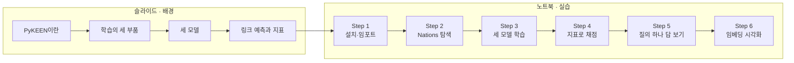
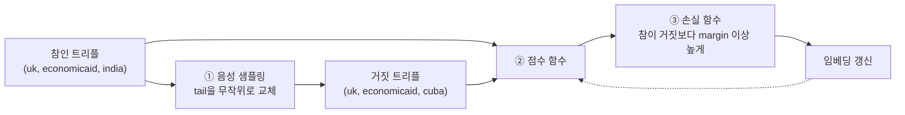

# S17 — KG 임베딩 실습 (PyKEEN)

> **실습③** · Week 5 · Day 9
> 원자료 — DSBA Lab Study 슬라이드(도입부) + 노트북 `DSBA_Study_Ontology_week5_PyKEEN_박하연.ipynb`
> 도구 — **PyKEEN 1.11.1** · torch · scikit-learn · matplotlib
> 데이터 — Nations (PyKEEN 내장, 14 엔티티 · 55 관계 · 1,592 / 199 / 201 트리플)
> 모델 — TransE · DistMult · RotatE
>
> 참고 논문 (모델 이론은 [S13](S13-KG-임베딩-기초.md)에서 다뤘다)
> · Ali et al. (2021), _PyKEEN 1.0: A Python Library for Training and Evaluating Knowledge
>   Graph Embeddings_, JMLR 22(82) ([arXiv:2007.14175](https://arxiv.org/abs/2007.14175))
> · Sun, Deng, Nie, Tang (2019), _RotatE: Knowledge Graph Embedding by Relational Rotation
>   in Complex Space_, ICLR ([arXiv:1902.10197](https://arxiv.org/abs/1902.10197))
>
> 📖 [강의 목차](README.md) · [YouTube 재생목록](https://www.youtube.com/watch?v=f0WV7b3lGqM&list=PLFHGWfB_kmrs)
> 이전 [S16B BERTMap](S16B-BERTMap-문맥-임베딩-기반-정렬.md) · 다음 S18 DeepOnto 실습
> 📎 부록 [S17-1 읽는 데 필요한 것들](S17-1-읽는-데-필요한-것들.md) · [S17-2 돌려보고 확인한 것들](S17-2-돌려보고-확인한-것들.md)

**실습 회차라 문서 구성이 다르다.** S13~S16은 슬라이드 소절을 절로 삼고 논문 아이디어를
서술했지만, 이 문서는 노트북의 Step 순서를 따라가며 **어떤 API를 왜 부르는지**를 적는다.
세 모델의 수식과 한계는 [S13](S13-KG-임베딩-기초.md)에 있으니 여기서는 요약만 두고,
PyKEEN에서 그 모델을 어떻게 고르고 바꾸는지에 무게를 둔다.

**부록이 둘이다.** 노트북이 설명 없이 쓰는 PyKEEN 함수와 RotatE의 복소수 회전, 그리고
Step 6 그림을 읽는 법은 [S17-1](S17-1-읽는-데-필요한-것들.md)에 있다. 같은 코드를 직접
돌려 확인한 것은 [S17-2](S17-2-돌려보고-확인한-것들.md)에 있다.

**노트북 출력 중 일부는 자료로 받지 못했다.** Step 3의 학습 로그, Step 4의 평가 결과 표,
Step 5의 예측 결과 표가 그렇다. 그 자리에는 직접 돌린 값을 가리키는 표시를 달아 두었다.

---

## 이 회차의 모양



Step 4와 Step 5가 갈리는 지점이 이 실습의 핵심이다. Step 4는 테스트 트리플 201개를 전부
채점해 성능을 숫자 하나로 줄이고, Step 5는 질의 하나를 골라 모델이 실제로 뭐라고
답했는지를 본다. 같은 모델을 두 방향에서 보는 것이다.

> 이 실습이 무엇을 재고 있는지, 지표의 % 가 무엇의 % 인지, KG 임베딩과 온톨로지 임베딩이
> 어디서 갈리는지는 [S17-1 6절](S17-1-읽는-데-필요한-것들.md)에 따로 적었다.

---

## 1. PyKEEN이 푸는 문제

**PyKEEN** — KG Embedding 모델의 학습과 평가를 위한 파이썬 라이브러리.

**라이브러리가 생긴 배경.** 모델마다 구현과 평가 방식이 달라 논문 간 성능 비교가 불가능했다.
그래서 데이터셋 준비 → 학습 → 평가를 하나의 파이프라인으로 통일했다.

> 이 한 줄 뒤에 2020년 전후의 재현성 문제가 있다. 무슨 일이 있었고 그것이 라이브러리의
> 모양을 어떻게 정했는지는 [S17-1 7절](S17-1-읽는-데-필요한-것들.md)에 적었다.

**특징 셋**

- 모델, 데이터셋, 평가지표, 손실함수, 음성 샘플러 등 구성 요소를 독립적으로 교체 가능
- 공정한 비교 및 재현성 확보
- 하이퍼파라미터 자동 탐색 (Optuna) 내장

교체 가능하다는 말이 코드에서 무슨 뜻인지 슬라이드가 한 화면으로 보여준다.

```python
from pykeen.pipeline import pipeline
result = pipeline(
    dataset='Nations',
    model='RotatE',
    loss='nssa',                                        # 손실 함수 교체
    negative_sampler='bernoulli',                       # 음성 샘플러 교체
    negative_sampler_kwargs=dict(num_negs_per_pos=64),  # 음성 개수 조정
    training_loop='lcwa',                               # 학습 방식 교체
)
```

문자열 하나를 바꾸면 부품이 바뀐다. 갈아끼울 수 있는 부품의 수는 이렇다.

| 항목 | 개수 |
|---|---|
| 모델 | 40 |
| 데이터셋 | 37 |
| 순위 기반 평가 지표 | 22 |
| 분류 기반 평가 지표 | 22 |
| 손실 함수 | 15 |
| 음성 샘플러 | 3 |

---

## 2. 임베딩 학습의 세 부품

슬라이드는 학습을 세 부품으로 갈라 설명한다.



### 2.1 음성 샘플링

참 샘플과 거짓 샘플을 margin 이상 차이나도록 하는 것이 임베딩 학습의 목표다(대조 학습).
이에 따라 참인 트리플의 head 또는 tail을 무작위 엔티티로 바꿔 거짓 샘플을 생성한다.

### 2.2 점수 함수

트리플이 참인 정도를 실수로 나타내는 함수. 점수가 클수록 참에 가깝다.
거리를 쓰는 함수는 `-거리`로 점수 함수를 정의한다. 이때 범위는 음수가 된다.

- 예: $-\lVert h + r - t \rVert$ (TransE) / $-\lVert h \circ r - t \rVert$ (RotatE)

### 2.3 손실 함수

참의 점수가 거짓보다 margin 이상 높아지도록 임베딩을 업데이트한다.

슬라이드가 d = 2짜리 예시로 세 부품을 한 번에 굴려 보인다.

```
# 임베딩  d = 2 (예시값)
uk    (0.2, 0.1)    economicaid (0.6, 0.3)
india (0.8, 0.5)    cuba        (-0.9, 0.4)

# 음성 샘플링 (tail 교체)
참   (uk, economicaid, india)
거짓 (uk, economicaid, cuba)

# 점수 함수 (TransE)  f = -||h + r - t||
h + r = (0.8, 0.4)
참 -0.1    거짓 -1.7

# 손실 함수  margin = 1.0
max(0, 1.0 - (-0.1 - (-1.7))) = 0
```

참과 거짓의 점수 차가 1.6이라 margin 1.0을 이미 넘겼고, 그래서 손실이 0이다.
이 트리플로는 더 배울 것이 없다는 뜻으로, 갱신이 일어나지 않는다.

---

## 3. 세 모델

슬라이드가 세 모델을 한 표로 나란히 놓는다.

| 모델 | TransE (NeurIPS 2013) | DistMult (ICLR 2015) | RotatE (ICLR 2019) |
|---|---|---|---|
| 아이디어 | head + relation ≈ tail | relation은 head와 tail의 연관성 가중치 | head에서 relation만큼 회전 ≈ tail |
| 점수 함수 | $-\lVert h + r - t \rVert$ | $\sum_i h_i r_i t_i = h^T \mathrm{diag}(r)\, t$ | $-\lVert h \circ r - t \rVert$ (h, t는 복소벡터, r은 복소수) |

### 3.1 TransE

$$f(h,r,t) = -\lVert h + r - t \rVert_1$$

head에 relation을 더하면 tail이 되어야 한다. 관계는 두 엔티티 사이를 잇는 평행이동 벡터다.

```
# (h, r, ?) question
# (h,r,t) = (brazil, intergovorgs, uk) 이 참이고,
brazil       = (1, 0)
intergovorgs = (2, 1)       # 라고 정의하면,
# brazil + intergovorgs = (3, 1)

uk    = (3, 1)  -> 오차 0,  점수 0
china = (5, 2)  -> 오차 3,  점수 -3

# 점수가 높은 uk가 1순위로 예측된다
```

**한계 — 양방향 관계 표현 불가.** $a + r = b$ 와 $b + r = a$ 가 동시에 성립하려면 $r = 0$ 이
되어야 한다. 관계 벡터가 0이 되어 사라지므로 서로 오가는 양방향 관계는 표현할 수 없다.

### 3.2 DistMult

$$f(h,r,t) = \sum_i h_i r_i t_i$$

관계는 head와 tail 간의 연관성 가중치다.

```
# 임베딩  d = 2 (예시값)
brazil       = (1, 2)
intergovorgs = (3, 1)
uk           = (2, 1)

# f = Σ h_i · r_i · t_i
f(brazil, r, uk) = 1·3·2 + 2·1·1 = 8
f(uk, r, brazil) = 2·3·1 + 1·1·2 = 8
```

**한계 — 모든 관계를 양방향으로 취급.** 곱셈은 순서를 바꿔도 값이 같으므로 head와 tail을
구분하지 못한다. 실제 지식 그래프에는 방향성 있는 관계가 훨씬 많다.

### 3.3 RotatE

$$f(h,r,t) = -\lVert h \circ r - t \rVert$$

head에서 relation만큼 회전시키면 tail이 된다.

**장점 — 회전으로 단방향, 양방향 모두 표시 가능.** 관계 패턴이 회전각으로 옮겨진다.

| 관계 패턴 | 회전각 |
|---|---|
| 양방향 | 180도. 두 번 돌리면 제자리 |
| 방향 있음 | 30도처럼 임의의 각 |
| 반대 관계 | 부호를 뒤집은 각 |
| 이어지는 관계 | 두 각의 합 |

---

## 4. 링크 예측과 평가 지표

**링크 예측** — 트리플의 한쪽 엔티티를 가린 뒤, 후보 전체 중에서 정답을 몇 번째로 올리는지
보는 과제.

```
# 원래 사실
(uk, economicaid, india)

# tail 방향 질의
(uk, economicaid, ?)      -> india?
# head 방향 질의
(?, economicaid, india)   -> uk?
```

모델이 후보 14개에 점수를 매기고 내림차순으로 세운다.

```
# 후보 14개 점수 내림차순
1  usa          -3.20
2  netherlands  -3.42
3  india        -3.51     <- 정답
...
rank = 3
```

**결과를 평가할 때 고려하는 것 둘**

- 양방향 평가를 수행한다. 모델을 포괄적으로 평가하기 위함이다
- 1:多 관계로 인해 정답이 여러 개가 될 수 있다. 정답 후보 중 이미 참으로 알려져 있는
  트리플은 랭킹 후보에서 제외한다

**지표 셋** — 등수 평균(MR), 등수 역수 평균(MRR), Top-K 내에 정답이 포함된 횟수(Hits@K).

| MR ↓ | MRR ↑ | Hits@K ↑ |
|---|---|---|
| $\frac{1}{N}\sum_i rank_i$ | $\frac{1}{N}\sum_i \frac{1}{rank_i}$ | $\frac{1}{N}\sum_i [rank_i \le K]$ |

---

## 5. Step 1~2 — 설치와 Nations 데이터셋

### 5.1 설치와 임포트

```python
!pip install pykeen scikit-learn matplotlib

import warnings; warnings.filterwarnings('ignore')
import time
from pykeen.pipeline import pipeline
from pykeen.datasets import Nations
from pykeen.predict import predict_target
import torch
import numpy as np
import pandas as pd
import matplotlib.pyplot as plt
from matplotlib import font_manager as fm
from sklearn.manifold import TSNE

print("임포트 완료 ✓")
```

실습에 실제로 쓰이는 PyKEEN 함수는 셋이다. `pipeline`(학습·평가 한 번에),
`Nations`(내장 데이터셋), `predict_target`(질의 하나에 대한 예측).

> 임포트한 `TSNE`와 `font_manager`는 이후 셀에서 쓰이지 않는다. Step 6의 시각화는
> TSNE가 아니라 PCA로 간다.

### 5.2 Nations 탐색

Nations는 14개 국가 간 외교·경제·군사 관계를 담은 소규모 KG다. PyKEEN에 내장되어 있어
별도 다운로드 없이 쓸 수 있다.

```python
dataset = Nations()

print(f"엔티티 수:     {dataset.num_entities}")
print(f"관계 수:       {dataset.num_relations}")
print(f"학습 트리플:   {dataset.training.num_triples}")
print(f"검증 트리플:   {dataset.validation.num_triples}")
print(f"테스트 트리플: {dataset.testing.num_triples}")

entities  = list(dataset.training.entity_to_id.keys())
relations = list(dataset.training.relation_to_id.keys())
```

> 노트북은 이 목록을 열 맞춰 찍는 `print_in_columns()` 헬퍼를 따로 둔다. 출력 모양을
> 다듬는 코드라 여기서는 생략했다.

출력이다.

```
--- Nations 데이터셋 통계 ---
엔티티 수:     14
관계 수:       55
학습 트리플:   1592
검증 트리플:   199
테스트 트리플: 201

엔티티 전체 (총 14개)
  brazil   burma    china    cuba     egypt    india    indonesia
  israel   jordan   netherlands  poland   uk       usa      ussr

관계 전체 (총 55개)
  accusation      aidenemy        attackembassy   blockpositionindex  booktranslations
  boycottembargo  commonbloc0     commonbloc1     commonbloc2         conferences
  dependent       duration        economicaid     eemigrants          embassy
  emigrants3      expeldiplomats  exportbooks     exports3            independence
  intergovorgs    intergovorgs3   lostterritory   militaryactions     militaryalliance
  negativebehavior negativecomm   ngo             ngoorgs3            nonviolentbehavior
  officialvisits  pprotests       relbooktranslations  reldiplomacy   religion
  relemigrants    relexportbooks  relexports      relintergovorgs     relngo
  relstudents     reltourism      reltreaties     severdiplomatic     students
  timesinceally   timesincewar    tourism         tourism3            treaties
  unoffialacts    unweightedunvote  violentactions  warning           weightedunvote
```

엔티티 14개에 관계가 55개다. 관계 종류가 엔티티 수보다 네 배 많은 데이터셋인데,
이 비율이 Step 6의 관계 임베딩 그림에서 다시 문제가 된다.

---

## 6. Step 3 — 세 모델 학습

노트북이 학습에 앞서 세 모델을 한 표로 다시 정리한다. 슬라이드 표(3절)와 달리
"표현하지 못하는 것" 열이 붙어 있다.

| 모델 | 핵심 아이디어 | 점수 함수 | 표현하지 못하는 것 |
|---|---|---|---|
| TransE | `head + relation ≈ tail` | `-‖h + r - t‖` | 대칭 관계, 다대다 관계 |
| DistMult | 관계를 대각 행렬로 표현 | `h ⊙ r ⊙ t` 의 합 | 비대칭 관계 (점수가 구조적으로 대칭) |
| RotatE | 복소수 공간에서 관계를 회전으로 표현 | `-‖h ∘ r - t‖` | 위 두 제약이 모두 없음 |

`pipeline()` 함수 하나로 데이터 분할 · 모델 학습 · 평가를 한번에 처리한다.

```python
import logging
logging.getLogger('pykeen').setLevel(logging.ERROR)
logging.getLogger('torch_max_mem').setLevel(logging.ERROR)

MODELS = ['TransE', 'DistMult', 'RotatE']
results = {}

for name in MODELS:
    print(f'[ {name} ]', flush=True)

    results[name] = pipeline(
        dataset='Nations',
        model=name,
        training_kwargs=dict(num_epochs=100, use_tqdm_batch=False),
        evaluation_kwargs=dict(use_tqdm=False),
        random_seed=42,
        device='cpu',
    )

    emb = results[name].model.entity_representations[0]()
    print(f"  Embedding size: {tuple(emb.shape)}\n", flush=True)
```

세 모델에 넘기는 인자가 같다. 바뀌는 것은 `model=name` 하나뿐이고, 나머지는
데이터셋 · 에폭 수 · 시드 · 장치가 전부 고정되어 있다.

> **[미수록]** 이 셀의 출력(모델별 embedding size와 학습 시간)은 자료로 받지 못했다.
> 같은 코드를 직접 돌린 결과는 [S17-2 2절](S17-2-돌려보고-확인한-것들.md)에 있다.
> `random_seed=42`를 줬는데도 같은 값이 나오지 않는 조건이 있어서 거기 함께 적었다.

---

## 7. Step 4 — 지표로 채점하기

노트북이 링크 예측을 다시 정의하면서 이번에는 질의가 몇 개 만들어지는지를 센다.

- 트리플의 한쪽 엔티티를 가린 뒤, 모델이 정답 후보의 순위를 예측한다
- 테스트 트리플 `(brazil, intergovorgs, uk)` 하나에서 질의 두 개가 생성된다
  - tail 방향 `(brazil, intergovorgs, ?)` 에서 정답 `uk` 의 순위 예측
  - head 방향 `(?, intergovorgs, uk)` 에서 정답 `brazil` 의 순위 예측

그래서 **N = 402** 다. 테스트 201개 × {Head, Tail} 2개. `rank_i` 는 i번째 질의에서
정답이 받은 순위다.

| 지표 | 수식 | 설명 |
|---|---|---|
| MR ↓ | `(1/N) × Σ rank_i` | 순위의 산술평균 |
| MRR ↑ | `(1/N) × Σ (1 / rank_i)` | 순위의 역수 평균. 1위와 2위의 차이(1.00 대 0.50)가 10위와 11위의 차이(0.100 대 0.091)보다 크게 반영 |
| Hits@K ↑ | `(1/N) × #{ i : rank_i ≤ K }` | 정답이 K등 안에 든 비율 |

평가 결과는 `result.metric_results.to_df()` 로 데이터프레임이 되어 나온다.
여기서 원하는 값 하나를 뽑으려면 세 열로 걸러야 한다.

```python
# (PyKEEN 내부 키, 표에 표시할 이름) 쌍
# PyKEEN 결과 표는 'hits_at_1' 같은 키를 쓰므로 조회에는 그대로 필요하고,
# 화면에는 통용 표기인 'Hits@1' 로 보여줌.
METRICS = [
    ('arithmetic_mean_rank',       'MR↓'),
    ('inverse_harmonic_mean_rank', 'MRR↑'),
    ('hits_at_1',                  'Hits@1↑'),
    ('hits_at_3',                  'Hits@3↑'),
    ('hits_at_10',                 'Hits@10↑'),
]
LOWER_IS_BETTER = {'arithmetic_mean_rank'}

def get_metric(result, metric_key):
    df = result.metric_results.to_df()
    sub = df[(df['Side'] == 'both')
             & (df['Rank_type'] == 'realistic')
             & (df['Metric'] == metric_key)]
    return float(sub['Value'].values[0]) if len(sub) > 0 else float('nan')

for key, label in METRICS:
    vals = {n: get_metric(results[n], key) for n in MODELS}
    best = min(vals, key=vals.get) if key in LOWER_IS_BETTER else max(vals, key=vals.get)
    print(f"{label:<12}" + "".join(f"{vals[n]:>11.4f}" for n in MODELS) + f"    {best}")
```

셀 끝에 붙는 해석 문구 셋이 이번 회차의 결론을 미리 말한다.

> MR 은 정답 순위의 산술평균이며, 이 표에서 유일하게 낮을수록 좋은 지표입니다.
> MRR 은 정답 순위의 역수 평균입니다. 1위를 맞히면 크게 오릅니다.
> **Hits@1 이 0이면 정답을 한 번도 1위로 올리지 못했다는 뜻입니다.**

MRR의 PyKEEN 키가 `inverse_harmonic_mean_rank` 인 것이 눈에 띈다. 순위 역수의
산술평균은 조화평균의 역수와 같으므로, 통용되는 이름과 라이브러리 내부 이름이
같은 값을 다르게 부르고 있는 것이다.

`Side == 'both'` 와 `Rank_type == 'realistic'` 이라는 두 필터가 코드에 조건으로만
적혀 있고 설명은 붙어 있지 않다. 무엇을 고른 것인지는
[S17-2 4절](S17-2-돌려보고-확인한-것들.md)에 적었다.

> **[미수록]** 이 셀의 출력(세 모델 지표 비교표)은 자료로 받지 못했다.
> 직접 돌린 값은 [S17-2 3절](S17-2-돌려보고-확인한-것들.md)에 있다.

---

## 8. Step 5 — 질의 하나를 골라 답 보기

Step 4에서는 테스트 트리플 201개를 모두 채점해 성능을 숫자 하나로 봤다.
Step 5에서는 질의 하나를 골라 그 모델이 실제로 내놓은 답을 본다.

**표 읽는 법** — 모델마다 열이 세 개씩 붙는다.

| 열 | 뜻 |
|---|---|
| 모델명 | 그 모델이 예측한 tail 후보. 위에서부터 1위 |
| `_점수` | 그 후보의 점수. 높을수록 상위 |
| `_기존` | True면 학습 데이터에 이미 있는 사실, False면 모델이 새로 내놓은 예측 |

- 점수는 순위를 정하는 값이다. 모델마다 척도가 달라 모델 사이의 점수 비교는 의미가 없다
- `_기존`이 True인 줄은 아는 사실을 되풀이한 것이다. False인 줄에서 모델의 추론이 드러난다

```python
QUERIES = [('brazil', 'intergovorgs'), ('china', 'exports3')]
TOP_K = 5

for head, rel in QUERIES:
    print(f"=== ({head}, {rel}, ?) — 세 모델의 예측 상위 {TOP_K} ===")
    frames = []
    for name in MODELS:
        res = results[name]
        pred = predict_target(
            model=res.model,
            head=head,
            relation=rel,
            triples_factory=res.training,
        )
        # in_training 열이 붙습니다. 이미 학습 데이터에 있는 트리플인지 표시합니다.
        df = (pred.add_membership_columns(training=res.training)
                  .df.head(TOP_K).reset_index(drop=True))
        frames.append(pd.DataFrame({
            name:            df['tail_label'],
            f'{name}_점수':  df['score'].round(2),
            f'{name}_기존':  df['in_training'],
        }))
    print(pd.concat(frames, axis=1).to_string(index=False))
    print()

print("[해석]")
print("  '_기존'이 True인 항목은 학습 데이터에 이미 있는 사실입니다. False라야 새로운 예측입니다.")
```

`predict_target` 은 순위만 돌려주고, 그 후보가 이미 아는 사실인지는 말해주지 않는다.
`add_membership_columns(training=...)` 를 이어 붙여야 `in_training` 열이 생긴다.
Step 4의 필터링 평가가 자동으로 처리하던 일을 여기서는 손으로 해주는 셈이다.

> **[미수록]** 이 셀의 출력(두 질의에 대한 세 모델의 상위 5개 예측)은 자료로 받지 못했다.
> 직접 돌린 결과는 [S17-2 5절](S17-2-돌려보고-확인한-것들.md)에 있다.

---

## 9. Step 6 — 임베딩 시각화

학습된 엔티티 임베딩을 2D로 압축해 세 모델을 나란히 놓고 본다.
지리적·외교적으로 유사한 국가들이 임베딩 공간에서 가깝게 위치하는지 확인한다.

### 9.1 임베딩 꺼내기

```python
from sklearn.decomposition import PCA
from sklearn.metrics.pairwise import cosine_similarity
from scipy.cluster.hierarchy import linkage, dendrogram

entity_labels   = list(dataset.training.entity_to_id.keys())
relation_labels = list(dataset.training.relation_to_id.keys())

def get_embedding(result, kind):
    """엔티티 또는 관계 임베딩을 실수 배열로 꺼냅니다.

    kind 는 'entity' 또는 'relation' 입니다.
    RotatE는 복소수 임베딩이라 실수부와 허수부를 이어 붙입니다.
    """
    reps = (result.model.entity_representations if kind == 'entity'
            else result.model.relation_representations)
    emb = reps[0]().detach().numpy()
    if np.iscomplexobj(emb):
        emb = np.concatenate([emb.real, emb.imag], axis=1)
    return emb
```

`reps[0]()` 처럼 인덱싱 뒤에 괄호가 또 붙는 것이 PyKEEN의 방식이다.
`entity_representations` 는 표현 모듈의 리스트이고, 그 모듈을 호출해야 텐서가 나온다.

RotatE 분기가 이 함수의 핵심이다. 복소수 배열을 실수부와 허수부로 갈라 옆으로 이어붙이므로
차원이 두 배가 된다. 이것이 뒤의 그림에서 RotatE만 400D로 찍히는 이유다.

### 9.2 PCA 산점도

```python
def plot_pca_row(kind, labels, fontsize, figsize, fname):
    """세 모델의 PCA 2차원 배치를 나란히 그립니다."""
    fig, axes = plt.subplots(1, 3, figsize=figsize)
    for ax, name in zip(axes, MODELS):
        X = get_embedding(results[name], kind)
        pca = PCA(n_components=2).fit(X)
        co, ev = pca.transform(X), pca.explained_variance_ratio_
        ax.scatter(co[:, 0], co[:, 1], s=60, alpha=0.75, color='steelblue')
        # (라벨 주석 · 축 제목 · 그리드 설정은 생략)
        ax.set_title(f"{name}  ({X.shape[1]}D -> 2D, explained var. {ev.sum()*100:.1f}%)")
        ax.set_xlabel(f"PC1 ({ev[0]*100:.1f}%)")
        ax.set_ylabel(f"PC2 ({ev[1]*100:.1f}%)")
```

산점도 제목에 `X.shape[1]` 을 찍는 것이 뒤에서 중요해진다. RotatE만 400으로 나온다.

### 9.3 코사인 유사도 히트맵

```python
def plot_heatmap_row(kind, labels, fontsize, figsize, fname):
    """세 모델의 코사인 유사도 행렬을 군집 순서로 정렬해 나란히 그립니다."""
    fig, axes = plt.subplots(1, 3, figsize=figsize)
    for ax, name in zip(axes, MODELS):
        X = get_embedding(results[name], kind)
        S = cosine_similarity(X)
        # 모델마다 군집 구조가 다르므로 순서도 모델별로 따로 계산합니다
        order = dendrogram(linkage(X, method='average', metric='cosine'),
                           no_plot=True)['leaves']
        im = ax.imshow(S[np.ix_(order, order)], cmap='RdBu_r', vmin=-1, vmax=1)
        # (축 라벨 · 컬러바 설정은 생략)


plot_pca_row('entity',       entity_labels,   8, (18, 5.5), 'pca_entity_3models.png')
plot_heatmap_row('entity',   entity_labels,   7, (19, 6),   'heatmap_entity_3models.png')
plot_pca_row('relation',     relation_labels, 5, (18, 6),   'pca_relation_3models.png')
plot_heatmap_row('relation', relation_labels, 4, (22, 8),   'heatmap_relation_3models.png')
```

히트맵의 축 순서를 모델마다 따로 계산하는 것이 이 코드의 판단이다. 같은 순서로 세 장을
그리면 한 모델의 군집만 보이고 나머지는 흩어져 보이므로, 각 모델의 계층 군집 결과대로
행과 열을 다시 세운다. 대신 세 그림의 축 순서가 달라져 같은 자리를 비교할 수 없게 된다.

### 9.4 엔티티 임베딩 결과

PCA 산점도에 찍힌 값이다.

| 모델 | 원 차원 | PC1 | PC2 | 두 축 합 |
|---|---|---|---|---|
| TransE | 50D | 16.6% | 14.1% | 30.8% |
| DistMult | 50D | 42.8% | 32.9% | 75.7% |
| RotatE | 400D | 19.3% | 11.3% | 30.6% |

DistMult만 두 축으로 75.7%를 설명한다. 나머지 둘은 30% 언저리라 2D 그림이 원래 배치를
얼마나 옮겨왔는지 신뢰하기 어렵다.

코사인 유사도 히트맵에서 세 모델의 차이가 더 뚜렷하게 갈린다.

- **TransE** — 대부분 옅은 붉은색이다. 엔티티끼리 전반적으로 양의 유사도를 갖고,
  뚜렷한 덩어리가 보이지 않는다
- **DistMult** — 블록 셋이 선명하다. `brazil·netherlands·uk·usa` / `china·ussr·cuba·poland` /
  `indonesia·jordan·burma·egypt·india·israel` 로 갈리고, 첫 블록과 나머지 사이가 짙은
  파란색(음의 유사도)이다. 냉전기 진영 구분과 겹친다
- **RotatE** — 거의 전부 흰색에 가깝다. `uk·usa·netherlands` 근처만 옅게 붉다

### 9.5 관계 임베딩 결과

같은 코드를 관계 55개에 돌린 결과다.

| 모델 | 원 차원 | PC1 | PC2 | 두 축 합 |
|---|---|---|---|---|
| TransE | 50D | 7.7% | 6.9% | 14.6% |
| DistMult | 50D | 44.8% | 17.4% | 62.2% |
| RotatE | 400D | 3.3% | 3.2% | 6.6% |

엔티티 때보다 설명력이 전부 내려갔다. RotatE는 6.6%까지 떨어져서, 산점도에 보이는 배치가
사실상 아무 정보도 담고 있지 않다. 히트맵에서도 RotatE는 대각선만 붉고 나머지가 균일한
흰색이며, TransE도 옅은 잡음에 가깝다. DistMult만 큰 블록 둘이 남는다.

---

## 10. Recap

노트북이 마지막에 이번 실습에서 쓴 코드를 단계별로 되짚는다.

| 단계 | 코드 | 역할 |
|---|---|---|
| 데이터 탐색 | `Nations()` | 엔티티·관계·트리플 구조 확인 |
| 모델 학습 | `pipeline(model=...)` 반복 | 세 모델을 같은 조건으로 학습 |
| 성능 평가 | `metric_results.to_df()` | MRR · Hits@K · 보정 지표 비교 |
| 링크 예측 질의 | `predict_target(head, relation)` | (h, r, ?) 에 대한 모델의 실제 답 |
| 기존 사실 구분 | `add_membership_columns()` | 새로운 예측과 아는 사실을 분리 |
| 임베딩 추출 | `entity_representations[0]()` | 벡터 텐서 (RotatE는 복소수) |
| 시각화 | `PCA` + `matplotlib` | 세 모델의 의미 공간 비교 |

---

📎 이어서 읽을 것

- [S17-1 읽는 데 필요한 것들](S17-1-읽는-데-필요한-것들.md) — PyKEEN 함수 하나하나,
  RotatE의 복소수 회전, Step 6 그림을 읽는 법
- [S17-2 돌려보고 확인한 것들](S17-2-돌려보고-확인한-것들.md) — 같은 코드를 직접 실행한 결과.
  노트북이 밝히지 않은 기본값, "같은 조건"이라는 말의 범위, 재현 여부
