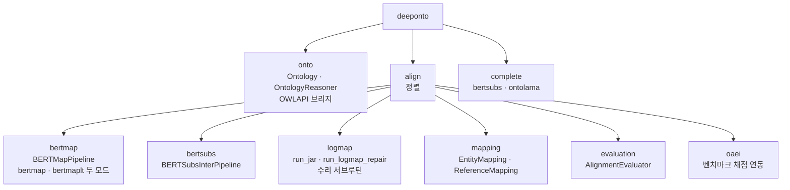
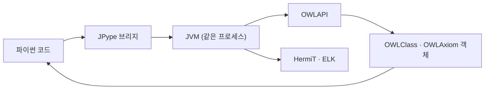
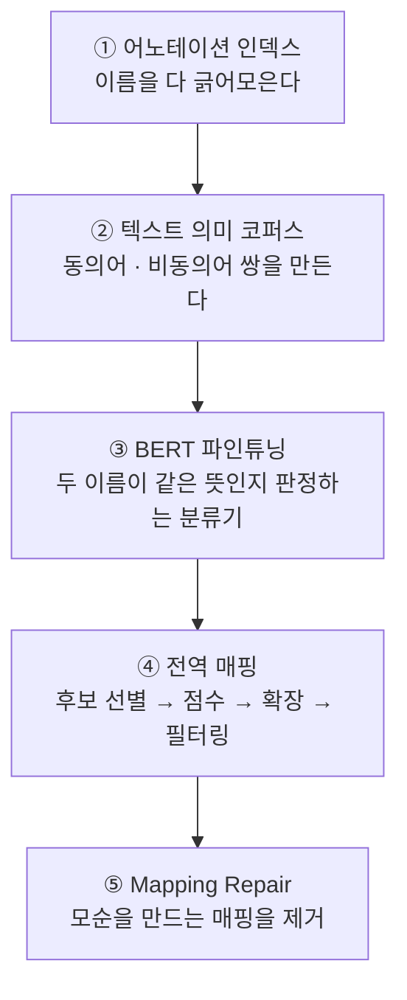

# 부록 — 읽는 데 필요한 것들

> **성격** — [S18A](S18A-DeepOnto-온톨로지-처리-API.md)·[S18B](S18B-BERTMap-파이프라인.md)
> 본편을 읽다가 막히는 자리를 푼다.
>
> **자료가 DeepOnto와 BERTMap 자체를 거의 설명하지 않는다.** 표지의 "이론 요약(10분)"이
> 두 줄짜리 표 하나이고 나머지는 API 사용법이다. 이 문서가 그 자리를 채운다 —
> DeepOnto가 왜 JVM을 물고 있는지, BERTMap의 다섯 단계가 각각 무엇을 푸는지,
> BERTMapLt가 왜 비교 대상으로 서는지, MultiFarm이 왜 이 실습에 쓰이는지.
>
> 실제로 돌려본 결과는 [S18-2](S18-2-돌려보고-확인한-것들.md)에 따로 있다.

---

## 1. 한눈에

| 막히는 자리 | 어디서 | 이 문서 |
|---|---|---|
| DeepOnto는 무엇을 하는 라이브러리인가 | S18A 1 | 2절 |
| 왜 Java와 JVM이 필요한가 | S18A 1 | 2.2 |
| `owl_classes` 는 왜 딕셔너리인가 | S18A 2.1 | 2.3 |
| 리즈너가 실제로 무엇을 계산하나 | S18A 3.1 | 3절 |
| asserted와 inferred를 언제 갈라 써야 하나 | S18A 3.2 | 3.3 |
| BERTMap이 온톨로지 임베딩 모델인가 | — | 4절 앞머리 |
| BERTMap의 다섯 단계가 각각 무엇인가 | S18B 1 | 4절 |
| 왜 동의어 분류기를 학습하나 | S18B 1.1 | 4.2 |
| `identity synonym` 은 무슨 소용인가 | S18B 1.1 | 4.2 |
| 왜 후보를 idf로 좁히나 | S18B 1 | 4.3 |
| BERTMapLt는 왜 비교 대상인가 | S18B 8 | 5절 |
| MultiFarm은 왜 이 실습에 쓰이나 | S18B 1.2 | 6절 |
| P · R · F1을 여기서 어떻게 읽나 | S18B 7 | 7절 |

---

## 2. DeepOnto가 무엇을 하는 물건인가

### 2.1 자리 — PyKEEN과 대칭이 아니다

한 줄로 말하면 **파이썬에서 OWL 온톨로지를 다루고, 그 위에 딥러닝 모델을 얹는 도구상자**다.
[S17](S17-KG-임베딩-실습-PyKEEN.md)의 PyKEEN과 나란히 놓으면 다루는 대상이 갈린다.

| | PyKEEN | DeepOnto |
|---|---|---|
| 다루는 것 | KG 트리플 (A-Box) | OWL 온톨로지 (T-Box) |
| 대표 과제 | 링크 예측 | 온톨로지 정렬 · subsumption 예측 |
| 평가 지표 | MRR · Hits@K | Precision · Recall · F1 |
| 논리 추론 | 없음 | OWLAPI + HermiT/ELK |

**그런데 "A-Box는 PyKEEN, T-Box는 DeepOnto"로 대칭으로 읽으면 안 된다. 두 물건의 성격이
다르다.**

| | PyKEEN | DeepOnto |
|---|---|---|
| 무엇을 하는 물건인가 | **비교 프레임워크** | **툴킷 + 만든 그룹의 시스템 배포처** |
| 모델 레지스트리 | `model_resolver` 로 40개를 문자열로 호출 | 없다. 파이프라인 클래스 둘 (`BERTMapPipeline` · `BERTSubsInterPipeline`) |
| 부품 교체 | `loss` · `negative_sampler` · `training_loop` 를 문자열로 | `MODEL_OPTIONS = {"bertmap", "bertmaplt"}` — 한 시스템의 두 모드 |
| 하이퍼파라미터 탐색 | Optuna 내장 | 없다 (optuna · ray · hyperopt 어느 것도 의존성에 없다) |
| 평가 모듈이 하는 일 | 지표 25종 × Side 3 × Rank_type 3을 자동 보고 | `AlignmentEvaluator` — precision · recall · f1 · hits@K · MRR 계산기 |
| 왜 생겼나 | 2020년 전후 재현성 사태에 대한 대응 ([S17-1 7절](S17-1-읽는-데-필요한-것들.md)) | Oxford KRR 그룹이 자기 논문 구현을 배포 |

PyKEEN은 "누가 만든 모델이든 같은 조건에 올려놓고 재자"는 중립 경기장이다. DeepOnto는
**BERTMap · BERTSubs · OntoLAMA · OWL2Vec\* 을 만든 그룹이 자기 시스템을 배포하는 곳**이고,
남의 모델을 나란히 재려고 만든 물건이 아니다.

**DeepOnto에서 값어치가 가장 큰 부분은 정렬 모델이 아니라 `deeponto.onto` 일 수 있다.**
OWLAPI와 리즈너를 파이썬에서 그대로 쓰게 해주는 브리지이고, [S18A](S18A-DeepOnto-온톨로지-처리-API.md)
Part 1이 전부 그 얘기다. 이것은 모델 비교와 아무 상관이 없다.

> PyKEEN에 대응하는 온톨로지 쪽 물건을 찾는다면 **mOWL** 이 더 가깝다. 온톨로지 임베딩
> 모델 여럿을 한 인터페이스에 올려놓은 라이브러리라 성격이 비교 프레임워크에 가깝다.
> 이번 실습에서 다루지 않았고 돌려보지도 않았다.

[S17-2 7.6절](S17-2-돌려보고-확인한-것들.md)에서 PyKEEN 모델 목록에 온톨로지 임베딩
모델이 하나도 없다는 것을 확인했다. 그 빈칸을 DeepOnto가 채우기는 하지만, 채우는 방식이
PyKEEN과 다르다. **모델을 골라 비교하는 것이 아니라 특정 시스템 하나를 돌리는 것이다.**

패키지 구조가 그 역할 분담을 보여준다.



**`logmap` 은 정렬기가 아니다.** 모듈이 내놓는 것은 `run_jar`(범용 JAR 실행기)와
`run_logmap_repair` 둘뿐이고, 후자는 `logmap-matcher-4.0.jar` 를 `DEBUGGER` 모드로
부른다. 즉 매칭이 아니라 **수리(repair) 전용**이다. LogMap을 단독 정렬기로 세워 비교군으로
쓰는 API가 없다. [S18B](S18B-BERTMap-파이프라인.md)에서 BERTMapLt가 비교군이 된 것도
그래서다 — 라이브러리가 제공하는 유일한 짝이다.

### 2.2 왜 Java가 필요한가

OWL의 표준 구현체는 **OWLAPI**라는 자바 라이브러리다. OWL 2 명세를 제대로 구현한 것이
사실상 이것뿐이고, 널리 쓰이는 리즈너(HermiT · ELK · Pellet)도 전부 이 위에 자바로
만들어져 있다.

파이썬에는 그만한 것이 없다. `rdflib` 은 RDF 그래프를 다루지만 OWL 공리의 의미론까지
가지 않고, `owlready2` 는 OWL을 다루지만 리즈너는 결국 자바 HermiT을 외부 프로세스로
부른다([S09](S09-OWL-온톨로지-설계-실습.md)에서 쓴 방식이 그것이다).

DeepOnto는 다른 선택을 했다. **JPype로 JVM을 같은 프로세스 안에 띄우고 OWLAPI 객체를
파이썬에서 직접 잡는다.**



이래서 `deeponto.init_jvm("4g")` 을 먼저 불러야 하고, `str(p.getIRI())` 처럼 자바 메서드를
파이썬에서 그대로 부르게 된다. `getIRI()` 는 파이썬 이름 규칙(`get_iri`)이 아니라 자바
쪽 이름이다. 이 낱말이 코드에 섞여 있으면 그것은 자바 객체를 만지고 있다는 신호다.

대가도 있다. JVM 메모리를 미리 정해야 하고, 자바 쪽 예외가 파이썬 예외로 어색하게 올라오며,
환경 구성이 까다롭다([S18-2 2절](S18-2-돌려보고-확인한-것들.md)).

### 2.3 `owl_classes` 가 딕셔너리인 이유

```python
onto.owl_classes   # {iri: OWLClass}
```

값이 자바 객체라서 파이썬에서 그 자체로는 다루기 불편하다. 그래서 **IRI 문자열을 키로 삼는
사전**으로 감싼다. 파이썬 쪽에서는 문자열로 찾고, 필요할 때만 `get_owl_object(iri)` 로
자바 객체를 꺼내 쓰는 구조다.

본편의 코드가 계속 `iri.endswith("#Pizza")` 로 문자열 검색을 하는 것도 이 때문이다.
자바 객체를 직접 뒤지는 대신 키를 뒤진다.

---

## 3. 리즈너가 하는 일

### 3.1 두 가지 물음

리즈너에게 물을 수 있는 것은 크게 둘이다.

| 물음 | 메서드 | 답 |
|---|---|---|
| 이 온톨로지가 성립할 수 있는가 | `check_consistency()` | True / False 하나 |
| 이 클래스의 상위·하위는 무엇인가 | `get_inferred_super_entities()` · `get_inferred_sub_entities()` | 클래스 집합 |

두 번째가 S18A 3.1절의 추이적 폐포다. 첫 번째는 6.2절의 Mapping Repair가 쓴다.

### 3.2 왜 "계산"이 필요한가

온톨로지 파일에는 **최소한만 적는다.** `MargheritaPizza ⊑ NamedPizza` 와
`NamedPizza ⊑ Pizza` 를 적었으면 `MargheritaPizza ⊑ Pizza` 는 안 적는다. 적을 필요가 없고,
적으면 오히려 관리가 어려워진다. 계층이 깊어지면 조합이 폭발하기 때문이다.

대신 필요할 때 리즈너가 펼친다. 이것이 관계형 DB와 다른 지점이다. DB는 적힌 행만 돌려주지만
온톨로지는 **적힌 것에서 따라나오는 것까지** 돌려준다.

추이성만 있는 것도 아니다. S18A 3절에서 `Margherita` 의 조상으로 `CheeseyPizza` 와
`VegetarianPizza` 가 나오는데, 이것은 계층을 타고 올라간 결과가 아니다.

```
CheeseyPizza ≡ Pizza ⊓ ∃hasTopping.CheeseTopping     (정의)
Margherita   ⊑ ∃hasTopping.MozzarellaTopping         (선언)
MozzarellaTopping ⊑ CheeseTopping                     (선언)
        ↓ 리즈너
Margherita ⊑ CheeseyPizza
```

**정의(equivalent class)를 만족하는지 검사해서 분류한 것이다.** 이것을 자동 분류
(classification)라고 부르고, OWL 리즈너가 하는 일 중 가장 값진 부분이다.
[S09-1](S09-1-제약처럼-보이는-공리들.md)에서 "제약처럼 보이는 공리들"이라고 부른 것이
이 성질이다.

### 3.3 asserted와 inferred를 언제 갈라 쓰나

| 필요한 것 | 무엇을 부르나 |
|---|---|
| 파일에 사람이 무엇을 적었는지 알고 싶다 | `get_asserted_parents` · `get_asserted_children` |
| 논리적으로 성립하는 것을 전부 알고 싶다 | `get_inferred_super_entities` · `get_inferred_sub_entities` |

**정렬 작업에서는 대개 inferred를 쓴다.** 두 온톨로지가 같은 개념을 서로 다른 깊이에
선언했을 수 있어서, asserted만 보면 대응을 놓친다. 반면 **온톨로지를 편집하거나 품질을
평가할 때는 asserted를 본다.** 사람이 무엇을 직접 적었는지가 관심사이기 때문이다.

BERTMap의 `hard negative` 생성이 이 구분에 걸린다. "같은 부모를 공유하는 형제 클래스"를
찾을 때 asserted 부모를 쓰느냐 inferred를 쓰느냐에 따라 형제 집합이 달라진다.

---

## 4. BERTMap의 다섯 단계

### 먼저 — BERTMap은 임베딩 모델이 아니다

이름에 BERT가 있어서 헷갈리는데, **BERTMap이 만들어내는 것은 벡터가 아니라 매핑 표다.**

```
SrcEntity                                TgtEntity                               Score
http://conference_en#c-2236753-0948316   http://conference_pt#c-5327859-2953382  1.0
```

Ch.5가 다룬 것을 산출물 기준으로 갈라 보면 자리가 분명해진다.

| | 만들어내는 것 | 예 | 회차 |
|---|---|---|---|
| KG 임베딩 | 엔티티 · 관계마다 **벡터** | TransE · RotatE · R-GCN | [S13](S13-KG-임베딩-기초.md) · [S14](S14A-R-GCN-관계별-메시지-전달.md) → [S17 실습](S17-KG-임베딩-실습-PyKEEN.md) |
| 온톨로지 임베딩 | 클래스마다 **벡터** | OWL2Vec\* · EL Embeddings | [S15](S15A-OWL2Vec-star-문장-기반-임베딩.md) |
| **온톨로지 정렬** | **매핑 표** (src ↔ tgt 짝) | **BERTMap** · OntoEA · LogMap | [S16](S16A-OntoEA-온톨로지를-넣은-엔티티-정렬.md) → **S18 실습** |

BERTMap은 세 번째 줄이다. **BERT는 이름 두 개를 받아 "같은 뜻인가"를 판정하는 분류기로
쓰인다.**

```
입력:  "member of committee"  +  "membro do comitê"
        ↓  BertForSequenceClassification
출력:  같은 뜻일 확률 하나 (0 ~ 1)     ← 벡터가 아니다
```

코드가 그대로 말한다.

```python
self.model = AutoModelForSequenceClassification.from_pretrained(...)   # 분류기
return self.softmax(self.model(**inputs).logits)[:, 1]                 # P(동의어)
```

직접 학습시킨 체크포인트의 `config.json` 도 `architectures: ["BertForSequenceClassification"]`
이다. **클래스마다 벡터를 만들어 내보내는 API가 DeepOnto에 없다.**

진짜 온톨로지 임베딩 모델과 나란히 놓으면 이렇다.

| | BERTMap | OWL2Vec\* | EL Embeddings |
|---|---|---|---|
| 산출물 | 매핑 표 | 클래스마다 벡터 | 클래스마다 공(ball) |
| 신경망의 역할 | 이름 쌍을 판정 | 문장 corpus에서 벡터 학습 | 공리를 기하 제약으로 |
| 다른 과제에 재사용 | 못 한다. 그 두 온톨로지 전용 | 벡터를 넘길 수 있다 | 〃 |

> **회차 제목이 약속한 것의 절반만 한다.** S18은 "온톨로지 임베딩·정렬 실습"인데 노트북은
> 정렬만 다룬다. [S15](S15A-OWL2Vec-star-문장-기반-임베딩.md)에서 배운 OWL2Vec\* 도
> EL Embeddings도 나오지 않고, DeepOnto에 애초에 들어 있지 않다
> ([S18-2 8절](S18-2-돌려보고-확인한-것들.md)). 온톨로지 임베딩을 돌려보려면 mOWL 쪽으로
> 가야 하는데 이번 회차에 없다.

### 다섯 단계

자료의 파이프라인 그림을 단계별로 푼다. 이론은
[S16B](S16B-BERTMap-문맥-임베딩-기반-정렬.md)에 있고, 여기서는 **각 단계가 무슨 문제를
푸는지**를 적는다.



### 4.1 ① 어노테이션 인덱스 — 이름을 다 긁어모은다

정렬의 재료는 클래스의 **이름**이다. 그런데 이름이 한 군데 있지 않다. `rdfs:label` ·
`skos:altLabel` · `oboInOwl#hasExactSynonym` · 온톨로지 고유 속성에 흩어져 있다
([S18A 4.1절](S18A-DeepOnto-온톨로지-처리-API.md)).

`build_annotation_index()` 가 이것을 클래스마다 하나의 set으로 합친다. BERTMap 기본 config가
표준 어휘 여럿을 나열해두는 이유가 이것이다. **많이 모을수록 다음 단계의 재료가 늘어난다.**

### 4.2 ② 텍스트 의미 코퍼스 — 왜 분류기를 학습하나

정렬을 "두 이름이 같은 뜻인가"라는 **이진 분류 문제**로 바꾸는 것이 BERTMap의 발상이다.
그러려면 정답이 붙은 쌍이 필요한데, 정렬 문제에는 원래 정답이 거의 없다.
그래서 **온톨로지 자체에서 정답을 만들어낸다.**

| 어디서 | 동의어 (label=1) | 비동의어 (label=0) |
|---|---|---|
| 한 온톨로지 안 | 같은 클래스에 달린 이름들끼리 | 무작위 두 클래스(soft) · 형제 클래스(hard) |
| 두 온톨로지 사이 | 이미 아는 매핑의 이름 조합 | 매핑 안 된 무작위 쌍 |

**같은 클래스에 달린 이름은 정의상 동의어다.** `rdfs:label` 이 "muscle layer"이고
`hasExactSynonym` 이 "muscularis propria"라면, 온톨로지 제작자가 둘을 같은 것으로 선언한
셈이다. 정답이 공짜로 나온다.

**`identity synonym` 은 라벨이 하나뿐일 때의 대비책이다.** 이름이 하나면 짝지을 상대가
없으므로 자기 자신과 짝짓는다. `["tutorial", "tutorial", 1]` 같은 쌍이다. 쓸모가 없어
보이지만, 분류기에게 "문자열이 같으면 동의어"라는 기준선을 준다.

> 이 대비책이 이번 실습에서 결과를 좌우했다. MultiFarm은 클래스당 라벨이 정확히 1개라
> intra-ontology 동의어 119개가 **전부** identity synonym이 됐다
> ([S18-2 6.4절](S18-2-돌려보고-확인한-것들.md)).

**`hard negative` 가 핵심 장치다.** 무작위 두 클래스를 비동의어로 주면 너무 쉽다.
"피자"와 "리뷰어"가 다르다는 것은 배울 필요도 없다. 형제 클래스 — 같은 부모 아래
나란히 있는 것들 — 를 비동의어로 주면 "비슷하지만 다른" 경계를 배우게 된다.
형제를 disjoint로 가정하는 것이 늘 참은 아니지만, 대량의 어려운 반례를 공짜로 얻는 값이
그 위험보다 크다는 판단이다.

### 4.3 ③④ 왜 후보를 idf로 좁히나

두 온톨로지의 클래스가 각각 n개면 비교할 쌍이 n²개다. 클래스가 수만 개인 생의학
온톨로지에서는 BERT를 수억 번 부르는 셈이라 불가능하다.

그래서 **먼저 싸게 후보를 좁히고, 좁혀진 것만 BERT로 채점한다.**

- 이름을 sub-word로 쪼개 역색인(inverted index)을 만든다
- 흔한 조각(`of`, `ing`)은 idf로 가중치를 낮추고 드문 조각은 높인다
- 드문 조각을 공유하는 상대만 후보로 올린다

`num_raw_candidates=10` 이 이 단계의 설정이다. 후보를 10개까지만 남긴다.
`num_best_predictions=3` 은 그중 최종 3개를 고른다는 뜻이다.

> **여기가 이번 실습의 병목으로 보인다.** 후보 선별이 문자열(sub-word) 기반이라, 언어가
> 다르면 조각이 겹치지 않아 후보 자체가 안 뽑힌다. BERT가 아무리 좋아도 채점할 대상이
> 없다. 확인하지는 못했고 짐작이다([S18-2 6.3절](S18-2-돌려보고-확인한-것들.md)).

**매핑 확장(extension)** 은 찾은 매핑 주변을 다시 뒤진다. A와 A'가 대응하면 그 자식들끼리도
대응할 가능성이 높으니, 그 근처를 추가로 본다. 재현율을 올리는 장치다.

### 4.4 ⑤ Mapping Repair — 정밀도를 지키는 마지막 장치

매핑을 두 온톨로지에 실제로 얹으면 논리적 모순이 생길 수 있다. 한쪽에서 disjoint로 선언한
둘이 다른 쪽에서는 같은 것으로 이어지는 식이다.

Repair는 리즈너로 모순을 찾고, **모순을 없애는 최소한의 매핑만 골라 제거한다.**
LogMap의 알고리즘을 그대로 불러다 쓴다. 확장이 재현율을 올리고 수리가 정밀도를 올리는
비대칭 분담이 [S16B](S16B-BERTMap-문맥-임베딩-기반-정렬.md)에서 본 그 구조다.

> 이번 실습에서는 이 단계가 크래시해서 `repaired_mappings.tsv` 가 생성되지 않았다.
> `filtered_mappings.tsv` 를 최종 결과로 대신 썼다.

---

## 5. BERTMapLt가 왜 비교 대상으로 서는가

BERTMapLt는 위 다섯 단계 중 **②③을 통째로 뺀 것**이다. 파인튜닝을 하지 않고, 두 이름의
문자열 편집 유사도(edit similarity)만으로 점수를 매긴다.

| | BERTMap | BERTMapLt |
|---|---|---|
| ① 어노테이션 인덱스 | 있다 | 있다 |
| ② 코퍼스 구성 | 있다 | **없다** |
| ③ BERT 파인튜닝 | 있다 (수 시간) | **없다** |
| ④ 전역 매핑 | BERT 점수로 | 편집 유사도로 |
| ⑤ Repair | 있다 | 있다 |
| `known_mappings` | 필요 | 불필요 |

**차이가 ②③ 하나로 묶여 있다는 것이 중요하다.** 나머지 단계와 설정
(`num_raw_candidates`, `num_best_predictions`)을 같게 맞추면, 두 결과의 차이는
"BERT를 학습시킨 것"의 기여분이 된다.

[S17](S17-2-돌려보고-확인한-것들.md)에서 기준선을 직접 만들어 넣어야 했던 것과 달리,
여기서는 라이브러리가 이미 짝을 제공한다. 실습 자료도 그것을 알고 두 모델을 나란히 돌린다.
문제는 그 결과를 읽지 않고 지나갔다는 것이다
([S18-2 6절](S18-2-돌려보고-확인한-것들.md)).

---

## 6. MultiFarm이 왜 이 실습에 쓰이는가

### 6.1 이름이 말을 하지 않는 데이터

Pizza 온톨로지는 클래스 IRI가 `#Margherita` 다. 이름만 봐도 뜻을 안다.
MultiFarm은 `c-0002793-7190514` 다. 이름에 아무 정보가 없고, 뜻은 `rdfs:label` 에만 있다.

이것이 정렬 평가에 유리하다. **IRI가 말을 하면 정렬 문제가 시시해진다.** 두 온톨로지의
클래스 이름이 둘 다 `#Conference` 라면 아무 모델이나 맞힌다. 모델이 구조나 의미를 배웠는지
알 수 없게 된다.

> [S16A](S16A-OntoEA-온톨로지를-넣은-엔티티-정렬.md)에서 OntoEA가 `w/o SI`
> (Surface Information 없이)를 기본 비교로 두는 이유와 같은 자리다. 이름을 지우고 재야
> 무엇을 배웠는지 보인다. MultiFarm은 그것을 데이터 자체가 해준다.

### 6.2 정답이 사람 손으로 만들어졌다

OntoFarm의 conference 온톨로지 7종을 전문 번역가가 8개 언어로 완전 수작업 번역했다.
자동 번역이 아니므로 정답이 믿을 만하고, 원본 구조가 같으므로 클래스가 1:1로 대응한다.

**61개 클래스 중 59개만 정답이 있다.** 두 개는 대응이 없다. 자료가 "실제 상황처럼"이라고
적은 부분인데, 완전 대응을 가정하면 평가가 쉬워지는 것을 막는다.

### 6.3 정답을 둘로 쪼개는 이유

BERTMap의 Cross-ontology 코퍼스는 `known_mappings` 를 재료로 쓴다. 정답을 전부 주면
**정답으로 학습하고 정답으로 채점하는 셈**이라 성능이 의미를 잃는다.

그래서 59개를 15(M_train) 대 44(M_test)로 나눈다. 15개는 코퍼스 재료로 모델에 주고,
44개는 숨겨서 채점에만 쓴다. [S17](S17-KG-임베딩-실습-PyKEEN.md)의 링크 예측에서
테스트 트리플을 가려두던 것과 같은 장치다.

---

## 7. P · R · F1을 여기서 어떻게 읽나

[S16-1](S16-1-읽는-데-필요한-것들.md)에서 정의를 다뤘다. 이 실습의 채점 코드에서 그것이
어떻게 계산되는지만 짚는다.

```python
df_ho = df[df["SrcEntity"].isin(heldout_srcs)]        # held-out에 걸린 것만
df_ho["correct"] = df_ho["TgtEntity"] == df_ho["gold"]

P  = correct / len(df_ho)        # 내놓은 것 중 맞은 비율
R  = correct / len(heldout_dict) # 정답 44개 중 맞힌 비율
```

**분모가 다르다는 것이 핵심이다.**

| | 분모 | 무엇을 벌하나 |
|---|---|---|
| Precision | 모델이 내놓은 것 중 held-out에 걸린 개수 | 틀린 것을 내놓으면 내려간다 |
| Recall | held-out 정답 44개 | 안 내놓으면 내려간다 |

**모델이 아무것도 안 내놓으면 Precision은 계산이 안 되고(0으로 처리) Recall은 0이다.**
반대로 조심스럽게 두 개만 내놓고 둘 다 맞히면 Precision 1.000, Recall 0.045가 된다.
이번 실습의 BERTMapLt가 정확히 그 상태다([S18-2 6.2절](S18-2-돌려보고-확인한-것들.md)).

**Precision이 1.000이라고 좋은 것이 아니다.** 이 지표만 보면 완벽해 보이지만, 44개 중
2개만 시도한 결과다. F1(0.087)이 그 불균형을 잡아준다. 정렬 결과를 볼 때 셋을 항상
같이 봐야 하는 이유다.

`raw_mappings` 와 `filtered_mappings` 를 둘 다 채점하는 것도 이 때문이다. 필터링은
내놓는 개수를 줄이므로 Precision을 올리고 Recall을 내린다. 어느 쪽으로 얼마나 움직였는지를
봐야 임계값이 적절한지 알 수 있다.

---

📎 [S18A 온톨로지 처리 API](S18A-DeepOnto-온톨로지-처리-API.md) ·
[S18B BERTMap 파이프라인](S18B-BERTMap-파이프라인.md) ·
[S18-2 돌려보고 확인한 것들](S18-2-돌려보고-확인한-것들.md)
