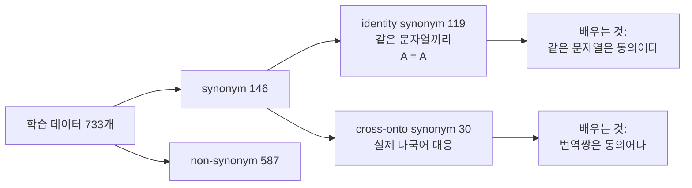

# 부록 — 돌려보고 확인한 것들

> **성격** — [S18A](S18A-DeepOnto-온톨로지-처리-API.md)·[S18B](S18B-BERTMap-파이프라인.md)
> 정리 중 갈라져 나온 내용. 노트북 자료에 없다.
>
> 실습 회차라 대조할 원논문이 없다. 노트북의 코드를 **그대로 실행해서** 설명과 맞는지
> 확인했다. [S09](S09-1-제약처럼-보이는-공리들.md)·[S10](S10-1-파이프라인이-말하지-않은-것들.md)·
> [S17](S17-2-돌려보고-확인한-것들.md)에서 쓴 방식과 같다.
>
> 실행 환경 — deeponto 0.9.3 · torch 2.13.0 · transformers 5.15.1 · JPype1 1.7.1 ·
> OpenJDK 21 (Homebrew) · Python 3.12 · macOS(arm64). 노트북은 Linux 컨테이너에서
> PyTorch 2.6.0으로 돌았다.
>
> 데이터는 원본 MultiFarm 배포본(`dataset.zip`)을 받아
> `dataset/ont/en/conference-en.owl` · `dataset/ont/pt/conference-pt.owl` ·
> `dataset/ref/en-pt/conference-conference-en-pt.rdf` 를 썼다.
>
> 2·3절이 확인 성격이라 짧게 끝내고, **6절이 이 문서의 본론이다.**

---

## 1. 한눈에

| 자료의 설명 | 실행 결과 |
|---|---|
| Step 4: 모순 클래스가 있으면 `check_consistency()` 가 `False` 를 반환한다 | **`True` 다.** unsatisfiable 클래스가 셋 있는데도 온톨로지는 일관된다 |
| Step 4 표: `EN (normalised)` / `PT (rdfs:label)` 두 열 | **둘 다 포르투갈어다.** 차이는 띄어쓰기뿐 |
| Step 4: "CamelCase 클래스명을 자연어로 변환" | 클래스명(IRI)이 아니라 **어노테이션 텍스트**를 쪼갠다 |
| Step 2: Pizza 클래스 수 100 | 재현됨. ObjectProperty 8 · DataProperty **0** · Individual 5 |
| Step 7: 공통 5 · BERTMap 전용 0 · BERTMapLt 전용 0 | 재현 방향 일치. BERTMapLt raw는 여기서 **6개** |
| 학습 목표 3: BERT 파인튜닝의 효과를 확인한다 | **효과가 0이다.** 직접 파인튜닝해 돌린 결과가 BERTMapLt와 점수까지 동일하다 |
| Step 7: `filtered_mappings.tsv` 를 최종 결과로 쓴다 | 여기서는 `MappingRefiner` 가 죽어 그 파일 자체가 안 나온다 (9.3) |
| — (자료가 세지 않은 것) | 정답 59쌍 중 라벨 철자가 같은 쌍은 **2개(3.4%)**. 이것이 문자열 매칭의 천장이고, BERTMapLt는 그 천장을 다 찍었다 |
| — | BERTMapLt 매핑 6개 중 **4개가 라벨 `null` 끼리의 매칭**이다 |

---

## 2. 환경 구성에서 막힌 두 곳

노트북은 컨테이너에서 돌아 그냥 넘어가지만, 로컬 macOS에서는 두 번 멈춘다.

**JPype가 JDK를 찾지 못한다.** DeepOnto의 `init_jvm()` 이 `jpype.getDefaultJVMPath()` 를
부르는데, macOS에서 이 함수는 `/usr/libexec/java_home` 을 실행한다. 시스템에 등록된
JDK가 없으면 이 명령이 실패하고 `CalledProcessError` 가 그대로 올라온다. Homebrew로 설치한
JDK는 `/Library/Java/JavaVirtualMachines/` 에 등록되지 않으므로 `java -version` 이 되는데도
막힌다.

```python
import jpype, deeponto
LIBJVM = "/opt/homebrew/opt/openjdk@21/libexec/openjdk.jdk/Contents/Home/lib/server/libjvm.dylib"
jpype.getDefaultJVMPath = lambda: LIBJVM
```

**`deeponto.onto` 임포트가 대화식으로 메모리를 묻는다.** `ontology.py` 최상단에
`click.prompt("Please enter the maximum memory located to JVM", default="8g")` 가 있다.
스크립트로 돌리면 입력이 없어 `click.exceptions.Abort` 로 죽는다. 조건이
`if not jpype.isJVMStarted()` 이므로 JVM을 먼저 띄워두면 건너뛴다.

```python
if not jpype.isJVMStarted():
    deeponto.init_jvm("4g")
```

**LogMap이 남의 컴퓨터 경로를 본다.** 노트북도 이것을 이미 처리해 두었다.

```python
os.makedirs("/home/ernesto/Documents/OAEI_OM_2015/EVAL_2015/dict_multilingual", exist_ok=True)
```

`ernesto` 는 LogMap 저자 Ernesto Jiménez-Ruiz다. 언어가 다른 온톨로지 쌍을 만나면
다국어 사전을 저장하려고 이 절대경로를 쓰는데, 라이브러리에 그대로 박혀 있다.

---

## 3. Part 1 — 미수록 출력 채우기

Pizza 온톨로지의 구성이다.

| | 개수 |
|---|---|
| 클래스 | 100 |
| ObjectProperty | 8 |
| **DataProperty** | **0** |
| Individual | 5 |
| AnnotationProperty | 3 (`rdfs:comment` · `rdfs:label` · `owl:versionInfo`) |

노트북이 DataProperty를 "클래스가 갖는 데이터 값을 표현 (예: `hasCalorieContent`)"이라고
설명하면서 목록을 출력하는데, Pizza 온톨로지에는 하나도 없다.

`Pizza` 클래스의 asserted와 inferred 차이다.

| | 개수 |
|---|---|
| asserted 직접 자식 | **1** (`NamedPizza`) |
| inferred 전체 하위 (추이적 폐포) | **37** |

`Margherita` 의 추론된 조상은 여덟이다.

```
CheeseyPizza · DomainConcept · Food · NamedPizza · Pizza ·
VegetarianPizza · VegetarianPizzaEquivalent1 · VegetarianPizzaEquivalent2
```

asserted 부모는 `NamedPizza` 하나뿐인데 여덟이 나온다. `CheeseyPizza` 와 `VegetarianPizza`
계열은 상위 계층을 타고 올라간 것이 아니라 **정의(equivalent class)로부터 분류된 것**이다.
토핑 조건을 보고 리즈너가 "이건 치즈 피자이기도 하다"를 판정한 결과다.

---

## 4. `normalise_identifiers` 가 하는 일이 표 이름과 다르다

노트북 Step 4가 두 인덱스를 만들어 `EN (normalised)` 와 `PT (rdfs:label)` 두 열로 찍는다.
주석은 "`normalise_identifiers=True` → CamelCase 클래스명을 자연어로 변환 (영어)"이다.
실제 출력이다.

| 클래스명 | EN (normalised) | PT (rdfs:label) |
|---|---|---|
| American | `americana` | `americana` |
| AmericanHot | `americana picante` | `americanapicante` |
| AnchoviesTopping | `cobertura de anchovies` | `coberturadeanchovies` |
| ArtichokeTopping | `cobertura de artichoke` | `coberturadeartichoke` |
| AsparagusTopping | `cobertura de aspargos` | `coberturadeaspargos` |
| Cajun | `cajun` | `cajun` |

**두 열이 다 포르투갈어다.** 차이는 띄어쓰기가 들어갔느냐뿐이다.

docstring이 정확히 적고 있다.

> `normalise_identifiers` (bool): Whether to normalise **annotation text** that is in the
> Java identifier format.

정규화 대상은 클래스 IRI가 아니라 **어노테이션 텍스트**다. Pizza 온톨로지의 `rdfs:label`
값은 전부 포르투갈어이고, 그 값이 `coberturadeanchovies` 처럼 붙어 있어서 Java 식별자 꼴로
인식된다. 그것을 쪼개 `cobertura de anchovies` 로 만든 것이다. 영어는 IRI 조각
(`#AnchoviesTopping`)에만 있고 이 함수는 거기 손대지 않는다.

노트북이 "pizza ontology에 포르투갈어도 함께 존재함"이라며 다국어 매칭을 보여주려 한
자리인데, 실제로는 **한 언어를 두 형태로** 보여주고 있다.

---

## 5. 모순 클래스가 있어도 온톨로지는 일관된다

노트북 Step 4가 `CheeseyVegetableTopping` 을 예로 들며 이렇게 적는다.

> 이런 게 하나라도 있으면 `check_consistency()` 는 `False` 를 반환합니다.
> (…) 실제로 실행하면 `False` 가 나올 가능성이 있습니다.

실행 결과다.

```
unsatisfiable 클래스: ['CheeseyVegetableTopping', 'Nothing', 'IceCream']
check_consistency(): True
```

**unsatisfiable class와 inconsistent ontology는 다른 것이다.**

| | 뜻 | 언제 생기나 |
|---|---|---|
| unsatisfiable class | 그 클래스의 멤버가 될 수 있는 개체가 없다 (`C ⊑ ⊥`) | disjoint한 두 부모를 동시에 갖는 등 |
| inconsistent ontology | 온톨로지 전체를 만족하는 모델이 하나도 없다 | 실제 individual이 unsatisfiable 클래스에 속한다고 선언될 때 |

멤버가 없는 클래스가 있어도 온톨로지는 멀쩡하다. 그 클래스가 비어 있으면 그만이다.
모순이 되려면 "이 개체는 `CheeseyVegetableTopping` 이다"라는 선언이 실제로 있어야 한다.
Pizza 온톨로지는 그 클래스를 정의만 해두고 멤버를 넣지 않았다.

`Nothing` 은 `owl:Nothing` 이라 정의상 항상 unsatisfiable이고, `IceCream` 은 Pizza 튜토리얼이
교육용으로 넣어둔 또 하나의 예다.

**노트북 안에서 앞뒤가 맞지 않는다.** Step 3이 이미 `온톨로지 일관성: True` 를 출력했고,
Step 4 마지막 셀도 `True` 를 출력한다. 그 사이의 설명만 `False` 라고 말한다.

> 이 구분이 [S18A 6.2절](S18A-DeepOnto-온톨로지-처리-API.md)의 Mapping Repair 이야기에
> 그대로 걸린다. BERTMap이 병합 후 검사하는 것은 **inconsistency** 이지 unsatisfiable class가
> 아니다. 둘을 섞으면 repair가 무엇을 제거하는지 잘못 이해하게 된다.

---

## 6. 이 과제는 문자열로는 풀 수 없다

S18B 9.3절의 결과 — 공통 5개, 전용 0개, 0개 — 를 자료가 출력만 하고 해석하지 않는다.
왜 그렇게 되는지 정답을 직접 세어 확인했다.

### 6.1 정답쌍의 라벨이 겹치지 않는다

MultiFarm은 전문 번역가가 수작업 번역한 데이터다. 정답 59쌍의 라벨을 나란히 놓으면 이렇다.

| EN 라벨 | PT 라벨 |
|---|---|
| member of committee | membro do comitê |
| chair of workshop track | coordenador de trilha de workshop |
| regular contribution | contribuição de artigo completo |
| abstract | resumo |
| review | revisão |
| reviewer | revisor |
| **tutorial** | **Tutorial** |
| **workshop** | **Workshop** |

측정값이다.

| | 값 |
|---|---|
| 정답 59쌍 중 라벨 철자가 (소문자 기준) 같은 쌍 | **2개 = 3.4%** |
| held-out 44쌍 중 철자가 같은 쌍 | **2개** |
| held-out 정답쌍의 라벨 토큰 자카드 유사도 | 평균 **0.049** |
| 토큰이 하나도 안 겹치는 쌍 | **41 / 44** |

**문자열 편집 유사도로 찾을 수 있는 것의 천장이 2개다.** 44쌍 중 41쌍은 겹치는 단어가
아예 없다.

### 6.2 BERTMapLt는 그 천장을 정확히 다 찍었다

직접 돌린 결과다.

```
BERTMapLt raw_mappings: 6개
[held-out 채점] M_out=2, 정답=2, Precision=1.000, Recall=0.045, F1=0.087
  ['tutorial'] -> ['Tutorial']   (score=1.000, correct)
  ['workshop'] -> ['Workshop']   (score=1.000, correct)
```

held-out에 걸린 매핑 두 개가 전부 정답이다. **문자열 매칭이라는 도구가 할 수 있는 일을
남김없이 했다.** Recall 0.045는 모델이 못한 것이 아니라 도구의 한계다.

### 6.3 그런데 BERTMap도 같은 두 개에서 멈췄다

자료의 Step 7 출력이 그것을 말한다.

```
공통 매핑:      5개  (두 모델이 동의)
BERTMap 전용:   0개  (BERT가 추가 발견)
BERTMapLt 전용: 0개  (문자열만 매칭)
```

**직접 돌려서 확인했다.** `bert-base-multilingual-cased` 를 5 에폭 파인튜닝하고
(105 스텝, 체크포인트 711MB) 전역 매핑까지 끝낸 결과다.

```
BERTMap  raw: 6개 | BERTMapLt raw: 6개
공통 6 · BERTMap 전용 0 · BERTMapLt 전용 0
```

| SrcEntity | TgtEntity | Score (BERTMap) | Score (BERTMapLt) |
|---|---|---|---|
| c-2236753-0948316 | c-5327859-2953382 | 1.0 | 1.0 |
| c-2236753-0948316 | c-7459265-6895064 | 1.0 | 1.0 |
| c-2541048-2862308 | c-2245653-0676275 | 1.0 | 1.0 |
| c-6723318-8233081 | c-5327859-2953382 | 1.0 | 1.0 |
| c-6723318-8233081 | c-7459265-6895064 | 1.0 | 1.0 |
| c-7323685-3016399 | c-7509981-0925455 | 1.0 | 1.0 |

**집합이 같은 정도가 아니라 점수까지 한 줄도 다르지 않다.** held-out 채점도 똑같다.

```
[BERTMap] held-out 걸린 것 2개, 정답 2개 → Precision=1.000  Recall=0.045  F1=0.087
  ['tutorial'] -> ['Tutorial']   score=1.000  correct
  ['workshop'] -> ['Workshop']   score=1.000  correct
```

**학습 목표 3번이 "BERT 파인튜닝의 효과를 확인한다"였고, 확인된 효과는 0이다.**
자료의 "공통 5개"와 여기의 "공통 6개"가 다른데, 자료는 BERTMap의 `filtered_mappings` 와
BERTMapLt의 `raw_mappings` 를 비교했고 여기서는 후속 단계가 생성되지 않아 `raw` 끼리
비교했다(9절). 전용이 양쪽 다 0이라는 결론은 같다.

### 6.4 코퍼스를 열어 보면 이유가 나온다

BERTMap을 직접 돌렸더니 파인튜닝 직전에 멈췄는데(9절), **코퍼스는 다 만들어 놓고 죽었다.**
BERT가 무엇을 학습 재료로 받았는지 그 파일에서 확인할 수 있다.

`bertmap/data/text-semantics.corpora.json` 의 summary다.

| 코퍼스 | synonym | non-synonym | soft | hard |
|---|---|---|---|---|
| intra_src (en) | 60 | 240 | 142 | 98 |
| intra_tgt (pt) | 59 | 236 | 133 | 103 |
| **cross** | **30** | 119 | — | — |
| 합계 | **146** | **587** | | |

파인튜닝 데이터는 733개를 training 659 / validation 74로 나눈다.

**결정적인 값이 여기 있다.**

```
"average_number_of_annotations_per_class": 1.0,
"number_of_synonym_groups": 61
```

**클래스마다 라벨이 딱 하나씩이다.** 그래서 S18B 1.1절 표의 "라벨이 1개뿐이면 자기 자신과
짝짓는 `identity synonym`" 규칙이 예외 없이 전부에 적용된다. synonyms를 열어 보면 그대로다.

```
['passive participant of conference', 'passive participant of conference', 1]
['information for participants', 'information for participants', 1]
['accepted contribution', 'accepted contribution', 1]
['co-chair', 'co-chair', 1]
```

intra-ontology synonym 119개(60 + 59)가 **전부 `A = A` 꼴**이다. 다국어 대응을 가르치는
것은 cross-ontology synonym **30개뿐**이고, 그것도 `known_mappings` 15쌍에서 나온 것이다.



**BERT가 "같은 문자열은 동의어다"를 119번 배우고 "번역쌍은 동의어다"를 30번 배운다.**
문자열 항등성이 네 배 많다. 학습이 끝난 분류기가 문자열 매칭과 같은 답을 내놓는 것이
이상하지 않다.

non-synonym 쪽을 보면 서로 다른 언어의 라벨이 섞여 있다.

```
['documento da conferência', 'workshop', 0]
['apresentação', 'workshop', 0]
['organizador', 'especialidade de revisão', 0]
['reviewer', 'anúncio de conferência', 0]
```

en과 pt가 섞인 쌍이 "동의어가 아니다"로 587개 들어간다. 이 중 다수는 실제로 동의어가
아니지만, 모델 입장에서는 **"영어와 포르투갈어가 나란히 있으면 다른 것"** 이라는 신호로도
읽힐 수 있다. 이를 뒤집을 재료가 cross synonym 30개뿐이다.

> 6.3의 결론이 왜 나오는지에 대한 설명이다. 학습 데이터의 구성은 실측이고,
> "그래서 문자열 매칭과 같아진다"는 그 위에 세운 해석이다. BERTMap을 끝까지 돌려
> 확인하지는 못했다(9절).

### 6.5 매핑 6개 중 4개는 잡음이다

BERTMapLt가 내놓은 6개가 무엇인지 라벨로 풀어 봤다.

| src 라벨 | tgt 라벨 | 어디 속하나 |
|---|---|---|
| `null` | `null` | 정답 없음 |
| `null` | `null` | 정답 없음 |
| `tutorial` | `Tutorial` | held-out · 정답 |
| `null` | `null` | 정답 없음 |
| `null` | `null` | 정답 없음 |
| `workshop` | `Workshop` | held-out · 정답 |

**`rdfs:label` 이 없는 클래스끼리 매칭됐다.** 라벨이 비어 있는 것을 문자열 `"null"` 로
취급해서 서로 완전 일치로 본 것이다. 점수는 1.0으로 정답 두 개와 같다.

held-out 채점에서는 이 넷이 걸리지 않아 Precision 1.000이 나왔다. 정답 매핑 대상이 아닌
클래스들이라 채점 범위 밖으로 빠진 것뿐이고, 매핑 자체는 틀린 것이다.

**출력만 세면 6개, 뜻이 있는 것은 2개다.** 자료가 "매핑 수 비교"를 하는 절을 두었는데
개수만으로는 이것을 알 수 없다.

### 6.6 S17과 같은 자리다

[S17](S17-2-돌려보고-확인한-것들.md)에서는 학습 모델 여덟 개가 등장 횟수만 세는 기준선을
아무도 못 이겼다. 여기서는 한 걸음 더 갔다.

| | S17 (PyKEEN) | S18 (DeepOnto) |
|---|---|---|
| 비교군 | 내가 직접 넣었다 (`pykeen.models.baseline`) | **자료가 이미 넣어 두었다** (BERTMapLt) |
| 결과 | 학습 모델 여덟 개 전부 기준선보다 낮다 | 학습 모델의 결과가 기준선과 **완전히 같다** |
| 자료의 태도 | 기준선을 세우지 않았다 | 세워 놓고 출력까지 했는데 해석하지 않았다 |

자료가 "공통 5개, 전용 0개, 0개"를 찍어놓고 그 다음 절이 바로 정리 표로 넘어간다.
그 숫자가 학습 목표 3번에 대한 답인데 읽지 않고 지나간다.

---

## 7. 무엇을 일반화할 수 있나

일반화하면 안 되는 쪽부터 적는다.

- **MultiFarm en-pt가 특이하다.** 번역 벤치마크라 표면 문자열이 원리적으로 안 겹친다.
  같은 언어 안에서 정렬하는 과제(FMA-SNOMED 등)에서는 문자열 단서가 많이 남아 있어서
  BERTMapLt의 천장이 훨씬 높고, BERTMap이 그 위를 갈 여지도 크다.
  **다른 데이터셋에서는 돌려보지 않았다**
- **후속 단계를 못 봤다.** `MappingRefiner` 가 죽어 확장 · 필터링 · 수리가 실행되지 않았다.
  두 모델의 비교는 `raw_mappings` 기준이다(9.3). 노트북 쪽도 `repaired_mappings.tsv` 는
  못 만들었으니, **정밀도를 지키는 마지막 단계는 어느 환경에서도 검증되지 않았다**
- **라이브러리를 손봐서 돌렸다.** transformers를 4.40.2로 내리고 `logging_steps` 가 0이 되는
  자리를 우회했다(9.1~9.2). 손대지 않은 상태의 결과는 아니다

말할 수 있는 것은 이쪽이다. **비교군이 있었기 때문에 "효과 0"을 알 수 있었다.**
BERTMap만 돌리고 P/R/F1(1.000 / 0.045 / 0.087)만 봤다면 "다국어 정렬은 어렵구나"에서
끝났을 것이다. 같은 조건의 경량 모델을 옆에 놓았기에 그 어려움이 BERT로 풀리지 않는다는
것까지 보인다.

---

## 8. DeepOnto를 파이프라인에 넣을 것인가

[`00-전체-파이프라인.md`](00-전체-파이프라인.md) 라이브러리 표의 `★` 판단이다.
[S17](S17-2-돌려보고-확인한-것들.md)에서 PyKEEN에 온톨로지 임베딩 모델이 하나도 없다는 것을
확인했고, 그 빈칸을 DeepOnto가 채우는지 보는 것이 이번 회차의 실무 물음이었다.

**채운다.** `deeponto.align` 안에 `bertmap` · `bertsubs` · `logmap` · `evaluation` · `oaei` 가
있고, `deeponto.onto` 가 OWLAPI와 HermiT/ELK를 파이썬에서 그대로 쓰게 해준다.
[S15](S15A-OWL2Vec-star-문장-기반-임베딩.md)·[S16](S16A-OntoEA-온톨로지를-넣은-엔티티-정렬.md)
에서 논문으로 본 것 중 BERTMap이 실물로 들어 있다.

**걸리는 것**

- 환경 구성이 까다롭다. JVM 브리징, 대화식 프롬프트, 남의 컴퓨터 절대경로(2절)
- LogMap repair가 크래시해서 파이프라인의 마지막 단계가 빠졌다
- `transformers` 5.x와 `torch` 2.13에서 임포트는 되지만, BERTMap 학습 경로 전체를
  이 조합으로 검증하지는 못했다
- 라벨이 없는 클래스를 `"null"` 문자열로 다뤄 잡음 매핑을 만든다(6.4)

**지금 시점의 결론** — T-Box 쪽(온톨로지 로드 · 추론 · 정렬)의 `★` 는 DeepOnto다.
A-Box 링크 예측은 PyKEEN이고, 둘이 겹치지 않는다. 다만 정렬 결과를 쓸 때는
**BERTMapLt를 항상 같이 돌려 기준선으로 둔다** 를 조건으로 붙인다. 이번 회차가 그것 없이는
"효과 0"을 못 봤을 자리다.

> `00` 문서의 라이브러리 표를 실제로 고치는 것은 별도 작업으로 남긴다.
> 12절 임베딩 경로의 기술 목록과 함께 손봐야 한다.

---

## 9. 직접 돌리면서 밟은 라이브러리 버그 셋

노트북은 컨테이너에서 한 번에 돌지만, 같은 코드를 다른 환경에서 돌리면 세 곳에서 멈춘다.
2절의 환경 구성 문제와 달리 이쪽은 **라이브러리 자체의 문제**다.

### 9.1 transformers 버전 비호환

deeponto 0.9.3이 기대하는 `TrainingArguments` 인자가 최신 transformers에 없다.
버전을 내리면서 하나씩 드러났다.

| transformers | 멈추는 지점 |
|---|---|
| 5.15.1 | `TypeError: TrainingArguments.__init__() got an unexpected keyword argument 'warmup_ratio'` |
| 4.5x | `TypeError: ... unexpected keyword argument 'evaluation_strategy'` |
| **4.40.2** | 여기서 두 인자 모두 통과 |

`evaluation_strategy` 는 4.41에서 `eval_strategy` 로 바뀌고 이후 제거됐다.
deeponto 0.9.3은 그 이전 세대를 가정하고 있다.

### 9.2 소형 데이터셋에서 학습이 시작되지 않는다

4.40.2로 내려도 다음이 나온다.

```
ValueError: evaluation strategy IntervalStrategy.STEPS requires either
            non-zero --eval_steps or --logging_steps
```

`bert_classifier.py` 를 열어 보면 원인이 분명하다.

```python
epoch_steps   = len(self.training_data) // self.batch_size_for_training   # 659 // 32 = 20
logging_steps = int(epoch_steps * 0.02)                                   # int(0.4) = 0
eval_steps    = 10 * logging_steps                                        # 0
```

주석은 "keep logging steps consistent even for small batch size"라고 적혀 있는데,
정작 **데이터셋이 작을 때** 0으로 떨어진다. 이 실습의 학습 데이터가 659개라 여기 걸린다.
FMA · SNOMED처럼 수만 클래스짜리 온톨로지에서는 `epoch_steps` 가 커서 드러나지 않는다.

0을 1로 올리는 것만으로 통과한다.

```python
import deeponto.align.bertmap.bert_classifier as bc
_TA = bc.TrainingArguments
def PatchedTA(*a, **kw):
    for k in ("logging_steps", "eval_steps", "save_steps"):
        if kw.get(k) == 0:
            kw[k] = 1
    return _TA(*a, **kw)
bc.TrainingArguments = PatchedTA
```

### 9.3 후속 단계가 통째로 생성되지 않는다

학습과 전역 매핑은 끝나서 `raw_mappings.tsv` 가 나오는데, 그 다음이 죽는다.

```
File ".../deeponto/align/bertmap/mapping_refinement.py", line 75, in __init__
TypeError: tuple indices must be integers or slices, not str
```

`MappingRefiner` 생성자에서 터지므로 **확장 · 필터링 · 수리가 전부 실행되지 않는다.**
생성된 파일이 `raw_mappings.tsv` 하나뿐이다.

노트북은 이보다 뒤에서 멈췄다. `filtered_mappings.tsv` 까지는 만들어졌고
`repaired_mappings.tsv`(LogMap repair)만 없었다. 같은 라이브러리인데 멈추는 자리가 다르다.

| | 노트북 | 여기 |
|---|---|---|
| `raw_mappings.tsv` | 생성 | 생성 |
| `extended_mappings.tsv` | 생성 | **없음** |
| `filtered_mappings.tsv` | 생성 (최종 결과로 사용) | **없음** |
| `repaired_mappings.tsv` | **없음** (LogMap 크래시) | **없음** |

**어느 쪽이든 `repaired_mappings.tsv` 는 안 나온다.** [S16B](S16B-BERTMap-문맥-임베딩-기반-정렬.md)에서
정밀도를 지키는 마지막 장치라고 했던 단계가 두 환경 모두에서 빠진 셈이다.

### 9.4 그래서 어디까지 확인한 것인가

| 항목 | 어떻게 |
|---|---|
| Pizza 온톨로지 통계 · 일관성 · 어노테이션 (3~5절) | 직접 실행 |
| 정답 라벨 통계와 문자열 매칭의 천장 (6.1) | 직접 계산 |
| BERTMapLt 결과와 채점 (6.2) | 직접 실행 |
| **BERTMap 결과와 채점 (6.3)** | **직접 실행** (파인튜닝 포함, 9.1~9.2 우회 후) |
| 코퍼스 구성 (6.4) | 직접 실행한 산출물을 열어 확인 |
| 확장 · 필터링 · 수리 이후의 결과 | **확인하지 못했다** (9.3) |

"BERTMap과 BERTMapLt가 같다"는 결론은 `raw_mappings` 기준이다. 후속 단계가 돌았다면
두 결과가 갈렸을 여지는 남아 있는데, 확장은 이미 찾은 매핑 주변을 뒤지는 장치이고
출발점이 같은 6개라 크게 달라지기 어렵다고 본다. 확인하지 않았으므로 짐작으로 남긴다.

---

📎 [S18A 온톨로지 처리 API](S18A-DeepOnto-온톨로지-처리-API.md) ·
[S18B BERTMap 파이프라인](S18B-BERTMap-파이프라인.md) ·
[S18-1 읽는 데 필요한 것들](S18-1-읽는-데-필요한-것들.md)
