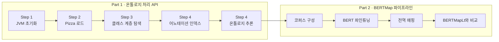

# S18A — DeepOnto: 온톨로지 처리 API

> **실습④** · Week 5 · Day 9 · Part 1
> 원자료 — DSBA Lab Study 노트북 `Ontology-Week5-S18-DeepOnto`
> 도구 — **deeponto** (Java 11+ 필요) · OWLAPI · HermiT
> 데이터 — Pizza Ontology (Part 1) · Conference Ontology / MultiFarm en-pt (Part 2)
>
> 참고 논문 (BERTMap 이론은 [S16B](S16B-BERTMap-문맥-임베딩-기반-정렬.md)에서 다뤘다)
> · He, Chen, Antonyrajah, Horrocks (2022), _BERTMap: A BERT-based Ontology Alignment
>   System_, AAAI ([arXiv:2112.02682](https://arxiv.org/abs/2112.02682))
> · DeepOnto — [KRR-Oxford/DeepOnto](https://github.com/KRR-Oxford/DeepOnto)
>
> 📖 [강의 목차](README.md) · [YouTube 재생목록](https://www.youtube.com/watch?v=f0WV7b3lGqM&list=PLFHGWfB_kmrs)
> 이전 [S17 KG 임베딩 실습 (PyKEEN)](S17-KG-임베딩-실습-PyKEEN.md) · 다음 S18B BERTMap 파이프라인
> 📎 부록 [S18-1 읽는 데 필요한 것들](S18-1-읽는-데-필요한-것들.md) ·
> [S18-2 돌려보고 확인한 것들](S18-2-돌려보고-확인한-것들.md)

**한 회차를 두 문서로 나눴다.** 자료가 스스로 Part 1과 Part 2로 갈라져 있다. 이 문서가
Part 1(온톨로지 처리 API), S18B가 Part 2(BERTMap 파이프라인)를 다룬다. 절 번호는 문서마다
1부터 다시 시작한다.

**[S17](S17-KG-임베딩-실습-PyKEEN.md)과 같은 실습 회차 틀을 쓴다.** 노트북의 Step 순서를
절로 삼고, 어떤 API를 왜 부르는지에 무게를 둔다.

**자료가 DeepOnto와 BERTMap 자체를 거의 설명하지 않는다.** 표지의 "이론 요약(10분)"이
두 줄짜리 표 하나이고 나머지는 API 사용법이다. 도구가 왜 이런 모양인지와 BERTMap의 다섯
단계가 각각 무엇을 푸는지는 [S18-1](S18-1-읽는-데-필요한-것들.md)에 따로 적었다.

---

## 이 회차의 모양



> 노트북에 **Step 4가 두 번 나온다.** 어노테이션 인덱스 구축과 온톨로지 추론이 같은 번호를
> 달고 있다. 자료가 그런 것이므로 번호를 고치지 않고 그대로 두었다.

**학습 목표 셋**을 자료가 앞에 적는다.

1. DeepOnto `Ontology` API로 OWL 온톨로지를 로드하고 클래스 계층·어노테이션을 탐색한다
2. BERTMap 파이프라인의 전체 구조(어노테이션 인덱스 → BERT 파인튜닝 → 전역 매핑)를 이해한다
3. 미리 생성된 BERTMap 결과를 BERTMapLt(문자열 매칭)와 비교하여 BERT 파인튜닝의 효과를 확인한다

세 번째가 이 실습의 실제 모양을 정한다. **BERT 파인튜닝은 돌리지 않고 미리 만들어둔 결과를
쓴다.** 파이프라인 그림에 "수 시간 소요"라고 적힌 단계가 그것이다.

### 이론 요약

자료가 두 시스템을 두 줄로 요약한다.

| 시스템 | 태스크 | 핵심 아이디어 |
|---|---|---|
| **BERTMap** | 온톨로지 정렬 (동일 개념 매핑) | BERT 동의어 분류기 + idf 후보 선별 + 반복 매핑 확장 |
| **BERTMapLt** | 온톨로지 정렬 (경량) | 파인튜닝 없이 문자열 편집 유사도만 사용 |

BERTMapLt가 비교 대상으로 서는 이유가 여기 있다. 두 시스템의 차이가 BERT 파인튜닝 하나뿐이라,
둘을 나란히 놓으면 그 단계가 얼마나 기여하는지가 드러난다.

---

## 1. Step 1 — JVM 초기화

```python
import os
os.getcwd()
# '/workspace/Ontology-Week5-S18-DeepOnto'
```

```python
# deeponto는 OWLAPI(Java)를 JPype로 브리징
# → JVM을 먼저 초기화해야 Ontology 관련 클래스를 임포트할 수 있음
import deeponto
deeponto.init_jvm("4g")   # JVM에 할당할 최대 메모리

from deeponto.onto import Ontology
print("DeepOnto 초기화 완료 ✓")
```

```
INFO:deeponto:4g maximum memory allocated to JVM.
INFO:deeponto:JVM started successfully.
DeepOnto 초기화 완료 ✓
```

임포트 순서가 정해져 있다. `deeponto.init_jvm()` 을 먼저 부르지 않고 `deeponto.onto` 를
임포트하면 안 된다. OWL 클래스들이 Java 쪽 객체를 감싸고 있어서 JVM이 떠 있어야 만들어진다.

> 이 한 줄 때문에 로컬 환경 구성에서 두 번 막혔다. macOS에서 JPype가 JDK를 못 찾는 문제와
> 메모리를 대화식으로 묻는 문제인데, [S18-2 2절](S18-2-돌려보고-확인한-것들.md)에 적었다.

---

## 2. Step 2 — Pizza 온톨로지 로드

자료가 먼저 두 낱말을 정의한다.

- **iri** (international resource identifier) — 온톨로지 내 모든 것(클래스, 개체, 속성 등)에
  붙는 식별자
- **cls** — 파이썬 상에서 온톨로지 내 모든 것을 지칭하는 객체

### 2.1 API 표

자료가 이 실습에서 쓰는 것을 한 표로 정리한다.

| 메서드 · 속성 | 입력 | 출력 | 설명 |
|---|---|---|---|
| `onto.owl_classes.keys()` | - | `dict_keys[str]` | 온톨로지 내 모든 클래스의 IRI 문자열 목록 |
| `onto.get_owl_object(iri)` | IRI 문자열 | OWLClass · property · individual | IRI 문자열 → 실제 OWL 객체로 변환 |
| `onto.get_asserted_parents(cls, named_only=True)` | cls, `named_only`(복합 클래스 표현식 제외 여부) | 부모 클래스 집합 | cls가 명시적으로 선언한 직접 부모 |
| `onto.get_asserted_children(cls, named_only=True)` | cls, `named_only` | 자식 클래스 집합 | cls가 명시적으로 선언한 직접 자식 |
| `onto.get_annotations(cls, annotation_property_iri, apply_lowercasing, normalise_identifiers)` | cls, 조회할 어노테이션 속성, 소문자화·식별자 정규화 여부 | `set[str]` | cls에 달린 어노테이션 리터럴 값 반환 |
| `onto.check_consistency()` | - | `bool` | 온톨로지 전체가 논리적으로 모순 없는지 리즈너로 검사 |
| `onto.reasoner.get_inferred_super_entities(cls, direct=False)` | cls, `direct`(직접 부모만 vs 전체 조상) | 상위 클래스 집합 | 리즈너로 **추론된** 상위 클래스. `get_asserted_parents` 와 달리 "쓰여 있는 것"이 아니라 "논리적으로 따라나오는 것" |
| `str(p.getIRI())` | OWLObject 객체 `p` | IRI 문자열 | OWL 객체 → IRI 문자열 (`get_owl_object` 의 반대 방향) |

온톨로지가 들고 있는 사전은 다섯이다.

```python
onto.owl_classes               # {iri: OWLClass}
onto.owl_object_properties     # {iri: OWLObjectProperty}
onto.owl_data_properties       # {iri: OWLDataProperty}
onto.owl_annotation_properties # {iri: OWLAnnotationProperty}
onto.owl_individuals           # {iri: OWLIndividual}
```

### 2.2 로드

```python
# pizza.owl 다운로드 (최초 1회)
import urllib.request, os
if not os.path.exists("pizza.owl"):
    url = "https://raw.githubusercontent.com/owlcs/pizza-ontology/master/pizza.owl"
    urllib.request.urlretrieve(url, "pizza.owl")
    print("pizza.owl 다운로드 완료")

onto = Ontology("pizza.owl")
print(f"온톨로지 IRI: {onto.owl_iri}")

print(f"클래스 수: {len(onto.owl_classes)}")
all_iris = list(onto.owl_classes.keys())
for iri in all_iris[:5]:
    print(iri)

# Object Property: 클래스(개체) 간의 관계를 표현 (예: hasTopping: Pizza → Topping)
print(f"ObjectProperty 수: {len(onto.owl_object_properties)}")
for prop in onto.owl_object_properties.keys():
    print(prop)

# Data Property: 클래스(개체)가 갖는 데이터 값을 표현 (예: hasCalorieContent: Pizza → xsd:integer)
print(f"DataProperty 수: {len(onto.owl_data_properties)}")
for prop in onto.owl_data_properties.keys():
    print(prop)
```

```
온톨로지 IRI: https://raw.githubusercontent.com/owlcs/pizza-ontology/refs/heads/master/pizza.owl
--------------------------------------------------
클래스 수:  100
```

> **[미수록]** ObjectProperty·DataProperty 목록의 출력 부분은 화면이 잘려 받지 못했다.
> 직접 돌린 값은 [S18-2 3절](S18-2-돌려보고-확인한-것들.md)에 있다.

---

## 3. Step 3 — 클래스 계층 탐색

IRI를 통해 온톨로지의 일부를 확인하는 흐름을 네 단계로 보여준다.

```python
# 1. iri: owl_classes 딕셔너리의 key들이 곧 iri 문자열입니다
all_iris = list(onto.owl_classes.keys())

# 2. 그중 하나를 골라서 iri 변수로 지정
iri = [i for i in all_iris if i.endswith("#Margherita")][0]
print("예시 iri:", iri)

# 3. iri로 실제 객체를 가져옴
cls = onto.get_owl_object(iri)

# 4. 이제 cls를 넣어서 나머지 메소드들을 씀
parents  = onto.get_asserted_parents(cls, named_only=True)
children = onto.get_asserted_children(cls, named_only=True)

print(f"부모: {[str(p.getIRI()) for p in parents]}")
print(f"자식 (5개만): {[str(c.getIRI()) for c in list(children)[:5]]}")

print(f"온톨로지 일관성: {onto.check_consistency()}")

# 추이적 상위 클래스 (조상 전체)
ancestors = onto.reasoner.get_inferred_super_entities(cls, direct=False)
print(f"추론된 조상 클래스: {ancestors}")
```

```
INFO:root:Checking consistency with `hermit` reasoner.
예시 iri: ...pizza.owl#Margherita
부모: ['...pizza.owl#NamedPizza']
자식 (5개만): []
온톨로지 일관성: True
추론된 조상 클래스: ['...#CheeseyPizza', '...#DomainConcept', ...]
```

`Margherita` 는 부모가 `NamedPizza` 하나뿐인데 추론된 조상은 그보다 많다. 이 차이가 다음
절의 주제다.

### 3.1 asserted와 inferred

자료가 파일에 적힌 것과 리즈너가 계산한 것을 나란히 놓는다.

```
파일에 적힌 것 (asserted):    Pizza → NamedPizza                        (딱 1단계, 접혀있음)

리즈너가 계산한 것 (inferred): Pizza → NamedPizza → MargheritaPizza
                              Pizza → NamedPizza → AmericanPizza
                              Pizza → NamedPizza → FourSeasonsPizza
                              ...                                       (모든 단계를 다 풀어서 나열, 펼쳐짐)
```

"계산해서 펼쳤다"는 것은 리즈너가 논리 규칙을 적용해 새로운 사실을 유도해냈다는 뜻이다.
파일에는 안 적혀 있는데, 적혀 있는 것들을 조합하면 논리적으로 반드시 참이 되는 것을 찾아낸다.

Pizza 온톨로지 파일에는 이 두 문장만 직접 쓰여 있다.

```
① MargheritaPizza  SubClassOf  NamedPizza     ← 파일에 명시된 문장
② NamedPizza       SubClassOf  Pizza          ← 파일에 명시된 문장
```

파일 어디에도 `MargheritaPizza SubClassOf Pizza` 라는 문장은 쓰여 있지 않다. 그런데
논리학의 기본 규칙 중 하나가 **추이성(transitivity)** 이다.

```
만약 A ⊂ B 이고 B ⊂ C 이면
반드시 A ⊂ C 이다   (이건 논리적으로 항상 참)
```

리즈너는 이 규칙을 ①과 ②에 적용해서 ①+② → `MargheritaPizza SubClassOf Pizza` 라는 문장을
새로 계산해낸다. 파일에 없던 문장을 논리 규칙으로 만들어내는 것이 "계산해서 펼쳤다"는 뜻이다.

사람이 손으로 하면 이런 느낌이다.

```
"MargheritaPizza는 NamedPizza다"  (①, 사실)
"NamedPizza는 Pizza다"            (②, 사실)
        ↓ (사람이 머릿속으로 추론)
"그러니까 MargheritaPizza는 Pizza다"   ← 아무도 안 알려줬지만 논리적으로 당연히 참
```

리즈너(HermiT, ELK 등)는 이 추론 과정을 알고리즘으로 자동 수행한다. 두 단계짜리 체인뿐
아니라 온톨로지 안의 모든 SubClassOf 관계를 끝까지 다 연결해서 최종적으로 확정되는 관계를
전부 찾아내고, 그 결과물의 집합을 **추이적 폐포(transitive closure)** 라고 부른다.
한 단계만 적혀 있던 관계를 논리적으로 가능한 모든 단계까지 다 이어붙여 나열한 것이
"펼쳤다"는 표현이 맞는 이유다.

### 3.2 두 계열을 직접 비교하기

```python
# 1. Pizza 클래스 가져오기
pizza_iri = [iri for iri in onto.owl_classes if iri.endswith("#Pizza")][0]
pizza_cls = onto.get_owl_object(pizza_iri)

parents  = onto.get_asserted_parents(pizza_cls, named_only=True)
children = onto.get_asserted_children(pizza_cls, named_only=True)

print("=== Pizza 클래스 (직접 관계, asserted) ===")
print(f"직접 부모 개수: {len(parents)}")
print(f"직접 부모: {[str(p).split('#')[-1].rstrip('>') for p in parents]}")
print(f"직접 자식 개수: {len(children)}")
print(f"직접 자식: {[str(c).split('#')[-1].rstrip('>') for c in children]}")

# 2. NamedPizza의 직접 자식들 확인 (한 단계 더 내려가기)
named_pizza_iri = [iri for iri in onto.owl_classes if iri.endswith("#NamedPizza")][0]
named_pizza_cls = onto.get_owl_object(named_pizza_iri)
named_pizza_children = onto.get_asserted_children(named_pizza_cls, named_only=True)

print("=== NamedPizza 클래스 (직접 관계, asserted) ===")
print(f"직접 자식 개수: {len(named_pizza_children)}")
print(f"직접 자식 (처음 8개): {[str(c).split('#')[-1].rstrip('>') for c in list(named_pizza_children)[:8]]}")

# 3. asserted vs inferred 비교 — Pizza의 "모든" 하위 클래스 (추이적 폐포)
inferred_descendants = onto.reasoner.get_inferred_sub_entities(pizza_cls, direct=False)

print("=== Pizza 클래스 (추론 관계, inferred) ===")
print(f"asserted 직접 자식 개수 : {len(children)}")
print(f"inferred 전체 하위 클래스 개수: {len(inferred_descendants)}")
print(f"inferred 하위 클래스 (처음 10개): {[iri.split('#')[-1] for iri in list(inferred_descendants)[:10]]}")
```

앞선 셀의 출력에서 `Pizza` 의 직접 부모는 `['Food']`, 직접 자식은 `NamedPizza` 하나였고,
`NamedPizza` 의 직접 자식으로 `Fiorentina` · `SloppyGiuseppe` · `UnclosedPizza` · `LaReine` ·
`PolloAdAstra` · `Veneziana` · `American` · `Giardiniera` · `Cajun` 등이 나온다.

> **[미수록]** 이 셀의 출력(asserted 1개 대 inferred 전체 개수)은 받지 못했다.
> 직접 돌린 값은 [S18-2 3절](S18-2-돌려보고-확인한-것들.md)에 있다.

---

## 4. RDFS와 표준 어휘

노트북이 코드에 상수로 박히는 `RDFS_LABEL` 이 무엇인지를 따로 설명한다.

**RDFS (RDF Schema)**

- W3C가 정한 표준 어휘 모음
- "온톨로지를 표현할 때 이런 개념들은 공통으로 쓰자"고 미리 정의해둔 것
- 표준이기 때문에, 전 세계 어느 온톨로지를 만들든 이 IRI들은 항상 똑같음
- `rdfs:` 로 시작하는 것들은 전부 아래 네임스페이스를 공유하고, `#` 뒤에 어떤 개념인지만 다름

| 사람이 부르는 이름 | 실제 IRI | 의미 |
|---|---|---|
| `rdfs:label` | `http://www.w3.org/2000/01/rdf-schema#label` | 사람이 읽는 이름 |
| `rdfs:comment` | `http://www.w3.org/2000/01/rdf-schema#comment` | 설명 · 주석 |
| `rdfs:subClassOf` | `http://www.w3.org/2000/01/rdf-schema#subClassOf` | "A는 B의 하위 클래스다" 관계 |
| `rdfs:domain` | `http://www.w3.org/2000/01/rdf-schema#domain` | 속성의 정의역 (누가 이 속성을 갖는지) |
| `rdfs:range` | `http://www.w3.org/2000/01/rdf-schema#range` | 속성의 치역 (이 속성의 값이 뭐가 되는지) |
| `rdfs:seeAlso` | `http://www.w3.org/2000/01/rdf-schema#seeAlso` | 관련 자료 링크 |

**그래서 코드에서 상수로 박아두는 이유** — 이 값은 Pizza 온톨로지든, FMA든, SNOMED든
절대 바뀌지 않기 때문에 코드 어디서든 재사용할 수 있는 고정값으로 취급한다.

```python
RDFS_LABEL = "http://www.w3.org/2000/01/rdf-schema#label"
```

반대로 클래스 IRI(`#Pizza`)는 온톨로지마다 다르니 상수로 박아둘 수 없고, 매번
`onto.owl_classes` 에서 찾아야 한다.

### 4.1 주요 표준 어휘 체계

`rdfs:` 말고도 여러 표준 어휘가 있고, BERTMap 기본 config의 `annotation_property_iris`
리스트가 이 표준들을 섞어서 쓴 예시다.

| 표준 | 네임스페이스 | 주로 쓰이는 곳 |
|---|---|---|
| RDFS | `http://www.w3.org/2000/01/rdf-schema#` | 기본 골격 (label, comment, subClassOf) |
| OWL | `http://www.w3.org/2002/07/owl#` | 온톨로지 자체의 논리 구조 (Class, ObjectProperty, equivalentClass, disjointWith) |
| SKOS | `http://www.w3.org/2004/02/skos/core#` | 분류체계 · 시소러스 (prefLabel, altLabel, broader, narrower) |
| OBO/oboInOwl | `http://www.geneontology.org/formats/oboInOwl#` | 생의학 온톨로지 전용 (hasExactSynonym, hasSynonym, inSubset) |
| Dublin Core | `http://purl.org/dc/elements/1.1/` | 문헌 · 메타데이터 (title, creator, description) |
| FOAF | `http://xmlns.com/foaf/0.1/` | 사람 · 조직 관계 (name, knows, mbox) |

**BERTMap config에서 실제로 섞어 쓴 예**

```yaml
annotation_property_iris:
  - http://www.w3.org/2000/01/rdf-schema#label              # RDFS
  - http://www.geneontology.org/formats/oboInOwl#hasSynonym       # OBO
  - http://www.geneontology.org/formats/oboInOwl#hasExactSynonym  # OBO
  - http://www.w3.org/2004/02/skos/core#exactMatch          # SKOS
  - http://www.w3.org/2004/02/skos/core#prefLabel           # SKOS
  - http://www.w3.org/2004/02/skos/core#altLabel            # SKOS
  - http://ncicb.nci.nih.gov/xml/owl/EVS/Thesaurus.owl#P108 # NCI 자체 정의 (표준 아님)
  - http://ncicb.nci.nih.gov/xml/owl/EVS/Thesaurus.owl#P90  # NCI 자체 정의 (표준 아님)
```

표준 어휘(RDFS·OBO·SKOS)와 온톨로지 자체가 독자적으로 만든 어노테이션(NCI Thesaurus의
P108, P90 같은 것)이 섞여 있다.

### 4.2 표준과 비표준을 가르는 법

| | 특징 |
|---|---|
| 표준 어휘 (RDFS, OWL, SKOS, OBO 등) | 네임스페이스가 W3C나 공인 기관 도메인(`w3.org`, `geneontology.org` 등) → 어느 온톨로지에서 봐도 같은 뜻 |
| 비표준 (온톨로지 고유) | 네임스페이스가 그 온톨로지 자체의 도메인(`ncicb.nih.gov`, `pizza.owl#` 등) → 그 온톨로지 안에서만 의미 있고, IRI 이름(`P108`)만 봐서는 뜻을 알 수 없어서 문서를 따로 찾아봐야 함 |

**왜 BERTMap이 여러 표준을 다 긁어모으는가**

- RDFS/OWL/SKOS/OBO는 "여러 온톨로지가 공통으로 이해할 수 있게" 미리 약속해둔 표준 어휘고,
  그 외 자체 어노테이션은 그 온톨로지만의 방언이다
- BERTMap은 표준과 방언을 가리지 않고 최대한 많은 라벨을 긁어모아 학습 데이터를 풍성하게
  만들기 위함이다

---

## 5. Step 4 — 어노테이션 인덱스 구축

**원래 의도는 이름은 다르지만 같은 개념을 매칭하고자 하는 것이 ontology matching의 핵심**이고,
이를 다국어 관점에서도 적용할 수 있다. 공교롭게 pizza ontology에 포르투갈어도 함께 존재한다.

### 5.1 한 클래스의 어노테이션 읽기

```python
RDFS_LABEL = "http://www.w3.org/2000/01/rdf-schema#label"
                                    # rdfs:label의 IRI를 상수로 지정 (모든 온톨로지에서 공통)

labels = onto.get_annotations(
    cls,
    annotation_property_iri=RDFS_LABEL,   # rdfs:label 값만 조회하겠다고 지정
    apply_lowercasing=True,               # 라벨을 소문자로 통일
    normalise_identifiers=True            # CamelCase 식별자를 자연어로 변환
)                                         # cls에 달린 rdfs:label 값들을 set(str)로 반환

print(f"어노테이션 속성: {list(onto.owl_annotation_properties.keys())}")
print(f"라벨: {labels}")
```

```
어노테이션 속성: ['http://www.w3.org/2000/01/rdf-schema#comment',
                'http://www.w3.org/2000/01/rdf-schema#label',
                'http://www.w3.org/2002/07/owl#versionInfo']
라벨: ['margherita']
```

### 5.2 온톨로지 전체에 인덱스 만들기

```python
onto.build_annotation_index(
    annotation_property_iris=[RDFS_LABEL],  # 어떤 어노테이션 속성(들)을 모을지, 리스트로 여러 개 가능
    entity_type="Classes",                  # 클래스 대상 (ObjectProperties 등도 가능) / Default: "Classes"
    apply_lowercasing=True,
    normalise_identifiers=True
)
```

docstring이 알려주는 것은 이렇다.

| 인자 | 뜻 | 기본값 |
|---|---|---|
| `annotation_property_iris` | 어노테이션 속성 IRI의 리스트. 그중 실제로 안 쓰이는 것이 섞여 있어도 된다 | `[RDFS_LABEL]` |
| `entity_type` | 대상 엔티티 종류. `Classes` · `ObjectProperties` · `DataProperties` 등 | `"Classes"` |
| `apply_lowercasing` | 어노테이션 리터럴을 소문자로 바꿀지 | `True` |
| `normalise_identifiers` | Java 식별자 형식인 어노테이션 텍스트를 정규화할지 | `False` |

반환값은 `(dict, list[str])` 쌍이다. 만들어진 어노테이션 인덱스와, **실제로 쓰인**
어노테이션 속성 IRI의 목록이다.

### 5.3 두 인덱스를 나란히 놓기

```python
RDFS_LABEL = "http://www.w3.org/2000/01/rdf-schema#label"

# rdfs:label (포르투갈어 레이블)
anno_pt, used_pt = onto.build_annotation_index(
    annotation_property_iris=[RDFS_LABEL],
    apply_lowercasing=True
)

# normalise_identifiers=True → CamelCase 클래스명을 자연어로 변환 (영어)
anno_en, used_en = onto.build_annotation_index(
    annotation_property_iris=[RDFS_LABEL],
    normalise_identifiers=True,
    apply_lowercasing=True
)

print("=== 어노테이션 인덱스 비교 (처음 8개) ===")
print(f"{'클래스명':<25} {'EN (normalised)':<30} {'PT (rdfs:label)'}")
count = 0
for iri in list(onto.owl_classes.keys())[:20]:
    short = iri.split("#")[-1]
    en_labels = list(anno_en.get(iri, []))
    pt_labels = list(anno_pt.get(iri, []))
    if en_labels or pt_labels:
        print(f"{short:<25} {str(en_labels):<30} {pt_labels}")
        count += 1
        if count >= 8: break

print(f"[설명] BERTMap은 이 두 인덱스를 src/tgt 어노테이션으로 사용하여")
print(f"       BERT 동의어 분류기를 학습합니다.")
```

> **[미수록]** 이 셀의 출력은 받지 못했다. 직접 돌린 값은
> [S18-2 4절](S18-2-돌려보고-확인한-것들.md)에 있는데, **열 이름이 가리키는 것과 실제 값이
> 다르다.** 자료의 설명과 어긋나는 지점이라 거기 따로 적었다.

### 5.4 여러 어노테이션 속성을 한 번에 합치기

리스트로 여러 개의 어노테이션을 넣으면 `rdfs:label` + `skos:altLabel` +
`oboInOwl#hasExactSynonym` 등을 한 클래스당 하나의 set으로 합쳐서 인덱스를 만든다.

```python
EXACT_SYNONYM = "http://www.geneontology.org/formats/oboInOwl#hasExactSynonym"

index, used = onto.build_annotation_index(
    annotation_property_iris=[RDFS_LABEL, EXACT_SYNONYM],
    apply_lowercasing=True
)
# index[iri] = {"margherita"} ∪ {동의어들}  → 둘 다 있으면 합쳐진 set
```

한 클래스에 붙은 이름이 여럿이면 전부 한 자루에 담긴다. 이것이 다음 단계에서 동의어 쌍을
만드는 재료가 된다.

---

## 6. Step 4 — 온톨로지 추론 (OntologyReasoner)

> 노트북이 이 절에 `claude 답변 활용` 이라는 태그를 달아 두었다. 자료에 있는 표시이므로
> 그대로 옮긴다.

`check_consistency()` 는 온톨로지 전체가 논리적으로 모순 없이 성립하는지 검사하는
메서드다. 결과는 `True`(일관됨) 또는 `False`(모순 있음) 딱 하나만 반환한다.

```python
onto.check_consistency()   # → True 또는 False
```

내부적으로는 `onto.reasoner`(HermiT 또는 ELK)에게 물어본다.

```python
def check_consistency(self):
    return self.reasoner.owl_reasoner.isConsistent()
```

즉 리즈너가 온톨로지 안의 모든 클래스, 속성, 공리(axiom)를 논리적으로 검토해서
**"이 세상이 존재할 수 있는가?"** 를 판단한다.

### 6.1 "모순"이 구체적으로 무엇인가

가장 흔한 예가 disjoint(서로 배타적인) 클래스인데 동시에 그 둘의 하위 클래스로 선언된
경우다.

```xml
<owl:Class rdf:about="#CheeseTopping">
  <owl:disjointWith><owl:Class rdf:about="#VegetableTopping"/></owl:disjointWith>
</owl:Class>
```

이건 "치즈 토핑과 야채 토핑은 절대 같을 수 없다"는 선언인데, 만약 어떤 클래스가 이 둘 다의
하위 클래스로 선언되면

```xml
<owl:Class rdf:about="#CheeseyVegetableTopping">
  <rdfs:subClassOf rdf:resource="#CheeseTopping"/>
  <rdfs:subClassOf rdf:resource="#VegetableTopping"/>
</owl:Class>
```

실제로 Pizza 온톨로지 파일 주석에 이렇게 명시되어 있다.

> "This class will be inconsistent. This is because we have given it 2 disjoint parents,
> which means it could never have any members"

즉 `CheeseyVegetableTopping` 은 "치즈이면서 동시에 치즈가 아닌 것"이 되어버려서, 논리적으로
어떤 것도 이 클래스의 멤버가 될 수 없는 모순 상태다.

```python
is_consistent = onto.check_consistency()
print(f"온톨로지 일관성: {is_consistent}")

unsatisfiable = onto.reasoner.owl_reasoner.getUnsatisfiableClasses()
print(list(unsatisfiable))
```

> **자료의 설명이 실행 결과와 다르다.** 자료는 "이런 게 하나라도 있으면
> `check_consistency()` 는 `False` 를 반환합니다", "실제로 실행하면 `False` 가 나올
> 가능성이 있습니다"라고 적는데, 3절에서 이미 `True` 가 출력됐고 직접 돌려도 `True` 다.
> 왜 그런지는 [S18-2 5절](S18-2-돌려보고-확인한-것들.md)에 적었다.

### 6.2 왜 이게 BERTMap에서 중요한가 — 논문과의 직결 지점

**Mapping Repair 단계가 정확히 이 개념을 사용한다.** BERTMap이 두 온톨로지 사이에 매핑을
예측한 뒤, 그 매핑들을 실제로 두 온톨로지에 "병합"하면

```
FMA의 "muscle layer" = SNOMED의 "muscularis propria"   (BERTMap이 예측한 매핑)
```

이런 매핑이 여러 개 쌓이면, 두 온톨로지의 서로 다른 disjoint 선언들이 충돌해서 병합된
온톨로지가 논리적으로 모순(inconsistent)될 수 있다. 그래서 BERTMap의 마지막 단계
(`MappingRefiner.mapping_repair()`)가 LogMap의 리페어 알고리즘을 불러다가,
`check_consistency()` 같은 검사를 반복하면서 모순을 일으키는 최소한의 매핑만 골라서
제거하는 것이다.

즉 `check_consistency()` 자체는 단순한 True/False 함수지만, 그 뒤에 있는 리즈너 기반 논리
검사가 BERTMap 파이프라인 전체의 **"정밀도를 지키는 마지막 안전장치"** 역할을 한다.

### 6.3 리즈너를 직접 만들어 쓰기

```python
from deeponto.onto import OntologyReasoner

reasoner = OntologyReasoner(onto, reasoner_type="hermit")

# 추론된 상위 클래스 (SubClassOf 추이적 폐포)
pizza_cls = onto.get_owl_object(pizza_iri)
inferred_parents = reasoner.get_inferred_super_entities(pizza_cls, direct=False)
print(f"Pizza의 추론된 모든 상위 클래스:")
print([str(p).split('#')[-1] for p in inferred_parents])

# 일관성 검사
is_consistent = onto.check_consistency()
print(f"\n온톨로지 일관성: {is_consistent}")
```

```
INFO:root:Checking consistency with `hermit` reasoner.
Pizza의 추론된 모든 상위 클래스:
['DomainConcept', 'Food']

온톨로지 일관성: True
```

`Pizza` 의 직접 부모는 `Food` 하나인데 추론된 상위는 `DomainConcept` 까지 둘이다.
`Food` 가 `DomainConcept` 의 하위라서 한 단계가 더 따라 나왔다.

---

📎 이어서 [S18B BERTMap 파이프라인](S18B-BERTMap-파이프라인.md) ·
[S18-1 읽는 데 필요한 것들](S18-1-읽는-데-필요한-것들.md) ·
[S18-2 돌려보고 확인한 것들](S18-2-돌려보고-확인한-것들.md)
