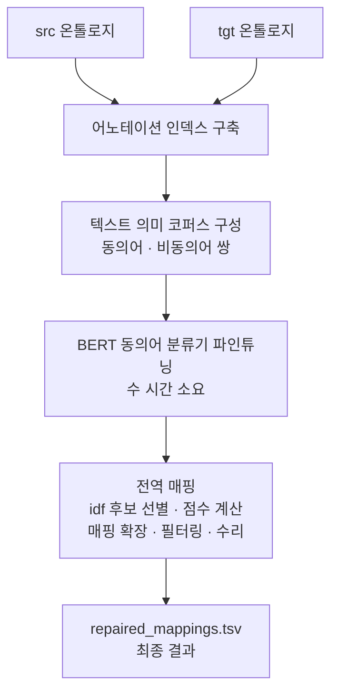
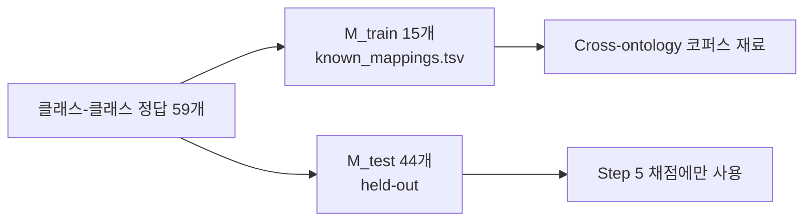

# S18B — BERTMap 파이프라인

> **실습④** · Week 5 · Day 9 · Part 2
> 원자료 — DSBA Lab Study 노트북 `Ontology-Week5-S18-DeepOnto`
> 데이터 — **MultiFarm conference en-pt** (OAEI 공식 벤치마크)
> 모델 — BERTMap (다국어 BERT) · BERTMapLt (문자열 편집 유사도)
>
> 📖 [강의 목차](README.md) · [YouTube 재생목록](https://www.youtube.com/watch?v=f0WV7b3lGqM&list=PLFHGWfB_kmrs)
> 이전 [S18A DeepOnto 온톨로지 처리 API](S18A-DeepOnto-온톨로지-처리-API.md) · 다음 S19 (Ch.6 ERNIE · KnowBERT)
> 📎 부록 [S18-1 읽는 데 필요한 것들](S18-1-읽는-데-필요한-것들.md) ·
> [S18-2 돌려보고 확인한 것들](S18-2-돌려보고-확인한-것들.md)

**Part 1이 [S18A](S18A-DeepOnto-온톨로지-처리-API.md)에 있다.** 절 번호는 문서마다 1부터
다시 시작한다. BERTMap의 이론은 [S16B](S16B-BERTMap-문맥-임베딩-기반-정렬.md)에서 논문으로
다뤘고, 이 문서는 그것을 돌리는 쪽이다.

**회차 제목은 "온톨로지 임베딩·정렬 실습"이지만 이 노트북은 정렬만 한다.** BERTMap의
산출물은 벡터가 아니라 매핑 표이고, [S15](S15A-OWL2Vec-star-문장-기반-임베딩.md)의 온톨로지
임베딩 모델(OWL2Vec\* · EL Embeddings)은 나오지 않는다. 왜 그런지는
[S18-1 4절](S18-1-읽는-데-필요한-것들.md)에 적었다.

---

## 1. 파이프라인 전체 구조

자료가 BERTMap을 한 그림으로 놓는다.



파인튜닝 단계에 "수 시간 소요"가 붙어 있다. 이 실습이 미리 만들어둔 결과를 쓰는 이유다.

### 1.1 텍스트 의미 코퍼스 구성

파이프라인의 두 번째 칸이 무엇을 만드는지 자료가 표로 편다.

| 코퍼스 종류 | synonym (label=1) | non-synonym (label=0) | 필요 조건 |
|---|---|---|---|
| **Intra-ontology** (src·tgt 각각 따로) | 같은 클래스의 라벨끼리 (라벨이 1개뿐이면 자기 자신과 짝짓는 `identity synonym`) | **soft**: 무작위 두 클래스 / **hard**: 형제 클래스 (같은 부모 공유 → disjoint로 가정) | 온톨로지만 있으면 생성 가능 |
| **Cross-ontology** | 매핑된 두 클래스의 라벨 전체 조합 (Ω(c) × Ω(c')) | 매핑 안 된 무작위 클래스 쌍 (hard negative 없음) | `known_mappings` (정답 매핑 TSV: `SrcEntity`, `TgtEntity`, `Score`) 필요 |

오른쪽 열이 두 코퍼스를 가른다. Intra-ontology는 온톨로지 파일만 있으면 만들어지지만,
Cross-ontology는 정답 매핑 일부를 미리 줘야 한다. 이 실습이 Step 3에서 정답을 둘로 쪼개는
이유가 여기 있다.

`hard` negative가 [S16B](S16B-BERTMap-문맥-임베딩-기반-정렬.md)에서 본 그 장치다.
형제 클래스를 disjoint로 가정해서 "비슷하지만 다른" 반례를 대량으로 확보한다.

### 1.2 데이터 출처

**MultiFarm**은 OntoFarm의 `conference` 도메인 온톨로지 7종을 전문 번역가가 8개 언어로
완전 수작업 번역한 OAEI 공식 벤치마크다.
원본은 `http://web.informatik.uni-mannheim.de/multifarm/dataset.zip` 에 있다.

그중 `conference` 온톨로지의 English ↔ Portuguese 쌍을 쓴다.

| 파일 | 무엇 |
|---|---|
| `conference-en.owl` · `conference-pt.owl` | 실제 두 온톨로지 |
| `reference_alignment_en_pt.rdf` | OAEI 공식 정답 매핑 (Alignment API RDF 포맷) |

| | MultiFarm conference en-pt (이 노트북) |
|---|---|
| src/tgt 온톨로지 | 독립적으로 번역된 진짜 두 개의 온톨로지 파일 |
| IRI | 서로 다른 네임스페이스 (`conference_en#...` vs `conference_pt#...`), 정답은 별도 alignment 파일에 있음 |
| 라벨 | 전문 번역가가 실제로 번역한 자연어 라벨 |
| 정답 매핑 (M=) | OAEI 공식 gold-standard reference alignment |
| 클래스 커버리지 | 61개 클래스 중 **59개만 정답 존재** (일부는 대응 없음 — 실제 상황처럼) |

---

## 2. 사전 준비 — 두 온톨로지 로드

```python
import os
os.chdir("/workspace/Ontology-Week5-S18-DeepOnto")

import deeponto
deeponto.init_jvm("4g")

from deeponto.onto import Ontology
print("DeepOnto 초기화 완료 ✓")

src_onto = Ontology("multifarm/conference-en.owl")
tgt_onto = Ontology("multifarm/conference-pt.owl")

print(f"src(en) 클래스 수: {len(src_onto.owl_classes)}")
print(f"tgt(pt) 클래스 수: {len(tgt_onto.owl_classes)}")
```

```
INFO:deeponto:4g maximum memory allocated to JVM.
INFO:deeponto:JVM started successfully.
DeepOnto 초기화 완료 ✓
src(en) 클래스 수: 61
tgt(pt) 클래스 수: 61
```

양쪽이 61개로 같다. 같은 온톨로지를 번역한 것이라 구조가 일치한다.

---

## 3. Step 1 — 두 온톨로지의 실제 클래스 보기

```python
RDFS_LABEL = "http://www.w3.org/2000/01/rdf-schema#label"

def show_examples(onto, name, n=5):
    print(f"=== {name} 예시 ===")
    for iri in list(onto.owl_classes.keys())[:n]:
        cls = onto.get_owl_object(iri)
        label = onto.get_annotations(cls, annotation_property_iri=RDFS_LABEL)
        parents = onto.get_asserted_parents(cls, named_only=True)
        parent_labels = [onto.get_annotations(p, annotation_property_iri=RDFS_LABEL) for p in parents]
        print(f"IRI: {iri.split('#')[-1]}")
        print(f"  라벨: {label}")
        print(f"  부모 클래스: {parent_labels if parent_labels else '없음 (최상위 클래스)'}")
        print()

show_examples(src_onto, "src(en) 온톨로지 (conference-en.owl)")
show_examples(tgt_onto, "tgt(pt) 온톨로지 (conference-pt.owl)")
```

```
=== src(en) 온톨로지 (conference-en.owl) 예시 ===
IRI: c-0002793-7190514
  라벨: ['passive participant of conference']
  부모 클래스: [['participant of conference']]

IRI: c-0100103-4454032
  라벨: ['information for participants']
  부모 클래스: [['conference document']]

IRI: c-0363169-3117332
  라벨: ['accepted contribution']
  부모 클래스: [['reviewed contribution']]

IRI: c-0689175-6904662
  라벨: ['first author of contribution']
  부모 클래스: [['author of contribution']]
```

**IRI가 `c-0002793-7190514` 같은 무의미한 코드다.** 이름에서 아무 정보도 얻을 수 없고,
뜻은 오직 `rdfs:label` 에만 들어 있다. Pizza 온톨로지가 `#Margherita` 처럼 이름 자체가
말을 하던 것과 정반대다.

> 이 성질이 [S16B](S16B-BERTMap-문맥-임베딩-기반-정렬.md)의 Surface Information 논의와
> 맞물린다. 왜 이 데이터셋이 정렬 평가에 적합한지는
> [S18-1](S18-1-읽는-데-필요한-것들.md)에 적었다.

---

## 4. Step 2 — 공식 Reference Alignment 파싱

OAEI 공식 정답은 **Alignment API의 RDF/XML 포맷**으로 제공된다.

구조는 `<Cell><entity1/><entity2/><measure/><relation/></Cell>` 이다.

```xml
<Cell>
    <entity1 rdf:resource="http://conference_en#c-2541048-2862308"/>
    <entity2 rdf:resource="http://conference_pt#c-2245653-0676275"/>
    <measure rdf:datatype="xsd:float">1.0</measure>
    <relation>=</relation>
</Cell>
```

**DeepOnto는 이 포맷을 직접 못 읽고, `SrcEntity` / `TgtEntity` / `Score` 헤더의 TSV만
인식한다.** 그래서 변환이 필요하다.

| Alignment API | → | DeepOnto TSV |
|---|---|---|
| `entity1` | → | `SrcEntity` |
| `entity2` | → | `TgtEntity` |
| `measure` | → | `Score` |

```
SrcEntity	TgtEntity	Score
http://conference_en#c-2541048-2862308	http://conference_pt#c-2245653-0676275	1.0
```

```python
import xml.etree.ElementTree as ET

ns = {"align": "http://knowledgeweb.semanticweb.org/heterogeneity/alignment"}
tree = ET.parse("multifarm/reference_alignment_en_pt.rdf")
root = tree.getroot()
cells_ = root.findall(".//align:Cell", ns)
print(f"공식 alignment의 전체 Cell 수: {len(cells_)}")

rows = []
for cell in cells_:
    e1 = cell.find("align:entity1", ns).attrib["{http://www.w3.org/1999/02/22-rdf-syntax-ns#}resource"]
    e2 = cell.find("align:entity2", ns).attrib["{http://www.w3.org/1999/02/22-rdf-syntax-ns#}resource"]
    rows.append((e1, e2))

# 클래스-클래스 매핑만 사용 (object property, individual 등은 제외)
class_rows = [(s, t) for s, t in rows if s in src_onto.owl_classes and t in tgt_onto.owl_classes]
print(f"클래스-클래스 정답 매핑(M_=): {len(class_rows)}개  (전체 클래스 {len(src_onto.owl_classes)}개 중 일부만 정답 있음)")
```

```
공식 alignment의 전체 Cell 수: 123
클래스-클래스 정답 매핑(M_=): 59개  (전체 클래스 61개 중 일부만 정답 있음)
```

Cell 123개 중 클래스끼리의 매핑은 59개다. 나머지는 object property와 individual의 매핑이라
이 실습에서 제외한다.

---

## 5. Step 3 — 정답을 둘로 쪼개기

전체 정답(M=)을 다 `known_mappings` 로 주지 않고, 일부(M_train)만 제공하고 나머지(M_test)는
숨겨서 평가에 사용한다.

```python
import random
random.seed(42)

shuffled = class_rows[:]
random.shuffle(shuffled)

n_known = 15
known_pairs   = shuffled[:n_known]
heldout_pairs = shuffled[n_known:]
print(f"M_train(known_mappings): {len(known_pairs)}개")
print(f"M_test(held-out, 평가 전용): {len(heldout_pairs)}개")

known_mappings_path = "multifarm/known_mappings_multifarm.tsv"
with open(known_mappings_path, "w") as f:
    f.write("SrcEntity\tTgtEntity\tScore\n")
    for s, t in known_pairs:
        f.write(f"{s}\t{t}\t1.0\n")

# 채점용 정답 dict (pizza 때처럼 SrcEntity==TgtEntity가 아니라, 진짜 다른 IRI끼리의 대응)
heldout_dict = {s: t for s, t in heldout_pairs}
print("known_mappings.tsv 저장 완료 ✓")
```

```
M_train(known_mappings): 15개
M_test(held-out, 평가 전용): 44개
known_mappings.tsv 저장 완료 ✓
```

59개를 15 대 44로 나눈다. 15개는 Cross-ontology 코퍼스를 만드는 재료로 모델에 주고,
44개는 채점에만 쓴다.



---

## 6. Step 4 — BERTMap 실행

```python
from deeponto.align.bertmap import BERTMapPipeline, DEFAULT_CONFIG_FILE
import shutil

# LogMap repair가 en/pt처럼 언어가 다른 온톨로지 쌍을 감지하면 다국어 번역 사전을
# 저장하려고 시도하는데, 그 상위 디렉터리가 이 환경에 없어서 FileNotFoundError가 남.
# 디렉터리만 미리 만들어두면 됨 (원 개발자 컴퓨터의 하드코딩된 절대경로).
os.makedirs("/home/ernesto/Documents/OAEI_OM_2015/EVAL_2015/dict_multilingual", exist_ok=True)

config = BERTMapPipeline.load_bertmap_config(DEFAULT_CONFIG_FILE)
config.output_path = "./bertmap_output_multifarm"
config.bert.pretrained_path = "bert-base-multilingual-cased"   # 다국어 BERT (영어 전용 uncased 아님)
config.bert.num_epochs_for_training = 5
config.global_matching.num_raw_candidates = 10
config.global_matching.num_best_predictions = 3
config.known_mappings = known_mappings_path

if os.path.exists(config.output_path):
    shutil.rmtree(config.output_path)

BERTMapPipeline(src_onto, tgt_onto, config)
print("BERTMap(MultiFarm conference en-pt) 파이프라인 완료 ✓")
```

바꾼 설정 다섯 가지다.

| 설정 | 값 | 왜 |
|---|---|---|
| `bert.pretrained_path` | `bert-base-multilingual-cased` | 영어와 포르투갈어를 함께 다뤄야 하므로 다국어 BERT |
| `bert.num_epochs_for_training` | 5 | 파인튜닝 에폭 |
| `global_matching.num_raw_candidates` | 10 | 후보를 몇 개까지 좁힐지 |
| `global_matching.num_best_predictions` | 3 | 최종으로 몇 개를 남길지 |
| `known_mappings` | Step 3의 15개 TSV | Cross-ontology 코퍼스를 만들려면 필요 |

**맨 위의 `os.makedirs` 한 줄이 눈에 띈다.** `/home/ernesto/Documents/OAEI_OM_2015/...` 는
이 노트북과 아무 관계 없는 절대경로인데, LogMap이 언어가 다른 온톨로지 쌍을 만나면
그 경로에 다국어 사전을 쓰려고 한다. 라이브러리 안에 원 개발자의 컴퓨터 경로가 박혀 있는
것이다. 디렉터리만 미리 만들어두면 넘어간다.

로그 앞부분에 config가 그대로 찍힌다.

```
INFO:datasets:PyTorch version 2.6.0 available.
[Time: 00:00:00] - [PID: 47880] - [Model: bertmap]
Load the following configurations:
{
    "model": "bertmap",
    "output_path": "/workspace/Ontology-Week5-S18-DeepOnto/bertmap_output_multifarm",
    "annotation_property_iris": [
        "http://www.w3.org/2000/01/rdf-schema#label",
        "http://www.geneontology.org/formats/oboInOwl#hasSynonym",
        "http://www.geneontology.org/formats/oboInOwl#hasExactSynonym",
        "http://www.w3.org/2004/02/skos/core#exactMatch",
        "http://www.ebi.ac.uk/efo/alternative_term",
        ...
```

[S18A 4.1절](S18A-DeepOnto-온톨로지-처리-API.md)에서 본 표준 어휘 목록이 그대로 기본값으로
들어 있다.

---

## 7. Step 5 — Held-out 평가

```python
import pandas as pd

heldout_srcs = set(heldout_dict.keys())

for name, path in [
    ("raw_mappings",      "bertmap_output_multifarm/bertmap/match/raw_mappings.tsv"),
    ("filtered_mappings", "bertmap_output_multifarm/bertmap/match/filtered_mappings.tsv"),
]:
    df = pd.read_csv(path, sep="\t")
    df_ho = df[df["SrcEntity"].isin(heldout_srcs)].copy()
    df_ho["gold"]    = df_ho["SrcEntity"].map(heldout_dict)
    df_ho["correct"] = df_ho["TgtEntity"] == df_ho["gold"]

    correct = df_ho["correct"].sum()
    total_out, total_ref = len(df_ho), len(heldout_dict)
    P  = correct / total_out if total_out else 0
    R  = correct / total_ref if total_ref else 0
    F1 = 2 * P * R / (P + R) if (P + R) else 0

    print(f"--- {name} (M_test={total_ref}) ---")
    print(f"  M_out={total_out}, 정답={correct}, Precision={P:.3f}, Recall={R:.3f}, F1={F1:.3f}")

    RDFS_LABEL = "http://www.w3.org/2000/01/rdf-schema#label"
    for _, row in df_ho.iterrows():
        s_label = src_onto.get_annotations(src_onto.get_owl_object(row["SrcEntity"]), annotation_property_iri=RDFS_LABEL)
        t_label = tgt_onto.get_annotations(tgt_onto.get_owl_object(row["TgtEntity"]), annotation_property_iri=RDFS_LABEL)
        verdict = "correct" if row["correct"] else "WRONG"
        print(f"  {s_label} -> {t_label}  (score={row['Score']:.3f}, {verdict})")
    print()
```

채점 방식이 이렇다.

- 모델이 내놓은 매핑 중 **held-out에 속한 src만** 골라낸다
- 그 src의 정답 tgt와 모델의 tgt가 같으면 맞은 것
- Precision = 맞은 수 / 모델이 내놓은 수, Recall = 맞은 수 / 정답 44개

`raw_mappings` 와 `filtered_mappings` 를 둘 다 채점한다. 필터링 전후로 정밀도와 재현율이
어떻게 움직이는지를 보려는 것이다.

> **[미수록]** 이 셀의 출력(Precision · Recall · F1과 매핑별 판정 목록)은 자료로 받지 못했다.
> 같은 코드를 직접 돌린 값은 [S18-2 6.3절](S18-2-돌려보고-확인한-것들.md)에 있다.

---

## 8. Step 6 — BERTMapLt 실행

BERTMap(다국어 BERT + `known_mappings`)과 공정하게 비교하기 위해, 같은 MultiFarm
conference en-pt 쌍에 대해 BERTMapLt(문자열 편집 유사도만 사용, 파인튜닝 없음)를 돌려
baseline으로 삼는다.

```python
# BERTMapLt: 파인튜닝 없이 문자열 편집 유사도(edit similarity)만 사용
# → 빠르게 실행되며 BERTMap과의 비교 기준선(baseline)이 됨

config_lt = BERTMapPipeline.load_bertmap_config(DEFAULT_CONFIG_FILE)
config_lt.model       = "bertmaplt"
config_lt.output_path = "./bertmaplt_output_multifarm"
config_lt.global_matching.num_raw_candidates  = 10
config_lt.global_matching.num_best_predictions = 3

src_onto = Ontology("multifarm/conference-en.owl")
tgt_onto = Ontology("multifarm/conference-pt.owl")

if os.path.exists(config_lt.output_path):
    shutil.rmtree(config_lt.output_path)

print("BERTMapLt 실행 중...")
BERTMapPipeline(src_onto, tgt_onto, config_lt)
print("BERTMapLt 완료 ✓")
```

바뀌는 것은 `config_lt.model = "bertmaplt"` 한 줄이다. 후보 수와 예측 수는 BERTMap과
똑같이 맞춰 놓았다. `known_mappings` 를 주지 않는데, 파인튜닝을 안 하므로 Cross-ontology
코퍼스가 필요 없기 때문이다.

---

## 9. Step 7 — 결과 분석

### 9.1 출력 파일 구조

```
bertmap_output_multifarm/
├── data/
│   ├── fine-tune.data.json          ← BERT 학습 데이터
│   └── text-semantics.corpora.json
├── bert/                            ← 파인튜닝된 BERT 체크포인트
└── match/
    ├── raw_mappings.tsv             ← 필터링 전 매핑
    ├── extended_mappings.tsv        ← 매핑 확장 후
    ├── filtered_mappings.tsv        ← 임계값 필터링 후 (★ 최종 결과로 사용)
    └── repaired_mappings.tsv        ← LogMap repair 산출물
```

`match/` 안의 네 파일이 [S16B](S16B-BERTMap-문맥-임베딩-기반-정렬.md)에서 본 후반 단계와
그대로 대응한다. raw → 확장 → 필터링 → 수리 순서다.

> **`repaired_mappings.tsv` 는 LogMap repair 단계가 이 환경에서 크래시하여 생성되지 않으므로,
> 여기서는 `filtered_mappings.tsv` 를 BERTMap의 최종 결과로 대신 사용합니다.**

논문에서 정밀도를 지키는 마지막 안전장치라고 했던 단계가 실행되지 않은 것이다
([S18A 6.2절](S18A-DeepOnto-온톨로지-처리-API.md)).

### 9.2 매핑 수 비교

```python
import pandas as pd

# BERTMap 결과 로드 (repaired_mappings.tsv는 LogMap 이슈로 없으므로 filtered_mappings.tsv 사용)
bertmap_path   = ".../bertmap_output_multifarm/bertmap/match/filtered_mappings.tsv"
bertmaplt_path = ".../bertmaplt_output_multifarm/bertmaplt/match/raw_mappings.tsv"

df_bm = pd.read_csv(bertmap_path,   sep="\t")
df_lt = pd.read_csv(bertmaplt_path, sep="\t")

print(f"  BERTMap  (filtered): {len(df_bm)}개")
print(f"  BERTMapLt (raw):     {len(df_lt)}개")

print(df_bm.head(10).to_string(index=False))
print(df_lt.head(10).to_string(index=False))
```

> **[미수록]** 매핑 수와 상위 10개 목록의 출력은 받지 못했다. 직접 돌린 결과는
> [S18-2 6.3절](S18-2-돌려보고-확인한-것들.md)에 있다.

### 9.3 두 결과가 얼마나 겹치는가

```python
# 공통 매핑 vs 차이 분석
bm_pairs = set(zip(df_bm["SrcEntity"], df_bm["TgtEntity"]))
lt_pairs = set(zip(df_lt["SrcEntity"], df_lt["TgtEntity"]))

common  = bm_pairs & lt_pairs
bm_only = bm_pairs - lt_pairs
lt_only = lt_pairs - bm_pairs

print("=== 매핑 집합 비교 ===")
print(f"  공통 매핑:      {len(common)}개  (두 모델이 동의)")
print(f"  BERTMap 전용:   {len(bm_only)}개  (BERT가 추가 발견)")
print(f"  BERTMapLt 전용: {len(lt_only)}개  (문자열만 매칭)")

if bm_only:
    print(f"  BERTMap 전용 샘플 (처음 5개):")
    for src, tgt in list(bm_only)[:5]:
        src_s = src.split("#")[-1]; tgt_s = tgt.split("#")[-1]
        print(f"    {src_s} → {tgt_s}")
```

```
=== 매핑 집합 비교 ===
  공통 매핑:      5개  (두 모델이 동의)
  BERTMap 전용:   0개  (BERT가 추가 발견)
  BERTMapLt 전용: 0개  (문자열만 매칭)
```

**두 모델의 결과가 완전히 같다.** 전용 매핑이 양쪽 다 0개이므로 집합이 동일하다.
학습 목표 3번이 "BERT 파인튜닝의 효과를 확인한다"였는데, 이 판에서 그 효과는 0이다.

매핑이 5개뿐인 것도 같이 봐야 한다. held-out 정답이 44개인데 모델이 내놓은 것이 5개다.

> 이 결과를 어떻게 읽어야 하는지는 [S18-2](S18-2-돌려보고-확인한-것들.md)에 따로 적었다.
> [S17](S17-KG-임베딩-실습-PyKEEN.md)에서 학습 모델 여덟 개가 세기만 하는 기준선을 못
> 이겼던 것과 같은 자리다.

---

## 10. 정리

자료가 이번 실습에서 배운 것을 세 줄로 되짚는다.

| 단계 | 내용 | S16 이론 연결 |
|---|---|---|
| Ontology API | 클래스 탐색 · 어노테이션 인덱스 · 추론 | OWL 온톨로지 처리 기반 |
| BERTMap | BERT 동의어 분류기 → 전역 매핑 | BERTMap (He et al., AAAI 2022) |
| BERTMapLt | 문자열 유사도 기반 매핑 (baseline) | BERTMap 경량 버전 |

---

📎 [S18A 온톨로지 처리 API](S18A-DeepOnto-온톨로지-처리-API.md) ·
[S18-1 읽는 데 필요한 것들](S18-1-읽는-데-필요한-것들.md) ·
[S18-2 돌려보고 확인한 것들](S18-2-돌려보고-확인한-것들.md)
