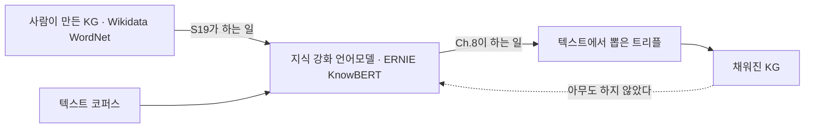

# S19-2 — 지식을 어디에 고정하는가

> **성격** — 부록. S19 본편([S19A ERNIE](S19A-ERNIE-엔티티-임베딩-직접-주입.md) ·
> [S19B KnowBERT](S19B-KnowBERT-엔티티-링커-내장.md))에서 갈라져 나온 해석이다. 슬라이드에
> 없는 내용이므로 본편과 구분한다. 용어와 식 풀이는
> [S19-1](S19-1-읽는-데-필요한-것들.md)에 있다.
>
> 📖 [강의 목차](README.md)

---

## 1. 무엇을 받아 무엇을 내놓는가

Ch.5까지 나온 것들과 이 회차의 두 모델은 다루는 재료가 겹쳐서 헷갈리기 쉽다. "무엇을 다루는가"가
아니라 **무엇을 만들어 내놓는가**로 세우면 자리가 갈린다.

| | 입력 | 산출물 | 그 산출물을 누가 쓰나 |
|---|---|---|---|
| KG 임베딩 (S13·S14) | KG 트리플 | 엔티티·관계 벡터 | 링크 예측기 |
| 온톨로지 임베딩 (S15) | OWL 공리 | 클래스 벡터 | 분류·포섭 판단 |
| 온톨로지 정렬 (S16) | 온톨로지 둘 | 클래스 매핑 표 | 사람 또는 통합 도구 |
| ERNIE · KnowBERT (S19) | 텍스트 + KG 엔티티 벡터 | **문장 속 토큰의 벡터** | downstream NLP 과제의 분류기 |

S19의 두 모델이 내놓는 것은 KG도 온톨로지도 아니고 **문장 표현**이다. KG는 그 표현을 만드는
재료로만 들어가고, 학습이 끝나면 밖으로 나오지 않는다. 이 점이 뒤에 나오는 한계 전부의 출발점이
된다.

### 화살표는 한 방향이다

이 회차가 쓰는 KG는 Wikidata, Wikipedia, WordNet이다. **사람이 만들어 둔 것이고 언어모델이
뽑아낸 것이 아니다.** 그래서 S19는 순환이 아니라 화살표 하나다.



강의 전체를 놓고 보면 다섯 단계로 나뉜다.

| | 무엇에서 무엇으로 | 어디 |
|---|---|---|
| ① | 사람이 Wikipedia·Wikidata·WordNet을 만든다 | 강의 밖 |
| ② | 그 KG로 BERT를 개선한다 | **S19** |
| ③ | 개선된 모델로 텍스트에서 트리플을 뽑는다 | Ch.8 (S28~S31) |
| ④ | 그 트리플로 KG를 채운다 | Ch.8 |
| ⑤ | 채워진 KG로 다시 ②를 한다 | 사례가 없다 |

②와 ③을 이으면 순환이 되지만 그 순환을 돈 연구는 이 회차에 없다. 두 가지가 막는다.

- **자기 출력을 다시 재료로 쓰게 된다.** ③에서 잘못 뽑힌 트리플이 ⑤에서 학습 데이터가 된다.
  Wikidata는 사람이 검증한 것이라 그 위험이 없었다
- **②라는 접근 자체가 오래가지 않았다.** 4절에서 볼 이유 때문에 흐름이 "지식을 파라미터에 굽지
  말고 추론할 때 KG를 검색해서 붙이자"로 넘어간다. ⑤를 시도할 동기가 사라진 것이다

### 과제 하나가 두 곳에 걸쳐 있다

혼동이 생기는 지점이 하나 더 있다. S19가 성능을 잰 과제 셋(엔티티 타입 분류, 관계 추출, 단어
의미 구분)은 **NLP 과제이면서 동시에 KG 구축의 부품**이다. 어느 쪽이냐가 아니라 어디까지
재느냐로 갈린다.

```
입력  "Mark Twain wrote The Million Pound Bank Note in 1893."
      head = Mark Twain, tail = The Million Pound Bank Note
출력  라벨 하나 → author                     ← S19는 여기까지 재고 F1로 채점한다
      ↓
      (Mark Twain, author, The Million Pound Bank Note)   트리플로 만든다
      Mark Twain → Q7245                                  기존 KG의 ID에 맞춘다
      author의 domain·range 검증                          스키마에 맞는지 본다
      저장소에 넣고 중복을 정리한다                        ← 여기부터가 S12의 구축 7 task
```

S19의 실험은 라벨 정확도까지만 본다. 트리플로 쌓는 단계는 이 회차에 없다. "관계 추출 성능이
올랐으니 KG를 더 잘 만들게 된다"는 말은 맞지만 **한 단계 건너서 맞는 말**이고, 그 단계를 S19가
보여주지는 않는다.

### 방향이 S16과 반대다

S16의 BERTMap은 언어모델을 써서 온톨로지를 고쳤다. S19는 온톨로지와 KG를 써서 언어모델을 고친다.
같은 두 재료를 놓고 목적어와 도구의 자리를 맞바꾼 것이다.

| | 도구 | 대상 |
|---|---|---|
| S16 BERTMap | BERT | 온톨로지 (매핑을 만든다) |
| S19 ERNIE·KnowBERT | KG | 언어모델 (표현을 고친다) |
| Ch.8 REBEL 등 | 언어모델 | KG (트리플을 만든다) |

## 2. 링커를 밖에 두느냐 안에 두느냐

강의가 마지막에 한 줄로 정리한 대비인데, 여기서 실제로 오가는 것이 무엇인지는 말하지 않는다.

**ERNIE의 선택** — TAGME 결과를 정답으로 받고 시작한다. 사전학습 코퍼스를 만들 때 한 번 돌려
붙여 두면 학습 중에는 링킹 계산이 아예 없다. 대신 TAGME가 틀린 곳은 계속 틀린 채로 학습된다.
dEA는 그 오류에 대한 대비책이지, 오류를 고치는 장치가 아니다. 5% 교체와 15% 마스킹으로 모델을
노이즈에 무디게 만들 뿐 TAGME가 붙인 라벨 자체는 검증되지 않는다.

**KnowBERT의 선택** — 후보 중에서 고르는 일을 학습으로 가져온다. 그 대가가 셋이다.

- 링커를 학습시킬 주석 데이터가 필요하다 (AIDA-CoNLL, SemCor)
- 학습 순서가 복잡해진다. 링커 먼저, 임베딩 고정, 그다음 BERT와 KAR
- 후보 목록을 만드는 일은 여전히 밖에 있다. 규칙 기반 후보 선택기가 놓친 엔티티는 학습된
  링커도 되찾지 못한다 (S19B 16절이 한계로 적는 첫 두 줄)

정리하면 KnowBERT가 모델 안으로 가져온 것은 entity linking 전체가 아니라 **disambiguation
한 단계**다. mention detection과 후보 나열은 두 모델 모두 바깥에 남겨 두었다. 강의의 "모델
내부에서 함께 학습"이라는 표현은 이 범위로 좁혀서 읽어야 한다.

### KAR가 들어가는 곳은 중간이 아니라 위쪽이다

슬라이드는 KAR를 "BERT의 중간 계층 사이에 삽입되는 모듈"이라고 소개한다. 원논문의 실제 값은
다르다.

| 모델 | 삽입 위치 |
|---|---|
| KnowBert-Wiki | 10층과 11층 사이 |
| KnowBert-WordNet | 10층과 11층 사이 |
| KnowBert-W+W | Wikipedia는 10–11층, WordNet은 11–12층 |

BERT_BASE가 12층이므로 10~11층은 중간이 아니라 **거의 꼭대기**다. 이 차이가 KAR의 성격을
바꾼다. 하위 층이 만드는 어휘·구문 표현은 건드리지 않고, 이미 문맥이 다 잡힌 상위 표현만
지식으로 보정하는 구조다. residual connection이 필요한 이유(S19-1 5절)도 여기서 더 분명해진다.
꼭대기에서 표현을 갈아엎으면 남은 한두 층으로는 회복할 방법이 없다.

논문이 삽입 순서를 아래에서 위로 잡은 이유도 적어 두었다. 새로 초기화된 KB 파라미터를 처리할 때
상위 층일수록 기울기가 커서 학습이 깨질 위험이 있고, 아래부터 붙이면 그 교란이 작다는 것이다.
S19B 16절이 한계로 든 "KB 삽입 위치와 순서에 따라 성능 차이"의 실체가 이 학습 안정성 문제다.

## 3. "지식이 정적"이라는 말의 정확한 범위

S19B 18절이 두 모델의 공통 한계로 든 첫 항목인데, 무엇이 고정되고 무엇이 움직이는지를 나누지
않는다. 나눠 보면 이렇다.

| | 사전학습 중 | KG가 바뀌었을 때 |
|---|---|---|
| entity embedding | 고정 | 다시 학습해야 반영된다 |
| 융합 파라미터 (Aggregator `W̃_e`, KAR의 `W^proj`) | 학습됨 | 그대로 |
| 링커 (KnowBERT) | 학습됨 | 그대로 |
| 토큰 표현 | 학습됨 | 그대로 |

고정된 것은 엔티티 벡터 하나뿐이고 나머지는 다 학습된다. 그런데 바로 그 하나가 KG의 내용을
나르는 유일한 통로라서, 그것이 낡으면 나머지가 아무리 잘 학습되어 있어도 낡은 사실을 잘 섞는
모델이 된다.

여기서 더 나가면 문제가 하나 더 보인다. **entity embedding을 새로 학습해 갈아 끼우는 것만으로는
부족하다.** TransE를 다시 돌리면 벡터 공간의 좌표계 자체가 달라진다. 그 공간에 맞춰 학습된
`W̃_e`가 새 좌표계에서 같은 의미를 갖는다는 보장이 없다. 결국 융합 쪽도 다시 학습해야 한다는
뜻인데, 슬라이드의 "추가 학습이 필요"라는 한 줄이 가리는 것이 이 규모다.

## 4. KG를 고쳐 쓰기 쉽다던 주장은 어디로 갔나

S19A 3절이 이 회차의 동기를 세운 자리다. 언어모델은 사실 하나를 골라 고칠 수 없고 KG는 트리플
하나만 바꾸면 된다는 대비였다. `(DSBA 연구실, 소속, 고려대학교)`를 `(DSBA 연구실, 소속,
서울대학교)`로 바꾸는 예까지 들었다.

그런데 그 KG를 언어모델 파라미터에 주입하고 나면, **주입된 쪽에서는 그 장점이 사라진다.** KG
파일의 트리플을 고쳐도 이미 학습된 ERNIE는 옛 사실을 계속 쓴다. 모델 안에서는 그 사실이 다시
"수많은 파라미터에 분산된" 상태가 되기 때문이다.

강의가 이걸 모르는 것은 아니고 18절에서 "최신성과 수정 가능성에는 한계"라고 적기는 한다. 다만
도입부의 동기와 결론의 한계가 정확히 같은 성질을 두고 반대로 말하고 있다는 점이 드러나 있지
않다. 이 회차를 한 문장으로 줄이면 **KG의 명시성을 얻으려고 시작했는데 주입하는 순간 명시성을
잃는다**가 된다. Ch.7 이후 GraphRAG 계열이 나오는 이유가 이 자리에 있고, 슬라이드 마지막 줄이
가리키는 방향도 그것이다.

## 5. dEA는 얼마나 어려운 문제인가

dEA의 후보 집합이 `m`, 곧 "현재 입력에 포함된 entity 후보의 수"다. Wikidata 500만 개가 아니라
그 문장에 등장한 엔티티 몇 개다. 사전학습 코퍼스가 "entity가 3개 미만인 문장은 제외"로
걸러졌으니(S19A 17절) 후보는 대개 3~10개 언저리일 것이다.

여기에 입력 구성 비율을 겹쳐 보면 과제의 난이도가 보인다.

| 비율 | 상황 | 모델이 실제로 하는 일 |
|---|---|---|
| 80% | 정답 엔티티가 입력에 그대로 들어 있다 | 융합된 표현에 이미 그 엔티티가 섞여 있다. 되읽으면 된다 |
| 15% | 마스킹 | 문맥으로 복원해야 한다. 후보 3~10개 중 고르기 |
| 5% | 다른 엔티티로 교체 | 입력을 무시하고 문맥만 믿어야 한다. 가장 어렵다 |

BERT의 MLM이 80/10/10을 쓰는 것과 비율은 닮았지만 성격이 다르다. MLM의 80%는 **가린 뒤** 맞히는
것이고, dEA의 80%는 **정답을 보여준 채** 맞히는 것이다. 그래서 dEA 손실의 대부분은 "입력에 있는
것을 표현에 잘 반영했는가"를 재는 데 쓰인다. 슬라이드도 80% 항목의 목적을 "올바른 entity 정보를
token 표현에 적극적으로 반영하도록 학습"이라고 적어 이 점을 인정하고 있다.

곧 dEA는 이름과 달리 노이즈 복원(20%)보다 **정보 전달 경로를 뚫는 일(80%)**에 무게가 실린
목표다. Ablation에서 dEA를 빼면 성능이 떨어지는데(88.32 → 85.62), 이 낙폭이 노이즈 내성에서
온 것인지 전달 경로에서 온 것인지는 표가 갈라 주지 않는다.

## 6. 두 논문이 같은 표에서 만나는 지점

강의는 ERNIE와 KnowBERT를 따로 소개하고 마지막에 말로만 비교한다. 그런데 KnowBERT 쪽 실험 표에
ERNIE가 이미 들어와 있다.

**Open Entity (S19B Table 7 ↔ S19A Table 3)** — 두 표의 ERNIE 행이 소수점까지 같다.

| | P | R | F1 |
|---|---|---|---|
| S19A Table 3의 ERNIE | 78.42 | 72.90 | 75.56 |
| S19B Table 7의 ERNIE | 78.4 | 72.9 | 75.6 |
| S19B Table 7의 KnowBert-W+W | 78.6 | 73.7 | **76.1** |

KnowBERT가 ERNIE의 발표값을 그대로 가져와 자기 행 위에 올린 것이다. **이 회차에서 두 모델이
같은 조건으로 맞붙은 유일한 숫자이고, 차이는 F1 0.5다.** 강의의 "BERT와 ERNIE보다 전반적으로
향상"이라는 문장이 서 있는 근거가 사실상 이 한 줄이다.

**TACRED (S19B Table 4)** — `Zhang et al. (2019) · BERT_BASE · 70.0 / 66.1 / 68.0` 행이 있다.
**이 행이 ERNIE다.** KnowBERT 논문 본문이 "ERNIE (Zhang et al. 2019) uses TAGME to link entities
to Wikidata, retrieves the associated entity embeddings, and fuses them into BERT_BASE"라고 적어
같은 인용을 쓴다. ERNIE 자체 발표값 67.97(S19A Table 5)이 반올림되어 68.0으로 실렸다.

그러면 TACRED에서 KnowBert-W+W 71.5와의 차이가 3.5다. Open Entity의 0.5보다 훨씬 크다. 슬라이드가
저자명으로만 적어 두어 표만 봐서는 두 모델이 여기서도 맞붙었다는 사실이 드러나지 않는다.

## 7. 실험이 말하지 않는 것

**GLUE의 "손상되지 않음"은 항목마다 다르다.** S19A 20절이 "전반적으로 비슷"이라고 요약하는데
항목별로 보면 갈린다.

| 항목 | BERT_BASE | ERNIE | 차이 |
|---|---|---|---|
| MNLI-m | 84.6 | 84.0 | −0.6 |
| STS-B | 85.8 | 83.2 | **−2.6** |
| MRPC | 88.9 | 88.2 | −0.7 |
| CoLA | 52.1 | 52.3 | +0.2 |
| RTE | 66.4 | 68.8 | +2.4 |
| QNLI | — | 91.3 | 비교 불가 |

STS-B 2.6점 하락은 FewRel 개선폭 3.43과 비슷한 크기다. 문장 유사도는 지식보다 표면적·구문적
정보에 기대는 과제라, 지식 주입이 그쪽 표현을 밀어냈을 가능성이 있다. 강의의 "손상되지 않음"은
평균을 두고 한 말이고 항목 단위로는 성립하지 않는다. QNLI는 BERT_BASE 값이 표에 없어 비교
자체가 안 된다.

**SemEval에서는 KnowBERT가 진다.** S19B Table 5에서 KnowBert-W+W 89.1이 Soares et al.의
BERT_LARGE+MTB 89.5보다 낮다. 슬라이드의 "전반적으로 향상"에 이 행은 들어가지 않는다. 다만
백본이 BERT_BASE 대 BERT_LARGE라 애초에 대등한 비교가 아니고, MTB는 관계 추출 전용 사전학습이라
이 과제에 특화된 상대다.

**ERNIE ablation은 사전학습이 아니라 파인튜닝 단계의 실험이다.** 원논문이 "w/o entities and
w/o dEA refer to fine-tuning ERNIE without entity sequence input and the pre-training task dEA
respectively"라고 적는다. 곧 사전학습은 그대로 끝낸 모델을 두고 **파인튜닝 조건만 바꿔** 잰
값이다.

이 사실이 슬라이드의 결론을 조금 흔든다. "entity input만 있어도 제한적 효과, dEA만 있어도 제한적
효과"라는 문장은 **사전학습에서 하나씩 빼고 다시 학습시킨 결과**로 읽히는데 실제로는 그렇지
않다. 88.32에서 85.79로 떨어진 값은 "엔티티 없이 사전학습한 ERNIE"가 아니라 "엔티티를 넣어
사전학습해 놓고 파인튜닝에서만 뺀 ERNIE"의 점수다. 사전학습에 들인 비용을 다시 치르지 않으려는
선택으로 보이지만, 그렇다면 이 표는 **지식 주입이 사전학습 표현에 남긴 효과**가 아니라 **추론
시점에 엔티티 입력이 있고 없고의 차이**를 재고 있다.

## 8. 실무 KG에 옮길 때 먼저 막히는 것

제조 암묵지 온톨로지 쪽으로 이 두 모델을 가져온다고 하면, 성능 이전에 **입력이 서지 않는다.**

- **ERNIE 경로는 열려 있지 않다.** TAGME는 Wikipedia 엔티티를 붙이는 도구다. 사내 설비·공정
  식별자를 붙여 주지 않는다. 같은 자리를 채우려면 우리 KG를 대상으로 하는 링커를 따로 만들어야
  하는데, 그 링커를 만드는 것이 사실상 이 과제의 본체다
- **KnowBERT 경로는 주석 데이터를 요구한다.** AIDA-CoNLL에 해당하는 것, 곧 현장 문서의 mention에
  사내 엔티티를 붙인 데이터가 있어야 링커를 학습시킬 수 있다
- **후보 선택기의 사전확률이 없다.** CrossWikis는 웹 앵커 텍스트 통계다. 사내 용어에는 그런 통계가
  존재하지 않고, 만들려면 문서 코퍼스에서 직접 세어야 한다

S19B 18절의 "온톨로지와 지식그래프의 정확성·일관성·범위가 모델 성능의 상한을 결정한다"는 문장을
이 조건들과 함께 읽으면, 상한을 정하는 것이 KG의 품질만이 아니라 **KG와 텍스트를 잇는 링커의
품질**이라는 점이 드러난다. S12-1에서 다룬 선언과 준수의 간극이 여기서는 텍스트와 KG 사이의
간극으로 다시 나타난다.

거꾸로 보면 우리 쪽에 유리한 조건도 하나 있다. 사내 도메인은 엔티티 수가 웹 규모보다 훨씬 작고
동음이의가 적다. Prince가 음악가인지 자동차 회사인지 같은 문제가 잘 생기지 않는다. 링커를 만드는
비용은 크지만 disambiguation 자체는 쉬운 문제일 가능성이 있다.

## 9. 원논문에서 확인한 것들

자료만으로 닫히지 않은 것 여섯 개를 원논문(ERNIE [arXiv:1905.07129](https://arxiv.org/abs/1905.07129),
KnowBERT [arXiv:1909.04164](https://arxiv.org/abs/1909.04164))에서 찾아봤다. 여섯 다 답이 나왔다.

| 걸렸던 것 | 확인 결과 | 어디에 반영했나 |
|---|---|---|
| S19B Table 4의 `Zhang et al. (2019)` | ERNIE가 맞다. KnowBERT 본문이 같은 인용으로 ERNIE를 설명한다 | 6절 |
| ERNIE ablation `w/o entities` | 사전학습이 아니라 **파인튜닝** 단계의 ablation이다 | 7절 |
| S19A 12절의 `b̃^(i)` | 그냥 bias 벡터다. 슬라이드가 붙인 "합쳐진 중간 표현"은 논문에서 `h_j`("inner hidden state integrating the information of both the token and the entity")의 설명이다 | 아래 |
| S19B 14절 AIDA 수치 | KnowBert-Wiki 80.2 / 74.4, KnowBert-W+W 82.1 / 73.7 (AIDA-A / AIDA-B). 전용 모델 Kolitsas et al.(2018)은 86.6 / 82.6 | 아래 |
| dEA 후보 집합 `m` | 입력 시퀀스의 엔티티 시퀀스 길이다. 논문이 "only require the system to predict entities based on the given entity sequence instead of all entities in KGs"라고 적는다 | 5절 전제가 확인됐다 |
| KnowBERT의 KB 삽입 계층 | 10~11층(W+W는 WordNet이 11~12층). 중간이 아니라 위쪽이다 | 2절 |

**`b̃` 오설명은 라벨이 한 칸 밀린 것이다.** 논문에서 `h_j`에 붙은 설명이 슬라이드에서 `b̃`
자리로 갔다. 식 자체는 논문과 같으므로 본편 12절의 식은 손대지 않아도 된다.

**AIDA에서의 격차는 "경쟁력 있다"보다 크다.** 슬라이드는 표 없이 "경쟁력 있는 성능을 보이지만
전용 최신 모델보다는 낮음"이라고만 적는데, 실제로는 AIDA-A에서 4.5점, AIDA-B에서 8.9점 뒤진다.
KnowBERT 쪽 해석("linking만을 위해 학습된 것이 아니다")이 변명으로만 들리지 않으려면 이 폭을
같이 봐야 한다. 링킹을 모델 안으로 들여온 대가가 링킹 정확도 자체에서 나온 셈이고, 2절에서 본
"disambiguation 한 단계만 가져왔다"는 범위 제한과 함께 읽으면 그림이 맞아떨어진다.

**Ch.5에서 넘어온 항목 하나가 여기서 닫혔다.** S13-1 9절에 "ERNIE 융합 블록"을 확인 대상으로
적어 두었는데, S19A 12절의 식 세 개와 위의 `b̃` 확인으로 정리됐다.

---

## 관련 문서

- [S19A — ERNIE](S19A-ERNIE-엔티티-임베딩-직접-주입.md) · [S19B — KnowBERT](S19B-KnowBERT-엔티티-링커-내장.md) — 본편
- [S19-1 — 읽는 데 필요한 것들](S19-1-읽는-데-필요한-것들.md) — 용어와 식
- [S16-2 — 정렬이 서는 자리](S16-2-정렬이-서는-자리.md) — 언어모델로 온톨로지를 고치는 반대 방향
- [S13-1 — 기호와 좌표 사이](S13-1-기호와-좌표-사이.md) — ERNIE 융합 블록을 확인 대상으로 남겼던 곳
- [S12-1 — 선언과 준수 사이](S12-1-선언과-준수-사이.md) — 선언된 것과 실제 데이터의 간극
- [00 — 전체 파이프라인](00-전체-파이프라인.md) — 지식 주입이 붙는 자리
