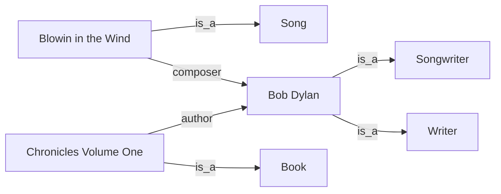
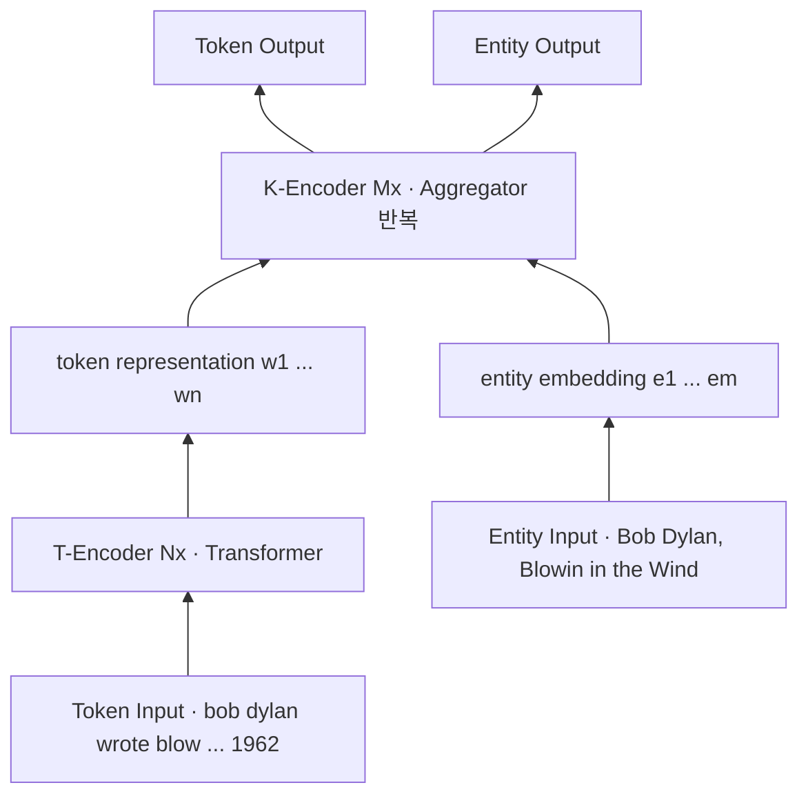
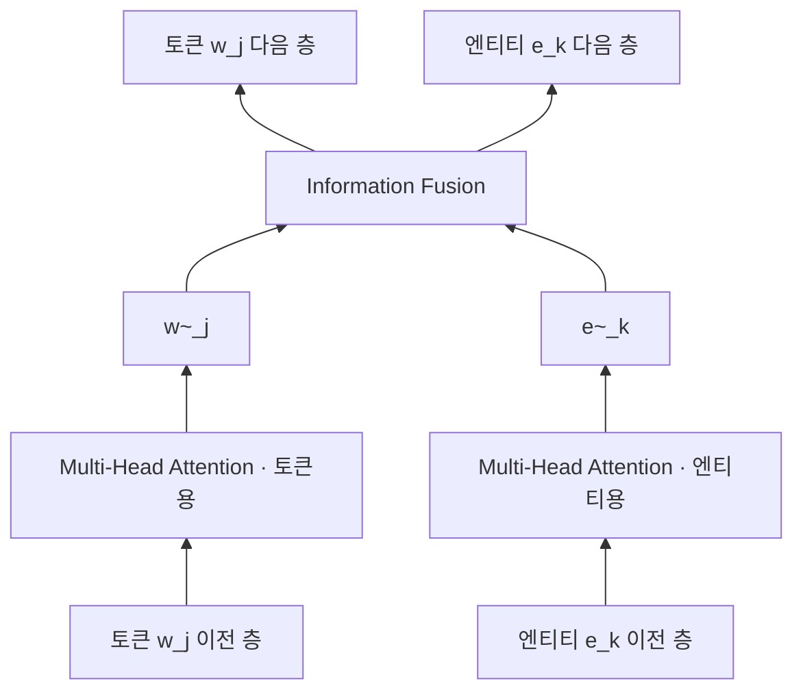

# S19A — ERNIE: 엔티티 임베딩을 사전학습에 직접 넣기

> Ch.6 언어모델+KG · Day 10
> 원자료: DSBA Lab Study 강의 슬라이드 중 `01 Introduction` · `02 ERNIE`
> 참고 논문
> · Zhang, Han, Liu, Jiang, Sun, Liu (2019), _ERNIE: Enhanced Language Representation with
>   Informative Entities_, ACL 2019 ([arXiv:1905.07129](https://arxiv.org/abs/1905.07129))
> · 코드 [thunlp/ERNIE](https://github.com/thunlp/ERNIE)
>
> 📖 [강의 목차](README.md) · [YouTube 재생목록](https://www.youtube.com/watch?v=f0WV7b3lGqM&list=PLFHGWfB_kmrs)
> 이전 [S18B BERTMap 파이프라인](S18B-BERTMap-파이프라인.md) · 다음 [S19B KnowBERT](S19B-KnowBERT-엔티티-링커-내장.md)
> 📎 부록 [S19-1 읽는 데 필요한 것들](S19-1-읽는-데-필요한-것들.md) · [S19-2 지식을 어디에 고정하는가](S19-2-지식을-어디에-고정하는가.md)

**한 회차를 두 문서로 나눴다.** 이 문서가 도입부와 ERNIE를, S19B가 KnowBERT와 회차 결론을
다룬다. 절 번호는 문서마다 1부터 다시 시작한다.

**이 문서는 슬라이드 내용만 담는다.** 이해를 돕는 배경 설명은 [S19-1](S19-1-읽는-데-필요한-것들.md)에,
강의 밖 해석은 [S19-2](S19-2-지식을-어디에-고정하는가.md)에 있다.

> 이름이 같은 다른 모델이 있다. 여기서 다루는 ERNIE는 THU/Huawei의 ACL 2019 논문이고,
> Baidu가 같은 해 낸 ERNIE(knowledge masking 방식)는 별개다.

---

## 1. 사전학습 언어모델의 강점과 한계

강점

- ELMo, GPT, BERT는 대규모 비정형 텍스트에서 언어 패턴을 학습한다
- 문맥·어휘·구문 정보를 반영한 표현을 만든다
- 다양한 downstream task에 재사용할 수 있다

한계

- 문장 속 표현을 현실 세계의 특정 엔티티와 명시적으로 연결하지 못한다
- 엔티티에 관한 구체적인 사실을 안정적으로 기억하기 어렵다

슬라이드는 GPT-1의 디코더 구조와 BERT의 pre-training / fine-tuning 그림을 나란히 놓고,
둘 다 입력이 토큰뿐이라는 점을 보여준다.

## 2. 지식그래프

지식그래프란

- 현실 세계의 사람·기관·장소·작품 등을 엔티티로 표현한다
- 엔티티 사이의 관계를 트리플로 저장한다 — `(DA VINCI, painted, MONA LISA)`
- 여러 엔티티와 관계가 연결되어 그래프 구조를 이룬다

지식그래프가 제공하는 것

- 엔티티와 관계로 정리된 명시적 지식
- 텍스트에 드물게 등장하는 사실과 배경지식
- 문장의 표현을 실제 엔티티에 연결하는 기준점

## 3. 언어모델과 지식그래프는 지식을 다르게 담는다

언어모델의 지식은 사전학습 데이터에서 학습되어 수많은 파라미터에 분산되어 있다.

- 모델 내부에 `DSBA → 소속 → 고려대학교`라는 한 줄짜리 정보가 따로 저장되지 않는다
- 어느 파라미터가 그 사실을 담당하는지 특정하기 어려워, 사실 하나만 골라 수정하기가 어렵다

지식그래프의 지식은 엔티티와 관계로 명시적으로 저장된다.

- 기존 `(DSBA 연구실, 소속, 고려대학교)`
- 변경 `(DSBA 연구실, 소속, 서울대학교)`
- 현실의 사실이 바뀌면 해당 트리플이나 유효 기간을 직접 고칠 수 있다

슬라이드가 하단 박스로 정리한다. 지식그래프는 어떤 사실이 저장되어 있는지 확인하고 수정하기
쉽다. 반면 언어모델은 이전 사실과 새로운 사실이 파라미터 안에서 충돌하거나 함께 남을 수 있다.

## 4. 결합했을 때 무엇이 달라지는가

논문이 쓰는 예문이 둘이다.

```
Bob Dylan wrote Blowin' in the Wind in 1962.
Bob Dylan wrote Chronicles: Volume One in 2004.
```

엔티티를 모르는 모델에게는 두 문장이 이렇게 보인다.

```
UNKNOWN wrote UNKNOWN in UNKNOWN
```

지식그래프를 결합하면 `Blowin' in the Wind`가 노래, `Chronicles: Volume One`이 책이라는 정보가
붙는다. 노래를 쓴 것은 작곡, 책을 쓴 것은 저술이므로 Bob Dylan이 작곡가이자 작가라는 결론에
닿는다.



## 5. 기존 지식 활용 방식의 한계

**Task-specific 구조**

- 관계 추출, 독해, 자연어 추론 등 특정 과제를 푸는 모델에 지식베이스 모듈을 따로 붙이는 방식이다
- 해당 과제에서는 성능이 좋아질 수 있지만, 과제가 바뀌면 구조와 학습 방식을 다시 설계해야 한다
- 지식이 모델의 범용 언어 표현에 들어간 것이 아니라 특정 문제를 푸는 과정에서만 쓰인다

**Entity-aware 언어모델**

- 생성 언어모델 안에서 단어뿐 아니라 엔티티도 함께 예측하거나 추적하는 방식이다
- 어떤 엔티티를 가리키는지가 숨은 변수인 경우가 많다. 학습하려면 엔티티가 완전히 주석된
  데이터가 필요하거나, 가능한 엔티티를 모두 고려하는 marginalization이 필요했다
  - marginalization은 정답 엔티티가 직접 주어지지 않았을 때 가능한 모든 엔티티 후보를 고려해
    확률을 합산하는 계산이다
- 그래서 대규모 raw text를 활용한 사전학습으로 확장하기 어려웠다

슬라이드가 하단 박스로 두 논문의 공통 목표를 적는다. 사전학습 단계에서 지식을 반영한 범용적인
언어 representation을 만들자.

## 6. 지식 주입의 두 가지 난제

**1. Structured Knowledge Encoding** — 관련된 지식그래프 사실을 어떻게 골라 인코딩할까

- 문장에서 엔티티 mention을 찾아야 한다
- 찾은 mention을 지식그래프 엔티티와 연결해야 한다
- 지식그래프에 개체와 관계 형태로 정리되어 있는 사실(`개체1 -- 관계 -- 개체2`)을 모델이 쓸 수
  있는 벡터로 바꿔야 한다

**2. Heterogeneous Information Fusion** — 두 표현이 서로 다른 공간에서 학습됨

- 텍스트 임베딩과 지식그래프 임베딩은 서로 다른 방식으로 학습된다
- 두 정보를 하나의 표현 공간에서 섞는 구조가 필요하다

## 7. 두 논문의 접근 방식

**ERNIE**

- TAGME로 문장의 mention을 Wikidata 엔티티와 미리 연결한다
- TransE로 만든 엔티티 벡터를 사용한다
- Aggregator가 토큰 표현과 엔티티 표현을 결합한다
- dEA로 잘못되거나 가려진 엔티티 연결을 복원하도록 학습한다

**KnowBERT**

- 후보 선택기가 mention과 엔티티 후보를 생성한다
- 학습 가능한 entity linker가 문맥에 맞는 엔티티를 고른다
- KAR가 선택된 엔티티 지식을 mention span에 결합한다
- word-to-entity-span attention으로 지식을 문장 전체에 전달한다

슬라이드가 한 줄로 대비를 적는다. ERNIE는 외부 도구로 연결된 엔티티를 받아 결합하고, KnowBERT는
엔티티 선택부터 지식 주입까지 모델 내부에서 함께 학습한다.

KnowBERT는 [S19B](S19B-KnowBERT-엔티티-링커-내장.md)에서 다룬다.

## 8. ERNIE 전체 모델 구조

```
ERNIE = T-Encoder + K-Encoder
```

T-Encoder가 문장을 먼저 이해하고, K-Encoder가 이 단어가 실제로 어떤 entity인지를 반영해
representation을 보정한다.



- **T-Encoder** — 문맥·어휘·구문 정보를 추출한다. BERT와 같은 Transformer 구조이고, token의
  어휘, 문법·구문, 문맥 정보를 학습한다
- **K-Encoder** — token representation과 entity representation을 결합한다. entity embedding을
  받아 token representation과 융합하며, 여러 개의 Aggregator로 구성된다

## 9. 입력 표현과 Entity Alignment

**Token sequence** — 문장의 단어(subword) `{w_1, ..., w_n}`

문장은 BERT의 subword 단위 token으로 분해된다.

```
"Bob Dylan wrote Blowin' in the Wind in 1962"
→ [CLS] bob dylan wrote blow ##in ' in the wind in 1962 [SEP]
```

**Entity sequence** — 문장 속 엔티티와 연결된 그래프 엔티티 `{e_1, ..., e_m}`

- Bob Dylan
- Blowin' in the Wind

**Alignment 방식**

- Entity mention이 여러 token으로 구성되면 첫 번째 token에 entity를 연결한다
  - `Bob Dylan` → `bob` token 위치에 Bob Dylan entity 연결
  - `Blowin' in the Wind` → `blow` token 위치에 해당 song entity 연결
- 모든 token이 entity와 연결되지는 않는다. entity가 연결된 token만 지식그래프 정보를 직접 받는다

## 10. T-Encoder: 텍스트 정보 인코딩

역할은 문장의 기본 언어 정보를 학습하는 것이다.

**Input**

```
w_j = TokenEmb_j + SegmentEmb_j + PositionEmb_j
```

| | 무엇을 나타내나 |
|---|---|
| Token embedding | 어떤 토큰인지. 예로 Bob, Dylan, wrote |
| Segment embedding | 해당 토큰이 첫 번째 문장인지 두 번째 문장인지 |
| Position embedding | 문장 안에서 몇 번째 토큰인지 |

**처리 방식** — BERT와 동일한 multi-layer bidirectional Transformer를 쓴다.

**출력**

```
{w_1, ..., w_n} = T-Encoder({w_1, ..., w_n})
```

각 token에 대한 contextual representation이다.

## 11. K-Encoder: 텍스트 표현과 엔티티 지식 통합

역할은 T-Encoder가 만든 token representation에 지식그래프의 엔티티 정보를 결합하는 것이다.

**Input**

- T-Encoder의 token representation — 문장 전체의 어휘·구문·문맥 정보가 반영된 각 토큰의 벡터
  `{w_1, ..., w_n}`
- TransE로 학습된 entity embedding — Wikidata에서 해당 엔티티가 다른 엔티티와 맺는 관계 구조가
  반영된 벡터 `{e_1, ..., e_m}`

**구조** — 여러 개의 Aggregator를 쌓았고, 각 Aggregator에서 token 정보와 entity 정보를 함께
업데이트한다.

**핵심 효과**

```
{w^o_1, ..., w^o_n}, {e^o_1, ..., e^o_m} = K-Encoder({w_1, ..., w_n}, {e_1, ..., e_m})
```

- Token representation이 지식그래프 entity 의미를 반영한다
- Entity representation도 문맥 정보를 반영한다

## 12. Aggregator와 Information Fusion

**Aggregator 내부** — 세 단계다.

1. Token sequence에 대해 multi-head attention 적용

   ```
   {w̃^(i)_1, ..., w̃^(i)_n} = MH-ATT({w^(i-1)_1, ..., w^(i-1)_n})
   ```

2. Entity sequence에 대해 별도의 multi-head attention 적용

   ```
   {ẽ^(i)_1, ..., ẽ^(i)_m} = MH-ATT({e^(i-1)_1, ..., e^(i-1)_m})
   ```

3. 서로 정렬된 token–entity 정보를 information fusion layer에서 결합



**Entity가 있는 Token의 Information Fusion**

① 토큰과 엔티티 결합

```
h_j = σ(W̃^(i)_t w̃^(i)_j + W̃^(i)_e ẽ^(i)_k + b̃^(i))
```

- `w̃^(i)_j` — self-attention을 거친 토큰 표현
- `ẽ^(i)_k` — self-attention을 거친 연결 엔티티 표현

> 슬라이드는 `b̃^(i)`를 "토큰과 엔티티 정보가 합쳐진 중간 표현"이라고 적었다. 식에서 그
> 자리는 bias 항이고, 합쳐진 중간 표현에 해당하는 것은 `h_j`다. 원표기를 그대로 남겨둔다.

② 결합된 정보로 토큰 갱신 — 토큰 표현에 지식그래프 엔티티 정보가 반영된다

```
w^(i)_j = σ(W^(i)_t h_j + b^(i)_t)
```

③ 결합된 정보로 엔티티 갱신 — 엔티티 표현에 현재 문장의 문맥 정보가 반영된다

```
e^(i)_k = σ(W^(i)_e h_j + b^(i)_e)
```

**Entity가 없는 Token의 Information Fusion**

① 토큰 정보만 사용

```
h_j = σ(W̃^(i)_t w̃^(i)_j + b̃^(i))
```

② 토큰만 갱신

```
w^(i)_j = σ(W^(i)_t h_j + b^(i)_t)
```

슬라이드 하단 메모. `Blowin' in the Wind` token은 문맥 정보뿐 아니라 지식그래프에서 song
entity라는 정보를 받는다. relation classification에서 composer 관계를 더 잘 예측할 수 있다.

## 13. Knowledge Injection Pre-training: dEA

dEA(denoising Entity Auto-encoder)는 손상된 token–entity alignment를 복원하는 학습 목표다.

**목적** — token과 entity의 연결이 일부 손상되어도 문맥과 지식 정보를 활용해 올바른 entity를
복원하도록 학습한다.

**왜 필요한가**

- 자동 entity linking에는 오류가 있다
- entity가 잘못 연결되거나 누락될 수 있다
- 모델이 이런 노이즈에 강해지도록 훈련한다

**학습 방식**

- 일부 entity alignment를 mask하거나 교체한다
- 모델이 올바른 entity를 예측한다

## 14. dEA 입력 구성

예문은 `Mark Twain wrote The Million Pound Bank Note in 1893.`이고, 정답 entity는 모두
`The Million Pound Bank Note`다.

| 비율 | 무엇을 하나 | 입력 entity | 모델이 해야 할 일 |
|---|---|---|---|
| 5% | 올바른 entity를 임의의 다른 entity로 교체 | 임의의 다른 작품 entity | 잘못 들어온 entity를 그대로 믿지 않고 문맥을 보고 원래 정답을 찾는다 |
| 15% | entity masking | `[MASK]` 또는 빈 연결 | Mark Twain, wrote, 1893 같은 문맥으로 사라진 entity를 복원한다 |
| 80% | 올바른 entity를 유지 | The Million Pound Bank Note | 올바른 entity 정보를 token 표현에 적극적으로 반영한다 |

**예측 식**

```
p(e_j | w_i) = exp(linear(w^o_i) · e_j) / Σ_{k=1}^{m} exp(linear(w^o_i) · e_k)
```

| 기호 | 무엇인가 |
|---|---|
| `w_i` | entity mention과 연결된 token |
| `w^o_i` | ERNIE의 K-Encoder까지 거친 최종 token 표현 |
| `e_j` | 후보 entity의 embedding |
| `m` | 현재 입력에 포함된 entity 후보의 수 |

현재 token `w_i`에 연결되어야 할 entity가 후보 `e_j`일 확률을 묻는 식이다.

슬라이드가 든 예. `The Million Pound Bank Note`의 첫 token을 `w_i`로 두고 이 entity 연결을
가렸다고 가정한다.

| 후보 | 확률 |
|---|---|
| The Million Pound Bank Note | 0.72 |
| The Adventures of Tom Sawyer | 0.18 |
| Bob Dylan | 0.03 |
| Blowin' in the Wind | 0.07 |

정답이 The Million Pound Bank Note이므로 학습에서는 이 정답의 확률이 높아지도록 cross-entropy
loss를 계산하고 모델을 업데이트한다.

후보 집합이 전체 Wikidata가 아니라 **현재 입력에 포함된 entity**로 한정된다는 점이 식의 `m`에
드러난다.

## 15. 전체 Pre-training Objective

ERNIE의 학습 목표는 셋이다.

| 목표 | 무엇을 예측하나 |
|---|---|
| MLM (Masked Language Model) | 가려진 token |
| NSP (Next Sentence Prediction) | 두 문장의 연결 여부 |
| dEA (denoising Entity Auto-encoder) | 손상된 token–entity alignment |

단어의 문맥적 의미뿐 아니라 연결된 엔티티의 의미와 지식그래프 구조가 반영된 언어
representation을 학습한다.

```
전체 loss = MLM loss + NSP loss + dEA loss
```

## 16. Fine-tuning 방식

예문 `Mark Twain wrote The Million Pound Bank Note in 1893.`으로 세 가지를 보여준다.

**일반 NLP task** — BERT처럼 `[CLS]` token representation을 사용한다.

```
[CLS] [ ] mark twain [ ] wrote [ ] the million pound bank note [ ] in 1893 . [SEP]
```

**Entity Typing** — entity mention 앞뒤에 `[ENT]` token을 추가한다. 모델이 어떤 entity의 type을
예측해야 하는지 알게 한다.

```
[CLS] [ENT] mark twain [ENT] wrote [ ] the million pound bank note [ ] in 1893 . [SEP]
```

**Relation Classification** — head entity 앞뒤에 `[HD]`, tail entity 앞뒤에 `[TL]`을 붙인다.
두 entity의 역할을 명확히 표시한다.

```
[CLS] [HD] mark twain [HD] wrote [TL] the million pound bank note [TL] in 1893 . [SEP]
```

## 17. Pre-training 데이터와 설정

| | |
|---|---|
| Corpus | English Wikipedia |
| Knowledge Graph | Wikidata |
| 데이터 규모 | 약 4.5B subwords · 약 140M entities · entity가 3개 미만인 문장은 제외 |
| KG embedding | Wikidata 일부 사용 · 약 5.04M entities · 약 24.27M triples · TransE로 entity embedding 학습 |
| 모델 설정 | T-Encoder 6 layers · K-Encoder 6 layers · token hidden size 768 · entity hidden size 100 · 총 약 114M parameters |

## 18. Entity Typing 실험

**Task** — 문장 속 엔티티 mention과 주변 문맥을 보고 엔티티 유형을 예측한다.

**Dataset** — FIGER, Open Entity

**결과** — FIGER에서 ERNIE가 BERT보다 strict accuracy, macro, micro 모두 개선했다. Open
Entity에서도 precision, recall, F1 모두 개선했다.

| Model | Acc. | Macro | Micro |
|---|---|---|---|
| NFGEC (Attentive) | 54.53 | 74.76 | 71.58 |
| NFGEC (LSTM) | 55.60 | 75.15 | 71.73 |
| BERT | 52.04 | 75.16 | 71.63 |
| ERNIE | **57.19** | **76.51** | **73.39** |

*Table 2: Results of various models on FIGER (%).*

| Model | P | R | F1 |
|---|---|---|---|
| NFGEC (LSTM) | 68.80 | 53.30 | 60.10 |
| UFET | 77.40 | 60.60 | 68.00 |
| BERT | 76.37 | 70.96 | 73.56 |
| ERNIE | **78.42** | **72.90** | **75.56** |

*Table 3: Results of various models on Open Entity (%).*

## 19. Relation Classification 실험

**Task** — 문장 속 두 엔티티 사이의 관계를 분류한다.

**Dataset** — FewRel, TACRED

**결과** — FewRel F1은 BERT 84.89에서 ERNIE 88.32로, TACRED F1은 BERT 66.00에서 ERNIE 67.97로
올랐다.

| Model | FewRel P | FewRel R | FewRel F1 | TACRED P | TACRED R | TACRED F1 |
|---|---|---|---|---|---|---|
| CNN | 69.51 | 69.64 | 69.35 | 70.30 | 54.20 | 61.20 |
| PA-LSTM | - | - | - | 65.70 | 64.50 | 65.10 |
| C-GCN | - | - | - | 69.90 | 63.30 | 66.40 |
| BERT | 85.05 | 85.11 | 84.89 | 67.23 | 64.81 | 66.00 |
| ERNIE | 88.49 | 88.44 | **88.32** | 69.97 | 66.08 | **67.97** |

*Table 5: Results of various models on FewRel and TACRED (%).*

## 20. GLUE

**결과**

- ERNIE는 BERT_BASE와 전반적으로 비슷한 성능이다
- 지식 정보를 추가해도 일반 언어 이해 능력은 손상되지 않는다

| Model | MNLI-(m/mm) 392k | QQP 363k | QNLI 104k | SST-2 67k |
|---|---|---|---|---|
| BERT_BASE | 84.6/83.4 | 71.2 | - | 93.5 |
| ERNIE | 84.0/83.2 | 71.2 | 91.3 | 93.5 |

| Model | CoLA 8.5k | STS-B 5.7k | MRPC 3.5k | RTE 2.5k |
|---|---|---|---|---|
| BERT_BASE | 52.1 | 85.8 | 88.9 | 66.4 |
| ERNIE | 52.3 | 83.2 | 88.2 | 68.8 |

*Table 6: Results of BERT and ERNIE on different tasks of GLUE (%).*

## 21. Ablation Study

**결과**

- entity input만 있어도 제한적 효과가 있다
- dEA만 있어도 제한적 효과가 있다
- 가장 큰 성능 향상은 entity input과 dEA를 함께 사용할 때 나온다

| Model | P | R | F1 |
|---|---|---|---|
| BERT | 85.05 | 85.11 | 84.89 |
| ERNIE | 88.49 | 88.44 | **88.32** |
| w/o entities | 85.89 | 85.89 | 85.79 |
| w/o dEA | 85.85 | 85.75 | 85.62 |

*Table 7: Ablation study on FewRel (%).*

## 22. 결론 및 향후 연구

**결론**

- ERNIE는 텍스트와 지식그래프를 함께 학습하는 지식 강화 언어모델이다
- entity typing, relation classification에서 BERT보다 우수하다
- 일반 NLP 성능은 유지된다

**향후 연구**

- ELMo 같은 feature-based 모델에도 지식을 주입한다
- Wikidata 외에 ConceptNet 같은 다양한 지식을 활용한다
- 더 큰 pre-training corpus를 구축한다

---

## 관련 문서

- [S19B — KnowBERT](S19B-KnowBERT-엔티티-링커-내장.md) — 같은 회차의 뒷부분
- [S13 — KG 임베딩 기초](S13-KG-임베딩-기초.md) — entity embedding을 만든 TransE
- [S16B — BERTMap](S16B-BERTMap-문맥-임베딩-기반-정렬.md) — BERT를 온톨로지 정렬에 쓴 사례
- [S12 — KG 구축에서 온톨로지의 역할](S12-KG-구축에서-온톨로지의-역할.md) — 입력이 되는 Wikidata의 품질
- [00 — 전체 파이프라인](00-전체-파이프라인.md) — 언어모델과 KG가 만나는 자리
