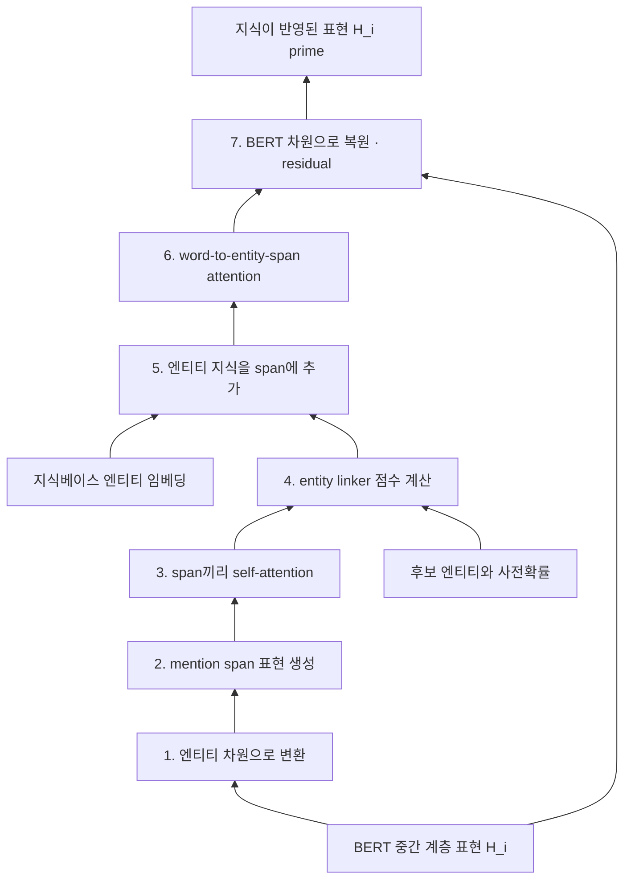

# S19B — KnowBERT: 엔티티 링커를 BERT 안에 넣기

> Ch.6 언어모델+KG · Day 10
> 원자료: DSBA Lab Study 강의 슬라이드 중 `03 KnowBERT` · `04 Comparison & Conclusion`
> 참고 논문
> · Peters, Neumann, Logan, Schwartz, Joshi, Singh, Smith (2019), _Knowledge Enhanced
>   Contextual Word Representations_, EMNLP 2019
>   ([arXiv:1909.04164](https://arxiv.org/abs/1909.04164))
> · 코드 [allenai/kb](https://github.com/allenai/kb)
>
> 📖 [강의 목차](README.md) · [YouTube 재생목록](https://www.youtube.com/watch?v=f0WV7b3lGqM&list=PLFHGWfB_kmrs)
> 이전 [S19A ERNIE](S19A-ERNIE-엔티티-임베딩-직접-주입.md) · 다음 S20 K-BERT · KEPLER
> 📎 부록 [S19-1 읽는 데 필요한 것들](S19-1-읽는-데-필요한-것들.md) · [S19-2 지식을 어디에 고정하는가](S19-2-지식을-어디에-고정하는가.md)

**한 회차를 두 문서로 나눴다.** [S19A](S19A-ERNIE-엔티티-임베딩-직접-주입.md)가 도입부와
ERNIE를, 이 문서가 KnowBERT와 회차 결론을 다룬다. 절 번호는 문서마다 1부터 다시 시작한다.

**이 문서는 슬라이드 내용만 담는다.** 이해를 돕는 배경 설명은 [S19-1](S19-1-읽는-데-필요한-것들.md)에,
강의 밖 해석은 [S19-2](S19-2-지식을-어디에-고정하는가.md)에 있다.

예문은 `Prince sang Purple Rain`으로 처음부터 끝까지 같다. 논문 Figure 1의 그림도 이 문장
하나를 일곱 단계에 걸쳐 따라간다.

---

## 1. KnowBERT 핵심 요약

- BERT 내부에서 문맥에 맞는 엔티티를 선택한다
- 선택된 엔티티의 벡터 표현을 BERT 중간 계층에 주입한다
- 엔티티 지식을 해당 표현뿐 아니라 문장 전체에 전달한다
- Wikipedia, WordNet 등 여러 지식베이스를 함께 활용할 수 있다

## 2. 핵심 모듈: KAR

Knowledge Attention and Recontextualization(KAR)은 BERT의 중간 계층 사이에 삽입되는 지식 주입
모듈이다. 문맥에 맞는 엔티티를 선택하고, 그 지식을 BERT 표현에 반영한다.

**Knowledge Attention**

- 문장에서 엔티티가 될 수 있는 mention 구간을 표현한다
- 각 mention의 후보 엔티티를 문맥과 비교한다
- 현재 문맥에 적합한 엔티티 지식을 선택한다

**Recontextualization**

- 선택된 엔티티 지식을 mention 표현에 결합한다
- 모든 단어가 지식이 반영된 mention을 참조한다
- 엔티티 지식을 문장 전체의 문맥 표현에 전달한다

## 3. KAR 전체 구조

**입력**

- BERT 중간 계층의 WordPiece 문맥 표현
- 후보 선택기가 찾은 mention 구간 — `Prince`, `Purple Rain`, `Rain`
- 각 mention의 후보 엔티티와 사전확률
- 지식베이스의 엔티티 임베딩

**처리 과정**

| Step | 하는 일 |
|---|---|
| 1 | BERT 표현을 엔티티 차원으로 변환 |
| 2 | Mention span 표현 생성 |
| 3 | Mention span끼리 self-attention |
| 4 | Entity linker가 후보별 점수 계산 |
| 5 | 선택된 엔티티 지식을 span에 추가 |
| 6 | 모든 WordPiece가 지식 강화 span을 참조 |
| 7 | 다시 BERT 차원으로 변환 |

**출력**

- 엔티티 지식이 반영된 WordPiece 문맥 표현
- 이후 BERT 계층에서 계속 처리한다



## 4. Step 1 — BERT 표현을 엔티티 차원으로 변환

```
H^proj_i = H_i W^proj_1 + b^proj_1
```

- BERT 중간 계층에서 각 단어의 문맥적 표현을 가져온다
- 엔티티 임베딩과 비교할 수 있도록 벡터 차원을 변환한다
- `Prince`, `sang`, `Purple`, `Rain`의 표현을 엔티티 공간에 맞춘다

## 5. Step 2 — Mention span 표현 생성

- 엔티티가 될 가능성이 있는 단어 구간을 하나의 벡터로 만든다
- 예로 `Prince`, `Purple Rain`, `Rain`이다
- 여러 WordPiece로 구성된 표현도 하나의 mention span으로 압축한다

`Purple`과 `Rain` 두 토큰이 `Purple Rain` span 하나로 묶이고, `Rain` 단독도 별도 span으로 남아
서로 겹치는 후보가 함께 만들어진다. 여기서 나온 span 표현 `S`를 Step 3이 받는다.

## 6. Step 3 — Mention span끼리 Self-Attention

```
S^e = TransformerBlock(S)
```

- 생성된 mention span끼리 self-attention을 수행한다
- 각 mention을 독립적으로 판단하지 않고 다른 mention과 함께 고려한다
- 엔티티 간 동시 등장 정보를 활용한다
- 서로 겹치는 mention 후보도 문장 전체 문맥을 통해 비교한다

슬라이드 예시.

- `Prince`가 `Purple Rain`과 함께 등장한다
- `sang`이라는 음악 관련 동사가 존재한다
- 따라서 Prince는 회사나 지역보다 음악가일 가능성이 높다
- Purple Rain도 일반적인 비가 아니라 작품명일 가능성이 높다

## 7. Step 4 — Entity linker가 후보별 점수 계산

Entity linker는 두 정보를 함께 사용한다.

| | 무엇을 보나 |
|---|---|
| 문맥 적합도 | mention span과 후보 entity embedding이 얼마나 잘 맞는가 |
| 사전확률 | 해당 mention이 일반적으로 그 엔티티를 가리키는 빈도 |

후보마다 점수를 계산하고, 현재 문맥에 적합한 엔티티에 높은 점수를 부여한다.

슬라이드 예시. `Prince`의 후보가 셋이다.

| 후보 | 점수 |
|---|---|
| Prince_(musician) | 높음 |
| Prince_Motor_Company | 낮음 |
| Prince,_West_Virginia | 낮음 |

`sang`, `Purple Rain`이라는 문맥 때문에 음악가 후보가 높은 점수를 받는다.

## 8. Step 5 — 선택된 엔티티 지식을 Span에 추가

```
s'^e_m = s^e_m + ẽ_m
```

- 일정 기준보다 낮은 후보는 제거한다
- 남은 후보의 점수를 확률로 변환한다
- 후보 entity embedding을 점수에 따라 가중 평균한다
- 가중 결합된 엔티티 벡터를 mention span 표현에 추가한다
- 지식이 반영된 entity-span representation `S'^e`를 만든다

슬라이드 예시. Prince에 대해 음악가 후보가 가장 높은 점수를 받았다면, 문맥에서 파악한 Prince의
의미와 지식베이스의 음악가 Prince 표현이 더해져 지식이 강화된 Prince span이 된다.

하나를 고르는 대신 **점수를 확률로 바꿔 후보 전체를 가중 평균**하는 점이 Step 5의 형태다.

## 9. Step 6 — 모든 WordPiece가 지식 강화 span을 참조

- 모든 WordPiece가 지식이 반영된 entity span을 참조한다
- Prince와 Purple Rain의 지식이 `sang` 등 다른 단어 표현에도 전달된다
- word-to-entity-span attention이다
- 엔티티 지식이 특정 mention 위치에만 머무르지 않고 문장 전체로 확산된다

슬라이드 예시. 음악가 Prince와 작품 Purple Rain의 지식이 `sang`, `Purple`, `Rain`의 표현에도
영향을 준다. `sang`은 일반적인 동작이 아니라 음악가와 작품을 연결하는 음악적 행위라는 문맥을 더
강하게 반영할 수 있다.

## 10. Step 7 — 다시 BERT 차원으로 변환

```
H'_i = H'^proj_i W^proj_2 + b^proj_2 + H_i
```

- 지식이 반영된 표현을 BERT의 원래 hidden dimension으로 복원한다
- 기존 BERT 표현을 residual connection으로 더한다
- 이후 BERT 계층에 전달한다

슬라이드 예시. 최종적으로 `Prince`, `sang`, `Purple`, `Rain` 각각의 표현에 셋이 함께 담긴다.

- 원래 BERT가 학습한 문맥 정보
- 선택된 엔티티의 지식
- 문장 속 다른 엔티티와의 관계

## 11. 학습 방법

**공동 학습 목표**

- BERT의 기존 목표는 MLM + NSP다
- 여기에 지식베이스별 entity linking loss가 붙는다
- 전체 학습 목표는 `BERT loss + 각 지식베이스의 entity linking loss`다

**학습 순서**

1. 지식베이스의 엔티티 임베딩을 준비한다
2. Entity linker를 먼저 학습한다
3. 엔티티 임베딩은 고정한다
4. BERT와 KAR를 함께 학습한다
5. 여러 지식베이스는 아래 계층부터 위 계층 방향으로 순차 삽입한다

**정보 누출 방지** — 가려진 토큰과 겹치는 엔티티 후보도 함께 masking한다.

## 12. 사용한 지식베이스

**KnowBert-Wiki**

- Wikipedia page title을 엔티티로 사용한다
- CrossWikis와 YAGO로 후보를 생성한다
- Wikipedia 설명으로 학습한 300차원 entity embedding을 쓴다
- 약 470K 엔티티다
- AIDA-CoNLL로 entity linker를 학습한다

**KnowBert-WordNet**

- Synset과 lemma를 엔티티로 사용한다
- WordNet 관계 그래프와 synset 정의를 활용한다
- TuckER graph embedding과 gloss embedding을 결합한다
- SemCor와 WordNet 예문으로 학습한다

**KnowBert-W+W** — Wikipedia와 WordNet을 함께 사용한다.

## 13. 언어모델과 사실 회상 성능

- 모든 KnowBert 모델이 BERT_LARGE보다 낮은 perplexity다
- Wikipedia를 포함한 모델에서 사실 회상 능력이 크게 향상된다
- W+W가 가장 좋은 성능이다
- BERT_LARGE보다 훨씬 빠르다

| System | PPL | Wikidata MRR | # params. masked LM | # params. KAR | # params. entity embed. | Fwd. / Bwd. time |
|---|---|---|---|---|---|---|
| BERT_BASE | 5.5 | 0.09 | 110 | 0 | 0 | 0.25 |
| BERT_LARGE | 4.5 | 0.11 | 336 | 0 | 0 | 0.75 |
| KnowBert-Wiki | 4.3 | 0.26 | 110 | 2.4 | 141 | 0.27 |
| KnowBert-WordNet | 4.1 | 0.22 | 110 | 4.9 | 265 | 0.31 |
| KnowBert-W+W | **3.5** | **0.31** | 110 | 7.3 | 406 | 0.33 |

*Table 1: Comparison of masked LM perplexity, Wikidata probing MRR, and number of parameters
(in millions) in the masked LM (word piece embeddings, transformer layers, and output layers),
KAR, and entity embeddings for BERT and KnowBert. The table also includes the total time to run
one forward and backward pass (in seconds) on a TITAN Xp GPU (12 GB RAM) for a batch of 32
sentence pairs with total length 80 word pieces. Due to memory constraints, the BERT_LARGE batch
is accumulated over two smaller batches.*

masked LM 파라미터는 110M으로 BERT_BASE와 같고, 늘어난 것은 KAR와 entity embedding 쪽이다.

## 14. Entity Linking과 단어 의미 평가

**AIDA Entity Linking**

- KnowBert는 경쟁력 있는 성능을 보이지만
- entity linking 전용 최신 모델보다는 낮다

**해석**

- KnowBert의 linker는 entity linking만을 위해 학습된 것이 아니다
- 언어모델과 지식 표현 학습을 함께 수행하는 범용 linker다

| System | F1 |
|---|---|
| WN-first sense baseline | 65.2 |
| ELMo | 69.2 |
| BERT_BASE | 73.1 |
| BERT_LARGE | 73.9 |
| KnowBert-WordNet | 74.9 |
| KnowBert-W+W | **75.1** |

*Table 2: Fine-grained WSD F1.*

> 이 슬라이드는 제목과 서술이 AIDA entity linking을 가리키는데 실린 표는 WSD F1이다. AIDA
> 수치 표는 자료에 없다. 원논문의 값은
> [S19-2 9절](S19-2-지식을-어디에-고정하는가.md)에 옮겨 두었다.

## 15. Downstream Task 결과

- 관계 추출, 단어 의미 구분, 엔티티 타입 분류에서
- BERT와 ERNIE보다 전반적으로 향상된 성능을 보인다

| System | LM | P | R | F1 |
|---|---|---|---|---|
| Zhang et al. (2018) | — | 69.9 | 63.3 | 66.4 |
| Alt et al. (2019) | GPT | 70.1 | 65.0 | 67.4 |
| Shi and Lin (2019) | BERT_BASE | 73.3 | 63.1 | 67.8 |
| Zhang et al. (2019) | BERT_BASE | 70.0 | 66.1 | 68.0 |
| Soares et al. (2019) | BERT_LARGE | — | — | 70.1 |
| Soares et al. (2019) | BERT_LARGE † | — | — | **71.5** |
| KnowBert-W+W | BERT_BASE | 71.6 | 71.4 | **71.5** |

*Table 4: Single model test set results on the TACRED relationship extraction dataset.
† with MTB pretraining.*

| System | LM | F1 |
|---|---|---|
| Wang et al. (2016) | — | 88.0 |
| Wang et al. (2019b) | BERT_BASE | 89.0 |
| Soares et al. (2019) | BERT_LARGE | 89.2 |
| Soares et al. (2019) | BERT_LARGE † | **89.5** |
| KnowBert-W+W | BERT_BASE | 89.1 |

*Table 5: Test set F1 for SemEval 2010 Task 8 relationship extraction. † with MTB pretraining.*

| System | Accuracy |
|---|---|
| ELMo † | 57.7 |
| BERT_BASE † | 65.4 |
| BERT_LARGE † | 65.5 |
| BERT_LARGE †† | 69.5 |
| KnowBert-W+W | **70.9** |

*Table 6: Test set results for the WiC dataset (v1.0). † Pilehvar and Camacho-Collados (2019)
†† Wang et al. (2019a).*

| System | P | R | F1 |
|---|---|---|---|
| UFET | 68.8 | 53.3 | 60.1 |
| BERT_BASE | 76.4 | 71.0 | 73.6 |
| ERNIE | 78.4 | 72.9 | 75.6 |
| KnowBert-W+W | 78.6 | 73.7 | **76.1** |

*Table 7: Test set results for entity typing using the nine general types from (Choi et al., 2018).*

Table 7이 이 회차에서 두 논문을 같은 표에 놓은 유일한 지점이다.

## 16. 결론과 한계

**결론**

- 문맥에 맞는 엔티티를 모델 내부에서 연결한다
- 선택된 엔티티 지식을 mention span에 결합한다
- word-to-entity-span attention으로 문장 전체에 전달한다
- Wikipedia와 WordNet을 함께 사용해 사실·의미 정보를 보완한다
- 여러 지식 중심 과제에서 BERT보다 성능이 향상된다

**한계**

- 후보 선택기는 고정된 규칙 기반 방식이다
- 정답 엔티티가 후보에 없으면 linker가 복구하기 어렵다
- KB가 커질수록 entity embedding 저장 메모리가 증가한다
- Entity linking 전용 모델보다 linking 성능은 낮을 수 있다
- KB 삽입 위치와 순서에 따라 성능 차이가 발생한다

## 17. ERNIE와 KnowBERT의 공통 성과

**공통 목표**

- BERT의 문맥 표현에 외부 엔티티 지식을 직접 결합한다
- 특정 과제용 지식 모듈이 아니라 여러 NLP 과제에서 재사용 가능한 지식 강화 표현을 학습한다
- 텍스트 속 표현을 현실 세계의 엔티티와 연결해 언어모델의 지식 부족을 보완한다

**서로 다른 접근**

| | ERNIE | KnowBERT |
|---|---|---|
| 엔티티 연결 | 외부 linker인 TAGME로 미리 연결 | 후보 엔티티 중 문맥에 맞는 것을 모델 내부 linker가 선택 |
| 주입 지점 | K-Encoder의 Aggregator로 token과 entity 표현을 반복적으로 융합 | KAR를 BERT 중간 계층에 삽입 |
| 지식 확산 | dEA로 손상된 엔티티 연결을 복원하도록 학습 | word-to-entity-span attention으로 문장 전체에 전달 |

## 18. 공통 한계와 이후 연구 방향

**지식이 정적임**

- 두 모델 모두 사전학습한 entity embedding을 고정해 사용한다
- 지식그래프의 사실이 바뀌어도 모델 내부 지식은 자동으로 갱신되지 않는다

**Entity linking 오류에 민감함**

- 잘못된 엔티티가 연결되면 잘못된 지식이 그대로 주입된다
- ERNIE는 외부 linker 결과에 의존한다
- KnowBERT도 entity linking 전용 모델보다 낮은 성능을 보일 수 있다

**지식베이스 coverage의 한계**

- 지식베이스에 없는 엔티티와 관계는 활용할 수 없다
- 온톨로지와 지식그래프의 정확성·일관성·범위가 모델 성능의 상한을 결정한다

**메모리와 재학습 비용**

- 대규모 entity embedding 저장 공간이 필요하다
- 새로운 지식이나 지식베이스를 반영하려면 추가 학습이 필요하다

**스터디 관점의 의미**

- ERNIE와 KnowBERT는 지식그래프의 지식을 언어모델의 파라미터 내부에 넣는 초기 접근이다
- 지식 중심 과제에서는 효과적이지만 최신성과 수정 가능성에는 한계가 있다
- 이후에는 지식을 모델 안에 모두 고정하지 않고, 추론 시점에 외부 지식그래프를 검색·연결하는
  방향으로 발전한다 — LLM + KG, Retrieval, GraphRAG

---

## 관련 문서

- [S19A — ERNIE](S19A-ERNIE-엔티티-임베딩-직접-주입.md) — 같은 회차의 앞부분
- [S16B — BERTMap](S16B-BERTMap-문맥-임베딩-기반-정렬.md) — BERT를 온톨로지 정렬에 쓴 사례
- [S13 — KG 임베딩 기초](S13-KG-임베딩-기초.md) — 고정해서 쓰는 entity embedding의 출처
- [S12 — KG 구축에서 온톨로지의 역할](S12-KG-구축에서-온톨로지의-역할.md) — 성능 상한을 정하는 KB 품질
- [00 — 전체 파이프라인](00-전체-파이프라인.md) — 언어모델과 KG가 만나는 자리
