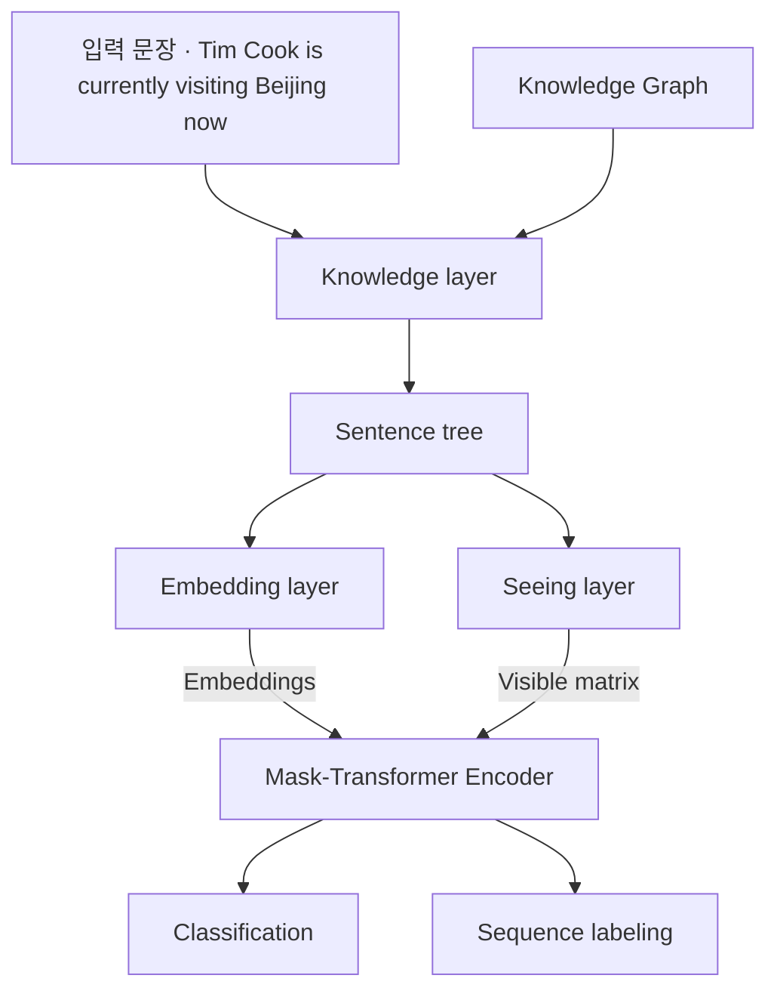
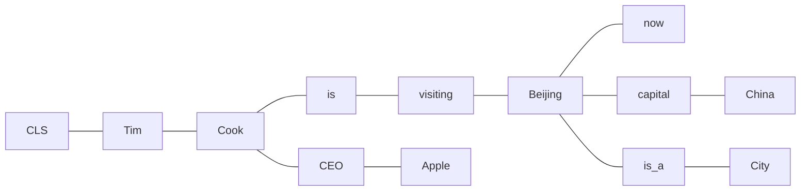

# S20A — K-BERT: 문장에 트리플을 끼워 넣기

> Ch.6 언어모델+KG · Day 10
> 원자료: DSBA Lab Study 강의 슬라이드 중 `00 Preview` · `01 Introduction` · `02 Related Work` ·
> `03 Methodology` · `04 Experiments` · `1st Conclusion`
> 참고 논문
> · Liu, Zhou, Zhao, Wang, Ju, Deng, Wang (2020), _K-BERT: Enabling Language Representation
>   with Knowledge Graph_, AAAI 2020 ([arXiv:1909.07606](https://arxiv.org/abs/1909.07606))
> · 코드 [autoliuweijie/K-BERT](https://github.com/autoliuweijie/K-BERT)
>
> 📖 [강의 목차](README.md) · [YouTube 재생목록](https://www.youtube.com/watch?v=f0WV7b3lGqM&list=PLFHGWfB_kmrs)
> 이전 [S19B KnowBERT](S19B-KnowBERT-엔티티-링커-내장.md) · 다음 [S20B KEPLER](S20B-KEPLER-두-목적함수를-한-인코더에.md)
> 📎 부록 [S20-1 읽는 데 필요한 것들](S20-1-읽는-데-필요한-것들.md) · [S20-2 지식을 언제 넣는가](S20-2-지식을-언제-넣는가.md)

**한 회차를 두 문서로 나눴다.** 이 문서가 도입부와 K-BERT를, S20B가 KEPLER와 회차 결론을
다룬다. 절 번호는 문서마다 1부터 다시 시작한다.

**이 문서는 슬라이드 내용만 담는다.** 배경 설명은 [S20-1](S20-1-읽는-데-필요한-것들.md)에,
강의 밖 해석은 [S20-2](S20-2-지식을-언제-넣는가.md)에 있다. 이 덱에는 `발표자 의견`이라고 표시된 상자가 붙는데,
그것도 슬라이드에 있는 것이므로 본편에 옮기고 그렇게 적어 구분한다.

예문은 `Tim Cook is currently visiting Beijing now` 하나로 처음부터 끝까지 이어진다.

---

## 1. 이번 회차의 두 논문

**[1] K-BERT: Enabling Language Representation with Knowledge Graph**
(Liu et al., AAAI 2020, 인용수 1308회)

- BERT와 같은 기존의 사전 학습된 언어 모델에 KG로부터 추출한 도메인 지식을 효과적으로 주입했다
- Knowledge Noise(KN) 문제를 해결하기 위해 Visible matrix를 도입하고, 지식 삽입으로 깨진 문장
  구조는 Soft-position embedding으로 복원해, 추가된 지식이 원래 문장의 의미를 왜곡하지 않도록
  정보의 노출 범위를 제어한다
- 금융·법률·의료 등 도메인 특화 작업에서 BERT보다 뛰어난 성능을 보였고, 별도의 대규모 사전
  학습 없이도 기존 모델 파라미터를 그대로 활용할 수 있다는 장점이 있다

**[2] KEPLER: A Unified Model for Knowledge Embedding and Pre-trained Language Representation**
(Wang et al., TACL 2021, 인용수 1135회)

- Knowledge Embedding(KE)과 Pre-trained Language Representation(PLM)의 학습 목표를 결합해
  사실적 지식을 언어 표현 모델에 효과적으로 통합했다
- 500만 개의 entity와 2,000만 개의 triplet을 포함하는 대규모 KG 데이터셋 Wikidata5M을 새로
  구축했다
- 다양한 NLP 작업에서 우수한 성능을 보였고, 특히 Inductive KE 설정에서도 강력한 성능을
  입증했다

## 2. S19에서 이어지는 질문

**S19 Wrap-up**

- ERNIE와 KnowBERT는 별도의 KE 모델로 학습한 고정 entity embedding을 텍스트 표현에 융합한다
- 이를 위해 entity linker가 필요하고, 언어 표현 공간과 entity embedding 공간이 따로 학습된다
  (= K-BERT가 말하는 HES)
  - Linking과 융합 모듈 때문에 추론 시 추가 비용이 발생한다

**S20의 목표**

> 별도로 학습된 엔티티 임베딩 테이블 없이, KG의 지식을 언어모델에 넣을 수 있을까?

| 논문 | 어떻게 | 어느 단계에서 |
|---|---|---|
| K-BERT | KG triple을 문장 구조 자체에 삽입 | 입력 단계 (fine-tuning·추론 시점 주입) |
| KEPLER | KG 목적함수와 언어모델 목적함수를 동시에 최적화 | 손실함수 단계 (사전학습 시점 주입) |

KEPLER는 [S20B](S20B-KEPLER-두-목적함수를-한-인코더에.md)에서 다룬다.

## 3. 문제 정의 — 세 가지 한계

> 일반 말뭉치로 사전 학습된 언어 모델에, Knowledge Graph에서 추출한 도메인 지식을 어떻게
> 효과적으로 주입할 것인가

**① 일반 도메인 사전 학습과 특정 도메인 사이의 불일치**

- 기존 사전 학습 모델은 주로 일반 도메인 데이터로 학습되어 금융·법률·의학 등 전문 분야에
  적용하는 데 한계가 있다
- 일반적인 BERT는 `Paracetamol`과 `cold`라는 단어를 각각 이해할 순 있지만, "Paracetamol이
  감기를 치료할 수 있다"는 의학적 관계를 말뭉치만으로 학습하려면 두 표현의 충분한 동시 출현이
  필요하다

**② 도메인별 사전 학습의 높은 비용**

- 도메인 말뭉치로 처음부터 다시 사전 학습하는 것이 가장 직접적인 해법이지만 데이터·GPU·시간
  비용이 크다
- KG를 쓰면 별도의 도메인 사전학습 없이 지식을 넣을 수 있고, 주입된 지식을 사람이 편집할 수
  있어 해석 가능성도 함께 확보된다

**③ Knowledge Graph와 언어 모델의 결합에서 발생하는 문제** (슬라이드가 ★로 표시한 항목)

| 문제 | 무엇인가 |
|---|---|
| Heterogeneous Embedding Space (HES) | 텍스트의 단어는 word embedding이나 language model로, KG의 엔티티는 knowledge graph embedding으로 표현되어 서로 다른 벡터 공간에 존재한다 |
| Knowledge Noise (KN) | 너무 많은 외부 지식이 문장에 주입되면 오히려 원래 문장이 가진 고유한 의미가 왜곡되거나 훼손될 수 있다 |

KN의 예가 이 회차의 예문이다. `Tim Cook is currently visiting Beijing now`에서 Cook에는
CEO·Apple이, Beijing에는 capital·China가 붙는데, 서로 무관한 Apple과 China가 영향을 주고받으면
원 문장의 의미가 왜곡될 수 있다.

## 4. K-BERT의 기여

- 사전 학습된 언어 모델인 BERT에 KG를 통합해 도메인 특화 지식을 효과적으로 활용할 수 있게 하는
  모델을 제안한다
  - **HES 문제** → 별도의 KG entity embedding table을 사용하지 않고, entity 이름과 relation을
    BERT vocabulary의 token sequence로 삽입한다
  - **KN 문제** → Soft-position embedding과 Visible matrix를 도입해, 추가된 지식이 원 문장의
    의미를 왜곡하지 않도록 정보의 노출 범위를 제어한다
- 금융·법률·의학 등 도메인 특화 작업에서 BERT보다 뛰어난 성능을 보였다
  - 추가적인 사전 학습 없이도 외부 지식그래프의 삼항식(triples)을 문장에 주입해 전문 지식이
    필요한 과제에서 BERT를 상회한다

## 5. 기존 연구와의 차별성

**BERT 개선 연구의 두 갈래**

① Pre-Training Process 개선 — Pre-Training 데이터와 학습 목표를 바꾸어 언어 표현의 품질을
높인다.

- Baidu-ERNIE, BERT-WWM(Whole-word masking), SpanBERT(연속된 토큰 구간인 span을 통째로
  masking), RoBERTa(NSP 제거, dynamic masking, 더 긴 문장)

② Encoder 구조 개선 — Transformer encoder 자체를 변경한다.

- XLNet(Transformer-XL로 교체), THU-ERNIE(encoder를 단어·엔티티 aggregator로 변경)

두 갈래 모두 **텍스트 내부**의 학습 방식을 개선하며, **외부의 지식을 어떻게 주입할지**는 다루지
않는다.

**KG 결합 연구와의 차이**

| 선행 연구 | K-BERT 저자들의 평가 |
|---|---|
| THU-ERNIE | entity 자체의 정보는 쓰되, entity 사이의 relation은 충분히 고려하지 않는다 |
| COMET | KG의 triple을 corpus로 삼아 GPT를 학습시키는 방식. 매우 비효율적이다 |
| word2vec + TransE 계열 | 단어와 entity를 하나의 공간에 공동 임베딩하려 했으나 여전히 HES 문제가 남고, 대규모 KG에서는 entity table의 메모리 비용이 매우 커질 수 있다 |

슬라이드가 한 줄로 정리한다. K-BERT는 Entity embedding 테이블을 아예 두지 않고, entity 이름을
문장의 토큰으로 다룬다.

## 6. 전체 구조

K-BERT는 네 개의 모듈로 구성된다.

1. 입력 문장이 들어오면 지식 계층은 먼저 KG로부터 관련 triples을 추출해 문장에 주입하며,
   원래의 문장을 지식이 풍부한 **Sentence tree**로 변환한다
2. 이 Sentence tree는 Embedding layer와 Seeing layer로 **동시에** 전달된다
   - 전달된 Sentence tree는 각각 token-level embedding 표현과 Visible matrix로 변환된다
   - Visible matrix는 각 토큰의 가시 영역을 제어하는 데 사용되며, 과도한 지식 주입으로 원래
     문장의 의미가 변경되는 것을 방지한다



## 7. Knowledge Layer

**Knowledge Query**

- 문장에 포함된 entity name을 기준으로 KG에서 대응하는 triple을 조회하고, 이 entity와 연결된
  triple `ε = (w_i, r_j, w_k)`를 검색한다
- 문장에서 Cook과 Beijing을 엔티티로 인식하면 관련된 지식 `E`는 이렇게 구성될 수 있다

```
E = {(Cook, CEO, Apple), (Beijing, capital, China), (Beijing, is_a, City)}
```

**Knowledge Inject**

- 검색된 triple을 원래 문장의 해당 위치에 연결한다
- 결과적으로 문장에 가지가 생긴다. 이것이 **Sentence tree**다



- 다만 K-BERT에서는 Sentence tree의 **깊이를 1로 제한**한다
  - Knowledge Graph가 지나치게 커지는 것을 방지하고, 불필요한 지식 주입을 줄이기 위함이다

## 8. Embedding Layer

**Token Embedding**

- sentence tree의 모든 노드를 하나의 순서로 펼친 뒤, 각 토큰을 BERT의 vocabulary에서 찾아
  embedding한다

```
Tim – Cook – CEO – Apple – is – visiting – Beijing – capital – China – is_a – City – now
```

- Knowledge Graph의 토큰들이 원래 문장 중간에 삽입되기에 **원래 문장의 순서가 깨진다**

**Soft-position Embedding**

- 일반 BERT에서는 토큰이 실제 입력 순서에 따라 위치 번호를 부여받는다 → hard-position
- K-BERT에서는 지식 토큰이 삽입되면서 실제 배열 순서와 원래 문장 구조가 달라진다 →
  **soft-position**
  - Cook은 원래 위치(2)
  - CEO, Apple은 Cook에서 파생된 지식 가지이므로 Cook과 관련된 위치
  - is는 원래 문장 기준 위치(3) 또는 이에 해당하는 soft-position

슬라이드 그림의 soft-position index가 이렇게 붙는다.

| 토큰 | [CLS] | Tim | Cook | CEO | Apple | is | visiting | Beijing | capital | China | is_a | City | now |
|---|---|---|---|---|---|---|---|---|---|---|---|---|---|
| soft-position | 0 | 1 | 2 | 3 | 4 | 3 | 4 | 5 | 6 | 7 | 6 | 7 | 6 |

`is`가 3으로 돌아가 원래 문장의 자리를 지키고, 지식 가지의 CEO·Apple이 같은 3·4를 쓴다.

**Segment embedding**

- 여러 문장을 구분하는 데 사용된다
- Knowledge Graph 형성 시 삽입된 토큰은 연결된 원래 문장의 segment 정보를 따른다

## 9. Seeing Layer

**Knowledge Noise 문제**

- KG의 모든 정보가 모든 토큰과 자유롭게 상호작용하도록 허용하면, 관련 없는 지식이 원래 문장의
  의미를 바꿀 수 있다
- `Cook-CEO-Apple`과 `Beijing-capital-China`가 함께 있을 때
  - China는 Beijing에 대한 지식이지 Apple에 대한 지식이 아니다
  - 그러나 일반적인 Transformer에서는 모든 token이 서로 attention할 수 있으므로 Apple이 China의
    영향을 받을 가능성이 있다

Seeing Layer는 이를 방지하기 위해 **Visible Matrix**를 생성한다.

**Visible Matrix**

주입된 지식이 원문의 의미를 변질시키지 않도록, 각 토큰이 서로를 참조할 수 있는 범위를 제한한다.

```
M_ij = 0     (w_i ⊖ w_j)
     = −∞    (w_i ⊘ w_j)
```

- 동일 branch에 속하면 참조 가능, 아니면 불가능하다
- 또한 `[CLS]`가 모든 지식 token을 직접 볼 수 없도록 제한한다

## 10. Mask Transformer

**Transformer 수정**

- K-BERT에서는 **Mask-Transformer**를 사용해 self-attention 영역을 제한한다
- 나머지 setting은 BERT의 Transformer Encoder와 동일하다. `L = 12, H = 768, A = 12`

**Mask-Self-Attention**

- Q, K, V는 일반 self-attention과 동일하게 계산한다
- 이후 Visible Matrix를 attention 점수 계산에 직접 적용해, 구조적으로 허용된 범위 내에서만
  정보가 흐르도록 제어한다. 특정 지식이 필요한 위치에만 선택적으로 도메인 지식을 반영한다

```
S_{i+1} = softmax( (Q_{i+1} K^T_{i+1} + M) / √d_k )
```

Visible matrix는 관련 없는 토큰 간의 직접적인 영향은 차단하지만 **필요한 지식이 완전히
사라지게 하지는 않는다.**

- Apple은 Cook을 볼 수 있고, Cook은 `[CLS]`를 통해 원래 문장과 연결된다
  - 따라서 Apple의 정보는 Cook의 표현을 풍부하게 만들 수 있다
  - 이후 `[CLS]`는 Cook을 통해 Apple 관련 지식을 간접적으로 받을 수 있다
- KG의 정보가 원래 문장 전체를 덮어쓰는 것이 아니라, 관련된 원래 token을 거쳐 **간접적으로
  스며드는** 방식이다

## 11. 실험 설정

**Pre-training Corpora**

| | 규모 |
|---|---|
| WikiZh | 중국어 위키백과 말뭉치. 총 100만 개 항목, 1억 2천만 개 문장, 1.2G |
| WebtextZh | 대규모 고품질 중국어 질의응답 말뭉치. 410만 개 항목, 3.7G, 총 28,000개 주제 |

**Knowledge Graph**

| | 무엇인가 | 정제 후 |
|---|---|---|
| CN-DBpedia | 대규모 오픈 도메인 백과사전형 KG. 수천만 개 엔티티와 수억 개 관계 | 517만 개 triple |
| HowNet | 중국어 어휘·개념을 위한 대규모 언어 지식 베이스. 중국어 단어의 의미 단위인 sememe으로 주석 | 52,576개 triple |
| MedicalKG | 자체 개발한 중국어 의료 개념 KG. 네 가지 유형의 상위어(증상·질병·신체 부위·치료법) | 13,864개 triple |

CN-DBpedia와 HowNet은 entity 이름의 길이가 2 미만이거나 특수 문자를 포함하는 triple을 제거해
정제했다. MedicalKG는 K-BERT의 일부로 오픈소스화되었다.

**Baselines**

- Google BERT — WikiZh로 사전 학습된 공개 baseline model
- Our BERT — WikiZh와 WebtextZh로 사전 학습하여 BERT를 재구현한 model

## 12. Open-domain 과제와 데이터셋

**Single-sentence classification**

| 데이터셋 | 구성 |
|---|---|
| Book review | Douban에서 수집한 긍정 20,000 · 부정 20,000 |
| Chnsenticorp | 호텔 리뷰 12,000 (긍정 6,000 · 부정 6,000) |
| Shopping | 온라인 쇼핑 리뷰 40,000 (긍정 21,111 · 부정 18,889) |
| Weibo | Sina Weibo 감성 주석. 긍정 60,000 · 부정 60,000 |

**Two-sentence classification**

- XNLI — 각 항목이 두 개의 문장으로 구성된 교차 언어 이해 데이터셋. 두 문장의 관계를 함의 /
  모순 / 중립 중에서 결정한다
- LCQMC — 대규모 중국어 질문 매칭 말뭉치. 두 질문이 유사한 의도를 가지고 있는지 판별한다

**Q&A matching task**

- NLPCC-DBQA — 주어진 문서에서 각 질문에 대한 답변을 예측하는 과제

**Named Entity Recognition**

- MSRA-NER — Microsoft에서 발표한 개체명 인식 데이터셋. 텍스트 내의 인명·지명·조직명 등을
  인식한다

## 13. Open-domain 결과

각 데이터셋을 train/dev/test 세 부분으로 나누어 fine-tuning과 성능 평가를 진행했다.

① **감성 분석 과제** (Book review, Chnsenticorp, Shopping, Weibo) — 문장의 감성이 지식 없이도
감정 단어를 기반으로 판단될 수 있기 때문에 KG가 유의미한 영향을 미치지 않는다.

② **의미 유사성 과제** (XNLI, LCQMC) — 언어 KG(HowNet)가 백과사전적 KG보다 더 나은 성능을
보인다.

③ **질의응답과 NER 과제** (NLPCC-DBQA, MSRA-NER) — 백과사전적 KG(CN-DBpedia)가 언어 KG보다 더
적합하다.

MSRA-NER 결과에서는 추가 말뭉치보다 CN-DBpedia를 적용했을 때 더 큰 향상이 관찰된다. CN-DBpedia는
F1을 93.6%에서 95.7%로 향상시키는 반면 WebtextZh는 94.6%까지만 향상시킨다.

| Models \ Datasets | Book_review Dev | Test | Chnsenticorp Dev | Test | Shopping Dev | Test | Weibo Dev | Test | XNLI Dev | Test | LCQMC Dev | Test |
|---|---|---|---|---|---|---|---|---|---|---|---|---|
| *Pre-trained on WikiZh by Google.* | | | | | | | | | | | | |
| Google BERT | 88.3 | **87.5** | 93.3 | 94.3 | 96.7 | 96.3 | 98.2 | 98.3 | 76.0 | 75.4 | 88.4 | 86.2 |
| K-BERT (HowNet) | 88.6 | 87.2 | **94.6** | **95.6** | **97.1** | **97.0** | 98.3 | 98.3 | 76.8 | 76.1 | 88.9 | 86.9 |
| K-BERT (CN-DBpedia) | **88.6** | 87.3 | 93.9 | 95.3 | 96.6 | 96.5 | 98.3 | 98.3 | 76.5 | 76.0 | 88.6 | 87.0 |
| *Pre-trained on WikiZh and WebtextZh by us.* | | | | | | | | | | | | |
| Our BERT | **88.6** | 87.9 | 94.8 | 95.7 | 96.9 | **97.1** | 98.2 | 98.2 | 77.0 | 76.3 | 89.0 | 86.7 |
| K-BERT (HowNet) | 88.5 | 87.4 | **95.4** | 95.6 | 96.9 | 96.9 | 98.3 | **98.4** | 77.2 | 77.0 | 89.2 | 87.1 |
| K-BERT (CN-DBpedia) | 88.8 | 87.9 | 95.0 | **95.8** | **97.1** | 97.0 | 98.3 | 98.3 | 76.2 | 75.9 | 89.0 | 86.9 |

*Table 1: Results of various models on sentence classification tasks on open-domain tasks (Acc. %).*

| Models \ Datasets | NLPCC-DBQA Dev | Test | MSRA-NER Dev | Test |
|---|---|---|---|---|
| *Pre-trained on WikiZh by Google.* | | | | |
| Google BERT | 93.4 | 93.3 | 94.5 | 93.6 |
| K-BERT (HowNet) | 93.2 | 93.1 | 95.8 | 94.5 |
| K-BERT (CN-DBpedia) | 94.5 | 94.3 | 96.6 | 95.7 |
| *Pre-trained on WikiZh and WebtextZh by us.* | | | | |
| Our BERT | 93.3 | 93.6 | 95.7 | 94.6 |
| K-BERT (HowNet) | 93.2 | 93.1 | 96.3 | 95.6 |
| K-BERT (CN-DBpedia) | 93.6 | 94.2 | 96.4 | 95.6 |

*Table 2: Results of various models on NLPCC-DBQA (MRR %) and MSRA-NER (F1 %).*

## 14. Specific-domain 과제와 데이터셋

**Domain Q&A**

- Baidu Zhidao에서 금융 약 770,000개, 법률 도메인 약 36,000개의 Q&A 샘플을 크롤링했다. 질문,
  네티즌 답변, 베스트 답변이 포함되어 있다
- 이를 바탕으로 Finance Q&A와 Law Q&A 두 데이터셋을 구축했다
- 과제는 네티즌의 답변 중에서 질문에 대한 최선의 답변을 선택하는 것이다

**Domain NER**

- Finance NER — 3,000개의 금융 뉴스 기사. 65,000개 이상의 개체명(인물·장소·조직)이 수동으로
  라벨링되어 있다
- Medicine NER — CCKS 2017에서 발표된 임상 개체명 인식(CNER) 과제. 전자 의무 기록에서 의료
  관련 개체명을 추출하는 것이 목표다

## 15. Specific-domain 결과

- BERT와 비교했을 때 K-BERT는 도메인 과제 측면에서 유의미한 성능 향상을 보인다
  - Google BERT 기반 비교에서, CN-DBpedia를 사용한 K-BERT는 네 도메인 과제의 F1을 약 1~2%p
    개선한다
  - 이러한 향상은 KG 내의 도메인 지식으로부터 비롯된다
- Medicine NER에 대해 MedicalKG를 사용했을 때의 성능 향상이 매우 뚜렷하다
  - 도메인 KG가 도메인 특화 작업에 매우 유용하다는 결론을 내릴 수 있다

| Models \ Datasets | Finance_Q&A P | R | F1 | Law_Q&A P | R | F1 | Finance_NER P | R | F1 | Medicine_NER P | R | F1 |
|---|---|---|---|---|---|---|---|---|---|---|---|---|
| *Pre-trained on WikiZh by Google.* | | | | | | | | | | | | |
| Google BERT | 81.9 | 86.0 | 83.9 | 83.1 | 90.1 | 86.4 | 84.8 | 87.4 | 86.1 | 91.9 | 93.1 | 92.5 |
| K-BERT (HowNet) | 83.3 | 84.4 | 83.9 | 83.7 | 91.2 | 87.3 | 86.3 | 89.0 | **87.6** | 93.2 | 93.3 | 93.3 |
| K-BERT (CN-DBpedia) | 81.5 | 88.6 | **84.9** | 82.1 | 93.8 | **87.5** | 86.1 | 88.7 | 87.4 | 93.9 | 93.8 | 93.8 |
| K-BERT (MedicalKG) | - | - | - | - | - | - | - | - | - | 94.0 | 94.4 | **94.2** |
| *Pre-trained on WikiZh and WebtextZh by us.* | | | | | | | | | | | | |
| Our BERT | 82.1 | 86.5 | 84.2 | 83.2 | 91.7 | 87.2 | 84.9 | 87.4 | 86.1 | 91.8 | 93.5 | 92.7 |
| K-BERT (HowNet) | 82.8 | 85.8 | 84.3 | 83.0 | 92.4 | 87.5 | 86.3 | 88.5 | 87.3 | 93.5 | 93.8 | 93.7 |
| K-BERT (CN-DBpedia) | 81.9 | 87.1 | **84.4** | 83.1 | 92.6 | **87.6** | 86.3 | 88.6 | 87.4 | 93.9 | 94.3 | 94.1 |
| K-BERT (MedicalKG) | - | - | - | - | - | - | - | - | - | 94.1 | 94.3 | **94.2** |

*Table 3: Results of various models on specific-domain tasks (%).*

## 16. Ablation Studies

두 가지 도메인 특화 작업을 사용해 Soft-position과 Visible matrix의 효과를 탐구했다.

| 변형 | 무엇을 바꾸나 |
|---|---|
| w/o soft-position | soft-position 대신 hard-position을 사용해 K-BERT를 fine-tuning한다 |
| w/o visible matrix | 모든 토큰이 서로에게 보이는 상태로 둔다 |

**Results**

- 두 작업 모두에서 Soft-position이나 Visible matrix가 없으면 K-BERT의 성능이 저하되었다
  - Law Q&A에서 Visible matrix가 없는 K-BERT는 BERT보다 성능이 낮았으며, 이는 부적절한 지식
    추가가 성능 저하로 이어질 수 있음을 확인시켜 준다
- K-BERT는 epoch 2에서 정점에 도달하는 반면 BERT는 epoch 4에서 정점에 도달한다
  - K-BERT가 BERT보다 더 빠르게 수렴함을 입증한다

Soft-position과 Visible matrix가 K-BERT를 KN 간섭에 더 강건하게 만들어 지식을 더 효율적으로
활용할 수 있게 한다.

그림은 Law_Q&A와 Medicine_NER에서 epoch에 따른 F1 곡선 네 개(K-BERT, w/o soft-position,
w/o visible matrix, BERT)를 그린다.

## 17. K-BERT 정리와 KEPLER로 넘어가는 다리

**Contributions**

- KG의 지식을 문장에 주입해 Sentence tree를 만들고, Soft-position과 Visible matrix로 지식의
  범위를 제어하는 K-BERT를 제안했다

**Future Works**

- 문맥에 맞춰 불필요한 triple을 거르도록 K-Query를 개선한다
- ELMo·XLNet 등의 모델로 확장한다

**발표자 의견** (슬라이드에 그렇게 표시된 상자다)

- KG 지식은 주로 입력 시점의 **외부** triple 삽입을 통해 제공되며, 모델이 독립적인 KG embedding
  model로 학습되는 구조는 아니다
  - KG의 이점을 사용하려면 fine-tuning·inference 단계에서도 KG 조회와 문장 확장이 필요하다
- 대응하는 triple이 없으면 KG로부터 추가적인 지식 이득을 얻지 못한다
- 그렇다면
  - 입력을 전혀 건드리지 않고 학습 목적함수 단계에서 지식을 넣으면?
  - entity를 token이 아닌 텍스트 설명문으로 보고 같은 encoder로 인코딩하면?

```
⇒ KEPLER:  L = L_KE + L_MLM
```

---

## 관련 문서

- [S20B — KEPLER](S20B-KEPLER-두-목적함수를-한-인코더에.md) — 같은 회차의 뒷부분
- [S19A — ERNIE](S19A-ERNIE-엔티티-임베딩-직접-주입.md) · [S19B — KnowBERT](S19B-KnowBERT-엔티티-링커-내장.md) — 2절이 정리한 앞 회차
- [S19-2 — 지식을 어디에 고정하는가](S19-2-지식을-어디에-고정하는가.md) — 엔티티 임베딩을 고정한다는 선택
- [S13 — KG 임베딩 기초](S13-KG-임베딩-기초.md) — 5절이 언급한 TransE 계열
- [00 — 전체 파이프라인](00-전체-파이프라인.md) — 지식 주입이 붙는 자리
