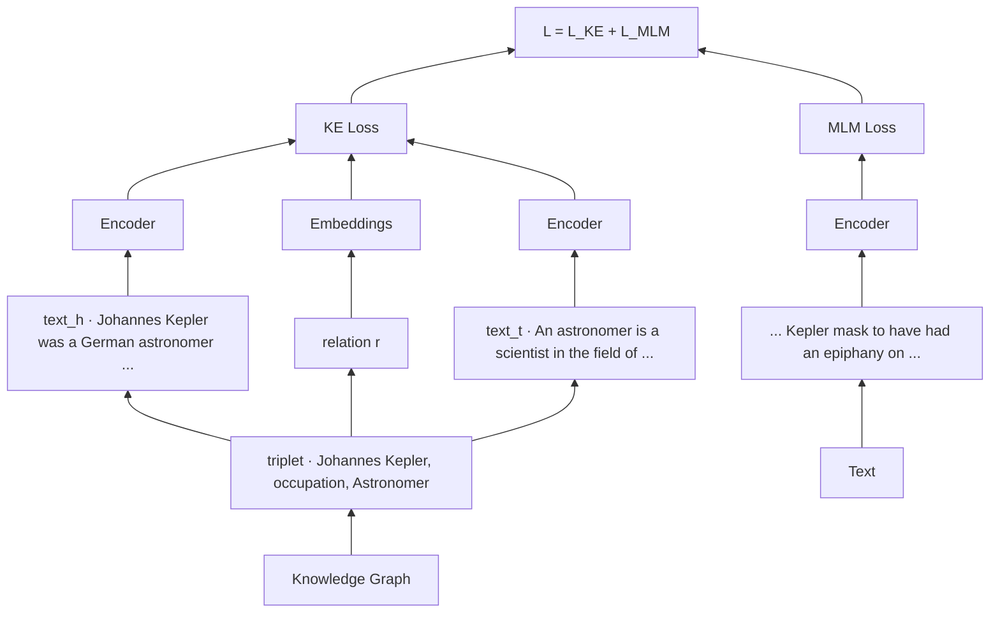

# S20B — KEPLER: 두 목적함수를 한 인코더에

> Ch.6 언어모델+KG · Day 10
> 원자료: DSBA Lab Study 강의 슬라이드 중 `01 Introduction`(KEPLER 부분) · `02 Related Work` ·
> `03 Methodology` · `04 Experiments` · `2nd Conclusion` · `Conclusion Wrap-up`
> 참고 논문
> · Wang, Gao, Zhang, Lin, Liu, Sun, Li, Zhang, Liu, Li, Zhou, Liu, Tang (2021),
>   _KEPLER: A Unified Model for Knowledge Embedding and Pre-trained Language Representation_,
>   TACL 2021 ([arXiv:1911.06136](https://arxiv.org/abs/1911.06136))
> · 코드·데이터 [THU-KEG/KEPLER](https://github.com/THU-KEG/KEPLER) (Wikidata5M 포함)
>
> 📖 [강의 목차](README.md) · [YouTube 재생목록](https://www.youtube.com/watch?v=f0WV7b3lGqM&list=PLFHGWfB_kmrs)
> 이전 [S20A K-BERT](S20A-K-BERT-문장에-트리플-끼워넣기.md) · 다음 S21 K-Adapter · CoLAKE
> 📎 부록 [S20-1 읽는 데 필요한 것들](S20-1-읽는-데-필요한-것들.md) · [S20-2 지식을 언제 넣는가](S20-2-지식을-언제-넣는가.md)

**한 회차를 두 문서로 나눴다.** [S20A](S20A-K-BERT-문장에-트리플-끼워넣기.md)가 도입부와
K-BERT를, 이 문서가 KEPLER와 회차 결론을 다룬다. 절 번호는 문서마다 1부터 다시 시작한다.

**이 문서는 슬라이드 내용만 담는다.** 배경 설명은 [S20-1](S20-1-읽는-데-필요한-것들.md)에,
강의 밖 해석은 [S20-2](S20-2-지식을-언제-넣는가.md)에 있다. `발표자 정리`라고 표시된 상자는 그것도 슬라이드에 있는
것이므로 본편에 옮기고 그렇게 적어 구분한다.

예문은 `(Johannes Kepler, occupation, Astronomer)` 하나로 이어진다.

---

## 1. PLM과 KE, 각각의 빈자리

**Pre-trained Language Models (PLMs)**

- BERT와 RoBERTa처럼 대규모 텍스트에서 언어 표현을 사전 학습하는 모델로, 문법·의미·문맥 이해에
  강점을 가진다
- 텍스트에서 희소하거나 복잡한 형태로 나타나는 사실적 지식(factual knowledge)을 안정적으로
  포착하기 어렵다
  - 사실적 지식과 관계 구조는 텍스트에서 드물게 나타나거나 복잡한 형태로 표현되는 경우가 많다

**Knowledge Embedding (KE) & Knowledge Graph (KG)**

- KG의 entity와 relation을 벡터로 표현하는 분야로, 구조화된 사실을 활용해 누락된 관계를 예측하는
  Link Prediction 등에 사용된다
- entity와 relation의 벡터를 별도로 학습하기에, entity에 대한 풍부한 텍스트 정보를 충분히
  활용하지 못한다
- 대부분 transductive setting에 기반하므로, 학습 과정에서 보지 못한 새로운 entity에 대한 표현을
  생성하기 어렵다

슬라이드가 한 줄로 묻는다. 둘을 상호보완적으로 활용한다면?

## 2. 기존 지식 강화 PLM의 한계

**ERNIE · KnowBERT 계열의 공통 구조**

```
문장에서 entity 언급을 찾음
  → 그 언급이 KG의 어떤 entity인지 연결
  → 별도로 학습된 entity embedding을 가져옴
  → Transformer 표현과 결합
```

**Limitations**

| | 무엇이 문제인가 |
|---|---|
| ① 표현 공간의 불일치 | entity embedding이 별도의 KE 모델로 학습되기에, 언어 표현 공간과 자연스럽게 정렬되지 않는다 |
| ② Entity linker 의존성 | 문장 내 entity mention을 KG entity에 연결하는 과정이 필요하며, 연결이 틀리면 오류가 이후 단계로 전파된다 |
| ③ 추론 비용 증가 | entity embedding을 검색하고 결합하는 구조 때문에 vanilla PLM보다 추론 과정이 복잡해진다 |

## 3. KEPLER의 기여

- **Knowledge Embedding objective와 PLM의 Masked Language Modeling objective를 결합**한다
  - entity를 독립적인 고정 벡터로 저장하지 않고, entity의 텍스트 설명으로부터 embedding을
    생성한다
    - "entity embedding을 PLM에 삽입하는 모델"이라기보다, **PLM 자체가 entity embedding을
      생성하도록 학습하는 모델**에 가깝다
  - 특히 KEPLER가 Inductive Link Prediction에서 효과적으로 작동한다고 강조한다
    - 새로운 entity가 계속 추가되는 실제 KG 환경에서 중요한 특성이다
- 새로운 대규모 데이터셋 **Wikidata5M**을 제안했다
  - 약 459만 entity, 822 relation, 약 2,060만 triplet과 정렬된 Wikipedia 설명문을 포함한다
  - transductive와 inductive 두 가지 split을 함께 제공해 후속 연구를 지원한다

슬라이드 그림은 Johannes Kepler를 가운데 두고 German(Ethnic group), Kepler's laws(Published by),
Kepler space telescope(Named after), NASA(Operator), Astronomer(Occupation)를 잇는다. 각 노드에
Wikipedia 설명문 첫 문장이 붙어 있다.

## 4. 기존 연구 — NLP 사전학습의 흐름

**Word representation**

- Word2Vec, GloVe 등의 초기 NLP 사전 학습 연구는 단어를 고정된 벡터로 표현하는 데 집중했다
- 이 방법들은 대규모 텍스트에서 단어의 동시 출현 패턴을 학습한다
  - `doctor`와 `hospital`이 자주 함께 등장하면 두 단어의 벡터가 의미적으로 가까워진다
- 그러나 이러한 단어 embedding은 문맥에 따라 의미가 바뀌는 현상을 충분히 표현하지 못한다
  - 같은 단어가 문장마다 동일한 벡터를 사용한다. `bank`가 금융기관인지 강둑인지 구분하기 어렵다

**Contextualized representation**

- ELMo는 문장 전체를 고려해 단어의 표현을 문맥에 따라 다르게 생성한다
  - 이후 BERT, GPT, RoBERTa 같은 Pre-trained Language Model이 등장했다
- 대규모 텍스트에서 언어의 문법·의미·문장 구조를 학습한 뒤 다양한 NLP task에 fine-tuning된다

**KEPLER의 차별점**

- MLM objective를 통해 언어 이해 능력을 유지한다
- 동시에 KG의 triplet을 사용해 사실적 지식을 학습한다

## 5. 기존 연구 — Knowledge Embedding과 두 setting

**Knowledge Embedding (KE)**

- 전통적 KE는 KG에 등장한 entity에 대한 embedding을 학습한다
  - 새로운 entity에는 바로 embedding을 제공하기 어렵다
- 반면 KEPLER는 entity description을 encoding해 embedding을 생성하기에, 학습에 등장하지 않은
  entity도 description이 있으면 처리할 수 있다

**Transductive vs. Inductive Embedding**

| | 어떤 설정인가 |
|---|---|
| Transductive | 학습과 평가에 동일한 엔티티 집합이 사용된다. 학습 중 entity `e`를 보고 테스트에서는 새로운 관계만 예측하기에, entity별 embedding을 미리 저장해 두어도 된다 |
| Inductive | 테스트 entity가 학습 중 전혀 등장하지 않는 새로운 entity다. 모델은 해당 entity의 description, 이웃 정보 또는 다른 side feature를 사용해야 한다. real-world KG의 지속적인 확장과 더 잘 맞는 setting이다 |

KEPLER에서는 대규모 PLM을 사용해 description의 의미를 **직접** 해석한다. 단순히 단어를 합치거나
이웃 embedding을 평균내는 것이 아니라 설명 속의 문맥적 의미를 활용한다.

슬라이드가 `cf.`로 덧붙인다. 논문은 inductive link prediction 성능이 기존 방법보다 높지만,
실제 KG 구축에 활용하기에는 여전히 충분하지 않다고 평가한다.

## 6. 전체 구조 — KE objective + MLM objective

**설계 원칙**

- KEPLER는 Transformer 기반의 PLM(예로 RoBERTa)을 Encoder로 **공유**한다
- Masked Language Modeling 목표와 Knowledge Embedding 목표를 **공동으로 최적화**해 지식과 언어
  표현을 하나의 의미론적 공간에 정렬한다

**핵심 아이디어** — entity 설명을 Transformer로 encoding하고, KG의 목적함수로 Encoder 자체를
학습하자.

- 그림의 세 Encoder는 같은 파라미터를 공유하는 **하나의** Encoder다
  - KG의 triplet `(Johannes Kepler, occupation, Astronomer)`에서 head `h`와 tail `t`의 설명문을
    각각 Encoder에 입력한다
  - Relation `r`은 학습 가능한 embedding table에서 가져온다
- 이 세 벡터로 KE loss를 계산하고, 별도의 텍스트로 MLM loss를 계산한 뒤 두 손실을 더한다



## 7. Encoder — 왜 별도의 지식 주입 구조를 추가하지 않았나

**입력 토큰과 출력 표현**

- 텍스트를 먼저 tokenizer(예로 BPE)로 나누어 token sequence를 생성한다. `(x_1, x_2, ..., x_N)`
- Transformer는 이 토큰들을 처리해 각 토큰에 대한 문맥적 표현을 만든다. `H_i ∈ R^{N×d}`

**Transformer 층의 계산**

각 Transformer 층 `E_i`는 이전 층의 출력을 입력으로 받아 다음 표현을 계산한다.

```
H_i = E_i(H_{i-1})
```

- 각 층 `E_i`는 Multi-head Self-attention과 Multi-layer Perceptron으로 구성된다
- 입력 토큰은 초기 표현 `H_0`으로 변환된다
- 첫 번째 Transformer 층이 `H_0`을 처리해 `H_1`을 만들고, 두 번째 층은 `H_1`을 처리해 `H_2`를
  만든다
- 이 과정을 `L`개 층에 걸쳐 반복해 `H_L`을 얻는다

입력 앞에 특수 토큰 `<s>`를 붙이고, 그 위치의 최종 출력 벡터를 텍스트 전체의 대표 벡터로
사용한다. `E_<s>(text)`

**KEPLER에서는 Transformer 구조 자체를 변경하지 않는다.**

- 지식 그래프 정보는 학습 중 `L_KE`라는 추가 목적 함수로 반영하고, 일반 언어 이해는 `L_MLM`으로
  유지한다
- 추론 시에는 일반적인 PLM처럼 텍스트만 입력하면 되기에 **별도의 entity linker가 필요 없다**

## 8. KE objective ① Entity 설명을 embedding으로

**Knowledge Graph 표현**

- 엔티티는 노드, 관계는 엣지이며, 하나의 사실은 triplet `(h, r, t)`로 표현된다
  - `h`는 head entity로 관계의 출발 엔티티, `r`은 relation으로 두 엔티티 사이의 관계,
    `t`는 tail entity로 관계의 도착 엔티티다
  - `(Johannes Kepler, occupation, astronomer)`는 Johannes Kepler의 직업이 astronomer라는 뜻이다

**Entity Descriptions as Embeddings**

```
h = E_<s>(text_h),   t = E_<s>(text_t)
```

- `text_h`, `text_t`는 head/tail entity의 텍스트 설명이다. 앞에 특수 토큰 `<s>`를 붙인다
- `T`는 관계별로 학습되는 embedding table이고 `T_r`은 그중 `r`번째 벡터다

entity는 고정 벡터를 저장하는 것이 아니라 **설명문 → Transformer Encoder → Entity Embedding**으로
처리된다. 반면 relation은 기본 설정에서 여전히 별도의 학습 가능한 벡터로 표현된다.

**Scoring Function**

```
d_r(h, t) = ‖ h + r − t ‖_p     (norm p = 1)
```

- TransE는 타당한 triplet에 대해 `h + r`이 `t`에 가까워지도록 학습한다
- 타당한 triplet이면 `d_r`이 작고, 잘못된 triplet이면 커야 한다

슬라이드가 `cf.`로 덧붙인다. 저자들은 단순성 때문에 TransE를 택했으며 더 발전된 KE 기법은
future work로 남겼다.

## 9. KE objective ② Negative Sampling과 세 가지 변형

**Negative Sampling**

가능한 모든 잘못된 triplet을 계산하는 것은 비효율적이므로 negative sampling으로 손실을 계산한다.

```
L_KE = −log σ(γ − d_r(h, t)) − Σ_{i=1}^{n} (1/n) log σ(d_r(h'_i, t'_i) − γ)
```

| 부분 | 무엇을 하나 |
|---|---|
| 앞부분 | positive triplet의 거리가 작아지도록 한다. 거리가 작아지면 `γ − d_r`가 커지고, sigmoid의 출력이 1에 가까워져 loss가 감소한다 |
| 뒷부분 | negative triplet의 거리가 커지도록 한다 |

모델은 `d_r(h, t) < d_r(h'_i, t'_i)` 방향으로 학습된다.

논문에서는 head를 고정하고 tail을 무작위로 교체하거나 그 반대로 교란한다.

```
(Kepler, occupation, astronomer)
  → (Kepler, occupation, footballer)   또는   (physicist, occupation, astronomer)
```

이러한 negative triplet은 실제 KG의 사실과 구별되도록 학습된다.

**세 가지 변형**

| | 무엇을 바꾸나 |
|---|---|
| ① Entity Descriptions as Embeddings | 기본 방식 |
| ② Entity and Relation Descriptions as Embeddings | relation도 설명문으로 인코딩한다. `r̂ = E_<s>(text_r)` |
| ③ Entity Embeddings Conditioned on Relations | entity embedding을 relation에 따라 조건화한다. `h_r = E_<s>(text_{h,r})` |

## 10. MLM과 전체 학습 목표

**Masked Language Modeling**

- BERT/RoBERTa의 표준 MLM을 그대로 사용한다
  - 입력 토큰의 15%를 선택한다
  - 선택된 토큰 중 80%는 `<mask>`로 치환, 10%는 무작위 토큰으로 교체, 10%는 원래 토큰을 유지한다
- MLM이 일반적인 언어 능력을 보존하고, KE objective와 결합되어 지식과 언어 표현을 함께 학습하도록
  한다

**Training Objectives**

```
L = L_KE + L_MLM
```

- `L_KE`는 KG의 사실적 관계를 학습하고, `L_MLM`은 일반적인 언어 이해 능력을 유지한다
- KE와 MLM에 쓰이는 텍스트 데이터는 서로 달라도 된다
  - Entity description만 보면 언어 이해가 좁아지므로, MLM에서는 다양한 텍스트를 보게 하여 편향을
    방지한다

**K-BERT와의 차이**

| | 언제 KG를 쓰나 |
|---|---|
| K-BERT | 사전 학습에서는 KG를 배제하고, fine-tuning·inference 입력에 KG를 주입한다 |
| KEPLER | 사전학습 objective를 통해 KG를 반영하고, **추론 시에는 KG가 전혀 필요 없다** |

## 11. Variants와 구현

세 가지 설계 요소를 분리해서 검증한다. 지식 그래프의 선택, entity·relation 표현 방식, KE·MLM의
균형이다.

| 모델 변형들 | 사용 KG | entity 표현 방식 | 주요 목적/특징 |
|---|---|---|---|
| KEPLER-Wiki | Wikidata5M | entity description | 대표 모델, 전반적으로 강한 성능 |
| KEPLER-WordNet | WordNet | entity description | 어휘·개념 지식 주입 |
| KEPLER-W+W | Wikidata5M + WordNet | entity description | 여러 KG의 결합 |
| KEPLER-Rel | Wikidata5M | 관계 description도 인코딩 | 텍스트 기반 관계 표현 |
| KEPLER-Cond | Wikidata5M | 관계 조건부 entity 표현 | 관계별 엔티티 의미를 반영 |
| KEPLER-OnlyDesc | Wikidata5M | description 중심 MLM | 제한된 텍스트만 사용 |
| KEPLER-KE | Wikidata5M | KE만 사용 | MLM의 필요성을 검증하는 ablation |

**Pre-training 구현**

- RoBERTa_BASE checkpoint로 초기화한다. `L = 12, d = 768`. fairseq로 구현하고 batch size는
  12,288이다
- MLM 데이터는 English Wikipedia(약 2,500M words)와 BookCorpus(약 800M words)다
- KE 데이터는 각 entity description의 첫 512 토큰만 사용해 entity embedding을 생성한다
- NLP task용은 10 epoch에 `γ = 4`, KE task용은 30 epoch에 `γ = 9`, WordNet 기반 모델은 `γ = 1`이다

## 12. Wikidata5M — 새로운 데이터셋의 필요성

**요구사항**

| | 왜 필요한가 |
|---|---|
| ① 충분히 큰 규모 | FB15K(1.5만 entity), WN18(4만) 등 기존 benchmark는 entity와 triplet 수가 상대적으로 작다 |
| ② entity와 연결된 고품질 텍스트 설명 | KEPLER는 description을 인코딩하므로 설명문이 반드시 필요하다 |
| ③ 합리적인 inductive split | 실제 환경에서는 새로운 사람·장소·제품·사건이 계속 추가된다 |

**구축 방법**

- 2019년 7월 Wikidata·Wikipedia dump를 사용해, 각 entity를 Wikipedia 페이지에 정렬하고 첫 번째
  section을 description으로 사용했다
  - 페이지가 없거나 설명이 5단어 미만인 엔티티는 제외했다
- 최종 구성은 4,594,485 entity / 822 relation / 약 2,060만 triplet이다

| Entity Type | Occurrence | Percentage |
|---|---|---|
| Human | 1,517,591 | 33.0% |
| Taxon | 363,882 | 7.9% |
| Wikimedia list | 118,823 | 2.6% |
| Film | 114,266 | 2.5% |
| Human Settlement | 110,939 | 2.4% |
| Total | 2,225,501 | 48.4% |

| Dataset | #entity | #relation | #training | #validation | #test |
|---|---|---|---|---|---|
| FB15K | 14,951 | 1,345 | 483,142 | 50,000 | 59,071 |
| WN18 | 40,943 | 18 | 141,442 | 5,000 | 5,000 |
| FB15K-237 | 14,541 | 237 | 272,115 | 17,535 | 20,466 |
| WN18RR | 40,943 | 11 | 86,835 | 3,034 | 3,134 |
| Wikidata5M | 4,594,485 | 822 | 20,614,279 | 5,163 | 5,133 |

*Table 1: Statistics of Wikidata5M (transductive setting) compared with existing KE benchmarks.*

| Subset | #entity | #relation | #triplet |
|---|---|---|---|
| Training | 4,579,609 | 822 | 20,496,514 |
| Validation | 7,374 | 199 | 6,699 |
| Test | 7,475 | 201 | 6,894 |

*Table 3: Statistics of Wikidata5M inductive setting.*

## 13. 실험 설정

**Baselines**

- RoBERTa는 KEPLER의 기본 Encoder이므로 핵심 baseline으로 삼는다
  - 공개 RoBERTa는 126GB corpus로 학습된 반면 KEPLER는 13GB만 사용한다
- 공정한 비교를 위해 같은 corpus와 MLM objective로 **Our RoBERTa**를 추가 학습했다
  - 동일한 초기화와 corpus 조건에서 핵심적인 차이는 **KE objective의 추가 여부**다
  - 그래서 KEPLER의 성능 향상을 Knowledge Graph 기반 supervision의 효과로 보다 신뢰성 있게
    해석할 수 있다

**비교군**

- ERNIE와 KnowBERT도 RoBERTa 기반으로 재구현해 Encoder 차이를 통제했다
  - MTB는 원래 BERT_LARGE 기반이므로 모델 크기 편향을 없애기 위해 BERT_BASE로 재구현했다
- KnowBERT는 원 논문과 달리 entity 타입을 입력에서 제외하고 다른 baseline과 동일한 설정으로
  재평가했다

## 14. Relation Classification — TACRED

- 문장 내 두 entity 사이의 관계를 분류하는 대규모 supervised dataset이다
  - `employee_of`(사람과 조직 사이), `city_of_birth`(사람과 장소 사이) 같은 관계를 예측한다
  - 총 42개의 relation type과 106,264개의 문장을 포함한다
- 두 entity 앞뒤에 특수 token을 추가하고 두 entity 위치의 표현을 결합해 관계를 분류하는 task다

**Results**

- KEPLER-Wiki F1 72.0 > Our RoBERTa 70.2. RoBERTa에 KG 기반 학습을 추가하면 관계 분류 성능이
  향상된다
- 반면 KEPLER-KE는 F1 62.0으로 크게 떨어진다. KG 정보만 학습하고 MLM을 제거하면 일반적인 언어
  이해 능력이 떨어지기 때문이다

성능 향상은 단순히 KG를 추가했기 때문이 아니라 **언어 이해와 지식 구조를 동시에 학습했기**
때문이다.

| Model | P | R | F-1 |
|---|---|---|---|
| BERT | 67.2 | 64.8 | 66.0 |
| BERT_LARGE | - | - | 70.1 |
| MTB | 69.7 | 67.9 | 68.8 |
| MTB (BERT_LARGE) | - | - | 71.5 |
| ERNIE_BERT | 70.0 | 66.1 | 68.0 |
| KnowBert_BERT | **73.5** | 64.1 | 68.5 |
| RoBERTa | 70.4 | 71.1 | 70.7 |
| ERNIE_RoBERTa | **73.5** | 68.0 | 70.7 |
| KnowBert_RoBERTa | 71.9 | 69.9 | 70.9 |
| Our RoBERTa | 70.8 | 69.6 | 70.2 |
| KEPLER-Wiki | 71.5 | **72.5** | **72.0** |
| KEPLER-WordNet | 71.4 | 71.3 | 71.3 |
| KEPLER-W+W | 71.1 | 72.0 | 71.5 |
| KEPLER-Rel | 71.3 | 70.9 | 71.1 |
| KEPLER-Cond | 72.1 | 70.7 | 71.4 |
| KEPLER-OnlyDesc | 72.3 | 69.1 | 70.7 |
| KEPLER-KE | 63.5 | 60.5 | 62.0 |

## 15. Relation Classification — FewRel

- 적은 수의 예시만 보고 새로운 관계를 분류하는 few-shot relation classification dataset이다
  - 100개 relation, 70,000개 instance
  - 학습 relation과 테스트 relation이 분리되어 있다

**Results**

- Proto와 PAIR 두 few-shot framework에 결합했을 때, KEPLER-Wiki가 BASE 크기 모델 중 대부분
  setting에서 SOTA를 달성했다
  - 특정 relation을 암기한 것이 아니라 문장 속 entity와 relation 표현을 일반화한 결과다
- FewRel 2.0의 medical domain에서도 강한 성능을 보였다. 반면 ERNIE와 KnowBert는 오히려 성능이
  저하되는 설정이 많다

entity linker나 사전 학습된 entity embedding에 의존하는 방식보다 **domain generalization에
유리할 가능성**이 있다.

| Model | FewRel 1.0 5-1 | 5-5 | 10-1 | 10-5 | FewRel 2.0 5-1 | 5-5 | 10-1 | 10-5 |
|---|---|---|---|---|---|---|---|---|
| MTB (BERT_LARGE) † | 93.86 | 97.06 | 89.20 | 94.27 | – | – | – | – |
| Proto (BERT) | 80.68 | 89.60 | 71.48 | 82.89 | 40.12 | 51.50 | 26.45 | 36.93 |
| Proto (MTB) | 81.39 | 91.05 | 71.55 | 83.47 | 52.13 | 76.67 | 48.28 | 69.75 |
| Proto (ERNIE_BERT) † | **89.43** | 94.66 | **84.23** | 90.83 | 49.40 | 65.55 | 34.99 | 49.68 |
| Proto (KnowBert_BERT) † | 86.64 | 93.22 | 79.52 | 88.35 | 64.40 | 79.87 | 51.66 | 69.71 |
| Proto (RoBERTa) | 85.78 | 95.78 | 77.65 | 92.26 | 64.65 | 82.76 | 50.80 | 71.84 |
| Proto (Our RoBERTa) | 84.42 | 95.30 | 76.43 | 91.74 | 61.98 | 83.11 | 48.56 | 72.19 |
| Proto (ERNIE_RoBERTa) | 87.76 | 95.62 | 80.14 | 91.47 | 54.43 | 80.48 | 37.97 | 66.26 |
| Proto (KnowBert_RoBERTa) | 82.39 | 93.62 | 76.21 | 88.57 | 55.68 | 71.82 | 41.90 | 58.55 |
| Proto (KEPLER-Wiki) | 88.30 | **95.94** | 81.10 | **92.67** | **66.41** | **84.02** | **51.85** | **73.60** |
| PAIR (BERT) | 88.32 | 93.22 | 80.63 | 87.02 | **67.41** | 78.57 | **54.89** | 66.85 |
| PAIR (MTB) | 83.01 | 87.64 | 73.42 | 78.47 | 46.18 | 70.50 | 36.92 | 55.17 |
| PAIR (ERNIE_BERT) † | **92.53** | **94.27** | **87.08** | 89.13 | 56.18 | 68.97 | 43.40 | 54.35 |
| PAIR (KnowBert_BERT) † | 88.48 | 92.75 | 82.57 | 86.18 | 66.05 | 77.88 | 50.86 | 67.19 |
| PAIR (RoBERTa) | 89.32 | 93.70 | 82.49 | 88.43 | 66.78 | 81.84 | 53.99 | 70.85 |
| PAIR (Our RoBERTa) | 89.26 | 93.71 | 83.32 | **89.02** | 63.22 | 77.66 | 49.28 | 65.97 |
| PAIR (ERNIE_RoBERTa) | 87.46 | 94.11 | 81.68 | 87.83 | 59.29 | 72.91 | 48.51 | 60.26 |
| PAIR (KnowBert_RoBERTa) | 85.05 | 91.34 | 76.04 | 85.25 | 50.68 | 66.04 | 37.10 | 51.13 |
| PAIR (KEPLER-Wiki) | 90.31 | **94.28** | 85.48 | **90.51** | 67.23 | **82.09** | 54.32 | **71.01** |

## 16. Entity Typing — OpenEntity

- 문장 속 특정 entity mention이 미리 정의된 유형 중 어떤 type에 속하는지 분류하는 작업이다
  - 6개의 entity 유형이 있으며 학습·검증·테스트에 각각 2,000개의 instance가 포함된다
- 단순히 문장의 문법을 이해하는 것뿐 아니라 entity에 관한 일반적·사실적 지식이 필요하다
  - `Einstein` → 사람, `Amazon` → 회사 또는 강, `Mercury` → 행성 또는 원소
  - 같은 표면형이 여러 의미를 가질 수 있으므로 문맥과 세계 지식이 모두 중요하다

**Results**

- KEPLER-Wiki가 F1 76.2로 비교 모델 중 최고이며, Recall 74.6으로 실제 유형을 놓치지 않는 능력이
  좋다
- ERNIE와 KnowBert는 entity linking이나 사전 학습된 entity embedding을 직접 활용하는데도 KEPLER가
  더 높은 성능을 보인다

KG의 감독 신호가 **Transformer 자체의 표현 공간에 흡수될 수 있음**을 입증한다.

| Model | P | R | F-1 |
|---|---|---|---|
| UFET (Choi et al., 2018) | 77.4 | 60.6 | 68.0 |
| BERT | 76.4 | 71.0 | 73.6 |
| ERNIE_BERT | 78.4 | 72.9 | 75.6 |
| KnowBert_BERT | 77.9 | 71.2 | 74.4 |
| RoBERTa | 77.4 | 73.6 | 75.4 |
| ERNIE_RoBERTa | **80.3** | 70.2 | 74.9 |
| KnowBert_RoBERTa | 78.7 | 72.7 | 75.6 |
| Our RoBERTa | 75.1 | 73.4 | 74.3 |
| KEPLER-Wiki | 77.8 | **74.6** | **76.2** |

## 17. KE Tasks — Transductive Setting

**Experimental Settings**

- TransE는 차원 512, negative sampling 64, batch 2048, lr 0.001을 적용했다
- TransE†는 사전 학습 효과 비교용이다. KEPLER가 모델 복잡성으로 인해 negative sampling 크기를
  1로 제한해야 하므로, 동일하게 negative 크기 1을 적용한 베이스라인이다
- DKRL은 CNN으로 설명 텍스트를 인코딩하는 inductive baseline이다

**Results**

- KEPLER < TransE — 모델이 커서 negative sampling 수(1 vs 64)와 학습 epoch(30 vs 1000)가
  부족하기 때문이다
- KEPLER > TransE† — **동일 조건**에서는 KEPLER가 크게 앞선다. 사전 학습 언어 표현과 텍스트 설명
  활용의 유효성을 입증한다
- vanilla RoBERTa는 KE에서 거의 작동하지 않는다(MRR 0.1). 공동 학습이 실제로 지식을 주입했다는
  증거다
- 변형 간 비교에서 KEPLER-Cond가 최고, KEPLER-Rel이 최저이고 KEPLER-KE도 저조하다.
  **KE 성능에도 MLM이 필요하다**

| Model | MR | MRR | HITS@1 | HITS@3 | HITS@10 |
|---|---|---|---|---|---|
| TransE (Bordes et al., 2013) | 109370 | **25.3** | 17.0 | **31.1** | **39.2** |
| TransE† | 406957 | 6.0 | 1.8 | 8.0 | 13.6 |
| DKRL (Xie et al., 2016) | 31566 | 16.0 | 12.0 | 18.1 | 22.9 |
| RoBERTa | 1381597 | 0.1 | 0.0 | 0.1 | 0.3 |
| Our RoBERTa | 1756130 | 0.1 | 0.0 | 0.1 | 0.2 |
| KEPLER-KE | 76735 | 8.2 | 4.9 | 8.9 | 15.1 |
| KEPLER-Rel | 15820 | 6.6 | 3.7 | 7.0 | 11.7 |
| KEPLER-Wiki | **14454** | 15.4 | 10.5 | 17.4 | 24.4 |
| KEPLER-Cond | 20267 | 21.0 | **17.3** | 22.4 | 27.7 |

## 18. KE Tasks — Inductive Setting

- Validation/Test entity는 training entity와 서로 겹치지 않는다
- KEPLER가 DKRL과 RoBERTa를 큰 폭으로 앞선다
  - MRR이 DKRL 23.1에서 KEPLER-Cond 40.2로 오른다
  - 다만 실제 응용(KG 신규 구축 등) 수준에는 아직 미치지 못한다고 논문 스스로도 인정하고 있다

| Model | MR | MRR | HITS@1 | HITS@3 | HITS@10 |
|---|---|---|---|---|---|
| DKRL (Xie et al., 2016) | 78 | 23.1 | 5.9 | 32.0 | 54.6 |
| RoBERTa | 723 | 7.4 | 0.7 | 1.0 | 19.6 |
| Our RoBERTa | 1070 | 5.8 | 1.9 | 6.3 | 13.0 |
| KEPLER-KE | 138 | 17.8 | 5.7 | 22.9 | 40.7 |
| KEPLER-Rel | 35 | 33.4 | 15.9 | 43.5 | 66.1 |
| KEPLER-Wiki | 32 | 35.1 | 15.4 | 46.9 | 71.9 |
| KEPLER-Cond | **28** | **40.2** | **22.2** | **51.4** | **73.0** |

## 19. Ablation과 Knowledge Probing

**Ablation (TACRED)**

두 ablation 모두 성능이 크게 하락했다. 성능 향상이 두 목적함수의 **공동 학습**에서 나온다는 것을
확인한다.

| Model | P | R | F-1 |
|---|---|---|---|
| Our RoBERTa (MLM만) | 70.8 | 69.6 | 70.2 |
| KEPLER-KE (KE만) | 63.5 | 60.5 | 62.0 |
| KEPLER-Wiki (둘 다) | 71.5 | 72.5 | 72.0 |

**Knowledge Probing (LAMA / LAMA-UHN)**

- LAMA는 `Paris is the capital of <mask>` 같은 빈칸 채우기 질문으로, fine-tuning 없이 사실 회상
  능력(P@1)을 측정한다
- LAMA-UHN은 entity 이름만 보고도 맞힐 수 있는 쉬운 문항을 걸러낸 버전이다
- ConceptNet을 제외한 대부분의 LAMA/LAMA-UHN 설정에서 Our RoBERTa보다 높은 결과다
  - ConceptNet은 사실적 지식이 아니라 상식 지식에 초점을 둔 항목이다
- KEPLER-W+W는 NLP task에서는 KEPLER-Wiki보다 못하지만 **LAMA-UHN에서는 오히려 더 높다**
  (Google-RE 4.1 vs 3.3)
  - WordNet(어휘 온톨로지)과 Wikidata(백과사전형 KG)가 서로 다른 종류의 지식을 주입한다
  - 어떤 상황에 어떤 지식이 필요한지를 탐색하는 것이 중요하다

| Model | LAMA Google-RE | T-REx | ConceptNet | SQuAD | LAMA-UHN Google-RE | T-REx |
|---|---|---|---|---|---|---|
| BERT | 9.8 | 31.1 | 15.6 | 14.1 | 4.7 | 21.8 |
| RoBERTa | 5.3 | 24.7 | 19.5 | 9.1 | 2.2 | 17.0 |
| Our RoBERTa | 7.0 | 23.2 | **19.0** | 8.0 | 2.8 | 15.7 |
| KEPLER-Wiki | **7.3** | **24.6** | 18.7 | **14.3** | 3.3 | 16.5 |
| KEPLER-W+W | **7.3** | 24.4 | 17.6 | 10.8 | **4.1** | **17.1** |

## 20. 텍스트 이해인가, 지식 저장인가

공동 학습이 실제로 무엇을 개선했는지를 묻는다. 문맥에서 지식을 꺼내 쓰는 능력인지, 지식을
저장하는 능력인지다.

**Settings (TACRED)**

| | 무엇을 가리나 | 무엇을 재나 |
|---|---|---|
| Masked-Entity (ME) | head와 tail entity 언급을 가린다 | entity 이름 단서 없이 문맥만으로 사실을 추출하는 능력 |
| Only-Entity (OE) | entity 언급만 남기고 나머지를 가린다 | 모델이 사실 지식을 저장·예측하는 능력 |

**Results**

| Model | ME | OE |
|---|---|---|
| Our RoBERTa | 54.0 | 46.8 |
| KEPLER-KE | 40.2 | 47.0 |
| KEPLER-Wiki | **54.8** | **48.9** |

- KEPLER-Wiki는 두 능력이 모두 향상된다
- KEPLER-KE는 텍스트 이해가 무너지고 지식 저장만 약간 개선된다

두 목적함수가 단순한 손실 합산이 아닌 **서로 다른 두 능력을 담당한다**는 근거다. KE-only 모델은
entity name만 남긴 OE에서는 일부 이득을 보이지만, 문맥 이해가 필요한 ME에서는 크게 하락한다.
MLM과의 공동 학습이 문맥 기반 사실 추출 능력을 유지하는 데 중요하다.

## 21. KEPLER 정리

**Contributions**

- KE와 MLM을 동시에 학습하는 **통합 모델** KEPLER를 제안했다
  - KE objective는 구조화된 사실 지식을 모델에 주입하고, MLM objective는 일반적인 언어 이해
    능력을 유지한다
  - 동일한 Transformer encoder로 entity description과 일반 텍스트를 인코딩하고 두 objective를
    공동 최적화한다
- Wikidata5M을 구축해 대규모 KG와 inductive KE 연구를 지원한다

**Future Works**

- 서로 다른 KE 형태와 학습 목표를 포함해 두 의미 공간을 더 원활하게 통합하는 방법을 탐색할
  필요가 있다
- 지식 통합 메커니즘을 밝히기 위해 더 나은 Knowledge Probing 방법을 조사할 필요가 있다

## 22. 회차 Wrap-up

**S20 Summary**

① K-BERT

- 감성 분석에서는 KG의 효과가 제한적이었다
- XNLI·LCQMC에서는 HowNet이, Q&A·NER에서는 CN-DBpedia가 상대적으로 적합했다
- Medicine NER에서는 소규모 의료 도메인 KG인 MedicalKG가 CN-DBpedia보다 높은 성능을 보였다

② KEPLER

- KE와 MLM의 공동 학습이 NLP와 KE 양쪽에서 중요했다
- WordNet과 Wikidata를 사용한 모델은 knowledge probing 항목에 따라 서로 다른 결과를 보였다
- Inductive setting에서 description 기반 entity representation의 가능성을 보였다

단순히 "Knowledge Graph를 붙이면 좋아진다"가 아닌, **과제에 맞는 지식원의 종류와 내용을
선택하는 것**의 중요성이다.

**온톨로지 관점에서 남는 질문** (슬라이드에 `발표자 정리`로 표시된 상자다)

- 두 논문은 주로 entity-relation-entity triple과 entity description을 활용하며, **taxonomic
  relation이 다른 관계와 구분 없이 취급**된다
  - 클래스 계층·제약·공리 같은 온톨로지 고유의 표현은 핵심 학습 대상으로 다루지 않는다
- 또한 두 방법 모두 **사용할 KG가 이미 구축되어 있다고 전제**한다
  - KG 자체를 만드는 문제는 Ch.7~8에서 다뤄질 예정이다

---

## 관련 문서

- [S20A — K-BERT](S20A-K-BERT-문장에-트리플-끼워넣기.md) — 같은 회차의 앞부분
- [S19A — ERNIE](S19A-ERNIE-엔티티-임베딩-직접-주입.md) · [S19B — KnowBERT](S19B-KnowBERT-엔티티-링커-내장.md) — 2절이 한계를 정리한 앞 회차
- [S19-2 — 지식을 어디에 고정하는가](S19-2-지식을-어디에-고정하는가.md) — 1절의 다섯 단계 그림과 22절 발표자 정리가 같은 곳을 가리킨다
- [S13 — KG 임베딩 기초](S13-KG-임베딩-기초.md) — 17절 비교군의 TransE
- [S15 — 온톨로지 임베딩](S15A-OWL2Vec-star-문장-기반-임베딩.md) — 22절이 말하는 클래스 계층·공리를 다루는 쪽
- [00 — 전체 파이프라인](00-전체-파이프라인.md) — 지식 주입이 붙는 자리
