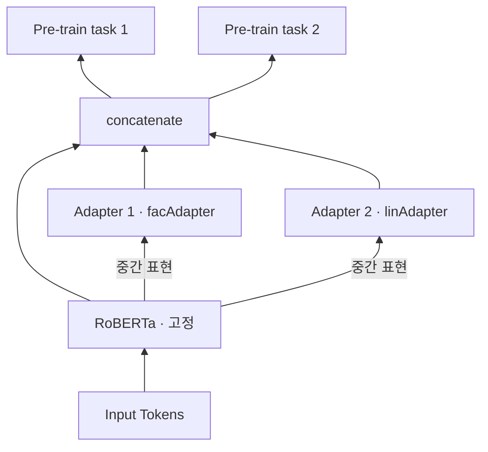

# S21A — K-Adapter: 지식을 어댑터에 따로 담기

> Ch.6 언어모델+KG · Day 11
> 원자료: DSBA Lab Study 강의 슬라이드 중 `01 Introduction` · `02 K-Adapter`
> 참고 논문
> · Wang, Tang, Duan, Wei, Huang, Ji, Cao, Jiang, Zhou (2021), _K-Adapter: Infusing Knowledge
>   into Pre-Trained Models with Adapters_, ACL Findings 2021
>   ([arXiv:2002.01808](https://arxiv.org/abs/2002.01808))
> · 코드 [microsoft/K-Adapter](https://github.com/microsoft/K-Adapter)
>
> 📖 [강의 목차](README.md) · [YouTube 재생목록](https://www.youtube.com/watch?v=f0WV7b3lGqM&list=PLFHGWfB_kmrs)
> 이전 [S20B KEPLER](S20B-KEPLER-두-목적함수를-한-인코더에.md) · 다음 [S21B CoLAKE](S21B-CoLAKE-하나의-그래프로-합치기.md)
> 📎 부록 [S21-1 읽는 데 필요한 것들](S21-1-읽는-데-필요한-것들.md) · [S21-2 여덟 모델을 한 축에](S21-2-여덟-모델을-한-축에.md)

**한 회차를 두 문서로 나눴다.** 이 문서가 도입부와 K-Adapter를, S21B가 CoLAKE와 회차 결론을
다룬다. 절 번호는 문서마다 1부터 다시 시작한다.

**이 문서는 슬라이드 내용만 담는다.** 배경 설명은 [S21-1](S21-1-읽는-데-필요한-것들.md)에,
강의 밖 해석은 [S21-2](S21-2-여덟-모델을-한-축에.md)에 있다.

예문은 `[CLS] Barack Obama was born in Honolulu . [SEP]`로 이어진다.

---

## 1. 배경 — 언어모델이 사실 지식에서 무너지는 방식

**사전학습 언어모델의 강점**

- 대규모 비정형 텍스트에서 언어 패턴을 학습해 문맥·어휘·구문 정보를 반영한 표현을 생성한다
- 하나의 사전학습 모델을 다양한 downstream task에 재사용할 수 있다

**그러나 사실 지식(factual knowledge)을 안정적으로 다루지는 못한다.** 슬라이드가 선행 연구 둘을
든다.

- **Poerner et al. (2019)** — 언어 모델은 엔티티 **이름의 표면형(surface form)**에 기대어 추론할
  뿐 실제 사실 지식은 포착하지 못한다
  - `Mammootty`라는 이름이 인도계라는 것만 보고 모국어를 `Hindi`라고 답한다. 실제 정답은
    `Malayalam`이다
- **Kassner & Schütze (2019)** — BERT는 부정어 `not`의 의미를 대체로 학습하지 못한다

문장 속 표현을 현실 세계의 특정 엔티티와 명시적으로 연결하지 못하고, 엔티티에 관한 구체적
사실을 안정적으로 기억하기 어렵다.

여기서 문장 속 표현을 현실 세계의 엔티티와 명시적으로 연결하고, 지식 그래프에 저장된 구조화된
사실을 언어모델에 주입하려는 연구가 등장한다.

## 2. 기존 지식 주입 방식의 한계

**(A) 모델 전체 파라미터를 다시 학습**

Multi-task learning을 활용해 모델 파라미터를 업데이트하는 방식으로 지식을 주입한다.

| | 무엇이 문제인가 |
|---|---|
| ① Catastrophic forgetting (치명적 망각) | 이전에 주입한 지식이 약화된다 |
| ② Entangled representation | 모든 지식이 하나의 파라미터 뭉치에 섞여, 어떤 지식이 특정 성능 향상에 기여했는지 분리하기 어렵다 |
| ③ 재학습 비용 | 새로운 지식 유형이나 엔티티가 추가될 때 처음부터 다시 학습해야 한다 |

**(B) 별도로 사전학습된 엔티티 임베딩을 사전학습 언어 모델에 주입**

ERNIE(Zhang et al., 2019), KnowBERT(Peters et al., 2019)가 해당한다.

| | 무엇이 문제인가 |
|---|---|
| ① 따로 학습됨 | 엔티티 임베딩은 TransE 등 KE 모델로 미리 학습되고 PLM 학습 중에는 고정된다. 진정한 joint model이 아니다 |
| ② 문맥 손실 | 고정된 벡터 하나로는 지식 그래프 안에서 엔티티가 갖는 풍부한 문맥을 담을 수 없다. 성능 상한이 사전학습 임베딩 품질에 종속된다 |
| ③ 정적임 | 지식 그래프에 새 엔티티가 추가되면 임베딩을 다시 학습해야 한다 |

## 3. 오늘 소개할 두 논문 — 같은 문제, 다른 방향

**K-Adapter (Wang et al., 2021)** — (A) 파라미터를 어떻게 확장할 것인가

- 사전학습 언어모델의 파라미터는 고정한다
- 지식 유형별 **독립 어댑터**를 외부 모듈로 연결한다
- 새 지식을 기존 지식에 영향을 주지 않고 추가할 수 있다

지식의 독립적 주입과 지속적 확장에 초점이 있다.

**CoLAKE (Sun et al., 2020)** — (B) 언어와 지식을 어떻게 함께 표현할 것인가

- 단어, 엔티티, 관계를 하나의 **단어 지식 그래프**(word-knowledge graph, WK graph)로 통합한다
- 엔티티를 주변 지식 서브 그래프의 문맥 속에서 표현한다
- Extended MLM으로 언어와 지식 표현을 공동 학습한다

언어와 지식의 문맥화된 통합 표현에 초점이 있다.

CoLAKE는 [S21B](S21B-CoLAKE-하나의-그래프로-합치기.md)에서 다룬다.

## 4. Motivation — 전체 파라미터를 갱신하는 방식의 두 한계

대부분의 이전 연구는 표준 언어 모델링 목적함수를 지식 기반 목적함수로 보강하고 **전체 모델
파라미터를 업데이트**한다.

- ① 새로운 종류의 지식이 주입될 때 모델 파라미터를 재학습해야 하므로 **이전에 주입된 지식이
  사라진다**
- ② 결과 모델이 **얽힌(entangled) 표현**을 생성하므로, 각 지식 유형이 무엇을 기여했는지 조사할
  수 없다

그래서 여러 종류의 지식이 주입된 다목적 모델을 개발하기 어렵다.

| Model | Knowledge Source | Objective | BERT fixed in training? | Continual knowledge infusion? |
|---|---|---|---|---|
| ERNIE (Zhang et al., 2019) | Wikipedia, WikiData | entity linking | N | N |
| LIBERT (Lauscher et al., 2019) | WordNet | synonym word prediction, hyponym-hypernym prediction | from scratch | N |
| SenseBERT (Levine et al., 2019) | WordNet | word-supersense prediction | from scratch | N |
| KnowBERT (Peters et al., 2019) | Wordnet, Wikipedia, CrossWikis | entity linking, hypernym linking | N | N |
| WKLM (Xiong et al., 2020) | WikiPedia, WikiData | replaced entity detection | N | N |
| BERT-MK (He et al., 2019) | Unified Medical Language System | discriminate between real and fake facts | N | N |
| **K-Adapter (this work)** | Wikipedia, Wikidata, dependency parser | predication prediction, dependency relation prediction | **Y** | **Y** |

마지막 두 열이 이 논문이 세운 축이다. 앞선 여섯 모델은 전부 `N`이다.

## 5. 핵심 아이디어

지식을 사전학습 모델에 직접 주입하지 않고, **지식 종류마다 별도의 소형 신경망(어댑터)에
개별적으로 주입**한다.

- 사전학습 모델의 기존 파라미터는 고정한다 → 지속적인 지식 주입(continual infusion)을 지원한다
- 각 지식을 해당 지식에 특화된 어댑터에 주입한다 → 서로 **분리된(disentangled) 표현**을 생성한다

백본은 RoBERTa(Liu et al., 2019)이고 어댑터는 두 종류다.

| 어댑터 | 무슨 태스크로 사전학습하나 |
|---|---|
| 사실 어댑터 (facAdapter) | 관계 분류 (relation classification) |
| 언어 어댑터 (linAdapter) | 의존 관계 예측 (dependency relation prediction) |



## 6. Knowledge-specific Adapter Layer — 구조

**어댑터란** 사전학습 모델 외부에 플러그인 형태로 결합되는, 적은 수의 파라미터를 가진 지식 특화
모델이다.

- 기존 어댑터(Houlsby et al., 2019)는 Transformer 층 **내부에** 삽입한다
- 이와 달리 각 어댑터는 서로 다른 태스크로 **독립적으로 사전학습**되며, 그 과정에서 판별력 있는
  지식을 주입한다

**Adapter model 1개 = Adapter layer K개**

**Adapter layer 구성**

```
Down-projection (H_d = 768) → Transformer layer × N=2 → Up-projection (H_u = 1024)
```

- 두 projection layer 사이에 **skip-connection**을 적용한다
- Transformer 층 설정은 hidden 768, self-attention head 12다

## 7. Knowledge-specific Adapter Layer — 연결

- 각 어댑터는 사전학습 모델 **외부에** 연결되며, 선택된 Transformer 층의 중간 표현을 전달받는다
- 현재 어댑터 층의 입력 = `[대응 RoBERTa layer의 hidden representation] ⊕ [직전 adapter layer의 출력]`
- 최종 출력 = `[RoBERTa의 마지막 hidden representation] ⊕ [adapter의 마지막 hidden representation]`
  - backbone의 일반 언어 표현과 adapter의 지식 특화 표현을 동시에 downstream layer에 전달한다
  - 여러 Adapter를 사용할 때는 각 Adapter의 최종 출력을 concat해서 쓴다

## 8. Pre-training settings

- **RoBERTa_LARGE**를 사전학습 모델로 사용한다
- Adapter layer 연결 위치는 RoBERTa layer의 **{0, 11, 23}번 layer**다

**파라미터 규모**

| | |
|---|---|
| RoBERTa_LARGE | L=24, H=1024, A=16, **355M** |
| 어댑터 1개 | 약 **42M** (어댑터 층끼리 공유 없음) |

메모리 효율적인 학습이 가능하다. 사전학습 시 RoBERTa는 **고정**하고 어댑터 파라미터만 랜덤
초기화 후 학습한다.

## 9. ① Factual adapter — 관계 분류로 사실 지식을 주입

**사실 지식(Factual knowledge)** 은 사실과 관련된 기본적인 정보다. 자연어에 등장하는 엔티티
간의 관계로부터 획득한다.

**Data**

- T-REx의 Wikipedia abstract과 Wikidata triple 정렬 데이터를 사용한다
- 엔티티 쌍이 50개 미만인 relation을 제거해 **430개 relation, 5.5M 문장**을 수집했다

**사전학습 task** — 문맥을 기반으로 두 엔티티 사이의 관계 레이블 분류하기

- `RoBERTa 마지막 hidden ⊕ facAdapter 마지막 hidden`으로 입력 표현을 구성한다
- 주어진 두 엔티티 구간에 pooling한 뒤 두 엔티티 표현을 concat해 관계 분류를 수행한다

**학습 설정** — cross-entropy, max_len 64(평균 22.8), 5 epoch, batch 128, AdamW lr 2e-5,
4×16G V100

## 10. ② Linguistic adapter — dependency relation을 예측

**언어 지식(Linguistic knowledge)** 은 자연어 텍스트에 암묵적으로 포함된 지식이다(구문 정보와
의미 정보 등). 텍스트에 존재하는 단어 간의 의존 관계로부터 획득한다.

**Data**

- Book Corpus(Zhu et al., 2015) 일부에 Stanford Parser가 제공하는 의존 구문 분석기를 적용해
  **1M dependency-parsed examples**를 구축했다

**사전학습 task** — 문장에 포함된 각 토큰이 의존하는 **head index** 예측하기

- 문장의 각 단어가 구문상 어떤 단어에 걸리는지를 예측한다. 의존 구문 구조가 어댑터에 학습된다
- `RoBERTa 마지막 hidden ⊕ linAdapter 마지막 hidden`으로 입력 표현을 구성한다
- 이후 각 토큰의 입력 표현에 linear layer를 적용해 분류를 수행한다

**학습 설정** — BCEWithLogits loss, max_len 128, 10 epoch, batch 256, AdamW lr 1e-5,
4×16G V100

## 11. Downstream fine-tuning

사전학습 모델의 일반적 정보와 어댑터의 특화된 지식을 결합해 task-specific layer에 전달한다.

- 어댑터 1개 사용 — 해당 어댑터 모델의 최종 출력을 그대로 사용한다
- 여러 개 사용 — 각 출력을 concat한다

**fine-tuning 시에는 어댑터가 고정되고 RoBERTa가 학습된다.**

사전학습과 파인튜닝에서 고정하는 쪽이 서로 반대다.

| | 고정 | 학습 |
|---|---|---|
| 사전학습 | RoBERTa | 어댑터 |
| 파인튜닝 | 어댑터 | RoBERTa |

## 12. 실험 설정

| 태스크 | 데이터셋 | train / dev / test | 지표 |
|---|---|---|---|
| ① Entity Typing | OpenEntity | 2,000 / 2,000 / 2,000 (6 types) | micro-F1 |
| | FIGER | 2,000,000 / 10,000 / 563 (113 types) | strict Acc, macro-F1, micro-F1 |
| ② Question Answering | CosmosQA | 25,588 / 3,000 / 7,000 | Accuracy |
| | SearchQA | 99,811 / 13,893 / 27,247 | EM, F1 |
| | Quasar-T | 28,496 / 3,000 / 3,000 | EM, F1 |
| ③ Relation Classification | TACRED | 68,124 / 22,631 / 15,509 (42 relations) | micro-F1 |

표기는 `F = facAdapter만`, `L = linAdapter만`, `F+L = 둘 다`다.

## 13. Entity Typing

**Task** — 문맥과 엔티티가 주어질 때 그 엔티티의 타입을 예측한다.

- 데이터는 OpenEntity(Choi et al., 2018)와 FIGER(Ling et al., 2015)이고 Zhang et al. (2019)과
  동일한 split 설정을 쓴다
- 파인튜닝에서 엔티티 앞뒤에 특수 토큰 `@`를 추가하고, 첫 번째 `@` 토큰의 표현을 사용해 분류를
  수행한다
- 지표는 OpenEntity가 micro F1, FIGER가 strict accuracy · loose macro F1 · loose micro F1이다

**추가적인 베이스라인** — 이 회차에서 새로 세운 둘이다.

| | 무엇인가 |
|---|---|
| RoBERTa + multitask | 두 사전학습 태스크를 멀티태스크로 학습한 RoBERTa |
| K-Adapter (w/o knowledge) | RoBERTa + **지식이 주입되지 않은** 어댑터 |

| Model | OpenEntity P | R | Mi-F1 | FIGER Acc | Ma-F1 | Mi-F1 |
|---|---|---|---|---|---|---|
| NFGEC (Shimaoka et al., 2016) | 68.80 | 53.30 | 60.10 | 55.60 | 75.15 | 71.73 |
| BERT-base (Zhang et al., 2019) | 76.37 | 70.96 | 73.56 | 52.04 | 75.16 | 71.63 |
| ERNIE (Zhang et al., 2019) | 78.42 | 72.90 | 75.56 | 57.19 | 75.61 | 73.39 |
| KnowBERT (Peters et al., 2019) | 78.60 | 73.70 | 76.10 | - | - | - |
| KEPLER (Wang et al., 2019) | 77.20 | 74.20 | 75.70 | - | - | - |
| WKLM (Xiong et al., 2020) | - | - | - | 60.21 | 81.99 | 77.00 |
| RoBERTa | 77.55 | 74.95 | 76.23 | 56.31 | 82.43 | 77.83 |
| RoBERTa + multitask | 77.96 | 76.00 | 76.97 | 59.86 | 84.45 | 78.84 |
| K-ADAPTER (w/o knowledge) | 74.47 | 74.91 | 76.17 | 56.93 | 82.56 | 77.90 |
| K-ADAPTER (F) | 79.30 | 75.84 | 77.53 | 59.50 | 84.52 | 80.42 |
| K-ADAPTER (L) | 80.01 | 74.00 | 76.89 | 61.10 | 83.61 | 79.18 |
| K-ADAPTER (F+L) | 78.99 | 76.27 | **77.61** | 61.81 | 84.87 | **80.54** |

**결과** — K-Adapter (F+L)가 두 데이터셋에서 일관되게 향상된다. 사실 지식과 언어 지식이 엔티티
유형을 더 정확하게 예측하는 데 도움이 된다.

**Ablation의 결론**

- (F)가 (w/o knowledge)를 유의미하게 상회한다
- OpenEntity에서는 (w/o knowledge)가 RoBERTa보다도 약간 낮다

향상은 **파라미터가 아니라 지식 주입에서 발생함**을 입증한다.

> 이 표에 Ch.6의 네 모델이 모두 들어 있다. ERNIE 75.56 · KnowBERT 76.10 · KEPLER 75.70 ·
> K-Adapter 77.61이다. 다만 KEPLER의 TACRED 값이 15절 표와 S20B 14절 표에서 다르다. 뒤에서
> 다시 적는다.

## 14. Question Answering

**Commonsense QA — CosmosQA (Huang et al., 2019)** 는 상식 기반 독해를 요구하는 객관식 문제다.

- finetuning할 때 입력 토큰 시퀀스를 `<SEP>context</SEP>question</SEP>answer</SEP>`로 구성한다
- 첫 번째 토큰의 표현을 이용해 4개의 정답 후보에 대한 점수를 모두 구하고, 가장 높은 점수를 받은
  후보를 최종 답으로 선택한다

**Open-domain QA — Quasar-T / SearchQA** 는 외부 문서·웹페이지를 이용해 질문에 답하는 문제다.

- 정보 검색 시스템으로 질문과 관련된 문단을 먼저 검색한 뒤 독해로 답을 추출한다
  (Wang et al., 2017b이 제공한 검색 문단 사용)
- 입력을 `<SEP>question</SEP>paragraph</SEP>`로 구성하고 linear layer로 답 span의 start/end
  위치를 예측한다

| Model | SearchQA EM | F1 | Quasar-T EM | F1 | CosmosQA Acc |
|---|---|---|---|---|---|
| BiDAF (Seo et al., 2016) | 28.60 | 34.60 | 25.90 | 28.50 | - |
| AQA (Buck et al., 2018) | 40.50 | 47.40 | - | - | - |
| R³ (Wang et al., 2017a) | 49.00 | 55.30 | 35.30 | 41.70 | - |
| DSQA (Lin et al., 2018) | 49.00 | 55.30 | 42.30 | 49.30 | - |
| Evidence Agg. (Wang et al., 2018) | 57.00 | 63.20 | 42.30 | 49.60 | - |
| BERT (Xiong et al., 2020) | 57.10 | 61.90 | 40.40 | 46.10 | - |
| WKLM (Xiong et al., 2020) | 58.70 | 63.30 | 43.70 | 49.90 | - |
| WKLM + Ranking (Xiong et al., 2020) | 61.70 | 66.70 | 45.80 | 52.20 | - |
| BERT-FT_RACE+SWAG (Huang et al., 2019) | - | - | - | - | 68.70 |
| RoBERTa | 59.01 | 65.62 | 40.83 | 48.84 | 80.59 |
| RoBERTa + multitask | 59.92 | 66.67 | 44.62 | 51.17 | 81.19 |
| K-ADAPTER (F) | 61.85 | 67.17 | 46.20 | 52.86 | 80.93 |
| K-ADAPTER (L) | 61.15 | 66.82 | 45.66 | 52.39 | 80.76 |
| K-ADAPTER (F+L) | **61.96** | **67.31** | **46.32** | **53.00** | **81.83** |

**CosmosQA**

- K-Adapter (F+L)는 RoBERTa 대비 +1.24%로 더 나은 상식 추론 능력을 보인다
- (F)와 (L) 단독은 multitask에 근소하게 낮지만 **(F+L)은 multitask를 뚜렷하게 앞선다**. 여러
  지식 특화 어댑터 조합의 효과다

**Open-domain QA**

- 문단 신뢰도를 쓰지 않고도, 그것을 쓰는 WKLM+Ranking까지 근소하게 앞선다
- 랭킹 보정 없이 주입된 지식만으로 검색된 문단의 이해가 개선된다

## 15. Relation Classification (TACRED)

**태스크** — 주어진 문장에서 두 엔티티 사이의 올바른 관계를 판별한다.

- 데이터는 TACRED(Zhang et al., 2017)로 대규모 관계 분류 데이터셋이다
- 파인튜닝 시 첫 번째 엔티티 앞뒤에 `@`, 두 번째 엔티티 앞뒤에 `#`를 추가하고, 첫 번째 `@`와
  `#` 토큰 표현을 연결해 관계 분류를 수행한다

**베이스라인**

- C-GCN (Zhang et al., 2018) — graph convolutional network로 의존 트리(dependency tree)를
  모델링한다
- BERT-large · BERT+MTB (Baldini Soares et al., 2019) — matching the blanks로 지식 베이스 지도
  없이 관계 표현을 학습한다

| Model | P | R | F1 |
|---|---|---|---|
| C-GCN (Zhang et al., 2018) | 69.90 | 63.30 | 66.40 |
| BERT-base (Zhang et al., 2019) | 67.23 | 64.81 | 66.00 |
| ERNIE (Zhang et al., 2019) | 69.97 | 66.08 | 67.97 |
| BERT-large (Baldini Soares et al., 2019) | - | - | 70.10 |
| BERT+MTB (Baldini Soares et al., 2019) | - | - | 71.50 |
| KnowBERT (Peters et al., 2019) | 71.60 | 71.40 | 71.50 |
| KEPLER (Wang et al., 2019) | 70.43 | 73.02 | 71.70 |
| RoBERTa | 70.17 | 72.36 | 71.25 |
| RoBERTa + multitask | 70.18 | 73.11 | 71.62 |
| K-ADAPTER (F) | 69.39 | 74.59 | 71.89 |
| K-ADAPTER (L) | 68.85 | 75.37 | 71.96 |
| K-ADAPTER (F+L) | 70.14 | 74.04 | **72.04** |

**결과** — K-Adapter 모델들이 모든 베이스라인을 유의미하게 상회한다.

- ① RoBERTa보다 우수한 성능이다. 어댑터로 사전학습 모델에 지식을 주입하는 방식의 효과를 직접
  입증한다
- ② RoBERTa+multitask 대비 더 큰 개선이다. 지식을 개별적으로 주입하는 K-Adapter 방식이 모델의
  지식 활용에 더 효과적이다

> 이 표의 `KEPLER (Wang et al., 2019)` 행이 `70.43 / 73.02 / 71.70`인데,
> [S20B 14절](S20B-KEPLER-두-목적함수를-한-인코더에.md)에 실린 KEPLER 논문 자신의 값은
> `71.5 / 72.5 / 72.0`이다. 인용 연도도 2019로 적혀 있어 TACL 2021 게재본이 아닌 arXiv
> preprint를 인용한 것으로 보인다. 원표기를 그대로 남긴다.

---

## 관련 문서

- [S21B — CoLAKE](S21B-CoLAKE-하나의-그래프로-합치기.md) — 같은 회차의 뒷부분
- [S19A — ERNIE](S19A-ERNIE-엔티티-임베딩-직접-주입.md) · [S19B — KnowBERT](S19B-KnowBERT-엔티티-링커-내장.md) — 2절 (B)가 가리키는 두 모델
- [S20A — K-BERT](S20A-K-BERT-문장에-트리플-끼워넣기.md) · [S20B — KEPLER](S20B-KEPLER-두-목적함수를-한-인코더에.md) — 13·15절 표에 함께 실린 모델
- [S20-2 — 지식을 언제 넣는가](S20-2-지식을-언제-넣는가.md) — 주입 시점 축. 어댑터가 새 칸이다
- [01 — Ch.4~6 종합](01-Ch4-6-무엇이-남고-무엇이-밀렸나.md) — 세 챕터를 가로지르는 관통선
