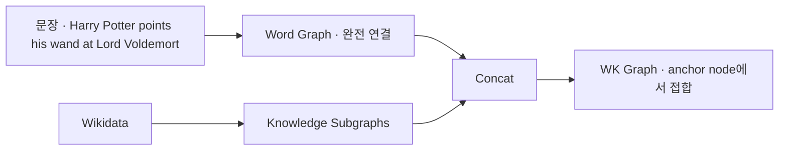

# S21B — CoLAKE: 문장과 KG를 하나의 그래프로 합치기

> Ch.6 언어모델+KG · Day 11
> 원자료: DSBA Lab Study 강의 슬라이드 중 `03 CoLAKE` · `04 Conclusion`
> 참고 논문
> · Sun, Shi, Gong, Zhang, Yang, Yuan, Wei, Qiu, Huang, Zhang (2020), _CoLAKE: Contextualized
>   Language and Knowledge Embedding_, COLING 2020
>   ([arXiv:2010.00309](https://arxiv.org/abs/2010.00309))
> · 코드 [txsun1997/CoLAKE](https://github.com/txsun1997/CoLAKE)
>
> 📖 [강의 목차](README.md) · [YouTube 재생목록](https://www.youtube.com/watch?v=f0WV7b3lGqM&list=PLFHGWfB_kmrs)
> 이전 [S21A K-Adapter](S21A-K-Adapter-어댑터에-따로-담기.md) · 다음 S22 COMET · Pretrained Encyclopedia
> 📎 부록 [S21-1 읽는 데 필요한 것들](S21-1-읽는-데-필요한-것들.md) · [S21-2 여덟 모델을 한 축에](S21-2-여덟-모델을-한-축에.md)

**한 회차를 두 문서로 나눴다.** [S21A](S21A-K-Adapter-어댑터에-따로-담기.md)가 도입부와
K-Adapter를, 이 문서가 CoLAKE와 회차 결론을 다룬다. 절 번호는 문서마다 1부터 다시 시작한다.

**이 문서는 슬라이드 내용만 담는다.** 배경 설명은 [S21-1](S21-1-읽는-데-필요한-것들.md)에,
강의 밖 해석은 [S21-2](S21-2-여덟-모델을-한-축에.md)에 있다.

예문은 `Harry Potter points his wand at Lord Voldemort`로 이어진다.

---

## 1. Motivation — 엔티티 임베딩 주입의 세 가지 한계

언어모델은 여러 NLP 과제에서 큰 향상을 이뤘으나 사실 지식을 포착하는 데 어려움을 겪는다. 이를
보완하기 위해 사전학습된 엔티티 임베딩을 사전학습된 언어 모델에 주입하는 접근이 널리 쓰인다.
ERNIE와 KnowBERT가 그것이다.

| | 무엇이 문제인가 |
|---|---|
| ① 따로 학습된다 | 엔티티 임베딩은 TransE 같은 지식 임베딩 모델로 따로 학습되고 사전학습 언어모델의 학습 중에는 고정된다. 지식 임베딩과 언어 임베딩을 동시에 학습하는 엄밀한 의미의 joint model이 아니다 |
| ② 엔티티 임베딩만 쓴다 | 지식 그래프 안의 그 엔티티가 가지는 풍부한 문맥 정보를 담지 못한다. 성능이 사전학습 임베딩의 품질에 종속된다 |
| ③ 정적(static)이다 | 지식 그래프가 조금만 바뀌어도(새 엔티티 추가 등) 재학습이 필요하다 |

여기서 언어 표현과 사실 지식을 더 효과적으로 통합할 수 있는 모델을 탐색하도록 동기가 생긴다.

## 2. 예시 — 왜 벡터 하나로는 부족한가

같은 엔티티인데 문장에 따라 필요한 사실이 다르다.

```
(1) "Harry Potter points his wand at Lord Voldemort."
    → (Harry_Potter, enemy of, Lord_Voldemort) 필요

(2) "You have Lily's hazel eyes," he told Harry Potter.
    → (Harry_Potter, mother, Lily_Potter) 필요
```

**기존 방식은 엔티티에 하나의 고정된 벡터를 사용한다.** 고정된 엔티티 벡터만으로는 문장에 따라
달라지는 관련 사실을 충분히 반영하기 어렵다.

**CoLAKE는 엔티티에 관한 knowledge context를 고려한다.** 같은 Harry Potter 엔티티라도 문장에
따라 서로 다른 사실을 활용한다.

- `(Harry_Potter, enemy of, Lord_Voldemort)`에 직접 접근해 문장 (1)을 이해한다
- `(Harry_Potter, mother, Lily_Potter)`에 접근해 문장 (2)를 이해한다

Harry Potter의 지식 문맥은 Harry Potter와 관련된 트리플을 포함하는 하위 그래프로 구성된다.

슬라이드 그림이 두 계열을 나눈다. ERNIE와 KnowBERT는 `vec(Harry_Potter)`를 쓰는
**Semi-contextualized Joint Models**이고, CoLAKE는 `subgraph(Harry_Potter)`를 쓰는
**Contextualized Joint Models**다.

## 3. 핵심 아이디어

**엔티티를 knowledge context와 language context에 따라 동적으로 표현한다.**

- knowledge context는 그 엔티티를 둘러싼, 그에 관한 트리플로 이루어진 서브그래프다. 문장마다
  다른 사실을 배경지식으로 꺼내 쓴다

**구조** — 언어와 지식 그래프의 이질적 구조를 **word-knowledge graph (WK graph)** 하나로
통합한다.

- Transformer는 입력 시퀀스를 완전 연결 word graph로 처리한다. WK graph는 해당 그래프에 지식을
  추가한다
- WK graph를 인접 행렬과 함께 인코더에 넣어 정보 흐름이 그래프 구조를 반영하도록 제어한다
- 본질적으로 **사전학습된 GNN**이며 구조를 인지하고(structure-aware) 확장이 쉽다

**학습** — MLM 목적함수를 입력 그래프 전체로 확장한다. 하나의 목적함수로 문맥화된 언어 표현과
지식 표현을 동시에 학습한다.

## 4. Graph Construction — 그래프가 공통 자료구조인 이유

| | 무엇을 입력으로 받나 |
|---|---|
| 언어 임베딩 모델 | 시퀀스 |
| 지식 임베딩 모델 | 트리플이나 지식 서브그래프 |

Transformer의 Self-Attention에서는 각 토큰이 다른 모든 토큰을 참조한다. **입력 시퀀스를 완전
연결된 Word Graph로 해석할 수 있다.**

따라서 Word Graph와 Knowledge Subgraph를 결합해 언어와 지식을 하나의 WK Graph로 통합한다.

## 5. WK graph 구성 절차

**① 문장 그래프 구성** — 문장을 토큰 시퀀스로 분할하고 모든 토큰을 완전 연결해 word graph를
구성한다.

```
[CLS] Harry Potter points his wand at Lord Voldemort [SEP]
```

이 각각이 노란 word node다.

**② 엔티티 연결** — 문장 속 멘션을 인식하고 entity linker로 지식 그래프의 대응 엔티티를 탐색한
뒤, 멘션 위치를 엔티티 노드로 치환한다.

- 멘션 `Harry Potter` → Wikidata 엔티티 `Harry_Potter`로 치환 → **anchor node**
- 연결된 엔티티와 멘션 단어가 벡터 공간에서 서로 가까워지도록 유도한다

**③ 지식 서브그래프 구성** — 각 anchor node 중심으로 KG에서 그 엔티티가 포함된 트리플을 추출해
서브그래프(knowledge context)를 만든다.

```
(Harry_Potter, mother, Lily_Potter)
(Harry_Potter, spouse, Ginny_Weasley)
```

**④ WK Graph 완성** — 추출된 Knowledge Subgraph과 word graph를 **anchor node에서 연결**한다.

> 슬라이드 각주. 멘션(mention)은 문장 안에서 어떤 엔티티를 가리키는 표현이다.



## 6. 실제 구성 설정과 네 종류의 노드

**실제 구성 설정**

- anchor node당 **최대 15개**의 이웃 관계·엔티티를 랜덤 선택한다
- anchor node가 **head(주어)인 트리플만** 사용한다. tail(목적어)인 경우는 제외한다
- WK graph 안에서 **엔티티는 유일하지만 관계는 중복이 허용**된다

**네 종류의 노드**

| 노드 | 무엇인가 |
|---|---|
| Word node | 문장의 토큰. 서로 완전 연결되어 있다 |
| Entity node | KG에서 가져온 엔티티 |
| Relation node | 노드로 **승격된** 관계 |
| Anchor node | 문장의 멘션이자 KG의 엔티티. **언어와 지식 두 세계를 잇는 유일한 접점** |

그림에서 안쪽 점선 원이 완전 연결 word graph이고, 바깥 점선 원이 KG에서 추출한 knowledge
서브그래프다.

## 7. Embedding Layer

WK graph를 Transformer 인코더에 입력하기 위해 vanilla Transformer의 임베딩 층과 인코더 층을
수정한다.

```
입력 임베딩 = token embedding + type embedding + position embedding
```

**① Token embedding** — word / entity / relation 세 개의 lookup 테이블을 쓴다.

- Word는 RoBERTa를 따라 BPE로 입력 시퀀스를 서브워드 단위로 변환한다. 대규모 어휘를 다루기
  위함이다
- Entity와 Relation은 일반적인 지식 임베딩 방법처럼 각 엔티티와 관계에 대한 임베딩을 직접
  학습한다
- 세 임베딩은 같은 차원이며, 이를 어휘 축으로 연결해 전체 token embedding을 구성한다

**② Type embedding** — word / entity / relation 중 무엇인지를 알려준다.

**③ Position embedding** — 주입된 엔티티와 관계에도 위치 인덱스를 부여한다.

- **soft-position index**를 채택한다
- 위치 인덱스 중복을 허용하고, 같은 트리플에 속한 토큰은 연속된 번호를 갖게 한다
- word graph는 0~7이고 주입된 트리플은 `2·3·2·3·2`처럼 반복한다

## 8. Masked Transformer Encoder

WK 그래프의 구조가 정보 흐름에 반영되도록 masked multi-head self-attention을 사용한다.

그래프 노드는 `X ∈ R^(n×d)`이고 `n`이 노드의 개수, `d`가 각 노드의 차원이다.

```
(1)  Q, K, V = X W^Q, X W^K, X W^V
(2)  A = Q K^T / √d_k
(3)  Attn(Q, K, V) = Softmax(A + M) V
(4)  M_ij = 0      if x_i and x_j are connected
           −inf    if x_i and x_j are disconnected
```

슬라이드가 오른쪽에 붙인 설명이다.

- (1)과 (2)는 표준 Transformer와 동일하다. **CoLAKE가 더한 것은 (3)의 `A + M` 하나뿐이다**
- `W^Q, W^K, W^V ∈ R^(d×d_k)`는 학습 가능한 파라미터다
- 연결됨 → 0을 더한다(점수 그대로) / 연결 안 됨 → `−inf` → softmax 후 attention 가중치 = 0

**연결되지 않은 노드는 서로 보지 못한다. 인접 행렬이 attention에 그대로 새겨진다.**

- 각 Encoder Layer에서 모든 노드는 자신의 **1-hop 이웃** 정보만 수집한다
- Encoder Layer가 쌓이면 여러 Hop을 거쳐 먼 노드의 정보도 반영할 수 있다. 그 이웃도 직전 층에서
  자기 이웃을 흡수했기 때문이다

그래서 CoLAKE는 본질적으로 "사전학습된 GNN"이다.

## 9. Pre-Training Objective — Masking Strategy

MLM 학습 목적은 입력의 일부 토큰을 무작위로 마스킹하고 주변 문맥으로 원래 vocabulary id를
예측하도록 학습하는 것이다. **CoLAKE는 word sequence 기반 MLM에서 WK graph 전체로 확장한다.**

그래프 노드의 **15%**를 무작위로 마스킹하고 다음과 같이 교체한다.

| 비율 | 무엇으로 |
|---|---|
| 80% | `[MASK]` 토큰으로 교체 |
| 10% | 원래 노드와 **같은 타입의** 무작위 노드로 교체 |
| 10% | 원본 노드 그대로 유지 |

모델은 마스킹된 Word, Entity, Relation을 각각의 Classification Head로 예측한다.

**Anchor Node 예측 보완**

- Knowledge Context만으로 Masked Anchor Node를 쉽게 복원하는 현상을 방지한다
- Pre-training 중 **50% 확률로 Anchor Node의 이웃을 제거**한다

## 10. Pre-Training Objective — 노드 타입별로 다른 능력

서로 다른 타입의 노드가 마스킹되므로 서로 다른 측면의 능력을 학습하도록 유도한다.

**① Word node 마스킹** — 전통적 MLM과 유사하다.

- 차이는 문맥 단어뿐 아니라 WK graph의 엔티티·관계까지 활용해 마스킹된 단어를 예측할 수 있다는
  점이다
- CoLAKE가 언어 지식(linguistic knowledge)을 학습하도록 돕는다

**② Entity node 마스킹**

- anchor node인 경우 — 문맥으로 anchor node를 예측한다. **언어와 지식의 표현 공간을 정렬하는 데
  도움**이 된다
- anchor node가 아닌 경우 — semantic matching 기반 지식 임베딩 방식(ConvE, CoKE)과 유사하다.
  대량의 엔티티 임베딩 학습이 가능하다

(a) 단어와 엔티티를 공통 표현 공간에 매핑하고 (b) 엔티티의 문맥화된 표현을 학습하도록 돕는다.

**③ Relation node 마스킹**

- 두 unique anchor node 사이인 경우 — 텍스트 속 두 엔티티의 관계 분류다(원격 지도 관계 추출과
  유사)
- 그 외 — 이웃한 두 엔티티 사이의 관계를 예측한다. 전통적 지식 임베딩 방법과 유사하다
  (Craven & Kumlien, 1999)

(a) 관계 추출을 학습하고 (b) 관계의 문맥화된 표현을 학습하도록 돕는다.

## 11. Model Training

CoLAKE는 cross-entropy loss로 학습하며 세 종류의 노드를 예측하기 위해 **분류 헤드 3개**를
사용한다. 그러나 실제로는 엔티티 수가 많아 학습과 예측 모두 어렵다.

**① Mixed CPU-GPU Training** — 학습의 어려움에 대한 대응이다.

- KG의 엔티티가 너무 많아 모델 전체를 GPU에서 학습하는 것은 불가능하다
- 엔티티 임베딩은 **CPU 메모리에서 비동기적으로** 업데이트하고, 모델의 나머지 구성요소는 GPU에서
  업데이트한다
- 구현 기반은 DGL-KE의 분산 key-value store(KVStore)다 (Zheng et al., 2020)

**② Negative Sampling** — 예측의 어려움에 대한 대응이다.

- 엄청난 수의 엔티티에 Softmax를 적용하는 것은 매우 느리다
- KG의 전체 `n`개 엔티티가 아니라 **positive 엔티티 1개 + negative 엔티티 `k`개(`k ≪ n`)**에
  대해서만 각 엔티티 예측을 수행한다
- Mikolov et al. (2013)을 따라 3/4 제곱한 엔티티 빈도 분포에서 negative 엔티티를 샘플링한다

## 12. Pre-Training Data & Implementation

실험 구성은 knowledge-driven · knowledge probing · language understanding 세 종류 태스크다.

**사전학습 데이터 구축**

- English Wikipedia(2020/03/01) 덤프를 WikiExtractor로 처리한다
- Wikipedia anchor(하이퍼링크)를 이용해 텍스트를 **Wikidata5M**(Wang et al., 2019c)에 정렬한다
  - Wikidata5M은 약 2,100만 개의 사실 트리플을 포함하는 대규모 지식 그래프다
- WK graph를 학습 샘플로 구성하고, 엔티티 노드·관계 노드가 없는 샘플은 제거한다
- 최종적으로 **26M 학습 샘플**로 인코더 + 엔티티 임베딩 3,085,345개 + 관계 임베딩 822개를 함께
  사전학습한다

**구현 세부**

| | |
|---|---|
| 인코더 초기화 | RoBERTa_BASE (Liu et al., 2019)의 파라미터 |
| 엔티티·관계 임베딩 초기화 | Wang et al. (2019c)가 제공한 alias를 BPE 토큰으로 쪼갠 뒤 그 RoBERTa_BASE 임베딩들의 평균 |
| 옵티마이저 | AdamW (β₁=0.9, β₂=0.98), batch size 2048, learning rate 1e-4, 1 epoch |
| negative | anchor node당 `k = 200` |
| 하드웨어 | 8 × 32G NVIDIA V100, 38시간 |

Wikidata5M이 [S20B](S20B-KEPLER-두-목적함수를-한-인코더에.md)에서 KEPLER가 만든 데이터셋이다.

## 13. Knowledge-Driven Tasks

**공통 설정** — 문장의 엔티티를 주석하기 위해 TAGME(Ferragina & Scaiella, 2010)로 엔티티 멘션을
지식그래프 엔티티와 연결한다.

- Poerner et al. (2019)의 방법을 따라 텍스트 멘션 형태와 엔티티 형태의 토큰을 concat한다
  - `Jean Mara ##is Jean_Marais`

**1. Entity Typing** — 엔티티 멘션의 의미 타입을 그 표면형과 문맥에 근거해 분류한다.

- 분류 대상 엔티티 멘션 앞뒤에 `[ENT]` / `[/ENT]` 두 특수 토큰을 추가하고 `[CLS]` 최종 표현을
  분류한다
- Open Entity(Choi et al., 2018)는 ERNIE·KnowBERT·KEPLER와 같은 **9개 general type 설정**을
  적용한다

**2. Relation Extraction** — 문장에 언급된 두 엔티티 사이의 관계를 분류한다.

- `[HD]` / `[/HD]`, `[TL]` / `[/TL]`로 head·tail을 표시하고 `[CLS]` 최종 표현을 분류기에
  입력한다
- FewRel(Han et al., 2018)은 Wikidata 기반이라 **테스트셋 트리플을 사전학습 데이터에서
  제거**했다

| Model | Open Entity P | R | F | FewRel P | R | F |
|---|---|---|---|---|---|---|
| BERT (Devlin et al., 2019) | 76.4 | 71.0 | 73.6 | 85.0 | 85.1 | 84.9 |
| RoBERTa (Liu et al., 2019) | 77.4 | 73.6 | 75.4 | 85.4 | 85.4 | 85.3 |
| ERNIE (Zhang et al., 2019) | 78.4 | 72.9 | 75.6 | 88.5 | 88.4 | 88.3 |
| KnowBERT (Peters et al., 2019) | **78.6** | 73.7 | 76.1 | - | - | - |
| KEPLER (Wang et al., 2019c) | 77.8 | 74.6 | 76.2 | - | - | - |
| E-BERT (Pörner et al., 2019) | - | - | - | 88.6 | 88.5 | 88.5 |
| CoLAKE (Ours) | 77.0 | **75.7** | **76.4** | **90.6** | **90.6** | **90.5** |

- Open Entity는 F1 76.4로 최고다
- FewRel은 F1 90.5로 **격차가 크다**. 관계 노드를 마스킹해 학습한 효과가 관계 추출에서 직접
  나타난다

## 14. Knowledge Probing

**LAMA**(Petroni et al., 2019)는 빈칸 채우기 형식의 문장을 이용해 언어 모델에 저장된 사실 지식을
측정한다. 예로 `Dante was born in [MASK]`다.

- **LAMA-UHN**(Pörner et al., 2019)은 엔티티 이름만 보고도 맞힐 수 있는 쉬운 문항을 걸러낸 더
  "사실적인" 데이터셋이다
- 지표 **P@1**은 모델이 1순위로 예측한 토큰이 정답일 비율이다
  - 관계 종류마다 따로 정확도를 구한 뒤 관계끼리 평균한다(macro-average). 문항이 많은 관계가
    결과를 지배하지 않도록 하기 위함이다
- 공정 비교를 위해 모든 모델의 어휘 교집합(약 18K case-sensitive 토큰)으로 공통 어휘를 구성한다

| Corpus | ELMo | ELMo5.5B | BERT | RoBERTa | CoLAKE | K-Adapter* |
|---|---|---|---|---|---|---|
| LAMA-Google-RE | 2.2 | 3.1 | **11.4** | 5.3 | 9.5 | 7.0 |
| LAMA-UHN-Google-RE | 2.3 | 2.7 | **5.7** | 2.2 | 4.9 | 3.7 |
| LAMA-T-REx | 0.2 | 0.3 | **32.5** | 24.7 | 28.8 | 29.1 |
| LAMA-UHN-T-REx | 0.2 | 0.2 | **23.3** | 17.0 | 20.4 | 23.0 |

**결과**

- BERT가 RoBERTa를 큰 폭으로 앞선다. K-Adapter 논문도 같은 현상을 보고한다
  - 저자들의 추정으로는 RoBERTa의 더 크고 byte-level BPE 기반인 어휘가 주요 원인이다
- 그럼에도 CoLAKE는 모든 데이터셋에서 RoBERTa_BASE를 상회한다. LARGE 모델인 K-Adapter보다도
  높다 (Google-RE +2.5, UHN +1.2)

## 15. Language Understanding Tasks

**GLUE**(Wang et al., 2019a)는 다양한 자연어 이해(NLU) 태스크의 모음이다. 이 태스크들은 사실
지식이 거의 필요 없다. **CoLAKE가 지식을 통합하는 과정에서 일반적인 자연어 이해 성능을
저하시키는지 확인하기 위함**이다.

| Model | MNLI (m/mm) | QQP | QNLI | SST-2 | CoLA | STS-B | MRPC | RTE | AVG. |
|---|---|---|---|---|---|---|---|---|---|
| RoBERTa | **87.5 / 87.3** | 91.9 | **92.8** | **94.8** | **63.6** | **91.2** | 90.2 | **78.7** | **86.4** |
| KEPLER | 87.2 / 86.5 | 91.5 | 92.4 | 94.4 | 62.3 | 89.4 | 89.3 | 70.8 | 84.9 |
| CoLAKE | 87.4 / 87.2 | **92.0** | 92.4 | 94.6 | 63.4 | 90.8 | **90.9** | 77.9 | 86.3 |

**결과** — RoBERTa 대비 약간 낮지만(86.4 → 86.3), 같은 RoBERTa_BASE로 초기화된 KEPLER 대비
평균 +1.4%다 (RTE 70.8 → 77.9).

WK graph라는 이질적 구조로 언어와 지식을 동시에 모델링해도 언어 능력이 희생되지 않는다.

## 16. Word-Knowledge Graph Completion — 설계

**설계 의도** — CoLAKE가 구조 인지적(structure-aware)이고 미관측 엔티티로 일반화되는지
확인한다.

**태스크 정의**

- FewRel 테스트셋으로 구성한다
- 각 샘플 = 트리플 `(h, r, t)` + **그 트리플을 표현하는 문장**. 모델은 관계 `r`을 예측한다

**두 가지 실험 설정**

| | 어떤 설정인가 |
|---|---|
| Transductive (10K) | 각 샘플의 두 엔티티 `h`와 `t`, 관계 `r`은 모두 학습 과정에서 관찰된다. 단 트리플 `(h, r, t)` 자체는 학습 데이터에 없다 |
| Inductive (1K) | 최소 한 엔티티는 학습 중 본 적이 없다. 이웃 노드로부터 그 엔티티를 추론해야 한다 |

그림에서 transductive는 관계 자리를 `[MASK]`로 두고, inductive는 엔티티 자리까지 `[MASK]`로
두어 이웃 서브그래프로 채운다.

## 17. Word-Knowledge Graph Completion — 결과

**베이스라인**은 link prediction의 대표 모델들이다.

- Transductive — TransE · DistMult · ComplEx · RotatE. DGL-KE(Zheng et al., 2020)를 이용해
  Wikidata5M에서 학습했다
- Inductive — DKRL (Xie et al., 2016)

| Model | MR ↓ | MRR | HITS@1 | HITS@3 | HITS@10 |
|---|---|---|---|---|---|
| *Transductive setting* | | | | | |
| TransE (Bordes et al., 2013) | 15.97 | 67.30 | 60.28 | 70.96 | 79.75 |
| DistMult (Yang et al., 2015) | 27.09 | 60.56 | 48.66 | 69.69 | 79.61 |
| ComplEx (Trouillon et al., 2016) | 26.73 | 61.09 | 49.80 | 70.64 | 79.78 |
| RotatE (Sun et al., 2019) | 30.36 | 70.90 | 64.74 | 74.89 | 81.05 |
| CoLAKE | **2.03** | **82.48** | **72.14** | **92.19** | **98.58** |
| *Inductive setting* | | | | | |
| DKRL (Xie et al., 2016) | 168.21 | 8.18 | 5.03 | 7.28 | 14.13 |
| CoLAKE | **31.01** | **28.10** | **15.69** | **30.28** | **58.05** |

**결론** — Transductive와 Inductive 두 설정에서 CoLAKE가 우수한 성능을 보인다.

- 전통적인 지식 임베딩 모델은 구조적 정보만 처리한다. CoLAKE는 **구조적 지식과 텍스트 의미를
  함께** 사용할 수 있다
- DKRL과 KEPLER는 엔티티 **설명문**에서 임베딩을 만들지만 CoLAKE는 **이웃 노드로부터**
  생성한다

"본질적으로 사전학습된 그래프 신경망"이라는 주장의 가장 강력한 증거다.

> 이 표의 값이 [S20B 17절](S20B-KEPLER-두-목적함수를-한-인코더에.md)의 Wikidata5M link
> prediction 표와 자릿수가 다르다(TransE MRR 67.30 대 25.3). 태스크가 다르기 때문이다. 여기서는
> 트리플을 표현하는 문장이 함께 주어지고 예측 대상이 관계 하나다. S20B는 문장 없이 엔티티를
> 맞힌다. 같은 이름의 모델이라도 두 표를 가로질러 비교하면 안 된다.

## 18. Conclusion

**문제의 출발점** — 지식 그래프/온톨로지의 명시적 지식을 주입할 때 병목이 둘이다.

| | 무엇이 막히나 |
|---|---|
| (A) 파라미터 | 전체를 갱신하면 새 지식이 앞의 지식을 지운다 |
| (B) 표현 | 미리 학습해 둔 정적 엔티티 벡터 하나로는 KG의 문맥을 담을 수 없다 |

**(A) K-Adapter** — 사전학습된 언어 모델을 고정하고 지식별 어댑터를 바깥에 붙이는 접근이다.

- 새 지식이 기존 지식을 위해 학습된 파라미터에 영향을 주지 않는다. continual knowledge infusion을
  지원한다
- 사실 지식과 언어 지식 두 어댑터는 각각도 유의미하게 향상하고, 함께 쓰면 더 큰 향상이 있다

**(B) CoLAKE** — 엔티티를 벡터가 아니라 **서브그래프**로 보고, 단어 그래프와 접합한 WK graph를
하나의 MLM으로 학습한다.

- 언어 문맥과 지식 문맥을 통합 자료구조 WK graph 하나로 통합한다. 문맥화된 지식 표현을 얻고 새
  엔티티로 inductive 확장이 된다
- 자체 설계한 WK graph completion이, CoLAKE가 본질적으로 structure-aware하고 inductive한 강력한
  GNN임을 보인다

---

## 관련 문서

- [S21A — K-Adapter](S21A-K-Adapter-어댑터에-따로-담기.md) — 같은 회차의 앞부분
- [S20B — KEPLER](S20B-KEPLER-두-목적함수를-한-인코더에.md) — Wikidata5M을 만든 논문. 17절 주석의 비교 대상
- [S20A — K-BERT](S20A-K-BERT-문장에-트리플-끼워넣기.md) — soft-position과 attention 마스킹을 먼저 쓴 모델
- [S14A — R-GCN](S14A-R-GCN-관계별-메시지-전달.md) — 8절이 말하는 GNN의 메시지 전달
- [S20-2 — 지식을 언제 넣는가](S20-2-지식을-언제-넣는가.md) — 주입 시점 축
- [01 — Ch.4~6 종합](01-Ch4-6-무엇이-남고-무엇이-밀렸나.md) — 세 챕터를 가로지르는 관통선
