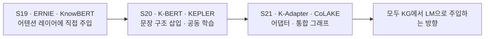
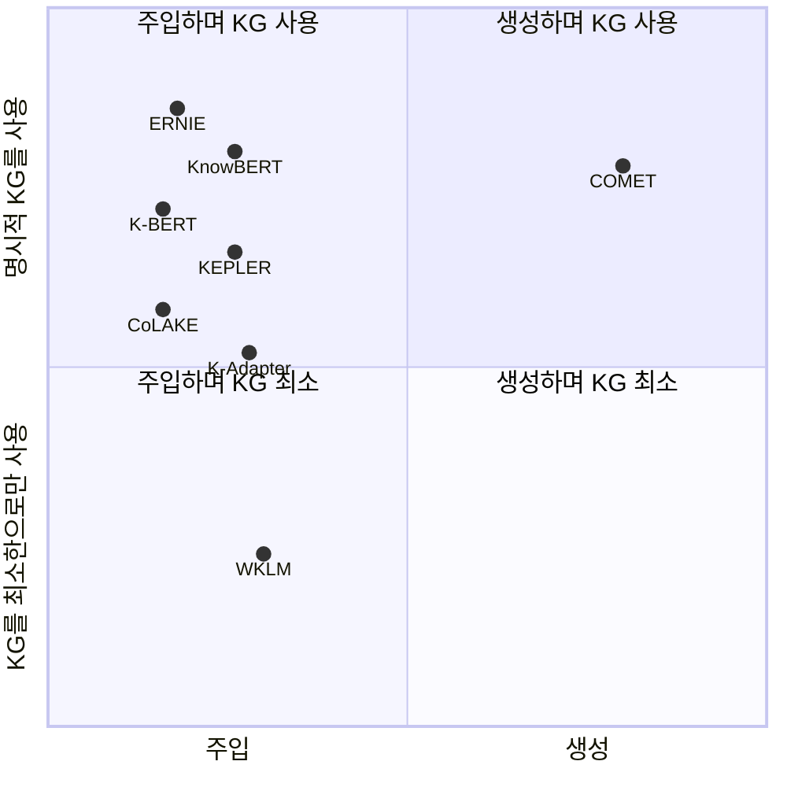

# S22A — COMET: 언어모델로 상식 지식그래프를 만든다

> Ch.6 언어모델+KG · Day 11
> 원자료: DSBA Lab Study 강의 슬라이드 중 `01 Introduction` · `02 COMET` (덱 5~29쪽)
> 참고 논문
> · Bosselut, Rashkin, Sap, Malaviya, Celikyilmaz, Choi (2019), _COMET: Commonsense Transformers
>   for Automatic Knowledge Graph Construction_, ACL 2019
>   ([arXiv:1906.05317](https://arxiv.org/abs/1906.05317))
> · 코드 [atcbosselut/comet-commonsense](https://github.com/atcbosselut/comet-commonsense) ·
>   데모 [mosaickg.apps.allenai.org](https://mosaickg.apps.allenai.org/)
>
> 📖 [강의 목차](README.md) · [YouTube 재생목록](https://www.youtube.com/watch?v=f0WV7b3lGqM&list=PLFHGWfB_kmrs)
> 이전 [S21B CoLAKE](S21B-CoLAKE-하나의-그래프로-합치기.md) · 다음 [S22B WKLM](S22B-WKLM-텍스트에서-직접-배우기.md)
> 📎 부록 [S22-1 읽는 데 필요한 것들](S22-1-읽는-데-필요한-것들.md) · [S22-2 방향이 뒤집힌 회차](S22-2-방향이-뒤집힌-회차.md)

**한 회차를 두 문서로 나눴다.** 이 문서가 도입부와 COMET을, S22B가 WKLM과 회차 결론을 다룬다.
절 번호는 문서마다 1부터 다시 시작한다.

**이 문서는 슬라이드 내용만 담는다.** 배경 설명은 [S22-1](S22-1-읽는-데-필요한-것들.md)에,
강의 밖 해석은 [S22-2](S22-2-방향이-뒤집힌-회차.md)에 있다.

예문은 `take a nap —Causes→ have energy`와 `PersonX goes to the mall —xIntent→ to buy clothes`로
이어진다.

---

## 1. 한 장 요약 — 두 논문

|  | COMET (ACL 2019) | WKLM (ICLR 2020) |
|---|---|---|
| 한 줄 | 사전학습 LM을 상식 KG 생성기로 fine-tuning | 엔티티 치환을 약한 지도 신호로 삼아 LM에 지식 주입 |
| 지식의 흐름 | LM 안의 암묵지 → 명시적 트리플로 출력 | 텍스트 속 사실 → LM 파라미터로 내재화 |
| 백본 | GPT (12L / 768d / 12H) | BERT-base (12L / 768d) |
| 지식 소스 | ATOMIC · ConceptNet (seed tuple) | English Wikipedia + Wikidata 타입 |
| 산출물 | 새로운 노드·엣지 (자연어 구) | 더 나은 문장 표현 (파라미터) |
| 대표 수치 | 사람 평가 77.5% (ATOMIC) / 91.7% (ConceptNet) | Fact completion Hits@10 28.9 (BERT-large 16.1) |

두 논문은 정반대 방향이지만 문제의식은 같다. KG는 항상 불완전하다.

## 2. Ch.6 안에서 S22의 위치



- **COMET** — LM이 KG를 만든다. KG는 학습 목표로만 쓰이고 출력이 KG다
- **WKLM** — 방향은 주입으로 같지만, Wikidata를 오직 negative sampling의 타입 제약에만 쓴다

질문이 "어디에 넣을까"에서 "넣는 게 맞나 / 꺼내면 어떤가"로 바뀐다.

## 3. Positioning — 두 축 위의 자리



세로축은 명시적 KG를 얼마나 쓰는지, 가로축은 지식을 넣는지 꺼내는지다. S19~S21 여섯 모델이 모두
왼쪽 위에 몰려 있고, COMET만 오른쪽으로 건너간다. WKLM은 같은 왼쪽이지만 아래로 내려온다.

> 슬라이드의 세로축 라벨은 "명시적 KG를 **입력으로** 사용"인데, 같은 슬라이드의 COMET 설명은
> "KG를 학습 목표로만 사용"이다. COMET은 KG를 입력으로 받지 않으므로 축 라벨과 설명이 어긋난다.
> 원표기를 남긴다. 축을 다시 세운 것은 [S22-2 3절](S22-2-방향이-뒤집힌-회차.md)에 있다.

## 4. 공통 문제의식 — KG의 불완전성

실제 세계의 지식을 셋으로 나눈다.

- **텍스트에 명시된 것** — OpenIE가 잡는 영역
- **수작업 큐레이션** — Cyc · WordNet
- **빈 영역** — "사람은 숨을 쉰다" 같은 상식은 대개 텍스트에 쓰이지 않는다
  (reporting bias, Gordon & Van Durme 2013)

빈 영역이 생기는 이유가 셋이다.

| 한계 | 내용 |
|---|---|
| 수작업 큐레이션 | 정밀도는 높지만 개념 커버리지 확보가 어렵다 |
| 추출 방식 | OpenIE는 명시적으로 쓰인 관계만 잡는다 |
| 스키마 | 상식은 열린 자연어 구를 다뤄야 한다 |

COMET은 생성 모델로 빈 영역을 채우고, WKLM은 빈 영역을 우회해 텍스트에서 직접 배운다. 두 논문
모두 "KG를 다 채울 수 없다"는 전제에서 출발한다.

## 5. Overview — COMmonsEnse Transformers

- ATOMIC과 ConceptNet, 두 상식 KG에 대한 최초의 포괄적 자동 구축 연구다
- 핵심 주장은 상식 KB 완성의 다음 단계가 생성 모델이라는 것이다
- 사전학습 트랜스포머를 seed 트리플로 fine-tuning해 암묵지를 명시적 트리플로 전이한다

**기여 세 가지**

- KB 구축을 생성 문제로 재정의했다
- 대규모 LM으로 상식 트리플을 만드는 프레임워크를 제시했다
- 품질·신규성·다양성과 seed 개수 효율성을 실증했다

결과는 사람 평가 top-1 정확도로 ATOMIC 77.5%, ConceptNet 91.7%다. 해당 리소스의 사람 성능에
근접한다.

## 6. 상식과 스키마 — completion이 아니라 construction

| | 백과사전 KG (Freebase · YAGO) | 상식 KG (ATOMIC · ConceptNet) |
|---|---|---|
| 노드 | 정규화된 엔티티 (Q-id) | 열린 자연어 구 |
| 관계 | 고정 스키마 | 느슨하게 정의된 관계 집합 |
| 완결성 | 링크 예측으로 채운다 | 새 노드 자체를 생성해야 한다 |

`Obama —born_in→ Hawaii`는 Q76에서 Q782로 가는 링크라 예측 문제로 풀린다.
`PersonX puts X's trust in Y —xIntent→ "to be trusting"`은 목적어가 열린 구라서 후보 집합
자체가 없다.

핵심은 KB completion(기존 노드 간 링크 점수화)이 아니라 KB construction(새 노드 생성)이다.
기존 KB 구축 연구가 백과사전적 지식에 집중한 것은 엔티티·관계 공간이 잘 정의되어 모델링이
가능했기 때문이다.

## 7. 선행 연구 — 생성의 의의

| 연구 | 새 노드 생성 | 성격 |
|---|---|---|
| Li et al. (2016) Bilinear AVG | 못 한다 | 트리플을 점수화만 하고 구를 생성하지 않는다 |
| Saito et al. (2018) CKBG | 절반 | 완성과 생성의 공동 모델이지만 목적은 completion 보강이다 |
| COMET (본 논문) | 한다 | 생성에 사전학습 전이를 붙였고 목적이 커버리지 확대다 |

OpenIE 계열은 열린 엔티티·관계를 다루지만 추출적(extractive)이라 암묵적 상식을 잡지 못한다.
COMET의 자리는 "생성 + 사전학습 LM 전이"라는 조합이 새롭다는 데 있다.

## 8. 과제 형식화

`take a nap` `Causes` `have energy`에서 앞의 둘이 주어진 것이고 마지막이 생성할 것이다.

- `X^s = {x^s_0, ..., x^s_|s|}` — 주어 토큰
- `X^r = {x^r_0, ..., x^r_|r|}` — 관계 토큰
- `X^o = {x^o_0, ..., x^o_|o|}` — 목적어 토큰, 생성 대상

과제는 s와 r이 주어졌을 때 o를 생성하는 것이다.

## 9. Seed KB ① — ATOMIC (Sap et al. 2019)

- 877K 튜플이고 사건 프롬프트 중심의 사회적 상식이다
- 분할은 train 710k / dev 80k / test 87k다

| 관계 | 의미 | 예 |
|---|---|---|
| xIntent | X가 일으킨 이유 | to be trusting |
| xNeed | 사건 전 필요했던 것 | to get to know Y |
| xAttr | 사건으로 본 X의 속성 | faithful, hopeful |
| xEffect | X에게 미치는 효과 | gets relieved |
| xReact | X의 반응 | trusting, safe |
| xWant | 사건 후 X가 원하는 것 | to rely on Y |
| oEffect | 타인에게 미치는 효과 | is believed |
| oReact | 타인의 반응 | trusted, honored |
| oWant | 타인이 원하는 것 | work with X |

9개 관계를 사건 전후와 대상(PersonX / 타인) 두 축으로 재배치하면 이렇게 된다.

|  | 사건 전 | 사건 후 |
|---|---|---|
| PersonX | xIntent · xNeed | xEffect · xReact · xWant · xAttr |
| 타인 | 없음 | oEffect · oReact · oWant |

## 10. Seed KB ② — ConceptNet (Li et al. 2016 버전)

- ConceptNet 5의 OMCS(Open Mind Common Sense) 엔트리에서 얻은 튜플이다
- 표준 sro 형태다 — `(take a nap, Causes, have energy)`
- 분할은 확신도 상위 1200을 test, 다음 1200을 dev로 하고 합쳐 쓴다
- 학습은 100k 버전, 34개 관계 타입이다

대표 관계는 IsA · AtLocation · Causes · CapableOf · HasProperty · HasPrerequisite ·
HasSubevent · UsedFor · MadeOf · SymbolOf · MotivatedByGoal · ReceivesAction이다.

|  | ATOMIC | ConceptNet |
|---|---|---|
| 중심 | 사건 | 개념 |
| 관계 수 | 9 | 34 |
| 구 길이 | 길다 | 짧다 |
| 관계 길이 | 단일 토큰 | 가변 |

관계 수가 많고 길이가 가변적이라 입력 템플릿이 달라진다.

> 이 슬라이드의 머리말 라벨이 `Seed KB ② - ATOMIC`으로 남아 있다. 본문은 ConceptNet이다.
> 원자료 표기 그대로 적어둔다.

## 11. 모델 — 트랜스포머 LM (GPT)

블록 하나가 하는 계산이다.

```
g̃^l = MULTIATTN(h^{l-1})
g^l = LAYERNORM(g̃^l + h^{l-1})
h̃^l = FFN(g^l)
h^l = LAYERNORM(h̃^l + g^l)
```

어텐션은 표준 형태다.

```
ATTENTION(Q,K,V) = softmax(QK^T / √d_k) V
MULTIH(Q,K,V) = [H_1; ... ; H_m] W^O
```

COMET은 LM에 agnostic하다. 본 연구는 Radford et al. (2018) GPT를 쓴다.

## 12. 입력 인코딩 & 템플릿

튜플을 하나의 시퀀스로 잇는다. `X = {X^s, X^r, X^o}`이고 입력 표현은 `h^0_t = e_t + p_t`로
토큰 임베딩과 위치 임베딩의 합이다.

**ATOMIC** — 관계가 단일 토큰이다.

```
[s tokens] [mask] [r token] [o tokens]
PersonX goes to the mall ░ <xIntent> to buy clothes
```

**ConceptNet** — 관계가 가변 길이다.

```
[s tokens] [mask] [r tokens] [mask] [o tokens]
go to mall ░░░ has prerequisite ░ have money
```

ConceptNet은 관계를 자연어로 바꿔 넣는다. `IsA`를 `"is a"`로 쓴다.

## 13. 학습 설정

**손실 함수는 목적어 토큰의 조건부 로그우도만 본다.**

```
L = − Σ_t log P(x_t | x_<t),    t = |s|+|r| ... |s|+|r|+|o|
```

`[PersonX goes to the mall] [░] [<xIntent>]`까지는 loss가 없고 `[to buy clothes]`에서만 loss를
계산한다.

**초기화**

- 파라미터는 Radford et al. (2018) GPT의 최종 LM 가중치를 쓴다
- 신규 특수 토큰(관계 임베딩)은 표준정규분포에서 샘플링한다

|  | ATOMIC | ConceptNet |
|---|---|---|
| max learning rate | 6.25e-5 | 1e-5 |
| warmup | 100 minibatch | 200 minibatch |
| 학습량 | 50k (early stop) | 100k |
| decay | linear | linear |
| gradient clipping | norm > 1 | norm > 1 |

공통 하이퍼파라미터는 12 layers · 768-dim hidden · 12 attention heads · dropout 0.1 · GeLU ·
batch size 64다.

## 14. 평가 지표 ① — 자동 지표

| 지표 | 정의 | 무엇을 보는가 |
|---|---|---|
| PPL | gold generation에 대한 perplexity | 모델 확신도 |
| BLEU-2 | 생성 대 참조 | 표면적 일치 |
| % N/T sro | 학습셋에 없는 전체 튜플 비율 | 튜플 신규성 |
| % N/T o | 학습셋에 없는 목적어 비율 | 새 노드 생성률 |
| % N/U o | 생성된 unique object 중 novel 비율 | 신규 객체의 다양성 |

앞의 둘이 품질, 뒤의 셋이 신규성이다.

ATOMIC에서 N/T sro = 100%는 성능이 아니다. 테스트셋의 모든 s가 학습셋에 없어 자동으로 100%가
된다. 따라서 ATOMIC에서 의미 있는 신규성 지표는 N/T o와 N/U o다.

## 15. 평가 지표 ② — 인간 평가 설계

| 단계 | 내용 |
|---|---|
| 1 테스트셋 | 100 events × 9 relations = 900개 (s, r) 쌍 |
| 2 생성 | beam search로 10 candidates |
| 3 평가 | AMT worker 5명이 유효성 판정 |
| 4 집계 | 관계당 n = 5,000 · 모델당 45,000 ratings |

작업 방식이 둘이다. beam/top-k는 후보 전체 집합을 보여주고 유효한 o를 모두 선택하게 하고,
greedy는 완성된 튜플 (s, r, o) 하나의 유효 여부를 판단하게 한다.

```
정확도 = #valid / (5 · |(s,r,o)|)
```

통계 검정은 Pitman's test (Noreen 1989)에 100k permutations를 쓰고, 50개 가설(9 관계 + 전체)
이므로 Holm-Bonferroni 보정을 적용한다.

이 논문의 결론은 대부분 자동 지표가 아니라 인간 평가에 근거한다.

## 16. ATOMIC 결과 — 자동 평가 (Table 1)

| Model | PPL | BLEU-2 | N/T sro | N/T o | N/U o |
|---|---|---|---|---|---|
| 9Enc9Dec (Sap et al., 2019) | − | 10.01 | 100.00 | 8.61 | 40.77 |
| NearestNeighbor (Sap et al., 2019) | − | 6.61 | − | − | − |
| Event2(In)Volun (Sap et al., 2019) | − | 9.67 | 100.00 | 9.52 | 45.06 |
| Event2PersonX/Y (Sap et al., 2019) | − | 9.24 | 100.00 | 8.22 | 41.66 |
| Event2Pre/Post (Sap et al., 2019) | − | 9.93 | 100.00 | 7.38 | 41.99 |
| COMET (− pretrain) | 15.42 | 13.88 | 100.00 | 7.25 | 45.71 |
| **COMET** | **11.14** | **15.10** | 100.00 | **9.71** | **51.20** |

- BLEU-2는 최고 베이스라인 10.01 대비 51% 상대 개선이다
- 품질과 신규성이 동시에 향상됐다. 트레이드오프가 아니다
- PPL은 Sap et al. 모델들이 다른 vocabulary로 학습되어 직접 비교가 불가하다

## 17. ATOMIC 결과 — Human Evaluation (Table 2)

| Model | oEffect | oReact | oWant | xAttr | xEffect | xIntent | xNeed | xReact | xWant | Avg |
|---|---|---|---|---|---|---|---|---|---|---|
| 9Enc9Dec (Sap et al., 2019) | 22.92 | 32.92 | 35.50 | 52.20 | 47.52 | 51.70 | 48.74 | 63.57 | 51.56 | 45.32 |
| Event2(In)voluntary | 26.46 | 36.04 | 34.70 | 52.58 | 46.76 | 61.32 | 49.82 | 71.22 | 52.44 | 47.93 |
| Event2PersonX/Y | 24.72 | 33.80 | 35.08 | 52.98 | 48.86 | 53.93 | 54.05 | 66.42 | 54.04 | 46.41 |
| Event2Pre/Post | 26.26 | 34.48 | 35.78 | 52.20 | 46.78 | 57.77 | 47.94 | 72.22 | 47.94 | 46.76 |
| COMET (− pretrain) | 25.90 | 35.40 | 40.76 | 48.04 | 47.20 | 58.88 | 59.16 | 64.52 | 65.66 | 49.50 |
| **COMET** | **29.02** | **37.68** | **44.48** | **57.48** | **55.50** | **68.32** | **64.24** | **76.18** | **75.16** | **56.45** |

- 베이스라인 대비 47.93에서 56.45로 상대 18% 올랐고 9개 관계 전부에서 개선했다
- 사전학습 효과는 49.50에서 56.45로 상대 14%다. GPT의 언어 표현이 상식 생성으로 전이된다는 직접
  증거다
- 이 표의 수치는 beam-10 기준이다. 디코딩을 바꾸면 크게 올라간다

## 18. 디코딩 전략 (Table 3)

| COMET Decoding method | oEffect | oReact | oWant | xAttr | xEffect | xIntent | xNeed | xReact | xWant | Avg |
|---|---|---|---|---|---|---|---|---|---|---|
| Top-5 random sampling (n=2500 per relation) | 34.60 | 44.04 | 35.56 | 64.56 | 55.68 | 58.84 | 46.68 | 80.96 | 58.52 | 53.27 |
| Top-10 random sampling (n=5000 per relation) | 25.20 | 37.42 | 27.34 | 49.20 | 47.34 | 47.06 | 38.24 | 72.60 | 48.10 | 43.61 |
| Beam search - 2 beams (n=1000 per relation) | 43.70 | 54.20 | 47.60 | **84.00** | 51.10 | 73.80 | 50.70 | 85.80 | 78.70 | 63.29 |
| Beam search - 5 beams (n=2500 per relation) | 37.12 | 45.36 | 42.04 | 63.64 | **61.76** | 63.60 | 57.60 | 78.64 | 68.40 | 57.57 |
| Beam search - 10 beams (n=5000 per relation) | 29.02 | 37.68 | 44.48 | 57.48 | 55.50 | 68.32 | 64.24 | 76.18 | 75.16 | 56.45 |
| Greedy decoding (n=500 per relation) | **61.20** | **69.80** | **80.00** | 77.00 | 53.00 | **89.60** | **85.60** | **92.20** | **89.40** | **77.53** |
| Human validation of gold ATOMIC | 84.62 | 86.13 | 83.12 | 78.44 | 83.92 | 91.37 | 81.98 | 95.18 | 90.90 | 86.18 |

Greedy 77.53과 gold 86.18의 격차가 약 10% 상대다. 생성 지식이 사람 수준에 근접한다. beam-10에서도
55% 내외를 유지하므로 human-in-the-loop 검증과 결합하면 실용적이다.

oEffect·oReact·oWant의 낮은 점수는 정답이 `"none"`인 경우가 많기 때문이다. 10개 후보 중
`"none"`은 한 번만 예측될 수 있어, 정답이 `"none"`이면 나머지 9개가 자동 오답 처리된다.

## 19. Seed 튜플 효율성 (Table 4)

| % train data | PPL | BLEU-2 | N/T o | N/U o |
|---|---|---|---|---|
| 1% train | 23.81 | 5.08 | 7.24 | 49.36 |
| 10% train | 13.74 | 12.72 | **9.54** | **58.34** |
| 50% train | 11.82 | 13.97 | 9.32 | 50.37 |
| FULL (− pretrain) | 15.18 | 13.22 | 7.14 | 44.55 |
| **FULL train** | **11.13** | **14.34** | 9.51 | 50.05 |

- 10%만으로도 일관되고 신규성 있는 생성이 가능하다. 1%로 떨어지면 급락한다 (BLEU-2 5.08)
- 사전학습 없는 FULL(13.22)이 10% 데이터 + 사전학습(12.72)과 비슷하다. 사전학습이 학습 데이터
  10배의 가치로 정량화된다
- 도메인 응용 시사점은 새 도메인 온톨로지 구축 시 수천 개 seed에서 시작 가능하다는 근거다

## 20. ConceptNet 결과 (Table 6)

| Model | PPL | Score | N/T sro | N/T o | Human |
|---|---|---|---|---|---|
| LSTM - s | − | 60.83 | **86.25** | 7.83 | 63.86 |
| CKBG (Saito et al., 2018) | − | 57.17 | **86.25** | **8.67** | 53.95 |
| COMET (− pretrain) | 8.05 | 89.25 | 36.17 | 6.00 | 83.49 |
| COMET - RelTok | 4.39 | 95.17 | 56.42 | 2.62 | **92.11** |
| **COMET** | **4.32** | **95.25** | 59.25 | 3.75 | 91.69 |

평가 지표가 ATOMIC과 다르다.

- PPL은 테스트셋 gold 관계 perplexity다
- Score는 Li et al. (2016) Bilinear AVG가 정답으로 판정한 비율이다. 원 completion 과제에서
  92.5% 정확도이고 임계값은 50%다
- Human은 ATOMIC과 동일 설계(greedy)다

베이스라인의 N/T sro(86.25)가 더 높지만 Score와 Human이 훨씬 낮다. 신규성만으로는 무의미하고
품질과 함께 봐야 한다. 신규성 쪽을 보면 59.25%의 튜플이 학습셋에 없어 새 엣지를 만들었고,
3.75%의 목적어가 novel이라 새 노드를 만들었다. PPL 4.32와 Score 95.25, Human 91.69 세 지표가
일치한다.

## 21. 신규성의 Quality — Edit Distance (Figure 4)

문제 제기는 "새로운" 튜플이 사실은 학습 튜플의 단순 축약형일 수 있다는 것이다.

측정 방법은 생성한 목적어와 같은 (s, r)의 학습 목적어 중 최근접 것 사이의 편집거리다.

```
o_dev = "save life"
o_trn = "save person life"   (같은 s, r 중 최근접)
편집거리 1 / max(2,3) = 0.33   →  novel이지만 사실상 축약
```

- 단어 토큰 기준이고 불용어를 제외하며 최대 단어 수로 정규화한다
- 최대 1(완전히 다른 시퀀스)에서 최소 0(불용어 제외 동일)이다

75% 이상의 novel 튜플이 정규화 편집거리 0.5 이상이다. 대부분 새 목적어는 가장 가까운 학습
유사물과 단어 시퀀스가 상당히 다르다. 완전히 새로운 예로는 `bird bone HasProperty fragile`과
`driftwood AtLocation beach`가 있다. 학습셋에 관련 튜플이 없다. "novel"을 문자열 불일치로만
정의하면 과대평가된다.

## 22. Ablation Study

**① 사전학습의 효과** — 학습셋의 유일한 mango 언급은 `mango UsedFor salsa`다.

| | 생성 | 판정 |
|---|---|---|
| COMET | mango IsA fruit | 유효 |
| COMET (− pretrain) | mango IsA spice | 무효 |

ATOMIC 인간 평가가 49.50에서 56.45로 14% 오르고, ConceptNet은 Score 89.25에서 95.25로,
Human 83.49에서 91.69로 오른다.

**② 관계를 언어로 표현하기** — 학습셋의 유일한 비-조류학적 dove 언급은 `dove CapableOf fly`다.

| | 생성 | 판정 |
|---|---|---|
| COMET (`"is a"`) | dove SymbolOf purity | 유효 |
| RelTok (특수토큰) | dove SymbolOf submarine | 무효 |

자동 지표로는 유의미한 차이가 없다. Table 6에서 두 설정이 거의 동일하다. 자동 지표가 못 잡는
차이를 정성 분석이 잡아낸 사례다.

## 23. 정성 평가

**ATOMIC**

| Seed | Relation | Generated | 판정 |
|---|---|---|---|
| X holds out X's hand to Y | xAttr | helpful | 유효 |
| X eats red meat | xEffect | gets fat | 유효 |
| X turns X's phone | xEffect | gets a text | 무효 |
| X spoils somebody rotten | xIntent | to be mean | 무효 |
| X murders Y's wife | xWant | to hide the body | 유효 |
| X pisses on Y's bonfire | oEffect | gets burned | 무효 |

**ConceptNet**

| Seed | Relation | Completion | 판정 |
|---|---|---|---|
| bread | IsA | food | 유효 |
| mango | IsA | fruit | 유효 |
| dove | SymbolOf | purity | 유효 |
| bird bone | HasProperty | fragile | 유효 |
| dust | AtLocation | fridge | 무효 |
| finger | AtLocation | your finger | 무효 |

실패 패턴이 셋이다.

| 패턴 | 예 |
|---|---|
| 동어반복 | finger AtLocation your finger |
| 근거없는 결과 | X turns X's phone → gets a text |
| 의미를 반대로 읽음 | X spoils somebody rotten → to be mean |

무작위 추출된 novel 생성물이다. plausible한 것과 true한 것은 다르다.

## 24. COMET 정리 & 한계

사전학습 LM을 seed 트리플로 적응시켜 새롭고 다양한 상식 튜플을 생성하는 프레임워크다.
ATOMIC 77.5%, ConceptNet 91.7%(greedy, 사람 평가)로 추출 기반 방법의 대안이 될 수 있다는 것이
결론이다.

| 한계 | 내용 |
|---|---|
| 사실성 보장 없음 | plausible ≠ true. 검증이 모델 외부에 있다 |
| 스키마 제약 없음 | 도메인/레인지·논리 일관성을 강제하지 않는다 |
| 중복·정규화 문제 | 생성된 o가 기존 노드와 같은 개념인지 알 수 없다 |
| 평가 비용 | AMT 45,000건이라 재현·확장이 어렵다 |
| 상한선 자체가 불확실 | gold ATOMIC조차 86.18%다 |

---

## 관련 문서

- 이어지는 본편 — [S22B WKLM: 텍스트에서 직접 배우기](S22B-WKLM-텍스트에서-직접-배우기.md)
- 부록 — [S22-1 읽는 데 필요한 것들](S22-1-읽는-데-필요한-것들.md) ·
  [S22-2 방향이 뒤집힌 회차](S22-2-방향이-뒤집힌-회차.md)
- 이전 회차 — [S21A K-Adapter](S21A-K-Adapter-어댑터에-따로-담기.md) ·
  [S21B CoLAKE](S21B-CoLAKE-하나의-그래프로-합치기.md)
