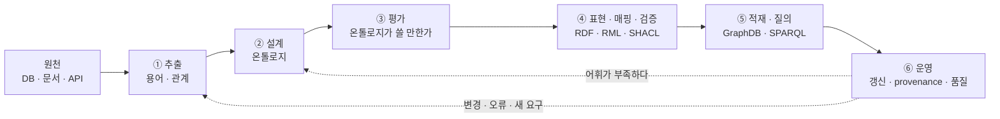
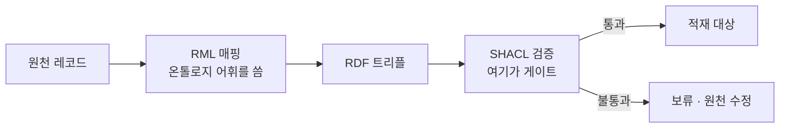
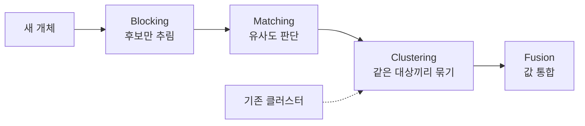

# 온톨로지 · 지식그래프 파이프라인

> 2026-08-14 | 온톨로지, 지식그래프, RDF, SHACL, 파이프라인

[온톨로지 & 지식그래프 강의](../../강의/온톨로지-지식그래프/README.md)에서 회차별로 배운 것을
하나의 파이프라인으로 꿰어 놓은 문서다. 강의는 원론 위주라, 여기서는 각 단계에 실제로 쓰는 도구를
같이 적었다. 자세한 내용은 회차 노트로 링크한다.

도구 이름은 어느 자리에 무엇이 있는지 잡아두기 위한 것이다. 실제로 고를 때는 현재 버전과 유지
상태를 확인할 것.

---

## 1. 온톨로지

개념과 관계와 규칙을 명시적으로 정의한 설계도다. 데이터가 아니라 데이터의 의미를 적는다.

```
Customer  places      Order
Order     contains    Product
Product   belongsTo   Category
```

하는 일이 셋으로 갈린다.

| | 묻는 것 |
|---|---|
| 스키마 | 무엇을 어떻게 표현할 것인가. 클래스·속성·계층 |
| 제약 | 어떤 조건을 만족해야 하는가. 배타성·범위·개수 |
| 추론 | 명시되지 않은 무엇을 도출할 수 있는가 |

**주의.** 가운데 제약은 이름과 달리 강제하지 않는다. OWL은 열린 세계 가정이라 위반해도 에러가
아니라 추론이 일어난다. 막는 일은 SHACL이 한다.
[S09-1](../../강의/온톨로지-지식그래프/S09-1-제약처럼-보이는-공리들.md) ·
[S11-1 1절](../../강의/온톨로지-지식그래프/S11-1-온톨로지가-하지-않는-일.md#1-온톨로지는-입력-게이트가-아니다)

## 2. 지식그래프

온톨로지의 의미 구조 위에 실제 개체와 관계를 채운 그래프다. `G = {E, R, F}`로 쓴다. 개체 집합,
관계 집합, `(head, relation, tail)` 형태의 사실 집합.

```
김한결      places      주문 #A1024
주문 #A1024 contains    Galaxy S25
Galaxy S25  belongsTo   스마트폰
```

노드가 식별 가능한 개체를 가리키고 엣지가 의미가 정의된 관계라는 점이 그냥 그래프와 다르다.

[S11 1~6절](../../강의/온톨로지-지식그래프/S11-지식그래프-기초-개념.md)

## 3. 둘의 관계

같은 모양의 문장인데 층이 다르다.

| | 층 | 예시 |
|---|---|---|
| 온톨로지 | 개념 | 고객은 주문을 생성하고, 주문은 상품을 포함한다 |
| 지식그래프 | 개체 | 김민수가 주문 #A1024를 생성했고 거기에 Galaxy S25가 포함되어 있다 |

지식그래프가 데이터와 관계와 의미 구조라면, 온톨로지는 거기에 의미와 추론 능력을 부여하는
레이어다.

되먹임은 한 방향이 아니다. 온톨로지가 KG에 어휘와 추론 규칙을 주고, KG에 쌓인 인스턴스와 사용
기록이 거꾸로 온톨로지의 빈 곳을 드러낸다. 다만 **개별 사실이 온톨로지를 바꾸지는 않는다.**
표현할 어휘가 없거나 분류할 클래스가 없을 때만 바뀌고, 그 판단은 사람이 한다.

[S11-1 3절](../../강의/온톨로지-지식그래프/S11-1-온톨로지가-하지-않는-일.md#3-온톨로지가-바뀌는-때)

## 4. 층 정리

이름들이 섞이기 쉬운 자리다. 셋이 다른 층에 있다.

| 층 | 무엇인가 | 예 |
|---|---|---|
| 데이터 모델·표준 | 명세서. 소프트웨어가 아니다 | RDF · OWL · SPARQL · SHACL / LPG · Cypher |
| 그래프 DB 제품 | 설치해서 돌리는 저장 엔진 | GraphDB · Virtuoso · Jena Fuseki · Stardog · Neptune / Neo4j · Memgraph |
| 지식그래프 | 실제로 채워진 내용물 | DBpedia · Wikidata · YAGO / 사내 도메인 KG |

관계형에 비유하면 RDF와 SPARQL이 관계형 모델과 SQL, GraphDB와 Neo4j가 PostgreSQL과 MySQL,
DBpedia와 Wikidata가 그 안에 적재된 데이터다.

RDF와 LPG 중 무엇을 고를지는 엣지에 속성이 필요한지, 그래프 알고리즘을 돌릴 것인지, 표준
상호운용이 필요한지로 갈린다. 흔히 거론되는 시각화는 기준이 아니다.

## 5. 파이프라인 전체 그림



**순서에 대한 단서 하나.** ①과 ②의 앞뒤는 고정이 아니다. 접근 방향이 셋이다.

| 방향 | 흐름 | 언제 |
|---|---|---|
| Bottom-up | 원천에서 뽑아 온톨로지를 유도 | 도메인 지식이 문서에 몰려 있고 전문가 시간이 부족할 때 |
| Top-down | 전문가와 CQ로 온톨로지를 먼저 세우고 데이터를 맞춤 | 도메인이 좁고 정의가 안정적일 때 |
| Middle-out | 핵심 개념 몇 개를 먼저 잡고, 추출로 채우고, 다시 고침 | 대부분의 실무 |

Bottom-up만으로 밀면 천장이 있다. 자동 추출의 성능은 정답지가 있느냐에 크게 좌우된다.
[S03-1](../../강의/온톨로지-지식그래프/S03-1-자동구축의-천장.md)

## 6. ① 추출 — 원천에서 용어와 관계 뽑기

문장과 표에서 개체 언급을 찾고, 임시 타입을 붙이고, 개체 쌍 사이의 관계를 뽑는다. 이 단계의
산출물은 후보이지 확정된 사실이 아니다.

| 단계 | 하는 일 |
|---|---|
| Mention Detection | 사람·장소·조직 같은 언급이 어디서 시작하고 끝나는지 |
| Entity Typing | 임시 타입 부여 |
| Relation Extraction | 개체 쌍 사이의 의미 관계 |
| Evidence Capture | 근거가 된 문장·문서 ID·위치 저장 |

**도구.**

| 갈래 | 도구 |
|---|---|
| 전통 NLP | spaCy, Stanza |
| 지도학습 | BERT 계열 파인튜닝, REBEL (관계 추출 end-to-end) |
| Zero-shot | GLiNER (타입을 런타임에 지정하는 NER) |
| LLM 기반 | 스키마를 주고 구조화 출력을 받는 방식. OntoGPT/SPIRES가 온톨로지 term에 직접 매어 뽑는다 |

**주의.** Evidence Capture를 빼먹으면 나중에 근거를 못 찾는다. 어느 문장에서 나왔는지를 후보와
함께 들고 가야 한다.

[S03A](../../강의/온톨로지-지식그래프/S03A-용어-추출-P-Mod.md) ·
[S03B](../../강의/온톨로지-지식그래프/S03B-비분류-관계-학습.md) ·
[S12 20절](../../강의/온톨로지-지식그래프/S12-KG-구축에서-온톨로지의-역할.md#20-knowledge-extraction)

## 7. ② 설계 — 온톨로지 만들기

**먼저 재사용할 것을 찾는다.** 처음부터 다 만들면 상호운용이 안 되고 만드는 데도 오래 걸린다.

| 온톨로지 | 쓰는 자리 |
|---|---|
| schema.org | 웹·상품·조직 일반 |
| SOSA / SSN | 센서와 관측 |
| PROV-O | 출처와 생성 이력 |
| QUDT | 단위와 물리량 |
| BFO / IOF | 상위 온톨로지와 제조 도메인 |

**만드는 절차.** OTKM은 킥오프 → 정제 → 평가 → 적용·진화로 돈다. 실무에서 잘 먹히는 진입점은
CQ(Competency Question)다. 규칙을 먼저 만들려 하지 말고, 도메인 전문가가 실제로 답할 수 있는
질문을 모아서 그 질문에 답하는 데 필요한 어휘부터 세운다.

**도구.** Protégé와 WebProtégé가 표준적인 에디터다. 대량 편집과 CI에는 ROBOT 같은 커맨드라인
도구를 쓴다.

**주의.** 온톨로지에 무엇을 넣고 무엇을 규칙 층으로 뺄지를 처음에 정해두는 편이 낫다. 어휘는
수렴하지만 판정 규칙은 계속 늘어나므로, 한 파일에 섞으면 나중에 못 푼다.

[S02](../../강의/온톨로지-지식그래프/S02-설계-원칙.md) ·
[S04](../../강의/온톨로지-지식그래프/S04-온톨로지-엔지니어링-방법론.md) ·
[S12 19절](../../강의/온톨로지-지식그래프/S12-KG-구축에서-온톨로지의-역할.md#19-ontology-management)

## 8. ③ 평가 — 쓸 만한지 확인

대상이 둘이라 방법도 둘이다.

| | 무엇을 평가 | 방법 |
|---|---|---|
| 온톨로지 평가 | 구조가 건강한가 | OQuaRE의 구조 지표. OOPS! 같은 pitfall 스캐너 |
| | 필요한 질문에 답하는가 | CQ를 SPARQL로 바꿔 통과 여부 확인 |
| KG 품질 평가 | 채워진 데이터가 쓸 만한가 | Consistency, Completeness, Timeliness 등 |

**도메인 KG에서 그대로 쓸 수 있는 metric과 아닌 것이 갈린다.** Consistency 계열과 값 충족도는
그대로 쓸 수 있고, 범용 gold standard를 전제하는 커버리지 metric은 대응물이 없어 못 쓴다.

**주의.** 여러 지표를 하나의 점수로 합치면 서로 다른 성격의 축이 같은 무게로 들어간다. 축별로
따로 관리하는 편이 낫다.

[S07](../../강의/온톨로지-지식그래프/S07-구조적-품질-평가-OQuaRE.md) ·
[S08](../../강의/온톨로지-지식그래프/S08-기능적-의미적-평가-CQ.md) ·
[S12-1 4~5절](../../강의/온톨로지-지식그래프/S12-1-선언과-준수-사이.md)

## 9. ④ 표현 · 매핑 · 검증

세 가지가 서로 다른 일을 한다. 이름이 섞이기 쉬운 자리다.

| | 하는 일 | 도구 |
|---|---|---|
| 표현 | 어떤 형식으로 적을 것인가 | RDF (Turtle, N-Triples, JSON-LD), OWL |
| 매핑 | 원천 데이터를 그 형식으로 바꾼다 | RML / YARRRML, Morph-KGC, SDM-RDFizer. 관계형만 다루면 R2RML |
| 검증 | 넣어도 되는 상태인지 막는다 | SHACL (pySHACL), ShEx |



**주의 둘.**

OWL 공리는 게이트가 아니다. `rdfs:range`나 `owl:disjointWith`를 선언해도 어긴 데이터가 들어오고,
추론이 일어날 뿐이다. 막고 싶으면 SHACL을 써야 한다. 실제로 공개 KG들도 여기서 갈린다. 어떤 곳은
선언만 하고 게이트를 안 두어 위반이 쌓이고, 어떤 곳은 제약을 온톨로지 밖 UI와 프로세스로 옮겼다.

OWL 프로파일(EL / QL / RL)은 표현력과 추론 비용의 교환이다. 큰 KG에 full OWL을 걸면 추론이 안
끝난다.

[S09](../../강의/온톨로지-지식그래프/S09-OWL-온톨로지-설계-실습.md) ·
[S12-1 1절](../../강의/온톨로지-지식그래프/S12-1-선언과-준수-사이.md#1-제약은-선언과-준수가-따로-논다)

## 10. ⑤ 적재와 질의

적재만으로 끝나지 않는다. 꺼내 쓰는 경로가 있어야 파이프라인이 완성된다.

| | 선택지 |
|---|---|
| RDF 저장소 | GraphDB, Virtuoso, Apache Jena Fuseki, Stardog, Amazon Neptune, Oxigraph |
| LPG 저장소 | Neo4j, Memgraph |
| 질의 | SPARQL 1.1 (property path, aggregate, CONSTRUCT), Cypher |

**주의.** 추론된 트리플이 저장소에 자동으로 남지는 않는다. 실체화해서 넣을지 질의 시점에 추론할지를
정해야 하고, 안 그러면 export에 안 실린다.

그래프가 진짜 강한 지점은 여러 홉을 건너 비교 대상 집합을 정확히 뽑아내는 일이다. 관계형에서
조인이 겹겹이 쌓이는 질의가 SPARQL에서는 경로 하나로 나온다.

[S10](../../강의/온톨로지-지식그래프/S10-RDF-데이터-파이프라인-실습.md) ·
[S10-1](../../강의/온톨로지-지식그래프/S10-1-파이프라인이-말하지-않은-것들.md)

## 11. ⑥ 운영 — 갱신과 provenance

한 번 만들고 끝나는 물건이 아니다. 원천이 계속 바뀌므로 전체를 다시 만들지 않고 변경분만
반영하는 구조가 필요하다.

**증분 개체 통합.** 새 개체가 들어오면 기존 클러스터와 비교해 붙이거나 새로 만든다.



Fusion에서 값이 충돌하면 셋 중 하나를 고른다. 여러 값을 그대로 두고 선택을 응용에 맡기거나,
하나의 일관된 기준을 적용하거나, 메타데이터까지 보고 결정하거나.

**버전 관리.** 세 방식의 대가가 다르다.

| | 얻는 것 | 잃는 것 |
|---|---|---|
| 전체 스냅샷 | 명확하고 검사가 쉽다 | 저장 공간 |
| 변경분(diff) | 효율적 | 특정 버전 복원이 복잡 |
| 시간 주석 내장 | temporal 질의 가능 | 관리가 복잡 |

**provenance.** 각 사실이 어느 원천에서 언제 어떤 과정으로 생성됐는지를 함께 저장한다. 단계마다
남는 것이 다르고, 자동으로 남는 것은 SHACL 검증뿐이다. SPARQL CONSTRUCT로 만든 트리플은 어느
규칙이 만들었는지를 직접 적어줘야 한다. 트리플 자체에 메타를 붙이려면 named graph가 가장 흔하고,
RDF-star나 reification도 있다.

[S11 11~13절](../../강의/온톨로지-지식그래프/S11-지식그래프-기초-개념.md) ·
[S11-1 5.6절](../../강의/온톨로지-지식그래프/S11-1-온톨로지가-하지-않는-일.md#56-근거를-어디에-남기는가) ·
[S12 16~22절](../../강의/온톨로지-지식그래프/S12-KG-구축에서-온톨로지의-역할.md)

## 12. 아직 안 다룬 것

강의가 남긴 구간이다. 위 파이프라인의 어디에 붙는지로 정리했다.

| 붙는 자리 | 주제 | 회차 |
|---|---|---|
| ① 추출 | LLM 기반 온톨로지·KG 구축 (LLMs4OL, REBEL, Schema-grounded 구축) | S23~S28 |
| ① 추출 | LLM 기반 개체 정렬 (LLMEA) | S30 |
| ② 설계 | CQ 기반 Human-in-the-loop, 멀티에이전트 온톨로지 생성 | S24~S25 |
| ⑤ 질의 밖 | KG 임베딩 (TransE, DistMult) 과 GNN (R-GCN, CompGCN). PyKEEN | S13~S14, S17 |
| ⑤ 질의 밖 | 온톨로지 임베딩·정렬 (OWL2Vec*, BERTMap). DeepOnto | S15~S16, S18 |
| 응용 | 언어모델에 지식 주입 (ERNIE, K-BERT, KEPLER, K-Adapter) | S19~S22 |
| 응용 | 온톨로지 기반 LLM 파인튜닝 (OntoTune) | S32 |
| 확장 | 시계열과 IoT (SSN/SOSA, W3C Time, Brick) | S33~S34 |
| 확장 | 이미지와 멀티모달 (씬 그래프) | S35~S36 |

**한 가지 짚어둘 것.** 임베딩 계열은 파이프라인의 한 단계로 끼워 넣는 것이 아니라 옆에 붙는
별도 트랙이다. 출력이 검증된 사실이 아니라 후보와 점수라, 검증을 거쳐야 KG에 들어간다. 그리고
검증을 통과해도 들어가는 곳은 인스턴스 층이지 온톨로지가 아니다.

[S11-1 2절](../../강의/온톨로지-지식그래프/S11-1-온톨로지가-하지-않는-일.md#2-추론과-링크-예측은-다른-물건이다) ·
[S11-1 5절](../../강의/온톨로지-지식그래프/S11-1-온톨로지가-하지-않는-일.md#5-ai-판정과의-역할-분담)

---

## 참고

- [온톨로지 & 지식그래프 강의 정리](../../강의/온톨로지-지식그래프/README.md) — 회차별 상세
- [`Projects/ontology-pipeline/docs/`](../../../Projects/ontology-pipeline/) — 실무 과제의 구현 문서
- [Work_History — 파이프라인은 완주했는데, 공장에서 명장을 만나고 다시 막막해졌다](../../../Work_History/2026-06-온톨로지-파이프라인-학습.md)
